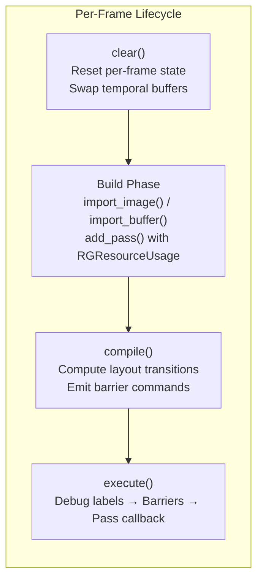
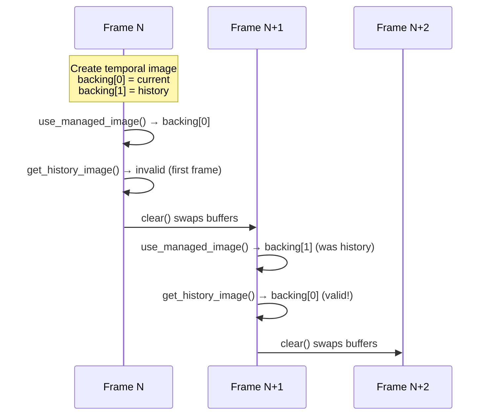
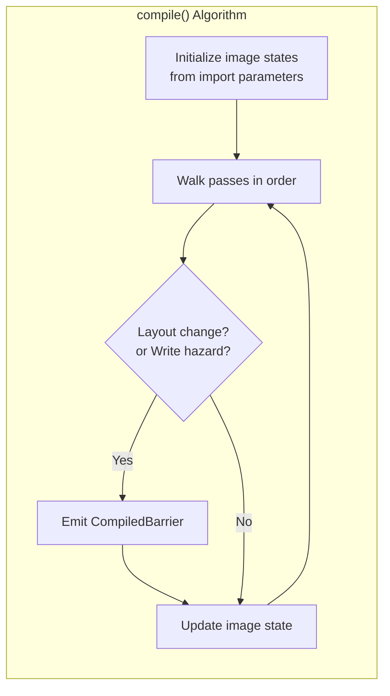
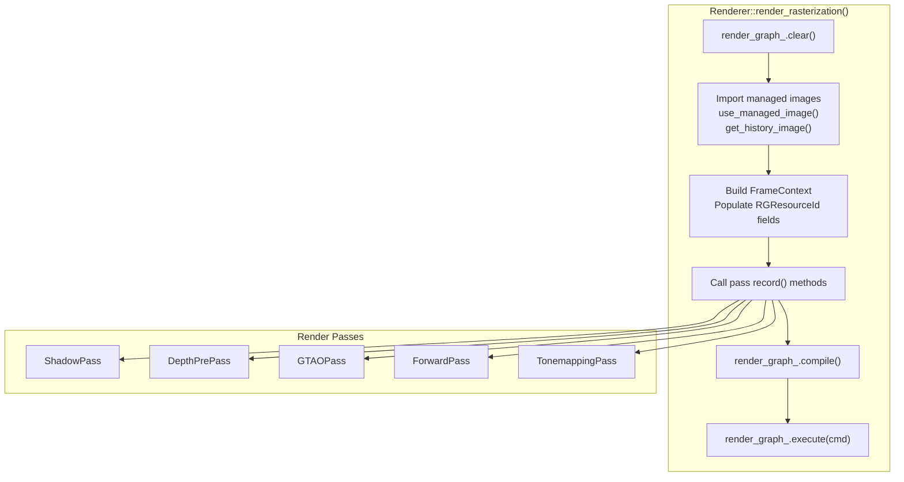

The Render Graph is Himalaya's frame-level rendering orchestration layer, responsible for automatic synchronization barrier insertion, resource state tracking, and pass scheduling. It eliminates the manual barrier management burden that typically plagues Vulkan renderers while providing a declarative API for expressing render pass dependencies. The system is designed around a "build every frame" philosophy, allowing complete flexibility in pass ordering and resource usage patterns on a per-frame basis.

Sources: [render_graph.h](https://github.com/1PercentSync/himalaya/blob/main/framework/include/himalaya/framework/render_graph.h#L1-L504), [render_graph.cpp](https://github.com/1PercentSync/himalaya/blob/main/framework/src/render_graph.cpp#L1-L580)

## Core Architecture

The render graph operates on a three-phase lifecycle that repeats every frame: **clear** → **build** → **compile** → **execute**. During the build phase, the renderer imports external GPU resources and registers render passes with their resource dependencies. The compile phase walks these declarations to compute optimal image layout transitions and synchronization barriers. Finally, execute runs passes in registration order, automatically inserting the computed barriers between them.



This architecture separates resource declaration from execution, enabling the graph to perform global analysis for optimal barrier placement. Passes declare **what** resources they use and **how** they access them; the graph determines **when** barriers are needed.

Sources: [render_graph.h](https://github.com/1PercentSync/himalaya/blob/main/framework/include/himalaya/framework/render_graph.h#L215-L235), [render_graph.cpp](https://github.com/1PercentSync/himalaya/blob/main/framework/src/render_graph.cpp#L400-L480)

## Resource Management Model

The render graph uses a dual-handle system distinguishing between persistent managed resources and per-frame resource identifiers. **RGManagedHandle** represents a long-lived resource (like the HDR color buffer or depth buffer) that persists across frames. **RGResourceId** is a per-frame identifier valid only within the current frame's graph instance.

| Handle Type | Lifetime | Use Case | Key Methods |
|-------------|----------|----------|-------------|
| `RGManagedHandle` | Persistent (cross-frame) | Render targets, history buffers | `create_managed_image()`, `destroy_managed_image()` |
| `RGResourceId` | Per-frame | Pass resource declarations | `import_image()`, `use_managed_image()` |

Managed images support two sizing modes: **Relative** (fraction of reference resolution for screen-sized targets) and **Absolute** (fixed pixel dimensions for resolution-independent resources like shadow maps). Relative images automatically rebuild when `set_reference_resolution()` is called with a different extent.

Sources: [render_graph.h](https://github.com/1PercentSync/himalaya/blob/main/framework/include/himalaya/framework/render_graph.h#L26-L76), [render_graph.cpp](https://github.com/1PercentSync/himalaya/blob/main/framework/src/render_graph.cpp#L140-L180)

## Temporal Resource Double-Buffering

Temporal effects require access to previous frame data. The render graph provides built-in support through the `temporal` flag in `create_managed_image()`. When enabled, the graph allocates two backing images and automatically swaps them each frame during `clear()`. The current frame accesses history via `get_history_image()`, which returns the previous frame's data with appropriate layout transitions.



The `is_history_valid()` method reports whether history contains valid data, returning false on the first frame after creation or resize. This enables passes to adjust temporal blend factors appropriately.

Sources: [render_graph.h](https://github.com/1PercentSync/himalaya/blob/main/framework/include/himalaya/framework/render_graph.h#L340-L360), [render_graph.cpp](https://github.com/1PercentSync/himalaya/blob/main/framework/src/render_graph.cpp#L100-L120)

## Pass Declaration and Resource Usage

Passes declare their resource dependencies through `RGResourceUsage` structures that specify the resource, access type (Read/Write/ReadWrite), and pipeline stage context. The stage context determines the Vulkan image layout and synchronization scope for barrier computation.

```cpp
// Example from ForwardPass
std::vector<framework::RGResourceUsage> resources;
resources.push_back({ctx.hdr_color, framework::RGAccessType::Write,
                     framework::RGStage::ColorAttachment});
resources.push_back({ctx.depth, framework::RGAccessType::Read,
                     framework::RGStage::DepthAttachment});
resources.push_back({ctx.ao_filtered, framework::RGAccessType::Read,
                     framework::RGStage::Fragment});

rg.add_pass("Forward", resources, execute_callback);
```

The supported stage contexts cover the full range of Vulkan pipeline usage: `ColorAttachment`, `DepthAttachment`, `Fragment`, `Compute`, `Transfer`, `RayTracing`, and `Vertex`. Each (access, stage) combination maps to specific Vulkan layout, pipeline stage, and access flags through the internal `resolve_usage()` function.

Sources: [render_graph.h](https://github.com/1PercentSync/himalaya/blob/main/framework/include/himalaya/framework/render_graph.h#L130-L155), [render_graph.cpp](https://github.com/1PercentSync/himalaya/blob/main/framework/src/render_graph.cpp#L80-L140)

## Automatic Barrier Generation

The compilation phase tracks each image's current layout and last access flags across all passes. Barriers are emitted when either the layout changes or a data hazard is detected (RAW, WAW, or WAR dependencies). Read-after-read (RAR) accesses to the same layout require no synchronization.



The hazard detection logic identifies write operations through a bitmask of write access flags (`COLOR_ATTACHMENT_WRITE`, `DEPTH_STENCIL_ATTACHMENT_WRITE`, `TRANSFER_WRITE`, `SHADER_STORAGE_WRITE`). Any transition from or to these flags triggers barrier insertion.

Sources: [render_graph.cpp](https://github.com/1PercentSync/himalaya/blob/main/framework/src/render_graph.cpp#L400-L460)

## Integration with Render Passes

Render passes integrate with the graph through their `record()` method, which receives a `RenderGraph&` and `FrameContext&`. The FrameContext contains pre-populated `RGResourceId` values for all frame resources, allowing passes to focus on their specific resource declarations rather than resource management.

```cpp
void GTAOPass::record(RenderGraph &rg, const FrameContext &ctx) {
    const std::array resources = {
        RGResourceUsage{ctx.depth, RGAccessType::Read, RGStage::Compute},
        RGResourceUsage{ctx.normal, RGAccessType::Read, RGStage::Compute},
        RGResourceUsage{ctx.ao_noisy, RGAccessType::Write, RGStage::Compute},
    };

    rg.add_pass("GTAO", resources, [this, &rg, &ctx](https://github.com/1PercentSync/himalaya/blob/main/CommandBuffer &cmd) {
        // Pass execution logic
        auto ao_handle = rg.get_image(ctx.ao_noisy);
        // ... bind pipeline, dispatch compute
    });
}
```

The separation between resource declaration (the `resources` array) and execution (the lambda) enables the graph to perform barrier analysis without executing any actual rendering commands.

Sources: [gtao_pass.cpp](https://github.com/1PercentSync/himalaya/blob/main/passes/src/gtao_pass.cpp#L120-L177), [forward_pass.cpp](https://github.com/1PercentSync/himalaya/blob/main/passes/src/forward_pass.cpp#L200-L241)

## Frame Context Resource Flow

The FrameContext serves as the central hub for per-frame resource identifiers. The renderer populates it after importing all managed images and before calling any pass record methods.



This pattern ensures all passes operate on consistent resource identifiers while maintaining loose coupling between the renderer and individual passes.

Sources: [renderer_rasterization.cpp](https://github.com/1PercentSync/himalaya/blob/main/app/src/renderer_rasterization.cpp#L200-L368), [frame_context.h](https://github.com/1PercentSync/himalaya/blob/main/framework/include/himalaya/framework/frame_context.h#L1-L151)

## Debug Visualization

The render graph automatically assigns distinct debug colors to each pass using a golden-angle hue distribution. These colors appear in graphics debuggers (RenderDoc, Nsight) to visually distinguish pass boundaries in the command stream. The saturation and value are fixed for good visibility across the color spectrum.

Sources: [render_graph.cpp](https://github.com/1PercentSync/himalaya/blob/main/framework/src/render_graph.cpp#L20-L50)

## Comparison with Manual Barrier Management

| Aspect | Manual Barriers | Render Graph |
|--------|----------------|--------------|
| **Barrier placement** | Developer manually inserts at every transition | Automatically computed from declarations |
| **Layout tracking** | Developer maintains mental/comment state | Tracked automatically during compile() |
| **Pass reordering** | Requires re-analyzing all barriers | Simply reorder add_pass() calls |
| **Temporal resources** | Manual double-buffer management | Built-in swap in clear() |
| **Debugging** | Hard to verify correctness | Debug labels + validation layer |
| **Runtime overhead** | Minimal (direct API calls) | One extra indirection per pass |

The render graph trades a small amount of CPU overhead for significantly improved maintainability and correctness guarantees. The "build every frame" design ensures the graph can adapt to dynamic feature toggles and changing resource requirements without complex invalidation logic.

## Related Documentation

For understanding how the render graph fits into the broader frame structure, see [Frame Flow and Render Graph Design](https://github.com/1PercentSync/himalaya/blob/main/34-frame-flow-and-render-graph-design). For the underlying RHI resource management that the graph builds upon, refer to [Resource Management (Buffers, Images, Samplers)](https://github.com/1PercentSync/himalaya/blob/main/8-resource-management-buffers-images-samplers). The specific render passes that use this system are documented in their respective pages: [Depth PrePass and Forward Rendering](https://github.com/1PercentSync/himalaya/blob/main/18-depth-prepass-and-forward-rendering), [Ambient Occlusion (GTAO)](https://github.com/1PercentSync/himalaya/blob/main/20-ambient-occlusion-gtao), and [Post-Processing Pipeline](https://github.com/1PercentSync/himalaya/blob/main/22-post-processing-pipeline).