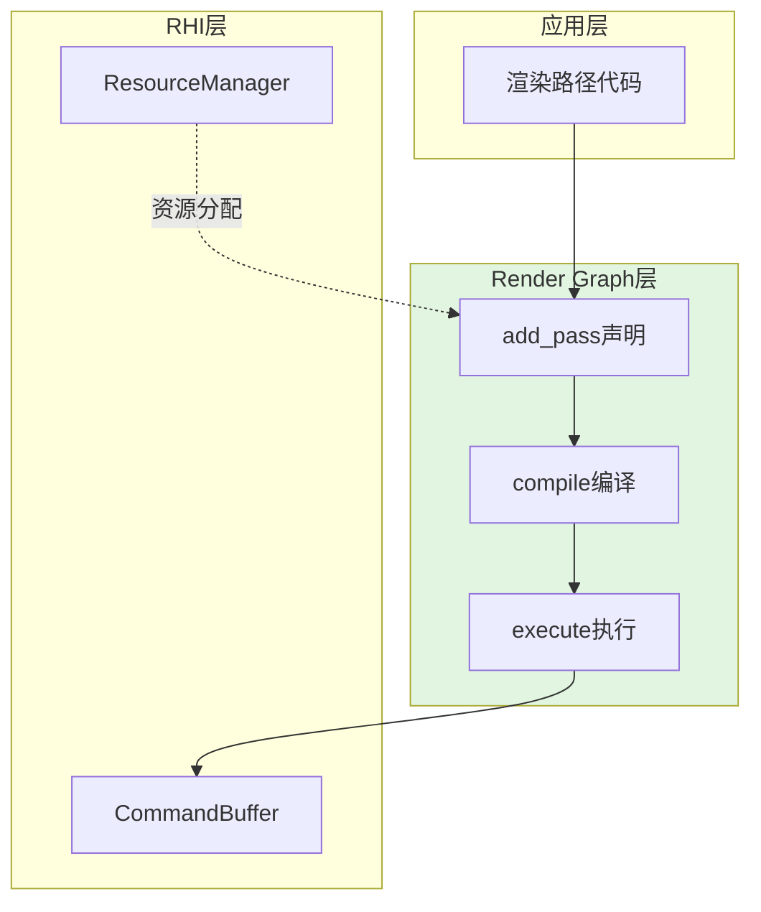

Render Graph是Himalaya渲染器的核心调度层，负责**声明式地定义渲染管线**，并**自动推导资源依赖关系与同步屏障**。通过将渲染流程抽象为Pass节点与资源边的有向图，系统能够在编译期完成图像布局转换、流水线屏障与内存访问标记的批量优化，从而在运行时仅需执行预计算的命令序列。

Render Graph采用两阶段设计：**编译阶段**构建依赖图并生成屏障序列，**执行阶段**按序提交GPU命令。这种架构使上层渲染代码无需关心Vulkan的复杂同步语义，同时保持接近手写优化的性能。

Sources: [render_graph.cpp](https://github.com/1PercentSync/himalaya/blob/main/framework/src/render_graph.cpp#L417-L518)

## 核心架构

### 整体数据流

Render Graph在渲染器架构中位于**渲染框架层**，承上启下：

- **上层**：Raster/PT渲染路径定义Pass序列与资源绑定
- **下层**：RHI层提供Buffer/Image/Sampler的GPU资源管理



Sources: [render_graph.cpp](https://github.com/1PercentSync/himalaya/blob/main/framework/src/render_graph.cpp#L60-L63), [renderer_init.cpp](https://github.com/1PercentSync/himalaya/blob/main/app/src/renderer_init.cpp#L39-L40)

### 资源抽象体系

Render Graph管理三类资源：导入资源、托管资源与中间资源。

**导入资源(Imported)** 用于将外部创建的GPU资源接入Render Graph生命周期。典型的导入资源包括Swapchain Image、阴影贴图Atlas、IBL预计算Cubemap等。导入时需指定**初始布局**与**最终布局**，Render Graph将自动在管线起点与终点插入必要的布局转换屏障。

**托管资源(Managed)** 是Render Graph全权管理的临时纹理，支持两种尺寸模式：
- **Absolute模式**：固定像素尺寸，适用于分辨率无关的缓冲区
- **Relative模式**：相对于参考分辨率的比例缩放，自动响应窗口尺寸变化

托管资源支持**时域双缓冲(Temporal)**，通过`create_managed_image(..., temporal=true)`创建。时域资源在`clear()`时自动交换当前帧与历史帧的backing image，为TAA、AO时域降噪等效果提供帧间数据持久化。

Sources: [render_graph.cpp](https://github.com/1PercentSync/himalaya/blob/main/framework/src/render_graph.cpp#L65-L88), [render_graph.cpp](https://github.com/1PercentSync/himalaya/blob/main/framework/src/render_graph.cpp#L278-L317), [render_graph.cpp](https://github.com/1PercentSync/himalaya/blob/main/framework/src/render_graph.cpp#L102-L118)

## 资源创建与生命周期

### 托管资源配置

托管资源通过`RGImageDesc`结构描述，包含以下关键字段：

| 字段 | 类型 | 说明 |
|------|------|------|
| `size_mode` | `RGSizeMode` | `Absolute`或`Relative`尺寸模式 |
| `width_scale`/`height_scale` | `float` | Relative模式下的比例系数(如0.5f表示半分辨率) |
| `format` | `rhi::Format` | 像素格式，决定图像用途 |
| `usage` | `rhi::ImageUsage` | 使用掩码(ColorAttachment/Storage/Sampled等) |
| `mip_levels` | `uint32_t` | Mipmap层级数(1表示无Mipmap) |
| `sample_count` | `uint32_t` | MSAA采样数(1表示无多重采样) |

创建时域资源需额外指定`temporal=true`，系统会自动分配双份GPU内存并通过`get_history_image()`API暴露历史帧访问。

Sources: [renderer_init.cpp](https://github.com/1PercentSync/himalaya/blob/main/app/src/renderer_init.cpp#L44-L71), [render_graph.cpp](https://github.com/1PercentSync/himalaya/blob/main/framework/src/render_graph.cpp#L253-L276)

### 窗口尺寸自适应

Relative模式的核心价值在于**分辨率无关性**。当窗口尺寸变化时，Renderer调用`set_reference_resolution()`通知Render Graph，系统自动重建所有Relative托管资源：

```cpp
// 创建半分辨率AO缓冲区
managed_ao_noisy_ = render_graph_.create_managed_image("AO Noisy", {
    .size_mode = framework::RGSizeMode::Relative,
    .width_scale = 1.0f,
    .height_scale = 1.0f,  // 可改为0.5f实现半分辨率
    .format = rhi::Format::R8G8B8A8Unorm,
    .usage = rhi::ImageUsage::Storage | rhi::ImageUsage::Sampled,
}, false);
```

尺寸变化时的重建逻辑会检查resolved属性(宽/高/格式/采样数/使用掩码/Mip层级)的实际变化，避免不必要的GPU内存重新分配。对于时域资源，重建会同时销毁并重创backing与history_backing，并标记history为无效状态。

Sources: [render_graph.cpp](https://github.com/1PercentSync/himalaya/blob/main/framework/src/render_graph.cpp#L215-L251)

### 时域资源双缓冲机制

时域资源的帧间数据流转通过`clear()`中的交换操作实现：

```cpp
void RenderGraph::clear() {
    for (auto &managed: managed_images_) {
        if (!managed.is_temporal || !managed.backing.valid()) continue;
        std::swap(managed.backing, managed.history_backing);
        managed.history_valid_ = managed.temporal_frame_count_ > 0;
        ++managed.temporal_frame_count_;
    }
}
```

交换后，当前帧的backing变为上一帧的历史数据。Pass通过`use_managed_image()`访问当前帧数据，通过`get_history_image()`访问历史帧数据。历史帧的有效性可通过`is_history_valid()`查询，首帧或尺寸变化后历史帧标记为无效。

Sources: [render_graph.cpp](https://github.com/1PercentSync/himalaya/blob/main/framework/src/render_graph.cpp#L102-L118), [render_graph.cpp](https://github.com/1PercentSync/himalaya/blob/main/framework/src/render_graph.cpp#L339-L364)

## Pass声明与资源绑定

### 渲染Pass定义

渲染Pass通过`add_pass()`声明，包含三个要素：
- **名称**：用于调试标记与性能分析
- **资源数组**：该Pass读取或写入的资源及访问模式
- **执行回调**：lambda或函数对象，接收`CommandBuffer&`执行实际渲染命令

```cpp
render_graph_.add_pass("Forward Pass", 
    std::span<const RGResourceUsage>{...},
    [this, &input](https://github.com/1PercentSync/himalaya/blob/main/rhi::CommandBuffer &cmd) {
        // 实际渲染命令
        forward_pass_.render(cmd, ...);
    });
```

Sources: [render_graph.cpp](https://github.com/1PercentSync/himalaya/blob/main/framework/src/render_graph.cpp#L120-L128)

### 资源使用描述

`RGResourceUsage`结构精确描述Pass对资源的访问需求：

| 字段 | 类型 | 含义 |
|------|------|------|
| `resource` | `RGResourceId` | 资源标识符(由import/use_managed返回) |
| `access` | `RGAccessType` | `Read`/`Write`/`ReadWrite` |
| `stage` | `RGStage` | 访问阶段(ColorAttachment/Fragment/Compute等) |

访问模式与阶段的组合决定Vulkan的图像布局、流水线阶段与内存访问标志。Render Graph内置的`resolve_usage()`函数将高层抽象映射到具体的Vulkan同步原语。

Sources: [render_graph.cpp](https://github.com/1PercentSync/himalaya/blob/main/framework/src/render_graph.cpp#L130-L213)

### 访问模式映射

以下是关键访问组合到Vulkan原语的映射关系：

| RGStage | RGAccessType | 图像布局 | 流水线阶段 | 访问标志 |
|---------|--------------|----------|------------|----------|
| ColorAttachment | Write | COLOR_ATTACHMENT_OPTIMAL | COLOR_ATTACHMENT_OUTPUT | COLOR_ATTACHMENT_WRITE |
| DepthAttachment | Read | DEPTH_READ_ONLY_OPTIMAL | EARLY/LATE_FRAGMENT_TESTS | DEPTH_STENCIL_ATTACHMENT_READ |
| DepthAttachment | Write | DEPTH_ATTACHMENT_OPTIMAL | EARLY/LATE_FRAGMENT_TESTS | DEPTH_STENCIL_ATTACHMENT_WRITE |
| Fragment | Read | SHADER_READ_ONLY_OPTIMAL | FRAGMENT_SHADER | SHADER_SAMPLED_READ |
| Compute | Read | SHADER_READ_ONLY_OPTIMAL | COMPUTE_SHADER | SHADER_SAMPLED_READ |
| Compute | Write | GENERAL | COMPUTE_SHADER | SHADER_STORAGE_WRITE |
| Compute | ReadWrite | GENERAL | COMPUTE_SHADER | SHADER_STORAGE_READ \| WRITE |
| Transfer | Read | TRANSFER_SRC_OPTIMAL | COPY | TRANSFER_READ |
| Transfer | Write | TRANSFER_DST_OPTIMAL | COPY | TRANSFER_WRITE |
| RayTracing | Read/Write | SHADER_READ_ONLY/GENERAL | RAY_TRACING_SHADER | 相应SHADER_*标志 |

未列出的组合会触发断言失败，确保所有实际使用的访问模式都有明确定义。

Sources: [render_graph.cpp](https://github.com/1PercentSync/himalaya/blob/main/framework/src/render_graph.cpp#L133-L213)

## 屏障编译与执行

### 依赖分析与屏障生成

`compile()`阶段执行核心的**数据依赖分析**：

1. **初始化状态**：根据`initial_layout`设置各图像的起始布局
2. **逐Pass遍历**：对每个资源访问，检查与前一次访问的依赖关系
3. **危害检测**：识别四种数据危害：
   - RAW(Read-After-Write)：需要等待写入完成
   - WAW(Write-After-Write)：需要保证写入顺序
   - WAR(Write-After-Read)：需要等待读取完成
   - RAR(Read-After-Read)：无需屏障
4. **屏障聚合**：按Pass聚合所有需要的屏障，避免逐资源单独提交

布局转换与访问同步的触发条件为：`layout_change || has_hazard`。

Sources: [render_graph.cpp](https://github.com/1PercentSync/himalaya/blob/main/framework/src/render_graph.cpp#L417-L491)

### 最终布局转换

编译阶段最后处理**最终布局转换**：遍历所有导入的图像资源，如果`final_layout`不为UNDEFINED且与当前布局不同，则生成帧末屏障序列。这些屏障在`execute()`的Pass执行完毕后统一提交。

托管资源使用UNDEFINED作为`final_layout`哨兵值，表示其内容不跨帧持久化，无需帧末转换。

Sources: [render_graph.cpp](https://github.com/1PercentSync/himalaya/blob/main/framework/src/render_graph.cpp#L493-L517)

### 执行阶段

`execute()`按序执行已编译的Pass序列：

1. 插入调试标记(BeginDebugLabel)，支持RenderDoc/NSight可视化
2. 提交该Pass的预计算屏障
3. 执行Pass的渲染回调
4. 结束调试标记
5. 所有Pass完成后，提交最终布局转换屏障

调试标记使用黄金角分布生成独特的RGB颜色，确保相邻Pass在调试器中有明显视觉区分。

Sources: [render_graph.cpp](https://github.com/1PercentSync/himalaya/blob/main/framework/src/render_graph.cpp#L520-L578), [render_graph.cpp](https://github.com/1PercentSync/himalaya/blob/main/framework/src/render_graph.cpp#L17-L58)

## 实际使用模式

### 典型渲染管线资源流

以光栅化渲染路径为例，展示Render Graph的资源编排：

```cpp
// 1. 导入/使用托管资源
auto depth = render_graph_.use_managed_image(managed_depth_, 
    VK_IMAGE_LAYOUT_SHADER_READ_ONLY_OPTIMAL, true);  // 保留内容用于AO
auto hdr = render_graph_.use_managed_image(managed_hdr_color_, 
    VK_IMAGE_LAYOUT_SHADER_READ_ONLY_OPTIMAL, false); // 每帧重建
auto history_depth = render_graph_.get_history_image(managed_depth_);

// 2. 声明Pass序列
// Depth Prepass: 写入Depth
// Forward Pass: 读取Depth, 写入HDR Color
// GTAO Pass: 读取Current+History Depth, 写入AO
// Spatial Filter: 读取AO, 写入Blurred AO
// Temporal Filter: 读取Blurred AO+History AO, 写入Filtered AO
// Tonemapping: 读取HDR Color, 写入Swapchain
```

Sources: [renderer_rasterization.cpp](https://github.com/1PercentSync/himalaya/blob/main/app/src/renderer_rasterization.cpp#L200-L368)

### 尺寸变化处理

Renderer在`on_resize()`回调中同步更新Render Graph的参考分辨率：

```cpp
void Renderer::on_resize() {
    render_graph_.set_reference_resolution(swapchain_->extent);
    // 重新导入Swapchain Image(可能已重建)
    register_swapchain_images();
}
```

所有Relative托管资源自动响应尺寸变化，时域资源的历史帧被标记为无效直到新的当前帧完成渲染。

Sources: [render_graph.cpp](https://github.com/1PercentSync/himalaya/blob/main/framework/src/render_graph.cpp#L215-L251)

## 设计权衡与约束

### 显式依赖 vs 自动推导

Himalaya的Render Graph采用**显式资源声明**策略：开发者必须在`add_pass()`中精确列出该Pass访问的所有资源。相比完全自动推导(通过分析Shader反射或命令流)，显式声明带来以下权衡：

| 优势 | 代价 |
|------|------|
| 编译期可验证完整性 | 代码冗余，资源列表与实现可能不同步 |
| 清晰的依赖可视化 | 新增资源需修改多处代码 |
| 便于调试与性能分析 | 学习成本较高 |

当前实现通过`assert`验证资源类型匹配，运行时错误可快速定位。

### 即时模式 vs 保留模式

Render Graph采用**每帧重建**的即时模式设计：`clear()`重置所有状态，下一帧重新声明Pass与资源绑定。相比保留模式(只声明一次，自动检测变化)，即时模式的优势：

- 动态管线切换(如Raster/PT模式切换)实现简单
- 条件Pass(如阴影开关)无需复杂的条件编译逻辑
- 代码可读性高，渲染流程一目了然

代价是每帧有少量CPU开销(屏障编译)，但对于中等复杂度管线(10-20个Pass)可忽略不计。

### 单队列假设

当前实现针对**单图形队列**优化，所有Pass串行执行。异步计算管线(Compute队列与Graphics队列并行)需要扩展屏障系统以支持跨队列同步信号量。

Sources: [render_graph.cpp](https://github.com/1PercentSync/himalaya/blob/main/framework/src/render_graph.cpp#L102-L118)

## 相关页面

- [RHI层 - Vulkan抽象层](https://github.com/1PercentSync/himalaya/blob/main/8-rhiceng-vulkanchou-xiang-ceng) — 了解底层GPU资源管理
- [时域数据与Temporal Filtering](https://github.com/1PercentSync/himalaya/blob/main/15-shi-yu-shu-ju-yu-temporal-filtering) — 深入理解时域资源的双缓冲机制
- [渲染框架层 - 资源与图管理](https://github.com/1PercentSync/himalaya/blob/main/9-xuan-ran-kuang-jia-ceng-zi-yuan-yu-tu-guan-li) — Render Graph所处的架构位置
- [渲染Pass层 - 效果实现](https://github.com/1PercentSync/himalaya/blob/main/10-xuan-ran-passceng-xiao-guo-shi-xian) — 使用Render Graph声明Pass的实际案例