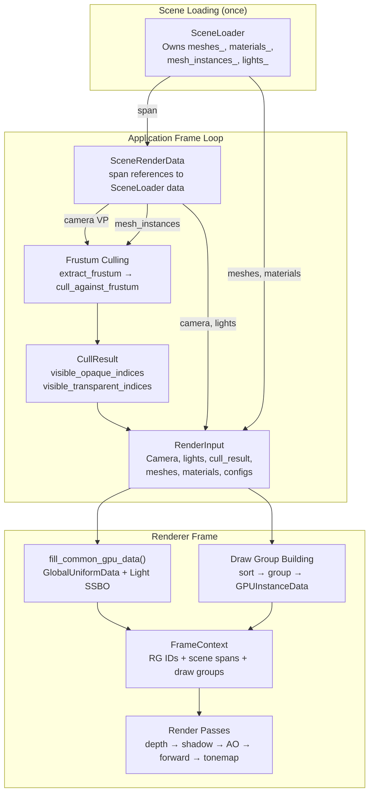
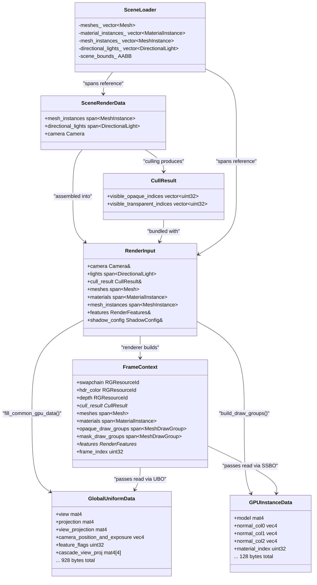

The **scene data contract** is the architectural membrane that separates the application's scene management from the renderer's GPU execution. In Himalaya, this contract is realized through a set of plain-old-data structures defined in `scene_data.h` — a single header with no `.cpp` file. The application layer fills these structures each frame, the renderer consumes them read-only, and the GPU receives translated versions through mapped buffers. This page covers the three pillars of that contract: the CPU-side scene representation, the GPU-side data layouts with their compile-time validation, and the frustum culling system that gates which objects reach the renderer at all.

Sources: [scene_data.h](https://github.com/1PercentSync/himalaya/blob/main/framework/include/himalaya/framework/scene_data.h#L1-L10), [culling.h](https://github.com/1PercentSync/himalaya/blob/main/framework/include/himalaya/framework/culling.h#L1-L6)

## The Data Flow: Scene Loader → Application → Renderer → GPU

Before examining individual structures, it is essential to understand how scene data flows through the system each frame. The `SceneLoader` owns all loaded GPU resources persistently. Each frame, `Application` assembles non-owning `std::span` references into a `SceneRenderData` struct, runs frustum culling to produce a `CullResult`, then packages everything into a `RenderInput` for the `Renderer`. The renderer translates CPU data into GPU buffers (Global UBO, Light SSBO, Instance SSBO) and passes a `FrameContext` to each render pass.



This design ensures **zero copying of scene data** — spans reference the `SceneLoader`'s vectors directly. The only data that gets copied each frame is the small set of per-frame parameters (matrices, feature flags, etc.) into the GPU-mapped UBO buffer.

Sources: [scene_data.h](https://github.com/1PercentSync/himalaya/blob/main/framework/include/himalaya/framework/scene_data.h#L87-L102), [renderer.h](https://github.com/1PercentSync/himalaya/blob/main/app/include/himalaya/app/renderer.h#L52-L58), [application.cpp](https://github.com/1PercentSync/himalaya/blob/main/app/src/application.cpp#L368-L374)

## CPU-Side Scene Representation

### MeshInstance — A Renderable Object in World Space

`MeshInstance` is the fundamental unit of scene rendering. Each instance represents one glTF primitive placed somewhere in the world, referencing a mesh resource and a material by index. The application is responsible for computing `world_bounds` from the mesh's local AABB and the transform matrix at load time — this AABB is what the frustum culler tests against.

| Field | Type | Purpose |
|-------|------|---------|
| `mesh_id` | `uint32_t` | Index into the loaded `Mesh` array (vertex/index buffer handles) |
| `material_id` | `uint32_t` | Index into the `MaterialInstance` array (alpha mode, buffer offset) |
| `transform` | `glm::mat4` | World-space model matrix |
| `prev_transform` | `glm::mat4` | Previous frame's transform (reserved for motion vectors) |
| `world_bounds` | `AABB` | World-space bounding box for frustum culling |

The `prev_transform` field exists for future motion-vector support (Milestone 2+) and is initialized to identity. It does not affect the current Milestone 1 rendering pipeline. The `AABB` struct is a simple `{min, max}` pair of `glm::vec3`, with the convention that `min` holds the most-negative corner and `max` the most-positive.

Sources: [scene_data.h](https://github.com/1PercentSync/himalaya/blob/main/framework/include/himalaya/framework/scene_data.h#L30-L66)

### SceneRenderData — The Renderer's Read-Only Input

`SceneRenderData` is the aggregate container the application assembles each frame. It holds three non-owning spans plus a camera copy:

```cpp
struct SceneRenderData {
    std::span<const MeshInstance> mesh_instances;
    std::span<const DirectionalLight> directional_lights;
    Camera camera;
};
```

The camera is copied by value (not referenced via span) because the application updates it each frame — the copy is cheap (a few matrices and floats) and ensures the renderer sees a consistent snapshot. Lights and mesh instances are referenced by span, pointing directly into `SceneLoader`'s storage or into application-local light structures (fallback light, HDR sun light).

The light source selection logic in `Application::update()` resolves three modes: **Scene** (glTF KHR_lights_punctual), **HdrSun** (direction computed from user-placed sun position on the equirectangular map), and **Fallback** (yaw/pitch-controlled test light). Regardless of mode, the resulting span is stored in `SceneRenderData` identically.

Sources: [scene_data.h](https://github.com/1PercentSync/himalaya/blob/main/framework/include/himalaya/framework/scene_data.h#L87-L102), [application.cpp](https://github.com/1PercentSync/himalaya/blob/main/app/src/application.cpp#L348-L374)

### DirectionalLight — Sun/Moon Illumination

A single `DirectionalLight` encodes all information needed for both direct shading and shadow cascade computation:

| Field | Type | Purpose |
|-------|------|---------|
| `direction` | `glm::vec3` | Normalized direction **toward** the scene (light travel direction) |
| `color` | `glm::vec3` | Linear-space RGB color |
| `intensity` | `float` | Scalar multiplier |
| `cast_shadows` | `bool` | Whether this light triggers shadow cascade computation |

The direction convention is important: it points **from light toward scene** (not from scene toward light). This matches the standard shadow mapping convention where the light's view matrix looks along the direction vector.

Sources: [scene_data.h](https://github.com/1PercentSync/himalaya/blob/main/framework/include/himalaya/framework/scene_data.h#L68-L85)

### RenderInput — Application-to-Renderer Per-Frame Contract

While `SceneRenderData` is the framework-level abstraction, `RenderInput` is the application-layer struct that carries everything the renderer needs for one frame. It bundles the scene data with rendering configuration:

```cpp
struct RenderInput {
    uint32_t image_index;         // swapchain image
    uint32_t frame_index;         // frame-in-flight (0 or 1)
    RenderMode render_mode;       // Rasterization or PathTracing
    const Camera& camera;
    span<const DirectionalLight> lights;
    const CullResult& cull_result;
    span<const Mesh> meshes;
    span<const MaterialInstance> materials;
    span<const MeshInstance> mesh_instances;
    float ibl_intensity, exposure;
    const RenderFeatures& features;
    const ShadowConfig& shadow_config;
    const AOConfig& ao_config;
    const ContactShadowConfig& contact_shadow_config;
    const AABB& scene_bounds;
};
```

Every field is a non-owning reference or a small value. The struct is assembled in `Application::render()` and passed immediately to `Renderer::render()`. No heap allocation occurs in this path — the cull result vectors are reused across frames.

Sources: [renderer.h](https://github.com/1PercentSync/himalaya/blob/main/app/include/himalaya/app/renderer.h#L59-L116), [application.cpp](https://github.com/1PercentSync/himalaya/blob/main/app/src/application.cpp#L549-L576)

## Render Configuration Structures

### RenderMode — Pipeline Selection

The `RenderMode` enum switches between the two rendering paths at the coarsest level: **Rasterization** activates the full multi-pass pipeline (depth prepass → shadows → AO → forward → tonemapping), while **PathTracing** activates ray tracing with progressive accumulation. The renderer checks this flag in `render()` and dispatches accordingly, with a safety check that falls back to rasterization if the TLAS is invalid.

Sources: [scene_data.h](https://github.com/1PercentSync/himalaya/blob/main/framework/include/himalaya/framework/scene_data.h#L127-L130)

### RenderFeatures — Runtime Effect Toggles

`RenderFeatures` is a collection of boolean flags that enable or disable entire render passes at runtime. The Debug UI modifies these fields directly, and the renderer checks them to conditionally record passes into the render graph:

| Flag | Effect When Enabled |
|------|-------------------|
| `skybox` | `SkyboxPass` renders the IBL cubemap as background |
| `shadows` | `ShadowPass` renders CSM; forward pass samples shadow map |
| `ao` | `GTAOPass` + `AOSpatialPass` + `AOTemporalPass` run; forward applies AO/SO |
| `contact_shadows` | `ContactShadowsPass` runs per-pixel ray march; forward applies mask |

These flags are also compressed into a bitmask in the Global UBO's `feature_flags` field, so shaders can conditionally branch on them.

Sources: [scene_data.h](https://github.com/1PercentSync/himalaya/blob/main/framework/include/himalaya/framework/scene_data.h#L137-L150), [renderer.cpp](https://github.com/1PercentSync/himalaya/blob/main/app/src/renderer.cpp#L62-L71)

### ShadowConfig, AOConfig, ContactShadowConfig

Each subsystem has its own configuration struct, all following the same pattern: the application owns the instance with sensible defaults, the Debug UI modifies fields directly, and the renderer/passes consume them read-only. For example, `ShadowConfig` controls cascade count, split lambda, max distance, PCF/PCSS parameters, and quality presets. `AOConfig` controls GTAO radius, direction count, temporal blend, and specular occlusion mode. `ContactShadowConfig` controls step count, max distance, and thickness.

Sources: [scene_data.h](https://github.com/1PercentSync/himalaya/blob/main/framework/include/himalaya/framework/scene_data.h#L160-L262)

## GPU Data Layouts and Compile-Time Validation

### The CPU-GPU Contract

The GPU-side data structures are defined alongside their CPU counterparts in `scene_data.h`, with strict `static_assert` guards that verify both size and field offsets at compile time. This is critical because std140/std430 layout rules differ from C++ natural alignment — a `glm::vec2` has natural alignment of 4 bytes in C++ but requires 8-byte alignment in std140. The static asserts catch any mismatch before it silently corrupts GPU reads.

Sources: [scene_data.h](https://github.com/1PercentSync/himalaya/blob/main/framework/include/himalaya/framework/scene_data.h#L393-L433)

### GlobalUniformData — Set 0, Binding 0 (928 bytes, std140)

This is the largest and most frequently updated GPU structure. It carries all per-frame global parameters:

| Offset | Field | Purpose |
|--------|-------|---------|
| 0 | `view` | View matrix |
| 64 | `projection` | Projection matrix (reverse-Z) |
| 128 | `view_projection` | Combined VP matrix |
| 192 | `inv_view_projection` | Inverse VP (screen → world) |
| 256 | `camera_position_and_exposure` | xyz = position, w = exposure |
| 272 | `screen_size` | Viewport dimensions in pixels |
| 280 | `time` | Elapsed seconds |
| 284 | `directional_light_count` | Number of active lights |
| 288 | `ibl_intensity` | Environment light multiplier |
| 292–308 | IBL indices | Bindless cubemap/texture indices |
| 320 | `debug_render_mode` | Debug visualization selector |
| 324 | `feature_flags` | Bitmask: shadows, AO, contact shadows |
| 328–348 | Shadow params | Cascade count, biases, texel size, PCF |
| 352–604 | `cascade_view_proj[4]` | Per-cascade light-space VP matrices |
| 608 | `cascade_splits` | Far-plane boundaries in view-space depth |
| 640 | `cascade_texel_world_size` | World-space size per shadow texel |
| 656–704 | PCSS params | Mode, flags, samples, per-cascade scales |
| 720 | `inv_projection` | Depth → view-space (GTAO) |
| 784 | `prev_view_projection` | Temporal reprojection |
| 848 | `frame_index` | Monotonic counter for noise variation |
| 864 | `inv_view` | Inverse view (PT raygen) |

The structure is padded to exactly 928 bytes, verified by `static_assert(sizeof(GlobalUniformData) == 928)`. The renderer fills this each frame via `fill_common_gpu_data()`, which memcpy's it into a host-visible mapped buffer.

Sources: [scene_data.h](https://github.com/1PercentSync/himalaya/blob/main/framework/include/himalaya/framework/scene_data.h#L272-L319), [renderer.cpp](https://github.com/1PercentSync/himalaya/blob/main/app/src/renderer.cpp#L27-L132)

### GPUInstanceData — Set 0, Binding 3 (128 bytes, std430)

Each visible instance gets one entry in the Instance SSBO. The structure is carefully designed to avoid redundant GPU computation:

| Offset | Size | Field | Purpose |
|--------|------|-------|---------|
| 0 | 64 | `model` | World-space transform matrix |
| 64 | 16 | `normal_col0` | Normal matrix column 0 (xyz, w unused) |
| 80 | 16 | `normal_col1` | Normal matrix column 1 |
| 96 | 16 | `normal_col2` | Normal matrix column 2 |
| 112 | 4 | `material_index` | Index into MaterialBuffer SSBO |
| 116 | 12 | `_padding` | Alignment to 128 bytes |

The **normal matrix** is precomputed on the CPU as `transpose(inverse(mat3(model)))` rather than computing it per-vertex in the shader. This handles non-uniform scale correctly and trades a small amount of CPU work for consistent GPU behavior. The matrix is stored as three `vec4` columns to match std430 `mat3` layout (which pads each `vec3` column to 16 bytes).

Sources: [scene_data.h](https://github.com/1PercentSync/himalaya/blob/main/framework/include/himalaya/framework/scene_data.h#L357-L364), [renderer_rasterization.cpp](https://github.com/1PercentSync/himalaya/blob/main/app/src/renderer_rasterization.cpp#L99-L111)

### GPUDirectionalLight — Set 0, Binding 1 (32 bytes, std430)

Lights are stored as packed `vec4` pairs for GPU-friendly access:

| Offset | Field | Encoding |
|--------|-------|----------|
| 0 | `direction_and_intensity` | xyz = direction, w = intensity |
| 16 | `color_and_shadow` | xyz = color, w = cast_shadows (0.0/1.0) |

The renderer currently supports a maximum of one directional light (`kMaxDirectionalLights = 1`), but the SSBO is arrayed to support expansion.

Sources: [scene_data.h](https://github.com/1PercentSync/himalaya/blob/main/framework/include/himalaya/framework/scene_data.h#L326-L329), [renderer.cpp](https://github.com/1PercentSync/himalaya/blob/main/app/src/renderer.cpp#L22-L23)

### GPUGeometryInfo — Set 0, Binding 5 (24 bytes, std430, RT only)

Used exclusively by the ray tracing path. Each geometry (BLAS entry) gets one element containing the device addresses of its vertex and index buffers plus its material offset. The shader accesses it via `geometry_infos[gl_InstanceCustomIndexEXT + gl_GeometryIndexEXT]`.

Sources: [scene_data.h](https://github.com/1PercentSync/himalaya/blob/main/framework/include/himalaya/framework/scene_data.h#L337-L342)

## Frustum Culling

### Frustum Extraction — Gribb-Hartmann Method

The frustum is extracted from the camera's view-projection matrix using the **Gribb-Hartmann method**, which computes six clip-space plane equations directly from the VP matrix rows. For Vulkan's clip space where z ∈ [0, w]:

```
Left:   row3 + row0    (w + x ≥ 0)
Right:  row3 - row0    (w - x ≥ 0)
Bottom: row3 + row1    (w + y ≥ 0)
Top:    row3 - row1    (w - y ≥ 0)
Near:   row2           (z ≥ 0)
Far:    row3 - row2    (w - z ≥ 0)
```

Each raw plane is then normalized so its normal has unit length. The resulting `Frustum` struct stores six `glm::vec4` planes where `ax + by + cz + d ≥ 0` means the point is inside.

Sources: [culling.h](https://github.com/1PercentSync/himalaya/blob/main/framework/include/himalaya/framework/culling.h#L27-L40), [culling.cpp](https://github.com/1PercentSync/himalaya/blob/main/framework/src/culling.cpp#L30-L58)

### AABB-vs-Frustum Test — P-Vertex Approach

The core culling test uses the **p-vertex** optimization: for each frustum plane, compute the AABB corner most aligned with the plane normal (the "positive vertex"). If this corner is outside the plane, the entire AABB is outside — no other corner can be inside. This reduces the worst case to 6 plane tests × 3 component comparisons per instance.

```cpp
glm::vec3 p = {
    normal.x >= 0 ? aabb.max.x : aabb.min.x,
    normal.y >= 0 ? aabb.max.y : aabb.min.y,
    normal.z >= 0 ? aabb.max.z : aabb.min.z,
};
bool outside = dot(normal, p) + plane.w < 0.0f;
```

If an AABB passes all six plane tests, the instance index is added to the visible set. The function clears the output vector at the start of each call but **reuses the allocation** across frames, so only the first frame incurs heap allocation.

Sources: [culling.cpp](https://github.com/1PercentSync/himalaya/blob/main/framework/src/culling.cpp#L15-L79)

### Culling Pipeline in Application

The `perform_camera_culling()` method in `Application` orchestrates the full culling pipeline:

1. **Extract frustum** from `camera_.view_projection`
2. **Run geometric culling** via `cull_against_frustum()` → flat `visible_indices_` buffer
3. **Bucket by alpha mode**: iterate visible indices, check `materials[instances[idx].material_id].alpha_mode`
   - `AlphaMode::Opaque` and `AlphaMode::Mask` → `visible_opaque_indices`
   - `AlphaMode::Blend` → `visible_transparent_indices`
4. **Sort transparent back-to-front** by squared distance from camera to AABB center

Note that `cull_against_frustum()` is a pure geometric test with no material awareness — the bucketing into opaque vs. transparent happens in the application layer after culling returns.

Sources: [application.cpp](https://github.com/1PercentSync/himalaya/blob/main/app/src/application.cpp#L698-L732)

### CullResult — The Output Contract

```cpp
struct CullResult {
    std::vector<uint32_t> visible_opaque_indices;
    std::vector<uint32_t> visible_transparent_indices;
};
```

Both vectors are **cleared and refilled** each frame but maintain their capacity across frames, achieving zero allocation after the first frame's warm-up. The opaque indices are later sorted by `(mesh_id, alpha_mode, double_sided)` in the renderer for draw group construction, while transparent indices are already sorted back-to-front by the application.

Sources: [scene_data.h](https://github.com/1PercentSync/himalaya/blob/main/framework/include/himalaya/framework/scene_data.h#L110-L116)

## Draw Group Construction

### From Cull Result to GPU Instance Buffer

The `Renderer::render_rasterization()` method transforms the `CullResult` into GPU-ready draw groups through a sort-then-sweep algorithm:

1. **Sort** visible opaque indices by `(mesh_id, alpha_mode, double_sided)` — instances sharing the same mesh can be drawn in one instanced draw call
2. **Sweep** the sorted array, grouping consecutive instances that share `mesh_id`, `alpha_mode`, and `double_sided`
3. **Write** each group's instances into the mapped `GPUInstanceData` SSBO, precomputing normal matrices on the CPU
4. **Emit** a `MeshDrawGroup` for each contiguous run, recording `mesh_id`, `first_instance` (SSBO offset), `instance_count`, and `double_sided`

The `MeshDrawGroup` struct is CPU-only — it never reaches the GPU. Instead, it drives `vkCmdDrawIndexed` calls where `firstInstance` selects the starting position in the Instance SSBO.

Sources: [scene_data.h](https://github.com/1PercentSync/himalaya/blob/main/framework/include/himalaya/framework/scene_data.h#L386-L391), [renderer_rasterization.cpp](https://github.com/1PercentSync/himalaya/blob/main/app/src/renderer_rasterization.cpp#L36-L128)

### Per-Cascade Shadow Culling

Shadow rendering applies **a second round of frustum culling** for each cascade, using the cascade's light-space VP matrix. This ensures only objects within each cascade's frustum are rendered into that shadow map slice. The process:

1. Compute `ShadowCascadeResult` from camera, light direction, shadow config, and scene bounds
2. For each cascade: extract frustum from `cascade_view_proj[c]`, cull all mesh instances, filter out `AlphaMode::Blend` objects, sort and build draw groups

Shadow draw groups skip normal matrix computation (`compute_normal_matrix = false`) because the shadow vertex shader only needs the model matrix for world-space position transform.

Sources: [renderer_rasterization.cpp](https://github.com/1PercentSync/himalaya/blob/main/app/src/renderer_rasterization.cpp#L177-L206)

## FrameContext — Passes' Read-Only View

The `FrameContext` struct is the final aggregation point before render passes execute. It carries render graph resource IDs, non-owning scene data references, draw group spans, and configuration pointers. The renderer constructs it in `render_rasterization()` after all draw groups are built, and passes it to each pass's `record()` method.

Key design choices:
- **RG resource IDs** are opaque handles managed by the render graph — passes use them to declare dependencies
- **Draw groups** are passed as `std::span<const MeshDrawGroup>` — passes iterate them to issue draw calls
- **Configuration** is passed as raw pointers to the application-owned structs — passes read but never write
- **Shadow cascade groups** use `std::array<span, kMaxShadowCascades>` — one span per cascade

Sources: [frame_context.h](https://github.com/1PercentSync/himalaya/blob/main/framework/include/himalaya/framework/frame_context.h#L32-L149), [renderer_rasterization.cpp](https://github.com/1PercentSync/himalaya/blob/main/app/src/renderer_rasterization.cpp#L281-L314)

## Architecture Diagram: The Complete Contract



Sources: [scene_data.h](https://github.com/1PercentSync/himalaya/blob/main/framework/include/himalaya/framework/scene_data.h), [frame_context.h](https://github.com/1PercentSync/himalaya/blob/main/framework/include/himalaya/framework/frame_context.h), [renderer.h](https://github.com/1PercentSync/himalaya/blob/main/app/include/himalaya/app/renderer.h), [application.h](https://github.com/1PercentSync/himalaya/blob/main/app/include/himalaya/app/application.h)

## Design Rationale and Invariants

**Ownership clarity**: `SceneLoader` owns all GPU resources and CPU data vectors. Everything else holds non-owning `std::span` references or raw pointers. This makes lifetime management trivial — destroy the `SceneLoader`, and all references become invalid simultaneously.

**Zero allocation at steady state**: The culling output vectors (`visible_indices_`, `visible_opaque_indices`, `visible_transparent_indices`) are cleared-and-refilled each frame but retain their capacity. After the first frame, no heap allocation occurs in the culling or draw group paths.

**CPU-GPU layout parity**: Every GPU structure has compile-time `static_assert` checks for both size and field offsets. This catches the most dangerous class of bugs — silent data corruption from layout mismatch — at build time rather than at runtime.

**Separation of geometric culling from material logic**: The `cull_against_frustum()` function is a pure geometric AABB-vs-frustum test. Material bucketing (opaque vs. transparent) happens in the application layer, keeping the framework-level culling module reusable and testable.

**Config struct pattern**: `RenderFeatures`, `ShadowConfig`, `AOConfig`, and `ContactShadowConfig` all follow the same pattern: application owns the instance, Debug UI writes fields directly, renderer/passes read via pointer or reference. No callbacks, no observers, no indirection.

Sources: [scene_data.h](https://github.com/1PercentSync/himalaya/blob/main/framework/include/himalaya/framework/scene_data.h#L393-L433), [culling.cpp](https://github.com/1PercentSync/himalaya/blob/main/framework/src/culling.cpp#L60-L79), [application.cpp](https://github.com/1PercentSync/himalaya/blob/main/app/src/application.cpp#L698-L732)

## Next Steps

- **[Frustum Culling and Instanced Draw Group Construction](https://github.com/1PercentSync/himalaya/blob/main/14-frustum-culling-and-instanced-draw-group-construction)** — deeper dive into the culling algorithm's mathematical foundations and the draw group instancing strategy
- **[Renderer Core — Frame Dispatch, GPU Data Fill, and Rasterization vs Path Tracing](https://github.com/1PercentSync/himalaya/blob/main/22-renderer-core-frame-dispatch-gpu-data-fill-and-rasterization-vs-path-tracing)** — how the renderer translates `RenderInput` into GPU commands and dispatches the render graph
- **[Material System — GPU Data Layout and Bindless Texture Indexing](https://github.com/1PercentSync/himalaya/blob/main/10-material-system-gpu-data-layout-and-bindless-texture-indexing)** — the material-side of the contract that `material_index` in `GPUInstanceData` points into
- **[Mesh Management — Unified Vertex Format and GPU Upload](https://github.com/1PercentSync/himalaya/blob/main/11-mesh-management-unified-vertex-format-and-gpu-upload)** — how `Mesh` resources are created and what `mesh_id` references