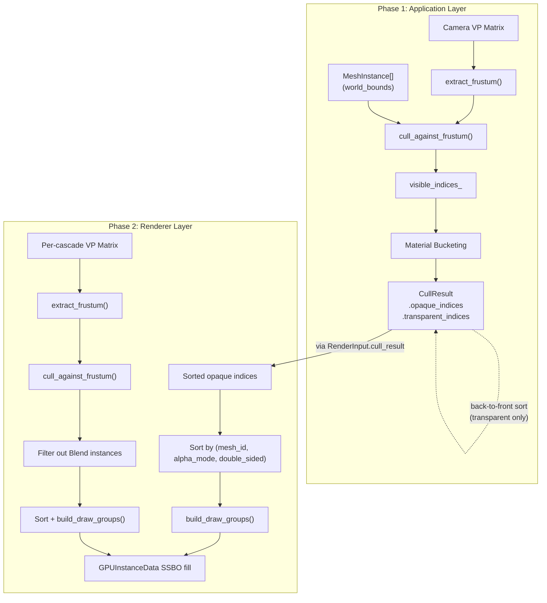
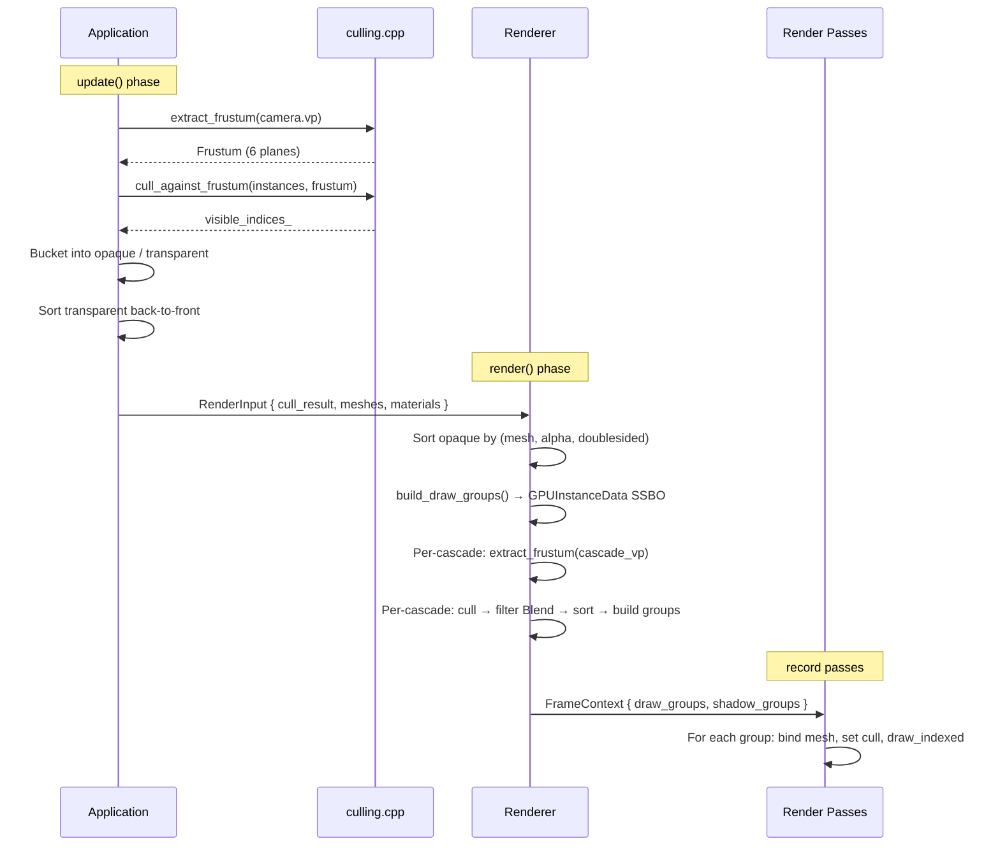

The **himalaya** rendering pipeline separates visibility determination from draw call emission into two distinct stages: a pure geometric **frustum culling** pass that identifies which mesh instances are visible from a given viewpoint, and a **draw group construction** pass that sorts visible instances into GPU-friendly instanced draw batches. This separation of concerns means the culling system knows nothing about materials or draw calls — it simply produces index lists — while the draw group builder consumes those indices and arranges them for efficient GPU consumption via `vkCmdDrawIndexed`. The same culling infrastructure serves both the camera's main view and each shadow cascade, making the frustum extraction and testing functions highly reusable.

Sources: [culling.h](https://github.com/1PercentSync/himalaya/blob/main/framework/include/himalaya/framework/culling.h#L1-L59), [culling.cpp](https://github.com/1PercentSync/himalaya/blob/main/framework/src/culling.cpp#L1-L81)

## Frustum Extraction — The Gribb-Hartmann Method

The frustum is represented as six **inward-facing normalized planes** stored in the `Frustum` struct, where each plane `(a, b, c, d)` satisfies `ax + by + cz + d ≥ 0` for any point inside the frustum. Extraction uses the **Gribb-Hartmann method**, which derives the six clip-space inequalities of the Vulkan coordinate system directly from rows of the view-projection matrix:

| Plane | Clip-Space Inequality | VP Matrix Expression |
|-------|----------------------|---------------------|
| Left  | `w + x ≥ 0` | `row3 + row0` |
| Right | `w − x ≥ 0` | `row3 − row0` |
| Bottom | `w + y ≥ 0` | `row3 + row1` |
| Top | `w − y ≥ 0` | `row3 − row1` |
| Near | `z ≥ 0` | `row2` |
| Far | `w − z ≥ 0` | `row3 − row2` |

Vulkan uses a clip-space Z range of `[0, w]` (unlike OpenGL's `[-w, w]`), which is why the near plane is simply `row2` rather than `row3 + row2`. After extracting the raw plane equations, each plane is normalized by dividing by its 3D normal length, ensuring consistent distance comparisons during culling.

Sources: [culling.cpp](https://github.com/1PercentSync/himalaya/blob/main/framework/src/culling.cpp#L30-L58)

## AABB-Plane Testing — The P-Vertex Approach

The culling test for each mesh instance uses the **p-vertex** (positive vertex) approach: for each frustum plane, the algorithm selects the AABB corner most aligned with the plane's inward-facing normal. If even this most-favorable corner lies outside the plane, the entire AABB must be outside. This is conservative — it never rejects visible objects — and early-exits as soon as any plane rejects the AABB, making the common case (objects well outside the frustum) very fast at just one dot product plus one comparison.

The p-vertex selection is elegantly branchless: for each axis, if the plane normal component is non-negative, use the AABB's maximum coordinate; otherwise, use the minimum. This selects the corner that projects most positively onto the normal direction.

```
// P-vertex for a given plane:
glm::vec3 p = {
    normal.x >= 0 ? aabb.max.x : aabb.min.x,
    normal.y >= 0 ? aabb.max.y : aabb.min.y,
    normal.z >= 0 ? aabb.max.z : aabb.min.z,
};
// If the most-favorable corner is outside, entire AABB is outside:
outside = (dot(normal, p) + plane.w) < 0
```

The test is applied to all 6 planes in sequence. An instance is visible only if its AABB is not fully outside any single plane. This is a **conservative** test — instances whose AABBs straddle the frustum boundary will pass even if their actual geometry does not enter the view — which is the standard tradeoff for AABB-based culling: simple and fast, at the cost of occasional false positives.

Sources: [culling.cpp](https://github.com/1PercentSync/himalaya/blob/main/framework/src/culling.cpp#L15-L28)

## World-Space AABB Construction

Each `MeshInstance` carries a precomputed `world_bounds` AABB in world space. This is computed at scene load time by the `transform_aabb` helper, which takes the mesh's local-space bounding box and applies the instance's world transform matrix. Because the transform may include rotation or non-uniform scale, the result is not simply a transformed min/max pair — instead, all 8 corners of the local AABB are transformed and the result is the axis-aligned bounding box of those 8 transformed points. This ensures tight bounds regardless of the transform applied.

Sources: [scene_loader.cpp](https://github.com/1PercentSync/himalaya/blob/main/app/src/scene_loader.cpp#L188-L206), [scene_data.h](https://github.com/1PercentSync/himalaya/blob/main/framework/include/himalaya/framework/scene_data.h#L33-L66)

## Two-Phase Culling Pipeline

The culling system operates in two phases that split responsibilities between the **Application** layer (which owns the camera and scene data) and the **Renderer** layer (which owns shadow cascades and GPU buffer fills).



**Phase 1** runs in `Application::perform_camera_culling()`. The application extracts a frustum from the camera's view-projection matrix, runs culling against all mesh instances, then buckets the visible indices by alpha mode — separating `Opaque` and `Mask` instances into `visible_opaque_indices` from `Blend` instances into `visible_transparent_indices`. Transparent instances are additionally sorted **back-to-front** by squared AABB-center-to-camera distance for correct alpha blending order.

**Phase 2** runs inside `Renderer::render_rasterization()`. The renderer receives the camera-culled opaque indices via `RenderInput::cull_result`, sorts them by `(mesh_id, alpha_mode, double_sided)`, and builds instanced draw groups. Separately, for each shadow cascade, the renderer performs an independent frustum cull using that cascade's light-space VP matrix, then builds per-cascade draw groups with a shared `GPUInstanceData` buffer.

Sources: [application.cpp](https://github.com/1PercentSync/himalaya/blob/main/app/src/application.cpp#L698-L732), [renderer_rasterization.cpp](https://github.com/1PercentSync/himalaya/blob/main/app/src/renderer_rasterization.cpp#L132-L206)

## Draw Group Construction

### Sort Predicate — Grouping Key

The draw group builder first sorts visible instance indices by a composite key of `(mesh_id, alpha_mode, double_sided)`. This ordering is critical because it groups together all instances that share the same mesh geometry **and** rendering properties, enabling a single `vkCmdDrawIndexed` call per group:

| Sort Priority | Field | Purpose |
|:---:|---|---|
| 1st | `mesh_id` | Same vertex/index buffers → same `vkCmdBindVertex/IndexBuffer` |
| 2nd | `alpha_mode` | Same shader variant → same pipeline bind |
| 3rd | `double_sided` | Same face culling state → same `vkCmdSetCullMode` |

The sort uses `std::ranges::sort` with a comparator lambda that reads the `MeshInstance` and `MaterialInstance` arrays via the sorted index values.

Sources: [renderer_rasterization.cpp](https://github.com/1PercentSync/himalaya/blob/main/app/src/renderer_rasterization.cpp#L41-L53)

### Linear Sweep — Run-Length Group Detection

After sorting, `build_draw_groups()` performs a **linear sweep** over the sorted index array, detecting contiguous runs of instances with identical `(mesh_id, alpha_mode, double_sided)` triples. For each run:

1. **Bounds check**: verifies that adding the group won't exceed `kMaxInstances` (65,536 instances × 128 bytes = 8 MB per frame)
2. **GPU data fill**: writes one `GPUInstanceData` per instance into the mapped SSBO, including the precomputed normal matrix (transpose of inverse of the model matrix's upper-left 3×3)
3. **Group record**: emits a `MeshDrawGroup` with the mesh ID, SSBO offset (`first_instance`), instance count, and face-culling flag

The group is routed to either `out_opaque` or `out_mask` based on the material's `alpha_mode` — `Opaque` vs `Mask`. `Blend` instances are excluded from instanced draw groups entirely because they require back-to-front ordering that cannot be batched.

Sources: [renderer_rasterization.cpp](https://github.com/1PercentSync/himalaya/blob/main/app/src/renderer_rasterization.cpp#L58-L128)

### GPUInstanceData Layout

Each instance writes 128 bytes into the `InstanceBuffer` SSBO (Set 0, Binding 3). The structure contains the model matrix (4×4), a precomputed normal matrix stored as three `vec4` columns (matching std430 `mat3` layout with per-column padding), and a `material_index` into the `MaterialBuffer` SSBO:

| Field | Offset | Size | Description |
|---|:---:|:---:|---|
| `model` | 0 | 64 | World-space 4×4 transform |
| `normal_col0` | 64 | 16 | Normal matrix column 0 (xyz, w unused) |
| `normal_col1` | 80 | 16 | Normal matrix column 1 (xyz, w unused) |
| `normal_col2` | 96 | 16 | Normal matrix column 2 (xyz, w unused) |
| `material_index` | 112 | 4 | Index into MaterialBuffer SSBO |
| `_padding` | 116 | 12 | Alignment to 128 bytes |

The normal matrix is precomputed on the CPU as `transpose(inverse(mat3(model)))` rather than computed per-vertex in the shader. This correctly handles non-uniform scaling (which would distort normals if only `mat3(model)` were used) while avoiding the cost of a per-vertex matrix inverse.

Sources: [scene_data.h](https://github.com/1PercentSync/himalaya/blob/main/framework/include/himalaya/framework/scene_data.h#L357-L364), [renderer_rasterization.cpp](https://github.com/1PercentSync/himalaya/blob/main/app/src/renderer_rasterization.cpp#L99-L111)

## MeshDrawGroup — The Draw Call Descriptor

The `MeshDrawGroup` struct is the CPU-side representation of a single instanced draw call. It is **not uploaded to the GPU** — instead, render passes read it on the CPU to configure `vkCmdDrawIndexed` parameters:

| Field | Purpose | vkCmdDrawIndexed Mapping |
|---|---|---|
| `mesh_id` | Which mesh resource to bind | Selects vertex/index buffer pair |
| `first_instance` | SSBO offset for this group's instances | `firstInstance` parameter |
| `instance_count` | Number of instances in the group | `instanceCount` parameter |
| `double_sided` | Face culling override | `vkCmdSetCullMode` (NONE vs BACK) |

When a pass iterates draw groups, each group translates to: bind the mesh's vertex/index buffers, set face culling, then call `draw_indexed(index_count, instance_count, 0, 0, first_instance)`. The vertex shader reads `instances[gl_InstanceIndex]` from the SSBO, where `gl_InstanceIndex` starts at `first_instance` for the first instance in the group.

Sources: [scene_data.h](https://github.com/1PercentSync/himalaya/blob/main/framework/include/himalaya/framework/scene_data.h#L386-L391), [forward_pass.cpp](https://github.com/1PercentSync/himalaya/blob/main/passes/src/forward_pass.cpp#L182-L196)

## Shadow Cascade Culling

Each CSM cascade has its own light-space view-projection matrix, and therefore its own frustum. The renderer performs **independent frustum culling per cascade**, which is critical for performance because a scene like Sponza may have hundreds of instances but only a small fraction fall within each cascade's frustum — especially the closer cascades that cover narrow depth ranges.

The shadow culling pipeline differs from camera culling in two ways:

1. **Blend filtering**: shadow passes don't render alpha-blended (transparent) geometry, so instances with `AlphaMode::Blend` are filtered out after culling
2. **No normal matrix**: shadow draw groups pass `compute_normal_matrix = false` to `build_draw_groups()`, since the shadow vertex shader only needs the model matrix for position transformation — normal transformation is irrelevant for depth-only rendering

All cascades share a single `shadow_cull_buffer_` and a single `GPUInstanceData` SSBO allocation, with the `instance_offset` counter advancing across cascades. This means the `first_instance` values across all cascade draw groups form a contiguous range within the SSBO, enabling efficient memory usage.

Sources: [renderer_rasterization.cpp](https://github.com/1PercentSync/himalaya/blob/main/app/src/renderer_rasterization.cpp#L177-L206), [renderer.h](https://github.com/1PercentSync/himalaya/blob/main/app/include/himalaya/app/renderer.h#L523-L535)

## Memory Allocation Strategy

The culling and draw group construction pipeline is designed for **zero allocation after the first frame**:

| Buffer | Owner | Reuse Strategy |
|---|---|---|
| `visible_indices_` | Application | `cull_against_frustum()` clears then fills; vector capacity persists |
| `cull_result_.visible_opaque_indices` | Application | Cleared each frame; capacity from peak instance count |
| `cull_result_.visible_transparent_indices` | Application | Cleared each frame; capacity from peak instance count |
| `sorted_opaque_indices_` | Renderer | `assign()` reuses allocation from previous frame |
| `opaque_draw_groups_` / `mask_draw_groups_` | Renderer | `clear()` preserves capacity |
| `shadow_cull_buffer_` | Renderer | Cleared per-cascade; single buffer reused |
| `shadow_cascade_sorted_[c]` | Renderer | `clear()` per cascade; 4 pre-allocated vectors |
| `shadow_cascade_*_groups_[c]` | Renderer | `clear()` per cascade |

The per-frame `InstanceBuffer` SSBO is pre-allocated at 65,536 instances (8 MB), mapped persistently via VMA, and written directly during `build_draw_groups()`. No staging buffer or upload command is needed — the CPU writes into mapped GPU-visible memory.

Sources: [renderer_rasterization.cpp](https://github.com/1PercentSync/himalaya/blob/main/app/src/renderer_rasterization.cpp#L33-L34), [renderer.h](https://github.com/1PercentSync/himalaya/blob/main/app/include/himalaya/app/renderer.h#L512-L536), [application.h](https://github.com/1PercentSync/himalaya/blob/main/app/include/himalaya/app/application.h#L96-L100)

## Complete Frame Flow — Culling to Draw Calls



The end-to-end pipeline processes every mesh instance through: (1) camera frustum culling in the Application layer, (2) material bucketing into opaque/transparent lists, (3) CPU-side sorting by draw-batching key, (4) linear sweep to form `MeshDrawGroup` runs with concurrent `GPUInstanceData` SSBO fill, and (5) per-pass iteration over draw groups to emit `vkCmdDrawIndexed` calls. Shadow cascades repeat steps 1–4 independently with their own frustums, sharing the same SSBO allocation space.

Sources: [application.cpp](https://github.com/1PercentSync/himalaya/blob/main/app/src/application.cpp#L698-L732), [renderer_rasterization.cpp](https://github.com/1PercentSync/himalaya/blob/main/app/src/renderer_rasterization.cpp#L132-L217)

## Design Tradeoffs and Limitations

The current implementation makes several deliberate tradeoffs suited to the project's milestone-1 scope:

**AABB vs. Bounding Sphere**: AABB culling is tighter than sphere culling (especially for elongated objects) but requires the 8-corner p-vertex test rather than a single dot product. The performance difference is negligible at current instance counts (hundreds, not millions).

**No Hierarchical Culling**: The linear scan over all instances has O(n) complexity. For scenes with thousands of instances, a spatial acceleration structure (BVH or octree) would dramatically reduce the number of AABB-plane tests. This is deferred to later milestones where scene complexity justifies it.

**Single-Threaded Execution**: Both culling and draw group building run on the main thread. For very large scenes, these could be parallelized — culling is embarrassingly parallel (each instance is independent), and the sort could use parallel radix sort. The current single-threaded approach is sufficient for M1 scene sizes.

**Conservative Culling**: AABB-based culling produces false positives when an instance's bounding box intersects the frustum but its actual geometry does not. Meshes with large bounding boxes relative to their visible surface area will pass the cull test unnecessarily. Tighter culling would require per-mesh oriented bounding boxes or actual geometry tests, which are not justified at this scope.