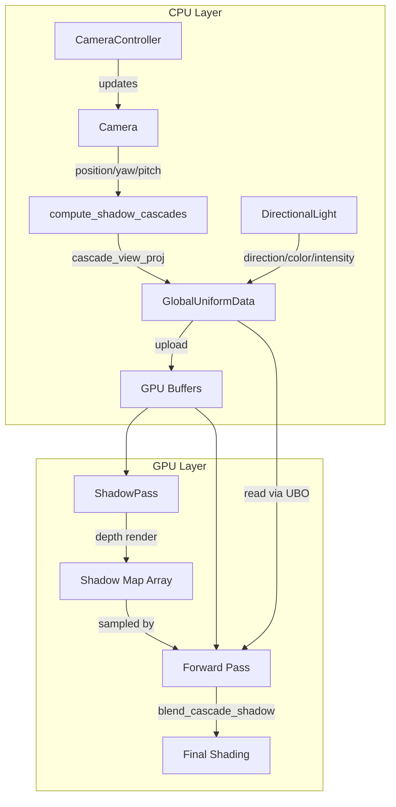

This page documents the three interconnected systems that define how the renderer perceives and illuminates the scene: the **Camera** for viewpoint transformation, **Directional Lighting** for direct illumination, and **Cascaded Shadow Maps (CSM)** for high-quality dynamic shadows. Together these systems form the visual foundation of the rendering pipeline, bridging CPU-side scene management with GPU-side shading computations.

## Camera System

The camera system provides viewpoint transformation using a yaw-pitch orientation model with reverse-Z perspective projection. The `Camera` struct in the framework layer stores both input state (position, orientation angles, projection parameters) and derived state (view, projection, and combined matrices), following a clear separation between mutable configuration and cached computations.

### Coordinate System and Orientation

The camera uses a right-handed coordinate system with Y-up. At yaw=0 and pitch=0, the camera looks along the negative Z axis. Yaw rotates horizontally around the Y axis, while pitch rotates vertically (positive values look upward). The `forward()` and `right()` methods compute direction vectors from these angles, with `right()` always remaining horizontal regardless of pitch to prevent roll. Sources: [camera.h](https://github.com/1PercentSync/himalaya/blob/main/framework/include/himalaya/framework/camera.h#L55-L65), [camera.cpp](https://github.com/1PercentSync/himalaya/blob/main/framework/src/camera.cpp#L56-L72)

### Reverse-Z Projection

A critical design decision is the use of reverse-Z depth buffering: the near plane maps to depth 1.0, while the far plane maps to depth 0.0. This distribution provides dramatically improved depth precision for distant objects compared to conventional depth buffering. The projection matrix is constructed manually rather than using GLM's standard functions to achieve this mapping:

```
z_ndc = (A * z_eye + B) / (-z_eye)
where A = near / (far - near), B = near * far / (far - near)
```

Sources: [camera.h](https://github.com/1PercentSync/himalaya/blob/main/framework/include/himalaya/framework/camera.h#L29-L36), [camera.cpp](https://github.com/1PercentSync/himalaya/blob/main/framework/src/camera.cpp#L16-L28)

### Camera Controller

The application layer provides `CameraController` for interactive camera manipulation. It implements WASD movement along the camera's forward/right directions, Space/Ctrl for vertical movement, and right-mouse-drag for rotation. The controller handles cursor capture (hiding the cursor and enabling raw mouse motion when available) and integrates with ImGui's input capture system to avoid conflicts with UI interaction. A sprint modifier (Shift) triples movement speed, and the F key triggers automatic framing of a target AABB. Sources: [camera_controller.h](https://github.com/1PercentSync/himalaya/blob/main/app/include/himalaya/app/camera_controller.h#L1-L73), [camera_controller.cpp](https://github.com/1PercentSync/himalaya/blob/main/app/src/camera_controller.cpp#L1-L110)

## Directional Lighting

The lighting system currently supports directional lights (sun/moon) with shadow casting capabilities. Each `DirectionalLight` stores a normalized direction vector (pointing toward the scene), linear-space color, intensity multiplier, and a boolean indicating whether it casts shadows. The design anticipates future extension to point and spot lights while maintaining a compact GPU representation.

### GPU Light Representation

Lights are uploaded to the GPU as `GPUDirectionalLight` structures in a shader storage buffer object (SSBO). The structure packs direction and intensity into one vec4, and color with a shadow-casting flag into another, achieving 32 bytes per light with std430 alignment. The forward pass iterates over active lights, computing Cook-Torrance BRDF contributions for each. Sources: [scene_data.h](https://github.com/1PercentSync/himalaya/blob/main/framework/include/himalaya/framework/scene_data.h#L166-L172), [bindings.glsl](https://github.com/1PercentSync/himalaya/blob/main/shaders/common/bindings.glsl#L88-L91), [forward.frag](https://github.com/1PercentSync/himalaya/blob/main/shaders/forward.frag#L204-L232)

## Cascaded Shadow Maps (CSM)

The shadow system implements Cascaded Shadow Maps with Practical Split Scheme (PSSM) distribution, Percentage-Closer Filtering (PCF), and optional Percentage-Closer Soft Shadows (PCSS) for contact-hardening effects. The architecture separates CPU-side cascade computation from GPU-side sampling, connected through the GlobalUBO.

### Cascade Computation

The `compute_shadow_cascades()` function in the framework layer computes per-cascade view-projection matrices each frame. It uses PSSM to distribute cascade boundaries logarithmically (controlled by `split_lambda`), providing higher shadow resolution near the camera where detail matters most. For each cascade:

1. **Sub-frustum extraction**: The camera frustum is sliced at the cascade's near and far boundaries
2. **Light-space transformation**: A view matrix is constructed with the light direction as the look-at vector, centered on the sub-frustum for numerical precision
3. **Tight orthographic fit**: XY extents tightly bound the sub-frustum corners in light space
4. **Z extension**: The depth range is extended to the scene AABB to capture shadow casters outside the view frustum
5. **Texel snapping**: The projection translation is adjusted to align with shadow map texel boundaries, eliminating edge shimmer during camera translation

Sources: [shadow.h](https://github.com/1PercentSync/himalaya/blob/main/framework/include/himalaya/framework/shadow.h#L1-L73), [shadow.cpp](https://github.com/1PercentSync/himalaya/blob/main/framework/src/shadow.cpp#L1-L197)

### Shadow Map Rendering

The `ShadowPass` renders depth into a 2D array texture (D32Sfloat format, up to 4 layers). Two pipelines handle different geometry types: an opaque pipeline performs depth-only rendering with no fragment shader, while a masked pipeline includes alpha testing for materials with transparent cutouts. The pass uses reverse-Z depth comparison (`VK_COMPARE_OP_GREATER`) with slope-based depth bias to prevent shadow acne. Sources: [shadow_pass.cpp](https://github.com/1PercentSync/himalaya/blob/main/passes/src/shadow_pass.cpp#L1-L317), [shadow.vert](https://github.com/1PercentSync/himalaya/blob/main/shaders/shadow.vert#L1-L41)

### Shadow Sampling and Filtering

The shader-side shadow evaluation (`shadow.glsl`) provides a complete shadow sampling library with multiple filtering modes:

| Mode | Description | Use Case |
|------|-------------|----------|
| Hard Shadows | Single hardware comparison | Performance-critical, distant geometry |
| PCF | Fixed-radius Percentage-Closer Filtering | Basic soft shadows |
| PCSS | Percentage-Closer Soft Shadows with blocker search | Contact-hardening, high quality |

The PCSS implementation follows a three-step algorithm: (1) blocker search in an elliptical region around the projected point, (2) penumbra width estimation based on blocker-receiver depth separation, and (3) variable-width PCF with the computed kernel size. Poisson disk sampling with per-pixel rotation (plus temporal variation) provides stable results without regular grid artifacts. Sources: [shadow.glsl](https://github.com/1PercentSync/himalaya/blob/main/shaders/common/shadow.glsl#L1-L496)

### Cascade Selection and Blending

The `select_cascade()` function chooses the appropriate cascade based on view-space depth, returning both the cascade index and a blend factor for transitions. In blend regions near cascade boundaries, shadow values from adjacent cascades are interpolated to hide discontinuities. A distance fade at the far shadow boundary smoothly transitions to unshadowed lighting. Sources: [shadow.glsl](https://github.com/1PercentSync/himalaya/blob/main/shaders/common/shadow.glsl#L345-L375), [shadow.glsl](https://github.com/1PercentSync/himalaya/blob/main/shaders/common/shadow.glsl#L448-L460)

### Receiver Plane Depth Bias

To eliminate shadow acne on surfaces nearly parallel to the light direction, the system computes receiver plane depth gradients using screen-space derivatives (dFdx/dFdy). These gradients enable per-sample depth adjustment during PCF/PCSS sampling, providing superior results compared to constant bias alone. The implementation carefully handles cascade boundary cases where derivatives would otherwise produce garbage values. Sources: [shadow.glsl](https://github.com/1PercentSync/himalaya/blob/main/shaders/common/shadow.glsl#L107-L167)

## Integration with Forward Rendering

The forward pass integrates shadows through the `blend_cascade_shadow()` function, called once per directional light that casts shadows. The function handles cascade selection, PCF/PCSS sampling based on the configured shadow mode, cascade blending, and distance fading. The resulting shadow attenuation multiplies the light's radiance contribution. For the primary directional light, additional contact shadows (screen-space ray-marched occlusion) are composited for enhanced detail on small features. Sources: [forward.frag](https://github.com/1PercentSync/himalaya/blob/main/shaders/forward.frag#L220-L232), [forward.frag](https://github.com/1PercentSync/himalaya/blob/main/shaders/forward.frag#L268-L275)

## Configuration Parameters

The shadow system exposes extensive runtime configuration through `ShadowConfig`:

| Parameter | Description | Typical Range |
|-----------|-------------|---------------|
| `cascade_count` | Number of active cascades (1-4) | 3-4 |
| `split_lambda` | PSSM log/linear blend (0=linear, 1=log) | 0.5-0.8 |
| `max_distance` | Shadow coverage distance in meters | 50-200 |
| `pcf_radius` | PCF kernel radius (0=off, 1=3x3, etc.) | 1-3 |
| `shadow_mode` | 0=PCF, 1=PCSS | 0 or 1 |
| `light_angular_diameter` | Light size for PCSS penumbra (radians) | 0.009 (sun) |
| `pcss_quality` | Sample count preset (0=Low, 1=Med, 2=High) | 1-2 |

Sources: [scene_data.h](https://github.com/1PercentSync/himalaya/blob/main/framework/include/himalaya/framework/scene_data.h#L216-L277)

## Architecture Diagram



## Related Documentation

- For shadow pass implementation details, see [Shadow Mapping (CSM) and Contact Shadows](https://github.com/1PercentSync/himalaya/blob/main/19-shadow-mapping-csm-and-contact-shadows)
- For the complete forward rendering pipeline, see [Depth PrePass and Forward Rendering](https://github.com/1PercentSync/himalaya/blob/main/18-depth-prepass-and-forward-rendering)
- For camera integration with the application, see [Camera Controller and Debug UI](https://github.com/1PercentSync/himalaya/blob/main/26-camera-controller-and-debug-ui)
- For scene data structures and culling, see [Scene Data and Culling](https://github.com/1PercentSync/himalaya/blob/main/16-scene-data-and-culling)