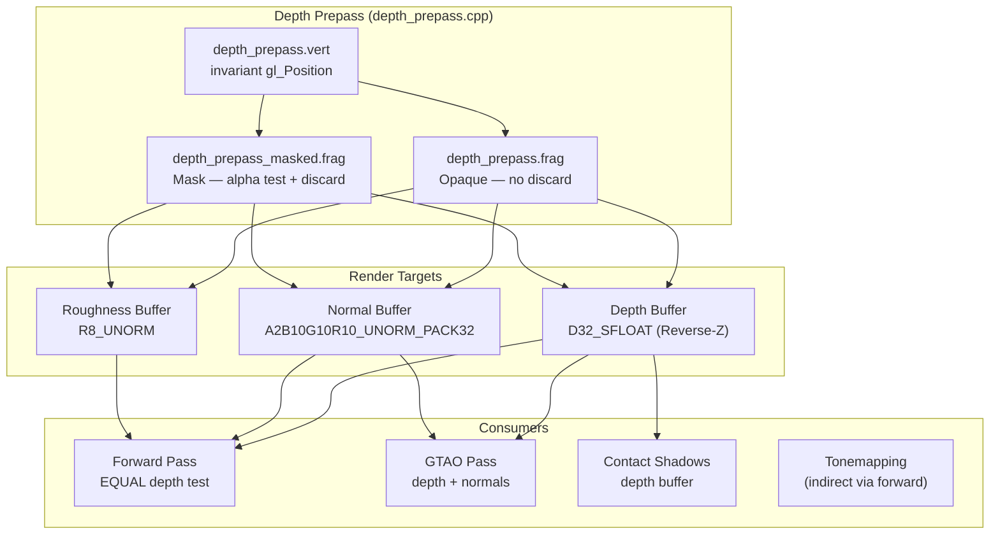

The depth prepass is the first rasterization pass in himalaya's multi-pass pipeline, executing before the forward lighting pass to fill the depth buffer with final visibility information. By pre-rendering all opaque and alpha-masked geometry in a lightweight pass that outputs depth, world-space normals, and roughness — but skips all lighting computation — the subsequent forward pass can use an `EQUAL` depth comparison that guarantees zero pixel overdraw. This architectural decision transforms the forward renderer from a potentially expensive O(pixels × overlapping geometry) workload into a strict O(screen pixels) workload, where every surviving fragment in the forward pass was already depth-tested exactly once.

Sources: [depth_prepass.h](https://github.com/1PercentSync/himalaya/blob/main/passes/include/himalaya/passes/depth_prepass.h#L1-L16), [depth_prepass.cpp](https://github.com/1PercentSync/himalaya/blob/main/passes/src/depth_prepass.cpp#L1-L11)

## Why a Depth Prepass?

In a traditional forward renderer, every triangle in view submits fragments for shading regardless of whether they are ultimately visible. When multiple surfaces overlap the same screen pixel, the GPU's depth test discards the occluded ones — but only after the fragment shader has already executed for them. In complex scenes like Sponza with its many overlapping pillars, arches, and vegetation, the ratio of shaded-but-discarded fragments to visible fragments (the **overdraw factor**) can easily exceed 2–3×, meaning the GPU does two to three times more lighting work than necessary.

The depth prepass eliminates this waste through a two-phase strategy:

1. **Phase 1 (Depth Prepass)**: Render all geometry with a minimal fragment shader that writes only depth, normals, and roughness — no BRDF evaluation, no shadow lookups, no IBL sampling.
2. **Phase 2 (Forward Pass)**: Re-render the same geometry with full PBR lighting, but with depth test set to `VK_COMPARE_OP_EQUAL` and depth writes disabled. Because the depth buffer already contains the exact Z-value for each visible surface, only fragments whose computed `gl_Position.z` matches the pre-existing depth survive — which are exactly the frontmost fragments, already identified in Phase 1.

The key enabler is GLSL's `invariant` qualifier on `gl_Position` in both vertex shaders, which guarantees **bit-identical** depth values across the two passes regardless of compiler optimizations or floating-point reassociation. Without `invariant`, the GPU's shader compiler might reorder arithmetic operations between the two vertex shaders, producing subtly different Z-values and causing the `EQUAL` test to fail catastrophically.

Sources: [depth_prepass.vert](https://github.com/1PercentSync/himalaya/blob/main/shaders/depth_prepass.vert#L11-L13), [forward.vert](https://github.com/1PercentSync/himalaya/blob/main/shaders/forward.vert#L11-L13), [forward_pass.cpp](https://github.com/1PercentSync/himalaya/blob/main/passes/src/forward_pass.cpp#L174-L177)

## Architecture Overview

The depth prepass produces three render targets consumed by downstream passes:



This design makes the depth prepass a **multi-purpose geometry pass** rather than a simple Z-fill. By computing normals and roughness here, the forward pass can read them as texture inputs instead of recomputing them, and screen-space effects like GTAO and contact shadows gain immediate access to G-buffer data without a dedicated G-buffer construction pass.

Sources: [depth_prepass.cpp](https://github.com/1PercentSync/himalaya/blob/main/passes/src/depth_prepass.cpp#L97-L109), [render_constants.h](https://github.com/1PercentSync/himalaya/blob/main/framework/include/himalaya/framework/render_constants.h#L16-L27)

## Two-Pipeline Design: Opaque vs. Alpha-Masked

The depth prepass maintains **two separate graphics pipelines** that share the same vertex shader but use different fragment shaders. This split exists because of GPU Early-Z behavior:

| Property | Opaque Pipeline | Mask Pipeline |
|---|---|---|
| Fragment shader | `depth_prepass.frag` | `depth_prepass_masked.frag` |
| Discard | None | Alpha test (`discard` if α < cutoff) |
| Early-Z | **Guaranteed** | **Not guaranteed** (driver-dependent) |
| Draw order | First | Second (benefits from opaque depth) |
| Texture samples | Normal map + Metallic-Roughness | Base color (alpha) + Normal map + Metallic-Roughness |

**Why split instead of one pipeline?** When a fragment shader contains a `discard` statement, the GPU cannot safely perform Early-Z rejection before the fragment shader runs — the discard might prevent the depth write, and the GPU can't know this without executing the shader. By isolating the `discard` into a separate pipeline, the opaque pipeline (which draws the vast majority of geometry in typical scenes) retains guaranteed Early-Z optimization: the GPU rejects occluded fragments *before* running even the lightweight depth prepass fragment shader, saving both texture bandwidth and ALU.

The draw order matters: opaque geometry is drawn first so its depth values fill the buffer before masked geometry runs. Masked fragments that survive the alpha test still benefit from depth testing against the opaque buffer — if a masked fragment is occluded by opaque geometry, it's rejected before the alpha test even executes.

Sources: [depth_prepass.cpp](https://github.com/1PercentSync/himalaya/blob/main/passes/src/depth_prepass.cpp#L111-L127), [depth_prepass.frag](https://github.com/1PercentSync/himalaya/blob/main/shaders/depth_prepass.frag#L11-L12), [depth_prepass_masked.frag](https://github.com/1PercentSync/himalaya/blob/main/shaders/depth_prepass_masked.frag#L13-L16), [depth_prepass.cpp](https://github.com/1PercentSync/himalaya/blob/main/passes/src/depth_prepass.cpp#L256-L268)

## Vertex Shader — Positional Invariance Contract

The vertex shader transforms each vertex by the instance's model matrix and the global view-projection matrix, producing the clip-space position that determines depth. The `invariant gl_Position` declaration is the linchpin of the entire zero-overdraw strategy:

```glsl
invariant gl_Position;

void main() {
    GPUInstanceData inst = instances[gl_InstanceIndex];
    vec4 world_pos = inst.model * vec4(in_position, 1.0);
    gl_Position = global.view_projection * world_pos;
    // ... normal, tangent, UV, material index outputs
}
```

The `invariant` qualifier instructs the GLSL compiler to produce **exactly the same machine instructions** for computing `gl_Position` as any other shader that declares the same computation with `invariant`. Both [depth_prepass.vert](https://github.com/1PercentSync/himalaya/blob/main/shaders/depth_prepass.vert) and [forward.vert](https://github.com/1PercentSync/himalaya/blob/main/shaders/forward.vert) declare `invariant gl_Position` and compute it identically (`view_projection * model * position`), ensuring the forward pass's `EQUAL` depth test matches every time.

Beyond position, the vertex shader outputs world-space normal, tangent (with handedness in `.w`), UV coordinates, and the material index — all needed by the fragment shader for normal map sampling and material lookup. The normal matrix (`transpose(inverse(mat3(model)))`) is precomputed on the CPU and uploaded as part of `GPUInstanceData`, avoiding costly per-vertex `mat3 inverse` operations.

Sources: [depth_prepass.vert](https://github.com/1PercentSync/himalaya/blob/main/shaders/depth_prepass.vert#L1-L53), [bindings.glsl](https://github.com/1PercentSync/himalaya/blob/main/shaders/common/bindings.glsl#L27-L33)

## Fragment Shader — Normal Encoding and Roughness Extraction

### Opaque Fragment Shader

The opaque fragment shader performs two tasks: computing the world-space shading normal (with normal map perturbation) and extracting the roughness value. It does **not** compute lighting:

```glsl
void main() {
    GPUMaterialData mat = materials[frag_material_index];

    // Sample BC5-compressed normal map (RG channels only)
    vec2 normal_rg = texture(textures[nonuniformEXT(mat.normal_tex)], frag_uv0).rg;

    // Build TBN and transform tangent-space normal to world-space
    vec3 N = normalize(frag_normal);
    vec3 shading_normal = get_shading_normal(N, frag_tangent, normal_rg, mat.normal_scale);

    // Encode to R10G10B10A2 UNORM: [-1,1] → [0,1]
    out_normal = encode_normal_r10g10b10a2(shading_normal);

    // Roughness from metallic-roughness texture G channel × material factor
    out_roughness = texture(textures[nonuniformEXT(mat.metallic_roughness_tex)], frag_uv0).g
                    * mat.roughness_factor;
}
```

The normal map uses BC5 compression (two channels, RG), which stores the tangent-space X and Y components. The Z component is reconstructed analytically via `z = sqrt(1 - x² - y²)`, and the result is transformed from tangent-space to world-space via the TBN matrix constructed from the vertex normal and tangent vectors. A degenerate tangent guard prevents NaN propagation when meshes lack tangent data.

### R10G10B10A2 Normal Encoding

World-space normals are encoded as `n * 0.5 + 0.5` into the `A2B10G10R10_UNORM_PACK32` format, providing approximately 10 bits of precision per axis. This encoding is chosen specifically because it is **compatible with MSAA AVERAGE resolve**: averaging multiple encoded normal values produces a mathematically correct average direction (after decode + renormalize), which is not the case for spherical coordinate encodings or octahedral mappings.

Sources: [depth_prepass.frag](https://github.com/1PercentSync/himalaya/blob/main/shaders/depth_prepass.frag#L1-L42), [normal.glsl](https://github.com/1PercentSync/himalaya/blob/main/shaders/common/normal.glsl#L26-L61)

## Alpha-Masked Fragment Shader

The masked fragment shader adds an alpha test **before** any normal map sampling. This ordering is deliberate: the alpha test reads the base color texture's alpha channel, and if the fragment fails the test, it is discarded before the more expensive normal map and metallic-roughness texture samples execute:

```glsl
void main() {
    GPUMaterialData mat = materials[frag_material_index];

    // Alpha test first — early exit avoids wasted texture bandwidth
    float alpha = texture(textures[nonuniformEXT(mat.base_color_tex)], frag_uv0).a
                  * mat.base_color_factor.a;
    if (alpha < mat.alpha_cutoff) {
        discard;
    }

    // Only reached for surviving fragments — normal map + roughness (same as opaque)
    // ...
}
```

The alpha cutoff value comes from the glTF material's `alphaCutoff` property, stored in `GPUMaterialData::alpha_cutoff`. glTF specifies that alpha-masked materials with `alpha >= alphaCutoff` are treated as fully opaque — there is no partial transparency in mask mode. This binary classification is what makes the depth prepass viable for masked geometry: surviving fragments write a definitive depth value that the forward pass can match exactly.

Sources: [depth_prepass_masked.frag](https://github.com/1PercentSync/himalaya/blob/main/shaders/depth_prepass_masked.frag#L1-L52), [bindings.glsl](https://github.com/1PercentSync/himalaya/blob/main/shaders/common/bindings.glsl#L46-L53)

## Reverse-Z Depth Strategy

The depth buffer uses `VK_FORMAT_D32_SFLOAT` with a **reverse-Z** convention, where near values map to 1.0 and far values map to 0.0. This provides superior depth precision distribution compared to forward-Z because floating-point precision is naturally concentrated near zero, and reverse-Z aligns this precision near the camera where it matters most for avoiding Z-fighting artifacts.

The clear value for depth is `0.0` (representing the far plane), and the depth comparison is `VK_COMPARE_OP_GREATER` — a fragment passes only if its depth value is greater than the existing value, which in reverse-Z means it is closer to the camera. This is configured via dynamic state in the recording function:

```cpp
cmd.set_depth_test_enable(true);
cmd.set_depth_write_enable(true);
cmd.set_depth_compare_op(VK_COMPARE_OP_GREATER); // Reverse-Z
```

The depth clear value `{0.0f, 0}` explicitly initializes all pixels to the farthest possible depth, ensuring the first fragment at any pixel always passes the depth test.

Sources: [depth_prepass.cpp](https://github.com/1PercentSync/himalaya/blob/main/passes/src/depth_prepass.cpp#L164-L168), [depth_prepass.cpp](https://github.com/1PercentSync/himalaya/blob/main/passes/src/depth_prepass.cpp#L228-L230), [render_constants.h](https://github.com/1PercentSync/himalaya/blob/main/framework/include/himalaya/framework/render_constants.h#L17)

## MSAA Integration — Inline Resolve

When MSAA is active (sample count > 1), the depth prepass renders into MSAA render targets and resolves inline within the same `VkRenderingInfo` using Vulkan's Dynamic Rendering resolve facilities. This avoids an explicit resolve pass and keeps the render graph lean:

| Attachment | MSAA Render Target | Resolve Mode | Resolved Target |
|---|---|---|---|
| Depth | `msaa_depth` | `VK_RESOLVE_MODE_MAX_BIT` | `depth` |
| Normal | `msaa_normal` | `VK_RESOLVE_MODE_AVERAGE_BIT` | `normal` |
| Roughness | `msaa_roughness` | `VK_RESOLVE_MODE_AVERAGE_BIT` | `roughness` |

**Depth resolve uses `MAX_BIT`** because in reverse-Z, the closest sample has the largest depth value. Taking the maximum of all MSAA samples selects the frontmost depth, which is correct for the prepass's role as the authoritative depth source.

**Normal and roughness resolve use `AVERAGE_BIT`** because the R10G10B10A2 encoding maps normals linearly to [0,1]. Averaging multiple samples produces the correct mean direction after decode-and-renormalize, and averaging roughness values produces the perceptually correct blended roughness at coverage edges.

When MSAA is not active (sample count = 1), the pass writes directly to the resolved targets (`depth`, `normal`, `roughness`) with `STORE_OP_STORE` and no resolve attachment, using a simpler resource declaration set.

Sources: [depth_prepass.cpp](https://github.com/1PercentSync/himalaya/blob/main/passes/src/depth_prepass.cpp#L134-L196), [depth_prepass.cpp](https://github.com/1PercentSync/himalaya/blob/main/passes/src/depth_prepass.cpp#L273-L329)

## Render Graph Integration

The depth prepass registers its resource usage with the render graph using `RGResourceUsage` entries that declare access types and pipeline stages. The render graph uses these declarations to automatically insert memory barriers between passes:

**1× (no MSAA)** — three resources:
- `depth` — `ReadWrite`, `DepthAttachment` (cleared then written)
- `normal` — `Write`, `ColorAttachment` (cleared then written)
- `roughness` — `Write`, `ColorAttachment` (cleared then written)

**MSAA** — six resources:
- `msaa_depth` — `ReadWrite`, `DepthAttachment` (render target)
- `msaa_normal` — `Write`, `ColorAttachment` (render target)
- `msaa_roughness` — `Write`, `ColorAttachment` (render target)
- `depth` — `Write`, `DepthAttachment` (resolve destination)
- `normal` — `Write`, `ColorAttachment` (resolve destination)
- `roughness` — `Write`, `ColorAttachment` (resolve destination)

The pass name `"DepthPrePass"` appears in the render graph's pass list, and the render graph's `compile()` step constructs the appropriate image layout transitions and pipeline barriers. Downstream passes that consume the depth buffer (forward pass, GTAO, contact shadows) declare it as a `Read` dependency, which triggers the render graph to insert the necessary `DEPTH_ATTACHMENT_OPTIMAL → SHADER_READ_ONLY_OPTIMAL` transitions.

Sources: [depth_prepass.cpp](https://github.com/1PercentSync/himalaya/blob/main/passes/src/depth_prepass.cpp#L273-L329), [renderer_rasterization.cpp](https://github.com/1PercentSync/himalaya/blob/main/app/src/renderer_rasterization.cpp#L316-L333)

## Frame Pipeline Ordering

The rasterization render path in `renderer_rasterization.cpp` records passes in a specific order that the render graph respects:

```
Shadow Pass → Depth Prepass → GTAO → AO Spatial → AO Temporal → Contact Shadows → Forward → Skybox → Tonemapping
```

The depth prepass executes after the shadow pass (which has its own depth buffer) and before all screen-space effects and the forward pass. This ordering ensures:

1. **Shadow map is complete** before the depth prepass runs (no dependency, but same GPU queue)
2. **G-buffer data is ready** (depth + normals + roughness) for GTAO's horizon-based AO computation
3. **AO results are ready** before the forward pass reads them via Set 2 bindings
4. **Forward pass reads the prepass depth** with `EQUAL` test, producing exactly zero overdraw

Sources: [renderer_rasterization.cpp](https://github.com/1PercentSync/himalaya/blob/main/app/src/renderer_rasterization.cpp#L316-L334)

## Pipeline Lifecycle

The `DepthPrePass` class manages two `rhi::Pipeline` objects (`opaque_pipeline_` and `mask_pipeline_`) through a lifecycle that handles initialization, MSAA changes, and hot reload:

| Method | Purpose | GPU Idle Required? |
|---|---|---|
| `setup()` | Initial compilation + pipeline creation | Yes (first call) |
| `on_sample_count_changed()` | Recompile with new MSAA sample count | Yes |
| `rebuild_pipelines()` | Hot-reload shaders from disk | Yes |
| `destroy()` | Release Vulkan pipeline objects | Yes |

The `create_pipelines()` private method implements a **fail-safe** compilation strategy: all three shaders (vertex + two fragments) are compiled first. If any compilation fails, the existing pipelines are kept intact and a warning is logged. Only when all three compile successfully are the old pipelines destroyed and replaced. This prevents a shader typo during development from crashing the renderer — it continues rendering with the last working shaders until the error is fixed.

Sources: [depth_prepass.cpp](https://github.com/1PercentSync/himalaya/blob/main/passes/src/depth_prepass.cpp#L67-L128), [depth_prepass.h](https://github.com/1PercentSync/himalaya/blob/main/passes/include/himalaya/passes/depth_prepass.h#L39-L124)

## Draw Submission Pattern

During recording, draw calls are submitted in instanced batches organized by `MeshDrawGroup`. Each group bundles together all instances that share the same mesh geometry and compatible material properties (same alpha mode and double-sided flag), allowing a single `draw_indexed` call to render multiple instances via instanced rendering:

```
Opaque batch (pipeline: opaque_pipeline_)
  ├─ Mesh A: 5 instances  (draw_indexed: index_count=..., instance_count=5, first_instance=0)
  ├─ Mesh B: 3 instances  (draw_indexed: index_count=..., instance_count=3, first_instance=5)
  └─ ...

Mask batch (pipeline: mask_pipeline_)
  ├─ Mesh C: 2 instances  (draw_indexed: ...)
  └─ ...
```

Each draw group's `double_sided` flag dynamically sets the cull mode: `VK_CULL_MODE_NONE` for double-sided materials (no backface culling) or `VK_CULL_MODE_BACK_BIT` for single-sided. The descriptor sets (Set 0: global data, Set 1: bindless textures) are bound once per pipeline switch, not per draw call, minimizing state changes.

Sources: [depth_prepass.cpp](https://github.com/1PercentSync/himalaya/blob/main/passes/src/depth_prepass.cpp#L233-L268)

## Forward Pass Consumption — The Zero-Overdraw Contract

The forward pass establishes a **strict read-only relationship** with the depth buffer:

```cpp
cmd.set_depth_test_enable(true);
cmd.set_depth_write_enable(false);
cmd.set_depth_compare_op(VK_COMPARE_OP_EQUAL);
```

- **Depth test enabled** with **EQUAL comparison**: only fragments whose depth exactly matches the prepass value survive.
- **Depth write disabled**: the forward pass never modifies the depth buffer.
- **Depth attachment** uses `LOAD_OP_LOAD` and `STORE_OP_NONE` — it reads the existing depth values and produces no output for the depth attachment.

Because both vertex shaders compute `gl_Position` with `invariant` precision, the forward pass's depth values are bitwise identical to the prepass values. The `EQUAL` test passes for exactly one fragment per pixel (the frontmost one), and all other fragments are rejected before the PBR fragment shader executes. This means the expensive lighting computation — BRDF evaluation, shadow map sampling, IBL split-sum, AO application — runs precisely once per visible pixel.

Sources: [forward_pass.cpp](https://github.com/1PercentSync/himalaya/blob/main/passes/src/forward_pass.cpp#L131-L141), [forward_pass.cpp](https://github.com/1PercentSync/himalaya/blob/main/passes/src/forward_pass.cpp#L174-L177), [forward_pass.cpp](https://github.com/1PercentSync/himalaya/blob/main/passes/src/forward_pass.cpp#L207-L226)

## Next Steps

- **[Forward Pass — Cook-Torrance PBR, IBL Split-Sum, and Multi-Bounce AO](https://github.com/1PercentSync/himalaya/blob/main/17-forward-pass-cook-torrance-pbr-ibl-split-sum-and-multi-bounce-ao)**: See how the forward pass consumes the depth, normal, and roughness buffers produced by this pass to compute full PBR lighting with zero overdraw.
- **[GTAO Pass — Horizon-Based Ambient Occlusion with Spatial and Temporal Denoising](https://github.com/1PercentSync/himalaya/blob/main/19-gtao-pass-horizon-based-ambient-occlusion-with-spatial-and-temporal-denoising)**: Learn how screen-space AO reads the depth and normal buffers to compute per-pixel occlusion.
- **[Render Graph — Automatic Barrier Insertion and Pass Orchestration](https://github.com/1PercentSync/himalaya/blob/main/9-render-graph-automatic-barrier-insertion-and-pass-orchestration)**: Understand how the render graph uses the resource declarations from this pass to automatically insert memory barriers.