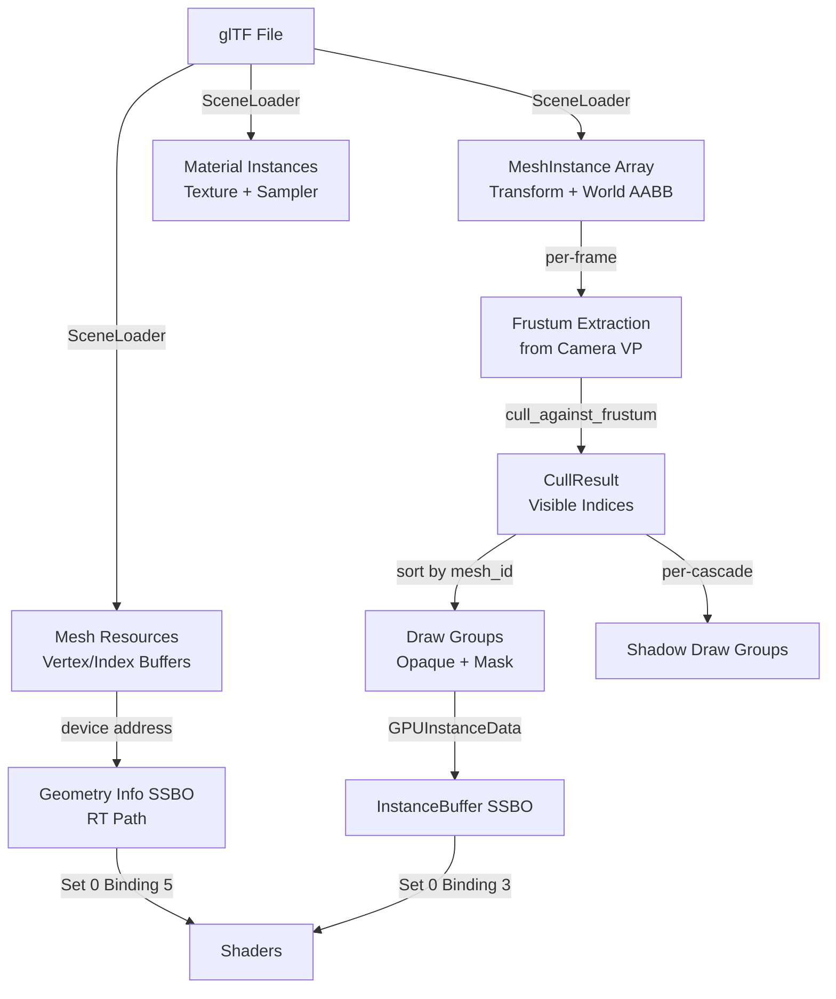

The scene data and culling system forms the bridge between the application-level scene representation and the renderer's consumption of renderable entities. This subsystem defines the data structures that describe meshes, instances, lights, and visibility, along with the geometric culling algorithms that reduce GPU workload by filtering out objects outside the camera's view frustum.

## Scene Data Architecture

Himalaya uses a three-tier scene representation that separates **mesh resources** (geometry data), **material instances** (surface properties), and **mesh instances** (placed objects). This design enables efficient instancing and minimizes redundant GPU data uploads.

### Core Data Structures

The scene data contracts are defined in `scene_data.h`, establishing the communication protocol between the application layer and the renderer:

**MeshInstance** represents a single renderable object in the scene, combining a reference to mesh geometry, material properties, and transform data:

| Field | Purpose |
|-------|---------|
| `mesh_id` | Index into the loaded mesh array (vertex/index buffers) |
| `material_id` | Index into the material instance array |
| `transform` | World-space 4×4 transformation matrix |
| `prev_transform` | Previous frame's transform (for motion vectors in M2+) |
| `world_bounds` | World-space AABB for frustum culling |

**SceneRenderData** aggregates all per-frame inputs the renderer needs: a span of mesh instances, directional lights, and the active camera. The renderer consumes this structure read-only, with the application layer responsible for populating it each frame.

**CullResult** stores the output of frustum culling as two index arrays—one for visible opaque objects and one for visible transparent objects. This separation allows the renderer to apply different sorting and drawing strategies to each category.

Sources: [scene_data.h](https://github.com/1PercentSync/himalaya/blob/main/framework/include/himalaya/framework/scene_data.h#L47-L80), [scene_data.h](https://github.com/1PercentSync/himalaya/blob/main/framework/include/himalaya/framework/scene_data.h#L88-L98)

### GPU-Side Data Layouts

The scene data structures have corresponding GPU-side layouts that must match the shader bindings exactly. The framework uses `static_assert` declarations to verify size and offset alignment at compile time:

**GPUInstanceData** (128 bytes, std430 layout) contains the precomputed model matrix and normal matrix for each instance. The normal matrix—`transpose(inverse(mat3(model)))`—is computed on the CPU per-instance rather than per-vertex in the shader, correctly handling non-uniform scale without per-vertex matrix inversion overhead.

**GPUGeometryInfo** (24 bytes, std430 layout) provides ray tracing shaders with vertex and index buffer device addresses plus material offsets for geometry lookup via `gl_InstanceCustomIndexEXT + gl_GeometryIndexEXT`.

Sources: [scene_data.h](https://github.com/1PercentSync/himalaya/blob/main/framework/include/himalaya/framework/scene_data.h#L280-L310), [scene_data.h](https://github.com/1PercentSync/himalaya/blob/main/framework/include/himalaya/framework/scene_data.h#L262-L275)

## Frustum Culling System

The culling implementation provides pure geometric visibility testing using axis-aligned bounding boxes (AABBs) against view frustum planes. This operates entirely on the CPU, producing index lists that the renderer consumes for draw group construction.

### Frustum Extraction

The `extract_frustum()` function derives six clipping planes from a view-projection matrix using the **Gribb-Hartmann method**. This approach works with both perspective and orthographic projections and is compatible with Vulkan's clip space (z in [0, w]).

The six planes are extracted by combining rows of the VP matrix:
- Left: `row3 + row0` (w + x ≥ 0)
- Right: `row3 - row0` (w - x ≥ 0)
- Bottom: `row3 + row1` (w + y ≥ 0)
- Top: `row3 - row1` (w - y ≥ 0)
- Near: `row2` (z ≥ 0)
- Far: `row3 - row2` (w - z ≥ 0)

Each plane is normalized to unit length with inward-facing normals, enabling consistent signed-distance calculations.

Sources: [culling.cpp](https://github.com/1PercentSync/himalaya/blob/main/framework/src/culling.cpp#L25-L48), [culling.h](https://github.com/1PercentSync/himalaya/blob/main/framework/include/himalaya/framework/culling.h#L22-L35)

### AABB-Plane Testing

The `cull_against_frustum()` function tests each mesh instance's world-space AABB against all six frustum planes using the **p-vertex approach**. For each plane, the algorithm identifies the corner most aligned with the plane normal (the "p-vertex"). If this corner lies outside the plane, the entire AABB is guaranteed to be outside—enabling early rejection without testing all eight corners.

```cpp
// P-vertex selection: corner most aligned with plane normal
glm::vec3 p = {
    normal.x >= 0.0f ? aabb.max.x : aabb.min.x,
    normal.y >= 0.0f ? aabb.max.y : aabb.min.y,
    normal.z >= 0.0f ? aabb.max.z : aabb.min.z,
};
bool outside = glm::dot(normal, p) + plane.w < 0.0f;
```

This approach requires exactly one dot product per plane, making it computationally efficient for scenes with thousands of instances.

Sources: [culling.cpp](https://github.com/1PercentSync/himalaya/blob/main/framework/src/culling.cpp#L17-L23), [culling.cpp](https://github.com/1PercentSync/himalaya/blob/main/framework/src/culling.cpp#L50-L70)

## Scene Loading and Instance Management

The **SceneLoader** class handles glTF import, converting the hierarchical scene graph into flat arrays optimized for rendering. This process involves mesh extraction, material processing, texture loading, and instance flattening.

### From glTF to MeshInstances

The loader traverses the glTF scene graph and creates one `MeshInstance` per node-primitive combination. During this process:

1. **Local AABB computation**: Each primitive's local-space bounding box is computed from position data during mesh loading
2. **World transform accumulation**: Node transforms are accumulated through the hierarchy
3. **World AABB transformation**: Local AABBs are transformed to world space by computing the axis-aligned bounds of all eight transformed corners

The resulting `world_bounds` field in each `MeshInstance` enables accurate frustum culling regardless of object orientation or scale.

Sources: [scene_loader.cpp](https://github.com/1PercentSync/himalaya/blob/main/app/src/scene_loader.cpp#L44-L65), [scene_loader.cpp](https://github.com/1PercentSync/himalaya/blob/main/app/src/scene_loader.cpp#L280-L310)

### Scene-Level Bounding Information

The loader computes a **scene AABB** as the union of all instance world bounds. This aggregate bounds serves multiple purposes:
- Initializing shadow cascade max distance (diagonal × 1.5)
- Camera auto-positioning to frame the scene
- Debug visualization of scene extent

Sources: [scene_loader.h](https://github.com/1PercentSync/himalaya/blob/main/app/include/himalaya/app/scene_loader.h#L85-L92), [application.cpp](https://github.com/1PercentSync/himalaya/blob/main/app/src/application.cpp#L145-L155)

## Integration with Rendering Pipeline

The culling system integrates into the frame loop through the `perform_camera_culling()` method in the Application layer. This function:

1. Extracts the frustum from the camera's view-projection matrix
2. Culls all mesh instances against the frustum
3. Buckets visible indices by material alpha mode (opaque vs. blend)
4. Sorts transparent instances back-to-front by distance from camera

The resulting `CullResult` is passed to the renderer via `RenderInput`, where it drives draw group construction for both camera and shadow passes.

Sources: [application.cpp](https://github.com/1PercentSync/himalaya/blob/main/app/src/application.cpp#L680-L710)

### Shadow Cascade Culling

Shadow mapping performs **per-cascade frustum culling** to maximize depth buffer precision. Each cascade has its own view-projection matrix derived from the light direction and split distances. The renderer extracts a frustum for each cascade and culls the scene independently, producing separate draw groups that minimize overdraw in shadow maps.

Sources: [renderer_rasterization.cpp](https://github.com/1PercentSync/himalaya/blob/main/app/src/renderer_rasterization.cpp#L145-L180)

## Acceleration Structure Building (RT Path)

For the path tracing render mode, the **SceneASBuilder** constructs Vulkan acceleration structures from the same scene data:

1. **BLAS grouping**: Meshes are grouped by `group_id` (corresponding to glTF source mesh) into multi-geometry BLAS
2. **Geometry Info SSBO**: A GPU buffer maps geometry indices to vertex/index addresses and material offsets
3. **TLAS deduplication**: Instances with identical transforms are deduplicated to minimize TLAS size

The builder assumes that `MeshInstance` entries from the same glTF node are contiguous—a guarantee provided by `SceneLoader::build_mesh_instances()`.

Sources: [scene_as_builder.h](https://github.com/1PercentSync/himalaya/blob/main/framework/include/himalaya/framework/scene_as_builder.h#L20-L60), [scene_as_builder.cpp](https://github.com/1PercentSync/himalaya/blob/main/framework/src/scene_as_builder.cpp#L30-L80)

## Data Flow Summary

The following diagram illustrates how scene data flows from glTF loading through culling to GPU consumption:



## Related Documentation

- [Mesh and Geometry Management](https://github.com/1PercentSync/himalaya/blob/main/14-mesh-and-geometry-management) — Vertex format, buffer management, and tangent generation
- [Camera, Lighting, and Shadows](https://github.com/1PercentSync/himalaya/blob/main/15-camera-lighting-and-shadows) — Camera matrices and shadow cascade computation
- [Scene Loading (glTF)](https://github.com/1PercentSync/himalaya/blob/main/25-scene-loading-gltf) — Complete glTF import pipeline
- [Renderer Orchestration](https://github.com/1PercentSync/himalaya/blob/main/24-renderer-orchestration) — How cull results drive the render graph
- [Ray Tracing Infrastructure](https://github.com/1PercentSync/himalaya/blob/main/11-ray-tracing-infrastructure-as-rt-pipeline) — BLAS/TLAS construction details