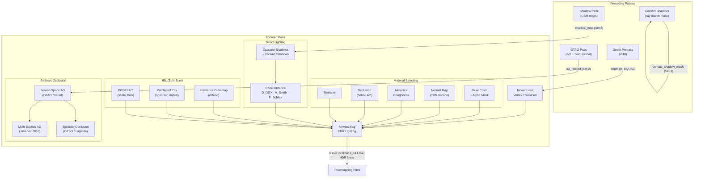
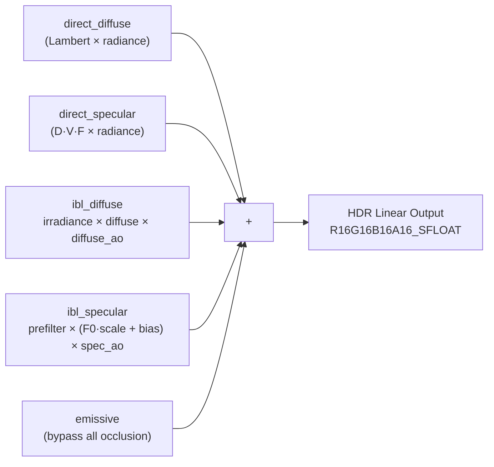

The forward pass is the central lighting stage of himalaya's multi-pass rasterization pipeline. It consumes every GPU data artifact produced by preceding passes — the depth buffer from the depth prepass, shadow maps from the shadow pass, ambient occlusion from GTAO, and contact shadow masks — and synthesizes them into a single HDR color buffer per pixel. The pass implements a complete physically-based rendering pipeline: **Cook-Torrance specular** microfacet BRDF for direct lighting, the **Epic Split-Sum** approximation for image-based lighting (IBL), **multi-bounce ambient occlusion** color compensation, and two selectable **specular occlusion** strategies (Lagarde and GTSO). Its architecture is deliberately depth-test-only (`VK_COMPARE_OP_EQUAL` with write disabled), leveraging the depth prepass to achieve zero-overdraw fragment shading for all opaque and alpha-masked geometry.

Sources: [forward_pass.cpp](https://github.com/1PercentSync/himalaya/blob/main/passes/src/forward_pass.cpp#L1-L55), [forward.frag](https://github.com/1PercentSync/himalaya/blob/main/shaders/forward.frag#L1-L15)

## Architecture Overview

The forward pass operates at Layer 2 of the himalaya architecture. It receives no push constants — all per-frame data flows through the three-set bindless descriptor layout (Set 0: global UBO + SSBOs, Set 1: bindless texture/cubemap arrays, Set 2: render pass intermediate textures). The C++ `ForwardPass` class is responsible solely for pipeline lifecycle management and render graph pass registration; all lighting logic resides in the GLSL fragment shader.

Sources: [forward_pass.h](https://github.com/1PercentSync/himalaya/blob/main/passes/include/himalaya/passes/forward_pass.h#L1-L55), [forward.frag](https://github.com/1PercentSync/himalaya/blob/main/shaders/forward.frag#L101-L179), [bindings.glsl](https://github.com/1PercentSync/himalaya/blob/main/shaders/common/bindings.glsl#L86-L135)

## Pipeline Configuration and Render Graph Integration

The `ForwardPass` class owns a single Vulkan graphics pipeline, compiled from [forward.vert](https://github.com/1PercentSync/himalaya/blob/main/shaders/forward.vert) and [forward.frag](https://github.com/1PercentSync/himalaya/blob/main/shaders/forward.frag). Pipeline creation occurs in `create_pipelines()`, which first compiles both shaders to SPIR-V. If compilation fails, the old pipeline is kept intact so the renderer continues with the previous working shaders — a resilience mechanism for hot-reload workflows. The pipeline is configured with:

| Property | Value | Rationale |
|----------|-------|-----------|
| Color format | `R16G16B16A16_SFLOAT` | HDR linear output for tonemapping |
| Depth format | `D32_SFLOAT` | Matches depth prepass format |
| Depth test | `EQUAL`, write `OFF` | Zero-overdraw: only fragments matching prepass Z survive |
| MSAA | Configurable via `sample_count` | Dynamic reconstruction on sample count change |
| Face culling | Per-material (`BACK` or `NONE`) | Double-sided materials disable culling |
| Vertex layout | `Vertex` binding (5 attributes) | Position, normal, UV0, tangent, UV1 |

The pass registers with the render graph via `ForwardPass::record()`, declaring its resource dependencies so the graph inserts correct memory barriers. The resource setup differs by MSAA mode: in MSAA mode, the pass renders to `msaa_color` with automatic resolve into `hdr_color`, while `msaa_depth` is read-only; in 1× mode, it renders directly to `hdr_color` and reads `depth`. In both cases, screen-space effect textures (`ao_filtered`, `contact_shadow_mask`) are declared as fragment-stage read dependencies, ensuring compute-to-fragment barriers are inserted.

Sources: [forward_pass.cpp](https://github.com/1PercentSync/himalaya/blob/main/passes/src/forward_pass.cpp#L59-L101), [forward_pass.cpp](https://github.com/1PercentSync/himalaya/blob/main/passes/src/forward_pass.cpp#L105-L239), [render_constants.h](https://github.com/1PercentSync/himalaya/blob/main/framework/include/himalaya/framework/render_constants.h#L4-L20)

## Vertex Shader — Transform and `invariant` Depth Matching

The vertex shader performs a straightforward model → world → clip transformation chain. Each vertex reads per-instance data from the `InstanceBuffer` SSBO at `gl_InstanceIndex` (mapped to `firstInstance` in the instanced draw call). The key design decision is the use of `invariant gl_Position`, which guarantees bit-identical depth output with [depth_prepass.vert](https://github.com/1PercentSync/himalaya/blob/main/shaders/depth_prepass.vert). Without this qualifier, two separate compilations of the same math (`view_projection * model * position`) could produce different floating-point rounding, causing the `EQUAL` depth test to reject fragments that should pass — manifesting as fully black renders.

The normal matrix is precomputed on the CPU as `transpose(inverse(mat3(model)))` and stored per-instance as three `vec4` columns. This avoids a per-vertex `mat3(inverse(...))` operation and correctly handles non-uniform scaling. The tangent vector is transformed through the same normal matrix, with the MikkTSpace handedness sign preserved in the `w` component.

Sources: [forward.vert](https://github.com/1PercentSync/himalaya/blob/main/shaders/forward.vert#L1-L56), [scene_data.h](https://github.com/1PercentSync/himalaya/blob/main/framework/include/himalaya/framework/scene_data.h#L357-L364)

## Material Sampling and Metallic-Roughness Workflow

The fragment shader begins by loading the `GPUMaterialData` struct from the `MaterialBuffer` SSBO using `frag_material_index` (a `flat` interpolant — no interpolation across the triangle). All five material textures are sampled via bindless indexing (`nonuniformEXT` qualifier on the texture index):

1. **Base color** — `base_color_factor` (RGBA) multiplied with the sampled texture. If `alpha_mode == Mask` and the resulting alpha falls below `alpha_cutoff`, the fragment is discarded immediately. This is the alpha-test path for cutout geometry (leaves, fences).
2. **Normal map** — RG channels from a BC5-compressed tangent-space normal map. Decoded via `get_shading_normal()`, which constructs a TBN matrix from the geometric normal and vertex tangent, reconstructs the Z component from RG, and transforms to world-space. Falls back to the geometric normal when the tangent is degenerate.
3. **Metallic/Roughness** — Green channel = roughness, Blue channel = metallic (glTF ORM convention). Multiplied by their respective scalar factors.
4. **Occlusion** — Single-channel baked ambient occlusion, scaled by `occlusion_strength` using the identity remap `1.0 + strength * (sample - 1.0)`.
5. **Emissive** — RGB texture multiplied by `emissive_factor`. Bypasses all occlusion and lighting — added directly to the final color.

The metallic workflow separation computes `F0 = mix(vec3(0.04), base_color, metallic)` for the Fresnel base reflectance (dielectrics get 4%, metals get their albedo as F0), and `diffuse_color = base_color * (1 - metallic)` to zero out diffuse contribution for fully metallic surfaces.

Sources: [forward.frag](https://github.com/1PercentSync/himalaya/blob/main/shaders/forward.frag#L101-L189), [normal.glsl](https://github.com/1PercentSync/himalaya/blob/main/shaders/common/normal.glsl#L26-L45), [bindings.glsl](https://github.com/1PercentSync/himalaya/blob/main/shaders/common/bindings.glsl#L36-L54), [material_system.h](https://github.com/1PercentSync/himalaya/blob/main/framework/include/himalaya/framework/material_system.h#L39-L57)

## Direct Lighting — Cook-Torrance Microfacet BRDF

For each directional light, the shader evaluates the standard Cook-Torrance specular BRDF along with a Lambertian diffuse term:

**Specular** = D(h) · G(l,v) · F(v,h) / (4 · NdotL · NdotV), where the `V_SmithGGX` function already incorporates the denominator, yielding the compact form `D * V * F`:

| Component | Function | Model | Source |
|-----------|----------|-------|--------|
| **D** — Normal Distribution | `D_GGX(NdotH, α)` | GGX/Trowbridge-Reitz | `α² / (π · (NdotH² · (α²-1) + 1)²)` |
| **V** — Visibility | `V_SmithGGX(NdotV, NdotL, α)` | Height-correlated Smith | `0.5 / (NdotL·√(NdotV²·(1-α²)+α²) + NdotV·√(NdotL²·(1-α²)+α²))` |
| **F** — Fresnel | `F_Schlick(VdotH, F0)` | Schlick approximation | `F0 + (1-F0) · (1-VdotH)⁵` |

The implementation uses `α = roughness²` (squared roughness) throughout, which is the standard parameterization for the GGX distribution. The `V_SmithGGX` function implements Heitz 2014's height-correlated masking-shadowing, which is more accurate than the separable Smith model for grazing angles. Diffuse is computed as `(1-F) · diffuse_color · (1/π) · radiance`, where the `(1-F)` factor accounts for energy conservation — the Fresnel term already routed energy into the specular lobe.

Shadow attenuation is applied per-light: cascade shadow blending via `blend_cascade_shadow()` for lights with `cast_shadows == true` (guarded by `FEATURE_SHADOWS`), and contact shadow multiplication for the primary directional light (index 0). Both direct diffuse and specular contributions are accumulated separately (`direct_diffuse`, `direct_specular`) to support debug render modes that isolate individual components.

Sources: [forward.frag](https://github.com/1PercentSync/himalaya/blob/main/shaders/forward.frag#L202-L237), [brdf.glsl](https://github.com/1PercentSync/himalaya/blob/main/shaders/common/brdf.glsl#L28-L72), [shadow.glsl](https://github.com/1PercentSync/himalaya/blob/main/shaders/common/shadow.glsl#L1-L10)

## IBL Environment Lighting — Epic Split-Sum Approximation

Image-based lighting is decomposed via the **Split-Sum** approximation, which factors the specular IBL integral into a preconvolved environment term and a BRDF integration term that can be precomputed independently:

**Specular IBL** ≈ PrefilteredColor(R, α) × BRDF_Integration(NdotV, α), where:
- **PrefilteredColor** is sampled from the prefiltered environment cubemap at the reflection direction `R` with `mip = roughness × (mip_count - 1)`. Higher mip levels correspond to rougher surfaces. The prefilter is generated offline by [prefilter.comp](https://github.com/1PercentSync/himalaya/blob/main/shaders/ibl/prefilter.comp) using 1024 GGX importance samples with PDF-based mip level selection to avoid aliasing artifacts.
- **BRDF Integration** returns `(scale, bias)` from the 2D LUT such that `F_integrated = F0 × scale + bias`. This is generated by [brdf_lut.comp](https://github.com/1PercentSync/himalaya/blob/main/shaders/ibl/brdf_lut.comp) using the IBL-remapped geometry function (`k = α²/2` instead of the analytic `(α+1)²/8`).

**Diffuse IBL** uses a separate irradiance cubemap (cosine-weighted hemisphere convolution of the environment, generated by [irradiance.comp](https://github.com/1PercentSync/himalaya/blob/main/shaders/ibl/irradiance.comp)), scaled by `diffuse_color`. Both IBL terms are multiplied by `ibl_intensity` from the global UBO for artistic control. An optional Y-axis rotation (`rotate_y()` using sin/cos from `ibl_rotation_sin`/`ibl_rotation_cos`) is applied to the normal and reflection directions, enabling runtime environment map rotation without recomputing the IBL textures.

Sources: [forward.frag](https://github.com/1PercentSync/himalaya/blob/main/shaders/forward.frag#L239-L249), [prefilter.comp](https://github.com/1PercentSync/himalaya/blob/main/shaders/ibl/prefilter.comp#L31-L79), [brdf_lut.comp](https://github.com/1PercentSync/himalaya/blob/main/shaders/ibl/brdf_lut.comp#L44-L91), [irradiance.comp](https://github.com/1PercentSync/himalaya/blob/main/shaders/ibl/irradiance.comp#L26-L71), [transform.glsl](https://github.com/1PercentSync/himalaya/blob/main/shaders/common/transform.glsl#L17-L19)

## Ambient Occlusion — Multi-Bounce Compensation and Specular Occlusion

The forward pass combines two AO sources and applies two distinct occlusion strategies to the diffuse and specular IBL terms:

### Diffuse AO — Screen-Space × Material with Multi-Bounce Compensation

Screen-space AO (from the GTAO temporal filter, channel A) is multiplied with material-baked AO to produce `combined_ao = ssao × material_ao`. This raw product over-darkens light-colored surfaces because high-albedo materials scatter more inter-reflected light in occluded regions — a single-bounce AO model assumes zero indirect bounce. The **Jimenez 2016 multi-bounce AO** compensation corrects this with a per-channel polynomial: `multi_bounce_ao(ao, albedo) = max(ao, ((ao·a + b)·ao + c)·ao)` where `a = 2.0404·albedo - 0.3324`, `b = -4.7951·albedo + 0.6417`, `c = 2.7552·albedo + 0.6903`. The result is always ≥ the input `ao`, with larger corrections for brighter albedos. Note that `albedo` here is `diffuse_color` (base color × (1-metallic)), so metallic surfaces receive minimal correction — physically correct since metals do not participate in diffuse interreflection.

### Specular Occlusion — Selectable GTSO or Lagarde

Direct lighting does not receive AO attenuation (shadows already handle direct occlusion). For specular IBL, two strategies are selectable at runtime via `global.ao_so_mode`:

| Mode | Function | Method | Inputs |
|------|----------|--------|--------|
| `AO_SO_LAGARDE` (0) | `lagarde_so(NdotV, ao, α)` | Analytical: `pow(NdotV + ao, exp2(-16α - 1)) - 1 + ao` | View angle, AO, roughness |
| `AO_SO_GTSO` (1) | `gtso_specular_occlusion(bent_normal, R, ao, α)` | Cone intersection: visibility cone ∩ specular cone via smoothstep | Bent normal, reflection, AO, roughness |

The GTSO mode decodes the bent normal from the GTAO output's RGB channels (view-space encoded as `× 0.5 + 0.5`, decoded and transposed to world-space), then computes the visibility cone half-angle as `acos(√(1-ao))` and the specular cone half-angle as `acos(0.01^(0.5·α²))`. The angular separation between cone axes (`β = acos(dot(bent_normal, R))`) drives a smoothstep intersection factor. An `ao²` grazing-angle compensation blends toward 1.0 to eliminate false darkening when AO is near 1.0 — the cone model treats the hemisphere boundary as an occlusion edge even when the surface is mostly unoccluded.

Sources: [forward.frag](https://github.com/1PercentSync/himalaya/blob/main/shaders/forward.frag#L43-L99), [forward.frag](https://github.com/1PercentSync/himalaya/blob/main/shaders/forward.frag#L251-L281), [bindings.glsl](https://github.com/1PercentSync/himalaya/blob/main/shaders/common/bindings.glsl#L63-L65)

## Final Compositing and Debug Render Modes

The final color is assembled from four additive components, controlled by `global.debug_render_mode`:

| Debug Mode | Output | Purpose |
|------------|--------|---------|
| `FULL_PBR` (0) | Full composite + emissive | Default rendering |
| `DIFFUSE_ONLY` (1) | Direct + IBL diffuse with AO | Isolate diffuse lighting |
| `SPECULAR_ONLY` (2) | Direct + IBL specular with SO | Isolate specular highlights |
| `IBL_ONLY` (3) | IBL diffuse + specular (no direct) | Isolate environment lighting |
| `NORMAL` (4) | Shading normal RGB (N×0.5+0.5) | Verify normal maps |
| `METALLIC` (5) | Metallic scalar as grayscale | Verify metallic map |
| `ROUGHNESS` (6) | Roughness scalar as grayscale | Verify roughness map |
| `AO` (7) | Combined SSAO × material AO | Verify occlusion |
| `SHADOW_CASCADES` (8) | Cascade index → color mapping | Visualize cascade assignment |
| `AO_SSAO` (9) | Raw GTAO temporal-filtered output | Isolate screen-space AO |
| `CONTACT_SHADOWS` (10) | Raw contact shadow mask | Isolate per-pixel ray march |

The debug modes before `PASSTHROUGH_START` (4) compute full PBR lighting but exclude certain terms; modes ≥ 4 skip lighting entirely and output a single visualization value. The output is raw HDR linear — exposure and tone mapping are applied in the downstream [Skybox and Tonemapping Passes](https://github.com/1PercentSync/himalaya/blob/main/21-skybox-and-tonemapping-passes).

Sources: [forward.frag](https://github.com/1PercentSync/himalaya/blob/main/shaders/forward.frag#L286-L307), [bindings.glsl](https://github.com/1PercentSync/himalaya/blob/main/shaders/common/bindings.glsl#L73-L84)

## Draw Call Orchestration and Instanced Rendering

The C++ recording loop iterates two draw group lists: `opaque_draw_groups` and `mask_draw_groups`. Each `MeshDrawGroup` bundles instances that share the same mesh resource, enabling a single `draw_indexed()` call per group. The `firstInstance` parameter maps to the SSBO offset in `InstanceBuffer`, so the vertex shader's `instances[gl_InstanceIndex]` resolves to the correct per-instance transform and material index. Face culling is set per-group based on the material's `double_sided` property — transparent instances (Blend mode) are intentionally excluded, as the `EQUAL` depth test would reject them (they were not rendered in the depth prepass).

Sources: [forward_pass.cpp](https://github.com/1PercentSync/himalaya/blob/main/passes/src/forward_pass.cpp#L179-L202)

## Data Flow Summary

The following table summarizes every GPU buffer and texture the forward pass reads, organized by descriptor set:

| Set | Binding | Resource | Type | Purpose |
|-----|---------|----------|------|---------|
| 0 | 0 | `GlobalUBO` | Uniform | Matrices, camera, IBL indices, shadow config, feature flags |
| 0 | 1 | `LightBuffer` | SSBO | Directional light directions, colors, shadow flags |
| 0 | 2 | `MaterialBuffer` | SSBO | Per-material factors and bindless texture indices (80 bytes each) |
| 0 | 3 | `InstanceBuffer` | SSBO | Per-instance model matrix, normal matrix, material index (128 bytes each) |
| 1 | 0 | `textures[]` | Bindless | All 2D textures (base color, normal, MR, occlusion, emissive, BRDF LUT) |
| 1 | 1 | `cubemaps[]` | Bindless | Irradiance and prefiltered environment cubemaps |
| 2 | 0 | `rt_hdr_color` | Sampler2D | (Write target, declared for RG barrier tracking) |
| 2 | 3 | `rt_ao_texture` | Sampler2D | GTAO output: RGB = bent normal, A = AO value |
| 2 | 4 | `rt_contact_shadow_mask` | Sampler2D | Contact shadow binary mask (R channel) |
| 2 | 5 | `rt_shadow_map` | Sampler2DArrayShadow | CSM shadow maps for depth comparison |
| 2 | 6 | `rt_shadow_map_depth` | Sampler2DArray | CSM depth values for PCSS blocker search |

Sources: [bindings.glsl](https://github.com/1PercentSync/himalaya/blob/main/shaders/common/bindings.glsl#L86-L188), [forward_pass.cpp](https://github.com/1PercentSync/himalaya/blob/main/passes/src/forward_pass.cpp#L157-L162)

## Next Steps

The forward pass outputs HDR linear color into the render graph's `hdr_color` resource. From here, the pipeline continues with:

- [Skybox and Tonemapping Passes](https://github.com/1PercentSync/himalaya/blob/main/21-skybox-and-tonemapping-passes) — composites the skybox, applies exposure/tone mapping, and converts to display-ready output
- [GTAO Pass — Horizon-Based Ambient Occlusion with Spatial and Temporal Denoising](https://github.com/1PercentSync/himalaya/blob/main/19-gtao-pass-horizon-based-ambient-occlusion-with-spatial-and-temporal-denoising) — produces the AO and bent normal data consumed by this pass
- [Shadow Pass — CSM Rendering, PCF, and PCSS Contact-Hardening Soft Shadows](https://github.com/1PercentSync/himalaya/blob/main/18-shadow-pass-csm-rendering-pcf-and-pcss-contact-hardening-soft-shadows) — generates the cascade shadow maps sampled here
- [GLSL Shader Architecture — Shared Bindings, BRDF Library, and Feature Flags](https://github.com/1PercentSync/himalaya/blob/main/25-glsl-shader-architecture-shared-bindings-brdf-library-and-feature-flags) — details the shared shader infrastructure that makes the three-set bindless design work