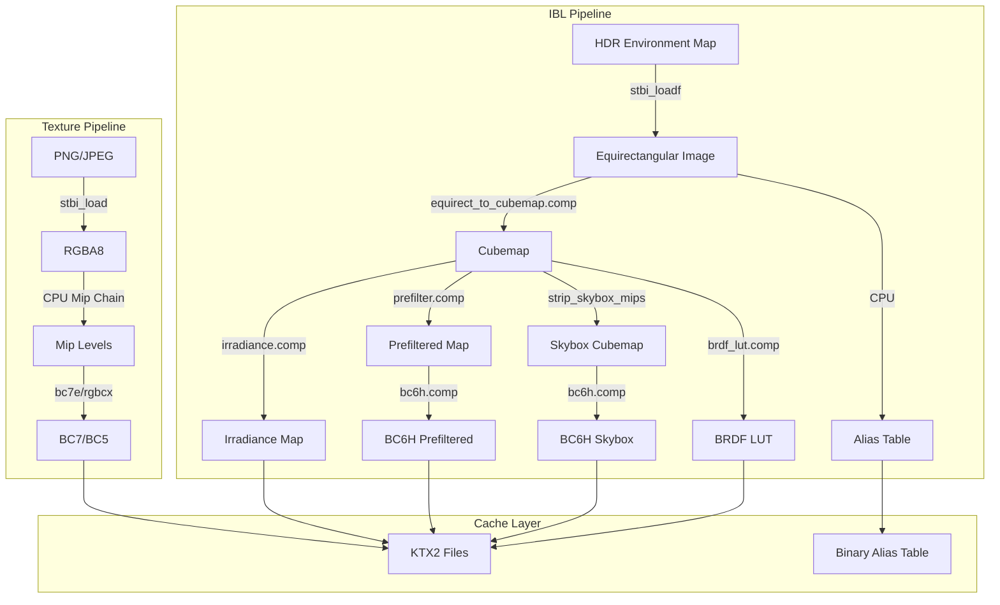

Image-Based Lighting (IBL) and texture processing form the foundation of physically-based rendering in Himalaya, transforming raw HDR environment maps and material textures into GPU-ready compressed formats. This system bridges the gap between offline content creation and real-time rendering through a sophisticated pipeline that combines compute shader precomputation, aggressive memory optimization, and intelligent caching.

## Architecture Overview

The IBL and texture processing subsystem consists of two primary domains: **environment lighting precomputation** handled by the `IBL` class, and **material texture processing** managed through the texture utilities. Both systems share common infrastructure including the KTX2 container format for caching, BC compression for memory efficiency, and bindless descriptor registration for shader access.

Sources: [ibl.h](https://github.com/1PercentSync/himalaya/blob/main/framework/include/himalaya/framework/ibl.h#L1-L110), [texture.h](https://github.com/1PercentSync/himalaya/blob/main/framework/include/himalaya/framework/texture.h#L1-L100)

## IBL Precomputation Pipeline

The IBL system transforms equirectangular HDR environment maps into a set of precomputed textures that enable realistic image-based lighting at runtime. The pipeline follows the split-sum approximation approach popularized by Unreal Engine 4, separating the environment convolution from the BRDF integration.

### Pipeline Stages

| Stage | Output | Resolution | Format | Purpose |
|-------|--------|------------|--------|---------|
| Equirect to Cubemap | Cubemap | Variable (≤2048) | R16G16B16A16F | Base environment |
| Irradiance Convolution | Irradiance | 32×32 | R11G11B10F | Diffuse IBL |
| Prefilter Convolution | Prefiltered | 512×512 + mips | R16G16B16A16F | Specular IBL |
| BRDF Integration | BRDF LUT | 256×256 | R16G16_UNORM | Fresnel response |
| Mip Stripping | Skybox | Base only | BC6H | Background rendering |
| BC6H Compression | Compressed | Same | BC6H | Memory reduction |

Sources: [ibl.cpp](https://github.com/1PercentSync/himalaya/blob/main/framework/src/ibl.cpp#L249-L350), [ibl_compute.cpp](https://github.com/1PercentSync/himalaya/blob/main/framework/src/ibl_compute.cpp#L23-L226)

### Equirectangular to Cubemap Conversion

The first stage converts the 2D equirectangular projection into a 6-face cubemap. The cubemap face size is derived from the equirectangular width to maintain angular resolution: `min(bit_ceil(equirect_width / 4), 2048)`. This ensures that the 360° horizontal span maps to four 90° faces without losing detail.

The compute shader `equirect_to_cubemap.comp` dispatches one thread per texel per face, converting 3D direction vectors to spherical coordinates for texture sampling. The shader handles the coordinate transformation from cubemap face indices and UVs to world-space directions, then samples the equirectangular map at the corresponding longitude/latitude.

Sources: [ibl_compute.cpp](https://github.com/1PercentSync/himalaya/blob/main/framework/src/ibl_compute.cpp#L23-L226), [equirect_to_cubemap.comp](https://github.com/1PercentSync/himalaya/blob/main/shaders/ibl/equirect_to_cubemap.comp#L1-L51)

### Diffuse Irradiance Convolution

The irradiance map captures the diffuse response of the environment through cosine-weighted hemisphere convolution. For each output texel, the shader integrates the environment over the hemisphere centered on the texel's normal, weighting by the Lambertian cosine term. The integration uses uniform angular stepping in spherical coordinates with firefly rejection to clamp extreme HDR values.

The 32×32 resolution is sufficient because diffuse reflection naturally blurs high-frequency details. The R11G11B10F format provides adequate precision while reducing memory footprint compared to full float16.

Sources: [ibl_compute.cpp](https://github.com/1PercentSync/himalaya/blob/main/framework/src/ibl_compute.cpp#L228-L420), [irradiance.comp](https://github.com/1PercentSync/himalaya/blob/main/shaders/ibl/irradiance.comp#L1-L72)

### Specular Prefiltering

Specular IBL requires a mipmapped cubemap where each level represents the environment convolved at increasing roughness values. The prefilter shader uses GGX importance sampling with 1024 samples per texel, distributing samples proportionally to the microfacet distribution. The roughness parameter is passed via push constant, allowing a single pipeline to generate all mip levels.

A critical optimization is PDF-based mip level selection: the shader computes the solid angle of each importance sample and selects the source mip level where texel size matches sample footprint. This prevents aliasing when sampling high-frequency environment details at grazing angles.

Sources: [ibl_compute.cpp](https://github.com/1PercentSync/himalaya/blob/main/framework/src/ibl_compute.cpp#L422-L632), [prefilter.comp](https://github.com/1PercentSync/himalaya/blob/main/shaders/ibl/prefilter.comp#L1-L80)

### BRDF Integration LUT

The BRDF LUT precomputes the environment-independent portion of the split-sum approximation. For each (NdotV, roughness) pair, the shader integrates the GGX BRDF over the hemisphere, producing scale and bias terms such that `F_integrated = F0 * scale + bias`. The integration uses the same importance sampling strategy as the prefilter pass but operates in 2D texture space rather than cubemap space.

Sources: [ibl_compute.cpp](https://github.com/1PercentSync/himalaya/blob/main/framework/src/ibl_compute.cpp#L750-L883), [brdf_lut.comp](https://github.com/1PercentSync/himalaya/blob/main/shaders/ibl/brdf_lut.comp#L1-L92)

## Memory Optimization Strategies

The IBL system employs aggressive memory optimizations to minimize GPU memory footprint without sacrificing visual quality.

### Mip Stripping

After prefiltering completes, the skybox cubemap no longer requires its full mip chain since it's only sampled at the base level for background rendering. The system creates a mip-stripped copy containing only level 0, freeing approximately 25% of the cubemap memory. The original cubemap with full mips is destroyed after the copy completes.

Sources: [ibl_compute.cpp](https://github.com/1PercentSync/himalaya/blob/main/framework/src/ibl_compute.cpp#L634-L748)

### BC6H GPU Compression

HDR cubemaps consume significant memory in uncompressed float16 format. The system performs GPU-side BC6H compression using a compute shader ported from the Betsy compressor. BC6H provides 6:1 compression for HDR content (128 bits per 4×4 block storing 16 float16 texels), reducing the skybox and prefiltered cubemap memory by 83%.

The compression shader supports both one-subset (mode 11) and two-subset (modes 2 and 6) encoding with least-squares endpoint refinement for improved quality. Each thread compresses one 4×4 texel block, writing to a staging buffer that is then copied to the compressed image.

Sources: [ibl_compress.cpp](https://github.com/1PercentSync/himalaya/blob/main/framework/src/ibl_compress.cpp#L1-L333), [bc6h.comp](https://github.com/1PercentSync/himalaya/blob/main/shaders/compress/bc6h.comp#L1-L200)

## Environment Importance Sampling

For path tracing and reference rendering, the system builds an alias table for efficient environment map sampling proportional to luminance. The implementation uses Vose's algorithm for O(N) construction of the alias method data structure.

The alias table is built at half the equirectangular resolution (source dimensions / 2) with 2×2 box filtering and sin(theta) solid angle weighting. Each entry stores probability, alias index, and original luminance for PDF evaluation. The table enables O(1) importance sampling of the environment for direct lighting estimation.

Sources: [ibl.cpp](https://github.com/1PercentSync/himalaya/blob/main/framework/src/ibl.cpp#L507-L665)

## Material Texture Processing

Material textures follow a separate pipeline optimized for LDR content, using CPU-side BC compression with the bc7e ISPC encoder for maximum quality.

### Texture Roles and Formats

| Role | Format | Use Case | Compression |
|------|--------|----------|-------------|
| Color | BC7_SRGB | Base color, emissive | bc7e (perceptual) |
| Linear | BC7_UNORM | Roughness, metallic, occlusion | bc7e (non-perceptual) |
| Normal | BC5_UNORM | Tangent-space normals | rgbcx (high quality) |

The role-based format selection ensures correct gamma handling: sRGB textures are filtered in linear space to prevent darkening artifacts in mipmaps, while linear data maintains raw numeric values.

Sources: [texture.h](https://github.com/1PercentSync/himalaya/blob/main/framework/include/himalaya/framework/texture.h#L28-L32), [texture.cpp](https://github.com/1PercentSync/himalaya/blob/main/framework/src/texture.cpp#L233-L254)

### Mip Chain Generation

CPU-side mip generation uses stb_image_resize2 with appropriate color space handling. For sRGB textures, the resizer performs decode (gamma expand) → filter → encode (gamma compress) to maintain perceptual correctness. All mip levels are 4-aligned to satisfy BC block requirements at the base level.

Sources: [texture.cpp](https://github.com/1PercentSync/himalaya/blob/main/framework/src/texture.cpp#L79-L138)

## Caching Infrastructure

Both IBL and texture processing leverage a shared caching system to avoid redundant computation across application runs.

### KTX2 Container Format

The system uses Khronos KTX2 as the cache container, supporting BC5, BC6H, BC7, R16G16B16A16_SFLOAT, B10G11R11_UFLOAT_PACK32, and R16G16_UNORM formats. The implementation writes proper Data Format Descriptors (DFD) for format compatibility with external tools.

Cache keys are derived from XXH3_128 content hashes of source files. For IBL, the HDR file hash generates cache keys for each product (`{hash}_skybox`, `{hash}_irradiance`, `{hash}_prefiltered`). For textures, the source hash plus format suffix (`_bc7s`, `_bc7u`, `_bc5u`) forms the key.

Sources: [ktx2.h](https://github.com/1PercentSync/himalaya/blob/main/framework/include/himalaya/framework/ktx2.h#L1-L67), [ktx2.cpp](https://github.com/1PercentSync/himalaya/blob/main/framework/src/ktx2.cpp#L1-L200), [cache.h](https://github.com/1PercentSync/himalaya/blob/main/framework/include/himalaya/framework/cache.h#L1-L60)

### Cache Invalidation

The cache system provides category-based invalidation for development workflows. The `clear_cache()` function removes all files in a category subdirectory (e.g., "ibl", "textures"), while `clear_all_cache()` wipes the entire cache root.

Sources: [cache.h](https://github.com/1PercentSync/himalaya/blob/main/framework/include/himalaya/framework/cache.h#L36-L44)

## GPU Resource Management

All IBL products are registered to Set 1 bindless arrays for shader access. The cubemap sampler uses linear filtering with mip interpolation, enabling the prefiltered cubemap's roughness-to-mip mapping. The BRDF LUT is registered as a 2D texture rather than a cubemap.

Resource destruction follows a strict order: bindless entries are unregistered first to return slots to free lists, then underlying images and samplers are destroyed. This prevents descriptor table corruption from dangling references.

Sources: [ibl.cpp](https://github.com/1PercentSync/himalaya/blob/main/framework/src/ibl.cpp#L779-L836), [ibl.h](https://github.com/1PercentSync/himalaya/blob/main/framework/include/himalaya/framework/ibl.h#L78-L109)

## Fallback Handling

When HDR loading fails, the system creates minimal 1×1 neutral gray cubemaps as fallbacks. The `vkCmdClearColorImage` command fills all cubemap faces with a uniform 10% gray value. This ensures the rendering pipeline operates identically without shader-side conditionals for missing environment data.

Sources: [ibl.cpp](https://github.com/1PercentSync/himalaya/blob/main/framework/src/ibl.cpp#L667-L777)

## Integration Points

The IBL system integrates with other rendering subsystems through several key interfaces:

- **[Material System and PBR](https://github.com/1PercentSync/himalaya/blob/main/13-material-system-and-pbr)**: IBL textures provide environment lighting contributions combined with material BRDFs
- **[Skybox Pass](https://github.com/1PercentSync/himalaya/blob/main/22-post-processing-pipeline)**: The skybox cubemap renders the background environment
- **[Path Tracing Reference View](https://github.com/1PercentSync/himalaya/blob/main/21-path-tracing-reference-view)**: The alias table enables environment importance sampling for unbiased direct lighting
- **[Render Graph System](https://github.com/1PercentSync/himalaya/blob/main/12-render-graph-system)**: IBL resources are referenced as persistent textures across frames

For developers extending the IBL system, the compute shader infrastructure in `shaders/ibl/` provides reusable utilities including Hammersley sequence generation, GGX importance sampling, and cubemap direction calculations in `ibl_common.glsl`.