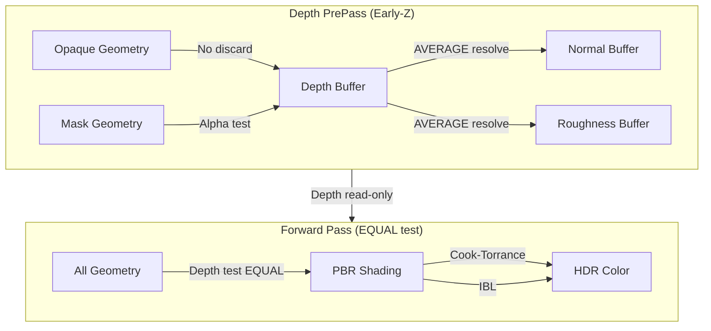

The Depth PrePass and Forward Rendering pipeline forms the core rasterization path in Himalaya, implementing a **Z-prepass architecture** that eliminates overdraw for opaque geometry while supporting full PBR lighting with MSAA. This design prioritizes **Early-Z rejection** and **zero-overdraw** through bit-identical depth values between passes, enabling the forward pass to use an `EQUAL` depth test with depth writes disabled.

Sources: [depth_prepass.h](https://github.com/1PercentSync/himalaya/blob/main/passes/include/himalaya/passes/depth_prepass.h#L1-L126), [forward_pass.h](https://github.com/1PercentSync/himalaya/blob/main/passes/include/himalaya/passes/forward_pass.h#L1-L119)

## Architectural Overview

The rendering pipeline follows a classic Z-prepass pattern with two distinct phases. First, the **DepthPrePass** renders all visible opaque and alpha-masked geometry to populate the depth buffer, normal buffer, and roughness buffer. Then, the **ForwardPass** performs full PBR shading using the pre-populated depth buffer for occlusion testing. This separation enables several optimizations: Early-Z hardware rejection during the prepass, zero-overdraw in the forward pass via `EQUAL` depth testing, and decoupled complexity where expensive lighting only runs for visible fragments.



Sources: [depth_prepass.cpp](https://github.com/1PercentSync/himalaya/blob/main/passes/src/depth_prepass.cpp#L1-L332), [forward_pass.cpp](https://github.com/1PercentSync/himalaya/blob/main/passes/src/forward_pass.cpp#L1-L241)

## Depth PrePass Implementation

The DepthPrePass class manages two distinct graphics pipelines to handle different alpha modes optimally. The **Opaque pipeline** uses `depth_prepass.frag` which contains no discard operations, guaranteeing Early-Z functionality. The **Mask pipeline** uses `depth_prepass_masked.frag` which performs alpha testing via discard—this may disable Early-Z but is necessary for correct alpha-masked geometry rendering. The passes are recorded in order: opaque first to maximize Early-Z benefits, then mask to leverage existing depth for occlusion rejection.

Sources: [depth_prepass.cpp](https://github.com/1PercentSync/himalaya/blob/main/passes/src/depth_prepass.cpp#L71-L125), [depth_prepass.h](https://github.com/1PercentSync/himalaya/blob/main/passes/include/himalaya/passes/depth_prepass.h#L95-L102)

### Render Target Outputs

The DepthPrePass produces three outputs simultaneously using multiple color attachments:

| Attachment | Format | Purpose | Resolve Mode (MSAA) |
|------------|--------|---------|---------------------|
| Depth | `D32_SFLOAT` | Scene depth (reverse-Z) | `MAX_BIT` |
| Normal | `A2B10G10R10_UNORM_PACK32` | World-space shading normal | `AVERAGE` |
| Roughness | `R8_UNORM` | Per-pixel roughness | `AVERAGE` |

The normal and roughness buffers are computed during the prepass to avoid redundant texture sampling in the forward pass. The normal encoding uses `n * 0.5 + 0.5` mapping to `R10G10B10A2` UNORM, which preserves precision while remaining compatible with MSAA average resolve—averaging encoded values produces the correct average normal after decode and renormalization.

Sources: [render_constants.h](https://github.com/1PercentSync/himalaya/blob/main/framework/include/himalaya/framework/render_constants.h#L1-L29), [normal.glsl](https://github.com/1PercentSync/himalaya/blob/main/shaders/common/normal.glsl#L40-L77)

### Shader Implementation

The vertex shader uses `invariant gl_Position` to guarantee bit-identical depth values between the prepass and forward pass. This invariant qualifier ensures that the same vertex transformation math produces exactly the same floating-point result in both shaders, which is essential for the `EQUAL` depth test to function correctly.

Sources: [depth_prepass.vert](https://github.com/1PercentSync/himalaya/blob/main/shaders/depth_prepass.vert#L1-L54)

The fragment shaders construct world-space shading normals via TBN matrix transformation. For opaque geometry, the shader samples the normal map and metallic-roughness texture, encodes the normal to `R10G10B10A2`, and outputs roughness from the green channel. The masked variant additionally samples base color alpha and performs discard testing before normal computation.

Sources: [depth_prepass.frag](https://github.com/1PercentSync/himalaya/blob/main/shaders/depth_prepass.frag#L1-L43), [depth_prepass_masked.frag](https://github.com/1PercentSync/himalaya/blob/main/shaders/depth_prepass_masked.frag#L1-L53)

## Forward Pass Implementation

The ForwardPass performs full PBR lighting using the depth buffer populated by the prepass. It configures depth testing with `VK_COMPARE_OP_EQUAL` and depth writes disabled—fragments pass only if their depth exactly matches the prepass output, ensuring zero overdraw for opaque geometry. The pass reads screen-space effects (AO, contact shadows) via Set 2 bindings and applies them during lighting computation.

Sources: [forward_pass.cpp](https://github.com/1PercentSync/himalaya/blob/main/passes/src/forward_pass.cpp#L95-L130)

### PBR Lighting Pipeline

The forward fragment shader implements a complete metallic-roughness workflow with the following components:

**Direct Lighting**: Cook-Torrance microfacet BRDF with GGX normal distribution, Smith height-correlated visibility function, and Schlick Fresnel approximation. Each directional light contributes diffuse (Lambert) and specular (GGX) terms, modulated by shadow attenuation from cascaded shadow maps and contact shadows for the primary light.

**Image-Based Lighting**: Split-sum approximation using prefiltered environment cubemaps and BRDF LUT. Diffuse irradiance is sampled from the irradiance cubemap, while specular uses roughness-dependent prefiltered mip levels combined with the two-channel BRDF integral lookup.

**Ambient Occlusion**: Combined material AO (from occlusion texture) and screen-space AO (GTAO output) with multi-bounce color compensation to prevent over-darkening on high-albedo surfaces. Specular occlusion uses either Lagarde's approximation or GTSO (Ground-Truth Specular Occlusion) with bent normals for more accurate cone intersection.

Sources: [forward.frag](https://github.com/1PercentSync/himalaya/blob/main/shaders/forward.frag#L1-L308)

### Debug Visualization Modes

The forward shader supports multiple debug render modes for development and profiling:

| Mode | Description |
|------|-------------|
| `DEBUG_MODE_FULL_PBR` | Complete lighting (default) |
| `DEBUG_MODE_DIFFUSE_ONLY` | Direct + IBL diffuse only |
| `DEBUG_MODE_SPECULAR_ONLY` | Direct + IBL specular only |
| `DEBUG_MODE_IBL_ONLY` | Environment lighting only |
| `DEBUG_MODE_NORMAL` | World-space shading normal |
| `DEBUG_MODE_METALLIC` | Metallic factor visualization |
| `DEBUG_MODE_ROUGHNESS` | Roughness visualization |
| `DEBUG_MODE_AO` | Combined AO (SSAO × material) |
| `DEBUG_MODE_SHADOW_CASCADES` | Cascade index coloring |

These modes are selected via `global.debug_render_mode` and bypass the standard lighting combination for immediate visual feedback.

Sources: [bindings.glsl](https://github.com/1PercentSync/himalaya/blob/main/shaders/common/bindings.glsl#L55-L71), [forward.frag](https://github.com/1PercentSync/himalaya/blob/main/shaders/forward.frag#L85-L140)

## Instancing and Draw Group Architecture

Both passes consume **MeshDrawGroup** structures produced by the renderer's instancing system. After frustum culling, visible instances are sorted by `(mesh_id, alpha_mode, double_sided)` to maximize batching. The sorted indices are then grouped into draw calls where consecutive instances share the same mesh and material properties.

Sources: [frame_context.h](https://github.com/1PercentSync/himalaya/blob/main/framework/include/himalaya/framework/frame_context.h#L109-L112), [renderer_rasterization.cpp](https://github.com/1PercentSync/himalaya/blob/main/app/src/renderer_rasterization.cpp#L1-L100)

The draw group structure enables efficient instanced rendering:

```cpp
struct MeshDrawGroup {
    uint32_t mesh_id;        // Buffer binding reference
    uint32_t first_instance; // Offset in InstanceBuffer
    uint32_t instance_count; // Number of instances to draw
    bool double_sided;       // Cull mode override
};
```

Each draw group corresponds to a single `vkCmdDrawIndexed` call with instancing. The GPU instance data is pre-populated in the InstanceBuffer SSBO, containing model matrices and precomputed normal matrices (transpose of inverse) to avoid per-vertex matrix inversion in shaders.

Sources: [bindings.glsl](https://github.com/1PercentSync/himalaya/blob/main/shaders/common/bindings.glsl#L22-L28), [renderer_rasterization.cpp](https://github.com/1PercentSync/himalaya/blob/main/app/src/renderer_rasterization.cpp#L100-L150)

## MSAA Integration

Both passes support MSAA through dynamic rendering resolve operations. When MSAA is active, the prepass renders to multisampled attachments and resolves them to 1x resolved targets using appropriate resolve modes: `MAX_BIT` for depth (conservative, preserves nearest depth), `AVERAGE` for normal and roughness (linear values). The forward pass reads from the resolved depth buffer while rendering to a multisampled color target that resolves to the final HDR color buffer.

Sources: [depth_prepass.cpp](https://github.com/1PercentSync/himalaya/blob/main/passes/src/depth_prepass.cpp#L130-L200), [forward_pass.cpp](https://github.com/1PercentSync/himalaya/blob/main/passes/src/forward_pass.cpp#L50-L75)

## Pipeline State Configuration

| State | DepthPrePass | ForwardPass |
|-------|--------------|-------------|
| Depth Test | `GREATER` (reverse-Z) | `EQUAL` |
| Depth Write | Enabled | Disabled |
| Cull Mode | Back (configurable) | Back (configurable) |
| Color Outputs | Normal, Roughness | HDR Color |
| Early-Z | Guaranteed (opaque) | N/A (read-only) |

The reverse-Z depth configuration maps the far plane to 0.0 and near plane to 1.0, improving precision distribution and enabling the `GREATER` comparison for depth writes.

Sources: [depth_prepass.cpp](https://github.com/1PercentSync/himalaya/blob/main/passes/src/depth_prepass.cpp#L250-L260), [forward_pass.cpp](https://github.com/1PercentSync/himalaya/blob/main/passes/src/forward_pass.cpp#L115-L125)

## Render Graph Integration

Both passes declare their resource usage through the RenderGraph system, enabling automatic barrier insertion and lifetime management. The DepthPrePass declares read-write access to depth and write access to normal/roughness. The ForwardPass declares write access to HDR color and read access to depth, plus read access to screen-space effect textures (AO, contact shadows) to ensure compute-to-fragment barriers are inserted.

Sources: [depth_prepass.cpp](https://github.com/1PercentSync/himalaya/blob/main/passes/src/depth_prepass.cpp#L280-L332), [forward_pass.cpp](https://github.com/1PercentSync/himalaya/blob/main/passes/src/forward_pass.cpp#L200-L241)

## Integration in the Render Pipeline

The passes execute in the following order within the rasterization render path:

```cpp
if (shadows_active) {
    shadow_pass_.record(render_graph_, frame_ctx);
}
depth_prepass_.record(render_graph_, frame_ctx);
if (input.features.ao) {
    gtao_pass_.record(render_graph_, frame_ctx);
    ao_spatial_pass_.record(render_graph_, frame_ctx);
    ao_temporal_pass_.record(render_graph_, frame_ctx);
}
if (input.features.contact_shadows && !input.lights.empty()) {
    contact_shadows_pass_.record(render_graph_, frame_ctx);
}
forward_pass_.record(render_graph_, frame_ctx);
```

This ordering ensures that the depth buffer is available for screen-space effects (GTAO, contact shadows) before the forward pass consumes both depth and those effect outputs.

Sources: [renderer_rasterization.cpp](https://github.com/1PercentSync/himalaya/blob/main/app/src/renderer_rasterization.cpp#L320-L340)

## Related Documentation

- For the render graph system that orchestrates these passes, see [Render Graph System](https://github.com/1PercentSync/himalaya/blob/main/12-render-graph-system)
- For shadow mapping which feeds into forward lighting, see [Shadow Mapping (CSM) and Contact Shadows](https://github.com/1PercentSync/himalaya/blob/main/19-shadow-mapping-csm-and-contact-shadows)
- For the material system providing PBR parameters, see [Material System and PBR](https://github.com/1PercentSync/himalaya/blob/main/13-material-system-and-pbr)
- For the full frame execution flow, see [Frame Flow and Render Graph Design](https://github.com/1PercentSync/himalaya/blob/main/34-frame-flow-and-render-graph-design)