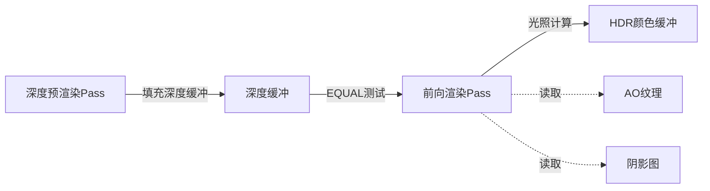

前向渲染Pass（ForwardPass）是 Himalaya 渲染器的核心光照计算阶段，负责将可见几何体渲染到 HDR 颜色缓冲区。该 Pass 采用经典的 Forward Shading 架构，在深度预渲染 Pass（[深度预渲染Pass](https://github.com/1PercentSync/himalaya/blob/main/17-shen-du-yu-xuan-ran-pass)）填充深度缓冲区后执行，通过 EQUAL 深度测试实现零过度绘制（Zero-Overdraw）优化。本页将详细解析其渲染管线架构、PBR 光照实现、以及与其他 Pass 的协作机制。

Sources: [forward_pass.h](https://github.com/1PercentSync/himalaya/blob/main/passes/include/himalaya/passes/forward_pass.h#L1-L119), [forward_pass.cpp](https://github.com/1PercentSync/himalaya/blob/main/passes/src/forward_pass.cpp#L1-L241)

## 架构定位与职责

ForwardPass 在渲染管线中扮演"光照合成器"的角色，其核心职责可概括为三个层次：

**几何处理层**：读取由 [深度预渲染Pass](https://github.com/1PercentSync/himalaya/blob/main/17-shen-du-yu-xuan-ran-pass) 生成的深度缓冲区，使用 EQUAL 比较操作进行深度测试，仅对通过测试的片元执行光照计算。深度写入保持关闭状态，因为深度值已由前序 Pass 确定。这种设计消除了过度绘制（Overdraw）——每个屏幕像素最多被着色一次。

**光照计算层**：实现完整的 PBR 光照模型，包括基于 Cook-Torrance 微表面模型的直接光照、Split-Sum 近似的环境光照（IBL）、以及材质属性（金属度/粗糙度/法线贴图）采样。所有光照计算在线性颜色空间执行，输出 HDR 值供后续 [色调映射Pass](https://github.com/1PercentSync/himalaya/blob/main/24-se-diao-ying-she-pass) 处理。

**效果整合层**：读取屏幕空间效果 Pass 生成的中间产物，包括 [GTAO算法实现](https://github.com/1PercentSync/himalaya/blob/main/22-gtaosuan-fa-shi-xian) 产生的环境光遮蔽和弯曲法线、[接触阴影Pass](https://github.com/1PercentSync/himalaya/blob/main/21-jie-hong-yin-ying-pass) 生成的接触阴影遮罩、以及 [级联阴影映射Pass](https://github.com/1PercentSync/himalaya/blob/main/20-ji-lian-yin-ying-ying-she-pass) 的阴影图。这些效果通过统一特征标志（`feature_flags`）开关控制，实现灵活的画质配置。

Sources: [forward_pass.cpp](https://github.com/1PercentSync/himalaya/blob/main/passes/src/forward_pass.cpp#L105-L238), [forward.frag](https://github.com/1PercentSync/himalaya/blob/main/shaders/forward.frag#L101-L307)

## 零过度绘制优化机制

ForwardPass 的核心优化策略是**延迟深度写入（Late Z-Write）**与**精确深度测试**的组合。其工作原理如下：

深度预渲染 Pass 使用与 ForwardPass 完全相同的顶点和变换逻辑（通过 `invariant gl_Position` 保证位级一致的裁剪空间位置），先行填充深度缓冲区。ForwardPass 随后以 `VK_COMPARE_OP_EQUAL` 模式进行深度测试——仅当片元深度与深度缓冲区中已存在的值完全相等时才通过测试。由于现代 GPU 的 Early-Z 机制，大多数被遮挡片元在片元着色器执行前即被剔除。

这种架构的关键在于顶点位移的严格一致性。顶点着色器通过 `invariant` 修饰符声明 `gl_Position`，强制编译器在不同着色器中使用相同的浮点运算指令序列和舍入模式，消除因优化差异导致的深度值偏差。法线矩阵在 CPU 端预计算（`transpose(inverse(mat3(model)))`），避免在顶点着色器中进行昂贵的 3x3 矩阵求逆。

Sources: [forward.vert](https://github.com/1PercentSync/himalaya/blob/main/shaders/forward.vert#L34-L47), [forward_pass.cpp](https://github.com/1PercentSync/himalaya/blob/main/passes/src/forward_pass.cpp#L174-L177)

## PBR 光照管线实现

片元着色器实现了完整的 glTF 2.0 材质规范，支持金属/粗糙度工作流。光照计算分为直接光照和间接光照两个主要部分，通过 Debug 模式可独立可视化各分量。

### 直接光照（Cook-Torrance BRDF）

直接光照遵循微表面模型，将材质响应分解为漫反射和镜面反射两个分量。漫反射采用 Lambert 模型，镜面反射使用 GGX 法线分布函数、Smith 高度相关可见性函数和 Schlick Fresnel 近似：

$$f_{spec} = D_{GGX}(\mathbf{n}\cdot\mathbf{h}, \alpha) \cdot V_{Smith}(\mathbf{n}\cdot\mathbf{v}, \mathbf{n}\cdot\mathbf{l}, \alpha) \cdot F_{Schlick}(\mathbf{v}\cdot\mathbf{h}, F_0)$$

其中粗糙度 $\alpha$ 由材质的粗糙度贴图与粗糙度系数相乘得到，$F_0$ 是法向入射反射率（导体取基础颜色，非导体取 0.04）。方向光支持阴影衰减，通过 `blend_cascade_shadow` 函数读取级联阴影图，并应用接触阴影遮罩（仅对主光源）。

Sources: [brdf.glsl](https://github.com/1PercentSync/himalaya/blob/main/shaders/common/brdf.glsl#L1-L75), [forward.frag](https://github.com/1PercentSync/himalaya/blob/main/shaders/forward.frag#L202-L237)

### 环境光照（Split-Sum IBL）

间接光照基于预过滤环境贴图和 irradiance 贴图实现实时 IBL。Specular 分量使用 Split-Sum 近似将 BRDF 积分分离为预过滤环境贴图查询和 BRDF LUT 查找两项：

$$L_{spec} \approx \text{prefiltered}(\mathbf{R}, \text{roughness}) \cdot (F_0 \cdot \text{brdf\_lut}_x + \text{brdf\_lut}_y)$$

Diffuse 分量通过查询 irradiance 贴图获得球谐近似的环境漫反射光照。环境贴图支持 Y 轴旋转（通过 `ibl_rotation_sin/cos`），允许动态调整环境光方向。IBL 强度通过全局 uniform 的可配置参数控制。

Sources: [forward.frag](https://github.com/1PercentSync/himalaya/blob/main/shaders/forward.frag#L239-L249)

### 环境光遮蔽与高光遮蔽

ForwardPass 整合了两种遮蔽技术：屏幕空间环境光遮蔽（SSAO）和材质烘焙遮蔽（Occlusion Texture）。SSAO 通过 Set 2 绑定读取自 [时域降噪Pass](https://github.com/1PercentSync/himalaya/blob/main/23-shi-yu-jiang-zao-pass) 的过滤后 AO 纹理，包含弯曲法线（Bent Normal）信息。

Diffuse AO 采用 Jimenez 2016 的多跳补偿（Multi-Bounce AO）算法，通过表面反照率修正过度变暗问题：

$$\text{AO}_{diffuse} = \max(ao, ((ao \cdot a + b) \cdot ao + c) \cdot ao)$$

其中 $a, b, c$ 是基于反照率的二次拟合系数。

Specular AO 提供两种算法：Lagarde 近似（仅依赖 $N \cdot V$、AO 和粗糙度）和 GTSO（Geometric Term Specular Occlusion，使用弯曲法线计算可见性锥与镜面反射锥的交集）。GTSO 采用平滑步长近似，并包含 $ao^2$ 的掠射角补偿以消除半球边界伪影。

Sources: [forward.frag](https://github.com/1PercentSync/himalaya/blob/main/shaders/forward.frag#L43-L99, 251-275)

## 资源绑定与数据流

ForwardPass 采用三描述符集（Descriptor Set）架构管理渲染资源：

| Set 编号 | 更新频率 | 内容 | 绑定类型 |
|---------|---------|------|---------|
| Set 0 | 每帧 | 全局 Uniform、光源数组、材质数组、实例数组 | UBO + SSBO |
| Set 1 | 初始化 | Bindless 纹理数组（2D 和 Cube） | Sampler 数组 |
| Set 2 | 每帧 | 屏幕空间效果中间产物（AO、阴影、接触阴影） | Sampler2D |

Set 0 包含场景级常量数据：`GlobalUBO` 提供视图/投影矩阵、相机位置、IBL 参数和特征标志；`LightBuffer` 存储方向光源数据；`MaterialBuffer` 和 `InstanceBuffer` 分别存储材质属性和实例变换。材质纹理通过 `nonuniformEXT` 扩展进行非均匀索引访问，支持每个片元独立采样不同的纹理索引。

Set 2 的绑定是**部分绑定（Partially Bound）**设计——仅当对应功能启用时才写入有效资源。着色器通过 `feature_flags` 位掩码检查功能状态，避免访问未初始化的绑定。这种设计使 RenderGraph 能够精确追踪资源依赖，自动插入必要的同步屏障。

Sources: [bindings.glsl](https://github.com/1PercentSync/himalaya/blob/main/shaders/common/bindings.glsl#L86-L188), [forward_pass.cpp](https://github.com/1PercentSync/himalaya/blob/main/passes/src/forward_pass.cpp#L157-L162)

## MSAA 与多重采样支持

ForwardPass 支持可配置的多重采样抗锯齿（MSAA），通过管线创建时的 `sample_count` 参数控制。MSAA 模式下的渲染流程有所不同：

**非 MSAA 模式（1x）**：直接写入 `hdr_color` 图像，深度测试使用 `depth` 缓冲区。

**MSAA 模式（4x/8x）**：渲染到 `msaa_color` 多重采样图像，通过 `resolveImageView` 自动解析（Resolve）到单样本的 `hdr_color`。深度缓冲区同样使用多重采样版本（`msaa_depth`），但不执行解析——ForwardPass 仅读取深度值，解析由后续 Pass 决定。

管线创建时，采样数被烘焙到光栅化状态。当用户切换 MSAA 设置时，必须调用 `on_sample_count_changed` 重建管线（调用者需确保 GPU 空闲）。着色器编译采用"先编译后替换"策略：若新着色器编译失败，保留旧管线以确保渲染连续性。

Sources: [forward_pass.cpp](https://github.com/1PercentSync/himalaya/blob/main/passes/src/forward_pass.cpp#L44-L101, 213-L226), [forward_pass.h](https://github.com/1PercentSync/himalaya/blob/main/passes/include/himalaya/passes/forward_pass.h#L52-L59)

## 几何剔除与绘制策略

ForwardPass 使用实例化绘制（Instanced Drawing）批量渲染可见网格。场景中的可见实例在 CPU 端被分组为 `MeshDrawGroup`，每组共享相同的网格资源和材质特性（如双面渲染标志）。

绘制循环遍历两个实例组：不透明实例（`opaque_draw_groups`）和 Alpha Mask 实例（`mask_draw_groups`）。透明实例在当前实现中被排除——由于 EQUAL 深度测试要求深度缓冲区已包含透明物体的深度值，而深度预渲染 Pass 跳过透明物体，这些片元会被错误地剔除。此限制将在 Milestone 2 的独立透明渲染 Pass 中解决。

每个绘制组设置对应的剔除模式（背面剔除或双面），绑定顶点/索引缓冲区，然后调用 `draw_indexed` 执行实例化绘制。索引类型固定为 32 位无符号整数（`VK_INDEX_TYPE_UINT32`），与 glTF 规范一致。

Sources: [forward_pass.cpp](https://github.com/1PercentSync/himalaya/blob/main/passes/src/forward_pass.cpp#L179-L202)

## Debug 可视化模式

ForwardPass 实现了丰富的调试着色模式，通过 `debug_render_mode` uniform 控制。这些模式允许开发者独立验证渲染管线的各个组件：

| 模式 | 值 | 可视化内容 |
|------|---|-----------|
| DEBUG_MODE_FULL_PBR | 0 | 完整 PBR 光照（默认） |
| DEBUG_MODE_DIFFUSE_ONLY | 1 | 仅漫反射分量（直接 + IBL） |
| DEBUG_MODE_SPECULAR_ONLY | 2 | 仅镜面反射分量（直接 + IBL） |
| DEBUG_MODE_IBL_ONLY | 3 | 仅环境光照 |
| DEBUG_MODE_NORMAL | 4 | 世界空间法线（编码到 [0,1]） |
| DEBUG_MODE_METALLIC | 5 | 金属度（灰度） |
| DEBUG_MODE_ROUGHNESS | 6 | 粗糙度（灰度） |
| DEBUG_MODE_AO | 7 | 组合 AO（SSAO × 材质 AO） |
| DEBUG_MODE_SHADOW_CASCADES | 8 | 级联阴影图可视化（颜色编码） |
| DEBUG_MODE_AO_SSAO | 9 | 原始 GTAO 输出 |
| DEBUG_MODE_CONTACT_SHADOWS | 10 | 接触阴影遮罩 |

透传模式（Passthrough Start）在着色器中提前返回，跳过光照计算直接输出可视化数据，便于快速诊断材质或几何问题。

Sources: [forward.frag](https://github.com/1PercentSync/himalaya/blob/main/shaders/forward.frag#L123-L179, 287-L303), [bindings.glsl](https://github.com/1PercentSync/himalaya/blob/main/shaders/common/bindings.glsl#L71-L84)

## 与相邻 Pass 的协作

ForwardPass 在 RenderGraph 中声明资源依赖，确保正确的执行顺序和同步：

**前置依赖**：深度预渲染 Pass 必须完成，深度缓冲区进入 `DEPTH_READ_ONLY_OPTIMAL` 布局。颜色目标若是首次写入则执行 CLEAR 操作，否则由 MSAA 解析操作自动处理。

**并行依赖**：屏幕空间效果 Pass（AO、接触阴影）在计算队列执行，与 ForwardPass 的片元着色器读取存在队列间依赖。RenderGraph 通过资源使用声明自动插入 `COMPUTE_SHADER_WRITE` 到 `FRAGMENT_SHADER_READ` 的管线屏障。

**后置消费**：HDR 颜色输出由色调映射 Pass 读取，执行曝光校正和色调映射。若启用了光线追踪参考视图，ForwardPass 的输出还可用于与路径追踪结果的对比。

Sources: [forward_pass.cpp](https://github.com/1PercentSync/himalaya/blob/main/passes/src/forward_pass.cpp#L227-L238), [bindings.glsl](https://github.com/1PercentSync/himalaya/blob/main/shaders/common/bindings.glsl#L177-L188)

## 相关页面

- [深度预渲染Pass](https://github.com/1PercentSync/himalaya/blob/main/17-shen-du-yu-xuan-ran-pass) — ForwardPass 依赖其生成的深度缓冲区实现零过度绘制
- [级联阴影映射Pass](https://github.com/1PercentSync/himalaya/blob/main/20-ji-lian-yin-ying-ying-she-pass) — 提供 ForwardPass 使用的阴影图和级联数据
- [接触阴影Pass](https://github.com/1PercentSync/himalaya/blob/main/21-jie-hong-yin-ying-pass) — 生成接触阴影遮罩供主光源衰减使用
- [GTAO算法实现](https://github.com/1PercentSync/himalaya/blob/main/22-gtaosuan-fa-shi-xian) 与 [时域降噪Pass](https://github.com/1PercentSync/himalaya/blob/main/23-shi-yu-jiang-zao-pass) — 生成环境光遮蔽和弯曲法线
- [色调映射Pass](https://github.com/1PercentSync/himalaya/blob/main/24-se-diao-ying-she-pass) — 消费 ForwardPass 的 HDR 输出进行色调映射
- [材质系统架构](https://github.com/1PercentSync/himalaya/blob/main/13-cai-zhi-xi-tong-jia-gou) — 了解材质数据布局和 Bindless 纹理索引机制
- [BRDF与光照计算](https://github.com/1PercentSync/himalaya/blob/main/35-brdfyu-guang-zhao-ji-suan) — 深入理解 Cook-Torrance 模型的数学基础