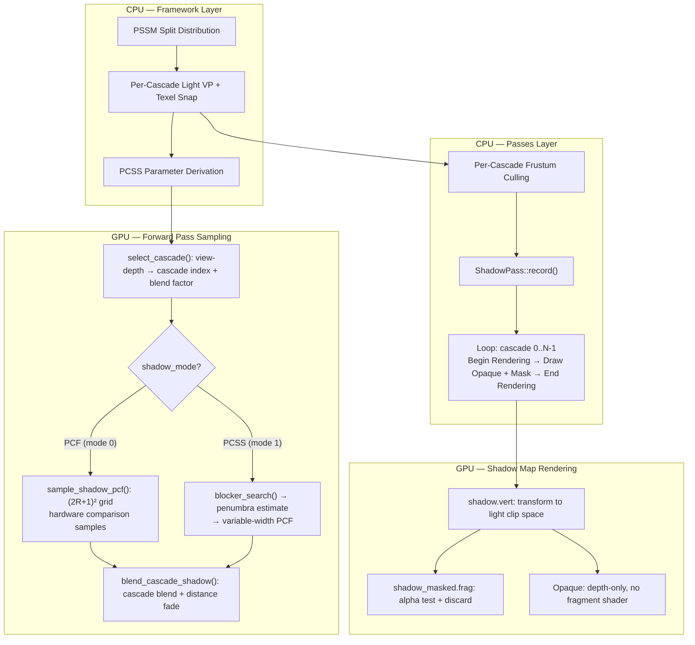

The shadow system in Himalaya implements a **Cascaded Shadow Map (CSM)** pipeline with two filtering modes: traditional **Percentage-Closer Filtering (PCF)** with a fixed grid kernel, and **Percentage-Closer Soft Shadows (PCSS)** with contact-hardening penumbra estimation. The system spans four architectural layers — cascade computation in the framework layer, pass orchestration in the passes layer, shadow map rendering in the vertex/fragment shaders, and shadow sampling in the forward pass via a shared GLSL library. This page covers the complete data flow from PSSM split distribution through light-space projection, depth-only rendering, and the two filtering strategies.

Sources: [shadow_pass.h](https://github.com/1PercentSync/himalaya/blob/main/passes/include/himalaya/passes/shadow_pass.h#L1-L155), [shadow.glsl](https://github.com/1PercentSync/himalaya/blob/main/shaders/common/shadow.glsl#L1-L496), [shadow.cpp](https://github.com/1PercentSync/himalaya/blob/main/framework/src/shadow.cpp#L1-L197)

## Architectural Overview

The shadow pipeline is decomposed into three distinct phases that execute across different layers of the engine:



**Phase 1** runs on the CPU every frame: `compute_shadow_cascades()` distributes split distances via PSSM, constructs tight orthographic projections per cascade, applies texel snapping, and derives per-cascade world-space texel sizes. **Phase 2** orchestrates rendering via the Render Graph: `ShadowPass::record()` imports the self-managed shadow map, then loops over active cascades, issuing draw calls for frustum-culled opaque and alpha-masked geometry. **Phase 3** happens entirely in the GPU forward pass: the `shadow.glsl` library provides cascade selection, both filtering algorithms, cascade blending, and distance fade — exposed through the single entry point `blend_cascade_shadow()`.

Sources: [shadow.cpp](https://github.com/1PercentSync/himalaya/blob/main/framework/src/shadow.cpp#L44-L196), [shadow_pass.cpp](https://github.com/1PercentSync/himalaya/blob/main/passes/src/shadow_pass.cpp#L38-L166), [shadow.glsl](https://github.com/1PercentSync/himalaya/blob/main/shaders/common/shadow.glsl#L460-L493), [forward.frag](https://github.com/1PercentSync/himalaya/blob/main/shaders/forward.frag#L223-L227)

## CSM Cascade Computation (Framework Layer)

The cascade computation is a pure geometric utility with no RHI dependencies. It takes the camera state, light direction, shadow configuration, scene bounds, and shadow map resolution as input, producing a `ShadowCascadeResult` containing per-cascade view-projection matrices, split distances, texel world sizes, and orthographic extents.

### PSSM Split Distribution

The **Practical Split Scheme (PSSM)** blends logarithmic and linear split distributions to balance texel density across cascades. Logarithmic distribution (λ=1) allocates more resolution near the camera where it's most needed, while linear distribution (λ=0) provides uniform coverage. The formula is:

$$C_i = \lambda \cdot C_i^{\log} + (1 - \lambda) \cdot C_i^{\text{lin}}$$

where $C_i^{\log} = n \cdot (f/n)^{i/N}$ and $C_i^{\text{lin}} = n + (f - n) \cdot i/N$. The default `split_lambda` of 0.5 provides a balanced middle ground. Split distances are stored in `cascade_splits` as far boundaries in view-space depth, consumed by the shader's `select_cascade()` function.

Sources: [shadow.cpp](https://github.com/1PercentSync/himalaya/blob/main/framework/src/shadow.cpp#L60-L72), [shadow.h](https://github.com/1PercentSync/himalaya/blob/main/framework/include/himalaya/framework/shadow.h#L28-L46)

### Per-Cascade Tight Orthographic Projection

For each cascade, the computation builds a camera sub-frustum from the near/far split pair, computes the eight 3D corners using the camera's forward/right/up basis, and transforms them into light space. The orthographic projection **tightly fits XY** to the sub-frustum corners — minimizing wasted shadow map resolution — while **extending Z to the scene AABB** to capture shadow casters outside the camera frustum. This is critical for correctness: without Z extension, objects between the light and the visible scene would not cast shadows.

The light-view matrix is centered on the cascade's sub-frustum center for numerical precision, and the light-space basis is constructed via cross products with a reference vector (Y-axis unless the light is nearly vertical, then X-axis).

Sources: [shadow.cpp](https://github.com/1PercentSync/himalaya/blob/main/framework/src/shadow.cpp#L74-L152)

### Texel Snapping

After constructing the combined VP matrix, the translation components are **snapped to shadow map texel boundaries**. This prevents the shadow map's content from shifting sub-texel amounts when the camera translates, which would otherwise cause visible shadow edge shimmer. The technique projects the world origin through the VP, rounds the result to the nearest texel center, and applies the sub-texel correction to the VP's translation columns.

Sources: [shadow.cpp](https://github.com/1PercentSync/himalaya/blob/main/framework/src/shadow.cpp#L168-L183)

### Reverse-Z Depth Convention

All shadow map depth uses **reverse-Z** (near maps to 1.0, far maps to 0.0), matching the project-wide convention. The `ortho_reverse_z()` helper flips the standard `glm::orthoRH_ZO` matrix: `M[2][2] = -M[2][2]` and `M[3][2] = 1 - M[3][2]`. The shadow map is cleared to **0.0** each frame (representing the far plane), and the depth comparison is `VK_COMPARE_OP_GREATER` — a closer surface (larger depth value) passes the test. This improves depth buffer precision by distributing more numeric range near the light where it matters most.

Sources: [shadow.cpp](https://github.com/1PercentSync/himalaya/blob/main/framework/src/shadow.cpp#L21-L41), [shadow_pass.cpp](https://github.com/1PercentSync/himalaya/blob/main/passes/src/shadow_pass.cpp#L98-L130)

### Per-Cascade Texel World Size

After texel snapping, the world-space size of a single shadow texel is derived from the VP matrix's first row: `2.0 * shadow_texel_size / length(row0)`. This value is stored per-cascade in `cascade_texel_world_size` and used by the shader's normal offset bias to push the sampling position along the surface normal by a distance proportional to the texel size.

Sources: [shadow.cpp](https://github.com/1PercentSync/himalaya/blob/main/framework/src/shadow.cpp#L186-L192)

## Shadow Pass Rendering (Passes Layer)

### Resource Ownership Model

The `ShadowPass` **self-manages** its shadow map resources rather than using the Render Graph's managed resource system. This design choice means the pass owns a single `D32_SFLOAT` 2D array image with `kMaxShadowCascades` (4) layers, plus per-layer `VkImageView`s for rendering into individual cascade slices. Resources persist across frames and are only recreated on resolution change. The pass imports the shadow map into the Render Graph each frame via `rg.import_image()`, declaring it transitions from `UNDEFINED` (cleared each cascade) to `SHADER_READ_ONLY_OPTIMAL` (sampled by the forward pass).

Sources: [shadow_pass.h](https://github.com/1PercentSync/himalaya/blob/main/passes/include/himalaya/passes/shadow_pass.h#L103-L153), [shadow_pass.cpp](https://github.com/1PercentSync/himalaya/blob/main/passes/src/shadow_pass.cpp#L38-L46), [shadow_pass.cpp](https://github.com/1PercentSync/himalaya/blob/main/passes/src/shadow_pass.cpp#L280-L315)

### Dual Pipeline Architecture

Two separate graphics pipelines handle the two material alpha modes:

| Pipeline | Fragment Shader | Purpose | Early-Z |
|----------|----------------|---------|---------|
| **Opaque** | None (`VK_NULL_HANDLE`) | Depth-only rasterization — no fragment shader means full Early-Z optimization | ✅ Fully enabled |
| **Mask** | `shadow_masked.frag` | Alpha test via `discard` — samples base color texture, discards below `alpha_cutoff` | ⚠️ Driver-dependent (discard may disable) |

The opaque pipeline is intentionally depth-only to maximize GPU throughput: without a fragment shader, the rasterizer can perform conservative depth testing and kill overdrawn fragments before any per-fragment work. The mask pipeline requires a fragment shader for the alpha test, which may prevent Early-Z on some hardware — this is why the two pipelines are separated rather than unified.

Both pipelines share the same vertex layout (position at location 0, UV0 at location 2), the same descriptor set layouts (Set 0 global + Set 1 bindless), and the same push constant range (4-byte `cascade_index`, vertex stage only).

Sources: [shadow_pass.cpp](https://github.com/1PercentSync/himalaya/blob/main/passes/src/shadow_pass.cpp#L190-L276), [shadow.vert](https://github.com/1PercentSync/himalaya/blob/main/shaders/shadow.vert#L1-L41), [shadow_masked.frag](https://github.com/1PercentSync/himalaya/blob/main/shaders/shadow_masked.frag#L1-L29)

### Per-Cascade Rendering Loop

The `record()` callback loops over active cascades, performing one `begin_rendering`/`end_rendering` cycle per cascade layer:

1. **Clear depth** to 0.0 (reverse-Z far plane) via `VK_ATTACHMENT_LOAD_OP_CLEAR`
2. **Set viewport** — standard (non-flipped) viewport, consistent between rendering and sampling
3. **Configure depth state** — reverse-Z comparison (`VK_COMPARE_OP_GREATER`), depth bias enabled with negated slope factor (pushes depth toward far/lower values in reverse-Z, reducing self-shadowing), constant bias 0.0 (ineffective with D32Sfloat), and a negative clamp of -0.005 to cap extreme bias on near-parallel surfaces and prevent peter panning
4. **Push cascade index** as a 4-byte push constant
5. **Draw opaque groups** via the depth-only pipeline
6. **Draw mask groups** via the alpha-test pipeline

Descriptor sets (Set 0 global UBO + Set 1 bindless textures) are bound once before the cascade loop — they are shared across all cascades. The cascade index select is handled purely through push constants.

Sources: [shadow_pass.cpp](https://github.com/1PercentSync/himalaya/blob/main/passes/src/shadow_pass.cpp#L55-L162)

### Per-Cascade Frustum Culling

Before rendering, the renderer extracts a frustum from each cascade's VP matrix and culls mesh instances independently per cascade. This is important because each cascade covers a different depth range and spatial region — objects visible in a far cascade may be outside a near cascade's frustum. Culling results are stored as separate `MeshDrawGroup` arrays per cascade (`shadow_cascade_opaque_groups[c]`, `shadow_cascade_mask_groups[c]`), then passed to `ShadowPass` via `FrameContext`.

Sources: [renderer_rasterization.cpp](https://github.com/1PercentSync/himalaya/blob/main/app/src/renderer_rasterization.cpp#L177-L206), [frame_context.h](https://github.com/1PercentSync/himalaya/blob/main/framework/include/himalaya/framework/frame_context.h#L114-L121)

## Shadow Vertex and Fragment Shaders

### shadow.vert — Light-Space Transformation

The vertex shader transforms mesh vertices into light clip space using the cascade's view-projection matrix selected by the push constant `cascade_index`:

```glsl
GPUInstanceData inst = instances[gl_InstanceIndex];
vec4 world_pos = inst.model * vec4(in_position, 1.0);
gl_Position = global.cascade_view_proj[cascade_index] * world_pos;
```

The world-space transform happens first, then the light VP projects to orthographic clip space. Because directional light projections are orthographic (w=1 after projection), no perspective divide is needed. The shader also passes `frag_uv0` and `frag_material_index` to support the mask pipeline's alpha test.

Sources: [shadow.vert](https://github.com/1PercentSync/himalaya/blob/main/shaders/shadow.vert#L1-L41)

### shadow_masked.frag — Alpha Test

The mask fragment shader performs a single texture lookup on the base color texture, multiplies by the material's base color factor alpha, and discards the fragment if below `alpha_cutoff`. No color output is written — depth is handled entirely by the rasterizer's depth write.

Sources: [shadow_masked.frag](https://github.com/1PercentSync/himalaya/blob/main/shaders/shadow_masked.frag#L1-L29)

## Shadow Sampling Library (shadow.glsl)

The `shadow.glsl` header is the GPU-side shadow evaluation library, included by `forward.frag`. It provides decomposed functions that the forward pass assembles through the single entry point `blend_cascade_shadow()`. The decomposition keeps intermediate results (cascade index, blend factor) visible for debug visualization.

### Cascade Selection: select_cascade()

Cascade selection maps a fragment's view-space depth to a cascade index and optional blend factor. The function iterates through `cascade_splits` (far boundaries) and returns the first cascade whose far boundary exceeds the fragment's depth. Near the boundary, a **blend region** is computed as the last `blend_width` fraction of the cascade's range, producing a 0→1 blend factor for smooth transitions to the next cascade.

```
Cascade 0: |====|blend|
Cascade 1:        |====|blend|
Cascade 2:               |====|blend|
Cascade 3:                      |====| → distance fade
```

For the last cascade, there is no blend — the distance fade mechanism handles the transition to unshadowed instead.

Sources: [shadow.glsl](https://github.com/1PercentSync/himalaya/blob/main/shaders/common/shadow.glsl#L338-L373)

### Distance Fade: shadow_distance_fade()

Beyond the cascade coverage area, shadows must smoothly transition to fully lit to avoid a hard cutoff. The function computes a fade factor starting at `max_distance * (1 - fade_width)` and reaching 0.0 at `max_distance`, using `smoothstep` for a gradual falloff. The result is applied as `shadow = mix(1.0, shadow, fade_factor)` — fading toward 1.0 (fully lit) as the fragment approaches the shadow distance limit.

Sources: [shadow.glsl](https://github.com/1PercentSync/himalaya/blob/main/shaders/common/shadow.glsl#L421-L437)

### PCF: Fixed-Kernel Percentage-Closer Filtering

The PCF path performs a traditional `(2R+1) × (2R+1)` grid of texture samples, where R is the `shadow_pcf_radius` from the UBO (0=off through 5=11×11). Each `texture()` call on `sampler2DArrayShadow` returns a **hardware 2×2 bilinear comparison** — the GPU samples four texels, performs the depth comparison on each, and interpolates the binary results. This means the effective filter footprint is wider than the grid dimensions suggest.

The sampling position is offset along the surface normal by `normal_offset * texel_world_size` to reduce shadow acne on surfaces nearly parallel to the light direction. When the radius is 0, the function falls back to a single hardware comparison (hard shadows).

| PCF Radius | Grid Size | Total Texture Fetches | Effective Filter (with bilinear) |
|-----------|-----------|----------------------|----------------------------------|
| 0 | 1×1 | 1 | 2×2 texels |
| 1 | 3×3 | 9 | 4×4 texels |
| 2 | 5×5 | 25 | 6×6 texels |
| 3 | 7×7 | 49 | 8×8 texels |
| 4 | 9×9 | 81 | 10×10 texels |
| 5 | 11×11 | 121 | 12×12 texels |

Sources: [shadow.glsl](https://github.com/1PercentSync/himalaya/blob/main/shaders/common/shadow.glsl#L375-L419)

### PCSS: Contact-Hardening Soft Shadows

PCSS produces **contact-hardening** penumbra: shadows are sharp at the point of contact between caster and receiver, and soften with increasing distance. The algorithm has three stages: blocker search, penumbra estimation, and variable-width PCF.

#### Receiver Plane Depth Bias (ShadowProjData)

Both PCSS stages use **receiver plane depth bias** — a technique that computes the depth gradient of the receiving surface in shadow UV space, then adjusts the comparison depth for each sample offset. The `ShadowProjData` struct stores the shadow UV, reference depth, and two depth gradients (`dz_du`, `dz_dv`) computed via a 2×2 linear system solved from screen-space derivatives:

```
dz_dx = dz_du * duv_dx.x + dz_dv * duv_dx.y
dz_dy = dz_du * duv_dy.x + dz_dv * duv_dy.y
```

This is critical for PCSS quality: without receiver plane bias, the variable-width PCF kernel would sample shadow map depths far from the reference point, and the static depth comparison would produce light leaking on tilted surfaces. The gradients are clamped to `kMaxReceiverPlaneGradient` (0.01) to prevent extreme values at grazing angles, and zeroed at cascade boundaries where cross-projection derivatives would be garbage.

Sources: [shadow.glsl](https://github.com/1PercentSync/himalaya/blob/main/shaders/common/shadow.glsl#L128-L201)

#### Stage 1: Blocker Search

The blocker search samples the shadow map at 32 Poisson Disk positions (or 16 for Low quality) in an elliptical region around the projected position. For each sample, it reads the **raw depth** (via `sampler2DArray` — not the comparison sampler) and checks if the texel is closer to the light than the receiver (in reverse-Z: `sampled_depth > adjusted_depth`). The adjusted depth incorporates the receiver plane bias for that sample's offset.

The search radius is computed as `max(cascade_light_size_uv, kMaxPenumbraTexels * shadow_texel_size)` — expanded to cover the maximum possible penumbra width, preventing a hard cutoff at the blocker search boundary. Average blocker depth is computed from all samples that found an occluder.

Sources: [shadow.glsl](https://github.com/1PercentSync/himalaya/blob/main/shaders/common/shadow.glsl#L203-L257)

#### Stage 2: Penumbra Estimation

For directional lights, the penumbra width is estimated as:

```
penumbra_u = |avg_blocker_depth - receiver_depth| × cascade_pcss_scale
```

The `cascade_pcss_scale` is precomputed per-cascade on the CPU as `cascade_depth_range × 2 × tan(angular_diameter/2) / cascade_width_x`. This maps the NDC depth difference to UV-space penumbra width, accounting for the cascade's orthographic projection scale. The angular diameter of the light source (default ~0.53° for the sun) controls the overall softness — larger values produce wider penumbrae.

The penumbra is clamped between `shadow_texel_size` (minimum 1-texel kernel, preventing noise) and `kMaxPenumbraTexels × shadow_texel_size` (64 texels, preventing kernel explosion from multi-layer occlusion scenarios). The V-direction penumbra is scaled by `cascade_uv_scale_y` (width_x / width_y) to account for anisotropic cascade extents.

Sources: [shadow.glsl](https://github.com/1PercentSync/himalaya/blob/main/shaders/common/shadow.glsl#L259-L335), [renderer.cpp](https://github.com/1PercentSync/himalaya/blob/main/app/src/renderer.cpp#L106-L126)

#### Stage 3: Variable-Width PCF

With the estimated penumbra width, PCSS performs PCF filtering using 49 Poisson Disk samples (or 16/25 for Low/Medium quality) in an **elliptical kernel** scaled by `(penumbra_u, penumbra_v)`. Each sample uses the hardware comparison sampler (`sampler2DArrayShadow`) with per-sample receiver plane depth bias. The result is the average of all comparison results — a soft shadow factor between 0.0 and 1.0.

Sources: [shadow.glsl](https://github.com/1PercentSync/himalaya/blob/main/shaders/common/shadow.glsl#L312-L328)

#### Temporal Rotation and Blocker Confidence

Per-pixel Poisson Disk rotation uses `interleaved_gradient_noise()` (Jimenez) combined with a golden-ratio fractional offset based on the frame index. This decorrelates successive frames' noise patterns, allowing TAA to accumulate diverse samples and effectively multiply the sample count over time.

A **blocker confidence fade** smooths the transition at the search boundary: when very few blockers are found (near the edge of the penumbra), the PCF result is blended toward 1.0 (fully lit) to avoid a hard cutoff. The confidence is computed as `smoothstep(0.0, 4.0, num_blockers)`.

When the `PCSS_FLAG_BLOCKER_EARLY_OUT` flag is set and all blocker search samples find occluders, the function immediately returns 0.0 (fully shadowed). This mitigates **multi-layer occlusion light leak** — in complex scenes with multiple overlapping casters, the average blocker depth can be misleadingly close to the receiver, producing an erroneously thin penumbra. The early-out ensures fully-occluded regions remain dark.

Sources: [shadow.glsl](https://github.com/1PercentSync/himalaya/blob/main/shaders/common/shadow.glsl#L279-L335), [noise.glsl](https://github.com/1PercentSync/himalaya/blob/main/shaders/common/noise.glsl#L9-L36)

### Poisson Disk Generation

The sample patterns are generated offline by `scripts/generate_poisson_disk.py` using a dart-throwing algorithm with minimum distance enforcement (0.7 / √N). Two independent sets are produced: 32 samples for blocker search (seed 42) and 49 samples for PCF filtering (seed 43). The fixed seeds ensure deterministic patterns across builds, while the runtime rotation and temporal offset provide per-pixel and per-frame variation.

Sources: [generate_poisson_disk.py](https://github.com/1PercentSync/himalaya/blob/main/scripts/generate_poisson_disk.py#L1-L71), [shadow.glsl](https://github.com/1PercentSync/himalaya/blob/main/shaders/common/shadow.glsl#L27-L115)

### Cascade Blending and the Top-Level Entry Point

`blend_cascade_shadow()` is the single entry point consumed by the forward pass. It orchestrates:

1. **Cascade selection** via `select_cascade()` → cascade index + blend factor
2. **Shadow evaluation** using PCF or PCSS based on `shadow_mode`
3. **Cascade blending** — linear interpolation between current and next cascade in the overlap region
4. **Distance fade** — smooth transition to unshadowed at the far edge

For PCSS, both the current and next cascade's `ShadowProjData` are precomputed **before** any branching. This is critical because `prepare_shadow_proj()` calls `dFdx`/`dFdy`, which require uniform control flow — all fragment shader invocations in a quad must execute the same derivative instructions. The extra ~25 ALU ops for the second projection are negligible compared to the 41+ texture fetches in PCSS.

Sources: [shadow.glsl](https://github.com/1PercentSync/himalaya/blob/main/shaders/common/shadow.glsl#L439-L493), [forward.frag](https://github.com/1PercentSync/himalaya/blob/main/shaders/forward.frag#L223-L227)

## PCSS CPU-Side Parameter Derivation

The renderer derives three per-cascade parameters from the cascade computation results, mapping the light's angular diameter into UV-space scales:

| Parameter | Formula | Purpose |
|-----------|---------|---------|
| `cascade_light_size_uv[i]` | `2 × tan(θ/2) / width_x` | Blocker search radius in UV space |
| `cascade_pcss_scale[i]` | `depth_range × 2 × tan(θ/2) / width_x` | NDC depth difference → penumbra UV scale |
| `cascade_uv_scale_y[i]` | `width_x / width_y` | Anisotropic correction for elliptical kernels |

These parameters are computed each frame in `fill_common_gpu_data()` and written into the `GlobalUniformData` UBO. The PCSS quality presets map to sample counts:

| Quality | Blocker Samples | PCF Samples | Total Texture Fetches |
|---------|----------------|-------------|----------------------|
| Low | 16 | 16 | 32 |
| Medium | 16 | 25 | 41 |
| High | 32 | 49 | 81 |

Sources: [renderer.cpp](https://github.com/1PercentSync/himalaya/blob/main/app/src/renderer.cpp#L106-L126), [scene_data.h](https://github.com/1PercentSync/himalaya/blob/main/framework/include/himalaya/framework/scene_data.h#L192-L216)

## GPU Data Layout

The shadow system's data flows through the `GlobalUBO` (Set 0, Binding 0) at specific offsets, with a 928-byte total struct size:

| Offset | Field | Type | Description |
|--------|-------|------|-------------|
| 328 | `shadow_cascade_count` | uint32 | Active cascade count (1-4) |
| 332 | `shadow_normal_offset` | float | Normal offset bias strength |
| 336 | `shadow_texel_size` | float | 1.0 / shadow_map_resolution |
| 340 | `shadow_max_distance` | float | Cascade max coverage distance |
| 344 | `shadow_blend_width` | float | Cascade blend region fraction |
| 348 | `shadow_pcf_radius` | uint32 | PCF kernel radius |
| 352 | `cascade_view_proj[4]` | 4×mat4 | Per-cascade light-space VP (256 bytes) |
| 608 | `cascade_splits` | vec4 | Cascade far boundaries |
| 624 | `shadow_distance_fade_width` | float | Distance fade fraction |
| 640 | `cascade_texel_world_size` | vec4 | Per-cascade world-space texel size |
| 656 | `shadow_mode` | uint32 | 0=PCF, 1=PCSS |
| 660 | `pcss_flags` | uint32 | Bit 0: blocker early-out |
| 664 | `pcss_blocker_samples` | uint32 | Blocker search sample count |
| 668 | `pcss_pcf_samples` | uint32 | PCSS PCF sample count |
| 672 | `cascade_light_size_uv` | vec4 | Per-cascade blocker search radius |
| 688 | `cascade_pcss_scale` | vec4 | Per-cascade NDC→penumbra scale |
| 704 | `cascade_uv_scale_y` | vec4 | Per-cascade UV anisotropy |

The shadow map is accessed through Set 2 with two samplers: `rt_shadow_map` (binding 5, `sampler2DArrayShadow` for hardware comparison) and `rt_shadow_map_depth` (binding 6, `sampler2DArray` for raw depth reads in PCSS blocker search).

Sources: [bindings.glsl](https://github.com/1PercentSync/himalaya/blob/main/shaders/common/bindings.glsl#L86-L188), [scene_data.h](https://github.com/1PercentSync/himalaya/blob/main/framework/include/himalaya/framework/scene_data.h#L272-L319)

## Debug Visualization

The shadow system integrates with the debug render mode system through two visualization modes:

- **`DEBUG_MODE_SHADOW_CASCADES` (8)**: Colors each fragment by its cascade index (red, green, blue, yellow for cascades 0-3), making cascade coverage and selection immediately visible.
- **Cascade Statistics panel** in the ImGui debug UI: displays per-cascade coverage range and texel density (pixels per meter), computed from the PSSM formula and the camera's frustum diagonal.

Sources: [forward.frag](https://github.com/1PercentSync/himalaya/blob/main/shaders/forward.frag#L159-L174), [debug_ui.cpp](https://github.com/1PercentSync/himalaya/blob/main/app/src/debug_ui.cpp#L543-L572)

## Runtime Configuration (Debug UI)

All shadow parameters are tunable at runtime through the ImGui debug panel:

| Parameter | Range | Notes |
|-----------|-------|-------|
| Shadow Mode | PCF / PCSS | Switches between fixed and contact-hardening filtering |
| Cascades | 1-4 | Pure rendering parameter — no resource rebuild |
| Resolution | 512 / 1024 / 2048 / 4096 | Triggers shadow map recreation (GPU must be idle) |
| Split Lambda | 0.0 - 1.0 | 0=linear, 1=logarithmic distribution |
| Max Distance | 1 - 2000 m | Logarithmic slider |
| Slope Bias | 0.0 - 10.0 | Hardware depth bias slope factor |
| Normal Offset | 0.0 - 5.0 | Shader-side bias along surface normal |
| PCF Radius | Off / 3×3 / 5×5 / 7×7 / 9×9 / 11×11 | PCF mode only |
| Angular Diameter | 0.1° - 5.0° | PCSS mode only; sun ~0.53° |
| PCSS Quality | Low / Medium / High | PCSS mode only; sample counts |
| Blocker Early-Out | On/Off | PCSS mode only; mitigates multi-layer light leak |
| Blend Width | 0.0 - 0.5 | Controls both cascade blend and distance fade |

Sources: [debug_ui.cpp](https://github.com/1PercentSync/himalaya/blob/main/app/src/debug_ui.cpp#L452-L542)

## Design Decisions and Tradeoffs

**Self-managed resources vs. RG-managed**: The shadow map is imported into the Render Graph rather than managed by it. This avoids unnecessary destroy-and-recreate cycles when the cascade count changes (which is a pure rendering parameter that doesn't affect the image resource), while still allowing the RG to track layout transitions and insert barriers.

**Dual pipeline for alpha modes**: Separating opaque (depth-only) and mask (alpha-test) pipelines maximizes GPU efficiency. The opaque pipeline has no fragment shader, enabling full Early-Z and minimizing memory bandwidth. The mask pipeline pays the cost of a fragment shader only for geometry that actually needs alpha testing.

**Receiver plane bias over constant/slope bias alone**: PCSS uses receiver plane depth gradients (`dz_du`, `dz_dv`) computed from screen-space derivatives, providing per-sample depth correction that adapts to the receiving surface's orientation. This is significantly more effective than the hardware's global slope bias for preventing light leaking in variable-width kernels, where samples can be far from the reference point.

**Elliptical kernels for PCSS**: The cascade's orthographic projection may have different X and Y extents (especially for non-square frustum slices). The `cascade_uv_scale_y` parameter scales the Poisson Disk kernel into an ellipse, ensuring the penumbra width is uniform in world space rather than distorted by anisotropic UV mapping.

**Golden ratio temporal rotation**: Using `frame_index * 0.618...` as a fractional offset to the per-pixel noise maximizes decorrelation between successive frames when TAA is active. The golden ratio's irrationality ensures the offset never exactly repeats within any practical frame window.

Sources: [shadow_pass.h](https://github.com/1PercentSync/himalaya/blob/main/passes/include/himalaya/passes/shadow_pass.h#L38-L44), [shadow.glsl](https://github.com/1PercentSync/himalaya/blob/main/shaders/common/shadow.glsl#L117-L335)

## Related Pages

- [Shadow Cascade Computation — CSM Split Strategies and Texel Snapping](https://github.com/1PercentSync/himalaya/blob/main/15-shadow-cascade-computation-csm-split-strategies-and-texel-snapping) — deeper dive into the PSSM math and projection fitting
- [Forward Pass — Cook-Torrance PBR, IBL Split-Sum, and Multi-Bounce AO](https://github.com/1PercentSync/himalaya/blob/main/17-forward-pass-cook-torrance-pbr-ibl-split-sum-and-multi-bounce-ao) — consumer of the shadow factor
- [Render Graph — Automatic Barrier Insertion and Pass Orchestration](https://github.com/1PercentSync/himalaya/blob/main/9-render-graph-automatic-barrier-insertion-and-pass-orchestration) — how the shadow pass integrates with the RG
- [GLSL Shader Architecture — Shared Bindings, BRDF Library, and Feature Flags](https://github.com/1PercentSync/himalaya/blob/main/25-glsl-shader-architecture-shared-bindings-brdf-library-and-feature-flags) — the UBO layout and sampler bindings
- [Debug UI — ImGui Panels and Runtime Parameter Tuning](https://github.com/1PercentSync/himalaya/blob/main/24-debug-ui-imgui-panels-and-runtime-parameter-tuning) — shadow parameter controls