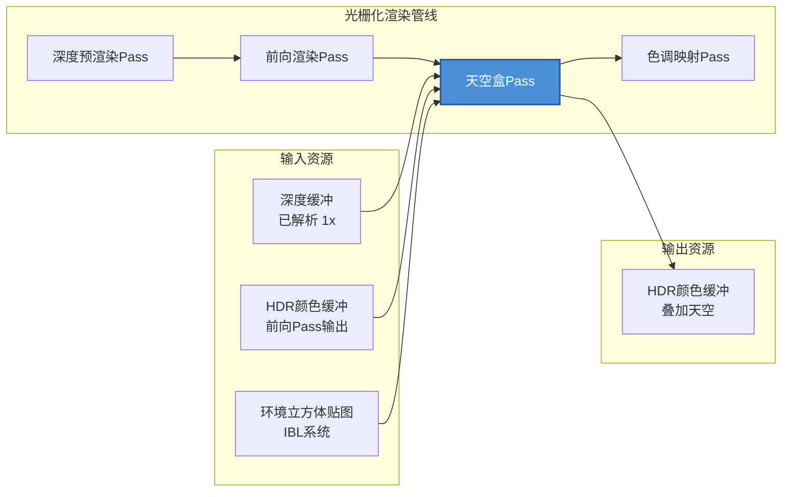

天空盒Pass（SkyboxPass）负责将环境HDR图像渲染为背景，提供场景的远距离环境光照参考。它采用**全屏三角形**技术，通过立方体贴图采样实现高效的天空渲染，同时利用Reverse-Z深度测试确保只填充场景几何未覆盖的像素区域。该Pass在Himalaya渲染管线中位于[前向渲染Pass](https://github.com/1PercentSync/himalaya/blob/main/18-qian-xiang-xuan-ran-pass)之后、[色调映射Pass](https://github.com/1PercentSync/himalaya/blob/main/24-se-diao-ying-she-pass)之前，直接操作已解析的HDR颜色缓冲。

## 渲染管线位置与职责

天空盒Pass作为延迟天空渲染的关键环节，采用**后渲染天空盒**策略——在前向Pass完成所有不透明几何体渲染后执行。这种设计避免了早期天空盒渲染被几何体过度绘制的问题，同时简化了深度测试逻辑。



天空盒Pass的核心职责包括：
1. **深度感知的天空填充**——仅在深度值为0.0（Reverse-Z远平面）的像素上渲染天空
2. **世界空间方向计算**——通过逆投影矩阵从屏幕空间重建观察方向
3. **环境贴图采样**——使用Bindless索引访问IBL系统预处理的环境立方体贴图
4. **水平旋转支持**——根据IBL旋转参数动态调整采样方向

Sources: [skybox_pass.cpp](https://github.com/1PercentSync/himalaya/blob/main/passes/src/skybox_pass.cpp#L1-L9), [renderer_rasterization.cpp](https://github.com/1PercentSync/himalaya/blob/main/app/src/renderer_rasterization.cpp#L330-L332)

## 深度测试与Reverse-Z策略

天空盒Pass的深度处理策略是其正确性的关键。它采用**GREATER_OR_EQUAL**比较操作配合**深度写入关闭**的配置：

| 参数 | 值 | 说明 |
|------|-----|------|
| 深度测试 | 启用 | `VK_COMPARE_OP_GREATER_OR_EQUAL` |
| 深度写入 | 禁用 | `VK_FALSE`——天空盒不改变深度缓冲 |
| 深度加载 | 加载 | `VK_ATTACHMENT_LOAD_OP_LOAD`——读取前向Pass深度 |
| 深度布局 | 只读 | `VK_IMAGE_LAYOUT_DEPTH_READ_ONLY_OPTIMAL` |

Reverse-Z深度缓冲的配置（清除值为0.0，近处为1.0）使得天空盒顶点着色器将`gl_Position.z`设为0.0即可自然位于远平面。当几何体写入深度后（值小于0.0），天空盒的深度测试失败，不会覆盖这些像素。这种设计消除了传统天空盒渲染中需要绘制球体/立方体几何的复杂性，也避免了远平面裁剪问题。

Sources: [skybox_pass.cpp](https://github.com/1PercentSync/himalaya/blob/main/passes/src/skybox_pass.cpp#L119-L130), [skybox_pass.cpp](https://github.com/1PercentSync/himalaya/blob/main/passes/src/skybox_pass.cpp#L168-L170)

## 全屏三角形与方向计算

天空盒Pass采用**无顶点数据**的渲染方式，通过`gl_VertexIndex`（0,1,2）在顶点着色器中动态生成全屏三角形坐标，并从裁剪空间反投影到世界空间：

```mermaid
flowchart TB
    subgraph 顶点生成["顶点着色器处理"]
        A[gl_VertexIndex 0/1/2] --> B[生成UV: (0,0), (2,0), (0,2)]
        B --> C[映射NDC: (-1,-1) 到 (1,1)]
        C --> D[逆视图投影变换]
        D --> E[世界空间方向向量]
    end
    
    subgraph 片段处理["片段着色器处理"]
        E --> F[归一化方向]
        F --> G[应用Y轴旋转]
        G --> H[采样立方体贴图]
        H --> I[输出RGB颜色]
    end
    
    J[全局UBO<br/>inv_view_projection] --> D
    K[全局UBO<br/>ibl_rotation_sin/cos] --> G
    L[Bindless Set 1<br/>cubemaps[]] --> H
```

顶点着色器的关键代码通过逆视图投影矩阵将NDC坐标（z=1.0，Reverse-Z的近处）反投影到世界空间，得到从相机位置指向无穷远的世界方向。`gl_Position.z = 0.0`将顶点放置在远平面，这是Reverse-Z配置下天空盒的正确深度值。片段着色器接收插值后的世界方向，应用IBL水平旋转后采样立方体贴图。`rotate_y`函数使用预计算的sin/cos值避免每像素计算三角函数。

Sources: [skybox.vert](https://github.com/1PercentSync/himalaya/blob/main/shaders/skybox.vert#L20-L29), [skybox.frag](https://github.com/1PercentSync/himalaya/blob/main/shaders/skybox.frag#L19-L27), [transform.glsl](https://github.com/1PercentSync/himalaya/blob/main/shaders/common/transform.glsl#L17-L19)

## 资源声明与渲染图集成

天空盒Pass向RenderGraph声明两类资源依赖，确保正确的管线屏障和布局转换：

| 资源 | 访问类型 | 管线阶段 | 用途 |
|------|----------|----------|------|
| `ctx.depth` | Read | DepthAttachment | 深度测试（GREATER_OR_EQUAL） |
| `ctx.hdr_color` | ReadWrite | ColorAttachment | 加载前向输出，存储叠加结果 |

`ReadWrite`访问模式表明天空盒Pass需要**加载**前向Pass的颜色输出并在其上叠加天空颜色，而非完全覆盖。颜色附件配置使用`LOAD`加载操作和`STORE`存储操作，深度附件则使用`NONE`存储操作（只读）。渲染图根据这些声明自动插入必要的图像布局转换屏障，确保深度缓冲在Pass开始时处于`DEPTH_READ_ONLY_OPTIMAL`布局。

Sources: [skybox_pass.cpp](https://github.com/1PercentSync/himalaya/blob/main/passes/src/skybox_pass.cpp#L96-L130)

## 全局UBO与Bindless资源访问

天空盒Pass依赖**Set 0**（全局UBO）和**Set 1**（Bindless纹理数组）两组描述符集：

```glsl
// Set 0, binding 0 - 从全局UBO读取的关键字段
layout(set = 0, binding = 0) uniform GlobalUBO {
    mat4  inv_view_projection;          // 逆视图投影矩阵（反投影用）
    vec4  camera_position_and_exposure; // 相机位置（计算世界方向）
    uint  skybox_cubemap_index;         // Set 1立方体贴图数组索引
    float ibl_rotation_sin;             // 水平旋转sin值
    float ibl_rotation_cos;             // 水平旋转cos值
    // ... 其他字段
} global;

// Set 1, binding 1 - Bindless立方体贴图数组
layout(set = 1, binding = 1) uniform samplerCube cubemaps[];
```

`skybox_cubemap_index`由IBL系统在初始化时注册到Bindless数组后提供，指向预处理的环境立方体贴图。`nonuniformEXT`扩展修饰符允许基于UBO数据的动态非统一索引，这对现代GPU的Bindless架构至关重要。应用层通过`RenderFeatures::skybox`布尔值控制天空盒是否启用，渲染器在构建FrameContext后检查此标志决定是否调用`skybox_pass_.record()`。

Sources: [bindings.glsl](https://github.com/1PercentSync/himalaya/blob/main/shaders/common/bindings.glsl#L88-L104), [bindings.glsl](https://github.com/1PercentSync/himalaya/blob/main/shaders/common/bindings.glsl#L175), [frame_context.h](https://github.com/1PercentSync/himalaya/blob/main/framework/include/himalaya/framework/frame_context.h#L139-L150), [renderer_rasterization.cpp](https://github.com/1PercentSync/himalaya/blob/main/app/src/renderer_rasterization.cpp#L330-L332)

## 视口配置与Y轴翻转

天空盒Pass显式配置Y轴翻转视口以匹配GLM投影约定：

```cpp
viewport.y = static_cast<float>(render_extent.height);      // 视口Y起点 = 高度
viewport.height = -static_cast<float>(render_extent.height); // 视口高度 = 负高度
```

这种配置确保了顶点着色器中计算的NDC到世界方向的映射与相机视图的投影约定一致。GLM采用右手坐标系，裁剪空间Y轴向上，而Vulkan的帧缓冲Y轴向下。Y翻转视口统一了这种差异，使得从`gl_VertexIndex`生成的NDC坐标能够正确反投影。禁用背面剔除确保全屏三角形的所有片段都被处理，无论三角形的环绕方向如何。

Sources: [skybox_pass.cpp](https://github.com/1PercentSync/himalaya/blob/main/passes/src/skybox_pass.cpp#L157-L167)

## 热重载与管线重建

天空盒Pass支持运行时着色器热重载。`rebuild_pipelines()`方法触发着色器重新编译和管线重建，同时采用**安全失败**策略——如果编译失败则保留旧管线，确保渲染连续性：

| 方法 | 职责 |
|------|------|
| `setup()` | 初始化服务指针引用，创建初始管线 |
| `rebuild_pipelines()` | 重新编译着色器，安全地替换管线 |
| `destroy()` | 销毁管线对象，释放GPU资源 |
| `record()` | 每帧向RenderGraph注册Pass |

Sources: [skybox_pass.h](https://github.com/1PercentSync/himalaya/blob/main/passes/include/himalaya/passes/skybox_pass.h#L37-L98), [skybox_pass.cpp](https://github.com/1PercentSync/himalaya/blob/main/passes/src/skybox_pass.cpp#L43-L92)

## 相关页面

- [前向渲染Pass](https://github.com/1PercentSync/himalaya/blob/main/18-qian-xiang-xuan-ran-pass) — 天空盒的前置Pass，提供HDR颜色缓冲和深度缓冲
- [色调映射Pass](https://github.com/1PercentSync/himalaya/blob/main/24-se-diao-ying-she-pass) — 天空盒的后置Pass，处理最终的色调映射和曝光
- [Pass系统概述](https://github.com/1PercentSync/himalaya/blob/main/16-passxi-tong-gai-shu) — 天空盒Pass所属的渲染Pass层架构说明
- [Render Graph资源管理](https://github.com/1PercentSync/himalaya/blob/main/12-render-graphzi-yuan-guan-li) — 了解资源声明和自动屏障机制
- [Bindless描述符管理](https://github.com/1PercentSync/himalaya/blob/main/14-bindlessmiao-shu-fu-guan-li) — 立方体贴图数组索引的工作原理