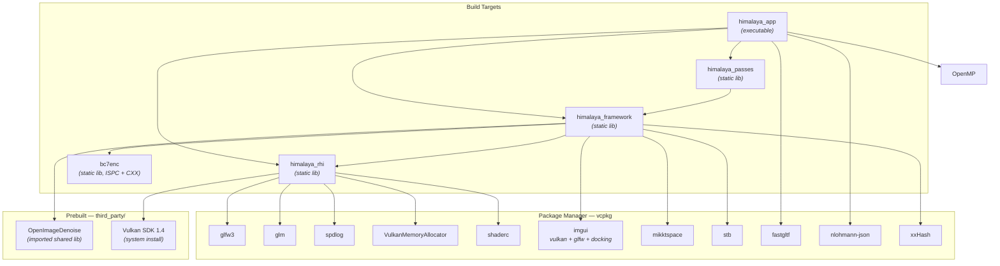
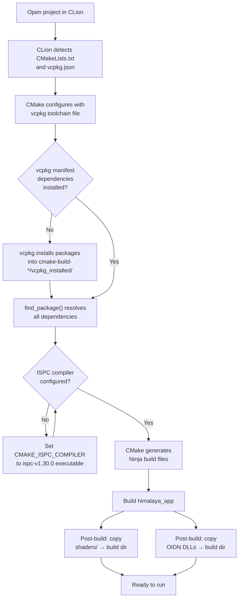
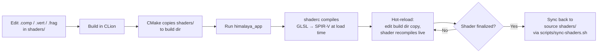

This page is your complete guide to setting up the Himalaya renderer build environment from scratch. It covers every external tool, SDK, and library the project depends on, explains how they are wired together through CMake and vcpkg, and walks you through the configuration process end-to-end. By the end, you will understand *what* each dependency provides, *where* it lives in the build graph, and *how* to reproduce a working build on a fresh machine.

Sources: [CMakeLists.txt](https://github.com/1PercentSync/himalaya/blob/main/CMakeLists.txt#L1-L11), [vcpkg.json](https://github.com/1PercentSync/himalaya/blob/main/vcpkg.json#L1-L40), [CLAUDE.md](https://github.com/1PercentSync/himalaya/blob/main/CLAUDE.md#L15-L26)

## Development Environment Summary

Himalaya is developed on **Windows 11** using **MSVC** (Visual Studio 2022 toolchain) with the **ISPC** SIMD compiler for texture compression. The build system is CMake 4.1 with Ninja generators, and all third-party C/C++ libraries are managed through **vcpkg manifest mode**, which guarantees reproducible dependency versions across machines.

| Item | Value | Notes |
|------|-------|-------|
| Operating System | Windows 11 | Primary target; code is edited via WSL but built natively |
| Compiler | MSVC 14.50 (VS 2022) | `cl.exe` x64 host/x64 target |
| ISPC Compiler | v1.30.0 | Required for BC7 texture compression (`bc7e.ispc`) |
| CMake | 4.1 | Minimum required for the project |
| Generator | Ninja | Used by CLion for both Debug and Release |
| Package Manager | vcpkg (manifest mode) | Baseline-pinned for reproducibility |
| C++ Standard | C++20 | `CMAKE_CXX_STANDARD 20`, required |
| Vulkan SDK | 1.4.335.0 | Provides `glslangValidator` |
| OpenMP | MSVC `-openmp` | Used for parallel scene processing |

Sources: [cmake-build-debug/CMakeCache.txt](https://github.com/1PercentSync/himalaya/blob/main/cmake-build-debug/CMakeCache.txt#L17-L44), [cmake-build-debug/CMakeCache.txt](https://github.com/1PercentSync/himalaya/blob/main/cmake-build-debug/CMakeCache.txt#L76-L77), [cmake-build-debug/CMakeCache.txt](https://github.com/1PercentSync/himalaya/blob/main/cmake-build-debug/CMakeCache.txt#L280-L289), [CLAUDE.md](https://github.com/1PercentSync/himalaya/blob/main/CLAUDE.md#L15-L26)

## Build Graph and Layered Architecture

The project compiles as four CMake static libraries plus one executable, arranged in a strict **unidirectional dependency chain**. No reverse or lateral dependencies are permitted between the core layers — this is enforced structurally by only linking to layers below.

The dependency direction flows strictly downward: `app → passes → framework → rhi`. Each layer only `#include`s headers from layers below it, and CMake `target_link_libraries` propagates transitive dependencies upward through `PUBLIC` linkage. The `bc7enc` target is special — it contains ISPC source files and is compiled with multi-SIMD-width targets (SSE2 through AVX-512), with the ISPC runtime selecting the optimal path at call time.

Sources: [CMakeLists.txt](https://github.com/1PercentSync/himalaya/blob/main/CMakeLists.txt#L1-L11), [rhi/CMakeLists.txt](https://github.com/1PercentSync/himalaya/blob/main/rhi/CMakeLists.txt#L1-L24), [framework/CMakeLists.txt](https://github.com/1PercentSync/himalaya/blob/main/framework/CMakeLists.txt#L1-L45), [passes/CMakeLists.txt](https://github.com/1PercentSync/himalaya/blob/main/passes/CMakeLists.txt#L1-L19), [app/CMakeLists.txt](https://github.com/1PercentSync/himalaya/blob/main/app/CMakeLists.txt#L1-L39)

## Dependency Catalog

Every dependency in Himalaya serves a specific, non-overlapping role. The table below is your quick reference for understanding what each library does and which build target consumes it.

### vcpkg-Managed Dependencies

These are declared in [vcpkg.json](https://github.com/1PercentSync/himalaya/blob/main/vcpkg.json) and installed automatically during CMake configuration.

| Library | Version ≥ | Consumer(s) | Role |
|---------|-----------|-------------|------|
| **GLFW** | 3.4#1 | `himalaya_rhi` | Cross-platform window creation and input handling |
| **GLM** | 1.0.3 | `himalaya_rhi` | Math library (vectors, matrices) — used directly, no wrapper |
| **spdlog** | 1.17.0 | `himalaya_rhi` | Fast structured logging |
| **Vulkan Memory Allocator** | 3.3.0 | `himalaya_rhi` | GPU memory allocation for buffers and images |
| **shaderc** | 2025.2 | `himalaya_rhi` | Runtime GLSL → SPIR-V compilation (hot reload) |
| **Dear ImGui** | 1.91.9 | `himalaya_framework` | Debug UI with Vulkan backend + GLFW binding + docking |
| **mikktspace** | 2020-10-06#3 | `himalaya_framework` | Tangent-space computation for normal maps |
| **stb** | 2024-07-29#1 | `himalaya_framework` | JPEG/PNG image decoding (`stb_image`) |
| **fastgltf** | 0.9.0 | `himalaya_app` | glTF 2.0 scene and asset loading |
| **nlohmann-json** | 3.12.0#2 | `himalaya_app` | JSON serialization for config persistence |
| **xxHash** | 0.8.3 | `himalaya_framework` | XXH3_128 content hashing for cache keys |

Sources: [vcpkg.json](https://github.com/1PercentSync/himalaya/blob/main/vcpkg.json#L1-L40), [CLAUDE.md](https://github.com/1PercentSync/himalaya/blob/main/CLAUDE.md#L175-L189)

### Prebuilt / Manual Dependencies

These libraries are **not** managed by vcpkg. They ship as prebuilt binaries inside the repository or require a system-level SDK install.

| Library | Location | Integration Method | Role |
|---------|----------|--------------------|------|
| **Vulkan SDK 1.4** | System install (`D:/VulkanSDK/1.4.335.0`) | `find_package(Vulkan)` | Core graphics API headers, `glslangValidator` |
| **OpenImageDenoise** | `third_party/oidn/` | CMake `IMPORTED` shared library | AI-based denoising for path-traced output |
| **bc7enc (ISPC)** | `third_party/bc7enc/` | CMake static library with ISPC sources | BC7/BC4/BC5 GPU texture compression |
| **OpenMP** | MSVC built-in | `find_package(OpenMP)` | Parallel loop execution for scene loading |

The OIDN integration is notable: it is linked as an `IMPORTED SHARED` library pointing to a local `.lib` import library and `.dll` at runtime. The build system copies all OIDN DLLs (including device backends for CPU, CUDA, HIP, and SYCL) to the output directory as a post-build step.

Sources: [framework/CMakeLists.txt](https://github.com/1PercentSync/himalaya/blob/main/framework/CMakeLists.txt#L32-L44), [app/CMakeLists.txt](https://github.com/1PercentSync/himalaya/blob/main/app/CMakeLists.txt#L31-L38), [third_party/bc7enc/CMakeLists.txt](https://github.com/1PercentSync/himalaya/blob/main/third_party/bc7enc/CMakeLists.txt#L15-L19), [cmake-build-debug/CMakeCache.txt](https://github.com/1PercentSync/himalaya/blob/main/cmake-build-debug/CMakeCache.txt#L280-L280)

## CMake Configuration Walkthrough

The following flowchart shows the complete configuration process from opening the project in CLion to having a ready-to-build configuration:

### Key Configuration Variables

These are the critical CMake cache variables that control the build. They are typically set through CLion's CMake settings dialog or passed on the command line.

| Variable | Example Value | Purpose |
|----------|---------------|---------|
| `CMAKE_TOOLCHAIN_FILE` | `C:\Users\Alex\.vcpkg-clion\vcpkg\scripts\buildsystems\vcpkg.cmake` | Points CMake to the vcpkg toolchain for dependency resolution |
| `CMAKE_ISPC_COMPILER` | `D:/Portable Program Files/ispc-v1.30.0-windows/bin/ispc.exe` | Path to the ISPC compiler for `bc7e.ispc` compilation |
| `VCPKG_TARGET_TRIPLET` | `x64-windows` | vcpkg architecture triplet (always x64-windows) |
| `VCPKG_MANIFEST_MODE` | `ON` | Enables manifest-based dependency installation from `vcpkg.json` |

Sources: [cmake-build-debug/CMakeCache.txt](https://github.com/1PercentSync/himalaya/blob/main/cmake-build-debug/CMakeCache.txt#L203-L268), [cmake-build-debug/CMakeCache.txt](https://github.com/1PercentSync/himalaya/blob/main/cmake-build-debug/CMakeCache.txt#L76-L77)

### Post-Build Steps

Two post-build commands run automatically after every successful build of `himalaya_app`:

1. **Shader sync**: Deletes the `shaders/` directory in the build output, then copies the entire source `shaders/` tree into the build directory. This ensures the runtime always has the latest GLSL sources for hot-reload compilation.
2. **OIDN DLL copy**: Globs all `.dll` files from `third_party/oidn/bin/` and copies them to the executable directory. This includes the core denoiser, all device backends (CPU, CUDA, HIP, SYCL), and their TBB/SYCL runtime dependencies.

Sources: [app/CMakeLists.txt](https://github.com/1PercentSync/himalaya/blob/main/app/CMakeLists.txt#L23-L38)

## Shader Development Workflow

Himalaya uses **runtime GLSL-to-SPIR-V compilation** via shaderc rather than offline SPIR-V baking. All shaders are written in GLSL 460 and target Vulkan 1.4. The workflow is designed for fast iteration:

If you only modify shaders without touching C++ code, CLion will not trigger a CMake build, so the shader copy step won't execute. In that case, run `scripts/sync-shaders.sh` to manually push source shaders into the build directory.

Sources: [CLAUDE.md](https://github.com/1PercentSync/himalaya/blob/main/CLAUDE.md#L198-L202), [scripts/sync-shaders.sh](https://github.com/1PercentSync/himalaya/blob/main/scripts/sync-shaders.sh#L1-L18)

## ISPC and Texture Compression

The `bc7enc` library in `third_party/` is the sole reason Himalaya requires the ISPC compiler. It provides high-performance BC7, BC4, and BC5 texture compression using ISPC's SIMD auto-vectorization. The CMake configuration instructs ISPC to generate code for four SIMD widths simultaneously:

| ISPC Target | SIMD Width | Hardware |
|-------------|-----------|----------|
| `sse2-i32x4` | 128-bit | Any x86-64 CPU |
| `sse4-i32x4` | 128-bit | Most modern CPUs |
| `avx2-i32x8` | 256-bit | Intel Haswell+, AMD Zen+ |
| `avx512skx-i32x16` | 512-bit | Intel Skylake-X, Ice Lake |

At runtime, the ISPC dispatch layer automatically selects the best available target for the current CPU. The ISPC compiler must be installed separately — it is **not** provided by vcpkg or the Vulkan SDK.

Sources: [third_party/bc7enc/CMakeLists.txt](https://github.com/1PercentSync/himalaya/blob/main/third_party/bc7enc/CMakeLists.txt#L1-L27)

## Setting Up a Fresh Environment

To build Himalaya on a new Windows machine, install the following tools in order:

1. **Visual Studio 2022** (Community or higher) with the C++ desktop workload — provides MSVC and OpenMP support
2. **CLion** (or any CMake-aware IDE) — the primary development environment
3. **CMake 4.1+** — typically bundled with CLion, verify the version
4. **Vulkan SDK 1.4.x** — install from [LunarG](https://vulkan.lunarg.com/), ensure `VULKAN_SDK` environment variable is set
5. **ISPC v1.30.0** — download from [ispc.github.io](https://ispc.github.io/), extract to a known path and set `CMAKE_ISPC_COMPILER` in CLion's CMake settings
6. **vcpkg** — CLion can manage this automatically via its built-in vcpkg integration; the `CMAKE_TOOLCHAIN_FILE` should point to `vcpkg.cmake`

Once the toolchain is installed, open the project in CLion. The vcpkg manifest in [vcpkg.json](https://github.com/1PercentSync/himalaya/blob/main/vcpkg.json) will automatically download and compile all listed dependencies on the first configuration. Subsequent builds only rebuild changed targets.

Sources: [CLAUDE.md](https://github.com/1PercentSync/himalaya/blob/main/CLAUDE.md#L15-L26), [cmake-build-debug/CMakeCache.txt](https://github.com/1PercentSync/himalaya/blob/main/cmake-build-debug/CMakeCache.txt#L1-L44)

## Build Targets Reference

The following table summarizes every CMake target in the project and its relationship to the source tree:

| Target | Type | Sources | Link Dependencies |
|--------|------|---------|-------------------|
| `himalaya_rhi` | Static library | 10 `.cpp` files in [rhi/src/](https://github.com/1PercentSync/himalaya/blob/main/rhi/src/) | Vulkan, GLFW, GLM, spdlog, VMA, shaderc |
| `himalaya_framework` | Static library | 17 `.cpp` files in [framework/src/](https://github.com/1PercentSync/himalaya/blob/main/framework/src/) | himalaya_rhi, imgui, mikktspace, stb, xxHash, bc7enc, OIDN |
| `himalaya_passes` | Static library | 10 `.cpp` files in [passes/src/](https://github.com/1PercentSync/himalaya/blob/main/passes/src/) | himalaya_framework |
| `himalaya_app` | Executable | 9 `.cpp` files in [app/src/](https://github.com/1PercentSync/himalaya/blob/main/app/src/) | himalaya_rhi, himalaya_framework, himalaya_passes, fastgltf, nlohmann-json, OpenMP |
| `bc7enc` | Static library | ISPC + CXX in [third_party/bc7enc/](https://github.com/1PercentSync/himalaya/blob/main/third_party/bc7enc/) | (none — standalone) |

Sources: [CMakeLists.txt](https://github.com/1PercentSync/himalaya/blob/main/CMakeLists.txt#L1-L11), [rhi/CMakeLists.txt](https://github.com/1PercentSync/himalaya/blob/main/rhi/CMakeLists.txt#L1-L24), [framework/CMakeLists.txt](https://github.com/1PercentSync/himalaya/blob/main/framework/CMakeLists.txt#L1-L45), [passes/CMakeLists.txt](https://github.com/1PercentSync/himalaya/blob/main/passes/CMakeLists.txt#L1-L19), [app/CMakeLists.txt](https://github.com/1PercentSync/himalaya/blob/main/app/CMakeLists.txt#L1-L39)

## Next Steps

Now that your build environment is configured, you are ready to explore the codebase. The recommended reading progression follows the architectural layers from foundation to application:

1. **[Coding Conventions and Naming Standards](https://github.com/1PercentSync/himalaya/blob/main/3-coding-conventions-and-naming-standards)** — understand the naming rules and namespace conventions before reading any code
2. **[Project Structure and Layered Architecture](https://github.com/1PercentSync/himalaya/blob/main/4-project-structure-and-layered-architecture)** — see how the four layers map to directories and enforce dependency boundaries
3. **[GPU Context Lifecycle — Instance, Device, Queues, and Memory](https://github.com/1PercentSync/himalaya/blob/main/5-gpu-context-lifecycle-instance-device-queues-and-memory)** — the deepest layer, where Vulkan initialization begins