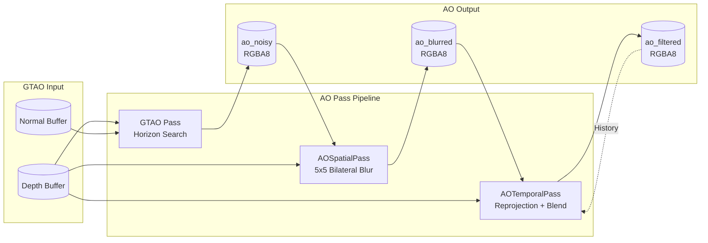
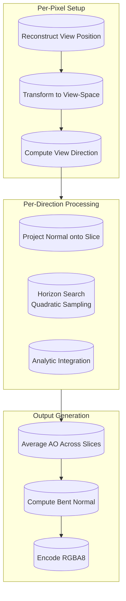

Ambient occlusion (AO) simulates soft shadows in surface creases, corners, and concave areas where ambient light is naturally blocked by nearby geometry. Himalaya implements **Ground-Truth Ambient Occlusion (GTAO)**, a screen-space technique that provides both diffuse occlusion and bent normals for physically-based specular occlusion. The implementation follows a three-pass pipeline: horizon search computation, spatial denoising, and temporal accumulation. This approach delivers high-quality contact shadows with stable results across frames while maintaining real-time performance suitable for interactive applications.

Sources: [gtao_pass.h](https://github.com/1PercentSync/himalaya/blob/main/passes/include/himalaya/passes/gtao_pass.h#L1-L102), [scene_data.h](https://github.com/1PercentSync/himalaya/blob/main/framework/include/himalaya/framework/scene_data.h#L224-L245)

## GTAO Algorithm Overview

GTAO replaces the traditional Monte Carlo sampling approach with a structured horizon search combined with analytic cosine-weighted integration. For each pixel, the algorithm casts rays along multiple directions in the view-space tangent plane, finding the horizon angle where geometry blocks the sky dome. The visibility integral is then evaluated analytically using the horizon angles and surface normal projection, yielding both diffuse occlusion and a bent normal representing the average unoccluded direction.

The mathematical foundation comes from Jimenez et al.'s 2016 paper "Practical Real-Time Strategies for Accurate Indirect Occlusion." Unlike SSAO which uses point sampling and empirical attenuation functions, GTAO computes a physically-grounded visibility term that correctly accounts for the cosine falloff of Lambertian surfaces. The bent normal output enables accurate specular occlusion through cone-cone intersection, addressing the limitation that diffuse AO incorrectly darkens glossy reflections.

Sources: [gtao.comp](https://github.com/1PercentSync/himalaya/blob/main/shaders/gtao.comp#L1-L50)

## Three-Pass Pipeline Architecture

The AO system is structured as three consecutive compute passes operating on intermediate buffers managed by the render graph. This separation allows each stage to be optimized independently and enables temporal accumulation without coupling the algorithms together.

The **GTAO Pass** performs the core horizon search algorithm, outputting raw occlusion and bent normals to `ao_noisy`. The **Spatial Pass** applies an edge-aware bilateral blur to reduce high-frequency noise while preserving geometric boundaries. The **Temporal Pass** blends the spatially-filtered result with the previous frame's output using reprojection and multi-layer rejection to eliminate ghosting artifacts.

Sources: [renderer_rasterization.cpp](https://github.com/1PercentSync/himalaya/blob/main/app/src/renderer_rasterization.cpp#L321-L325), [frame_context.h](https://github.com/1PercentSync/himalaya/blob/main/framework/include/himalaya/framework/frame_context.h#L62-L72)

## GTAO Pass: Horizon Search

The GTAO compute shader operates in 8x8 workgroups with one thread per pixel. For each pixel, it reconstructs the view-space position from depth and transforms the world-space normal into view-space. The core algorithm iterates over configured search directions, performing a quadratic power-curve sampling pattern that clusters samples near the center where crevice detail matters most.

The horizon search uses a quadratic step distribution: `t = linear_t²` where `linear_t` ranges from 0 to 1. This concentrates samples near the pixel center, providing higher resolution for nearby occluders that contribute most to the visibility function. The sample count is configurable via `steps_per_dir` (typically 4 or 8), while `directions` controls the angular resolution (typically 4 or 8 slices distributed evenly around the hemisphere).

Sources: [gtao.comp](https://github.com/1PercentSync/himalaya/blob/main/shaders/gtao.comp#L155-L220), [gtao_pass.cpp](https://github.com/1PercentSync/himalaya/blob/main/passes/src/gtao_pass.cpp#L118-L175)

### Horizon Angle Computation

For each sample along a search direction, the shader computes the cosine of the horizon angle from the view direction to the sample point. The maximum horizon cosine is tracked separately for both sides of the slice (positive and negative tangent directions). A linear distance falloff modulates the contribution: samples within `radius × (1 - kFalloffRange)` have full weight, with linear decay to zero at the radius boundary. The `kFalloffRange` constant of 0.615 matches XeGTAO's auto-tuned optimal value.

Thin occluder compensation is applied after the search completes: `max_cos = mix(max_cos, low_cos, thin_compensation)`. This blends the found horizon toward the tangent plane limit, improving quality for thin geometry like wires or leaves that might be missed by discrete sampling. A value of 0.7 approximates XeGTAO quality settings.

Sources: [gtao.comp](https://github.com/1PercentSync/himalaya/blob/main/shaders/gtao.comp#L74-L151), [gtao.comp](https://github.com/1PercentSync/himalaya/blob/main/shaders/gtao.comp#L224-L227)

### Analytic Integration

The diffuse occlusion for each slice is computed using the `gtao_slice_visibility` function, which evaluates the cosine-weighted visibility integral from the horizon angles to the tangent plane. The formula derives from integrating `sin(θ) × max(0, cos(θ - n))` over the visible arc, where `n` is the projected normal angle. The implementation uses the closed-form solution from the GTAO paper without any iterative sampling.

The bent normal computation follows Algorithm 2 from the paper, using trigonometric identities to expand compound angles into expressions involving only the precomputed horizon sines and cosines. This avoids additional transcendental function calls beyond the single `acos` per horizon side. The resulting bent normal represents the cosine-weighted average direction of unoccluded hemisphere samples.

Sources: [gtao.comp](https://github.com/1PercentSync/himalaya/blob/main/shaders/gtao.comp#L89-L120), [gtao.comp](https://github.com/1PercentSync/himalaya/blob/main/shaders/gtao.comp#L237-L285)

## Spatial Denoising Pass

The spatial pass applies a 5x5 edge-aware bilateral blur to the raw GTAO output. Standard Gaussian blur would smear occlusion across depth discontinuities, creating halos around object silhouettes. The bilateral approach weights samples by both spatial distance (Gaussian kernel) and depth similarity, preserving sharp edges where geometry changes.

The edge detection uses a relative depth threshold of 5%: `edge_weight = clamp(1.0 - |z1 - z2| / (max(z1,z2) × 0.05), 0, 1)`. This scene-scale-independent formulation ensures consistent behavior at all distances. The shader precomputes horizontal and vertical edge weights between adjacent pixels in the 5x5 neighborhood, then accumulates path weights by multiplying edge weights along the grid path from center to sample. This prevents "tunneling" where two distant surfaces at similar depths would incorrectly influence each other through an intervening depth discontinuity.

Sources: [ao_spatial.comp](https://github.com/1PercentSync/himalaya/blob/main/shaders/ao_spatial.comp#L1-L65), [ao_spatial.comp](https://github.com/1PercentSync/himalaya/blob/main/shaders/ao_spatial.comp#L106-L157)

## Temporal Accumulation Pass

Temporal filtering stabilizes the AO output across frames by blending with history, effectively multiplying the sample count over time. The temporal pass reprojects each pixel into the previous frame's UV space using the current and previous view-projection matrices, then applies a three-layer rejection system to handle disocclusion and motion.

| Rejection Layer | Condition | Action |
|-----------------|-----------|--------|
| UV Validity | `prev_uv` outside [0,1] | Full rejection (pixel was off-screen) |
| Depth Consistency | Relative depth difference > 5% | Full rejection (disocclusion detected) |
| Neighborhood Clamp | History outside current 3x3 min/max | Clamp to neighborhood range |

The depth comparison uses linearized depths for uniform sensitivity across the view frustum. Raw Reverse-Z depth is non-linear, so the shader converts to linear view-space distance before comparison. The neighborhood clamp operates only on the AO channel (alpha), as min/max of direction vectors has no physical meaning for bent normals. When history is rejected, the blend factor falls back to 0.0, using only the current frame.

Sources: [ao_temporal.comp](https://github.com/1PercentSync/himalaya/blob/main/shaders/ao_temporal.comp#L1-L70), [ao_temporal.comp](https://github.com/1PercentSync/himalaya/blob/main/shaders/ao_temporal.comp#L99-L135)

## Specular Occlusion Integration

The GTAO output feeds into the forward pass for both diffuse and specular lighting. The bent normal enables physically-based specular occlusion through the GTSO (Ground-Truth Specular Occlusion) algorithm, which computes the overlap between the visibility cone (derived from bent normal and AO) and the specular lobe cone (derived from roughness and reflection direction).

The visibility cone half-angle is `acos(sqrt(1 - ao))`, representing the angular extent of unoccluded directions. The specular cone uses Jimenez's optimal fit: `acos(pow(0.01, 0.5 × roughness²))`. The intersection is approximated by a smoothstep of the angle difference normalized by the specular cone angle. An `ao²` grazing-angle compensation term eliminates false darkening at horizon views when AO is near 1.0.

For comparison and performance fallback, the system also supports Lagarde's analytic approximation: `clamp(pow(NdotV + ao, exp2(-16×roughness - 1)) - 1 + ao, 0, 1)`. This requires no bent normal but produces less accurate results for high-roughness surfaces. The mode is selectable at runtime via `AOConfig::use_gtso`.

Sources: [forward.frag](https://github.com/1PercentSync/himalaya/blob/main/shaders/forward.frag#L67-L99), [forward.frag](https://github.com/1PercentSync/himalaya/blob/main/shaders/forward.frag#L257-L275)

## Configuration Parameters

The AO system exposes runtime-tunable parameters through `AOConfig`, consumed by passes via push constants:

| Parameter | Range | Description |
|-----------|-------|-------------|
| `radius` | 0.1 - 2.0 m | World-space sampling radius |
| `directions` | 2, 4, 8 | Horizon search direction count |
| `steps_per_dir` | 2, 4, 8 | Samples per direction |
| `thin_compensation` | 0.0 - 0.7 | Thin occluder blend toward tangent |
| `intensity` | 1.0 - 3.0 | AO darkness exponent |
| `temporal_blend` | 0.0 - 0.95 | History blend factor |
| `use_gtso` | true/false | GTSO vs Lagarde specular occlusion |

Higher direction and step counts improve quality at the cost of ALU operations. The default configuration (4 directions, 4 steps) provides a quality-performance balance suitable for 60 FPS targets. The temporal blend of 0.9 provides strong stability while still allowing adaptation to lighting changes within approximately 10 frames.

Sources: [scene_data.h](https://github.com/1PercentSync/himalaya/blob/main/framework/include/himalaya/framework/scene_data.h#L224-L245)

## Resource Management and Data Flow

The AO passes use the render graph's managed image system for intermediate buffers. Three RGBA8 images are allocated: `ao_noisy` (GTAO output), `ao_blurred` (spatial filter output), and `ao_filtered` (temporal output, also the history source). The temporal pass reads from `ao_history`, which is the previous frame's `ao_filtered` content obtained via `get_history_image()`.

Descriptor binding follows the standard Himalaya pattern: Set 0-2 are global (UBO, bindless textures, render targets), while Set 3 is a push descriptor for per-pass I/O. The GTAO pass writes to a storage image via push descriptor; spatial and temporal passes use combined image samplers for inputs and storage images for outputs. All passes use 8x8 workgroups with dispatch size computed as `ceil(width/8) × ceil(height/8)`.

Sources: [gtao_pass.cpp](https://github.com/1PercentSync/himalaya/blob/main/passes/src/gtao_pass.cpp#L41-L67), [frame_context.h](https://github.com/1PercentSync/himalaya/blob/main/framework/include/himalaya/framework/frame_context.h#L62-L72)

## Integration with Forward Rendering

The final AO texture is bound at Set 2 binding 3 (`rt_ao_texture`) for sampling in the forward fragment shader. The forward pass combines screen-space AO with material occlusion textures, applies multi-bounce color compensation to prevent over-darkening on bright surfaces, and modulates both diffuse IBL and specular IBL by the computed occlusion factors. Debug visualization modes allow inspecting raw GTAO output (`DEBUG_MODE_AO_SSAO`) and combined AO (`DEBUG_MODE_AO`) for tuning and verification.