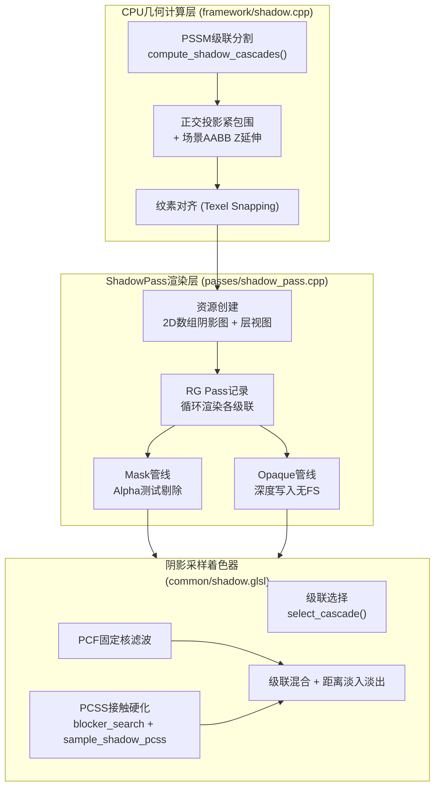
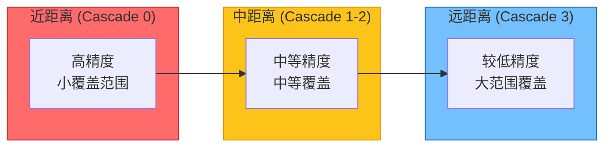
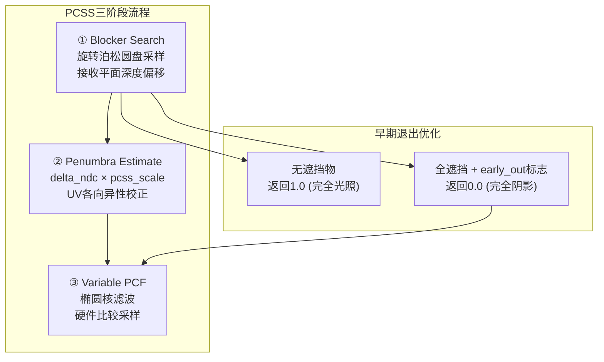

级联阴影映射（Cascaded Shadow Maps, CSM）是Himalaya引擎中用于渲染方向光阴影的核心系统，通过将视锥体分割为多个级联区域，每级使用独立的正交投影来平衡阴影精度与覆盖范围。本Pass实现了从级联分割计算到深度渲染，再到PCF/PCSS软阴影采样的完整管线。

## CSM核心架构

级联阴影系统的架构分为两个层次：**几何计算层**负责CPU侧的级联分割与投影矩阵计算，**渲染Pass层**负责GPU侧的深度图渲染与采样。这种分离设计使得投影计算可以独立于渲染流程进行单元测试和调试。

核心数据结构`ShadowCascadeResult`存储每帧计算的级联数据，包括视图投影矩阵、分割距离、纹素世界尺寸以及正交投影范围，这些数据用于填充GPU侧的GlobalUBO供着色器采样使用。Sources: [shadow.h](https://github.com/1PercentSync/himalaya/blob/main/framework/include/himalaya/framework/shadow.h#L28-L46)

## PSSM级联分割算法

级联分割采用PSSM（Practical Split Schemes）混合对数与线性分布，通过`split_lambda`参数控制偏向。对于第i个级联（共n个），其远平面距离的计算公式为：C_i = λ × C_log + (1 - λ) × C_lin，其中对数项C_log强调近距离精度，线性项C_lin保证远距离覆盖。Sources: [shadow.cpp](https://github.com/1PercentSync/himalaya/blob/main/framework/src/shadow.cpp#L60-L72)

算法实现中，首先构建相机子视锥体的8个角点，然后在光源空间中对齐包围盒。光源空间的基向量由光线方向与上方向叉积构建，确保正交投影的稳定朝向。Sources: [shadow.cpp](https://github.com/1PercentSync/himalaya/blob/main/framework/src/shadow.cpp#L78-L103)

## 投影与纹素对齐

每级联的正交投影在XY平面上紧包围子视锥体角点，Z方向延伸至场景AABB以捕获视锥体外部的阴影投射物。纹素对齐技术通过将投影矩阵的平移分量调整到纹素边界，消除相机移动时的阴影边缘闪烁。Sources: [shadow.cpp](https://github.com/1PercentSync/himalaya/blob/main/framework/src/shadow.cpp#L168-L183)

关键实现细节：
- 使用Reverse-Z正交投影（近平面映射到1，远平面映射到0）
- 纹素尺寸计算：`texel_world_size = 2.0 * shadow_texel_size / ||row0||`
- 对齐公式：`round(sx) - sx`，其中`sx = vp[3][0] * half_res`

## ShadowPass资源管理

ShadowPass自行管理2D数组阴影图资源（非RenderGraph托管），阴影图使用`D32_SFLOAT`格式，默认分辨率为2048×2048像素，包含最多4个级联层。每层创建独立的`VkImageView`用于渲染时绑定到深度附件。Sources: [shadow_pass.cpp](https://github.com/1PercentSync/himalaya/blob/main/passes/src/shadow_pass.cpp#L280-L303)

资源生命周期函数：

| 函数 | 作用 |
|------|------|
| `setup()` | 初始化阴影图、编译着色器、创建管线 |
| `record()` | 向RenderGraph注册Pass并记录渲染命令 |
| `on_resolution_changed()` | 重建阴影图资源（需GPU空闲） |
| `rebuild_pipelines()` | 重新编译着色器并创建管线 |

## 双管线渲染策略

考虑到性能与正确性的平衡，ShadowPass实现了两条独立的渲染管线：

| 管线类型 | 片元着色器 | 用途 | 优化策略 |
|----------|-----------|------|---------|
| **Opaque** | 无（VK_NULL_HANDLE） | 不透明几何体 | 完整Early-Z，无着色器开销 |
| **Mask** | shadow_masked.frag | Alpha Mask材质 | Alpha测试剔除，支持镂空 |

Opaque管线跳过片元着色器阶段，仅通过光栅化写入深度，这使得驱动可以启用完整的Early-Z优化，显著减少片元处理开销。Mask管线在片元着色器中采样BaseColor纹理的Alpha通道，低于`alpha_cutoff`的片元被丢弃。Sources: [shadow_pass.cpp](https://github.com/1PercentSync/himalaya/blob/main/passes/src/shadow_pass.cpp#L238-L276)

渲染命令记录采用级联内循环结构，每级联绑定对应的层视图作为深度附件，清除值为0.0（Reverse-Z远平面），设置斜率深度偏移（负值以适配Reverse-Z）。Push Constant传递级联索引供顶点着色器选择对应的视图投影矩阵。Sources: [shadow_pass.cpp](https://github.com/1PercentSync/himalaya/blob/main/passes/src/shadow_pass.cpp#L90-L162)

## 阴影采样与滤波

阴影采样由`common/shadow.glsl`提供完整的着色器函数库，核心入口函数为`blend_cascade_shadow()`，整合级联选择、PCF/PCSS采样、级联混合和距离淡入淡出。Sources: [shadow.glsl](https://github.com/1PercentSync/himalaya/blob/main/shaders/common/shadow.glsl#L460-L493)

**级联选择算法**：根据视空间深度与`cascade_splits`比较确定级联索引，在边界区域计算混合因子实现平滑过渡。当级联索引在quad内不一致时（跨级联边界），通过`dFdx/dFdy`检测并归零接收平面深度梯度，回退到法线偏移+斜率偏移方案。Sources: [shadow.glsl](https://github.com/1PercentSync/himalaya/blob/main/shaders/common/shadow.glsl#L352-L373)

**PCF滤波**：采用`(2R+1) × (2R+1)`网格采样，每个采样点利用硬件`2×2`双线性比较过滤，有效滤波范围宽于采样网格。R=0时退化为单点硬阴影。Sources: [shadow.glsl](https://github.com/1PercentSync/himalaya/blob/main/shaders/common/shadow.glsl#L390-L419)

**PCSS接触硬化阴影**：实现完整的三阶段算法——遮挡物搜索（Blocker Search）→半影宽度估计→可变核PCF。使用32点泊松圆盘采样进行遮挡物搜索，49点采样进行可变核滤波。时域抖动通过交错梯度噪声与帧索引的分数偏移实现，TAA累积后等效于更高采样数。Sources: [shadow.glsl](https://github.com/1PercentSync/himalaya/blob/main/shaders/common/shadow.glsl#L279-L335)

## 接收平面深度偏移

为消除自阴影伪影（Shadow Acne），系统实现了双重偏移策略。硬件斜率偏移在光栅化阶段应用（`cmd.set_depth_bias`），接收平面深度偏移在着色器采样阶段应用，根据采样点在阴影UV空间中的偏移调整比较深度。

`ShadowProjData`结构封装预计算的投影数据，包含阴影UV、参考深度以及深度对UV的偏导数`dz_du`和`dz_dv`。在统一控制流中调用`prepare_shadow_proj()`计算这些值，后续Blocker Search和PCF采样直接使用而无需再次求导。Sources: [shadow.glsl](https://github.com/1PercentSync/himalaya/blob/main/shaders/common/shadow.glsl#L138-L200)

## 与Forward Pass的集成

前向渲染Pass在片元着色器中通过`#include "common/shadow.glsl"`引入阴影采样函数。对于每个方向光，检查`feature_flags`中的`FEATURE_SHADOWS`标志和光源的`cast_shadows`标志，符合条件时调用`blend_cascade_shadow()`计算阴影衰减因子并乘到辐射度上。Sources: [forward.frag](https://github.com/1PercentSync/himalaya/blob/main/shaders/forward.frag#L223-L227)

调试可视化模式`DEBUG_MODE_SHADOW_CASCADES`通过`select_cascade()`暴露级联索引，使用红、绿、蓝、黄四种颜色区分不同级联区域，便于调试级联边界和混合行为。Sources: [forward.frag](https://github.com/1PercentSync/himalaya/blob/main/shaders/forward.frag#L159-L173)

## 配置参数参考

`ShadowConfig`结构提供运行时调节接口，关键参数说明如下：

| 参数 | 类型 | 默认值 | 说明 |
|------|------|--------|------|
| `cascade_count` | uint32 | 4 | 激活级联数（1-4），不影响资源分配 |
| `split_lambda` | float | 0.7 | PSSM对数/线性混合因子（0=纯线性，1=纯对数） |
| `max_distance` | float | 100.0 | 阴影最大覆盖距离（米） |
| `slope_bias` | float | 2.0 | 硬件斜率深度偏移因子（负值适配Reverse-Z） |
| `normal_offset` | float | 1.0 | 着色器法线偏移强度（纹素数） |
| `pcf_radius` | uint32 | 2 | PCF核半径（2=5×5网格） |
| `blend_width` | float | 0.1 | 级联混合区域占级联范围的比例 |
| `shadow_mode` | uint32 | 0 | 0=PCF固定核，1=PCSS接触硬化 |
| `light_angular_diameter` | float | 0.00925 | 光源角直径（弧度），控制PCSS半影宽度 |

Sources: [scene_data.h](https://github.com/1PercentSync/himalaya/blob/main/framework/include/himalaya/framework/scene_data.h#L160-L216)

## 技术约束与边界

级联阴影映射Pass的设计遵循以下约束边界：

- **最大级联数固定为4**：由`kMaxShadowCascades`常量定义，变更需要同时修改CPU结构体和着色器中的`MAX_SHADOW_CASCADES`宏
- **非MSAA感知**：阴影图始终为1x采样，不受主渲染MSAA设置影响
- **分辨率变更需GPU空闲**：`on_resolution_changed()`内部销毁并重建图像资源，调用者需确保`vkQueueWaitIdle`
- **方向光专用**：当前实现仅支持方向光源，点光源和聚光灯需使用其他技术（如[接触阴影Pass](https://github.com/1PercentSync/himalaya/blob/main/21-jie-hong-yin-ying-pass)）

## 与其他Pass的关系

级联阴影Pass在渲染管线中的位置和交互关系：

- **前置依赖**：无（作为早期深度Pass之一，与[深度预渲染Pass](https://github.com/1PercentSync/himalaya/blob/main/17-shen-du-yu-xuan-ran-pass)并行可行）
- **后置消费者**：[前向渲染Pass](https://github.com/1PercentSync/himalaya/blob/main/18-qian-xiang-xuan-ran-pass)采样阴影图进行光照计算
- **互补技术**：与[接触阴影Pass](https://github.com/1PercentSync/himalaya/blob/main/21-jie-hong-yin-ying-pass)协同工作，级联阴影负责远距离大范围阴影，接触阴影负责近距离精细接触阴影