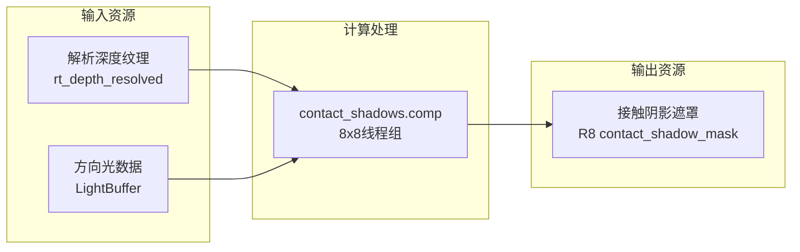

接触阴影（Contact Shadows）是一种屏幕空间技术，专门用于捕获传统级联阴影映射（CSM）难以处理的高频接触阴影细节。该技术通过在屏幕空间对主方向光进行光线步进，检测像素级遮挡关系，填补标准阴影贴图在近距离处的分辨率不足。本页将深入剖析`ContactShadowsPass`的架构设计、算法实现细节及其在渲染管线中的集成方式。

## 核心设计原则

接触阴影Pass的设计围绕**质量与性能的平衡**展开。其核心假设是：接触阴影仅在有限距离内（通常1-3米）具有显著视觉效果，因此只需要较短的射线长度即可获得高质量结果。该Pass作为[深度预渲染Pass](https://github.com/1PercentSync/himalaya/blob/main/17-shen-du-yu-xuan-ran-pass)的下游处理阶段，以解析后的深度缓冲作为输入，输出单通道R8阴影遮罩，供后续[前向渲染Pass](https://github.com/1PercentSync/himalaya/blob/main/18-qian-xiang-xuan-ran-pass)采样使用。



关键设计决策包括：采用**非线性步长分布**将更多采样集中在射线起点附近（接触细节最关键区域）；使用**双深度采样策略**（双线性+最近邻）消除伪影；以及通过**时域抖动**将步进带状伪影转换为可被TAA解析的高频噪声。

Sources: [contact_shadows_pass.h](https://github.com/1PercentSync/himalaya/blob/main/passes/include/himalaya/passes/contact_shadows_pass.h#L1-L20), [contact_shadows.comp](https://github.com/1PercentSync/himalaya/blob/main/shaders/contact_shadows.comp#L1-L40)

## 算法实现详解

### 射线设置与世界空间重建

着色器首先从当前像素重建世界空间位置和裁剪空间射线。为避免浮点精度问题（远处像素具有极小的NDC深度值），起点位置直接由像素已知的NDC坐标构建，而非通过逆矩阵回推：

```glsl
float start_w = linearize_depth(depth);
vec4 start_clip = vec4(ndc * start_w, depth * start_w, start_w);
```

射线终点通过世界空间位置加上光源方向的偏移量计算，再变换回裁剪空间。若射线终点位于相机后方（w ≤ 0），则执行安全钳制以防止透视除零错误。

Sources: [contact_shadows.comp](https://github.com/1PercentSync/himalaya/blob/main/shaders/contact_shadows.comp#L115-L145)

### 自相交偏移与斜率缩放深度偏移

为避免将起始表面自身识别为遮挡物，Pass实现了屏幕空间的**斜率缩放深度偏移**——这是传统阴影映射中斜率偏移的屏幕空间类比。偏移量基于每步深度变化容差计算，并按`1/NdotL`缩放：入射光越接近切线角度，表面深度梯度相对于射线深度变化越陡峭，因此需要更大的偏移量。该偏移仅作用于射线起点，通过`mix()`插值在射线终点处自然衰减至零。

```glsl
float bias_scale = 1.0 / max(NdotL, 0.25);
float depth_bias = tolerance * bias_scale;
start_clip.z += global.projection[3][2] * depth_bias / lin_start;
```

Sources: [contact_shadows.comp](https://github.com/1PercentSync/himalaya/blob/main/shaders/contact_shadows.comp#L175-L192)

### 非线性光线步进与双深度采样

核心光线步进采用指数分布（指数=2.0）将采样集中在射线起点附近，使用h3r2tic提出的**双深度采样**策略消除两类典型伪影：

| 采样模式 | 伪影类型 | 解决方案 |
|---------|---------|---------|
| 双线性过滤 | 轮廓处深度不连续产生的幽灵表面 | 与最近邻结合使用 |
| 最近邻采样 | 量化位置产生的阶梯状伪影 | 与双线性结合使用 |

算法要求射线必须同时位于**两个**采样深度的后方才判定为遮挡，即选择两个深度值中的较大者作为场景深度：

```glsl
float lin_scene = max(lin_bilinear, lin_nearest);
float lin_delta = lin_ray - lin_scene;

if (lin_delta > 0.0 && lin_delta < tolerance) {
    // 有效命中 - 计算阴影强度
    shadow = 1.0 - end_fade * edge_fade;
    break;
}
```

**厚度失效**（delta ≥ tolerance，射线完全穿过厚几何体）不会终止步进，允许算法在薄表面（如栅栏、树叶）后方继续寻找有效遮挡。

Sources: [contact_shadows.comp](https://github.com/1PercentSync/himalaya/blob/main/shaders/contact_shadows.comp#L205-L265)

### 时域抖动与边缘淡化

为将步进带状伪影转换为噪声，每帧应用**交错梯度噪声（IGN）**作为子步长抖动源。抖动值按`(i + noise) / N`的形式融入非线性步进公式。此外，Pass在屏幕边缘实现了5%宽度的平滑淡化，防止阴影在视口边界产生硬截断。

Sources: [contact_shadows.comp](https://github.com/1PercentSync/himalaya/blob/main/shaders/contact_shadows.comp#L195-L200), [contact_shadows.comp](https://github.com/1PercentSync/himalaya/blob/main/shaders/contact_shadows.comp#L65-L75)

## C++端架构实现

### Pass类结构

`ContactShadowsPass`遵循Pass层的标准生命周期模式：setup/record/rebuild_pipelines/destroy。由于该Pass处理解析后的深度（1x，非MSAA），因此不需要`on_sample_count_changed()`回调。

```cpp
class ContactShadowsPass {
public:
    void setup(rhi::Context &ctx, rhi::ResourceManager &rm,
               rhi::DescriptorManager &dm, rhi::ShaderCompiler &sc);
    void record(framework::RenderGraph &rg, const framework::FrameContext &ctx) const;
    void rebuild_pipelines();
    void destroy();
private:
    void create_pipeline();
    rhi::Pipeline pipeline_;
    VkDescriptorSetLayout set3_layout_ = VK_NULL_HANDLE;
};
```

Sources: [contact_shadows_pass.h](https://github.com/1PercentSync/himalaya/blob/main/passes/include/himalaya/passes/contact_shadows_pass.h#L45-L103)

### 描述符布局与管线创建

Pass使用**Push Descriptor**机制直接推送输出资源绑定。描述符布局仅包含一个存储图像绑定（Set 3, Binding 0），而深度输入从全局Set 2的binding 1（`rt_depth_resolved`）读取，无需每次调度时重新绑定。Push Constants传递三个配置参数：步数、最大距离、基础厚度。

```cpp
// Push Constants布局（必须匹配着色器）
struct ContactShadowPushConstants {
    uint32_t step_count;    // 8/16/24/32
    float max_distance;     // 世界空间米数
    float base_thickness;   // 深度自适应比较基准
};
```

管线创建流程编译`contact_shadows.comp`为SPIR-V，配置计算着色器模块、描述符布局数组和Push Constant范围。

Sources: [contact_shadows_pass.cpp](https://github.com/1PercentSync/himalaya/blob/main/passes/src/contact_shadows_pass.cpp#L22-L90)

### 调度记录与线程组配置

每帧记录阶段，Pass向RenderGraph声明资源依赖（读取深度、写入遮罩），然后在回调中执行：

1. 绑定计算管线
2. 绑定全局描述符集（Set 0-2）
3. 推送Set 3的存储图像描述符
4. 推送常量参数
5. 分派计算：`ceil(width/8) x ceil(height/8)`线程组

工作组大小为8x8，每个线程处理一个像素，不使用共享内存（纯全屏并行处理）。

Sources: [contact_shadows_pass.cpp](https://github.com/1PercentSync/himalaya/blob/main/passes/src/contact_shadows_pass.cpp#L118-L168)

## 渲染管线集成

### 资源管理与生命周期

`Renderer`在初始化时通过`render_graph_.create_managed_image()`创建`managed_contact_shadow_mask_`作为托管资源，格式为R8，尺寸匹配渲染分辨率。该资源通过`update_contact_shadow_descriptor()`更新到Set 2 binding 4，供前向着色器全局采样。

```cpp
managed_contact_shadow_mask_ = render_graph_.create_managed_image("Contact Shadow Mask", {
    .format = VK_FORMAT_R8_UNORM,
    .extent = {render_width, render_height, 1},
    // ...
});
```

Sources: [renderer_init.cpp](https://github.com/1PercentSync/himalaya/blob/main/app/src/renderer_init.cpp#L129-L135), [renderer_init.cpp](https://github.com/1PercentSync/himalaya/blob/main/app/src/renderer_init.cpp#L420-L432)

### 光栅化管线集成

在`record_rasterization()`中，Pass的调度条件为：
- 功能标志`contact_shadows`启用
- 场景存在至少一个光源（`!input.lights.empty()`）

接触阴影Pass在AO计算之后、前向渲染之前执行，确保深度缓冲已完成解析。`FrameContext`传递`contact_shadow_mask`资源ID和`contact_shadow_config`指针。

Sources: [renderer_rasterization.cpp](https://github.com/1PercentSync/himalaya/blob/main/app/src/renderer_rasterization.cpp#L267-L291), [renderer_rasterization.cpp](https://github.com/1PercentSync/himalaya/blob/main/app/src/renderer_rasterization.cpp#L311-L327)

### 前向着色器采样

前向着色器通过`rt_contact_shadow_mask`（Set 2, Binding 4）采样接触阴影遮罩。遮罩值为1.0表示完全照亮，0.0表示完全遮蔽。辐照度计算仅对主方向光（`directional_lights[0]`）应用接触阴影衰减，因为计算着色器仅追踪该光源：

```glsl
float contact_shadow = 1.0;
if ((global.feature_flags & FEATURE_CONTACT_SHADOWS) != 0u) {
    contact_shadow = texture(rt_contact_shadow_mask, screen_uv).r;
}

// 在方向光循环中...
if (i == 0u) {
    radiance *= contact_shadow;
}
```

着色器还实现了`DEBUG_MODE_CONTACT_SHADOWS`调试图式，直接可视化R通道遮罩值。

Sources: [forward.frag](https://github.com/1PercentSync/himalaya/blob/main/shaders/forward.frag#L155-L160), [forward.frag](https://github.com/1PercentSync/himalaya/blob/main/shaders/forward.frag#L215-L225), [bindings.glsl](https://github.com/1PercentSync/himalaya/blob/main/shaders/common/bindings.glsl#L185)

## 运行时配置

### ContactShadowConfig参数

| 参数 | 类型 | 默认值 | 说明 |
|-----|------|-------|------|
| `step_count` | uint32_t | 16 | 光线步进采样数（8/16/24/32） |
| `max_distance` | float | 1.5m | 最大搜索距离（世界空间米数） |
| `base_thickness` | float | 0.05m | 深度自适应比较的基础厚度 |

配置实例由`Application`持有，`DebugUI`直接修改字段，`ContactShadowsPass`通过Push Constants消费。步数在DebugUI中通过下拉菜单选择预设值（8/16/24/32），平衡性能与质量。

Sources: [scene_data.h](https://github.com/1PercentSync/himalaya/blob/main/framework/include/himalaya/framework/scene_data.h#L253-L268), [debug_ui.cpp](https://github.com/1PercentSync/himalaya/blob/main/app/src/debug_ui.cpp#L532-L552)

### 特征标志控制

`SceneFeatureFlags`中的`contact_shadows`布尔值控制Pass是否被调度，而`FEATURE_CONTACT_SHADOWS`（1u << 2）位掩码则控制前向着色器是否采样遮罩。两者独立但通常同步启用，允许单独调试图层而无需完整Pass开销。

Sources: [scene_data.h](https://github.com/1PercentSync/himalaya/blob/main/framework/include/himalaya/framework/scene_data.h#L149), [bindings.glsl](https://github.com/1PercentSync/himalaya/blob/main/shaders/common/bindings.glsl#L60)

## 性能考量与最佳实践

**步数自适应**：着色器自动将有效步数钳制到屏幕空间射线长度，确保不会遍历超过像素数量的步数。公式`effective_steps = clamp(pc.step_count, 2u, max(2u, ray_len_px))`防止短射线上的过度采样。

**背面剔除优化**：对NdotL ≤ 0的表面提前退出，避免在光照方程已归零的背面上浪费计算。这不仅提升性能，还确保调试图层在背面的一致性输出。

**内存带宽**：R8格式遮罩最小化显存占用和带宽消耗。作为只写资源，计算着色器无需读取-修改-写入操作。

**与TAA配合**：时域抖动设计将带状伪影转换为高频噪声，依赖后续的[时域降噪Pass](https://github.com/1PercentSync/himalaya/blob/main/23-shi-yu-jiang-zao-pass)或TAA进行时间累积降噪。若未启用时域抗锯齿，建议降低步数或增加抖动幅度。

Sources: [contact_shadows.comp](https://github.com/1PercentSync/himalaya/blob/main/shaders/contact_shadows.comp#L88-L95), [contact_shadows.comp](https://github.com/1PercentSync/himalaya/blob/main/shaders/contact_shadows.comp#L163-L170)

## 相关页面

- [深度预渲染Pass](https://github.com/1PercentSync/himalaya/blob/main/17-shen-du-yu-xuan-ran-pass) — 接触阴影的上游深度输入源
- [级联阴影映射Pass](https://github.com/1PercentSync/himalaya/blob/main/20-ji-lian-yin-ying-ying-she-pass) — 与接触阴影互补的大范围阴影方案
- [前向渲染Pass](https://github.com/1PercentSync/himalaya/blob/main/18-qian-xiang-xuan-ran-pass) — 接触阴影遮罩的消费端
- [时域降噪Pass](https://github.com/1PercentSync/himalaya/blob/main/23-shi-yu-jiang-zao-pass) — 用于处理接触阴影产生的时域噪声