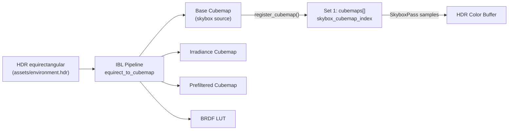
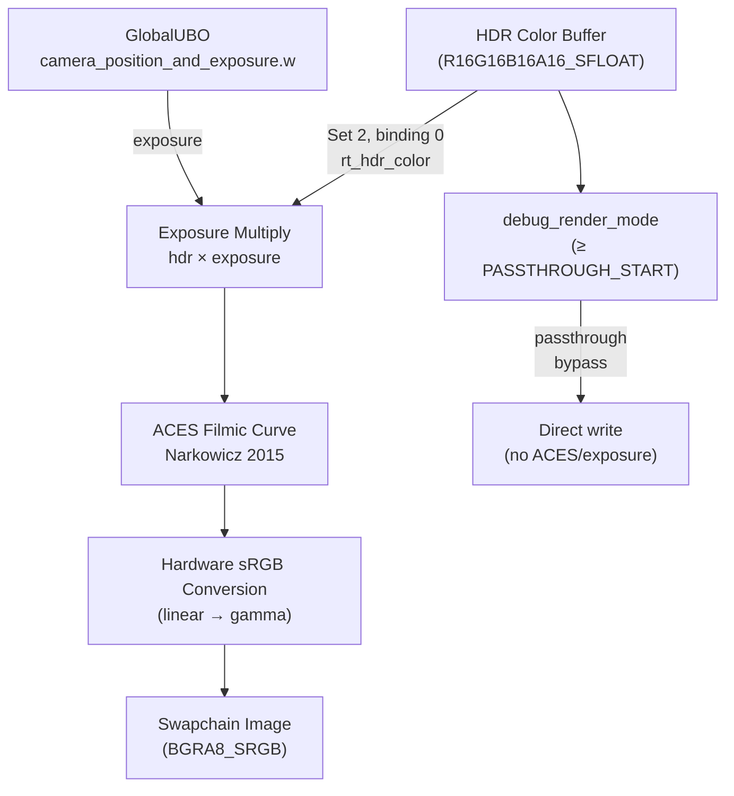

The **SkyboxPass** and **TonemappingPass** form the terminal stage of himalaya's rasterization pipeline. Together they transform the HDR scene framebuffer into a presentation-ready image: the SkyboxPass fills uncovered pixels with the environment cubemap, and the TonemappingPass compresses the full dynamic range into the swapchain's SDR format via ACES filmic tonemapping. Both are fullscreen-triangle passes with no vertex buffers, no MSAA, and no push constants — they rely entirely on the bindless descriptor architecture and the `GlobalUBO` for their data.

Sources: [skybox_pass.h](https://github.com/1PercentSync/himalaya/blob/main/passes/include/himalaya/passes/skybox_pass.h#L1-L13), [tonemapping_pass.h](https://github.com/1PercentSync/himalaya/blob/main/passes/include/himalaya/passes/tonemapping_pass.h#L1-L12)

## Pass Ordering in the Frame

In the rasterization render path, these two passes are the final render graph nodes before ImGui. The SkyboxPass is conditionally recorded based on `RenderFeatures::skybox`, while the TonemappingPass always executes — it is the mandatory bridge from HDR to the swapchain. In path-tracing mode, only the TonemappingPass is used, reading from the accumulation buffer instead of the rasterized HDR target.

```
ForwardPass → [SkyboxPass] → TonemappingPass → ImGui → Present
```

The conditional skybox insertion is controlled by a simple feature flag check at recording time. The tonemapping pass always runs because every rendering path must eventually produce swapchain-compatible output.

Sources: [renderer_rasterization.cpp](https://github.com/1PercentSync/himalaya/blob/main/app/src/renderer_rasterization.cpp#L316-L333), [renderer_pt.cpp](https://github.com/1PercentSync/himalaya/blob/main/app/src/renderer_pt.cpp#L41-L42), [renderer_pt.cpp](https://github.com/1PercentSync/himalaya/blob/main/app/src/renderer_pt.cpp#L268)

## SkyboxPass — Depth-Rejected Cubemap Rendering

The SkyboxPass renders the environment cubemap as a sky background by exploiting the **reverse-Z depth buffer** convention. In reverse-Z, the depth buffer is cleared to 0.0 (the "far plane"), and geometry writes depth values ≥ 0.0. The skybox shader sets `gl_Position.z = 0.0`, placing it exactly at the far plane. With a `GREATER_OR_EQUAL` depth comparison and depth writes disabled, sky pixels only pass the depth test where no geometry has previously written — exactly the behavior needed for a background.

### Pipeline Configuration

| Property | Value | Rationale |
|---|---|---|
| Vertex shader | `skybox.vert` | Custom: computes world-space ray direction |
| Fragment shader | `skybox.frag` | Cubemap sampling with IBL rotation |
| Color format | `R16G16B16A16_SFLOAT` | Matches HDR render target |
| Depth format | `D32_SFLOAT` | Matches scene depth buffer |
| Sample count | 1 | Always renders into resolved targets |
| Depth test | `GREATER_OR_EQUAL` | Reverse-Z far-plane rejection |
| Depth write | Disabled | Sky never overwrites geometry depth |
| Cull mode | None | Fullscreen triangle covers entire screen |
| Vertex input | None | Generated procedurally from `gl_VertexIndex` |

### World-Space Direction Reconstruction

The vertex shader doesn't simply pass UV coordinates — it reconstructs a **world-space view ray** for each screen corner. This is necessary because the skybox must rotate correctly with the camera, sampling the cubemap based on the actual viewing direction rather than screen-space coordinates.

The reconstruction works by unprojecting a point at NDC `z=1.0` (the reverse-Z near plane) through `inv_view_projection`, then subtracting the camera position to get a pure direction vector. The `z=1.0` choice is significant: in reverse-Z, NDC `z=1.0` corresponds to the near plane, which produces a finite point that can be meaningfully unprojected. Using `z=0.0` (the far plane) would produce a degenerate point at infinity.

```glsl
// Skybox vertex shader — direction reconstruction
vec4 world_pos = global.inv_view_projection * vec4(ndc, 1.0, 1.0);
out_world_dir = world_pos.xyz / world_pos.w - global.camera_position_and_exposure.xyz;
gl_Position = vec4(ndc, 0.0, 1.0); // z=0.0 → reverse-Z far plane
```

Sources: [skybox.vert](https://github.com/1PercentSync/himalaya/blob/main/shaders/skybox.vert#L20-L29)

### IBL Rotation and Bindless Cubemap Sampling

The fragment shader performs two operations on the interpolated direction: normalization, then a Y-axis rotation using precomputed sine/cosine values from the `GlobalUBO`. This rotation allows the environment to be spun horizontally without reprocessing the cubemap — a cost-effective way to change the perceived lighting direction.

The actual texture sample uses the bindless cubemap array: `cubemaps[nonuniformEXT(global.skybox_cubemap_index)]`. The `nonuniformEXT` qualifier is required because the cubemap index is a runtime value, not a compile-time constant. The `skybox_cubemap_index` field is populated during IBL initialization, where the original environment cubemap (before irradiance/prefilter processing) is registered into Set 1's bindless array.



### Viewport Y-Flip

The SkyboxPass applies a **Y-flipped viewport** (`viewport.y = height`, `viewport.height = -height`), which differs from the TonemappingPass's standard viewport. This flip compensates for a coordinate convention mismatch: the skybox vertex shader reconstructs world-space directions from NDC coordinates, and the GLM projection matrix expects Y-up in clip space. Without the flip, the skybox would appear vertically mirrored.

Sources: [skybox_pass.cpp](https://github.com/1PercentSync/himalaya/blob/main/passes/src/skybox_pass.cpp#L96-L176), [skybox.frag](https://github.com/1PercentSync/himalaya/blob/main/shaders/skybox.frag#L19-L27), [transform.glsl](https://github.com/1PercentSync/himalaya/blob/main/shaders/common/transform.glsl#L17-L19), [ibl.cpp](https://github.com/1PercentSync/himalaya/blob/main/framework/src/ibl.cpp#L566-L575)

## TonemappingPass — ACES Filmic HDR-to-SDR Conversion

The TonemappingPass is the **final post-processing step** that converts the HDR color buffer into a presentable image on the swapchain. It reads the `R16G16B16A16_SFLOAT` HDR buffer as a sampled texture (Set 2, binding 0) and writes tonemapped output directly to the swapchain's surface format. The pass has no depth attachment — it is a pure screen-space operation.

### Pipeline Configuration

| Property | Value | Rationale |
|---|---|---|
| Vertex shader | `fullscreen.vert` | Shared: generates UV coordinates for sampling |
| Fragment shader | `tonemapping.frag` | ACES curve + exposure |
| Color format | Swapchain surface format | Negotiated at device creation |
| Depth format | `VK_FORMAT_UNDEFINED` | No depth needed |
| Sample count | 1 | Processes resolved 1x HDR buffer |
| Descriptor sets | Set 0 + Set 1 + Set 2 | Reads HDR via Set 2 binding 0 |

### ACES Filmic Tonemapping Curve

The pass uses the **ACES filmic tonemapping curve** (Narkowicz 2015 fit), which maps HDR luminance values in `[0, ∞)` to LDR `[0, 1]` through a smooth S-curve. The curve is defined by five constants:

$$f(x) = \frac{x(ax + b)}{x(cx + d) + e}$$

Where `a = 2.51`, `b = 0.03`, `c = 2.43`, `d = 0.59`, `e = 0.14`. This particular fit was chosen because it preserves shadow detail, provides pleasing highlight rolloff, and produces visually balanced output without requiring parameter tuning per scene.



### Exposure Control

Exposure is applied as a simple linear multiplier before tonemapping: `exposed = hdr * exposure`. The exposure value itself comes from `GlobalUBO.camera_position_and_exposure.w`, which is filled by the application as `pow(2.0, ev_)` — converting from photographic EV stops to a linear scale. This EV-based control matches industry-standard photography conventions where each EV stop doubles or halves the exposure.

### Debug Passthrough Mode

When `debug_render_mode >= DEBUG_MODE_PASSTHROUGH_START` (value 4), the tonemapping pass bypasses both exposure and ACES, writing the HDR color directly to the swapchain. This passthrough mode supports material property visualizations (normal, metallic, roughness, AO) that are already encoded in `[0, 1]` range by the forward pass and would be incorrectly compressed by the ACES curve. The hardware sRGB conversion still applies since the swapchain format is SRGB.

### Automatic sRGB Gamma Conversion

The swapchain surface format is an SRGB format (typically `VK_FORMAT_B8G8R8A8_SRGB`), which means the GPU's fixed-function blending and storage hardware automatically converts the linear output values to gamma-encoded sRGB. The shader outputs linear color, and the presentation engine receives properly gamma-corrected pixels — no manual gamma correction is needed in the shader.

Sources: [tonemapping.frag](https://github.com/1PercentSync/himalaya/blob/main/shaders/tonemapping.frag#L25-L47), [tonemapping_pass.cpp](https://github.com/1PercentSync/himalaya/blob/main/passes/src/tonemapping_pass.cpp#L91-L162), [application.cpp](https://github.com/1PercentSync/himalaya/blob/main/app/src/application.cpp#L565), [renderer.h](https://github.com/1PercentSync/himalaya/blob/main/app/include/himalaya/app/renderer.h#L90-L91)

## Render Graph Integration

Both passes declare their resource dependencies explicitly to the render graph, enabling automatic barrier insertion and layout transitions.

**SkyboxPass** declares two resources:
- `depth` — **Read** at `DepthAttachment` stage (depth test against existing geometry)
- `hdr_color` — **ReadWrite** at `ColorAttachment` stage (`LOAD_OP_LOAD` preserves forward pass output, sky only writes to uncovered pixels)

**TonemappingPass** declares two resources:
- `hdr_color` — **Read** at `Fragment` stage (sampled as a texture)
- `swapchain` — **Write** at `ColorAttachment` stage (`LOAD_OP_DONT_CARE`, fully overwritten)

The transition from `hdr_color` being a color attachment (SkyboxPass) to a sampled texture (TonemappingPass) is handled automatically by the render graph's barrier insertion pass. This is the critical handoff point: after the SkyboxPass completes, `hdr_color` contains the complete HDR scene with sky, ready for tonemapping.

Sources: [skybox_pass.cpp](https://github.com/1PercentSync/himalaya/blob/main/passes/src/skybox_pass.cpp#L96-L109), [tonemapping_pass.cpp](https://github.com/1PercentSync/himalaya/blob/main/passes/src/tonemapping_pass.cpp#L94-L105)

## Fullscreen Triangle Pattern

Both passes share a common rendering technique: the **fullscreen triangle**. Instead of drawing a quad with two triangles (which requires an index buffer and six vertices), they draw a single oversized triangle using `cmd.draw(3)` with no vertex buffer bound. The vertex shader generates positions from `gl_VertexIndex` using a well-known bit trick:

| Vertex Index | Position | UV |
|---|---|---|
| 0 | (-1, -1) | (0, 0) |
| 1 | ( 3, -1) | (2, 0) |
| 2 | (-1,  3) | (0, 2) |

The triangle extends beyond the clip volume in the upper-right direction. The rasterizer clips it to the viewport boundary, producing a full-screen quad with only three vertices and no index buffer — the most efficient way to fill the screen in Vulkan.

The SkyboxPass uses a custom vertex shader (`skybox.vert`) that outputs a world-space direction instead of UV coordinates, while the TonemappingPass uses the shared `fullscreen.vert` that outputs standard UV coordinates for texture sampling.

Sources: [fullscreen.vert](https://github.com/1PercentSync/himalaya/blob/main/shaders/fullscreen.vert#L17-L23), [skybox.vert](https://github.com/1PercentSync/himalaya/blob/main/shaders/skybox.vert#L20-L28)

## Descriptor Binding Strategy

The two passes use different descriptor set combinations, reflecting their different data requirements:

| Pass | Set 0 | Set 1 | Set 2 | Purpose |
|---|---|---|---|---|
| **SkyboxPass** | ✅ GlobalUBO | ✅ Bindless | — | Reads `inv_view_projection`, `camera_position`, `skybox_cubemap_index`, `ibl_rotation_*` from UBO; samples `cubemaps[]` from bindless |
| **TonemappingPass** | ✅ GlobalUBO | ✅ Bindless | ✅ Render Targets | Reads `exposure` and `debug_render_mode` from UBO; samples `rt_hdr_color` from Set 2 binding 0 |

The TonemappingPass is one of only two passes that bind Set 2 (the other being the ForwardPass). Set 2 uses `PARTIALLY_BOUND` flag — not all 7 bindings are valid in every frame, but each shader guards access with feature flags or only accesses bindings it knows are populated.

Sources: [skybox_pass.cpp](https://github.com/1PercentSync/himalaya/blob/main/passes/src/skybox_pass.cpp#L147-L153), [tonemapping_pass.cpp](https://github.com/1PercentSync/himalaya/blob/main/passes/src/tonemapping_pass.cpp#L134-L139), [bindings.glsl](https://github.com/1PercentSync/himalaya/blob/main/shaders/common/bindings.glsl#L177-L188)

## Runtime Controls

Both passes respond to runtime parameters controlled through the [Debug UI](https://github.com/1PercentSync/himalaya/blob/main/24-debug-ui-imgui-panels-and-runtime-parameter-tuning):

- **Skybox toggle**: `RenderFeatures::skybox` checkbox controls whether the SkyboxPass is recorded into the render graph
- **IBL Rotation**: Horizontal rotation of the environment cubemap, applied via `ibl_rotation_sin`/`ibl_rotation_cos` in the GlobalUBO
- **Exposure (EV)**: Slider controlling the linear exposure multiplier via `pow(2, ev)`, applied in the tonemapping shader before the ACES curve
- **Debug render modes**: When set to values ≥ 4 (Normal, Metallic, Roughness, AO, etc.), the tonemapping pass enters passthrough mode, bypassing ACES and exposure

Sources: [debug_ui.cpp](https://github.com/1PercentSync/himalaya/blob/main/app/src/debug_ui.cpp#L446-L446), [debug_ui.h](https://github.com/1PercentSync/himalaya/blob/main/app/include/himalaya/app/debug_ui.h#L168-L172)

## Shader Hot Reload

Both passes implement the same fault-tolerant hot-reload pattern via `rebuild_pipelines()`. Shaders are compiled first; if compilation fails, the old pipeline remains active and a warning is logged. Only after successful compilation is the old pipeline destroyed and replaced. The caller (Renderer) is responsible for ensuring GPU idle state via `vkQueueWaitIdle` before invoking `rebuild_pipelines()`.

Sources: [skybox_pass.cpp](https://github.com/1PercentSync/himalaya/blob/main/passes/src/skybox_pass.cpp#L43-L44), [skybox_pass.cpp](https://github.com/1PercentSync/himalaya/blob/main/passes/src/skybox_pass.cpp#L53-L69), [tonemapping_pass.cpp](https://github.com/1PercentSync/himalaya/blob/main/passes/src/tonemapping_pass.cpp#L37-L39), [tonemapping_pass.cpp](https://github.com/1PercentSync/himalaya/blob/main/passes/src/tonemapping_pass.cpp#L47-L63)

## Next Steps

- **[Forward Pass — Cook-Torrance PBR, IBL Split-Sum, and Multi-Bounce AO](https://github.com/1PercentSync/himalaya/blob/main/17-forward-pass-cook-torrance-pbr-ibl-split-sum-and-multi-bounce-ao)**: Understand what produces the HDR buffer that the SkyboxPass augments and the TonemappingPass converts
- **[Image-Based Lighting — HDR Environment to Irradiance, Prefilter, and BRDF LUT](https://github.com/1PercentSync/himalaya/blob/main/12-image-based-lighting-hdr-environment-to-irradiance-prefilter-and-brdf-lut)**: Learn how the skybox cubemap is created and registered into the bindless system
- **[Render Graph — Automatic Barrier Insertion and Pass Orchestration](https://github.com/1PercentSync/himalaya/blob/main/9-render-graph-automatic-barrier-insertion-and-pass-orchestration)**: Understand the resource dependency system that manages the HDR buffer's lifecycle across these passes
- **[GLSL Shader Architecture — Shared Bindings, BRDF Library, and Feature Flags](https://github.com/1PercentSync/himalaya/blob/main/25-glsl-shader-architecture-shared-bindings-brdf-library-and-feature-flags)**: Deep dive into the descriptor layout and binding conventions used by both passes