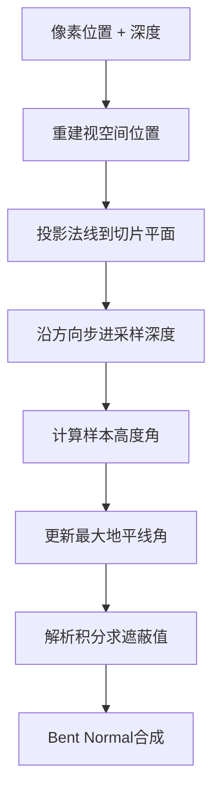

Himalaya采用**Ground-Truth Ambient Occlusion (GTAO)**算法作为环境光遮蔽的核心实现，该算法由Jorge Jimenez等人在2016年提出，通过结构化的地平线搜索配合余弦加权解析积分，在计算效率与物理正确性之间取得了优异的平衡。与经典的SSAO基于蒙特卡洛采样的近似方法不同，GTAO通过分析推导将半球余弦积分转化为可解析求解的形式，在同等采样数量下获得更高质量的遮蔽结果。

## 算法核心原理

### 理论基础：余弦加权遮蔽积分

GTAO的核心洞察是将环境光遮蔽的积分表达式转化为**分段常数可见性函数**下的可解析形式。对于观察方向为**V**、法线为**N**的表面点，环境光遮蔽定义为：

$$A = 1 - \frac{1}{\pi}\int_{\Omega^+} V(\omega) \max(0, \cos\theta) d\omega$$

传统SSAO通过随机采样估算此积分，而GTAO将其投影到由切线方向**T**张成的切片平面上，在每个切片内可见性函数由**地平线角**h描述：

$$V(\gamma) = \begin{cases} 1 & \text{if } |\gamma| \leq h \\ 0 & \text{otherwise} \end{cases}$$

通过余弦加权积分推导，Jimenez给出了切片可见度的解析表达式：

$$V_{slice} = \int_{-h_-}^{h_+} \max(0, \cos(\theta - \gamma)) d\gamma \cdot \frac{1}{\pi}$$

其中h₊和h₋分别表示切片平面两侧的地平线张开角。该积分的解析解封装在`gtao_inner_integral()`函数中，通过三角恒等变换避免了耗时的逐采样点余弦计算。

Sources: [gtao.comp](https://github.com/1PercentSync/himalaya/blob/main/shaders/gtao.comp#L89-L120)

### 结构化地平线搜索

GTAO采用**径向分层采样策略**，将半球搜索空间划分为若干个均匀分布的切片方向，在每个方向上进行步进式地平线高度探测：



实现中采用**二次幂曲线分布采样点**，在切片中心附近密集采样以捕获缝隙和角落的细节，随着距离增加逐步稀疏以控制采样开销。黄金比例分数(0.618...)用于帧间噪声偏移，确保时间性抗锯齿能有效累积不同采样模式的结果。

Sources: [gtao.comp](https://github.com/1PercentSync/himalaya/blob/main/shaders/gtao.comp#L185-L222)

## C++ Pass架构

### GTAOPass类设计

`GTAOPass`遵循Himalaya渲染层的统一设计模式，继承自基础Pass框架，负责管线创建与每帧调度。该类通过Push Descriptor机制绑定输出图像，避免每帧分配描述符集的开销。

核心数据流涉及三类资源读取：从Set 2绑定的`rt_depth_resolved`和`rt_normal_resolved`读取G-Buffer数据，通过Set 3 Push Descriptor写入`ao_noisy`存储图像。计算着色器的参数通过Push Constants传递，包括采样半径、方向数量、每方向步数、薄遮挡物补偿因子和强度系数。

Sources: [gtao_pass.h](https://github.com/1PercentSync/himalaya/blob/main/passes/include/himalaya/passes/gtao_pass.h#L38-L101), [gtao_pass.cpp](https://github.com/1PercentSync/himalaya/blob/main/passes/src/gtao_pass.cpp#L21-L176)

### 资源声明与调度

在`record()`方法中，Pass通过RenderGraph声明对深度、法线和输出图像的读写依赖，由图调度器自动处理资源屏障和布局转换。调度采用8×8的线程组尺寸，Dispatch数量根据输出图像尺寸动态计算。

```cpp
// Dispatch: ceil(width/8) x ceil(height/8)
const uint32_t gx = (ao_image.desc.width + kWorkgroupSize - 1) / kWorkgroupSize;
const uint32_t gy = (ao_image.desc.height + kWorkgroupSize - 1) / kWorkgroupSize;
cmd.dispatch(gx, gy, 1);
```

Sources: [gtao_pass.cpp](https://github.com/1PercentSync/himalaya/blob/main/passes/src/gtao_pass.cpp#L169-L174)

## 计算着色器实现

### 视空间重建

GTAO计算需要视空间（View Space）的位置和法线数据。着色器通过逆投影矩阵将NDC坐标转换回视空间，同时处理Y轴翻转的视口配置（屏幕Y向下增长而NDC Y向上增长）。

```glsl
vec3 reconstruct_view_pos(vec2 uv, float depth) {
    vec2 ndc = vec2(uv.x * 2.0 - 1.0, 1.0 - uv.y * 2.0);
    vec4 clip = vec4(ndc, depth, 1.0);
    vec4 view_h = global.inv_projection * clip;
    return view_h.xyz / view_h.w;
}
```

法线从R10G10B10A2 UNORM编码的G-Buffer中解码后，通过View矩阵旋转到视空间，确保与视空间位置处于同一坐标系。

Sources: [gtao.comp](https://github.com/1PercentSync/himalaya/blob/main/shaders/gtao.comp#L37-L71)

### 屏幕空间半径计算

世界空间采样半径需投影到屏幕空间以确定搜索步长。投影比例因子由视锥体参数决定：

$$r_{screen} = r_{world} \cdot \frac{h_{screen} \cdot \cot(\theta_{fov}/2)}{2 \cdot z_{view}}$$

实现中限制最大屏幕半径为256像素，避免远距离物体产生过度采样开销。

Sources: [gtao.comp](https://github.com/1PercentSync/himalaya/blob/main/shaders/gtao.comp#L174-L180)

### 地平线采样与积分

`horizon_sample()`函数沿搜索方向采集深度样本，计算相对于当前像素视空间位置的仰角，并应用距离衰减函数。衰减采用**平坦内区+陡峭外区**的线性设计：在半径的(1-kFalloffRange)范围内保持全权重，之后线性衰减至边界处归零。0.615的kFalloffRange值源自XeGTAO的自适应优化结果。

对于每个切片方向，算法追踪正负两个方向的最大地平线余弦值，通过`gtao_slice_visibility()`合成最终遮蔽贡献。薄遮挡物补偿(Thin Occluder Compensation)通过后处理混合向切平面上偏，缓解细节几何体造成的过度遮蔽。

Sources: [gtao.comp](https://github.com/1PercentSync/himalaya/blob/main/shaders/gtao.comp#L122-L151), [gtao.comp](https://github.com/1PercentSync/himalaya/blob/main/shaders/gtao.comp#L224-L236)

### Bent Normal计算

GTAO除提供标量AO值外，还计算**Bent Normal**——即未被遮挡的入射光平均方向。该向量可用于更精确的高光遮蔽计算（GTSO）或作为漫反射光照的加权方向。

Bent Normal的推导基于Jimenez论文中的Algorithm 2，通过三角恒等变换将涉及多重角度（3倍角、和差角）的解析积分展开为基本三角函数的代数组合。着色器预计算sin/cos的基础值，然后通过恒等式推导出所有复合角的三角函数值，全程无需额外的sin/cos/acos调用。

Sources: [gtao.comp](https://github.com/1PercentSync/himalaya/blob/main/shaders/gtao.comp#L237-L285)

## 降噪管线

GTAO原始输出包含高频噪声，需要空间与时间维度的联合降噪才能达到生产级质量。Himalaya采用**5×5双边滤波+时域累积**的两阶段降噪架构。

### 空间降噪：边缘保持双边滤波

`AOSpatialPass`执行5×5核的高斯加权双边滤波，核心创新在于**路径累积的边缘权重**计算。传统双边滤波仅比较中心像素与采样像素的深度差异，可能错误地穿过中间存在深度不连续的路径。实现采用图搜索式的权重累积：从中心像素出发，沿水平方向行进至目标列，再沿垂直方向行进至目标行，路径上所有相邻边缘权重的连乘积作为最终混合权重。

```mermaid
graph LR
    subgraph "路径累积示例"
    C[中心像素] -->|h_edge[2,0]| A
    A -->|h_edge[2,1]| B
    B -->|h_edge[2,2]| D[目标列]
    D -->|v_edge[2,tx]| E
    E -->|v_edge[3,tx]| F[目标像素]
    end
```

边缘权重基于线性化深度的相对差异计算，具有场景尺度无关性。5×5高斯核预计算权重存储为常量数组，σ=1.5提供足够的平滑度同时保留细节。

Sources: [ao_spatial_pass.cpp](https://github.com/1PercentSync/himalaya/blob/main/passes/src/ao_spatial_pass.cpp#L21-L164), [ao_spatial.comp](https://github.com/1PercentSync/himalaya/blob/main/shaders/ao_spatial.comp#L29-L65)

### 时域降噪：重投影与拒绝策略

`AOTemporalPass`通过重投影将当前帧像素坐标映射到历史帧，实现时间维度上的样本累积。采用三层拒绝策略处理不可靠的历史数据：

| 层级 | 检测条件 | 处理方式 |
|------|----------|----------|
| UV有效性 | 重投影UV超出[0,1]范围 | 完全拒绝，仅用当前帧 |
| 深度一致性 | 线性化深度相对差异>5% | 识别为遮挡/去遮挡，拒绝历史 |
| 邻域夹紧 | 历史AO超出当前帧3×3邻域min/max | 夹紧到邻域范围 |

Bent Normal(RGB通道)不参与邻域夹紧，因为方向向量的最小/最大值没有物理意义。时域混合系数由应用程序通过Push Constants配置，典型值为0.9表示保留90%历史贡献。

Sources: [ao_temporal_pass.cpp](https://github.com/1PercentSync/himalaya/blob/main/passes/src/ao_temporal_pass.cpp#L21-L222), [ao_temporal.comp](https://github.com/1PercentSync/himalaya/blob/main/shaders/ao_temporal.comp#L35-L135)

## 参数配置与调优

`AOConfig`结构体封装了GTAO运行时的可调参数：

| 参数 | 范围 | 默认值 | 说明 |
|------|------|--------|------|
| radius | 0.05-0.5m | 0.15m | 世界空间采样半径，决定遮蔽范围 |
| directions | 2/4/8 | 4 | 切片方向数，线性影响性能 |
| steps_per_dir | 2/4/8/16 | 4 | 每方向步进数，影响细节质量 |
| thin_compensation | 0.0-0.7 | 0.2 | 薄遮挡物补偿强度，0.7为XeGTAO质量级别 |
| intensity | 0.5-2.0 | 1.0 | AO强度乘数，用于艺术调整 |
| temporal_blend | 0.0-0.98 | 0.9 | 时域混合因子，越高越平滑但延迟越大 |

Directions与steps_per_dir的乘积决定每像素总采样数，默认4×4=16次采样配合时域累积可达到等效64+样本的质量。Radius需根据场景尺度调整——室内场景适合0.1-0.2m，室外场景可增大至0.3-0.5m。

Sources: [scene_data.h](https://github.com/1PercentSync/himalaya/blob/main/framework/include/himalaya/framework/scene_data.h#L224-L245), [application.h](https://github.com/1PercentSync/himalaya/blob/main/app/include/himalaya/app/application.h#L188-L197)

## 系统集成

GTAO Pass在渲染管线中的位置由[Render Graph资源管理](https://github.com/1PercentSync/himalaya/blob/main/12-render-graphzi-yuan-guan-li)系统调度，依赖深度预渲染Pass和天空盒Pass完成后才能执行，确保深度和法线G-Buffer已准备就绪。输出`ao_noisy`经空间和时域降噪后，通过Set 2绑定3提供给前向渲染Pass的`forward.frag`进行光照计算。

材质系统支持两种高光遮蔽模式：基于Bent Normal锥体相交测试的GTSO(Ground-Truth Specular Occlusion)，或Lagarde近似公式。模式选择通过`global.ao_so_mode`传递给着色器，由`AOConfig.use_gtso`控制。

相关文档：[Pass系统概述](https://github.com/1PercentSync/himalaya/blob/main/16-passxi-tong-gai-shu), [时域降噪Pass](https://github.com/1PercentSync/himalaya/blob/main/23-shi-yu-jiang-zao-pass), [深度预渲染Pass](https://github.com/1PercentSync/himalaya/blob/main/17-shen-du-yu-xuan-ran-pass), [前向渲染Pass](https://github.com/1PercentSync/himalaya/blob/main/18-qian-xiang-xuan-ran-pass)