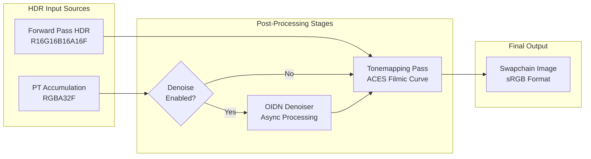
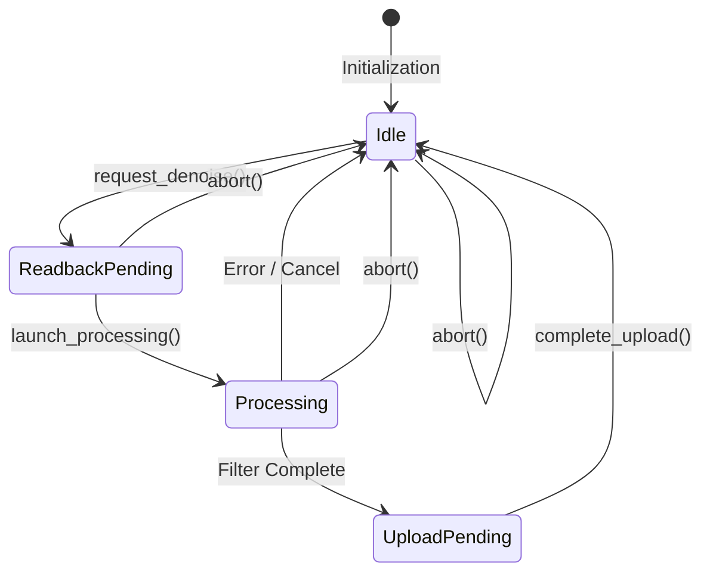
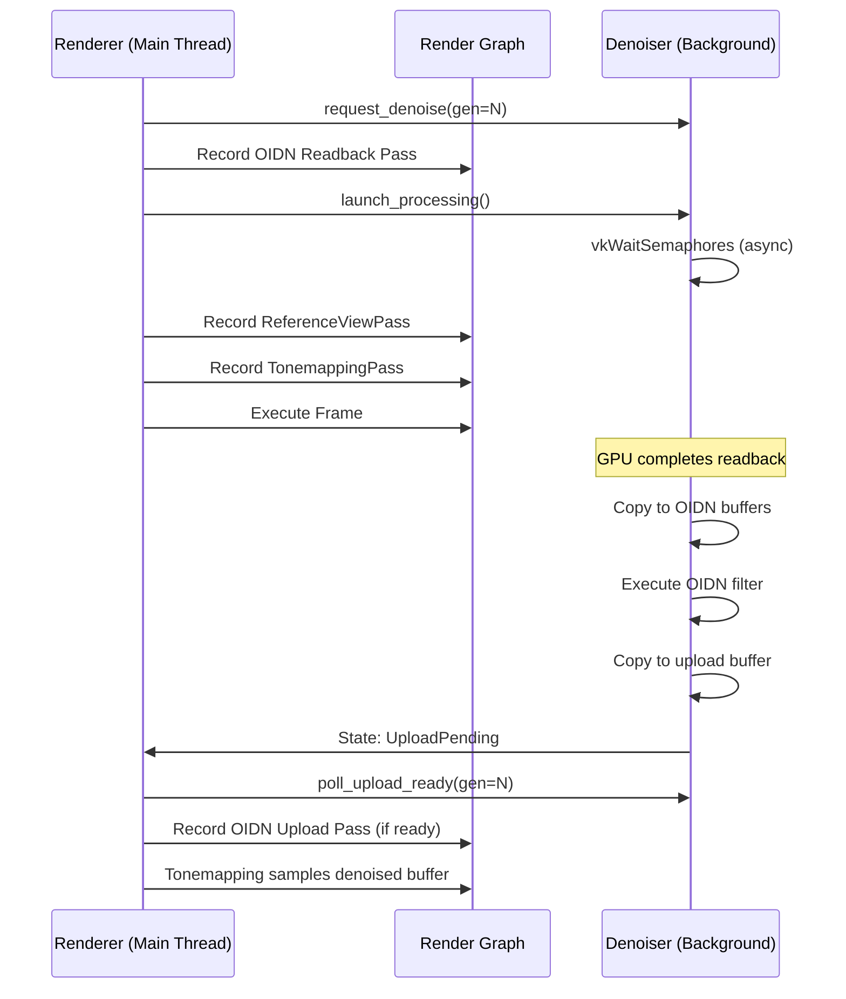

The post-processing pipeline in Himalaya represents the final stage of the rendering process, transforming high dynamic range (HDR) render targets into displayable low dynamic range (LDR) output while providing quality enhancement through temporal accumulation denoising for path tracing. This pipeline operates as a **Layer 2 — Render Passes** component, consuming the intermediate products generated by preceding passes and producing the final swapchain image.

The pipeline consists of two primary subsystems: the **Tonemapping Pass** which handles HDR-to-LDR conversion with exposure control and filmic tone curves, and the **OIDN Denoiser** which provides asynchronous AI-powered denoising for path tracing output. These components work together to deliver visually compelling final frames while maintaining real-time interactivity.

Sources: [tonemapping_pass.h](https://github.com/1PercentSync/himalaya/blob/main/passes/include/himalaya/passes/tonemapping_pass.h#L1-L107), [denoiser.h](https://github.com/1PercentSync/himalaya/blob/main/framework/include/himalaya/framework/denoiser.h#L1-L229)

## Architecture Overview

The post-processing pipeline follows a data-flow architecture where HDR color buffers from either the rasterization forward pass or the path tracing accumulation buffer serve as input, flowing through optional denoising stages before final tone mapping and presentation.



The architecture separates concerns cleanly: the **TonemappingPass** is a lightweight synchronous graphics pass that runs every frame, while the **Denoiser** operates asynchronously on a background thread with explicit synchronization points through Vulkan timeline semaphores. This design ensures that denoising never blocks the main rendering thread, maintaining consistent frame times even when processing high-resolution path tracing output.

Sources: [renderer_pt.cpp](https://github.com/1PercentSync/himalaya/blob/main/app/src/renderer_pt.cpp#L1-L316), [renderer_rasterization.cpp](https://github.com/1PercentSync/himalaya/blob/main/app/src/renderer_rasterization.cpp#L200-L368)

## Tonemapping Pass

The **TonemappingPass** implements the final color transformation step, converting linear HDR values into displayable sRGB output using the industry-standard **ACES filmic tone mapping curve**. This pass operates as a fullscreen post-processing effect using a single triangle that covers the entire viewport without requiring vertex buffer bindings.

### Technical Implementation

The pass employs a **fullscreen triangle technique** where the vertex shader generates clip-space positions directly from `gl_VertexIndex`, eliminating the need for vertex data. The fragment shader samples the HDR color buffer through Set 2 binding 0 (`rt_hdr_color`), applies exposure scaling from the GlobalUBO, then maps the result through the ACES filmic curve. The swapchain's sRGB format handles automatic gamma conversion, keeping the shader linear throughout.

```mermaid
flowchart TB
    subgraph Vertex["Vertex Stage (fullscreen.vert)"]
        V1[gl_VertexIndex 0,1,2]
        V2[Generate UV: vec2((gl_VertexIndex << 1) & 2, gl_VertexIndex & 2)]
        V3[Position: vec4(out_uv * 2.0 - 1.0, 0.0, 1.0)]
    end
    
    subgraph Fragment["Fragment Stage (tonemapping.frag)"]
        F1[Sample HDR: texture(rt_hdr_color, in_uv)]
        F2{Debug Mode?}
        F3[Apply Exposure: hdr * global.camera_position_and_exposure.w]
        F4[ACES Tonemap: (x * (2.51*x + 0.03)) / (x * (2.43*x + 0.59) + 0.14)]
        F5[Passthrough: hdr unchanged]
    end
    
    V3 --> F1
    F1 --> F2
    F2 -->|No| F3
    F3 --> F4
    F2 -->|Yes| F5
```

The ACES curve implementation uses the **Narkowicz 2015 fit**, a computationally efficient approximation of the full ACES reference transform that maps HDR values [0, ∞) to LDR [0, 1] while preserving shadow detail and compressing highlights with a pleasing S-curve characteristic. The curve parameters (a=2.51, b=0.03, c=2.43, d=0.59, e=0.14) are hardcoded as they represent a standardized filmic response.

Sources: [tonemapping.frag](https://github.com/1PercentSync/himalaya/blob/main/shaders/tonemapping.frag#L1-L48), [fullscreen.vert](https://github.com/1PercentSync/himalaya/blob/main/shaders/fullscreen.vert#L1-L24), [tonemapping_pass.cpp](https://github.com/1PercentSync/himalaya/blob/main/passes/src/tonemapping_pass.cpp#L1-L164)

### Pipeline Configuration

The TonemappingPass creates a graphics pipeline with specific characteristics optimized for post-processing:

| Configuration Parameter | Value | Rationale |
|------------------------|-------|-----------|
| Color Format | Swapchain format | Matches presentation surface |
| Depth Format | `VK_FORMAT_UNDEFINED` | No depth testing needed |
| Sample Count | 1 | Always processes resolved output |
| Vertex Input | None | Generated procedurally |
| Cull Mode | None | Triangle extends beyond viewport |
| Depth Test | Disabled | Pure color operation |

The pipeline binds three descriptor sets during execution: Set 0 for global uniforms (exposure value), Set 1 for bindless texture arrays, and Set 2 for the HDR color render target. No push constants are required, keeping the command buffer recording minimal.

Sources: [tonemapping_pass.cpp](https://github.com/1PercentSync/himalaya/blob/main/passes/src/tonemapping_pass.cpp#L45-L80)

## OIDN Denoiser

The **Denoiser** class provides AI-powered noise reduction for path tracing output using Intel's **Open Image Denoise (OIDN)** library. This integration operates entirely asynchronously, ensuring that denoising computations never stall the main rendering thread.

### Asynchronous Processing Architecture

The denoiser implements a **state machine** with four distinct phases that coordinate between the main thread and a background worker thread:



The workflow begins when the renderer calls `request_denoise()`, transitioning from **Idle** to **ReadbackPending**. The renderer then records a render graph pass that copies the accumulation buffer, albedo, and normal images to CPU-accessible staging buffers. After submission, `launch_processing()` spawns a `std::jthread` that waits on a Vulkan timeline semaphore, copies data to OIDN device buffers, executes the filter, and copies results back to a staging buffer for upload.

Sources: [denoiser.h](https://github.com/1PercentSync/himalaya/blob/main/framework/include/himalaya/framework/denoiser.h#L50-L120), [denoiser.cpp](https://github.com/1PercentSync/himalaya/blob/main/framework/src/denoiser.cpp#L1-L200)

### Buffer Management and Synchronization

The denoiser manages **four persistent staging buffers** through Vulkan Memory Allocator:

| Buffer | Format | Size | Purpose |
|--------|--------|------|---------|
| Beauty Readback | RGBA32F | width × height × 16 bytes | PT accumulation color |
| Albedo Readback | RGBA16F | width × height × 8 bytes | Surface albedo (auxiliary) |
| Normal Readback | RGBA16F | width × height × 8 bytes | Surface normals (auxiliary) |
| Upload | RGBA32F | width × height × 16 bytes | Denoised output |

Buffer memory uses VMA's `GpuToCpu` and `CpuToGpu` usage patterns with persistent mapping, eliminating per-frame allocation overhead. Cache coherency is maintained through explicit `vmaInvalidateAllocation()` calls after GPU writes and `vmaFlushAllocation()` before GPU reads, ensuring correct behavior on non-coherent memory architectures like AMD discrete GPUs.

Timeline semaphore synchronization ensures the background thread only begins processing after the GPU completes readback copies. The semaphore signal value increments with each denoise request, and the thread waits with a bounded timeout to remain responsive to cancellation requests.

Sources: [denoiser.cpp](https://github.com/1PercentSync/himalaya/blob/main/framework/src/denoiser.cpp#L50-L150), [denoiser.cpp](https://github.com/1PercentSync/himalaya/blob/main/framework/src/denoiser.cpp#L300-L372)

### OIDN Filter Configuration

The denoiser configures OIDN's **RT (Ray Tracing) filter** with albedo and normal auxiliary buffers, which significantly improves denoising quality by providing geometric and material context:

```cpp
oidn::FilterRef filter = device.newFilter("RT");
filter.set("hdr", true);           // Input is HDR linear values
filter.set("cleanAux", true);      // Albedo/normal are noise-free
filter.set("quality", oidn::Quality::High);
```

The **HDR flag** indicates linear luminance values requiring tone-agnostic processing, while **cleanAux** informs OIDN that the albedo and normal buffers contain no Monte Carlo noise (they're written directly by the primary ray hit shader). The filter operates on three-channel images with explicit byte stride parameters to handle the four-channel Vulkan buffers.

Sources: [denoiser.cpp](https://github.com/1PercentSync/himalaya/blob/main/framework/src/denoiser.cpp#L55-L75)

## Integration with Render Paths

The post-processing pipeline integrates differently into the **rasterization** and **path tracing** render paths, reflecting their distinct output characteristics.

### Rasterization Path

In rasterization mode, the TonemappingPass directly consumes the HDR color buffer produced by the ForwardPass. No denoising is performed since rasterization produces noise-free output. The render graph construction is straightforward:

```cpp
// Simplified rasterization pipeline
frame_ctx.hdr_color = hdr_color_resource;  // From ForwardPass
tonemapping_pass_.record(render_graph_, frame_ctx);
```

The HDR buffer uses `R16G16B16A16F` format with values typically in a controlled range, making the exposure and tonemapping transformation the primary concern.

Sources: [renderer_rasterization.cpp](https://github.com/1PercentSync/himalaya/blob/main/app/src/renderer_rasterization.cpp#L320-L340)

### Path Tracing Path

The path tracing integration is more complex due to **temporal accumulation** and **asynchronous denoising**. The renderer maintains an accumulation generation counter that increments on camera movement, parameter changes, or manual reset. This generation tracking enables staleness detection—if the generation changes between denoise request and upload completion, the result is discarded.



The TonemappingPass source selection depends on denoiser state: when `show_denoised_` is true and valid denoised output exists (or upload was just recorded), the pass samples from the denoised buffer; otherwise it samples directly from the raw accumulation buffer. This enables real-time toggling between noisy and denoised views for quality comparison.

Sources: [renderer_pt.cpp](https://github.com/1PercentSync/himalaya/blob/main/app/src/renderer_pt.cpp#L1-L200), [renderer_pt.cpp](https://github.com/1PercentSync/himalaya/blob/main/app/src/renderer_pt.cpp#L200-L316)

## Configuration and Control

The post-processing pipeline exposes several runtime parameters through the renderer interface:

| Parameter | Type | Default | Description |
|-----------|------|---------|-------------|
| `denoise_enabled` | bool | true | Master denoising toggle |
| `show_denoised` | bool | true | Display denoised vs raw accumulation |
| `auto_denoise` | bool | true | Automatic trigger on sample intervals |
| `auto_denoise_interval` | uint32 | 64 | Samples between auto-denoise triggers |
| `exposure` | float | 1.0 | Linear exposure multiplier (pow(2, EV)) |

The **auto-denoise** feature triggers denoising automatically every N accumulated samples, providing progressive quality improvement during static camera views. Manual denoising can be requested through `request_manual_denoise()` for on-demand quality snapshots. The exposure value is stored in the GlobalUBO's `camera_position_and_exposure.w` component and applied in the tonemapping shader before the ACES curve.

Sources: [renderer.h](https://github.com/1PercentSync/himalaya/blob/main/app/include/himalaya/app/renderer.h#L280-L320), [tonemapping.frag](https://github.com/1PercentSync/himalaya/blob/main/shaders/tonemapping.frag#L40-L48)

## Shader Bindings and Data Flow

The post-processing pipeline relies on specific descriptor set bindings defined in the common shader library:

**Set 2 — Render Target Intermediate Products** (bindings.glsl):
- `binding = 0`: `rt_hdr_color` — HDR color input (TonemappingPass source)
- `binding = 1`: `rt_depth_resolved` — Resolved depth buffer
- `binding = 2`: `rt_normal_resolved` — Resolved normal buffer
- `binding = 3`: `rt_ao_texture` — Ambient occlusion result
- `binding = 4`: `rt_contact_shadow_mask` — Contact shadow mask

The TonemappingPass updates Set 2 binding 0 each frame to point to either the raw accumulation buffer or the denoised buffer, depending on configuration. This dynamic binding allows the same shader and pipeline to handle both paths without pipeline recreation.

**Set 0 — GlobalUBO** provides the exposure value at offset 256 (xyz = camera position, w = exposure) and debug render mode at offset 320. When debug mode is ≥ 4 (passthrough modes), the tonemapping shader bypasses exposure scaling and ACES transformation, outputting raw HDR values directly for material property visualization.

Sources: [bindings.glsl](https://github.com/1PercentSync/himalaya/blob/main/shaders/common/bindings.glsl#L1-L205)

## Performance Considerations

The post-processing pipeline is designed for minimal overhead on the main rendering thread:

**TonemappingPass**: Approximately 0.1-0.2ms GPU time for 1080p-4K resolutions. The fullscreen triangle generates minimal vertex workload, and the simple ALU operations in the fragment shader are memory-bandwidth bound on reading the HDR texture.

**OIDN Denoiser**: Background thread execution time varies by device type—GPU implementations (CUDA/HIP/SYCL) typically process 1080p frames in 10-50ms, while CPU fallback may require 500ms+. The asynchronous design ensures these latencies don't affect frame pacing, though rapid camera movement can outpace denoising, temporarily showing noisy accumulation.

Memory footprint includes the four staging buffers (approximately 40MB for 1080p RGBA32F beauty + RGBA16F auxiliaries) plus OIDN internal buffers. The denoised output buffer adds another 16MB for 1080p, making the total post-processing memory overhead approximately 60-80MB depending on resolution.

Sources: [denoiser.cpp](https://github.com/1PercentSync/himalaya/blob/main/framework/src/denoiser.cpp#L1-L50), [denoiser.h](https://github.com/1PercentSync/himalaya/blob/main/framework/include/himalaya/framework/denoiser.h#L1-L50)

## Related Documentation

- [Path Tracing Reference View](https://github.com/1PercentSync/himalaya/blob/main/21-path-tracing-reference-view) — The render pass producing accumulation buffers consumed by denoising
- [Forward Rendering](https://github.com/1PercentSync/himalaya/blob/main/18-depth-prepass-and-forward-rendering) — HDR output source for rasterization path
- [Render Graph System](https://github.com/1PercentSync/himalaya/blob/main/12-render-graph-system) — Orchestration framework for pass dependencies and resource transitions
- [Common Shader Library](https://github.com/1PercentSync/himalaya/blob/main/27-common-shader-library-brdf-bindings) — Binding definitions and shared structures