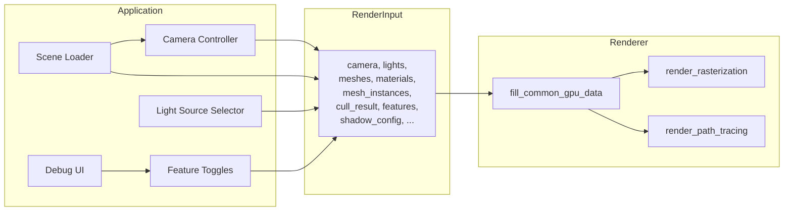
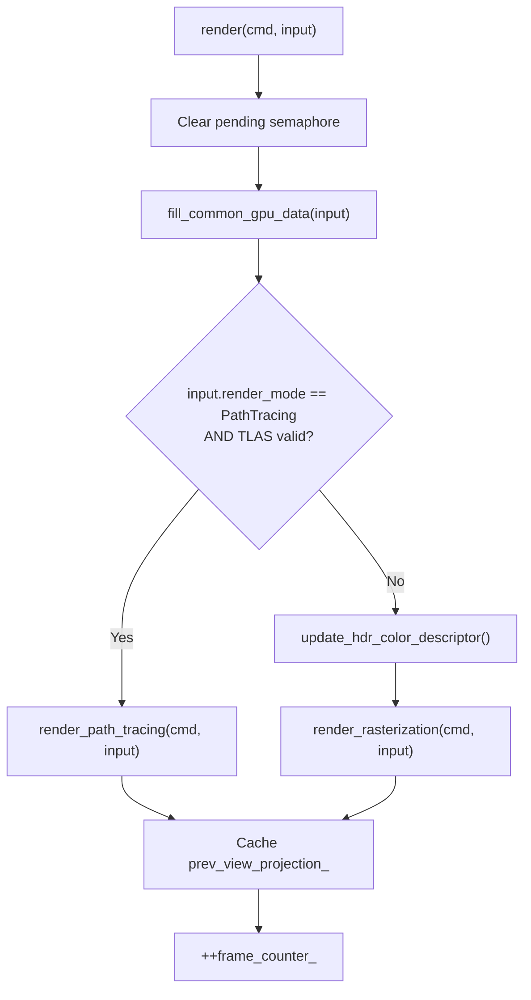
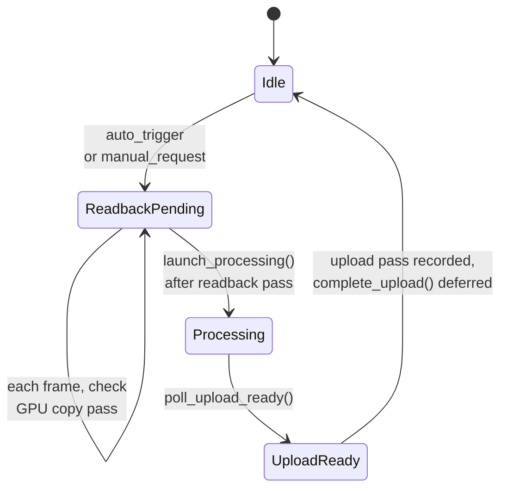

The **Renderer** class is the application layer's central rendering subsystem — the bridge between scene data produced by [Scene Loader](https://github.com/1PercentSync/himalaya/blob/main/23-scene-loader-gltf-loading-texture-processing-and-bc-compression) and the GPU pipeline orchestrated by the [Render Graph](https://github.com/1PercentSync/himalaya/blob/main/9-render-graph-automatic-barrier-insertion-and-pass-orchestration). Each frame, the Application assembles a `RenderInput` struct carrying camera state, frustum culling results, lights, and feature toggles, then calls `Renderer::render()`. Inside, the Renderer fills per-frame GPU buffers (UBO, light SSBO, instance SSBO) and dispatches into one of two mutually exclusive render paths: **rasterization** (multi-pass forward pipeline with shadows, AO, and contact shadows) or **path tracing** (RT reference view with progressive accumulation and OIDN denoising). This page walks through the full frame lifecycle — from the data contract, through GPU data upload, to the branching logic that selects and executes each path.

Sources: [renderer.h](https://github.com/1PercentSync/himalaya/blob/main/app/include/himalaya/app/renderer.h#L1-L7), [renderer.cpp](https://github.com/1PercentSync/himalaya/blob/main/app/src/renderer.cpp#L1-L4)

## The RenderInput Data Contract

The `RenderInput` struct defines the **semantic boundary** between the Application and the Renderer. It carries no GPU resources — only scene-level data and configuration. The Application fills it every frame in `Application::render()`, constructing it from the scene loader's meshes, materials, and mesh instances, the camera controller's current state, and the debug UI's feature toggles.

The struct's key fields fall into four categories: **frame identity** (`image_index`, `frame_index`, `render_mode`), **scene data** (`meshes`, `materials`, `mesh_instances`, `cull_result`, `lights`), **IBL parameters** (`ibl_intensity`, `ibl_rotation_sin/cos`, `exposure`), and **rendering configuration** (`features`, `shadow_config`, `ao_config`, `contact_shadow_config`). All references are non-owning — the Application guarantees pointer stability for the duration of the frame.

Sources: [renderer.h](https://github.com/1PercentSync/himalaya/blob/main/app/include/himalaya/app/renderer.h#L52-L116), [application.cpp](https://github.com/1PercentSync/himalaya/blob/main/app/src/application.cpp#L549-L576)

## GPU Data Fill — The Shared Preamble

Both render paths share a common first step: `fill_common_gpu_data()`. This function writes three per-frame GPU buffers that every pass consumes:

| Buffer | Set/Binding | Memory Type | Purpose |
|--------|-------------|-------------|---------|
| **GlobalUBO** | Set 0, Binding 0 | CpuToGpu | Camera matrices, IBL indices, shadow cascades, feature flags |
| **Light SSBO** | Set 0, Binding 1 | CpuToGpu | Directional light direction, color, intensity, shadow flag |
| **Instance SSBO** | Set 0, Binding 3 | CpuToGpu | Per-instance model matrix, normal matrix, material index |

The **GlobalUBO** (`GlobalUniformData`, 928 bytes std140) is the single largest data upload. It packs 58 × 16-byte aligned fields including four camera matrices, shadow cascade VP matrices for up to 4 cascades, IBL bindless indices, PCSS parameters, and temporal reprojection data. Feature flags are packed as a bitmask — bit 0 for shadows, bit 1 for AO, bit 2 for contact shadows — consumed by the forward shader's `#define`-gated code paths.

The **Light SSBO** supports up to `kMaxDirectionalLights = 1` directional light, stored as two `vec4` values (direction+intensity, color+shadow). The **Instance SSBO** holds up to 65,536 instances at 128 bytes each (8 MB per frame), pre-filling the normal matrix as three `vec4` columns to avoid per-vertex `mat3` inversion in the shader.

Shadow cascade computation is also performed here — `compute_shadow_cascades()` runs the PSSM split strategy, texel snapping, and per-cascade PCSS parameter derivation, writing the results into the UBO's cascade fields.

Sources: [renderer.cpp](https://github.com/1PercentSync/himalaya/blob/main/app/src/renderer.cpp#L27-L148), [scene_data.h](https://github.com/1PercentSync/himalaya/blob/main/framework/include/himalaya/framework/scene_data.h#L267-L319), [scene_data.h](https://github.com/1PercentSync/himalaya/blob/main/framework/include/himalaya/framework/scene_data.h#L326-L364)

## Frame Dispatch — The render() Entry Point

The `render()` method is the Renderer's sole per-frame entry point. Its logic is intentionally minimal — a three-step sequence that delegates all complexity to the shared preamble and the selected path:

The **path tracing guard** at the branch point is critical: even if the user selects `RenderMode::PathTracing`, the Renderer falls back to rasterization when no valid TLAS exists (degenerate scene, unloaded scene, or hardware without RT support). This prevents a hard crash and provides a graceful degradation path.

After the render path returns, the Renderer caches the current view-projection matrix for the next frame's temporal reprojection and increments the frame counter for temporal noise variation.

Sources: [renderer.cpp](https://github.com/1PercentSync/himalaya/blob/main/app/src/renderer.cpp#L152-L171)

## The Rasterization Path — Multi-Pass Forward Pipeline

The rasterization path in `render_rasterization()` executes the full multi-pass pipeline. Before touching the render graph, it performs significant CPU-side work: **draw group construction** and **per-cascade shadow culling**.

### Draw Group Construction

Visible opaque instances from frustum culling are sorted by the triple key `(mesh_id, alpha_mode, double_sided)` and then grouped into contiguous runs. Each group becomes a `MeshDrawGroup` — a single `vkCmdDrawIndexed` call that draws multiple instances of the same mesh. The sorting enables **instanced rendering**: all instances sharing a mesh are batched into one draw call regardless of material, with the material index stored per-instance in the SSBO. Mask materials (alpha test) are separated into a distinct list so the depth prepass can enable the alpha-test fragment shader variant only for those groups.

The `build_draw_groups()` function fills the Instance SSBO while grouping — for each instance it writes the model matrix, precomputed normal matrix (`transpose(inverse(mat3(model)))`), and material buffer offset. This avoids `kMaxInstances × mat3_inverse` per vertex in the shader.

Sources: [renderer_rasterization.cpp](https://github.com/1PercentSync/himalaya/blob/main/app/src/renderer_rasterization.cpp#L35-L128)

### Per-Cascade Shadow Frustum Culling

For each active shadow cascade, the Renderer extracts a frustum from the cascade's light-space VP matrix, culls all mesh instances against it, filters out alpha-blended instances, sorts the remainder by the same triple key, and builds per-cascade shadow draw groups. These groups share the same Instance SSBO memory (offsets continue from where the camera groups left off) but use the simpler `compute_normal_matrix = false` variant since the shadow pass doesn't need normal matrices.

Sources: [renderer_rasterization.cpp](https://github.com/1PercentSync/himalaya/blob/main/app/src/renderer_rasterization.cpp#L151-L206)

### Render Graph Construction

With draw groups and GPU buffers ready, the Renderer constructs the frame's render graph. The pass recording order matters because the render graph uses it (plus declared resource access) to insert barriers:

| Order | Pass | Key Resources |
|-------|------|---------------|
| 1 | Shadow Pass | Shadow map (D32Sfloat 2D array), per-cascade draw groups |
| 2 | Depth Prepass | Depth buffer, normal buffer, roughness buffer |
| 3 | GTAO Pass | AO noisy → AO blurred → AO filtered (temporal) |
| 4 | Contact Shadows Pass | Contact shadow mask (R8) |
| 5 | Forward Pass | HDR color buffer (R16G16B16A16F) |
| 6 | Skybox Pass | HDR color buffer (additive blend) |
| 7 | Tonemapping Pass | HDR color → Swapchain |
| 8 | ImGui Pass | Swapchain (color attachment, LOAD_OP_LOAD) |

Each pass is conditionally recorded — shadow pass only when shadows are active, AO passes only when the AO feature is enabled, contact shadows only when both the feature and lights exist. The `FrameContext` struct carries all resource IDs and non-owning scene references to each pass's `record()` method.

Sources: [renderer_rasterization.cpp](https://github.com/1PercentSync/himalaya/blob/main/app/src/renderer_rasterization.cpp#L219-L366)

## The Path Tracing Path — Accumulation and Denoising

The path tracing path is architecturally simpler on the render graph side — it records at most four passes — but carries significant state management complexity around **progressive accumulation**, **change detection**, and **asynchronous OIDN denoising**.

### Accumulation Reset Detection

Before recording any passes, the Renderer compares the current frame's camera VP, IBL rotation, light parameters, bounce depth, and clamp threshold against cached previous-frame values. Any change triggers `reset_pt_accumulation()`, which resets the sample counter, increments the `accumulation_generation_` counter, and invalidates the denoised buffer. This ensures the accumulation buffer starts fresh whenever the scene or rendering parameters change.

Sources: [renderer_pt.cpp](https://github.com/1PercentSync/himalaya/blob/main/app/src/renderer_pt.cpp#L68-L95), [renderer.cpp](https://github.com/1PercentSync/himalaya/blob/main/app/src/renderer.cpp#L220-L227)

### Denoise Orchestration

The OIDN denoiser operates asynchronously on the CPU with a multi-stage lifecycle:

The Renderer guards denoise triggers with a minimum sample interval (`auto_denoise_interval_`, default 64 samples). When triggered, it records a **readback pass** that copies the accumulation, albedo, and normal auxiliary images into staging buffers. The denoiser's `launch_processing()` returns a timeline semaphore signal that the Application injects into the frame's queue submit. On the next frame, the Renderer records an **upload pass** that copies the denoised result back to a GPU image. The `complete_upload()` call is deferred one more frame (the GPU hasn't executed the upload pass yet at record time), creating a 3-frame pipeline: trigger → readback+process → upload → complete.

Sources: [renderer_pt.cpp](https://github.com/1PercentSync/himalaya/blob/main/app/src/renderer_pt.cpp#L97-L178)

### Tonemapping Input Selection

The path tracing path reuses the tonemapping pass from rasterization, but its input source varies dynamically. The tonemapping pass reads from whichever image the Renderer sets as `frame_ctx.hdr_color`. The selection logic:

- **Default**: PT accumulation buffer (raw samples, progressive convergence visible)
- **Denoised display**: If `show_denoised_` is enabled and a valid denoised buffer exists for the current generation, the denoised image replaces the accumulation buffer as the tonemapping source
- **Upload-in-progress**: Even if the denoised buffer was uploaded this very frame, it's safe to display because the render graph's barrier system ensures the upload completes before tonemapping reads

Sources: [renderer_pt.cpp](https://github.com/1PercentSync/himalaya/blob/main/app/src/renderer_pt.cpp#L168-L183)

### Pass Recording Order (Path Tracing)

| Order | Pass | Notes |
|-------|------|-------|
| 1 | Reference View Pass | RT dispatch, accumulation, aux output |
| 2 | OIDN Readback | Conditional: copies beauty/albedo/normal to staging |
| 3 | OIDN Upload | Conditional: copies denoised result to GPU image |
| 4 | Tonemapping | Same pass as rasterization, different input source |
| 5 | ImGui | Same overlay pass as rasterization |

The Reference View Pass is conditionally skipped when `target_samples_` is reached (non-zero and sample count ≥ target), freezing the accumulation for stable display.

Sources: [renderer_pt.cpp](https://github.com/1PercentSync/himalaya/blob/main/app/src/renderer_pt.cpp#L186-L301)

## Architectural Comparison: Rasterization vs Path Tracing

The two paths differ fundamentally in their resource usage, CPU workload, and temporal behavior:

| Dimension | Rasterization | Path Tracing |
|-----------|---------------|--------------|
| **GPU pipeline** | Graphics (raster) | Ray tracing (compute-like) |
| **Per-frame GPU cost** | Constant (N draw calls) | Constant (1 dispatch, accumulates) |
| **CPU draw group work** | Full sort + group per cascade | None (RT handles instancing) |
| **Instance SSBO fill** | 65K instances × 128 bytes | Not used |
| **Temporal state** | `prev_view_projection_` (AO reprojection) | Full VP/rotation/light/bounce cache |
| **Managed images** | 10+ (HDR, depth, normal, AO×3, contact, roughness, MSAA×4) | 4 (accumulation, aux albedo, aux normal, denoised) |
| **Denoising** | GTAO spatial + temporal (in-pipeline) | OIDN async (CPU-side, multi-frame) |
| **Accumulation** | None (single-frame) | Progressive averaging (N samples) |
| **TLAS requirement** | Not needed | Required (falls back to raster if missing) |

The shared infrastructure — `fill_common_gpu_data()`, the render graph, the tonemapping pass, and the ImGui overlay — means both paths use the same UBO layout, the same descriptor sets (Set 0/1/2), and the same swapchain presentation logic. Only the **middle** of the frame differs: rasterization runs a multi-pass pipeline; path tracing runs a single RT dispatch with accumulation.

Sources: [renderer.h](https://github.com/1PercentSync/himalaya/blob/main/app/include/himalaya/app/renderer.h#L129-L200), [renderer_rasterization.cpp](https://github.com/1PercentSync/himalaya/blob/main/app/src/renderer_rasterization.cpp#L1-L4), [renderer_pt.cpp](https://github.com/1PercentSync/himalaya/blob/main/app/src/renderer_pt.cpp#L1-L4)

## The FrameContext — Renderer-to-Pass Communication

While `RenderInput` carries data from Application to Renderer, `FrameContext` carries data from Renderer to individual passes. It bridges the render graph's resource ID system with the scene data needed for draw calls. The Renderer constructs a `FrameContext` each frame after building draw groups and declaring managed images, then passes it to each pass's `record()` method.

The struct contains: render graph resource IDs (swapchain, HDR color, depth, AO buffers, etc.), non-owning spans to meshes/materials/mesh_instances, draw group spans (opaque and mask), per-cascade shadow draw group arrays, configuration pointers (features, shadow config, AO config), and frame parameters (frame index, frame number, sample count). Passes access it read-only — they record GPU commands but never modify the context.

Sources: [frame_context.h](https://github.com/1PercentSync/himalaya/blob/main/framework/include/himalaya/framework/frame_context.h#L1-L150)

## Resource Initialization and Lifecycle

The Renderer's `init()` method (in `renderer_init.cpp`) is a ~450-line sequence that creates all persistent resources. The key initialization phases, in order:

1. **Render graph setup** — creates managed images for all render targets (HDR color, depth, normal, AO stages, contact shadows, roughness, PT buffers)
2. **Per-frame buffers** — GlobalUBO, Light SSBO, Instance SSBO (2 sets each for double-buffering)
3. **Samplers** — default (linear/repeat/aniso), shadow comparison (linear/clamp/compare), shadow depth (nearest/clamp), nearest clamp, linear clamp
4. **Default textures** — 1×1 white, flat normal, black (for bindless fallback)
5. **PT sampling resources** — blue noise texture (128×128 R8Unorm), Sobol direction SSBO
6. **IBL precomputation** — equirect→cubemap, irradiance, prefilter, BRDF LUT
7. **Pass setup** — each pass's `setup()` call creates its pipeline and pipeline layout
8. **RT acceleration structure** — AS manager initialized if hardware supports RT
9. **Set 2 descriptor writes** — initial bindings for all per-frame sampled images

Destruction follows reverse initialization order. Managed images are destroyed through the render graph, buffers and samplers through the resource manager, and passes through their own `destroy()` methods.

Sources: [renderer_init.cpp](https://github.com/1PercentSync/himalaya/blob/main/app/src/renderer_init.cpp#L27-L450), [renderer_init.cpp](https://github.com/1PercentSync/himalaya/blob/main/app/src/renderer_init.cpp#L452-L530)

## What to Read Next

- **[Render Graph](https://github.com/1PercentSync/himalaya/blob/main/9-render-graph-automatic-barrier-insertion-and-pass-orchestration)** — How managed images, resource barriers, and pass compilation work under the hood
- **[Material System](https://github.com/1PercentSync/himalaya/blob/main/10-material-system-gpu-data-layout-and-bindless-texture-indexing)** — The SSBO layout that the Instance SSBO's `material_index` references into
- **[Depth Prepass](https://github.com/1PercentSync/himalaya/blob/main/16-depth-prepass-z-fill-for-zero-overdraw-forward-rendering)** and **[Forward Pass](https://github.com/1PercentSync/himalaya/blob/main/17-forward-pass-cook-torrance-pbr-ibl-split-sum-and-multi-bounce-ao)** — The two largest consumers of draw groups in the rasterization path
- **[Path Tracing Shaders](https://github.com/1PercentSync/himalaya/blob/main/26-path-tracing-shaders-ray-generation-closest-hit-and-miss-shaders)** — The RT shader pipeline that the Reference View Pass dispatches
- **[Debug UI](https://github.com/1PercentSync/himalaya/blob/main/24-debug-ui-imgui-panels-and-runtime-parameter-tuning)** — How feature toggles and PT parameters are exposed to the user