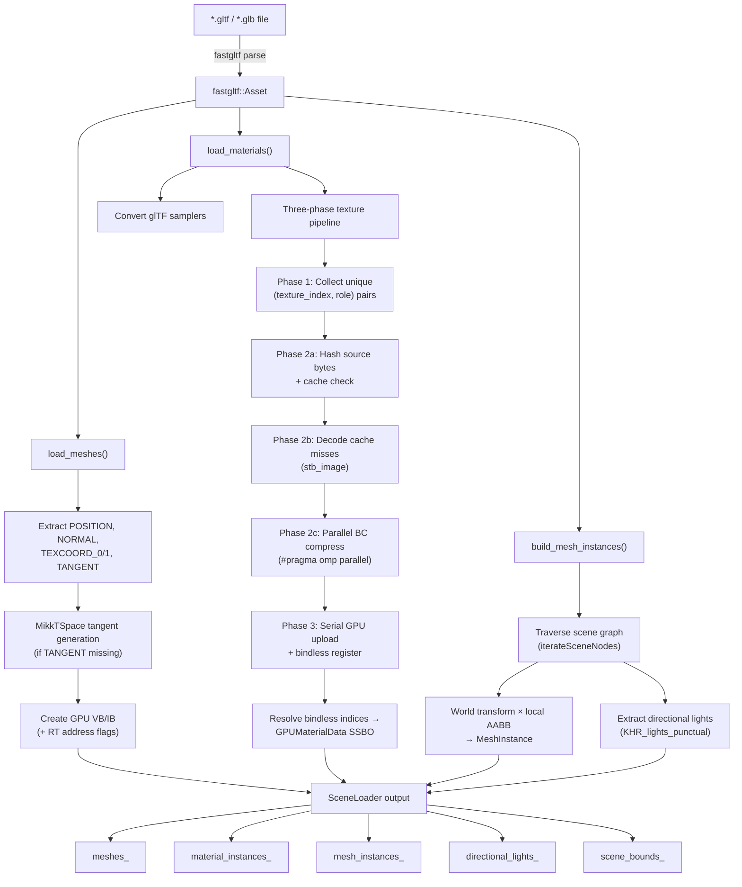

The **SceneLoader** is the application layer's single entry point for transforming a glTF file on disk into a fully GPU-resident scene. It orchestrates three distinct subsystems — geometry extraction, texture compression with disk caching, and scene graph traversal — and presents the results as flat arrays of `Mesh`, `MaterialInstance`, and `MeshInstance` objects that the renderer consumes without modification. This page traces the complete data flow from `.gltf` parse to GPU-ready resources, with particular emphasis on the three-phase texture pipeline that parallelizes BC compression via OpenMP.

Sources: [scene_loader.h](https://github.com/1PercentSync/himalaya/blob/main/app/include/himalaya/app/scene_loader.h#L1-L170), [scene_loader.cpp](https://github.com/1PercentSync/himalaya/blob/main/app/src/scene_loader.cpp#L1-L746)

## Architecture Overview

The scene loader sits at the boundary between the **fastgltf** parsing library and the engine's own RHI/framework layers. It owns every GPU resource it creates — vertex buffers, index buffers, texture images, samplers, and bindless descriptor slots — and releases them all in `destroy()`, enabling safe scene switching at runtime.



Sources: [scene_loader.cpp#L219-L270](https://github.com/1PercentSync/himalaya/blob/main/app/src/scene_loader.cpp#L219-L270)

## Loading Entry Point and Lifecycle

The `SceneLoader::load()` method must be called within a `Context::begin_immediate()` / `end_immediate()` scope because it submits GPU upload commands (vertex/index buffer uploads, texture uploads, material SSBO upload) through the immediate command buffer. On failure, the method catches the exception, calls `destroy()` to clean up any partially-created resources, and returns `false` — the caller receives an empty scene and the skybox still renders if the HDR environment was loaded separately.

The loading sequence proceeds in strict order: **meshes first**, then **materials and textures**, then **scene graph traversal**. This ordering is critical because `build_mesh_instances()` consumes the `MeshLoadResult` produced by `load_meshes()`, which contains per-primitive local-space AABBs and material indices that map glTF mesh indices to the flat `meshes_` array.

```cpp
// Simplified call sequence from Application::init()
context_.begin_immediate();
scene_loader_.load(
    config_.scene_path,
    resource_manager_,
    descriptor_manager_,
    renderer_.material_system(),
    renderer_.default_textures(),
    renderer_.default_sampler(),
    context_.rt_supported);
context_.end_immediate();
```

Scene switching follows the same pattern: `destroy()` clears all GPU resources and CPU state, then `load()` is called with the new path. The `destroy()` method unregisters bindless textures first (before destroying the underlying images), then destroys images, samplers, and buffers in reverse ownership order.

Sources: [scene_loader.cpp#L219-L270](https://github.com/1PercentSync/himalaya/blob/main/app/src/scene_loader.cpp#L219-L270), [scene_loader.cpp#L684-L720](https://github.com/1PercentSync/himalaya/blob/main/app/src/scene_loader.cpp#L684-L720), [application.cpp#L86-L98](https://github.com/1PercentSync/himalaya/blob/main/app/src/application.cpp#L86-L98)

## Geometry Pipeline — Mesh Extraction and Vertex Processing

The `load_meshes()` function iterates every glTF mesh and its primitives, extracting vertex attributes into the engine's unified `Vertex` layout. Each primitive becomes one entry in the flat `meshes_` array with its own dedicated GPU vertex and index buffers.

### Unified Vertex Format

All meshes conform to a single fixed vertex layout regardless of source data, with missing attributes filled by sensible defaults:

| Field | Type | glTF Attribute | Default if Missing |
|---|---|---|---|
| `position` | `vec3` | `POSITION` (required) | — (error) |
| `normal` | `vec3` | `NORMAL` | `(0, 0, 1)` |
| `uv0` | `vec2` | `TEXCOORD_0` | zero-initialized |
| `tangent` | `vec4` | `TANGENT` | generated via MikkTSpace |
| `uv1` | `vec2` | `TEXCOORD_1` | zero-initialized |

The `tangent` field stores the tangent vector in XYZ and the **bitangent handedness** in W, following the MikkTSpace convention. When a glTF primitive lacks the `TANGENT` attribute but has both normals and UV coordinates, the loader invokes `generate_tangents()` which runs the MikkTSpace algorithm over the vertex/index data to compute per-vertex tangents.

Sources: [mesh.h#L23-L44](https://github.com/1PercentSync/himalaya/blob/main/framework/include/himalaya/framework/mesh.h#L23-L44), [scene_loader.cpp#L272-L437](https://github.com/1PercentSync/himalaya/blob/main/app/src/scene_loader.cpp#L272-L437), [mesh.cpp#L94-L110](https://github.com/1PercentSync/himalaya/blob/main/framework/src/mesh.cpp#L94-L110)

### MikkTSpace Integration

The tangent generation wraps the reference MikkTSpace library through a callback-based adapter struct (`MikkUserData`) that bridges between MikkTSpace's C-style interface and the engine's `std::span<Vertex>` / `std::span<const uint32_t>` data. The adapter provides callbacks for reading position, normal, and UV data per face-vertex, and a write callback that stores the computed tangent with handedness sign back into each vertex's `tangent.w` field.

Sources: [mesh.cpp#L8-L57](https://github.com/1PercentSync/himalaya/blob/main/framework/src/mesh.cpp#L8-L57)

### Buffer Creation and RT Support

Each primitive creates two GPU buffers — one vertex buffer and one index buffer — both using `GpuOnly` memory via staging uploads. When ray tracing is supported (`rt_supported == true`), both buffers receive additional usage flags: `ShaderDeviceAddress` (for direct GPU addressing from shader code) and `AccelStructBuildInput` (for use as BLAS geometry). This conditional flag assignment avoids unnecessary GPU memory overhead when the ray tracing pipeline is not active.

The `MeshLoadResult` structure captures three parallel arrays needed by subsequent stages: `prim_offsets` maps each glTF mesh index to its first primitive in `meshes_` (with a sentinel at the end), `material_ids` provides per-primitive material indices, and `local_bounds` stores per-primitive AABBs computed from the position data during extraction.

Sources: [scene_loader.cpp#L386-L437](https://github.com/1PercentSync/himalaya/blob/main/app/src/scene_loader.cpp#L386-L437)

## Texture Pipeline — BC Compression with Disk Cache

The texture processing pipeline is the most complex subsystem in the scene loader, implementing a **three-phase batch architecture** that separates parallelizable CPU work from serial GPU operations. This design exploits the key insight that BC compression is embarrassingly parallel across textures while GPU resource creation must be single-threaded.

### Texture Role and Format Selection

Each texture reference in a glTF material is classified by its **semantic role**, which determines both the BC compression algorithm and the Vulkan format:

| TextureRole | Vulkan Format | Compressor | Use Cases |
|---|---|---|---|
| `Color` | `BC7_SRGB_BLOCK` | bc7e (ISPC SIMD) | Base color, emissive |
| `Linear` | `BC7_UNORM_BLOCK` | bc7e (ISPC SIMD) | Metallic-roughness, occlusion |
| `Normal` | `BC5_UNORM_BLOCK` | rgbcx (BC5 HQ) | Tangent-space normals |

The distinction between `Color` (sRGB) and `Linear` (UNORM) roles ensures that color textures are sampled with gamma-correct interpolation in the shader, while data textures like roughness maps are sampled as raw linear values. Normal maps use BC5 (two BC4 blocks encoding R and G channels) because the tangent-space Z component can be reconstructed in the shader from `Z = sqrt(1 - X² - Y²)`, saving one compressed channel with negligible quality loss.

Sources: [texture.h#L28-L32](https://github.com/1PercentSync/himalaya/blob/main/framework/include/himalaya/framework/texture.h#L28-L32), [texture.cpp#L236-L254](https://github.com/1PercentSync/himalaya/blob/main/framework/src/texture.cpp#L236-L254)

### Phase 1: Unique Texture Collection

The loader scans all glTF materials to collect unique `(texture_index, TextureRole)` pairs. A single glTF texture referenced as both a metallic-roughness and occlusion map (both `Linear` role) produces only one entry, but the same texture used as a base color (`Color`) and a normal map (`Normal`) produces two entries because different BC formats are required. This deduplication avoids redundant decompression and compression work.

Sources: [scene_loader.cpp#L454-L482](https://github.com/1PercentSync/himalaya/blob/main/app/src/scene_loader.cpp#L454-L482)

### Phase 2: CPU Processing (Hash → Cache Check → Decode → Compress)

Phase 2 is the CPU-intensive portion, designed so that cache-hit textures skip both image decoding and BC compression entirely:

**Phase 2a — Hash and Cache Check (serial, fast):** For each unique texture, the raw source bytes (the JPEG/PNG encoded data, not the decoded pixels) are hashed using **XXH3-128** via the `content_hash()` function. The hash, combined with a format suffix (`_bc7s`, `_bc7u`, or `_bc5u`), forms the KTX2 cache filename. If a valid KTX2 file exists at `%TEMP%/himalaya/textures/<hash><suffix>.ktx2`, the cached compressed data is loaded directly.

**Phase 2b — Decode Cache Misses (serial, skips cached):** Only textures that missed the cache are decoded from their source format (JPEG/PNG) into RGBA8 pixel data using `stb_image`. Cached textures skip this expensive decompression step.

**Phase 2c — Parallel BC Compression (OpenMP):** Cache-miss textures are BC-compressed in parallel using `#pragma omp parallel for schedule(dynamic)`. The dynamic schedule ensures good load balancing because different textures have different sizes and compression times. Each call to `compress_texture()` performs:

1. **Mip chain generation** — `generate_cpu_mip_chain()` produces a full mip chain from level 0 to `log2(max(w,h))`. Source dimensions are aligned up to multiples of 4 (required for BC block alignment), and all subsequent levels are generated by half-resolution downsampling. For `Color` role textures, the `stbir_resize_uint8_srgb` function performs gamma-correct filtering (decode to linear → filter → re-encode to sRGB) to avoid the darkening artifacts that naive box filtering produces on sRGB data.

2. **Per-mip BC compression** — Each mip level is compressed independently. BC7 compression uses the **bc7e ISPC encoder** with `init_slowest` quality in release builds (or `init_slow` in debug for faster iteration). BC5 compression uses **rgbcx** high-quality encoding, which internally produces two BC4 blocks for the R and G channels. The boundary-padding logic in `extract_block()` handles mip levels whose dimensions aren't multiples of 4 by filling out-of-bounds pixels with black.

3. **Contiguous buffer assembly** — All compressed mip levels are concatenated into a single contiguous byte buffer with `PreparedMipRegion` descriptors recording each level's offset, width, and height.

4. **Cache write** — The compressed data is written to a KTX2 file for future loads. The write uses an atomic write-to-temp-then-rename pattern for crash safety.

Sources: [scene_loader.cpp#L484-L517](https://github.com/1PercentSync/himalaya/blob/main/app/src/scene_loader.cpp#L484-L517), [texture.cpp#L62-L138](https://github.com/1PercentSync/himalaya/blob/main/framework/src/texture.cpp#L62-L138), [texture.cpp#L143-L230](https://github.com/1PercentSync/himalaya/blob/main/framework/src/texture.cpp#L143-L230), [texture.cpp#L258-L366](https://github.com/1PercentSync/himalaya/blob/main/framework/src/texture.cpp#L258-L366)

### Phase 3: Serial GPU Upload

After all CPU processing completes, `finalize_texture()` is called once per unique texture in serial order. This function creates the GPU image, uploads the entire compressed mip chain in a single staging buffer with one `VkBufferImageCopy2` per mip level, transitions the image to `SHADER_READ_ONLY`, and registers it in the bindless texture array via `DescriptorManager::register_texture()`. The returned `BindlessIndex` is stored in a lookup map for material resolution.

Sources: [texture.cpp#L381-L417](https://github.com/1PercentSync/himalaya/blob/main/framework/src/texture.cpp#L381-L417), [scene_loader.cpp#L521-L545](https://github.com/1PercentSync/himalaya/blob/main/app/src/scene_loader.cpp#L521-L545)

### Cache Infrastructure

The caching layer uses **XXH3-128** content hashes as filenames, stored under `%TEMP%/himalaya/textures/`. The hash is computed over the **raw source bytes** (the JPEG/PNG file data) rather than decoded pixels, enabling cache lookup without image decompression. Cache files use the **KTX2** format, which stores the Vulkan format, dimensions, mip level offsets, and compressed block data in a standardized binary layout with a KHR Data Format Descriptor (DFD) section. The KTX2 reader/writer supports BC5, BC7, BC6H, R16G16B16A16_SFLOAT, B10G11R11_UFLOAT_PACK32, and R16G16_UNORM formats.

Sources: [cache.h#L1-L59](https://github.com/1PercentSync/himalaya/blob/main/framework/include/himalaya/framework/cache.h#L1-L59), [cache.cpp#L1-L105](https://github.com/1PercentSync/himalaya/blob/main/framework/src/cache.cpp#L1-L105), [ktx2.h#L1-L66](https://github.com/1PercentSync/himalaya/blob/main/framework/include/himalaya/framework/ktx2.h#L1-L66), [ktx2.cpp#L1-L400](https://github.com/1PercentSync/himalaya/blob/main/framework/src/ktx2.cpp#L1-L400)

## Material Pipeline — From glTF PBR to GPU SSBO

Once textures are uploaded and their bindless indices are known, the material resolution phase converts each glTF material's PBR parameters and texture references into a `GPUMaterialData` struct (80 bytes, std430-aligned) and uploads the entire array to a GPU SSBO.

### GPUMaterialData Layout

The GPU material structure mirrors the shader-side definition in `shaders/common/bindings.glsl`. Texture fields store **bindless indices** into the global texture array (Set 1) rather than descriptor indices, enabling the shader to sample any texture with a single `sampler2D` fetch through the non-uniform indexing extension.

| Offset | Field | Description |
|---|---|---|
| 0 | `base_color_factor` | `vec4` — glTF baseColorFactor (RGBA) |
| 16 | `emissive_factor` | `vec4` — xyz = emissiveFactor, w unused |
| 32 | `metallic_factor` | `float` — glTF metallicFactor |
| 36 | `roughness_factor` | `float` — glTF roughnessFactor |
| 40 | `normal_scale` | `float` — normalTexture scale |
| 44 | `occlusion_strength` | `float` — occlusionTexture strength |
| 48 | `base_color_tex` | `uint` — bindless index |
| 52 | `emissive_tex` | `uint` — bindless index |
| 56 | `metallic_roughness_tex` | `uint` — bindless index |
| 60 | `normal_tex` | `uint` — bindless index |
| 64 | `occlusion_tex` | `uint` — bindless index |
| 68 | `alpha_cutoff` | `float` — Mask mode threshold |
| 72 | `alpha_mode` | `uint` — 0=Opaque, 1=Mask, 2=Blend |

Sources: [material_system.h#L39-L59](https://github.com/1PercentSync/himalaya/blob/main/framework/include/himalaya/framework/material_system.h#L39-L59)

### Default Texture Fallback

Materials that don't specify a texture for a given slot get a `UINT32_MAX` sentinel, which is then replaced by `fill_material_defaults()` with the appropriate default texture:

| Slot | Default Texture | Pixel Value | Semantic Effect |
|---|---|---|---|
| `base_color_tex` | White | (255, 255, 255, 255) | Neutral white — no color tinting |
| `metallic_roughness_tex` | White | (255, 255, 255, 255) | Metallic=1.0, Roughness=1.0 (overridden by factors) |
| `normal_tex` | Flat Normal | (128, 128, 255, 255) | XY≈0, Z≈1 — no surface perturbation |
| `occlusion_tex` | White | (255, 255, 255, 255) | Full occlusion (no darkening) |
| `emissive_tex` | Black | (0, 0, 0, 255) | No emission |

The default textures are 1×1 `R8G8B8A8_UNORM` textures (not BC-compressed) registered during renderer initialization. Their pixel values are chosen at the extremes where sRGB and linear interpretations are equivalent, so they work correctly regardless of the shader's sampling mode.

Sources: [material_system.cpp#L18-L37](https://github.com/1PercentSync/himalaya/blob/main/framework/src/material_system.cpp#L18-L37), [texture.cpp#L465-L484](https://github.com/1PercentSync/himalaya/blob/main/framework/src/texture.cpp#L465-L484)

### Sampler Conversion

Each glTF sampler is converted to the engine's `SamplerDesc` with correct mapping of all six minification filter modes (including mipmap variants). Samplers without mipmap filter suffixes (`Nearest`, `Linear`) have their `max_lod` clamped to 0 to disable mipmapping. All samplers receive the GPU's maximum anisotropy value from `ResourceManager::max_sampler_anisotropy()`. Textures without a glTF sampler reference fall back to the application's default sampler.

Sources: [scene_loader.cpp#L107-L177](https://github.com/1PercentSync/himalaya/blob/main/app/src/scene_loader.cpp#L107-L177)

## Scene Graph — Instance Building and Light Extraction

The `build_mesh_instances()` function traverses the glTF scene graph using `fastgltf::iterateSceneNodes()`, which provides each node along with its accumulated world-space transform matrix. For every node that references a mesh, the function creates one `MeshInstance` per primitive, each carrying the world transform, a previous-frame transform (initialized identical for M1), and a world-space AABB computed by transforming the primitive's local-space AABB corners through the node's world matrix and taking the axis-aligned bounding box of all eight transformed corners.

### Directional Light Extraction

During the same traversal, nodes with `KHR_lights_punctual` directional lights emit `DirectionalLight` entries. The light direction is extracted as the -Z axis of the node's world transform (the glTF convention for light orientation), normalized and stored along with the color and intensity from the glTF light definition. The `cast_shadows` field defaults to `false` and is controlled by the application layer.

### Scene Bounds Computation

After all mesh instances are created, the loader computes a global scene AABB as the union of all instance `world_bounds`. This `scene_bounds_` value is consumed by the application layer to position the camera, configure shadow cascade `max_distance`, and set up the camera controller's focus target.

Sources: [scene_loader.cpp#L623-L682](https://github.com/1PercentSync/himalaya/blob/main/app/src/scene_loader.cpp#L623-L682), [scene_data.h#L34-L66](https://github.com/1PercentSync/himalaya/blob/main/framework/include/himalaya/framework/scene_data.h#L34-L66)

## Resource Ownership and Cleanup

The `SceneLoader` maintains explicit vectors of all GPU resource handles it creates: `buffers_` (vertex and index buffers), `images_` (texture images), `bindless_indices_` (bindless registration slots), and `samplers_`. The `destroy()` method releases these in a specific order: bindless unregistration first (to remove descriptors before the underlying images are destroyed), then image destruction, sampler destruction, and finally buffer destruction. This ordering prevents the descriptor manager from referencing destroyed images during its cleanup.

The `MaterialSystem` owns its SSBO independently — `destroy()` on the `SceneLoader` does not destroy the material buffer. This separation allows the `MaterialSystem` to persist across scene switches, with `upload_materials()` handling the destroy-and-recreate cycle for the SSBO internally.

Sources: [scene_loader.cpp#L684-L720](https://github.com/1PercentSync/himalaya/blob/main/app/src/scene_loader.cpp#L684-L720), [material_system.cpp#L54-L61](https://github.com/1PercentSync/himalaya/blob/main/framework/src/material_system.cpp#L54-L61)

## Data Flow Summary

The following table summarizes the complete transformation from glTF concepts to engine structures:

| glTF Concept | Engine Structure | GPU Resource |
|---|---|---|
| Mesh primitive | `Mesh` | Vertex buffer + Index buffer |
| Material | `MaterialInstance` + `GPUMaterialData` | Material SSBO (Set 0, Binding 2) |
| Texture image | `TextureResult` | Image + Bindless index (Set 1) |
| Sampler | `SamplerHandle` | VkSampler |
| Node + Mesh | `MeshInstance` | None (CPU-side reference) |
| Light (node) | `DirectionalLight` | None (CPU-side, uploaded per-frame) |
| Scene (union AABB) | `scene_bounds_` | None (CPU-side reference) |

Sources: [scene_loader.h#L99-L169](https://github.com/1PercentSync/himalaya/blob/main/app/include/himalaya/app/scene_loader.h#L99-L169)

## What Comes Next

After the scene loader completes, the application layer passes the loaded data to the renderer. The [Renderer Core — Frame Dispatch, GPU Data Fill, and Rasterization vs Path Tracing](https://github.com/1PercentSync/himalaya/blob/main/22-renderer-core-frame-dispatch-gpu-data-fill-and-rasterization-vs-path-tracing) page describes how `meshes_`, `mesh_instances_`, and `material_instances_` are consumed each frame. For details on how the bindless texture indices are structured, see [Bindless Descriptor Architecture — Three-Set Layout and Texture Registration](https://github.com/1PercentSync/himalaya/blob/main/7-bindless-descriptor-architecture-three-set-layout-and-texture-registration). The [Material System — GPU Data Layout and Bindless Texture Indexing](https://github.com/1PercentSync/himalaya/blob/main/10-material-system-gpu-data-layout-and-bindless-texture-indexing) page covers the SSBO layout that `GPUMaterialData` entries are uploaded into.