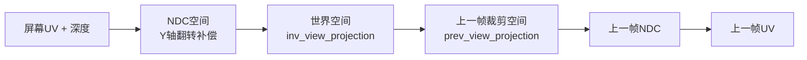

时域降噪Pass（AOTemporalPass）是GTAO降噪管线的第二阶段，负责在**时域**维度上进一步平滑环境光遮蔽结果。该Pass通过**重投影（Reprojection）**将当前帧像素映射到上一帧的对应位置，利用多帧累积信息来消除空间降噪无法彻底去除的残余噪声，同时通过三层拒绝机制确保在场景变化（相机移动、物体运动、遮挡关系改变）时不会产生鬼影（Ghosting）或拖尾（Smearing）伪影。

时域降噪Pass依赖于[GTAO Pass](https://github.com/1PercentSync/himalaya/blob/main/22-gtaosuan-fa-shi-xian)生成的原始AO纹理和[空间降噪Pass](https://github.com/1PercentSync/himalaya/blob/main/17-shen-du-yu-xuan-ran-pass)的模糊输出，输出最终可用于前向光照计算的时域滤波后AO纹理。理解本Pass的实现需要首先熟悉[时域数据与Temporal Filtering](https://github.com/1PercentSync/himalaya/blob/main/15-shi-yu-shu-ju-yu-temporal-filtering)中的核心概念。

## 管线路径与数据流

时域降噪Pass在GTAO降噪管线中处于末端位置，负责整合多帧信息：

```
┌──────────────┐     ┌──────────────────┐     ┌──────────────────┐
│  GTAO Pass   │────▶│ AO Spatial Blur  │────▶│ AO Temporal      │
│  (ao_noisy)  │     │  (ao_blurred)    │     │  (ao_filtered)   │
└──────────────┘     └──────────────────┘     └────────┬─────────┘
                                                       │
                                                       ▼
┌──────────────┐     ┌──────────────────┐     ┌──────────────────┐
│  上一帧深度   │◀────│    深度缓存      │     │  ao_history      │
│  (depth_prev)│     │   (depth)        │     │  (用于下一帧)    │
└──────────────┘     └──────────────────┘     └──────────────────┘
```

在M1的完整帧流程中，时域降噪Pass处于**屏幕空间效果阶段**的末端。该Pass读取经过空间滤波后的AO纹理（`ao_blurred`）和上一帧的时域滤波结果（`ao_history`），通过重投影计算找到当前像素在上一帧的对应位置，执行拒绝检测后混合两帧数据，输出最终的时域滤波后AO纹理（`ao_filtered`），同时该结果也会作为下一帧的历史数据使用。

Sources: [m1-frame-flow.md](https://github.com/1PercentSync/himalaya/blob/main/docs/milestone-1/m1-frame-flow.md#L73-L76)

## 核心算法架构

时域降噪的核心挑战在于**如何安全地复用历史帧数据**。直接混合当前帧和历史帧会在场景变化时产生严重的视觉伪影，因此需要建立一套可靠的拒绝机制来识别并剔除不可靠的历史样本。

### 重投影（Reprojection）

重投影是连接当前帧与历史帧的数学桥梁。给定当前帧的屏幕坐标和深度值，重投影计算该像素在上一帧UV空间中的对应位置：



重投影的数学推导基于透视投影矩阵的逆运算。从当前帧的屏幕UV和深度值出发，首先转换到NDC空间（注意Y轴翻转以适配负viewport高度），然后通过逆视图投影矩阵变换到世界空间，再使用上一帧的视图投影矩阵变换回裁剪空间，最终得到上一帧的UV坐标。这个过程的完整实现在着色器中以`reproject`函数呈现，它同时返回重投影后的UV坐标和期望的上一帧深度值，后者用于后续的深度一致性检测。

Sources: [ao_temporal.comp](https://github.com/1PercentSync/himalaya/blob/main/shaders/ao_temporal.comp#L51-L67)

### 三层拒绝机制

历史样本的可靠性通过三个层次的检测来评估，每一层解决不同类型的时域失效场景：

| 层次 | 检测目标 | 解决场景 | 实现方式 |
|------|----------|----------|----------|
| **Layer 1** | UV有效性 | 相机转动导致像素移出视锥 | 检查`prev_uv`是否在`[0,1]`范围内 |
| **Layer 2** | 深度一致性 | 物体移动、遮挡关系变化 | 比较线性化后的期望深度与存储深度，相对差异超过5%则拒绝 |
| **Layer 3** | 邻域钳制 | 防止历史值偏离当前帧局部统计 | 收集3×3邻域的AO最小/最大值，将历史AO钳制在该范围内 |

三层拒绝机制的设计遵循从粗到细的检测原则。第一层UV有效性检测处理相机运动导致的屏幕外像素，这些像素在上一帧没有对应数据。第二层深度一致性检测通过比较线性化后的期望深度（由重投影计算得出）和实际存储的上一帧深度，识别遮挡关系变化和物体运动。使用线性化深度而非原始Reverse-Z深度是为了确保在所有距离上都有一致的敏感度。第三层邻域钳制是最后一道防线，即使通过了前两层的像素，其历史AO值也会被限制在当前帧3×3邻域的最小最大值范围内，防止异常历史样本破坏当前帧的局部结构。

Sources: [ao_temporal.comp](https://github.com/1PercentSync/himalaya/blob/main/shaders/ao_temporal.comp#L99-L135)

### AO与Bent Normal的差异化处理

时域降噪Pass同时处理两种数据：A通道的标量AO值和RGB通道的Bent Normal方向向量。这两种数据需要不同的处理策略：

**AO（A通道）**是标量遮挡系数，取值范围`[0,1]`。对其应用完整的邻域钳制逻辑，因为标量的最小最大值具有明确的物理意义。

**Bent Normal（RGB通道）**是单位方向向量，经过编码存储（`direction * 0.5 + 0.5`）。方向向量的最小最大值没有物理意义，因此**不应用邻域钳制**。混合后的Bent Normal需要重新归一化以保持单位长度，防止多次混合导致的向量长度漂移。

这种差异化处理确保了两种数据类型都能在时域累积中保持稳定，同时避免对方向数据应用不适当的标量操作。

Sources: [ao_temporal.comp](https://github.com/1PercentSync/himalaya/blob/main/shaders/ao_temporal.comp#L167-L180)

## C++实现架构

### 类设计与职责

`AOTemporalPass`类遵循Himalaya Pass层的标准设计模式，将生命周期管理与每帧录制分离：

| 方法 | 职责 |
|------|------|
| `setup()` | 初始化阶段：创建Set 3 Push Descriptor布局、编译着色器、创建计算管线 |
| `record()` | 每帧录制：声明Render Graph资源依赖、绑定管线、推送描述符、分派计算 |
| `rebuild_pipelines()` | 热重载：重新编译着色器并重建管线 |
| `destroy()` | 清理：销毁管线和描述符布局 |

类通过Push Descriptor机制（`VK_DESCRIPTOR_SET_LAYOUT_CREATE_PUSH_DESCRIPTOR_BIT`）在录制时动态绑定Set 3的四个资源：`ao_filtered`（Storage Image输出）、`ao_blurred`/`ao_history`/`depth_prev`（三个Sampled Image输入）。

Sources: [ao_temporal_pass.h](https://github.com/1PercentSync/himalaya/blob/main/passes/include/himalaya/passes/ao_temporal_pass.h#L40-L109)

### 描述符布局与资源绑定

Set 3的布局定义反映了时域降噪的输入输出需求：

| Binding | 类型 | 资源 | 说明 |
|---------|------|------|------|
| 0 | Storage Image | `ao_filtered` | 时域滤波后输出（RGBA8） |
| 1 | Sampled Image | `ao_blurred` | 空间降噪后输入（当前帧） |
| 2 | Sampled Image | `ao_history` | 历史帧输入（上一帧输出） |
| 3 | Sampled Image | `depth_prev` | 上一帧深度（用于深度一致性检测） |

注意`depth`（当前帧深度）不需要在Set 3中显式绑定，因为它通过全局描述符Set 2的`rt_depth_resolved`统一暴露给所有屏幕空间效果使用。

Sources: [ao_temporal_pass.cpp](https://github.com/1PercentSync/himalaya/blob/main/passes/src/ao_temporal_pass.cpp#L46-L88)

### 时域混合因子控制

时域混合因子（`temporal_blend`）通过Push Constants动态传递，其取值策略体现了对历史数据有效性的保守处理：

```cpp
const AOTemporalPushConstants pc{
    .temporal_blend = ctx.ao_history_valid
                         ? ctx.ao_config->temporal_blend
                         : 0.0f,
};
```

当`ao_history_valid`为false时（如应用启动后的第一帧、窗口大小改变、相机大幅移动导致历史数据失效），混合因子强制设为0.0，即完全使用当前帧数据。在正常状态下，混合因子从`AOConfig`读取，默认值0.9表示历史帧占90%权重，当前帧仅占10%，这种高历史权重配置能够有效抑制噪声，但依赖三层拒绝机制来防止历史帧污染。

Sources: [ao_temporal_pass.cpp](https://github.com/1PercentSync/himalaya/blob/main/passes/src/ao_temporal_pass.cpp#L205-L212)

## 计算着色器实现细节

### 工作组配置

时域降噪Pass使用8×8的工作组大小（`local_size_x = 8, local_size_y = 8`），每个线程处理一个像素，不使用共享内存。这种配置在现代GPU上具有良好的线程占用率和缓存局部性，同时避免了共享内存同步的开销。Dispatch数量根据输出纹理尺寸动态计算：`ceil(width/8) × ceil(height/8)`。

Sources: [ao_temporal.comp](https://github.com/1PercentSync/himalaya/blob/main/shaders/ao_temporal.comp#L20)

### 线性化深度函数

深度一致性检测依赖`linearize_depth`函数将Reverse-Z深度值转换为线性视图空间距离。该函数基于透视投影矩阵的数学推导：

```glsl
float linearize_depth(float d) {
    return global.projection[3][2] / (d + global.projection[2][2]);
}
```

线性化确保了深度比较在不同距离上具有统一的敏感度——如果使用原始Reverse-Z深度，近处物体的微小移动会产生与远处物体大幅移动相同的深度变化，导致近处过度敏感或远处检测失效。

Sources: [common/depth.glsl](https://github.com/1PercentSync/himalaya/blob/main/shaders/common/depth.glsl#L21-L23)

### 邻域钳制的3×3采样

第三层拒绝机制通过`texelFetch`在3×3邻域内采样当前帧输入（`ao_blurred`）的A通道，计算局部最小最大值：

```glsl
for (int dy = -1; dy <= 1; ++dy) {
    for (int dx = -1; dx <= 1; ++dx) {
        ivec2 neighbor = clamp(pixel + ivec2(dx, dy), ivec2(0), size - 1);
        float val = texelFetch(ao_input_tex, neighbor, 0).a;
        ao_min = min(ao_min, val);
        ao_max = max(ao_max, val);
    }
}
```

边界处理使用`clamp`确保采样坐标始终有效，避免额外的分支判断。历史AO值通过`clamp(history_ao, ao_min, ao_max)`被限制在当前帧局部统计范围内，防止极端历史样本破坏时域稳定性。

Sources: [ao_temporal.comp](https://github.com/1PercentSync/himalaya/blob/main/shaders/ao_temporal.comp#L120-L134)

## 与其他组件的交互

### 上游依赖

| 依赖组件 | 关系说明 |
|----------|----------|
| [GTAO Pass](https://github.com/1PercentSync/himalaya/blob/main/22-gtaosuan-fa-shi-xian) | 提供原始AO噪声纹理，经过空间降噪后输入时域Pass |
| [空间降噪Pass](https://github.com/1PercentSync/himalaya/blob/main/17-shen-du-yu-xuan-ran-pass) | 直接上游，提供`ao_blurred`输入，使用5×5边缘感知双边滤波 |
| [深度预渲染Pass](https://github.com/1PercentSync/himalaya/blob/main/17-shen-du-yu-xuan-ran-pass) | 提供当前帧和上一帧的Resolved深度，用于重投影和深度一致性检测 |
| [时域数据管理](https://github.com/1PercentSync/himalaya/blob/main/15-shi-yu-shu-ju-yu-temporal-filtering) | 提供历史AO纹理（`ao_history`）和历史深度（`depth_prev`）的Ping-Pong管理 |

### 下游消费

| 消费组件 | 数据使用 |
|----------|----------|
| [前向渲染Pass](https://github.com/1PercentSync/himalaya/blob/main/18-qian-xiang-xuan-ran-pass) | 读取`ao_filtered`的AO（A通道）和Bent Normal（RGB通道），用于计算GTSO（地面真实环境光遮蔽） |

### 配置参数来源

`AOConfig`结构体在`scene_data.h`中定义，应用层通过`DebugUI`暴露的滑块允许运行时调整`temporal_blend`参数（范围0.0-0.98）。这种设计将渲染配置与Pass实现解耦，支持实时调试和不同场景的配置切换。

Sources: [scene_data.h](https://github.com/1PercentSync/himalaya/blob/main/framework/include/himalaya/framework/scene_data.h#L218-L230), [debug_ui.cpp](https://github.com/1PercentSync/himalaya/blob/main/app/src/debug_ui.cpp) (implied by grep results)

## 性能特征与优化考量

时域降噪Pass的计算开销相对较低，每个像素仅涉及：
- 1次重投影矩阵运算（4×4矩阵乘法）
- 1次历史纹理采样（`ao_history`）
- 1次历史深度采样（`depth_prev`）
- 9次邻域采样（当前帧AO的3×3区域，通过`texelFetch`）
- 若干标量运算（混合、钳制、编码）

与空间降噪的25次邻域采样相比，时域降噪的采样开销更小，但其价值在于通过多帧累积实现远超单帧可能的噪声抑制效果。在典型配置（`temporal_blend = 0.9`）下，等效于累积约10帧数据，将GTAO的残余噪声降低到视觉不可感知的水平。

## 延伸阅读与相关文档

- **[GTAO算法实现](https://github.com/1PercentSync/himalaya/blob/main/22-gtaosuan-fa-shi-xian)** — 了解时域降噪的上游数据源和GTAO的核心算法
- **[时域数据与Temporal Filtering](https://github.com/1PercentSync/himalaya/blob/main/15-shi-yu-shu-ju-yu-temporal-filtering)** — 深入理解Ping-Pong资源管理、历史有效性标记等基础设施
- **[Render Graph资源管理](https://github.com/1PercentSync/himalaya/blob/main/12-render-graphzi-yuan-guan-li)** — 理解`ao_history`等跨帧资源的声明周期和依赖追踪机制
- **[空间降噪Pass](https://github.com/1PercentSync/himalaya/blob/main/17-shen-du-yu-xuan-ran-pass)** — 了解时域降噪的前置处理阶段，5×5边缘感知双边滤波的实现细节