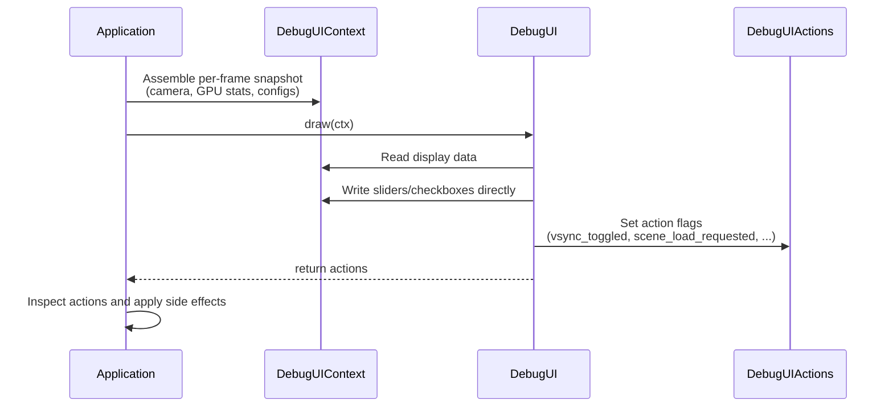
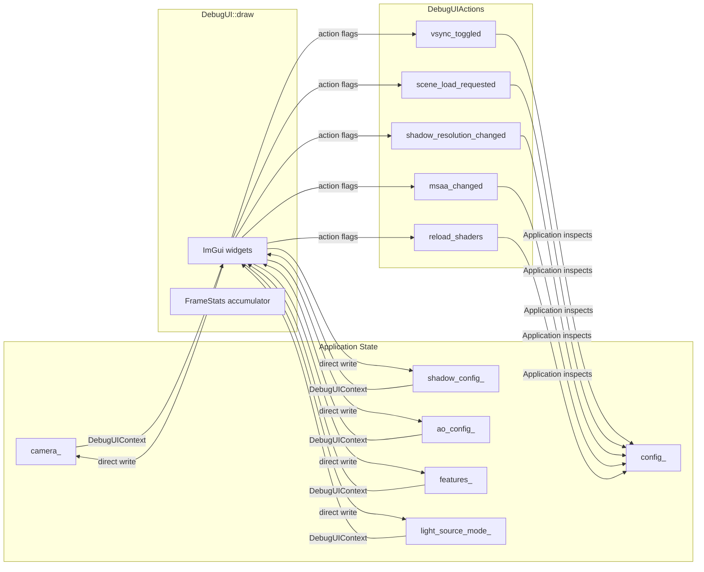

The debug UI is Himalaya's single-window ImGui control panel that provides **real-time performance monitoring, rendering parameter tuning, and runtime scene management**. Rather than scattering controls across multiple windows, the entire debug surface lives in one collapsible panel pinned to the top-left corner. Every widget reads from and writes to a plain data struct — the `DebugUIContext` — keeping the drawing code completely stateless and the application's response logic cleanly separated through a returned `DebugUIActions` struct. This design means the UI never holds references to subsystems; it only sees the data the application chooses to expose each frame.

Sources: [debug_ui.h](https://github.com/1PercentSync/himalaya/blob/main/app/include/himalaya/app/debug_ui.h#L1-L7), [debug_ui.cpp](https://github.com/1PercentSync/himalaya/blob/main/app/src/debug_ui.cpp#L1-L30)

## Architecture Overview

The debug UI follows a **data-oriented, action-replay pattern**: the application assembles a snapshot of all mutable and display-only state into `DebugUIContext`, passes it to `DebugUI::draw()`, and receives back a `DebugUIActions` struct whose boolean flags indicate which side effects the application must apply. The drawing code modifies context fields directly for simple value changes (slider drags, checkbox toggles), but defers destructive or resource-heavy operations — shadow map resolution changes, scene file loads, shader reloads — to the actions struct for the application to handle at the appropriate point in the frame lifecycle.

The key insight is the **separation between immediate and deferred mutations**. When you drag a slider like "AO Radius", the value is written directly into `ctx.ao_config.radius` — the same memory the renderer reads from next frame. But when you change the shadow map resolution from the combo box, the value is written to `actions.new_shadow_resolution` instead, because the renderer must reallocate GPU images before the new resolution takes effect.

Sources: [debug_ui.h](https://github.com/1PercentSync/himalaya/blob/main/app/include/himalaya/app/debug_ui.h#L227-L280), [application.cpp](https://github.com/1PercentSync/himalaya/blob/main/app/src/application.cpp#L406-L546)

## ImGui Backend Integration

Before `DebugUI` can draw anything, the framework's `ImGuiBackend` must bootstrap the entire ImGui lifecycle. This happens once during `Application::init()`, after the Vulkan context and swapchain are ready but before any rendering occurs. The backend wires up three layers: the ImGui core context (with DPI-aware font scaling), the GLFW platform backend (for keyboard/mouse input), and the Vulkan rendering backend (using Dynamic Rendering — no traditional `VkRenderPass`).

The backend owns a **dedicated descriptor pool** with a small allocation of combined-image-sampler descriptors (4 slots), sufficient for ImGui's font atlas texture and potential future debug texture overlays. It configures Vulkan Dynamic Rendering to match the swapchain's color format directly, so ImGui's draw calls render into the same image the scene composited into.

Sources: [imgui_backend.cpp](https://github.com/1PercentSync/himalaya/blob/main/framework/src/imgui_backend.cpp#L16-L74), [imgui_backend.h](https://github.com/1PercentSync/himalaya/blob/main/framework/include/himalaya/framework/imgui_backend.h#L28-L68)

The per-frame ImGui lifecycle follows this sequence within the application's frame loop:

```mermaid
flowchart TD
    A["imgui_backend_.begin_frame()"] --> B["debug_ui_.draw(ctx)"]
    B --> C["renderer_.render(cmd, input)"]
    C --> D["imgui_backend_.render(cmd)"]
    D --> E["vkQueueSubmit + vkQueuePresent"]

    style A fill:#2d4a1e,stroke:#6abf40
    style B fill:#1e3a5f,stroke:#4090d0
    style C fill:#5f1e3a,stroke:#d04090
    style D fill:#2d4a1e,stroke:#6abf40
    style E fill:#333,stroke:#666
```

`begin_frame()` polls the GLFW and Vulkan backends and starts a new ImGui frame. `DebugUI::draw()` is called inside `update()` — all ImGui widgets are recorded here. Later, `render()` finalizes the ImGui draw data and records the Vulkan draw commands into the same command buffer the renderer used, so everything submits in one batch.

Sources: [imgui_backend.cpp](https://github.com/1PercentSync/himalaya/blob/main/framework/src/imgui_backend.cpp#L87-L99), [application.cpp](https://github.com/1PercentSync/himalaya/blob/main/app/src/application.cpp#L285-L288)

## The DebugUIContext Data Contract

`DebugUIContext` is the single struct that bridges the application's internal state to the debug panel. It is assembled fresh every frame in `Application::update()` using designated initializers, making it immediately clear which fields are display-only values (passed by value or `const` reference) versus mutable controls (passed by reference so the UI can write directly).

The struct organizes its fields into logical groups matching the UI sections:

| Group | Key Fields | Mutability |
|---|---|---|
| **Frame timing** | `delta_time` | Read-only input |
| **GPU info** | `context`, `swapchain` | Read-only display + VSync toggle |
| **Camera** | `camera` (position, FOV, near/far) | Mutable — sliders modify directly |
| **Lighting** | `light_source_mode`, fallback/HDR sun params | Mutable — combo + sliders |
| **Render mode** | `render_mode`, `rt_supported` | Mutable — checkbox (with guard) |
| **Path tracing** | `pt_max_bounces`, `pt_max_clamp`, denoiser state | Mixed display + mutable |
| **Features** | `features` (skybox, shadows, AO, contact shadows) | Mutable — checkboxes |
| **Shadow** | `shadow_config`, `shadow_resolution` | Mutable sliders + action-triggered resolution |
| **AO / Contact** | `ao_config`, `contact_shadow_config` | Mutable — sliders and combos |
| **Rendering** | `ibl_intensity`, `ev`, `debug_render_mode`, MSAA | Mutable + action-triggered |
| **Scene stats** | `scene_stats` struct | Read-only display |

Sources: [debug_ui.h](https://github.com/1PercentSync/himalaya/blob/main/app/include/himalaya/app/debug_ui.h#L48-L225), [application.cpp](https://github.com/1PercentSync/himalaya/blob/main/app/src/application.cpp#L407-L466)

## DebugUIActions — Deferred Side Effects

Not all user interactions can be safely applied by writing to a context field. Changing the shadow map resolution requires GPU resource reallocation; loading a new scene involves file I/O, mesh parsing, and acceleration structure rebuilds; toggling VSync requires swapchain recreation. These **destructive or asynchronous operations** are communicated through the `DebugUIActions` return struct.

| Action Flag | Trigger | Application Response |
|---|---|---|
| `vsync_toggled` | VSync checkbox | Sets `vsync_changed_` flag → swapchain recreate in `end_frame()` |
| `msaa_changed` | MSAA combo box | Calls `renderer_.handle_msaa_change()` to rebuild MSAA targets |
| `shadow_resolution_changed` | Shadow resolution combo | Calls `renderer_.handle_shadow_resolution_changed()` to rebuild shadow maps |
| `scene_load_requested` | "Load Scene..." button | Calls `switch_scene()` — GPU idle, full scene reload |
| `env_load_requested` | "Load HDR..." button | Calls `switch_environment()` — GPU idle, IBL rebuild |
| `reload_shaders` | "Reload Shaders" button | Calls `renderer_.reload_shaders()` for hot-reload |
| `error_dismissed` | Error banner "X" button | Clears `error_message_` |
| `hdr_sun_coords_changed` | Sun X/Y input fields | Persists new coords to config file |
| `log_level_changed` | Log level combo | Updates spdlog level and persists to config |
| `pt_reset_requested` | PT "Reset" button | Clears path tracing accumulation |
| `pt_denoise_requested` | "Denoise Now" button | Triggers manual OIDN denoise pass |

Sources: [debug_ui.h](https://github.com/1PercentSync/himalaya/blob/main/app/include/himalaya/app/debug_ui.h#L232-L280), [application.cpp](https://github.com/1PercentSync/himalaya/blob/main/app/src/application.cpp#L468-L546)

## Panel Sections — A Tour of Every UI Section

### Performance Monitor (Always Visible)

The top of the panel shows real-time frame performance without any collapsing header — it's always visible. The `FrameStats` accumulator collects frame delta times and every 1.0 second computes three metrics: **average FPS**, **average frame time in milliseconds**, and **1% low FPS** (the average of the worst 1% of frame times). Between updates, displayed values stay frozen to prevent distracting flicker.

Below the FPS counters, the GPU name (queried from Vulkan physical device properties), current resolution, and VRAM usage (via `VK_EXT_memory_budget`) are displayed as static text. The VSync checkbox directly modifies the swapchain's vsync field; the application detects the change and recreates the swapchain at the end of the frame.

Sources: [debug_ui.cpp](https://github.com/1PercentSync/himalaya/blob/main/app/src/debug_ui.cpp#L142-L166), [debug_ui.h](https://github.com/1PercentSync/himalaya/blob/main/app/include/himalaya/app/debug_ui.h#L306-L320)

### Path Tracing Controls

When path tracing mode is active (`render_mode == PathTracing`), two additional collapsible sections appear. The **Path Tracing** section displays accumulated sample count, elapsed time, and provides sliders for max bounces (1–32) and firefly clamping threshold (0 = disabled). A "Target Samples" input field lets you set a convergence target (0 = unlimited), and the "Reset" button clears the accumulation buffer.

The **Denoiser (OIDN)** section provides controls for Intel's Open Image Denoise integration. The "Denoise" checkbox enables/disables the feature, "Show Denoised" toggles between raw and denoised output, and "Auto Denoise" triggers denoising at a configurable sample interval (minimum 16 samples). The "Denoise Now" button is grayed out when conditions don't allow manual triggering (denoise disabled, auto-denoise active, denoise already running, or no samples accumulated).

Sources: [debug_ui.cpp](https://github.com/1PercentSync/himalaya/blob/main/app/src/debug_ui.cpp#L168-L285)

### Camera Section

The Camera collapsible header displays the camera's current position and orientation (yaw/pitch in degrees) as read-only text. Three interactive sliders allow runtime adjustment of **FOV** (30°–120°), **near plane** (0.01–10.0, logarithmic scale), and **far plane** (10.0–10000.0, logarithmic scale). The near and far plane sliders use `ImGuiSliderFlags_Logarithmic` for intuitive precision at both ends of the range.

Sources: [debug_ui.cpp](https://github.com/1PercentSync/himalaya/blob/main/app/src/debug_ui.cpp#L287-L313)

### Scene and Environment Management

The **Scene** section shows the currently loaded scene filename (with a tooltip for the full path) and per-frame rendering statistics: instance counts, visible/culled objects, draw calls, and rendered triangle counts. On Windows, a "Load Scene..." button opens a native file dialog filtered to `.gltf` and `.glb` files. The **Environment** section similarly shows the loaded HDR file and provides a "Load HDR..." button for runtime environment switching.

Sources: [debug_ui.cpp](https://github.com/1PercentSync/himalaya/blob/main/app/src/debug_ui.cpp#L315-L388)

### Lighting Controls

The Lighting section exposes a four-mode light source selector:

| Mode | Description | Controls Shown |
|---|---|---|
| **Scene** | Uses glTF directional lights | Direction display only |
| **Fallback** | User-controllable light | Intensity, color temp, shadow toggle |
| **HDR Sun** | Direction from HDR pixel coords | Sun X/Y, intensity, color temp, shadow toggle |
| **None** | IBL only | No additional controls |

The application auto-selects the mode on startup: Scene if the glTF contains lights, HdrSun if an HDR environment is loaded, Fallback as a last resort. The Scene option is disabled when the loaded glTF has no lights.

Sources: [debug_ui.cpp](https://github.com/1PercentSync/himalaya/blob/main/app/src/debug_ui.cpp#L390-L441), [debug_ui.h](https://github.com/1PercentSync/himalaya/blob/main/app/include/himalaya/app/debug_ui.h#L28-L40)

### Feature Toggles

The Features section provides four simple checkboxes that directly modify `RenderFeatures` flags:

- **Skybox** — enables/disables skybox rendering
- **Shadows** — enables/disables the entire shadow pipeline (CSM + sampling)
- **AO** — enables/disables GTAO ambient occlusion
- **Contact Shadows** — enables/disables per-pixel screen-space ray marching

These toggles are consumed by the render graph: when a feature is disabled, the corresponding render pass is skipped entirely, saving both GPU time and memory bandwidth.

Sources: [debug_ui.cpp](https://github.com/1PercentSync/himalaya/blob/main/app/src/debug_ui.cpp#L443-L450), [scene_data.h](https://github.com/1PercentSync/himalaya/blob/main/framework/include/himalaya/framework/scene_data.h#L138-L150)

### Shadow Parameters

When shadows are enabled, the Shadow section exposes the full CSM configuration. The **shadow mode** combo switches between PCF (fixed kernel) and PCSS (contact-hardening). **Cascade count** (1–4) is a pure rendering parameter that doesn't trigger resource rebuilds. **Shadow map resolution** (512–4096) does trigger a rebuild and is communicated via `DebugUIActions`. Additional sliders control split lambda, max distance, slope bias, and normal offset.

In PCF mode, a "PCF Radius" combo selects the kernel size (Off through 11×11). In PCSS mode, sliders for **angular diameter** (with a tooltip noting the Sun is ~0.53°) and **quality preset** (Low/Medium/High) appear, along with a "Blocker Early-Out" checkbox.

The section concludes with a **cascade statistics** display that computes and shows the coverage range and texel density (pixels per meter) for each cascade, using the current camera FOV and shadow parameters. This is a computed display — not a stored value — recalculated from the context data each frame.

Sources: [debug_ui.cpp](https://github.com/1PercentSync/himalaya/blob/main/app/src/debug_ui.cpp#L452-L573)

### Ambient Occlusion Parameters

When AO is enabled, this section provides sliders for GTAO's core parameters: **radius** (world-space meters), **directions** and **steps per direction** (combo boxes: 2/4/8), **thin compensation** (0–0.7), **intensity** multiplier (0.5–3.0), **temporal blend** factor (0.0–0.98), and a **GTSO (bent normal)** checkbox for specular occlusion quality.

Sources: [debug_ui.cpp](https://github.com/1PercentSync/himalaya/blob/main/app/src/debug_ui.cpp#L575-L608)

### Contact Shadows Parameters

When contact shadows are enabled, this section offers a **step count** combo (8/16/24/32), a **max distance** slider (0.1–5.0 meters), and a **min thickness** slider (0.001–0.1 meters) that controls the depth-adaptive comparison threshold.

Sources: [debug_ui.cpp](https://github.com/1PercentSync/himalaya/blob/main/app/src/debug_ui.cpp#L610-L633)

### Rendering Parameters

The Rendering section contains the **MSAA** combo (filtered by GPU-supported sample counts), a **"Reload Shaders"** button for hot-reloading modified GLSL files, **IBL Intensity** (0.0–5.0), **EV** exposure (-4 to +4 stops), and a **Debug View** combo with visualization modes: Full PBR, Diffuse Only, Specular Only, IBL Only, Normal, Metallic, Roughness, AO, Shadow Cascades, SSAO, and Contact Shadows.

Sources: [debug_ui.cpp](https://github.com/1PercentSync/himalaya/blob/main/app/src/debug_ui.cpp#L635-L683)

### Cache Management

The Cache section provides buttons to clear specific cache categories ("Clear Texture Cache", "Clear IBL Cache") or all caches at once ("Clear All Cache"). These call directly into the framework's cache subsystem, which removes files from the `%TEMP%\himalaya\` directory tree.

Sources: [debug_ui.cpp](https://github.com/1PercentSync/himalaya/blob/main/app/src/debug_ui.cpp#L685-L698), [cache.h](https://github.com/1PercentSync/himalaya/blob/main/framework/include/himalaya/framework/cache.h#L36-L44)

## Deferred Slider Pattern — Preventing Typing Artifacts

A subtle but important UI pattern in the debug panel is the **deferred slider** mechanism. Standard ImGui sliders apply every keystroke immediately when the user Ctrl+Clicks to type a numeric value. For rendering parameters, this means the renderer would receive partially typed values (e.g., typing "1.5" produces "1", then "1.", then "1.5" as separate updates).

The `slider_float_deferred()` and `slider_angle_deferred()` helper functions solve this by detecting when the user is in text-input mode (`ImGui::GetIO().WantTextInput`) and restoring the original value during typing. The actual value change is only committed when the user presses Enter, clicks away, or tabs out — preventing intermediate renderer state corruption.

Sources: [debug_ui.cpp](https://github.com/1PercentSync/himalaya/blob/main/app/src/debug_ui.cpp#L57-L98)

## Configuration Persistence

Selected debug UI settings are persisted across application restarts via a JSON configuration file stored at `%LOCALAPPDATA%\himalaya\config.json` on Windows. The `AppConfig` struct stores:

- **Scene path** — the last-loaded glTF file
- **Environment path** — the last-loaded HDR file
- **Log level** — spdlog level name string
- **HDR sun coordinates** — per-HDR-file sun pixel position map

Persistence uses atomic file replacement (write to `.tmp`, then `rename`) to prevent corruption. The config is saved whenever the user loads a new scene, switches environment, modifies HDR sun coordinates, or changes the log level. All I/O errors are caught and logged — they never propagate as exceptions.

Sources: [config.h](https://github.com/1PercentSync/himalaya/blob/main/app/include/himalaya/app/config.h#L22-L44), [config.cpp](https://github.com/1PercentSync/himalaya/blob/main/app/src/config.cpp#L50-L134)

## Summary of Data Flow

The diagram above summarizes the complete data flow: application state flows into `DebugUIContext`, the debug panel reads display data and writes mutable parameters directly, destructive operations flow out through `DebugUIActions`, and the application applies those actions to its subsystems.

## Next Steps

Now that you understand how the debug UI exposes runtime parameters, you can explore the rendering features it controls:

- [Forward Pass — Cook-Torrance PBR, IBL Split-Sum, and Multi-Bounce AO](https://github.com/1PercentSync/himalaya/blob/main/17-forward-pass-cook-torrance-pbr-ibl-split-sum-and-multi-bounce-ao) — see how debug render modes and feature flags are consumed
- [Shadow Pass — CSM Rendering, PCF, and PCSS Contact-Hardening Soft Shadows](https://github.com/1PercentSync/himalaya/blob/main/18-shadow-pass-csm-rendering-pcf-and-pcss-contact-hardening-soft-shadows) — understand the shadow parameters exposed in the UI
- [GTAO Pass — Horizon-Based Ambient Occlusion with Spatial and Temporal Denoising](https://github.com/1PercentSync/himalaya/blob/main/19-gtao-pass-horizon-based-ambient-occlusion-with-spatial-and-temporal-denoising) — learn how AO config maps to GPU sampling
- [Renderer Core — Frame Dispatch, GPU Data Fill, and Rasterization vs Path Tracing](https://github.com/1PercentSync/himalaya/blob/main/22-renderer-core-frame-dispatch-gpu-data-fill-and-rasterization-vs-path-tracing) — see how the renderer consumes all config structs