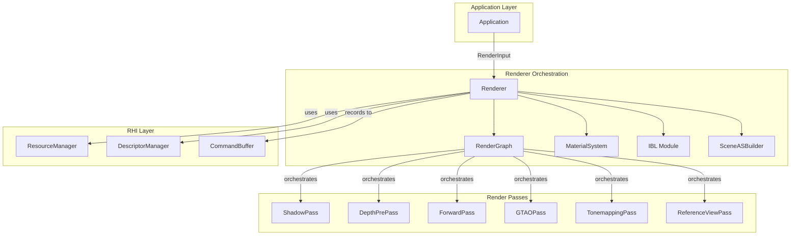

The Renderer Orchestration layer serves as the central nervous system of the Himalaya rendering engine, coordinating all rendering passes, managing GPU resources, and dispatching work to the appropriate rendering pipelines. This layer sits at the intersection of the [Application Lifecycle and Windowing](https://github.com/1PercentSync/himalaya/blob/main/23-application-lifecycle-and-windowing) and the lower-level [Render Graph System](https://github.com/1PercentSync/himalaya/blob/main/12-render-graph-system), translating high-level rendering requests into concrete GPU command sequences. The `Renderer` class encapsulates this responsibility, owning the render graph instance, all render passes, GPU buffers, and shared resources while exposing a clean interface for the Application to drive frame rendering.

The architectural philosophy behind this layer emphasizes **explicit resource ownership** and **clear separation between initialization and runtime**. Unlike monolithic renderers that conflate setup with execution, the Himalaya renderer separates these concerns into distinct phases: `init()` establishes all persistent resources during application startup, `render()` executes the per-frame pipeline, and `destroy()` performs orderly teardown. This design enables deterministic resource management and simplifies debugging of GPU resource lifetimes.

Sources: [renderer.h](https://github.com/1PercentSync/himalaya/blob/main/app/include/himalaya/app/renderer.h#L129-L148), [application.cpp](https://github.com/1PercentSync/himalaya/blob/main/app/src/application.cpp#L77-L84)

## Architecture Overview

The Renderer orchestrates a sophisticated multi-pass rendering pipeline that supports two distinct rendering modes: **rasterization** for real-time preview and **path tracing** for reference-quality output. Both modes share common infrastructure—the render graph for automatic barrier insertion, GPU buffer management for per-frame uniform data, and descriptor set management—but diverge in their pass compositions and resource requirements.

The following diagram illustrates the high-level architecture of the Renderer and its relationships with subsystems:

Sources: [renderer.h](https://github.com/1PercentSync/himalaya/blob/main/app/include/himalaya/app/renderer.h#L304-L335)

## Render Input and Data Flow

The communication protocol between Application and Renderer is defined by the `RenderInput` structure, which aggregates all per-frame semantic data needed for rendering. This design pattern—collecting inputs into a single structure rather than passing individual parameters—provides several benefits: it makes the interface stable across feature additions, enables easy extension without breaking existing call sites, and documents the complete data dependencies of the rendering pipeline in one location.

The `RenderInput` structure contains camera state, lighting information, culling results, scene geometry references, and feature configuration flags. Critically, all members are non-owning references or primitive values—no heap allocation occurs during structure construction, ensuring zero overhead in the hot path. The Renderer consumes this input in `fill_common_gpu_data()`, which maps the high-level data to GPU-visible buffers: the GlobalUBO for per-frame uniforms, the LightBuffer for directional lights, and the InstanceBuffer for mesh instancing data.

Sources: [renderer.h](https://github.com/1PercentSync/himalaya/blob/main/app/include/himalaya/app/renderer.h#L59-L116), [renderer.cpp](https://github.com/1PercentSync/himalaya/blob/main/app/src/renderer.cpp#L27-L148)

## Dual Render Paths: Rasterization and Path Tracing

The Renderer implements a **dual-path architecture** that selects between rasterization and path tracing based on runtime conditions. The `render()` method serves as the dispatch point, evaluating whether path tracing is both requested and feasible (requiring a valid TLAS). If conditions are not met, the system gracefully falls back to rasterization.

### Rasterization Path

The rasterization path implements a modern deferred-forward hybrid pipeline optimized for real-time performance. The pass execution order follows a carefully designed sequence that minimizes bandwidth and maximizes GPU occupancy:

1. **Shadow Pass** (conditional): Renders shadow cascades for directional lights if shadows are enabled
2. **Depth PrePass**: Fills depth and normal buffers to enable early-Z rejection and screen-space effects
3. **GTAO Pass** (conditional): Computes horizon-based ambient occlusion using depth and normals
4. **AO Spatial Pass** (conditional): Applies 5x5 bilateral blur to raw AO output
5. **AO Temporal Pass** (conditional): Reprojects and blends AO with history for temporal stability
6. **Contact Shadows Pass** (conditional): Performs screen-space ray marching for near-contact shadows
7. **Forward Pass**: Renders opaque and masked geometry with full PBR lighting
8. **Skybox Pass** (conditional): Renders environment cubemap into HDR color buffer
9. **Tonemapping Pass**: Converts HDR to display-referred output with ACES tone curve
10. **ImGui Pass**: Renders debug UI overlay

The rasterization path also implements sophisticated **draw group building** to maximize instancing efficiency. Visible instances are sorted by (mesh_id, alpha_mode, double_sided), then grouped into `MeshDrawGroup` structures that enable single draw calls for multiple instances sharing the same mesh and material properties. This reduces CPU overhead and enables GPU-driven rendering patterns.

Sources: [renderer_rasterization.cpp](https://github.com/1PercentSync/himalaya/blob/main/app/src/renderer_rasterization.cpp#L132-L366)

### Path Tracing Path

The path tracing path provides reference-quality rendering through a progressive accumulation approach. Unlike rasterization, which completes in a single frame, path tracing accumulates samples over multiple frames until reaching a target sample count or until the camera moves (which triggers accumulation reset).

The PT path uses a specialized pass pipeline:

1. **Reference View Pass**: Dispatches the RT pipeline for path tracing with configurable bounce depth
2. **OIDN Readback Pass** (conditional): Copies accumulation buffers to CPU-accessible memory for denoising
3. **OIDN Upload Pass** (conditional): Uploads denoised results back to GPU
4. **Tonemapping Pass**: Converts accumulated HDR to display-referred output
5. **ImGui Pass**: Renders debug UI overlay

A key architectural feature is the **asynchronous denoiser integration**. The OpenImageDenoise (OIDN) library runs on a separate thread, processing accumulated frames while the GPU continues rendering. The Renderer manages this concurrency through timeline semaphores, ensuring proper synchronization between GPU readback, CPU denoising, and GPU display.

Sources: [renderer_pt.cpp](https://github.com/1PercentSync/himalaya/blob/main/app/src/renderer_pt.cpp#L18-L314)

## Resource Management Strategy

The Renderer owns and manages several categories of GPU resources, each with distinct lifetime characteristics:

| Resource Category | Lifetime | Management Strategy |
|-------------------|----------|---------------------|
| Per-frame buffers (UBO/SSBO) | Persistent | Double-buffered, CPU-mapped for direct write |
| Managed render targets | Persistent | Render graph managed, auto-resized on window change |
| MSAA buffers | Persistent | Dynamic creation/destruction on sample count change |
| PT accumulation buffers | Persistent | Created conditionally when RT is supported |
| Samplers | Persistent | Created once, reused across all passes |
| Default textures | Persistent | 1x1 fallback textures for missing material inputs |
| Pass pipelines | Persistent | Rebuilt on shader reload or MSAA change |

The **managed image system** deserves special attention. Rather than manually tracking image handles and sizes, the Renderer registers render targets with the render graph using `create_managed_image()`. These images automatically resize when the reference resolution changes, eliminating an entire class of resize-related bugs. The `RGManagedHandle` abstraction provides stable references that remain valid across resize events.

Sources: [renderer_init.cpp](https://github.com/1PercentSync/himalaya/blob/main/app/src/renderer_init.cpp#L44-L210), [renderer.h](https://github.com/1PercentSync/himalaya/blob/main/app/include/himalaya/app/renderer.h#L372-L418)

## GPU Data Filling and Uniform Management

The `fill_common_gpu_data()` method demonstrates the translation layer between CPU-side scene state and GPU-visible uniforms. This method populates the `GlobalUniformData` structure with view/projection matrices, camera position, lighting parameters, feature flags, and shadow cascade data. The implementation follows a consistent pattern: compute derived values on CPU, then `memcpy` the complete structure to the persistently-mapped GPU buffer.

Feature flags are packed into a single `uint32_t` using bit shifts, enabling efficient GPU-side feature detection without multiple uniform reads. The shadow system computes cascade matrices using `compute_shadow_cascades()`, which implements stable cascaded shadow mapping with texel snapping to eliminate shimmering. PCSS (Percentage-Closer Soft Shadows) parameters are pre-computed per-cascade based on light angular diameter and cascade extents.

Sources: [renderer.cpp](https://github.com/1PercentSync/himalaya/blob/main/app/src/renderer.cpp#L27-L148)

## Dynamic Configuration Handling

The Renderer exposes several methods for runtime configuration changes that require GPU resource recreation:

**MSAA Sample Count Changes**: When the user changes MSAA settings through the debug UI, `handle_msaa_change()` waits for GPU idle, then either updates existing MSAA buffer descriptions (when changing between Nx samples) or creates/destroys MSAA resources (when enabling/disabling MSAA). The depth prepass and forward pass are notified to rebuild their pipelines with new sample counts.

**Shadow Resolution Changes**: `handle_shadow_resolution_changed()` triggers shadow map recreation at the new resolution and updates the Set 2 descriptors that bind shadow maps for sampling.

**Shader Hot-Reload**: `reload_shaders()` provides a development-time feature that recompiles all shaders from disk and rebuilds every pipeline. This enables rapid iteration on shader code without application restart.

**Environment Reload**: `reload_environment()` destroys and recreates IBL resources from a new HDR file, including cubemap generation, irradiance convolution, and prefiltered mipmaps. This also triggers PT accumulation reset since environment changes invalidate accumulated samples.

Sources: [renderer_init.cpp](https://github.com/1PercentSync/himalaya/blob/main/app/src/renderer_init.cpp#L584-L689)

## Render Graph Integration

The Renderer's relationship with the render graph exemplifies the **dependency inversion principle**. Rather than the Renderer knowing about barrier semantics and image layout transitions, it simply declares resource usage patterns through `RGResourceUsage` structures. The render graph then computes optimal barrier insertion points and layout transitions during `compile()`.

Each frame follows a consistent pattern:
1. `render_graph_.clear()` - Reset from previous frame
2. `import_image()` / `use_managed_image()` - Declare resources for this frame
3. `add_pass()` - Register passes with their resource dependencies
4. `render_graph_.compile()` - Compute barriers and layouts
5. `render_graph_.execute(cmd)` - Record commands with automatic barriers

This approach eliminates manual barrier management—a common source of rendering bugs—while maintaining full control over pass ordering and resource usage.

Sources: [renderer_rasterization.cpp](https://github.com/1PercentSync/himalaya/blob/main/app/src/renderer_rasterization.cpp#L219-L365), [render_graph.h](https://github.com/1PercentSync/himalaya/blob/main/framework/include/himalaya/framework/render_graph.h#L181-L265)

## Ray Tracing Integration

When hardware ray tracing is available, the Renderer manages acceleration structure building through `build_scene_as()`. This method delegates to `SceneASBuilder` for BLAS/TLAS construction, then writes the resulting handles to descriptor set 0 for shader access. The Renderer also manages the Sobol direction number buffer and blue noise texture used for quasi-random sampling in the path tracer.

The PT accumulation system tracks multiple state variables to determine when to reset accumulation: camera movement, IBL rotation, light changes, and parameter adjustments (bounce depth, clamp threshold). This ensures that accumulated samples always correspond to a consistent scene state.

Sources: [renderer.h](https://github.com/1PercentSync/himalaya/blob/main/app/include/himalaya/app/renderer.h#L188-L202), [renderer_init.cpp](https://github.com/1PercentSync/himalaya/blob/main/app/src/renderer_init.cpp#L544-L563)

## Temporal Stability and Frame Coherence

The Renderer maintains several mechanisms for temporal stability across frames:

**Previous Frame Data**: The `prev_view_projection_` matrix enables temporal reprojection for effects like TAA and temporal AO filtering. This is updated at the end of each frame after rendering completes.

**Frame Counter**: A monotonically increasing `frame_counter_` provides temporal variation for noise patterns, ensuring that stochastic effects like shadow filtering converge smoothly over time.

**History Validity**: Temporal resources track whether their history content is valid (not the first frame, not after resize), allowing passes to disable temporal blending when appropriate.

**PT Accumulation Generation**: Each reset of path tracing accumulation increments a generation counter, enabling the denoiser to track which frames belong to the same accumulation sequence.

Sources: [renderer.cpp](https://github.com/1PercentSync/himalaya/blob/main/app/src/renderer.cpp#L168-L171), [renderer.h](https://github.com/1PercentSync/himalaya/blob/main/app/include/himalaya/app/renderer.h#L564-L568)

## Summary

The Renderer Orchestration layer embodies the principle of **"orchestration without micromanagement"**. It owns the high-level rendering pipeline structure while delegating implementation details to specialized passes. It manages resource lifetimes without manually tracking every allocation. It provides both rasterization and path tracing paths through a unified interface. This architecture enables the Himalaya engine to serve dual purposes: as a real-time visualization tool with immediate feedback, and as a reference renderer capable of producing ground-truth images for quality validation.

For developers extending the renderer, the key integration points are:
- Add new passes to the appropriate render path in `render_rasterization()` or `render_path_tracing()`
- Register new managed images in `init()` if they need automatic resize handling
- Add new GPU data fields to `GlobalUniformData` and update `fill_common_gpu_data()`
- Expose new configuration options through the `RenderInput` structure from the Application layer

For deeper understanding of the underlying systems, refer to [Render Graph System](https://github.com/1PercentSync/himalaya/blob/main/12-render-graph-system) for barrier automation, [Material System and PBR](https://github.com/1PercentSync/himalaya/blob/main/13-material-system-and-pbr) for shader data binding, and [Path Tracing Reference View](https://github.com/1PercentSync/himalaya/blob/main/21-path-tracing-reference-view) for the RT implementation details.