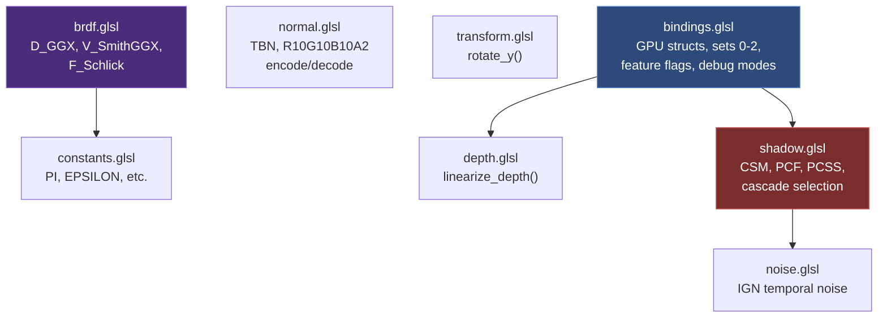

The GLSL shader system in Himalaya is organized around a **single-source-of-truth** design: one header file (`bindings.glsl`) declares every GPU buffer layout, every bindless texture array, and every feature toggle shared across all pipeline stages. Every shader in the project begins by including this central header, then layers in specialized libraries for BRDF math, shadow sampling, normal mapping, and noise generation. This page explains how those shared modules compose, how the three-set descriptor layout maps to GPU resources, and how compile-time and runtime guards keep the codebase coherent across rasterization and path tracing pipelines.

## Shared Header Dependency Graph

The `shaders/common/` directory contains eight headers that form a directed acyclic include graph. No header creates circular dependencies, and each declares an `#ifndef` include guard for safety. The following diagram shows the full relationship:



**Key design principles** of this dependency graph:

- **`bindings.glsl`** is the root dependency — it declares all GPU structs, set layouts, and render-target samplers. Both `depth.glsl` and `shadow.glsl` require it because they read from `GlobalUBO` fields.
- **`brdf.glsl`** is **purely functional** — it depends only on `constants.glsl` and has zero knowledge of GPU buffers or scene data. Callers pass pre-clamped dot products and material parameters.
- **`normal.glsl`** is also **self-contained** — it does NOT include `bindings.glsl`, allowing it to be used in both rasterization shaders (which have the full UBO) and compute shaders with minimal includes.
- **`shadow.glsl`** is the most complex header at 496 lines — it transitively pulls in `noise.glsl` and relies on `bindings.glsl` for cascade parameters and render-target bindings.

Sources: [bindings.glsl](https://github.com/1PercentSync/himalaya/blob/main/shaders/common/bindings.glsl#L1-L190), [brdf.glsl](https://github.com/1PercentSync/himalaya/blob/main/shaders/common/brdf.glsl#L1-L75), [constants.glsl](https://github.com/1PercentSync/himalaya/blob/main/shaders/common/constants.glsl#L1-L16), [depth.glsl](https://github.com/1PercentSync/himalaya/blob/main/shaders/common/depth.glsl#L1-L26), [noise.glsl](https://github.com/1PercentSync/himalaya/blob/main/shaders/common/noise.glsl#L1-L39), [normal.glsl](https://github.com/1PercentSync/himalaya/blob/main/shaders/common/normal.glsl#L1-L77), [shadow.glsl](https://github.com/1PercentSync/himalaya/blob/main/shaders/common/shadow.glsl#L1-L496), [transform.glsl](https://github.com/1PercentSync/himalaya/blob/main/shaders/common/transform.glsl#L1-L22)

## Three-Set Descriptor Layout

Every shader in the rasterization pipeline accesses GPU resources through exactly three descriptor sets. The layout is declared once in `bindings.glsl` and consumed identically by all shader stages:

| Set | Binding | Type | Contents | Update Frequency |
|-----|---------|------|----------|------------------|
| 0 | 0 | `uniform GlobalUBO` | 928 bytes: view/projection matrices, camera, IBL indices, shadow params, feature flags | Per-frame |
| 0 | 1 | `readonly buffer LightBuffer` | Variable-length `GPUDirectionalLight[]` | Per-frame |
| 0 | 2 | `readonly buffer MaterialBuffer` | Variable-length `GPUMaterialData[]` | Per-frame |
| 0 | 3 | `readonly buffer InstanceBuffer` | Variable-length `GPUInstanceData[]` | Per-frame |
| 0 | 4 | `uniform accelerationStructureEXT` | TLAS (RT only, guarded by `HIMALAYA_RT`) | Per-frame |
| 0 | 5 | `readonly buffer GeometryInfoBuffer` | Variable-length `GeometryInfo[]` (RT only) | Per-frame |
| 1 | 0 | `uniform sampler2D textures[]` | Bindless 2D texture array | Immutable |
| 1 | 1 | `uniform samplerCube cubemaps[]` | Bindless cubemap array | Immutable |
| 2 | 0 | `uniform sampler2D rt_hdr_color` | HDR color from forward pass | Per-pass |
| 2 | 1 | `uniform sampler2D rt_depth_resolved` | Depth buffer (MSAA-resolved) | Per-pass |
| 2 | 2 | `uniform sampler2D rt_normal_resolved` | World-space normal buffer | Per-pass |
| 2 | 3 | `uniform sampler2D rt_ao_texture` | AO + bent normal (RGBA8) | Per-pass |
| 2 | 4 | `uniform sampler2D rt_contact_shadow_mask` | Contact shadow mask (R8) | Per-pass |
| 2 | 5 | `uniform sampler2DArrayShadow rt_shadow_map` | CSM shadow atlas (comparison) | Per-pass |
| 2 | 6 | `uniform sampler2DArray rt_shadow_map_depth` | CSM shadow atlas (raw depth) | Per-pass |

**Set 0** holds per-frame scene data — the `GlobalUBO` contains matrices, camera position, lighting counts, shadow cascade parameters, IBL indices, and the feature flag bitmask. SSBOs hold variable-length arrays of lights, materials, and instances. Ray-tracing bindings (4 and 5) are conditionally compiled under `#ifdef HIMALAYA_RT`. **Set 1** holds the two bindless texture arrays shared by all materials. **Set 2** holds render-target intermediate products, declared with `PARTIALLY_BOUND` — passes only write the bindings they produce, and consumers guard reads via `feature_flags`.

Compute shaders and RT shaders use an additional **Set 3** for per-dispatch I/O (push descriptors specific to each pass), which is declared locally in each `.comp` or `.rgen` file rather than in the shared header.

Sources: [bindings.glsl](https://github.com/1PercentSync/himalaya/blob/main/shaders/common/bindings.glsl#L86-L189), [scene_data.h](https://github.com/1PercentSync/himalaya/blob/main/framework/include/himalaya/framework/scene_data.h#L264-L319)

## GPU Struct Definitions — The C++/GLSL Contract

Four GPU structures are defined identically in both C++ (in `scene_data.h` and `material_system.h`) and GLSL (in `bindings.glsl`). The offset comments in both files are kept synchronized manually — any mismatch causes silent rendering corruption.

| Struct | Layout | Size | Purpose |
|--------|--------|------|---------|
| `GPUDirectionalLight` | std430 | 32 bytes | Light direction, intensity, color, shadow flag |
| `GPUInstanceData` | std430 | 128 bytes | Model matrix, precomputed normal matrix (3×vec4 columns), material index |
| `GPUMaterialData` | std430 | 80 bytes | PBR factors (base color, emissive, metallic, roughness, normal scale, occlusion), 5 bindless texture indices, alpha mode/cutoff |
| `GeometryInfo` | std430 | 24 bytes | RT-only: vertex/index buffer device addresses, material offset |

The `GPUInstanceData` struct stores the normal matrix as three `vec4` columns rather than a `mat3` because std430 `mat3` layout is implementation-defined — storing each column as `vec4` (with an unused w component) guarantees identical layout between C++ (`glm::vec4 normal_col0/1/2`) and GLSL (`mat3 normal_matrix` reconstructed from three 16-byte columns).

Sources: [bindings.glsl](https://github.com/1PercentSync/himalaya/blob/main/shaders/common/bindings.glsl#L21-L54), [scene_data.h](https://github.com/1PercentSync/himalaya/blob/main/framework/include/himalaya/framework/scene_data.h#L326-L364)

## The BRDF Library — Pure Mathematical Building Blocks

The `brdf.glsl` header provides three functions implementing the **Cook-Torrance specular BRDF** with no GPU data dependencies. Every function takes only scalar/vector parameters and returns computed results:

| Function | Formula | Inputs | Output |
|----------|---------|--------|--------|
| `D_GGX(NdotH, roughness)` | α² / (π · (NdotH²·(α²−1)+1)²) | Clamped dot(N,H), linear roughness | Microfacet distribution |
| `V_SmithGGX(NdotV, NdotL, roughness)` | 0.5 / (NdotL·√(NdotV²·(1−α²)+α²) + NdotV·√(NdotL²·(1−α²)+α²)) | Clamped dot(N,V), dot(N,L), roughness | Height-correlated visibility |
| `F_Schlick(VdotH, F0)` | F0 + (1−F0)·(1−VdotH)⁵ | Clamped dot(V,H), normal incidence reflectance | Fresnel reflectance |

The specular BRDF is assembled as `D * V * F` — the visibility function `V_SmithGGX` already incorporates the `1/(4·NdotV·NdotL)` denominator from the Cook-Torrance formulation, so no extra division is needed. This is the Heitz 2014 height-correlated Smith model, not the simpler separated G₂.

This library is shared across three distinct contexts: the **forward pass** (direct lighting per directional light), the **IBL prefilter** compute shader (importance-sampled environment convolution), and the **path tracing closest-hit** shader (NEE evaluation and BRDF sampling). Its purity — no UBO access, no texture sampling — makes it universally composable.

Sources: [brdf.glsl](https://github.com/1PercentSync/himalaya/blob/main/shaders/common/brdf.glsl#L28-L73)

## Feature Flags — Runtime Shader Branching

Rather than compiling separate shader variants for each feature combination, the system uses a **single-shader** approach with runtime branching controlled by a bitmask in `GlobalUBO.feature_flags`:

```glsl
#define FEATURE_SHADOWS         (1u << 0)
#define FEATURE_AO              (1u << 1)
#define FEATURE_CONTACT_SHADOWS (1u << 2)
```

Every consumer tests flags before accessing the corresponding Set 2 render target. For example, the forward pass reads contact shadows like this:

```glsl
float contact_shadow = 1.0;
if ((global.feature_flags & FEATURE_CONTACT_SHADOWS) != 0u) {
    contact_shadow = texture(rt_contact_shadow_mask, screen_uv).r;
}
```

This pattern ensures that **unbound descriptors are never sampled** — when a feature is disabled, the producing pass doesn't write to the binding, and the consuming pass falls back to a neutral value (1.0 for shadows, 1.0 for AO). The GPU cost of the branch is negligible because all fragments in a frame take the same path (the flag is uniform across all invocations).

Similarly, the `debug_render_mode` field controls an embedded visualization pipeline within the forward fragment shader — modes like `DEBUG_MODE_NORMAL`, `DEBUG_MODE_SHADOW_CASCADES`, and `DEBUG_MODE_AO` short-circuit the full PBR calculation and output a passthrough color. The tonemapping pass detects `DEBUG_MODE_PASSTHROUGH_START` and skips ACES mapping for these modes.

Sources: [bindings.glsl](https://github.com/1PercentSync/himalaya/blob/main/shaders/common/bindings.glsl#L56-L84), [forward.frag](https://github.com/1PercentSync/himalaya/blob/main/shaders/forward.frag#L124-L179), [forward.frag](https://github.com/1PercentSync/himalaya/blob/main/shaders/forward.frag#L196-L200), [tonemapping.frag](https://github.com/1PercentSync/himalaya/blob/main/shaders/tonemapping.frag#L37-L41)

## Compile-Time Guard: The HIMALAYA_RT Define

The ray-tracing pipeline introduces additional descriptor bindings (TLAS at set 0 binding 4, `GeometryInfoBuffer` at set 0 binding 5) and GLSL extensions that rasterization shaders do not have access to. Rather than maintaining a separate `bindings.glsl` for RT, the shared header uses a preprocessor guard:

```glsl
#ifdef HIMALAYA_RT
#extension GL_EXT_ray_tracing : require
#extension GL_EXT_shader_explicit_arithmetic_types_int64 : require
// ... TLAS and GeometryInfo declarations ...
#endif
```

Each RT shader source file defines the macro **before** including `bindings.glsl`:

```glsl
#define HIMALAYA_RT
#include "common/bindings.glsl"
#include "rt/pt_common.glsl"
```

This convention is followed by all six RT shader files — `reference_view.rgen`, `closesthit.rchit`, `miss.rmiss`, `shadow_miss.rmiss`, and `anyhit.rahit` each start with `#define HIMALAYA_RT`. No C++ code injects this define; it lives purely in the GLSL sources. The rasterization shaders simply omit the define, so the RT bindings are invisible to them.

Sources: [bindings.glsl](https://github.com/1PercentSync/himalaya/blob/main/shaders/common/bindings.glsl#L149-L170), [reference_view.rgen](https://github.com/1PercentSync/himalaya/blob/main/shaders/rt/reference_view.rgen#L19-L21), [closesthit.rchit](https://github.com/1PercentSync/himalaya/blob/main/shaders/rt/closesthit.rchit#L15-L17), [shadow_miss.rmiss](https://github.com/1PercentSync/himalaya/blob/main/shaders/rt/shadow_miss.rmiss#L12-L14)

## Shader Include Graph by Pipeline

The following table shows which common headers each shader file includes, revealing the dependency patterns across the four rendering pipelines:

### Rasterization Pipeline

| Shader File | `bindings` | `normal` | `brdf` | `shadow` | `depth` | `noise` | `transform` | `constants` |
|-------------|:----------:|:--------:|:------:|:--------:|:-------:|:-------:|:-----------:|:-----------:|
| `depth_prepass.vert` | ✓ | | | | | | | |
| `depth_prepass.frag` | ✓ | ✓ | | | | | | |
| `depth_prepass_masked.frag` | ✓ | ✓ | | | | | | |
| `forward.vert` | ✓ | | | | | | | |
| `forward.frag` | ✓ | ✓ | ✓ | ✓ | | | ✓ | (via brdf) |
| `shadow.vert` | ✓ | | | | | | | |
| `shadow_masked.frag` | ✓ | | | | | | | |
| `skybox.vert` | ✓ | | | | | | | |
| `skybox.frag` | ✓ | | | | | | ✓ | |
| `tonemapping.frag` | ✓ | | | | | | | |

### Compute Pipeline

| Shader File | `bindings` | `normal` | `brdf` | `shadow` | `depth` | `noise` | `transform` | `constants` |
|-------------|:----------:|:--------:|:------:|:--------:|:-------:|:-------:|:-----------:|:-----------:|
| `gtao.comp` | ✓ | ✓ | | | | ✓ | | ✓ |
| `contact_shadows.comp` | ✓ | ✓ | | | ✓ | ✓ | | |
| `ao_spatial.comp` | ✓ | | | | ✓ | | | ✓ |
| `ao_temporal.comp` | ✓ | | | | ✓ | | | ✓ |

### IBL Pipeline

| Shader File | `constants` | `ibl_common` | `brdf` |
|-------------|:-----------:|:------------:|:------:|
| `equirect_to_cubemap.comp` | ✓ | ✓ | |
| `irradiance.comp` | ✓ | ✓ | |
| `prefilter.comp` | (via brdf) | ✓ | ✓ |
| `brdf_lut.comp` | ✓ | ✓ | |

Note that the IBL shaders use a separate include hierarchy — they include `common/constants.glsl` and `ibl/ibl_common.glsl` directly, and do NOT include `bindings.glsl`. This is because IBL compute pipelines use push descriptors (Set 0) for their own input/output bindings rather than the scene's global descriptor sets.

### RT Pipeline

| Shader File | `bindings` (with RT) | `pt_common` | `normal` | `transform` |
|-------------|:--------------------:|:-----------:|:--------:|:-----------:|
| `reference_view.rgen` | ✓ | ✓ | | |
| `closesthit.rchit` | ✓ | ✓ | ✓ | |
| `miss.rmiss` | ✓ | ✓ | | ✓ |
| `shadow_miss.rmiss` | ✓ | ✓ | | |
| `anyhit.rahit` | ✓ | ✓ | | |

Sources: [depth_prepass.frag](https://github.com/1PercentSync/himalaya/blob/main/shaders/depth_prepass.frag#L15-L16), [forward.frag](https://github.com/1PercentSync/himalaya/blob/main/shaders/forward.frag#L17-L21), [gtao.comp](https://github.com/1PercentSync/himalaya/blob/main/shaders/gtao.comp#L15-L18), [contact_shadows.comp](https://github.com/1PercentSync/himalaya/blob/main/shaders/contact_shadows.comp#L21-L24), [prefilter.comp](https://github.com/1PercentSync/himalaya/blob/main/shaders/ibl/prefilter.comp#L26-L27), [reference_view.rgen](https://github.com/1PercentSync/himalaya/blob/main/shaders/rt/reference_view.rgen#L19-L21), [closesthit.rchit](https://github.com/1PercentSync/himalaya/blob/main/shaders/rt/closesthit.rchit#L15-L18), [miss.rmiss](https://github.com/1PercentSync/himalaya/blob/main/shaders/rt/miss.rmiss#L12-L15)

## Utility Libraries In Depth

### Constants (`constants.glsl`)

Five mathematical constants with full double-precision literals: `PI`, `TWO_PI`, `HALF_PI`, `INV_PI`, and `EPSILON` (0.0001). Every shader that needs π starts here. The `EPSILON` constant is used for division-safe normalization across AO, shadow, and normal reconstruction code.

### Noise (`noise.glsl`)

Two functions providing **Interleaved Gradient Noise** (Jorge Jimenez, CoD:AW):

- `interleaved_gradient_noise(screen_pos)` — deterministic per-pixel noise in [0, 1) based on screen position
- `interleaved_gradient_noise(screen_pos, frame)` — temporal variant that offsets the pattern each frame via golden-ratio-spaced displacement (`frame * 5.588238`)

This is the primary source of per-pixel stochastic variation across the entire renderer — shadow PCSS Poisson disk rotation, GTAO direction jitter, and contact shadow ray march dithering all derive their randomness from IGN.

### Depth (`depth.glsl`)

A single function `linearize_depth(d)` that converts raw Reverse-Z depth to positive linear view-space distance using the perspective projection matrix coefficients: `P[3][2] / (d + P[2][2])`. Required by AO spatial/temporal filtering, contact shadows, and any pass that needs metric depth.

### Normal (`normal.glsl`)

Three functions supporting the depth prepass → forward pass normal pipeline:

1. **`get_shading_normal(N, tangent, normal_rg, normal_scale)`** — constructs a TBN matrix from the geometric normal and vertex tangent, decodes BC5 RG normal map data (reconstructs Z from XY), and transforms to world-space. Includes a degenerate tangent guard that falls back to the geometric normal.
2. **`encode_normal_r10g10b10a2(n)`** — maps [-1,1] to [0,1] (`n * 0.5 + 0.5`) for the R10G10B10A2_UNORM render target. This linear mapping is MSAA-average-safe.
3. **`decode_normal_r10g10b10a2(encoded)`** — maps [0,1] back to [-1,1] and normalizes. Post-normalization is necessary after MSAA resolve averages encoded values.

### Transform (`transform.glsl`)

A single function `rotate_y(d, s, c)` that rotates a direction vector around the Y axis using precomputed sine and cosine. Used for IBL environment rotation in the forward pass and skybox shader.

Sources: [constants.glsl](https://github.com/1PercentSync/himalaya/blob/main/shaders/common/constants.glsl#L9-L14), [noise.glsl](https://github.com/1PercentSync/himalaya/blob/main/shaders/common/noise.glsl#L19-L36), [depth.glsl](https://github.com/1PercentSync/himalaya/blob/main/shaders/common/depth.glsl#L21-L23), [normal.glsl](https://github.com/1PercentSync/himalaya/blob/main/shaders/common/normal.glsl#L26-L74), [transform.glsl](https://github.com/1PercentSync/himalaya/blob/main/shaders/common/transform.glsl#L17-L19)

## Include Resolution and Hot Reload

The C++ shader compiler (`rhi::ShaderCompiler`) resolves `#include` directives using a custom `FileIncluder` class backed by shaderc. Relative includes (quoted `"..."`) resolve relative to the requesting file's directory; standard includes (`<...>`) resolve from the configured root. All transitive include paths and their contents are tracked per-compilation for **include-aware cache invalidation** — when any included file changes on disk, the cached SPIR-V is discarded and recompiled.

In debug builds, shaders compile with zero optimization and debug info for RenderDoc source mapping. Release builds use `shaderc_optimization_level_performance`. The target environment is Vulkan 1.4.

Sources: [shader.cpp](https://github.com/1PercentSync/himalaya/blob/main/rhi/src/shader.cpp#L22-L86), [shader.cpp](https://github.com/1PercentSync/himalaya/blob/main/rhi/src/shader.cpp#L160-L200)

## IBL-Specific Shared Code

The `shaders/ibl/ibl_common.glsl` header provides utilities exclusive to the IBL preprocessing pipeline:

| Function | Purpose |
|----------|---------|
| `cube_dir(face, uv)` | Maps cubemap face index (0–5) and UV to world-space direction |
| `radical_inverse_vdc(bits)` | Van der Corput radical inverse for Hammersley sequence |
| `hammersley(i, n)` | Low-discrepancy 2D quasi-random point for hemisphere sampling |
| `importance_sample_ggx(xi, N, roughness)` | GGX NDF importance sampling producing a world-space half-vector |

These are consumed by `equirect_to_cubemap.comp`, `irradiance.comp`, `prefilter.comp`, and `brdf_lut.comp` — all four IBL compute pipelines. Notably, `prefilter.comp` includes both `ibl_common.glsl` AND `common/brdf.glsl` because it evaluates `D_GGX` for PDF-based mip-level selection during environment prefiltering.

Sources: [ibl_common.glsl](https://github.com/1PercentSync/himalaya/blob/main/shaders/ibl/ibl_common.glsl#L18-L84), [prefilter.comp](https://github.com/1PercentSync/himalaya/blob/main/shaders/ibl/prefilter.comp#L26-L27)

## RT-Specific Shared Code

The `shaders/rt/pt_common.glsl` header (417 lines) is the path tracing counterpart to `shadow.glsl` — a large shared library included by all five RT shader stages. It provides:

- **Payload structs** (`PrimaryPayload`, `ShadowPayload`) for ray communication
- **Buffer references** (`VertexBuffer`, `IndexBuffer`) for direct GPU address access via `GL_EXT_buffer_reference`
- **Vertex interpolation** (`interpolate_hit()`) — manual barycentric interpolation from index/vertex buffers
- **Self-intersection avoidance** (`offset_ray_origin()`) — Wächter & Binder integer-bit-manipulation technique
- **Normal consistency** (`ensure_normal_consistency()`) — clamps shading normal to geometric normal hemisphere
- **BRDF sampling** — GGX VNDF importance sampling (Heitz 2018), cosine-weighted hemisphere sampling, multi-lobe selection probability
- **Sobol quasi-random sequence** with 128-dimension direction table + PCG hash fallback
- **Cranley-Patterson rotation** with blue noise per-pixel offset (`rand_pt()`)
- **Russian Roulette** path termination (active from bounce 2, survival probability = throughput luminance)

This header includes `common/brdf.glsl` and therefore inherits the same pure-function Cook-Torrance components used in rasterization, ensuring identical BRDF evaluation across both rendering paths.

Sources: [pt_common.glsl](https://github.com/1PercentSync/himalaya/blob/main/shaders/rt/pt_common.glsl#L1-L417)

## Design Rationale — Single-Shader with Uniform Branching

The architecture deliberately avoids **shader permutation** (compiling N variants for M feature combinations) in favor of a single shader per pipeline stage with uniform branching on `feature_flags`. This decision trades a small amount of GPU efficiency (branch overhead on uniform values) for significant engineering simplicity:

- **One SPIR-V binary per stage** — no permutation explosion, no pipeline cache thrashing
- **Debug modes are free** — the `DEBUG_MODE_*` switch in `forward.frag` is a uniform branch, so adding new visualization modes never requires a new shader variant
- **Feature toggles are instant** — the C++ renderer sets `feature_flags` each frame; no shader recompilation or pipeline recreation needed
- **The branch cost is zero in practice** — all fragments in a frame take the same path, so the GPU's uniform control flow optimization eliminates any divergence penalty

Sources: [bindings.glsl](https://github.com/1PercentSync/himalaya/blob/main/shaders/common/bindings.glsl#L56-L61), [forward.frag](https://github.com/1PercentSync/himalaya/blob/main/shaders/forward.frag#L224-L227), [forward.frag](https://github.com/1PercentSync/himalaya/blob/main/shaders/forward.frag#L260-L275)

## What Comes Next

The shared header system described here is the foundation for all rendering pipelines. To see these headers in action within specific rendering contexts:

- **[Forward Pass — Cook-Torrance PBR, IBL Split-Sum, and Multi-Bounce AO](https://github.com/1PercentSync/himalaya/blob/main/17-forward-pass-cook-torrance-pbr-ibl-split-sum-and-multi-bounce-ao)** — how `brdf.glsl`, `shadow.glsl`, and `transform.glsl` compose into the full PBR lighting equation
- **[Shadow Pass — CSM Rendering, PCF, and PCSS Contact-Hardening Soft Shadows](https://github.com/1PercentSync/himalaya/blob/main/18-shadow-pass-csm-rendering-pcf-and-pcss-contact-hardening-soft-shadows)** — deep dive into the 496-line `shadow.glsl` and its cascade blending logic
- **[Path Tracing Shaders — Ray Generation, Closest Hit, and Miss Shaders](https://github.com/1PercentSync/himalaya/blob/main/26-path-tracing-shaders-ray-generation-closest-hit-and-miss-shaders)** — how `pt_common.glsl` extends the BRDF library with importance sampling and Russian Roulette