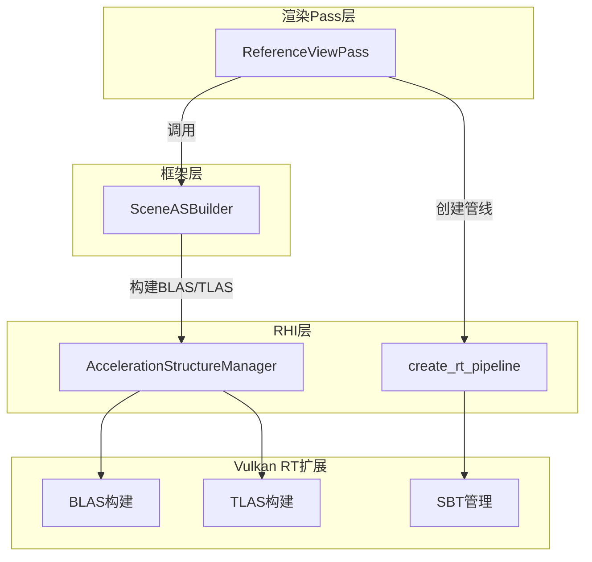

本文档详述 Himalaya 渲染引擎的光线追踪基础设施，涵盖底层加速结构（BLAS/TLAS）的构建与管理、RT 管线创建与 Shader Binding Table（SBT）组织，以及高级场景构建器如何将网格数据转换为 GPU 可追踪的层级结构。

## 架构概览

Himalaya 的 RT 基础设施采用分层设计，将底层 Vulkan 扩展细节与高层场景抽象分离：

**三层架构模型**：RHI 层提供通用的 BLAS/TLAS 构建原语；框架层通过 `SceneASBuilder` 实现场景特定的构建策略；渲染 Pass 层负责 RT 管线的实际调度与着色器执行。



**设计决策**：Milestone 1 采用**静态场景**方案，所有加速结构在加载时构建且不支持更新。BLAS 按 glTF mesh 的 `group_id` 分组，将同一 mesh 的所有 primitive 合并为单一多几何体 BLAS，减少实例数量并提升遍历效率。

Sources: [acceleration_structure.h](https://github.com/1PercentSync/himalaya/blob/main/rhi/include/himalaya/rhi/acceleration_structure.h#L1-L161), [scene_as_builder.h](https://github.com/1PercentSync/himalaya/blob/main/framework/include/himalaya/framework/scene_as_builder.h#L1-L101)

## 加速结构资源管理

### BLAS 与 TLAS 句柄

RHI 层定义了简洁的资源句柄结构，封装 Vulkan 加速结构对象及其 backing buffer。

**BLASHandle** 结构包含 `VkAccelerationStructureKHR` 句柄、backing `VkBuffer` 以及 VMA 分配器引用。这种设计允许批量构建后统一跟踪资源生命周期。TLASHandle 采用相同的布局模式，便于统一的资源清理流程。

```cpp
struct BLASHandle {
    VkAccelerationStructureKHR as = VK_NULL_HANDLE;
    VkBuffer buffer = VK_NULL_HANDLE;
    VmaAllocation allocation = VK_NULL_HANDLE;
};
```

**内存管理策略**：backing buffer 必须同时具有 `ACCELERATION_STRUCTURE_STORAGE_BIT_KHR` 和 `SHADER_DEVICE_ADDRESS_BIT` 用途标志，前者允许 Vulkan 将加速结构数据存储于 buffer，后者支持光线追踪着色器通过设备地址引用。

Sources: [acceleration_structure.h](https://github.com/1PercentSync/himalaya/blob/main/rhi/include/himalaya/rhi/acceleration_structure.h#L22-L44), [acceleration_structure.cpp](https://github.com/1PercentSync/himalaya/blob/main/rhi/src/acceleration_structure.cpp#L54-L90)

### 几何体构建信息

**BLASGeometry** 结构封装单个几何体的构建参数，对应一个三角形集合（通常是一个 glTF primitive）。顶点格式被硬编码为 `R32G32B32_SFLOAT` 位置数据 + `UINT32` 索引，与项目的统一顶点布局匹配。

```cpp
struct BLASGeometry {
    VkDeviceAddress vertex_buffer_address;
    VkDeviceAddress index_buffer_address;
    uint32_t vertex_count;
    uint32_t index_count;
    uint32_t vertex_stride;
    bool opaque;  // 控制 any-hit 着色器调用
};
```

**透明材质处理**：`opaque` 标志驱动 Vulkan 几何体标志设置。对于完全不透明材质，设置 `VK_GEOMETRY_OPAQUE_BIT_KHR` 使硬件跳过 any-hit 着色器调用；对于需要 alpha test 或透明混合的材质，使用 `VK_GEOMETRY_NO_DUPLICATE_ANY_HIT_INVOCATION_BIT_KHR` 保证每 primitive 最多一次 any-hit 调用。

Sources: [acceleration_structure.h](https://github.com/1PercentSync/himalaya/blob/main/rhi/include/himalaya/rhi/acceleration_structure.h#L54-L87), [acceleration_structure.cpp](https://github.com/1PercentSync/himalaya/blob/main/rhi/src/acceleration_structure.cpp#L28-L53)

## 批量 BLAS 构建

### 四阶段构建流程

`AccelerationStructureManager::build_blas` 实现批量 BLAS 构建，通过单命令将多个 BLAS 并行提交 GPU。

**阶段一：查询尺寸**：填充 Vulkan 几何体和构建信息结构，调用 `vkGetAccelerationStructureBuildSizesKHR` 获取每个 BLAS 的加速结构尺寸和 scratch 缓冲区需求。每个几何体转换自 `BLASGeometry`，包含设备地址和顶点/索引计数。

**阶段二：创建资源**：为每个 BLAS 分配 backing buffer 并通过 `vkCreateAccelerationStructureKHR` 创建加速结构对象。使用 VMA 的 `VMA_MEMORY_USAGE_AUTO` 策略自动选择最优内存类型。

**阶段三：分配 Scratch**：计算所有 BLAS 的 scratch 尺寸总和（按 `minAccelerationStructureScratchOffsetAlignment` 对齐），分配单一大型 scratch buffer。各 BLAS 的 scratch 区域在此 buffer 内按偏移量划分，支持并行构建。

**阶段四：录制命令**：构建 `VkAccelerationStructureBuildRangeInfoKHR` 数组（指定每个几何体的 primitive 计数和偏移），调用 `vkCmdBuildAccelerationStructuresKHR` 提交批量构建命令。

Sources: [acceleration_structure.cpp](https://github.com/1PercentSync/himalaya/blob/main/rhi/src/acceleration_structure.cpp#L1-L200), [acceleration_structure.cpp](https://github.com/1PercentSync/himalaya/blob/main/rhi/src/acceleration_structure.cpp#L200-L225)

### 内存屏障与资源清理

BLAS 构建完成后插入 `VK_PIPELINE_STAGE_2_ACCELERATION_STRUCTURE_BUILD_BIT_KHR` 到相同阶段的内存屏障，确保构建数据对后续 TLAS 构建可见。Scratch buffer 通过 `push_staging_buffer` 注册到 immediate scope，在 `end_immediate()` 时自动销毁。

```cpp
VkMemoryBarrier2 as_barrier{};
as_barrier.srcStageMask = VK_PIPELINE_STAGE_2_ACCELERATION_STRUCTURE_BUILD_BIT_KHR;
as_barrier.srcAccessMask = VK_ACCESS_2_ACCELERATION_STRUCTURE_WRITE_BIT_KHR;
as_barrier.dstStageMask = VK_PIPELINE_STAGE_2_ACCELERATION_STRUCTURE_BUILD_BIT_KHR;
as_barrier.dstAccessMask = VK_ACCESS_2_ACCELERATION_STRUCTURE_READ_BIT_KHR;
vkCmdPipelineBarrier2(context_->immediate_command_buffer, &dep_info);
```

Sources: [acceleration_structure.cpp](https://github.com/1PercentSync/himalaya/blob/main/rhi/src/acceleration_structure.cpp#L225-L245)

## TLAS 构建与实例管理

### 实例数据上传

`build_tlas` 接收 `VkAccelerationStructureInstanceKHR` 数组，首先将实例数据上传至 GPU 可访问 buffer。使用 VMA 的 `VMA_ALLOCATION_CREATE_HOST_ACCESS_SEQUENTIAL_WRITE_BIT | VMA_ALLOCATION_CREATE_MAPPED_BIT` 标志创建主机可见 buffer，避免显式内存映射操作。

**实例配置要点**：每个实例通过 `accelerationStructureReference` 引用 BLAS 设备地址，`instanceCustomIndex` 存储 24-bit 用户数据（在 Himalaya 中用于索引 Geometry Info SSBO），`mask` 控制射线掩码匹配，`instanceShaderBindingTableRecordOffset` 指定 SBT hit group 偏移。

Sources: [acceleration_structure.cpp](https://github.com/1PercentSync/himalaya/blob/main/rhi/src/acceleration_structure.cpp#L246-L320)

### 单阶段构建流程

TLAS 构建采用简化流程：创建实例 buffer 并获取设备地址、查询构建尺寸、分配 TLAS backing buffer 和 scratch buffer、录制构建命令。由于 TLAS 仅包含实例引用而非实际几何数据，构建开销显著低于 BLAS。

**资源清理**：实例 buffer 和 scratch buffer 均为临时资源，通过 `push_staging_buffer` 注册延迟销毁，backing buffer 和加速结构句柄则持久保存直到显式调用 `destroy_tlas`。

Sources: [acceleration_structure.cpp](https://github.com/1PercentSync/himalaya/blob/main/rhi/src/acceleration_structure.cpp#L320-L400), [acceleration_structure.cpp](https://github.com/1PercentSync/himalaya/blob/main/rhi/src/acceleration_structure.cpp#L400-L417)

## RT 管线与 SBT 管理

### 管线创建描述

**RTPipelineDesc** 结构封装 RT 管线配置，包含五个着色器阶段：raygen、miss（环境）、shadow_miss、closesthit、anyhit（可选）。描述符集布局和推送常量范围与标准图形管线兼容。

```cpp
struct RTPipelineDesc {
    VkShaderModule raygen = VK_NULL_HANDLE;
    VkShaderModule miss = VK_NULL_HANDLE;
    VkShaderModule shadow_miss = VK_NULL_HANDLE;
    VkShaderModule closesthit = VK_NULL_HANDLE;
    VkShaderModule anyhit = VK_NULL_HANDLE;  // 可选
    uint32_t max_recursion_depth = 1;
    std::span<const VkDescriptorSetLayout> descriptor_set_layouts;
    std::span<const VkPushConstantRange> push_constant_ranges;
};
```

**着色器组布局**：采用固定四组结构 —— Group 0（raygen 通用组）、Group 1（环境 miss 通用组）、Group 2（阴影 miss 通用组）、Group 3（hit group，包含 closesthit + 可选 anyhit）。这种布局与 SBT 区域计算直接对应。

Sources: [rt_pipeline.h](https://github.com/1PercentSync/himalaya/blob/main/rhi/include/himalaya/rhi/rt_pipeline.h#L24-L53), [rt_pipeline.cpp](https://github.com/1PercentSync/himalaya/blob/main/rhi/src/rt_pipeline.cpp#L14-L80)

### Shader Binding Table 构造

SBT 构建流程首先调用 `vkCreateRayTracingPipelinesKHR` 创建管线，然后查询着色器组句柄（`vkGetRayTracingShaderGroupHandlesKHR`），最后将句柄写入对齐的 SBT buffer。

**对齐计算**：每个 SBT entry 大小为 `align_up(handle_size, handle_alignment)`，各区域起始地址按 `shader_group_base_alignment` 对齐。SBT 总尺寸计算为 raygen 区域（1 entry）+ miss 区域（2 entries）+ hit 区域（1 entry）的对齐总和。

**区域配置**：
- **raygen_region**：deviceAddress = SBT 基址，stride = size（单 entry，stride 无意义）
- **miss_region**：deviceAddress = 基址 + raygen 区域大小，stride = entry 对齐尺寸
- **hit_region**：deviceAddress = miss 区域结束位置，stride = entry 对齐尺寸
- **callable_region**：保持零值（未使用）

Sources: [rt_pipeline.cpp](https://github.com/1PercentSync/himalaya/blob/main/rhi/src/rt_pipeline.cpp#L80-L170), [rt_pipeline.h](https://github.com/1PercentSync/himalaya/blob/main/rhi/include/himalaya/rhi/rt_pipeline.h#L60-L95)

## 场景加速结构构建器

### 高层构建流程

**SceneASBuilder** 将场景数据（Mesh、MeshInstance、MaterialInstance）转换为完整的 RT 加速结构层次。构建流程分为五个阶段：

| 阶段 | 操作 | 输出 |
|------|------|------|
| 阶段 1 | 按 `group_id` 分组网格，收集几何体 | `group_geometries`, `group_mat_offsets` |
| 阶段 2 | 批量构建 BLAS | `blas_handles_` |
| 阶段 3 | 构建 Geometry Info SSBO | `geometry_info_buffer_` |
| 阶段 4 | 去重实例，组装 TLAS 实例数组 | `tlas_instances` |
| 阶段 5 | 构建 TLAS | `tlas_handle_` |

Sources: [scene_as_builder.h](https://github.com/1PercentSync/himalaya/blob/main/framework/include/himalaya/framework/scene_as_builder.h#L40-L75), [scene_as_builder.cpp](https://github.com/1PercentSync/himalaya/blob/main/framework/src/scene_as_builder.cpp#L1-L100)

### 几何体分组策略

网格按 `Mesh::group_id`（对应 glTF mesh 索引）分组，同一 group 的所有 primitive 合并为单一多几何体 BLAS。这种策略平衡了 BLAS 数量与实例粒度：过少 BLAS 导致过度绘制，过多 BLAS 增加 TLAS 遍历开销。

**退化几何体过滤**：跳过 `vertex_count == 0` 或 `index_count < 3` 的 primitive，仍递增 `group_prim_count` 以保持 TLAS 实例步进正确。透明材质检测从 `MaterialInstance::alpha_mode` 推导，驱动 `BLASGeometry::opaque` 标志设置。

Sources: [scene_as_builder.cpp](https://github.com/1PercentSync/himalaya/blob/main/framework/src/scene_as_builder.cpp#L30-L80), [mesh.h](https://github.com/1PercentSync/himalaya/blob/main/framework/include/himalaya/framework/mesh.h#L59-L85)

### Geometry Info SSBO

Geometry Info buffer 是连接 TLAS 与材质/顶点数据的 GPU 端查找表。每个 entry 包含顶点 buffer 设备地址、索引 buffer 设备地址、材质 buffer 偏移。

```cpp
struct GPUGeometryInfo {
    VkDeviceAddress vertex_buffer_address;
    VkDeviceAddress index_buffer_address;
    uint32_t material_buffer_offset;
    uint32_t _padding;
};
```

**索引计算**：着色器中通过 `gl_InstanceCustomIndexEXT + gl_GeometryIndexEXT` 索引。`instanceCustomIndex` 存储 group 在 SSBO 中的基偏移，`gl_GeometryIndexEXT` 提供 group 内的几何体索引。这种设计支持每实例多几何体的灵活映射。

Sources: [scene_as_builder.cpp](https://github.com/1PercentSync/himalaya/blob/main/framework/src/scene_as_builder.cpp#L100-L130), [scene_as_builder.cpp](https://github.com/1PercentSync/himalaya/blob/main/framework/src/scene_as_builder.cpp#L180-L200)

### 实例去重与 TLAS 组装

利用 `SceneLoader` 保证的特性：同一节点的所有 primitive 在 `mesh_instances` 中连续存储。按 `group_prim_count` 步进，每组仅生成一个 TLAS 实例，使用首个实例的变换矩阵。

**变换矩阵转换**：`glm::mat4`（列主序）转换为 `VkTransformMatrixKHR`（行主序 3x4），通过显式循环实现行列转置。

```cpp
VkTransformMatrixKHR to_vk_transform(const glm::mat4 &m) {
    for (int row = 0; row < 3; ++row)
        for (int col = 0; col < 4; ++col)
            vk.matrix[row][col] = m[col][row];
}
```

Sources: [scene_as_builder.cpp](https://github.com/1PercentSync/himalaya/blob/main/framework/src/scene_as_builder.cpp#L10-L28), [scene_as_builder.cpp](https://github.com/1PercentSync/himalaya/blob/main/framework/src/scene_as_builder.cpp#L130-L180)

## RT 功能支持检测

### Context 中的 RT 属性

`rhi::Context` 在初始化时检测并填充 RT 相关属性。布尔标志 `rt_supported` 指示当前 GPU 是否支持完整的 RT 扩展集。若支持，进一步查询以下设备属性：

| 属性 | 用途 |
|------|------|
| `rt_shader_group_handle_size` | SBT entry 基础尺寸 |
| `rt_shader_group_base_alignment` | SBT 区域起始对齐要求 |
| `rt_shader_group_handle_alignment` | 各 entry 对齐要求 |
| `rt_max_ray_recursion_depth` | 管线最大递归深度限制 |
| `rt_min_scratch_offset_alignment` | 批量 BLAS 构建 scratch 对齐 |

**函数指针加载**：通过 `vkGetDeviceProcAddr` 动态加载所有 RT 扩展函数，包括 `vkCreateAccelerationStructureKHR`、`vkCmdBuildAccelerationStructuresKHR`、`vkCreateRayTracingPipelinesKHR` 等。这些指针在 `rt_supported` 为 false 时保持 `nullptr`。

Sources: [context.h](https://github.com/1PercentSync/himalaya/blob/main/rhi/include/himalaya/rhi/context.h#L100-L140)

## 与渲染管线的集成

### ReferenceViewPass 中的 RT 调度

`ReferenceViewPass` 演示 RT 基础设施的典型使用模式：初始化时创建 RT 管线和 push descriptor 布局，每帧通过 RenderGraph 调度 `trace_rays` 调度。

**管线绑定流程**：
1. 调用 `cmd.bind_rt_pipeline(rt_pipeline_)` 绑定管线
2. 绑定全局描述符集（Set 0-2，包含 TLAS、uniform buffer、bindless textures）
3. Push Set 3（积累图像、辅助图像、Sobol SSBO）
4. Push constants（弹跳数、采样计数、帧种子等）
5. 调用 `cmd.trace_rays(rt_pipeline_, width, height)` 发射光线

Sources: [reference_view_pass.cpp](https://github.com/1PercentSync/himalaya/blob/main/passes/src/reference_view_pass.cpp#L180-L250), [reference_view_pass.cpp](https://github.com/1PercentSync/himalaya/blob/main/passes/src/reference_view_pass.cpp#L250-L326)

### 着色器端配合

RT 着色器通过标准 GLSL 扩展访问加速结构和场景数据：

- **`tlas`**（Set 0 Binding 4）：顶层加速结构，`traceRayEXT` 目标
- **`geometry_infos`**（Set 0 Binding 5）：Geometry Info SSBO，通过 `gl_InstanceCustomIndexEXT + gl_GeometryIndexEXT` 索引
- **`materials`**（Set 1）：材质数据 SSBO，偏移来自 Geometry Info

**Mode A 架构**：所有着色计算集中于 closest-hit 着色器，raygen 仅负责路径积分和积累。这种设计减少 ray payload 字段，简化数据流。

Sources: [reference_view.rgen](https://github.com/1PercentSync/himalaya/blob/main/shaders/rt/reference_view.rgen#L1-L144), [closesthit.rchit](https://github.com/1PercentSync/himalaya/blob/main/shaders/rt/closesthit.rchit#L1-L100), [pt_common.glsl](https://github.com/1PercentSync/himalaya/blob/main/shaders/rt/pt_common.glsl#L50-L80)

## 延伸阅读

- [路径追踪参考视图](https://github.com/1PercentSync/himalaya/blob/main/26-lu-jing-zhui-zong-can-kao-shi-tu) — 完整的 PT 渲染路径实现细节
- [RT管线着色器组](https://github.com/1PercentSync/himalaya/blob/main/37-rtguan-xian-zhao-se-qi-zu) — 各着色器阶段的详细说明
- [RHI层 - Vulkan抽象层](https://github.com/1PercentSync/himalaya/blob/main/8-rhiceng-vulkanchou-xiang-ceng) — 底层 Vulkan 封装设计
- [渲染框架层 - 资源与图管理](https://github.com/1PercentSync/himalaya/blob/main/9-xuan-ran-kuang-jia-ceng-zi-yuan-yu-tu-guan-li) — RenderGraph 与资源管理