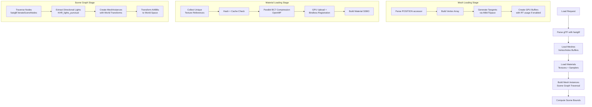

The glTF scene loader is Himalaya's bridge between industry-standard 3D assets and the rendering pipeline. It parses glTF 2.0 files using the fastgltf library, transforms the hierarchical node structure into GPU-ready resources, and populates the scene data structures that the renderer consumes each frame. This page covers the loading pipeline architecture, resource transformation, and the relationship between glTF concepts and Himalaya's internal representations.

Sources: [scene_loader.h](https://github.com/1PercentSync/himalaya/blob/main/app/include/himalaya/app/scene_loader.h#L1-L171), [scene_loader.cpp](https://github.com/1PercentSync/himalaya/blob/main/app/src/scene_loader.cpp#L1-L746)

## Architecture Overview

The `SceneLoader` class orchestrates a four-stage pipeline that converts glTF assets into renderable scene data. Each stage handles a distinct aspect of the transformation: parsing, mesh extraction, material processing, and scene graph flattening. The loader maintains ownership of all created GPU resources and provides a `destroy()` method for clean scene switching.

Sources: [scene_loader.cpp](https://github.com/1PercentSync/himalaya/blob/main/app/src/scene_loader.cpp#L219-L270), [scene_loader.h](https://github.com/1PercentSync/himalaya/blob/main/app/include/himalaya/app/scene_loader.h#L41-L98)

## The Loading Pipeline

### Stage 1: Parsing with fastgltf

The loader uses fastgltf with the `KHR_lights_punctual` extension enabled to parse both the JSON structure and binary data. The parser loads external buffers and images automatically, handling both `.gltf` (with separate `.bin` files) and `.glb` (self-contained binary) formats. Error handling ensures that parsing failures result in a clean empty scene rather than partial state.

Sources: [scene_loader.cpp](https://github.com/1PercentSync/himalaya/blob/main/app/src/scene_loader.cpp#L238-L259)

### Stage 2: Mesh Loading

Each glTF primitive becomes an independent `Mesh` structure containing GPU vertex and index buffers. The loader processes vertex attributes systematically: POSITION is required by the glTF spec, while NORMAL, TEXCOORD_0, TANGENT, and TEXCOORD_1 are optional with sensible defaults. When tangents are missing but normals and UVs exist, the loader invokes MikkTSpace to generate proper tangent frames for normal mapping. For non-indexed primitives, the loader generates sequential indices automatically. The resulting buffers are created with `ShaderDeviceAddress` and `AccelStructBuildInput` usage when ray tracing is supported, enabling BLAS construction without resource recreation.

Sources: [scene_loader.cpp](https://github.com/1PercentSync/himalaya/blob/main/app/src/scene_loader.cpp#L272-L437), [mesh.h](https://github.com/1PercentSync/himalaya/blob/main/framework/include/himalaya/framework/mesh.h#L1-L92)

### Stage 3: Material and Texture Processing

Material loading implements a sophisticated three-phase pipeline to maximize throughput and minimize redundant work. First, the loader collects unique (texture_index, role) pairs across all materials, ensuring that shared textures are processed only once. Second, it computes content hashes of the raw image bytes and checks the disk cache—cache hits skip decoding entirely. For cache misses, images are decoded and compressed in parallel using OpenMP, with BC7 compression format selected by role: Color data uses BC7_SRGB for gamma correctness, linear data (roughness, metallic, occlusion) uses BC7_UNORM, and normal maps use BC5_UNORM for optimal quality. Finally, compressed textures are uploaded to GPU and registered in the bindless descriptor array.

Sources: [scene_loader.cpp](https://github.com/1PercentSync/himalaya/blob/main/app/src/scene_loader.cpp#L439-L621), [texture.h](https://github.com/1PercentSync/himalaya/blob/main/framework/include/himalaya/framework/texture.h#L1-L217)

### Stage 4: Scene Graph Traversal

The loader uses fastgltf's `iterateSceneNodes` to traverse the scene graph, accumulating world transforms and creating `MeshInstance` structures. Each node with a mesh reference generates one `MeshInstance` per primitive, with the world transform matrix applied to both the instance and its local AABB. Directional lights from the `KHR_lights_punctual` extension are extracted during traversal, with their direction computed from the node's world transform (glTF lights point along -Z). The final scene bounds are computed as the union of all instance world AABBs, providing the renderer with spatial context for shadow distance calculations and camera positioning.

Sources: [scene_loader.cpp](https://github.com/1PercentSync/himalaya/blob/main/app/src/scene_loader.cpp#L623-L682), [scene_data.h](https://github.com/1PercentSync/himalaya/blob/main/framework/include/himalaya/framework/scene_data.h#L1-L103)

## Data Structure Mapping

The loader transforms glTF concepts into Himalaya's internal representations through well-defined conversion functions. Understanding these mappings is essential for debugging material behavior or extending the loader.

| glTF Concept | Himalaya Structure | Key Mapping Details |
|-------------|-------------------|---------------------|
| `mesh.primitives[]` | `framework::Mesh` | One Mesh per primitive; `group_id` = glTF mesh index for BLAS grouping |
| `material` | `framework::MaterialInstance` + `GPUMaterialData` | SSBO index matches material instance order; texture indices are bindless array indices |
| `texture` + `sampler` | `rhi::ImageHandle` + `rhi::SamplerHandle` | Sampler deduplicated by glTF sampler index; texture deduplicated by (index, role) |
| `node.transform` | `MeshInstance.transform` | Column-major matrix converted to glm::mat4 |
| `KHR_lights_punctual` | `framework::DirectionalLight` | Direction extracted from node transform; color and intensity passed through |
| `alphaMode` | `framework::AlphaMode` | Opaque=0, Mask=1, Blend=2; determines pass routing |

Sources: [scene_loader.cpp](https://github.com/1PercentSync/himalaya/blob/main/app/src/scene_loader.cpp#L106-L216), [material_system.h](https://github.com/1PercentSync/himalaya/blob/main/framework/include/himalaya/framework/material_system.h#L1-L160)

## Sampler Conversion

glTF samplers map directly to Vulkan samplers with careful handling of the minification filter modes. The conversion respects glTF defaults (linear filtering, repeat wrapping) and properly encodes the mipmapping configuration. When no mipmapping is specified (Nearest or Linear without MipMap suffix), `max_lod` is clamped to 0 to disable mip sampling. Anisotropic filtering is applied uniformly based on the RHI's reported maximum.

Sources: [scene_loader.cpp](https://github.com/1PercentSync/himalaya/blob/main/app/src/scene_loader.cpp#L107-L177)

## Resource Ownership and Cleanup

The `SceneLoader` maintains ownership of all GPU resources it creates, storing handles in internal vectors for deterministic cleanup. The `destroy()` method unregisters bindless textures before destroying images (preventing descriptor leaks), then destroys samplers and buffers in dependency order. This design supports scene switching: the application can call `destroy()` followed by `load()` with a new path, and the renderer will seamlessly transition to the new scene using the same material system and default resources.

Sources: [scene_loader.cpp](https://github.com/1PercentSync/himalaya/blob/main/app/src/scene_loader.cpp#L684-L720), [scene_loader.h](https://github.com/1PercentSync/himalaya/blob/main/app/include/himalaya/app/scene_loader.h#L128-L140)

## Integration with the Application

Scene loading occurs during `Application::init()` within an immediate command buffer scope. The loader receives references to the resource manager, descriptor manager, and material system, along with the renderer's default textures and sampler for fallback resolution. After loading, the application queries `scene_bounds()` to configure shadow distances and camera positioning appropriately for the scene's spatial extent.

Sources: [application.cpp](https://github.com/1PercentSync/himalaya/blob/main/app/src/application.cpp#L90-L110)

## Related Documentation

- [Mesh and Geometry Management](https://github.com/1PercentSync/himalaya/blob/main/14-mesh-and-geometry-management) — Vertex format, tangent generation, and buffer management
- [Material System and PBR](https://github.com/1PercentSync/himalaya/blob/main/13-material-system-and-pbr) — GPU material layout and SSBO management
- [IBL and Texture Processing](https://github.com/1PercentSync/himalaya/blob/main/17-ibl-and-texture-processing) — Texture compression, mip generation, and caching
- [Scene Data and Culling](https://github.com/1PercentSync/himalaya/blob/main/16-scene-data-and-culling) — MeshInstance structure and frustum culling integration