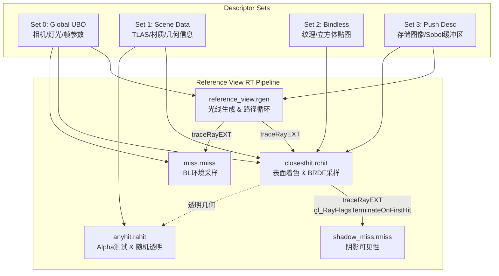
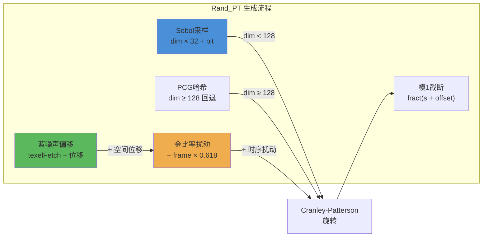
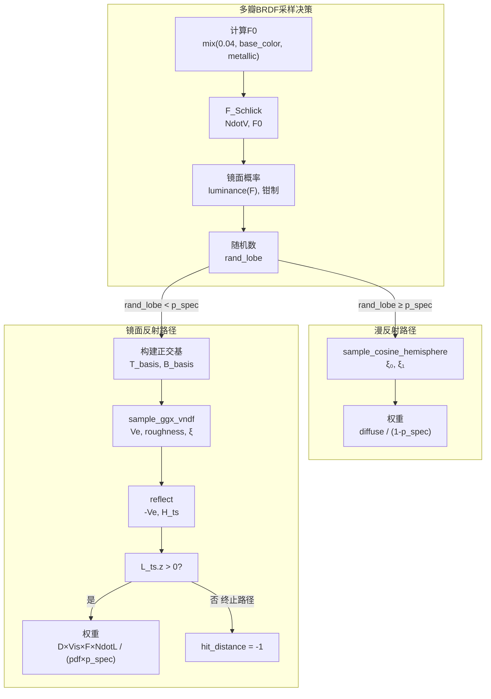
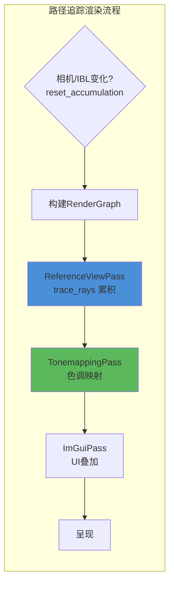

路径追踪参考视图（Reference View Pass）是 Himalaya 渲染器的**路径追踪渲染管线核心组件**，提供全物理精确的离线级渲染质量作为实时渲染的参考基准。该 Pass 采用无偏蒙特卡洛路径追踪算法，通过逐像素累积多个帧的独立路径采样实现渐进式收敛，最终输出基于物理的准确光照结果。与实时渲染管线（前向渲染、GTAO、阴影系统）不同，路径追踪参考视图消除了屏幕空间近似带来的系统性偏差，成为评估其他渲染技术准确性的黄金标准。

路径追踪参考视图在设计上遵循 **Mode A 架构** —— 将完整的表面着色计算集中在最近命中着色器（closest-hit shader）中，光线生成着色器（raygen shader）仅负责路径遍历和辐射度累积。这种架构选择确保了代码的清晰分离：光线生成着色器专注于采样策略和路径管理，而命中着色器专注于材质响应和光照计算。这种分离使得算法改进可以独立进行，而不需要重构整个渲染系统。

当前实现支持标准 PBR 材质模型（Metallic-Roughness 工作流）、Image-Based Lighting 环境光照、方向光直接照明（Next Event Estimation）、以及用于降噪器输入的 OIDN 辅助缓冲区（反照率和法线）。Russian Roulette 路径终止策略和萤火虫钳制（Firefly Clamping）机制保证了复杂场景的数值稳定性。

Sources: [reference_view_pass.h](https://github.com/1PercentSync/himalaya/blob/main/passes/include/himalaya/passes/reference_view_pass.h#L1-L134), [reference_view.rgen](https://github.com/1PercentSync/himalaya/blob/main/shaders/rt/reference_view.rgen#L1-L144), [closesthit.rchit](https://github.com/1PercentSync/himalaya/blob/main/shaders/rt/closesthit.rchit#L1-L227)

## 管线架构与着色器组织

路径追踪参考视图采用 Vulkan 光线追踪管线，由五个专用着色器阶段协同工作，通过共享的 Push Constants 和描述符集布局实现数据交换。管线设计遵循 SBT（Shader Binding Table）三区域结构：光线生成区域（1 条目）、缺失命中区域（2 条目：环境光照 + 阴影）、命中组区域（1 条目：最近命中 + 可选任意命中）。

着色器阶段的职责划分体现了清晰的渲染管线分离原则。光线生成着色器 `reference_view.rgen` 作为入口点，负责生成主光线、执行路径遍历循环、管理累积缓冲区，以及协调各次反弹的路径状态。最近命中着色器 `closesthit.rchit` 承担最繁重的计算任务，包括顶点属性插值、法线贴图解码、材质属性采样、Next Event Estimation 直接光照计算、多瓣 BRDF 重要性采样，以及次光线的生成参数输出。任意命中着色器 `anyhit.rahit` 专门处理透明材质（Alpha Mask 和 Alpha Blend），通过硬件加速的透明度测试和随机透明丢弃实现正确的透明表面交互。环境缺失命中着色器 `miss.rmiss` 在光线离开场景边界时采样 IBL 立方体贴图提供环境辐射度，而阴影缺失命中着色器 `shadow_miss.rmiss` 则标记方向光未被遮挡。

**SBT 布局与着色器组映射**：

| 区域 | 条目数 | 着色器组成 | 功能描述 |
|------|--------|-----------|----------|
| RayGen | 1 | `reference_view.rgen` | 主光线生成与路径遍历 |
| Miss 0 | 1 | `miss.rmiss` | 环境光照采样（IBL） |
| Miss 1 | 1 | `shadow_miss.rmiss` | 阴影可见性标记 |
| Hit Group 0 | 1 | `closesthit.rchit` + `anyhit.rahit` | 表面交互与材质计算 |

描述符集布局采用四层架构确保与现有渲染基础设施的兼容性。Set 0 和 Set 1 与光栅化管线共享，分别绑定每帧更新的 Uniform 缓冲区（相机矩阵、灯光参数、全局配置）和场景级资源（TLAS、材质数组、几何信息）。Set 2 提供 Bindless 纹理和立方体贴图的全局访问。Set 3 作为推送描述符（Push Descriptor）专门为路径追踪动态绑定，包含三个存储图像（累积缓冲区、OIDN 辅助反照率、OIDN 辅助法线）和一个 SSBO（Sobol 方向数表）。

Push Constants 布局（20 字节）经过精心设计以最小化 CPU-GPU 数据传输开销，同时提供路径追踪所需的全部动态参数。`max_bounces` 控制最大路径深度（默认 8），`sample_count` 指示当前累积样本索引（用于运行平均），`frame_seed` 提供帧级时序去相关种子，`blue_noise_index` 指定蓝噪声纹理的 Bindless 索引，`max_clamp` 启用萤火虫钳制阈值。

Sources: [rt_pipeline.h](https://github.com/1PercentSync/himalaya/blob/main/rhi/include/himalaya/rhi/rt_pipeline.h#L1-L110), [reference_view_pass.cpp](https://github.com/1PercentSync/himalaya/blob/main/passes/src/reference_view_pass.cpp#L21-L185), [reference_view.rgen](https://github.com/1PercentSync/himalaya/blob/main/shaders/rt/reference_view.rgen#L23-L36)

## 采样与随机数生成策略

路径追踪参考视图采用 **分层准蒙特卡洛采样策略（Stratified Quasi-Monte Carlo）**，结合 Sobol 低差异序列、蓝噪声 Cranley-Patterson 旋转和金比率时序扰动，实现高效的空间-时序去相关。这种混合策略相比纯随机采样或纯准随机采样具有显著优势：Sobol 序列保证样本在超立方体中的均匀分布，蓝噪声偏移消除低维结构伪影，金比率扰动确保帧间样本的渐进覆盖。

Sobol 序列的实现基于方向数表（Direction Numbers），预计算存储于 16KB SSBO（128 维度 × 32 位 × 32 位 = 4096 条目）。采样时通过位运算 XOR 累加活跃位对应的方向数，将样本索引转换为 [0, 1) 区间的浮点值。对于超出预计算维度（≥128）的采样需求，系统回退至 PCG 哈希提供高质量伪随机数。

**采样维度分配策略** 经过精心规划以最大化去相关效果。维度 0-1 用于像素内子像素抖动（Subpixel Jitter），实现抗锯齿效果。每个路径反弹消耗 4 个维度：瓣选择（Lobe Select）、BRDF 采样 ξ₀、BRDF 采样 ξ₁、Russian Roulette 概率。这种结构化分配确保相同反弹次数的采样在不同维度上独立演化，避免维度间相关性导致的系统性偏差。

蓝噪声 Cranley-Patterson 旋转通过将准随机样本与空间变化的蓝噪声偏移相加（模 1）实现。每个维度使用不同的空间位移（基于质数乘数 73 和 127）从同一 128×128 蓝噪声纹理获取偏移值，确保跨维度的去相关。时序扰动通过金比率（φ ≈ 0.618）的分数部分累加实现，提供最优的帧间样本分布。

Russian Roulette 作为无偏路径终止策略，在反弹次数 ≥2 时激活。生存概率计算为当前路径吞吐量的最大通道值（钳制于 [0.05, 0.95] 避免极端概率），确保高贡献路径优先延续。路径终止时，吞吐量需除以生存概率以保持估计的无偏性。萤火虫钳制（Firefly Clamping）作为可选的方差缩减技术，仅在间接反弹（bounce > 0）上应用，钳制单个反弹贡献的最大辐射度值，有效抑制材质异常或数值误差导致的像素级尖峰。

Sources: [pt_common.glsl](https://github.com/1PercentSync/himalaya/blob/main/shaders/rt/pt_common.glsl#L190-L396), [reference_view.rgen](https://github.com/1PercentSync/himalaya/blob/main/shaders/rt/reference_view.rgen#L41-L86)

## BRDF 多瓣重要性采样

路径追踪参考视图实现完整的 **Disney-style PBR 多瓣 BRDF 模型**，包含漫反射瓣（Lambertian）和镜面反射瓣（GGX Smith），通过基于 Fresnel 反射率的动态概率进行重要性采样。这种多瓣架构准确捕捉了真实材质的物理行为：电介质在低入射角呈现漫反射主导，金属材质在所有角度呈现镜面主导，粗糙表面呈现各向同性散射。

漫反射瓣采用 **余弦加权半球采样**，PDF = cos(θ)/π。通过极坐标变换从两个均匀随机数生成切线空间方向向量：φ = 2πξ₀，cos(θ) = √ξ₁。采样权重简化为反照率除以 (1 - p_spec)，因为 BRDF×cos(θ)/PDF 的精确抵消产生常数权重。

镜面反射瓣采用 **Heitz 2018 GGX 可见法线分布函数（VNDF）重要性采样**，这是当前工业标准的最优算法。VNDF 采样直接生成可见微表面法线（而非半向量），通过预计算几何可见性 G1 显著降低无效样本率（零权重样本仅出现在微表面背向观察方向时）。算法流程包括：将观察向量变换至半球配置（粗糙度 α 缩放 xy 分量）、构建 Vh 的正交基、在单位圆盘上均匀采样并重新投影至半球帽、逆变换回椭球配置。PDF 计算需考虑雅可比行列式从半向量空间到入射方向的转换。

多瓣选择概率基于 Fresnel 反射率的亮度通道计算（F.r × 0.2126 + F.g × 0.7152 + F.b × 0.0722），钳制于 [0.01, 0.99] 避免零概率导致的除零错误。这种基于物理的权重分配确保采样频率与 BRDF  lobes 的实际能量贡献成正比，最大化采样效率。

Next Event Estimation（NEE）为方向光提供直接光照的无偏估计。对于每个方向光源，系统从表面点向光源方向发射阴影光线（使用 `gl_RayFlagsTerminateOnFirstHitEXT | gl_RayFlagsSkipClosestHitShaderEXT` 标志优化性能），若未被遮挡则计算完整的 BRDF 评估并累加至辐射度贡献。由于方向光是δ分布，MIS 权重为 1（仅采样光源，无需与 BRDF 采样平衡）。

Sources: [pt_common.glsl](https://github.com/1PercentSync/himalaya/blob/main/shaders/rt/pt_common.glsl#L279-L369), [closesthit.rchit](https://github.com/1PercentSync/himalaya/blob/main/shaders/rt/closesthit.rchit#L105-L218)

## 透明材质与任意命中着色器

任意命中着色器 `anyhit.rahit` 专门处理非不透明几何体的光线交互，支持 glTF 规范的两种 Alpha 模式：Mask（遮罩）和 Blend（混合）。Opaque 材质通过 BLAS 几何标志 `VK_GEOMETRY_OPAQUE_BIT_KHR` 完全跳过任意命中调用，避免不必要的着色器调度开销。

Alpha Mask 模式执行硬阈值测试：若基础颜色纹理的 Alpha 通道（经 factor 缩放）低于 `alpha_cutoff` 参数，调用 `ignoreIntersectionEXT` 忽略当前相交，允许光线穿透至后续几何体。这种二进制透明适用于树叶、铁丝网等镂空材质。

Alpha Blend 模式采用 **随机透明度（Stochastic Transparency）** 实现单散射路径追踪下的正确透明渲染。通过像素坐标、反弹种子、几何索引和图元 ID 的组合哈希生成 [0,1) 均匀随机数，与材质 Alpha 值比较决定是否忽略相交。这种概率性方法在多次采样的渐进累积中收敛至正确的 Alpha 混合结果，无需显式的透明排序或多层深度剥离。

顶点属性插值在任意命中着色器中进行轻量化处理：仅插值 UV0 坐标用于纹理采样，跳过法线、切线等完整 HitAttributes 计算以优化性能。索引和顶点数据通过 buffer_reference 机制直接访问 GPU 地址空间，避免额外的描述符绑定。

Sources: [anyhit.rahit](https://github.com/1PercentSync/himalaya/blob/main/shaders/rt/anyhit.rahit#L1-L83)

## 渐进累积与 OIDN 集成

路径追踪参考视图采用 **运行平均（Running Average）累积策略** 实现渐进式收敛。每帧每个像素执行一次独立的路径采样，结果与历史累积值按 1/(n+1) 权重混合。首次采样（`sample_count == 0`）直接写入累积缓冲区，后续采样执行增量平均。这种累积方式在相机静态时持续收敛，相机或环境变化时通过 `reset_accumulation()` 重置累积状态。

OIDN（Intel Open Image Denoise）降噪器集成通过专用辅助缓冲区实现。最近命中着色器在首次反弹（`payload.bounce == 0`）时输出两种辅助数据：反照率图像（`diffuse_color`，R8G8B8A8 格式）和法线图像（`N_shading`，R16G16B16A16F 格式）。这些缓冲区为降噪器提供物理正确的基础材质属性和几何法线信息，显著改善低样本数下的降噪质量。辅助图像每帧完全重写（非累积），因为降噪器期望每帧的瞬时几何和材质属性而非时序平均。

累积管理通过 CPU 端的 `sample_count_` 和 `frame_seed_` 状态变量实现。每帧记录后 `sample_count_` 递增驱动运行平均权重，`frame_seed_` 递增提供时序去相关种子。相机视口变换或 IBL 旋转变化时，渲染器调用 `reset_accumulation()` 将 `sample_count_` 归零，触发下一帧的完全重写而非混合。

Sources: [reference_view_pass.cpp](https://github.com/1PercentSync/himalaya/blob/main/passes/src/reference_view_pass.cpp#L187-L324), [closesthit.rchit](https://github.com/1PercentSync/himalaya/blob/main/shaders/rt/closesthit.rchit#L95-L103), [renderer_pt.cpp](https://github.com/1PercentSync/himalaya/blob/main/app/src/renderer_pt.cpp#L59-L68)

## 渲染管线集成

路径追踪渲染路径 `render_path_tracing` 将参考视图 Pass 与色调映射 Pass 串联，形成完整的端到端渲染流程。与光栅化路径不同，路径追踪路径跳过几何阶段（深度预渲染、前向渲染、天空盒），直接从光线追踪开始。

渲染图构建时，累积缓冲区根据当前样本状态决定初始布局：已有历史数据时使用 `ReadWrite` 访问（光线生成着色器需执行 `imageLoad` 读取历史值），首次渲染时使用 `Undefined` 布局（着色器完全覆盖）。色调映射 Pass 的 Set 2 绑定 0 动态更新为累积缓冲区的后备图像，确保采样器正确读取路径追踪输出。

路径追踪与光栅化共享资源管理基础设施：TLAS、材质系统、Bindless 纹理、IBL 立方体贴图。这种统一资源架构确保场景加载、材质编辑、环境旋转等操作在两种渲染模式下无缝工作。相机参数、灯光配置、后处理设置同样复用，最小化模式切换的认知负担。

Sources: [renderer_pt.cpp](https://github.com/1PercentSync/himalaya/blob/main/app/src/renderer_pt.cpp#L1-L106), [frame_context.h](https://github.com/1PercentSync/himalaya/blob/main/framework/include/himalaya/framework/frame_context.h#L77-L84)

## 相关阅读与进阶参考

路径追踪参考视图的实现依赖于 Himalaya 渲染器的多项基础设施组件。理解以下关联技术有助于深入掌握完整渲染管线的工作原理：

**RT 基础设施**：路径追踪管线建立在 [RT基础设施与加速结构](https://github.com/1PercentSync/himalaya/blob/main/25-rtji-chu-she-shi-yu-jia-su-jie-gou) 提供的顶层加速结构（TLAS）和底层加速结构（BLAS）管理之上，包括几何信息缓冲区、材质数据布局和 Shader Binding Table 构建机制。

**材质系统**：BRDF 计算和纹理采样复用 [材质系统架构](https://github.com/1PercentSync/himalaya/blob/main/13-cai-zhi-xi-tong-jia-gou) 定义的 `GPUMaterialData` 结构和 Bindless 纹理索引方案，确保路径追踪与光栅化对相同材质资产的一致性解释。

**全局光照基础**：IBL 环境光照采样使用 [IBL与光照探针](https://github.com/1PercentSync/himalaya/blob/main/9-xuan-ran-kuang-jia-ceng-zi-yuan-yu-tu-guan-li) 预计算的辐照度和预过滤环境贴图，通过金比率旋转支持环境方向的动态调整。

**随机数生成**：Sobol 序列和蓝噪声纹理的生成原理详见项目脚本 `generate_sobol.py` 和 `generate_poisson_disk.py`，这些离线工具生成运行时的采样数据资源。

未来演进方向包括：多重要性采样（MIS）平衡 NEE 与 BRDF 采样、直接光源的显式采样（Area Lights）、体积光散射（Volumetric）、以及基于 OIDN 的时序降噪集成。这些增强将在 [Milestone 3](https://github.com/1PercentSync/himalaya/blob/main/29-milestone-3-dong-tai-wu-ti-yu-xing-neng-you-hua) 及远期规划中逐步实现。