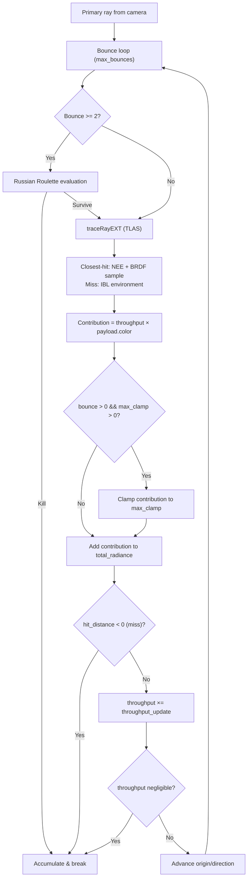
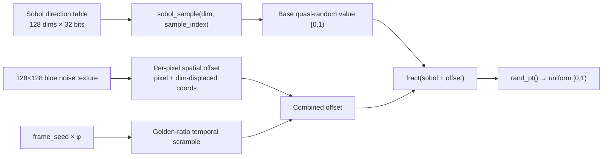
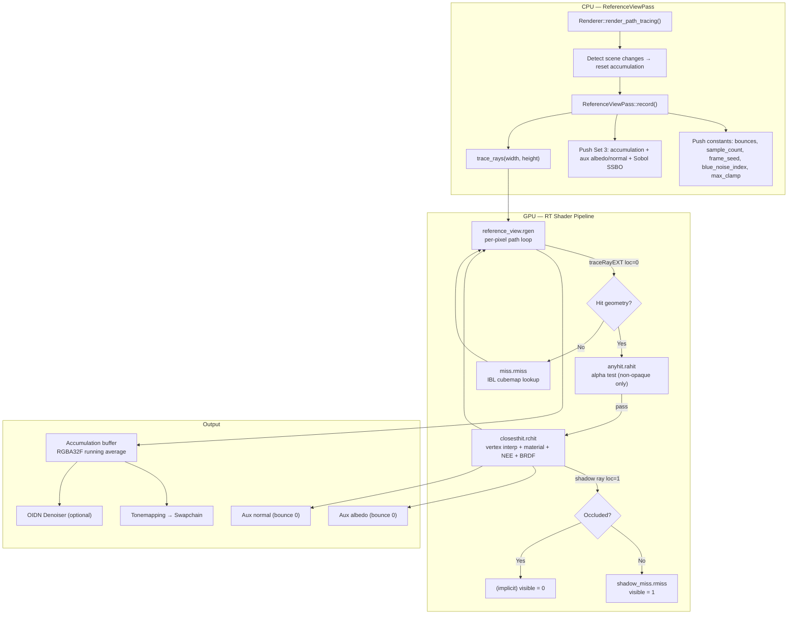

The path tracing pipeline in Himalaya implements a physically-based Monte Carlo light transport simulator across five GPU shader stages: a ray generation shader that orchestrates the path loop and accumulation, a closest-hit shader that performs full surface shading with Next Event Estimation (NEE), environment and shadow miss shaders that handle ray escape, and an any-hit shader for alpha-tested transparency. These shaders follow a **Mode A architecture** where all shading logic resides in the closest-hit stage, leaving the raygen shader responsible only for path bookkeeping and running-average accumulation. The system produces an incrementally-converging image through a per-frame Sobol + blue-noise quasi-random sample, with optional OIDN denoiser auxiliary outputs (albedo and normal buffers) captured on the first bounce.

Sources: [reference_view.rgen](https://github.com/1PercentSync/himalaya/blob/main/shaders/rt/reference_view.rgen#L1-L143), [closesthit.rchit](https://github.com/1PercentSync/himalaya/blob/main/shaders/rt/closesthit.rchit#L1-L14), [pt_common.glsl](https://github.com/1PercentSync/himalaya/blob/main/shaders/rt/pt_common.glsl#L1-L10)

## Shader File Inventory and SBT Layout

The path tracing shaders live in `shaders/rt/` and share a common include header `pt_common.glsl`. The Vulkan Shader Binding Table (SBT) is constructed by the RHI layer with four shader groups, each occupying a specific SBT index that maps directly to the `traceRayEXT` call parameters.

| File | Stage | SBT Group | SBT Index | Purpose |
|---|---|---|---|---|
| `reference_view.rgen` | Ray Generation | Group 0 | — (caller) | Primary ray, path loop, accumulation |
| `miss.rmiss` | Miss | Group 1 | 0 (environment) | IBL cubemap lookup on ray escape |
| `shadow_miss.rmiss` | Miss | Group 2 | 1 (shadow) | Mark light visibility (no occluder) |
| `closesthit.rchit` | Closest Hit | Group 3 | — (hit group) | Full surface shading + BRDF sampling |
| `anyhit.rahit` | Any Hit | Group 3 | — (hit group) | Alpha mask / stochastic transparency |
| `pt_common.glsl` | Shared header | — | — | Payloads, sampling, BRDF, vertex access |

The C++ side assembles these five shader modules into a single RT pipeline via `RTPipelineDesc`, producing an SBT with the layout: `[raygen(1)] [miss_env(1), miss_shadow(1)] [hit_group(1)]`. The `max_recursion_depth` is set to **1** — the path tracing loop is implemented iteratively in the raygen shader rather than recursively via GPU ray recursion, which avoids stack overflow and gives explicit control over Russian Roulette.

Sources: [rt_pipeline.cpp](https://github.com/1PercentSync/himalaya/blob/main/rhi/src/rt_pipeline.cpp#L16-L73), [reference_view_pass.cpp](https://github.com/1PercentSync/himalaya/blob/main/passes/src/reference_view_pass.cpp#L165-L176), [rt_pipeline.h](https://github.com/1PercentSync/himalaya/blob/main/rhi/include/himalaya/rhi/rt_pipeline.h#L24-L46)

## Include Hierarchy and Descriptor Architecture

Each RT shader follows the same preamble pattern: define `HIMALAYA_RT`, include the global bindings header, then include `rt/pt_common.glsl`. The `HIMALAYA_RT` guard activates ray-tracing-specific bindings in `bindings.glsl` (TLAS, `GeometryInfo` buffer) and enables GLSL extensions.

```
reference_view.rgen / closesthit.rchit / miss.rmiss / anyhit.rahit
  │
  ├── #define HIMALAYA_RT
  ├── common/bindings.glsl ───── Set 0 (GlobalUBO, lights, materials, instances, TLAS, GeometryInfo)
  │     ├── common/constants.glsl
  │     └── [HIMALAYA_RT guard] Set 0 bindings 4-5 (TLAS, GeometryInfo)
  ├── rt/pt_common.glsl
  │     ├── GL_EXT extensions (ray_tracing, buffer_reference, etc.)
  │     ├── common/brdf.glsl ──── D_GGX, V_SmithGGX, F_Schlick
  │     │     └── common/constants.glsl
  │     ├── Payload structs, sampling functions, vertex access, Russian Roulette
  │     └── Set 3 binding 3 (Sobol direction SSBO)
  └── [closesthit only] common/normal.glsl
  └── [miss only] common/transform.glsl
```

The descriptor set layout follows the system-wide architecture documented in [Bindless Descriptor Architecture](https://github.com/1PercentSync/himalaya/blob/main/7-bindless-descriptor-architecture-three-set-layout-and-texture-registration). Sets 0–2 provide the same global data available to rasterization shaders. Set 3 is a **push descriptor** exclusive to the RT pipeline, containing per-frame storage images and the Sobol table:

| Set | Binding | Type | Content |
|---|---|---|---|
| 0 | 0 | Uniform Buffer | `GlobalUBO` — matrices, camera, lighting, IBL parameters |
| 0 | 1 | SSBO | `directional_lights[]` |
| 0 | 2 | SSBO | `materials[]` |
| 0 | 3 | SSBO | `instances[]` |
| 0 | 4 | Acceleration Structure | `tlas` (top-level acceleration structure) |
| 0 | 5 | SSBO | `geometry_infos[]` (device addresses for vertex/index buffers) |
| 1 | 0 | Sampler2D[] | Bindless texture array |
| 1 | 1 | SamplerCube[] | Bindless cubemap array |
| 3 | 0 | Storage Image (rgba32f) | Accumulation buffer (running average) |
| 3 | 1 | Storage Image (rgba16f) | OIDN auxiliary albedo |
| 3 | 2 | Storage Image (rgba16f) | OIDN auxiliary normal |
| 3 | 3 | SSBO | Sobol direction numbers (128 dims × 32 bits = 16 KB) |

Sources: [bindings.glsl](https://github.com/1PercentSync/himalaya/blob/main/shaders/common/bindings.glsl#L86-L189), [pt_common.glsl](https://github.com/1PercentSync/himalaya/blob/main/shaders/rt/pt_common.glsl#L12-L21), [reference_view_pass.cpp](https://github.com/1PercentSync/himalaya/blob/main/passes/src/reference_view_pass.cpp#L53-L97)

## Push Constants

All five shader stages share a 20-byte push constant block, visible to raygen, closest-hit, and any-hit stages. This compact structure is pushed once per frame by `ReferenceViewPass::record()` and controls the core path tracing parameters.

```glsl
layout(push_constant) uniform PushConstants {
    uint  max_bounces;      // Maximum path depth (default 8)
    uint  sample_count;     // Samples accumulated so far (0 = first frame, overwrite)
    uint  frame_seed;       // Per-frame temporal decorrelation seed
    uint  blue_noise_index; // Bindless index of the 128×128 blue noise texture
    float max_clamp;        // Firefly clamping threshold (0 = disabled)
} pc;
```

The `sample_count` field drives the running-average formula: on frame 0, the accumulation buffer is overwritten entirely; on subsequent frames, an incremental blend `mix(old, new, 1/(n+1))` converges toward the true pixel radiance. The `frame_seed` provides golden-ratio temporal scrambling to decorrelate the Sobol sequence across frames.

Sources: [reference_view.rgen](https://github.com/1PercentSync/himalaya/blob/main/shaders/rt/reference_view.rgen#L25-L31), [reference_view_pass.cpp](https://github.com/1PercentSync/himalaya/blob/main/passes/src/reference_view_pass.cpp#L24-L32), [reference_view_pass.cpp](https://github.com/1PercentSync/himalaya/blob/main/passes/src/reference_view_pass.cpp#L288-L301)

## Ray Generation Shader — Path Loop and Accumulation

The ray generation shader ([reference_view.rgen](https://github.com/1PercentSync/himalaya/blob/main/shaders/rt/reference_view.rgen)) is the entry point for every pixel's path tracing computation. It constructs a primary ray from the camera's inverse projection matrix, executes an iterative bounce loop with Russian Roulette termination, and writes the accumulated radiance into the accumulation buffer.

### Primary Ray Construction

The camera ray is derived from the screen-space pixel coordinate using the inverse view-projection decomposition. A subpixel jitter is applied via the Sobol quasi-random number generator at dimensions 0 and 1, providing anti-aliasing that converges over multiple frames.

```
pixel + jitter → NDC → clip_space → inverse_projection → view_target → inverse_view → world ray
```

The jittered pixel center is converted to normalized device coordinates `[-1, 1]`, then multiplied by `inv_projection` to obtain a view-space direction, and finally transformed by `inv_view` to produce a world-space ray. The camera position is extracted as `(inv_view * vec4(0,0,0,1)).xyz`. Reverse-Z is assumed (clip z=1 maps to the near plane).

Sources: [reference_view.rgen](https://github.com/1PercentSync/himalaya/blob/main/shaders/rt/reference_view.rgen#L46-L65)

### Iterative Bounce Loop

The path tracing loop runs up to `max_bounces` iterations. Each iteration traces a single ray against the TLAS with a full 0xFF cull mask, dispatches to the closest-hit or miss shader via payload location 0, and accumulates the returned radiance contribution weighted by the current throughput. The architecture uses **Mode A** — the raygen shader is deliberately thin, delegating all material evaluation, BRDF sampling, and NEE to the closest-hit shader.



The Russian Roulette check activates at bounce ≥ 2, using Sobol dimension `2 + bounce × 4 + 3`. The survival probability is clamped to `[0.05, 0.95]` based on throughput luminance, and the throughput is divided by the survival probability on survival to maintain an unbiased estimator. Firefly clamping applies only to indirect bounces (bounce > 0), preventing the clamp from biasing direct illumination.

Sources: [reference_view.rgen](https://github.com/1PercentSync/himalaya/blob/main/shaders/rt/reference_view.rgen#L67-L130)

### Running Average Accumulation

After the bounce loop terminates, the total radiance is blended into the accumulation buffer using an incremental running average. The first frame overwrites; subsequent frames blend with weight `1/(n+1)`, which is mathematically equivalent to averaging all frames equally.

```
result_n = (n × result_{n-1} + sample_n) / (n + 1) = mix(old, new, 1/(n+1))
```

The accumulation buffer is `RGBA32F`, storing the running-average RGB and a constant alpha of 1.0. Convergence resets are triggered by the `ReferenceViewPass` when the camera, IBL rotation, light configuration, bounce depth, or clamping threshold changes.

Sources: [reference_view.rgen](https://github.com/1PercentSync/himalaya/blob/main/shaders/rt/reference_view.rgen#L132-L143), [renderer_pt.cpp](https://github.com/1PercentSync/himalaya/blob/main/app/src/renderer_pt.cpp#L68-L95)

## Closest Hit Shader — Surface Shading and BRDF Sampling

The closest-hit shader ([closesthit.rchit](https://github.com/1PercentSync/himalaya/blob/main/shaders/rt/closesthit.rchit)) is the computational heart of the path tracer. For every ray that intersects geometry, it performs vertex attribute interpolation, material evaluation, normal mapping with geometric consistency correction, Next Event Estimation for directional lights (with shadow rays), and multi-lobe BRDF importance sampling to produce the next ray direction. It writes all results back through the `PrimaryPayload` structure at location 0.

### Geometry Lookup and Vertex Interpolation

Unlike rasterization where the GPU provides interpolated attributes, ray tracing requires manual vertex fetching. The shader uses `gl_InstanceCustomIndexEXT + gl_GeometryIndexEXT` to index into the `geometry_infos[]` SSBO, which provides device addresses for the vertex and index buffers. The `interleave_hit()` function from `pt_common.glsl` fetches three vertices via `buffer_reference` pointers, computes barycentric weights from the built-in `hitAttributeEXT vec2 bary`, and interpolates position, normal, tangent, and UVs.

The **face normal** is computed from the cross product of triangle edges rather than interpolated, giving a true geometric normal for the ray origin offset. Both the face normal and interpolated vertex normal are transformed via the normal matrix `transpose(inverse(model))`, which equals `mat3(gl_WorldToObjectEXT)` — but the tangent vector transforms as a direction via `mat3(gl_ObjectToWorldEXT)`. Back-facing normals are flipped to face the incoming ray direction.

Sources: [closesthit.rchit](https://github.com/1PercentSync/himalaya/blob/main/shaders/rt/closesthit.rchit#L48-L73), [pt_common.glsl](https://github.com/1PercentSync/himalaya/blob/main/shaders/rt/pt_common.glsl#L86-L112)

### Material Evaluation and Normal Mapping

Material parameters are fetched from bindless textures using the `GPUMaterialData` struct indexed by `geo.material_buffer_offset`. The base color, metallic-roughness, emissive, and normal maps are all sampled at the interpolated UV0 coordinate. The **metallic** value comes from the blue channel of the metallic-roughness texture (glTF convention), while **roughness** comes from the green channel with a minimum clamp of 0.04 to avoid numerical singularities in the GGX distribution.

Normal mapping uses the shared `get_shading_normal()` function from [normal.glsl](https://github.com/1PercentSync/himalaya/blob/main/shaders/common/normal.glsl), which constructs a TBN basis from the interpolated vertex normal and tangent, decodes the tangent-space normal from BC5-compressed RG channels, and transforms to world space. The result is passed through `ensure_normal_consistency()`, which reflects the shading normal about the geometric normal plane if the normal map pushes it below the surface — a critical correction for path tracing where an invalid shading normal causes energy loss and light leaking.

Sources: [closesthit.rchit](https://github.com/1PercentSync/himalaya/blob/main/shaders/rt/closesthit.rchit#L75-L89), [pt_common.glsl](https://github.com/1PercentSync/himalaya/blob/main/shaders/rt/pt_common.glsl#L150-L169)

### OIDN Auxiliary Output

On bounce 0 (the primary ray hit), the shader writes two auxiliary images for the OIDN denoiser: the **diffuse albedo** (`base_color * (1 - metallic)`) at Set 3 binding 1, and the **shading normal** at Set 3 binding 2. These captures are deferred to bounce 0 only, matching OIDN's expectation that auxiliary buffers represent the first visible surface per pixel. Subsequent bounces overwrite these image stores only on bounce 0, leaving the initial capture intact.

Sources: [closesthit.rchit](https://github.com/1PercentSync/himalaya/blob/main/shaders/rt/closesthit.rchit#L98-L103)

### Next Event Estimation — Directional Light Shadow Rays

The closest-hit shader implements explicit light sampling (NEE) for directional lights, which are treated as delta distributions with MIS weight = 1.0 (no multiple importance sampling needed for delta lights). For each directional light, the shader evaluates the half-vector-based Cook-Torrance BRDF with the Lambertian diffuse term, traces a visibility ray, and accumulates the contribution.

Shadow rays use the `gl_RayFlagsTerminateOnFirstHitEXT | gl_RayFlagsSkipClosestHitShaderEXT` flags — these are pure occlusion queries that only need a binary answer (visible or occluded). The shadow payload at location 1 defaults to `visible = 0` (occluded), and is set to `visible = 1` only by the shadow miss shader. The ray origin is offset using the robust integer-based `offset_ray_origin()` function (Wächter & Binder technique from *Ray Tracing Gems* Chapter 6), which manipulates the floating-point bit representation to avoid self-intersection artifacts without scene-dependent epsilon tuning.

Sources: [closesthit.rchit](https://github.com/1PercentSync/himalaya/blob/main/shaders/rt/closesthit.rchit#L109-L153), [pt_common.glsl](https://github.com/1PercentSync/himalaya/blob/main/shaders/rt/pt_common.glsl#L114-L148)

### Multi-Lobe BRDF Sampling

The next ray direction is sampled by selecting between the **specular** (GGX VNDF) and **diffuse** (cosine-weighted hemisphere) lobes based on a Fresnel-weighted probability. This multi-lobe approach ensures that both metallic surfaces (high specular probability) and dielectric materials (high diffuse probability) are sampled efficiently.

The **specular probability** is computed as the luminance of the Schlick Fresnel reflectance at the current view angle, clamped to `[0.01, 0.99]` to avoid zero-probability divisions. For each bounce, four Sobol dimensions are consumed:

| Dimension Offset | Purpose | Used By |
|---|---|---|
| `dim_base + 0` | Lobe selection (specular vs diffuse) | BRDF sampling |
| `dim_base + 1` | Random ξ₀ for BRDF sampling | VNDF or cosine |
| `dim_base + 2` | Random ξ₁ for BRDF sampling | VNDF or cosine |
| `dim_base + 3` | Russian Roulette | Path termination |

**Specular lobe**: Uses Heitz 2018 GGX VNDF (Visible Normal Distribution Function) importance sampling. The view direction is transformed to tangent space, a half-vector is sampled using the hemisphere-cap parameterization, and the reflected direction is computed. The throughput weight is `BRDF × cos(θ) / PDF / p_spec`, which simplifies to `D * V * F * NdotL / (pdf_ggx_vndf * p_spec)`. If the sampled direction falls below the surface (`L_ts.z <= 0`), the path terminates early.

**Diffuse lobe**: Uses cosine-weighted hemisphere sampling where the PDF equals `cos(θ) / π`. The Lambertian BRDF `diffuse_color * INV_PI` cancels with the PDF, yielding the elegant simplification `throughput_update = diffuse_color / (1 - p_spec)`.

Sources: [closesthit.rchit](https://github.com/1PercentSync/himalaya/blob/main/shaders/rt/closesthit.rchit#L155-L226), [pt_common.glsl](https://github.com/1PercentSync/himalaya/blob/main/shaders/rt/pt_common.glsl#L171-L369)

### Payload Contract

The closest-hit shader writes a well-defined contract to `PrimaryPayload` that the raygen shader consumes:

| Field | Meaning | On Miss |
|---|---|---|
| `color` | Emissive + NEE radiance contribution | IBL environment color |
| `next_origin` | Offset surface position for next ray | — |
| `next_direction` | BRDF-sampled direction for next bounce | — |
| `throughput_update` | Raw BRDF weight (raygen applies RR division) | — |
| `hit_distance` | Positive if hit, **-1 if miss** (termination signal) | -1.0 |
| `bounce` | Set by raygen, read by closesthit for OIDN guard | — |

The emissive contribution is added unconditionally to all bounces (a surface always self-emits regardless of the sampled direction), while NEE adds direct lighting from directional lights. The raygen shader multiplies the throughput by `throughput_update` and accumulates `throughput × payload.color`.

Sources: [closesthit.rchit](https://github.com/1PercentSync/himalaya/blob/main/shaders/rt/closesthit.rchit#L220-L226), [pt_common.glsl](https://github.com/1PercentSync/himalaya/blob/main/shaders/rt/pt_common.glsl#L25-L36)

## Miss Shaders — Environment and Shadow

### Environment Miss (SBT Index 0)

The [miss.rmiss](https://github.com/1PercentSync/himalaya/blob/main/shaders/rt/miss.rmiss) shader handles rays that escape all geometry. It applies the IBL Y-axis rotation to the ray direction (using precomputed sin/cos from `GlobalUBO`), samples the skybox cubemap at the rotated direction, and scales by `ibl_intensity`. The result is written to `payload.color` with `hit_distance = -1` to signal path termination. This effectively treats the environment as an infinite-area light — the environment radiance is accumulated through the same throughput multiplication as any other bounce contribution.

Sources: [miss.rmiss](https://github.com/1PercentSync/himalaya/blob/main/shaders/rt/miss.rmiss#L1-L31)

### Shadow Miss (SBT Index 1)

The [shadow_miss.rmiss](https://github.com/1PercentSync/himalaya/blob/main/shaders/rt/shadow_miss.rmiss) shader is the simplest stage — it sets `shadow_payload.visible = 1` to indicate that the shadow ray reached infinity without hitting any occluder. The caller (closest-hit shader) initializes `visible = 0` before tracing, so if any geometry is hit, the any-hit or implicit closest-hit invocation terminates the ray without reaching this miss shader. The `gl_RayFlagsTerminateOnFirstHitEXT` flag ensures that any opaque intersection immediately kills the ray.

Sources: [shadow_miss.rmiss](https://github.com/1PercentSync/himalaya/blob/main/shaders/rt/shadow_miss.rmiss#L1-L20)

## Any-Hit Shader — Alpha Test and Stochastic Transparency

The [anyhit.rahit](https://github.com/1PercentSync/himalaya/blob/main/shaders/rt/anyhit.rahit) shader handles non-opaque geometry, implementing two alpha modes from the glTF specification:

| `alpha_mode` | Behavior | Technique |
|---|---|---|
| 0 (Opaque) | Pass-through (should never reach anyhit) | Hardware skip via `VK_GEOMETRY_OPAQUE_BIT_KHR` |
| 1 (Mask) | Hard cutoff at `alpha_cutoff` | `ignoreIntersectionEXT` if `texel_alpha < cutoff` |
| 2 (Blend) | Stochastic alpha transparency | PCG hash random vs `texel_alpha`, `ignoreIntersectionEXT` on fail |

For performance, the any-hit shader performs a **lightweight UV interpolation** — it fetches only the three vertex UV0 coordinates (not the full `HitAttributes` struct) to sample the base color texture's alpha channel. This avoids the cost of interpolating position, normal, and tangent for what is essentially a binary accept/reject decision.

The stochastic alpha mode (mode 2) generates a per-hit random number by combining `gl_LaunchIDEXT`, `frame_seed`, `gl_PrimitiveID`, and `gl_GeometryIndexEXT` through a PCG hash. Over multiple accumulated frames, the stochastic acceptance probability converges to the true alpha value, producing correct transparency without alpha blending.

Opaque geometry (`alpha_mode == 0`) is excluded from any-hit processing at the BLAS construction level via `VK_GEOMETRY_OPAQUE_BIT_KHR`, which causes the hardware to skip any-hit invocation entirely — a significant performance optimization for scenes dominated by opaque surfaces.

Sources: [anyhit.rahit](https://github.com/1PercentSync/himalaya/blob/main/shaders/rt/anyhit.rahit#L1-L82)

## Quasi-Random Number Generation Pipeline

The path tracing shaders use a sophisticated multi-layer RNG strategy to maximize convergence speed: **Sobol quasi-random sequences** provide low-discrepancy sampling, **blue noise** per-pixel offsets provide Cranley-Patterson rotation for spatial decorrelation, and a **golden-ratio temporal scramble** provides frame-to-frame decorrelation.



The `rand_pt()` function combines these three layers: it first computes the Sobol sample for the requested dimension, then applies a Cranley-Patterson rotation using a blue noise texel displaced spatially by `(dim × 73, dim × 127)` to decorrelate dimensions, and finally applies a golden-ratio scramble `fract(offset + frame_seed × 0.618)` for temporal variation. For dimensions beyond the 128-dimension Sobol table, a PCG hash fallback provides pseudorandom numbers.

The Sobol dimension allocation is deterministic across the entire path:

| Dimensions | Purpose |
|---|---|
| 0–1 | Subpixel jitter (x, y) for anti-aliasing |
| `2 + bounce × 4 + 0` | Lobe selection (specular vs diffuse) |
| `2 + bounce × 4 + 1` | BRDF random ξ₀ |
| `2 + bounce × 4 + 2` | BRDF random ξ₁ |
| `2 + bounce × 4 + 3` | Russian Roulette |

Sources: [pt_common.glsl](https://github.com/1PercentSync/himalaya/blob/main/shaders/rt/pt_common.glsl#L190-L277)

## Pipeline Construction and Frame Dispatch

On the C++ side, `ReferenceViewPass` orchestrates the RT pipeline lifecycle. During `setup()`, it creates a push descriptor layout for Set 3 (storage images + Sobol SSBO) and compiles all five RT shader stages via the shader compiler. The `create_pipeline()` function produces an `RTPipeline` object containing the Vulkan pipeline handle, pipeline layout, and a pre-computed SBT buffer with aligned shader group handles.

The per-frame `record()` method adds a render graph pass with `ReadWrite` access on the accumulation buffer and `Write` access on the auxiliary images. The pass callback binds the RT pipeline, pushes Set 0–2 descriptor sets (global data), pushes Set 3 via `vkCmdPushDescriptorSetKHR` with the current frame's storage image views and Sobol buffer, pushes the 20-byte constant block with the current `sample_count_` and `frame_seed_`, and dispatches `trace_rays` at the accumulation buffer's resolution.

After recording, `sample_count_` and `frame_seed_` are incremented. The `Renderer` detects camera, lighting, or parameter changes and calls `reset_accumulation()` to zero the sample count, causing the next frame to overwrite the buffer and begin a new convergence sequence.

Sources: [reference_view_pass.cpp](https://github.com/1PercentSync/himalaya/blob/main/passes/src/reference_view_pass.cpp#L122-L333), [renderer_pt.cpp](https://github.com/1PercentSync/himalaya/blob/main/app/src/renderer_pt.cpp#L33-L191)

## Data Flow Summary

The following diagram shows the complete data flow from CPU frame input through GPU shader stages to the final accumulation buffer:



Sources: [reference_view.rgen](https://github.com/1PercentSync/himalaya/blob/main/shaders/rt/reference_view.rgen#L1-L143), [closesthit.rchit](https://github.com/1PercentSync/himalaya/blob/main/shaders/rt/closesthit.rchit#L1-L226), [miss.rmiss](https://github.com/1PercentSync/himalaya/blob/main/shaders/rt/miss.rmiss#L1-L31), [shadow_miss.rmiss](https://github.com/1PercentSync/himalaya/blob/main/shaders/rt/shadow_miss.rmiss#L1-L20), [anyhit.rahit](https://github.com/1PercentSync/himalaya/blob/main/shaders/rt/anyhit.rahit#L1-L82)

## Key Design Patterns

**Iterative vs Recursive Path Tracing**: The `maxPipelineRayRecursionDepth` is set to 1, meaning the GPU never recurses beyond raygen → closesthit. The bounce loop is implemented as a `for` loop in the raygen shader, which gives explicit control over Russian Roulette, firefly clamping, and early termination — all without GPU stack depth concerns.

**Mode A Architecture**: All shading logic (NEE, BRDF evaluation, sampling) lives in the closest-hit shader. The raygen shader is a thin orchestrator that only manages the bounce loop, throughput accumulation, and the running average. This separation makes the code easier to reason about: raygen handles path topology, closesthit handles light transport.

**Payload as Communication Contract**: The `PrimaryPayload` (56 bytes at location 0) and `ShadowPayload` (4 bytes at location 1) serve as the communication interface between stages. The contract is strictly unidirectional: raygen writes `bounce`, closesthit writes everything else, raygen reads the result. Shadow payload uses a default-then-override pattern (default 0 = occluded, miss sets 1 = visible).

**Sobol + Blue Noise RNG**: The combination of Sobol low-discrepancy sequences with blue noise spatial offsets and golden-ratio temporal scrambling provides high-quality quasi-random samples that converge faster than pure pseudorandom generators. The 128-dimension table covers up to 31 bounces (2 + 31 × 4 = 126 dimensions) with a PCG hash fallback beyond that.

Sources: [reference_view.rgen](https://github.com/1PercentSync/himalaya/blob/main/shaders/rt/reference_view.rgen#L67-L130), [pt_common.glsl](https://github.com/1PercentSync/himalaya/blob/main/shaders/rt/pt_common.glsl#L25-L41), [pt_common.glsl](https://github.com/1PercentSync/himalaya/blob/main/shaders/rt/pt_common.glsl#L248-L277), [rt_pipeline.cpp](https://github.com/1PercentSync/himalaya/blob/main/rhi/src/rt_pipeline.cpp#L95-L96)

## Related Pages

- [GLSL Shader Architecture — Shared Bindings, BRDF Library, and Feature Flags](https://github.com/1PercentSync/himalaya/blob/main/25-glsl-shader-architecture-shared-bindings-brdf-library-and-feature-flags) — the common headers consumed by all RT shaders
- [Render Graph — Automatic Barrier Insertion and Pass Orchestration](https://github.com/1PercentSync/himalaya/blob/main/9-render-graph-automatic-barrier-insertion-and-pass-orchestration) — how the Reference View pass integrates into the frame graph
- [Material System — GPU Data Layout and Bindless Texture Indexing](https://github.com/1PercentSync/himalaya/blob/main/10-material-system-gpu-data-layout-and-bindless-texture-indexing) — the `GPUMaterialData` struct consumed by the closest-hit shader
- [Renderer Core — Frame Dispatch, GPU Data Fill, and Rasterization vs Path Tracing](https://github.com/1PercentSync/himalaya/blob/main/22-renderer-core-frame-dispatch-gpu-data-fill-and-rasterization-vs-path-tracing) — the high-level path tracing render path orchestration
- [Milestone Roadmap — From Static Scene Demo to Real-Time Path Tracing](https://github.com/1PercentSync/himalaya/blob/main/28-milestone-roadmap-from-static-scene-demo-to-real-time-path-tracing) — planned enhancements including environment map NEE, MIS, and Russian Roulette improvements