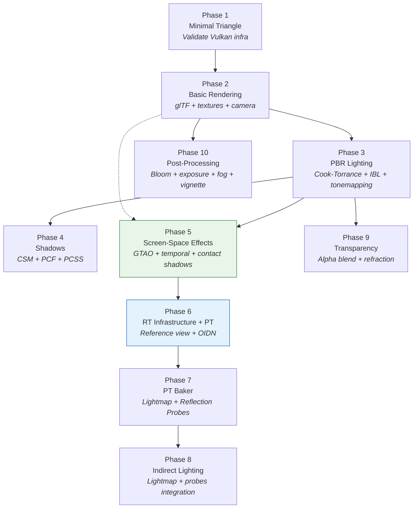

Himalaya is not built on the assumption that more technology equals better results. Instead, every architectural choice is filtered through a clear set of design principles that prioritize **maximum visual return per unit of engineering complexity**. This page documents the philosophical foundations that guide all technical decisions in the renderer — from the macro-level question of "what rendering framework to use" down to the micro-level question of "should this shader branch be dynamic or compile-time." Understanding these principles is essential for reading the rest of the documentation with the right mindset: the codebase is a series of deliberate tradeoffs, not a collection of best practices applied uniformly.

Sources: [requirements-and-philosophy.md](https://github.com/1PercentSync/himalaya/blob/main/docs/project/requirements-and-philosophy.md#L8-L38), [architecture.md](https://github.com/1PercentSync/himalaya/blob/main/docs/project/architecture.md#L1-L20)

## The Sweet-Spot Philosophy

The project's target hardware is **mid-range desktop GPUs** — not the lowest common denominator, not the cutting edge. This positioning directly shapes every technical decision. The goal is to find the **sweet spot** where the performance cost of a technique is proportional to the visual quality it delivers. Technologies that require high-end hardware to be viable (Virtual Shadow Maps, Mesh Shaders, neural rendering) are excluded not because they are bad, but because their cost-to-benefit ratio falls outside the sweet spot for the target audience.

This philosophy extends beyond hardware. The project is a **personal learning project** developed with AI assistance, which means the bottleneck is not writing code but **reviewing, understanding, and making correct architectural decisions**. A technique's maturity and documentation quality directly affects how reliably an AI-assisted workflow can implement it. This practical constraint excludes experimental or poorly documented approaches regardless of their theoretical merits.

Sources: [requirements-and-philosophy.md](https://github.com/1PercentSync/himalaya/blob/main/docs/project/requirements-and-philosophy.md#L19-L38), [requirements-and-philosophy.md](https://github.com/1PercentSync/himalaya/blob/main/docs/project/requirements-and-philosophy.md#L86-L96)

### What the Sweet Spot Means in Practice

| Dimension | Too Low (Avoided) | Sweet Spot (Selected) | Too High (Avoided) |
|-----------|-------------------|----------------------|---------------------|
| **Rendering Framework** | Legacy fixed-function | Forward+ with bindless | Visibility Buffer / GPU-Driven |
| **Shadow Quality** | Single shadow map | CSM + PCSS + Contact Shadows | Virtual Shadow Maps |
| **GI Approach** | Constant ambient | Lightmap + SSGI supplement | Full real-time SDF GI |
| **AO Quality** | Crytek SSAO | GTAO + temporal filter | RTAO |
| **Scene Scale** | Brute-force CPU draw | CPU instancing + frustum culling | GPU-Driven pipeline |
| **Anti-aliasing** | None / FXAA | MSAA + FSR/DLSS SDK | Custom TAA implementation |

Sources: [technical-decisions.md](https://github.com/1PercentSync/himalaya/blob/main/docs/project/technical-decisions.md#L21-L38), [decision-process.md](https://github.com/1PercentSync/himalaya/blob/main/docs/project/decision-process.md#L8-L43)

## The Nine Guiding Principles

Every technical decision in Himalaya can be traced back to one or more of nine explicit design principles. These are not abstract ideals — each one has concrete, verifiable consequences in the codebase.

Sources: [requirements-and-philosophy.md](https://github.com/1PercentSync/himalaya/blob/main/docs/project/requirements-and-philosophy.md#L42-L96)

### Principle 1: Complexity Must Earn Its Keep

> If a technique's implementation cost far exceeds the visual or performance benefit it delivers, it is excluded.

This is the primary filter. GPU-Driven Rendering was excluded because its complexity "diffuses across the entire architecture" — scene data reorganization, material system redesign, compute-shader-based draw logic — for a benefit (eliminating CPU draw call bottleneck) that doesn't materialize until hundreds of thousands of instances, well beyond the project's scene scale.

**Codebase evidence**: The rendering pipeline uses straightforward CPU-side instancing with `MeshDrawGroup` structs built per frame, and traditional `vkCmdDrawIndexed` calls. The instanced draw grouping in `culling.cpp` sorts visible opaque indices by `mesh_id` and builds `MeshDrawGroup` entries — simple, debuggable, and sufficient for the target scene sizes.

Sources: [requirements-and-philosophy.md](https://github.com/1PercentSync/himalaya/blob/main/docs/project/requirements-and-philosophy.md#L43-L48), [scene_data.h](https://github.com/1PercentSync/himalaya/blob/main/framework/include/himalaya/framework/scene_data.h#L377-L391)

### Principle 2: Progressive Enhancement — Build in Passes

> First make it work, then make it good, then make it excellent. Each module evolves through Pass 1 → Pass 2 → Pass 3.

This is the single most structurally important principle. Every rendering subsystem has a defined evolutionary path where each step **builds naturally on the previous one** rather than requiring rewrites. The key insight is that evolution should be additive: Pass 2 adds to Pass 1, it doesn't replace it.

**The Forward+ evolution** is the canonical example:

| Pass | Approach | What Changes |
|------|----------|-------------|
| Pass 1 | Brute-force Forward | Light array passed directly to shader. Works fine for 1–10 lights. |
| Pass 2 | Tiled Forward | Add a Compute Pass for 2D screen-tile light culling. No pipeline restructuring. |
| Pass 3 | Clustered Forward | Extend Tiled with a depth dimension → 3D clusters. Same pipeline shape. |

Each step adds a Compute Pass and changes how the light list is built, but the forward rendering pass itself — the shader, the material system, the draw logic — remains identical. This is not accidental; it is a direct consequence of designing the architecture to accommodate incremental evolution.

**Codebase evidence**: M1 implements Pass 1 (brute-force Forward). The light count in `GlobalUniformData` is a simple `directional_light_count` field. The upgrade to Tiled Forward in M2 requires adding a compute dispatch before the forward pass — the forward shader itself does not change.

Sources: [requirements-and-philosophy.md](https://github.com/1PercentSync/himalaya/blob/main/docs/project/requirements-and-philosophy.md#L49-L57), [technical-decisions.md](https://github.com/1PercentSync/himalaya/blob/main/docs/project/technical-decisions.md#L21-L30)

### Principle 3: Proven Technology Only

> Adopt techniques that have mature implementations and rich documentation. No experimental approaches.

This principle is driven by the AI-assisted development model: the quality and abundance of reference material directly determines how reliably the AI can produce correct code. A technique like GGX for specular distribution is chosen not just because it is physically correct, but because every major engine (UE4/5, Filament, Unity) has documented its implementation, and the AI has been trained on countless correct examples.

The exclusion of Visibility Buffer (Deferred Texturing) is a direct application of this principle: "public complete implementations and documentation are relatively sparse, which doesn't meet the 'documentation-rich, AI-assisted reliable' constraint."

Sources: [requirements-and-philosophy.md](https://github.com/1PercentSync/himalaya/blob/main/docs/project/requirements-and-philosophy.md#L59-L63), [decision-process.md](https://github.com/1PercentSync/himalaya/blob/main/docs/project/decision-process.md#L18-L22)

### Principle 4: Performance-to-Quality Ratio

> At equal quality, choose the faster option. At equal performance, choose the better-looking option.

This principle governs choices within a proven technique category. For example, GTAO was selected over HBAO not because HBAO is wrong, but because GTAO's mathematical model is strictly superior (correct horizon-based integration vs. approximate hemisphere sampling) with virtually identical implementation complexity — "if you can implement HBAO, GTAO is just swapping the occlusion formula, about 40 lines of difference."

The AO pipeline in the codebase reflects this: `GTAOPass` computes horizon-based ambient occlusion and outputs a four-channel RGBA8 texture (RGB = bent normal, A = AO scalar), which then flows through spatial and temporal denoising passes before being consumed by the forward pass.

Sources: [requirements-and-philosophy.md](https://github.com/1PercentSync/himalaya/blob/main/docs/project/requirements-and-philosophy.md#L64-L66), [decision-process.md](https://github.com/1PercentSync/himalaya/blob/main/docs/project/decision-process.md#L131-L147), [gtao_pass.h](https://github.com/1PercentSync/himalaya/blob/main/passes/include/himalaya/passes/gtao_pass.h#L32-L59)

### Principle 5: Hybrid Pipeline Compatibility Is a Bonus

> If Option A preserves a path to hybrid ray tracing while Option B does not, Option A may be preferred even with slightly longer development time or slightly worse performance — but not at the cost of perceptible current quality loss.

This is why Forward+ was chosen over Deferred Shading despite Deferred's natural GBuffer support for screen-space effects. Forward+'s "sacrifice" (needing a separate Depth+Normal PrePass) is a one-time infrastructure investment that provides exactly the data screen-space effects need, while preserving the architectural compatibility with both MSAA (critical for VR) and mobile TBDR GPUs (where Deferred's GBuffer write-read pattern fundamentally breaks the tile-based rendering model).

**Codebase evidence**: The render graph manages a `DepthPrePass` that outputs both depth and normals in a single pass. The resolved depth and normal buffers are then imported into the graph as `Set 2` bindings, available to all compute passes (GTAO, Contact Shadows, and future SSR/SSGI) without any pipeline restructuring.

Sources: [requirements-and-philosophy.md](https://github.com/1PercentSync/himalaya/blob/main/docs/project/requirements-and-philosophy.md#L68-L72), [decision-process.md](https://github.com/1PercentSync/himalaya/blob/main/docs/project/decision-process.md#L8-L43)

### Principle 6: No Visible Glitches

> The image can be imprecise, but it must not have obviously distracting visual artifacts. When choosing between sharp+flickering and smooth+stable, choose the latter.

This principle produces specific engineering decisions that might seem overly careful in isolation:

- **CSM texel snapping** eliminates cascade boundary swimming when the camera moves
- **PCSS with temporal filtering** eliminates sampling noise from the stochastic shadow kernel
- **Depth Resolve uses MAX_BIT** instead of the mathematically correct MIN_BIT because 6 out of 7 consumers of the resolved depth prefer MAX, and the one exception (God Rays) shows imperceptible artifacts with MAX
- **"Over-render rather than under-render"** — prefer drawing a few extra occluded objects over having objects pop in and out of existence

Sources: [requirements-and-philosophy.md](https://github.com/1PercentSync/himalaya/blob/main/docs/project/requirements-and-philosophy.md#L73-L78), [m1-design-decisions-core.md](https://github.com/1PercentSync/himalaya/blob/main/docs/milestone-1/m1-design-decisions-core.md#L96-L100)

### Principle 7: Trade Design Flexibility for Simplicity

> Accept reduced scene dynamism in exchange for simpler, more reliable visual solutions.

The most striking application: **limiting interactive door states to one visible door at a time**. This constraint eliminates the combinatorial explosion of lightmap permutations (each door open/closed state would require its own baked lightmap set). With the constraint, the total lightmap count is: one base set + one set per interactive door. Without it, the count would be 2^n where n is the number of interactive doors.

This principle also applies to the rendering framework choice: Forward+ with a fixed set of well-understood passes is simpler and more debuggable than a fully dynamic, data-driven rendering pipeline.

Sources: [requirements-and-philosophy.md](https://github.com/1PercentSync/himalaya/blob/main/docs/project/requirements-and-philosophy.md#L79-L84)

### Principle 8: AI-Assisted Development Constraints

> The AI can write the entire renderer. The bottleneck is review, understanding, and avoiding rework from incorrect architectural decisions.

This principle has three concrete consequences:

1. **Modular design** reduces the blast radius of mistakes — a wrong decision in the shadow system doesn't cascade into the material system
2. **Documentation richness** of a technique is a first-class selection criterion
3. **Architectural correctness** is prioritized over implementation speed — a wrong architecture that requires rework costs more time than a slow-but-correct architecture

Sources: [requirements-and-philosophy.md](https://github.com/1PercentSync/himalaya/blob/main/docs/project/requirements-and-philosophy.md#L86-L96)

### Principle 9: Plugin Architecture and Deferred Implementation

> Not everything needs to be built now. Post-processing effects are naturally independent fullscreen passes that can be designed as pluggable, independently enabled/disabled modules.

This principle manifests in the pass architecture: each render pass is a self-contained class (`setup()`, `record()`, `rebuild_pipelines()`, `destroy()`) that declares its resource dependencies to the render graph. Adding a new pass means creating a new class and registering it — no existing pass code changes.

**Codebase evidence**: The `RenderFeatures` struct in `scene_data.h` provides boolean toggles for each optional effect (`skybox`, `shadows`, `ao`, `contact_shadows`). The renderer checks these flags to conditionally skip `record()` calls. On the shader side, `GlobalUBO.feature_flags` uses a bitmask (`FEATURE_SHADOWS`, `FEATURE_AO`, `FEATURE_CONTACT_SHADOWS`) to enable dynamic branching without pipeline recreation.

Sources: [requirements-and-philosophy.md](https://github.com/1PercentSync/himalaya/blob/main/docs/project/requirements-and-philosophy.md#L93-L96), [scene_data.h](https://github.com/1PercentSync/himalaya/blob/main/framework/include/himalaya/framework/scene_data.h#L137-L150), [bindings.glsl](https://github.com/1PercentSync/himalaya/blob/main/shaders/common/bindings.glsl#L56-L61)

## The Progressive Enhancement Pattern in Action

The progressive enhancement principle is not just theoretical — it is the structuring principle for the entire milestone roadmap. The following diagram shows how M1 phases build on each other, with each phase producing a visible, verifiable result:



Each phase has a **strategic investment** that pays dividends in future phases. Phase 5 builds the temporal filtering infrastructure (render graph temporal double-buffering, per-frame Set 2 descriptors, compute pass push descriptors) that M2's SSR and SSGI will reuse without modification. Phase 6 builds the RT infrastructure (acceleration structures, RT pipeline abstraction, PT core shaders) that Phase 7's baker and M2's real-time PT will consume directly.

Sources: [m1-development-order.md](https://github.com/1PercentSync/himalaya/blob/main/docs/milestone-1/m1-development-order.md#L10-L13), [m1-development-order.md](https://github.com/1PercentSync/himalaya/blob/main/docs/milestone-1/m1-development-order.md#L179-L204)

## Replacement Chains — Evolution Through Substitution

A distinctive pattern in the codebase is the **replacement chain**: techniques that are explicitly designed to be retired when their successor is ready. This is different from progressive enhancement (where layers accumulate); replacement chains swap out one implementation for another.

| Current Technique | Successor | Trigger Condition |
|---|---|---|
| Height fog | Bruneton aerial perspective | M2 sky implementation |
| Static HDR cubemap sky | Bruneton atmospheric scattering | M2 sky implementation |
| PCF soft shadows | PCSS contact-hardening shadows | M1 Phase 4 (already done) |
| Screen-Space God Rays | Froxel Volumetric Fog | M3 |
| 2D cloud layer | Volumetric clouds | Far future |
| ACES tonemapping | Khronos PBR Neutral | M3 |

The replacement pattern is visible in the milestone structure: M1's PCF shadow implementation was directly followed by PCSS within the same phase because the PCSS upgrade is "just adding Blocker Search on top of PCF" — a natural extension, not a rewrite.

Sources: [requirements-and-philosophy.md](https://github.com/1PercentSync/himalaya/blob/main/docs/project/requirements-and-philosophy.md#L157-L166), [milestone-2.md](https://github.com/1PercentSync/himalaya/blob/main/docs/roadmap/milestone-2.md#L26-L29)

## Infrastructure Reuse — Build Once, Benefit Everywhere

Multiple rendering systems share underlying infrastructure, which means the first implementation of any infrastructure component has an outsized return on investment:

| Shared Infrastructure | Consumers | First Built |
|---|---|---|
| **Depth + Normal PrePass** | GTAO, Contact Shadows, SSR, SSGI, DOF, Motion Blur | Phase 3 |
| **Temporal filtering** (RG temporal double buffer + reprojection + blend) | AO, SSR, SSGI | Phase 5 |
| **Screen-space ray march** | Contact Shadows, SSR, SSGI | Phase 5 |
| **BRDF Integration LUT** | IBL Split-Sum, Multiscatter GGX | Phase 3 |
| **Motion Vectors** | All temporal effects + DLSS/FSR + Motion Blur | M2 |
| **Bindless descriptor array** | Material textures, IBL cubemaps, shadow maps, Lightmaps | Phase 2 |
| **RT acceleration structure** | PT reference view, PT baker, M2 real-time PT, RT Reflections, RT Shadows | Phase 6 |

The render graph's `create_managed_image(..., temporal=true)` mechanism exemplifies this pattern: once the temporal double-buffer infrastructure exists in the render graph, any pass that needs historical frame data simply requests a temporal managed image. The graph handles allocation, swap, resize, and history validity tracking automatically.

Sources: [requirements-and-philosophy.md](https://github.com/1PercentSync/himalaya/blob/main/docs/project/requirements-and-philosophy.md#L147-L155), [render_graph.h](https://github.com/1PercentSync/himalaya/blob/main/framework/include/himalaya/framework/render_graph.h#L289-L396)

## The Architecture Layering Principle

The codebase is organized into four strict layers with **unidirectional dependencies** — upper layers depend on lower layers, never the reverse. This is enforced at the CMake level: each layer is a static library with explicit link dependencies.

```
Layer 3 (Application)     — Scene loading, camera control, debug UI
      ↓ fills render list, calls renderer
Layer 2 (Render Passes)   — Individual passes: depth, forward, shadow, AO, etc.
      ↓ registers with render graph, uses framework services
Layer 1 (Render Framework) — Render graph, material system, mesh, texture, camera
      ↓ uses RHI handles and command interfaces
Layer 0 (RHI)             — Vulkan abstraction: context, resources, descriptors, pipelines
```

The layering constraint has a specific exception carved out for pragmatism: the render graph (Layer 1) is allowed to use Vulkan types like `VkImageLayout` because "it is fundamentally a barrier manager, and mapping to a custom enum only to translate back is more error-prone than using the real type." This is the kind of pragmatic tradeoff the principles enable — the constraint exists to protect architectural clarity, not to create ceremony.

**Codebase evidence**: The pass classes in `passes/include/himalaya/passes/` follow an identical structural pattern: they hold service pointers to Layer 0/1 components, own their pipeline and descriptor resources, and expose `setup()` / `record()` / `rebuild_pipelines()` / `destroy()` methods. Passes never reference each other — they communicate exclusively through render graph resource declarations.

Sources: [architecture.md](https://github.com/1PercentSync/himalaya/blob/main/docs/project/architecture.md#L90-L103), [CLAUDE.md](https://github.com/1PercentSync/himalaya/blob/main/CLAUDE.md#L122-L152)

## Conditional Evolution Paths

Not all planned features have fixed timelines. Some are **conditional** — they depend on whether other infrastructure is built first:

| Conditional Feature | Prerequisite | Trigger |
|---|---|---|
| SDF shadow blending | SDF infrastructure built for GI | Only if GI goes SDF route |
| Irradiance Probes | SDF infrastructure | Only if SDF already exists |
| WBOIT | Simple sorting shows visible artifacts | Only when transparency problems appear |
| Shadow Atlas | Light count grows to need management | Only when point lights proliferate |

This approach avoids premature complexity investment. The codebase doesn't pre-build abstractions for features that may never be needed — instead, it ensures that the architecture doesn't preclude them. For example, the `SceneRenderData` interface uses `std::span` references rather than owning scene data, which naturally supports future multi-view rendering (CSM cascades, reflection probe cubemaps, VR stereo) without any API changes.

Sources: [requirements-and-philosophy.md](https://github.com/1PercentSync/himalaya/blob/main/docs/project/requirements-and-philosophy.md#L167-L175), [scene_data.h](https://github.com/1PercentSync/himalaya/blob/main/framework/include/himalaya/framework/scene_data.h#L87-L102)

## Where to Go Next

The principles documented here are the lens through which every other page in this documentation should be read. For the concrete outcomes of applying these principles:

- See **[Milestone Roadmap — From Static Scene Demo to Real-Time Path Tracing](https://github.com/1PercentSync/himalaya/blob/main/28-milestone-roadmap-from-static-scene-demo-to-real-time-path-tracing)** for how progressive enhancement structures the three-milestone plan
- See **[Render Graph — Automatic Barrier Insertion and Pass Orchestration](https://github.com/1PercentSync/himalaya/blob/main/9-render-graph-automatic-barrier-insertion-and-pass-orchestration)** for how the plugin architecture is realized in code
- See **[Forward Pass — Cook-Torrance PBR, IBL Split-Sum, and Multi-Bounce AO](https://github.com/1PercentSync/himalaya/blob/main/17-forward-pass-cook-torrance-pbr-ibl-split-sum-and-multi-bounce-ao)** for how proven-technology choices (GGX, Schlick, split-sum) compose into a complete lighting solution