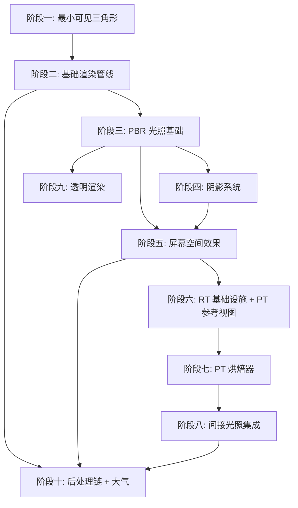

Milestone 1 是 Himalaya 渲染引擎的首个可交付阶段，目标是实现一个场景和光源静态、镜头可自由移动的 Demo，画面写实度达到可接受水平。场景类型涵盖室内与室外环境，同时引入 GPU 路径追踪烘焙器用于自烘焙 Lightmap 和 Reflection Probes，以及 PT 参考视图用于验证渲染正确性。

室内场景通过烘焙的间接光照呈现从窗户照入的光线经过反弹后照亮房间内部的柔和效果，室外部分则通过 CSM（级联阴影映射）覆盖近中远距离的阴影，配合 PCF 软阴影和接触阴影提供细腻的接地感。整体观感是一个光照质量不错的静态场景漫游器。

Sources: [milestone-1.md](https://github.com/1PercentSync/himalaya/blob/main/docs/milestone-1/milestone-1.md#L1-L20)

---

## 功能范围与目标场景

### 支持的渲染特性

| 类别 | 实现内容 | 技术要点 |
|------|----------|----------|
| **几何渲染** | Forward+ 渲染管线、视锥剔除、Instancing | CPU 端 mesh_id 分组 + per-instance SSBO，push constant 缩减至 4 bytes |
| **材质系统** | PBR Metallic-Roughness 工作流、法线贴图 | Lambert 漫反射 + Cook-Torrance 镜面反射（GGX / Smith Height-Correlated / Schlick） |
| **直接光照** | 单方向光直接光照 | 限 1 盏方向光，支持 cast shadows |
| **间接光照** | IBL 环境光、自烘焙 Lightmap、Reflection Probes | Split-Sum 近似、BRDF Integration LUT、视差校正 Cubemap |
| **阴影系统** | CSM、PCF、PCSS、Contact Shadows | 4 级 cascade 2048²、PSSM 分割、texel snapping、cascade blend |
| **环境光遮蔽** | GTAO + Temporal Filtering | AO + bent normal 计算，时域降噪基础设施 |
| **后处理链** | Bloom、自动曝光、ACES Tonemapping、Vignette、Color Grading | HDR 全程 R16G16B16A16F，多级降采样/升采样链 |
| **抗锯齿** | MSAA | Forward+ 原生支持 |
| **透明渲染** | Alpha Blending + 屏幕空间折射 | 排序后渲染，HDR 颜色缓冲拷贝作为折射源 |
| **路径追踪** | RT 基础设施、PT 参考视图、GPU 烘焙器 | BLAS/TLAS 加速结构、NEE + MIS、OIDN GPU 降噪 |
| **天空与雾** | 静态 HDR Cubemap、高度雾 | 基础氛围效果 |

### 已知局限性

M1 作为首个里程碑，优先保证核心路径的完整性，以下限制将在后续版本中解决：

| 局限 | 原因 | 解决时间 |
|------|------|----------|
| 反射不精确 | Reflection Probes 是近似的，光滑地面无精确镜面反射 | M2（SSR） |
| 阴影软硬一致 | PCF 软阴影宽度固定，不随遮挡距离变化 | M1 Phase 4（PCSS） |
| 无动态间接光 | 靠近红墙时白色物体不会被染红（仅 Lightmap 静态 color bleeding） | M2（SSGI） |
| 天空静止 | 无昼夜变化 | M2（Bruneton 大气散射） |
| 无体积光效果 | 无光柱、无雾气中光散射 | M2（God Rays）/ M3（Froxel） |
| 仅 MSAA 抗锯齿 | 几何边缘干净但高光闪烁和着色锯齿未处理 | M2（FSR SDK） |
| 单方向光限制 | 仅支持 1 盏方向光 | M2（多方向光 CSM） |
| 无动态光源阴影 | 只有方向光有阴影，室内点光源/聚光灯无投影 | M3 |

Sources: [milestone-1.md](https://github.com/1PercentSync/himalaya/blob/main/docs/milestone-1/milestone-1.md#L25-L45)

---

## 十阶段开发路线图

M1 采用分阶段增量式开发策略，每个阶段结束都有可见的、可验证的产出。阶段划分遵循依赖关系——基础设施先行，效果后置。



### 阶段产出概览

| 阶段 | 核心产出 | 验证标准 |
|------|----------|----------|
| **阶段一** | 硬编码三角形显示 | Vulkan 基础设施端到端验证 |
| **阶段二** | glTF 场景加载、相机漫游、ImGui | 可见有纹理和基础光照的静态场景 |
| **阶段三** | PBR 光照、IBL、Tonemapping | 金属表面反射天空，HDR 正确映射到 LDR |
| **阶段四** | CSM 阴影、Instancing | 场景有阴影，立体感大幅提升 |
| **阶段五** | GTAO、Contact Shadows、Temporal 基础设施 | 物体接地感增强，时域降噪可用 |
| **阶段六** | RT 基础设施、PT 参考视图 | PT 模式画面可收敛，OIDN 降噪工作 |
| **阶段七** | Lightmap/Probe 烘焙器 | 可在引擎内烘焙并持久化为 KTX2 |
| **阶段八** | Lightmap/Probe 集成到光栅化 | 室内有间接光，光滑表面反射环境 |
| **阶段九** | 透明物体渲染 | 玻璃窗、半透明物体正确显示 |
| **阶段十** | 完整后处理链、高度雾 | 完整 HDR→LDR 管线，画面风格化 |

Sources: [m1-development-order.md](https://github.com/1PercentSync/himalaya/blob/main/docs/milestone-1/m1-development-order.md#L1-L50)

---

## 架构设计与四层分层

M1 延续 Himalaya 的四层架构设计，在每一层添加新功能的同时保持单向依赖约束——上层可调用下层，下层不可感知上层。

| 层 | 职责 | M1 新增内容 |
|----|------|-------------|
| **Layer 0 (RHI)** | Vulkan 抽象、资源管理、命令录制 | AS 资源类型、RT Pipeline、SBT 管理 |
| **Layer 1 (Framework)** | 渲染框架、场景数据、资源组织 | Scene AS Builder、Temporal 资源管理、IBL 系统 |
| **Layer 2 (Passes)** | 具体渲染效果实现 | 全部 Pass（Shadow/Forward/GTAO/Tonemapping 等） |
| **Layer 3 (App)** | 应用逻辑、UI、配置 | 渲染模式切换、烘焙 UI 控制、相机控制器 |

### 渲染路径架构

Renderer 内部维护三条独立渲染路径，每条有独立的帧流程：

| 模式 | 帧流程 | 激活条件 |
|------|--------|----------|
| **光栅化** | Shadow → DepthPrePass → AO → Forward → Skybox → PostProcess | 默认模式 |
| **PT 参考视图** | PT Pass → OIDN → Tonemapping → Swapchain | 用户切换 |
| **烘焙模式** | Baker dispatch → 累积 → 预览进度 → Swapchain | 用户触发烘焙 |

选择独立路径而非条件跳过的理由是 PT 帧流程与光栅化差异极大，强行合并会让条件分支遍布 Renderer。

Sources: [m1-rt-decisions.md](https://github.com/1PercentSync/himalaya/blob/main/docs/milestone-1/m1-rt-decisions.md#L1-L30)

---

## 帧流程详解

### 标准光栅化帧流程

```
[CPU 准备]
  ├─ 视锥剔除 → 可见物体列表（不透明 + 透明分开）
  └─ 透明物体排序 → 按距离排序的透明物体列表

[GPU 渲染]
  ├─ CSM Shadow Pass（per-cascade 渲染）
  ├─ Depth + Normal PrePass（MSAA）→ Resolve 到单采样
  ├─ GTAO Pass + Contact Shadows Pass（可并行）
  ├─ AO Spatial Blur + AO Temporal Filter
  ├─ Forward Lighting Pass（MSAA）→ 主光照计算
  ├─ Transparent Pass（MSAA）→ 折射采样
  ├─ MSAA Resolve + Skybox Pass
  └─ 后处理链（Fog → Auto Exposure → Bloom → Tonemapping → Vignette → Color Grading）
```

### MSAA 处理策略

Depth/Normal PrePass 在 MSAA 下输出多采样 buffer，但屏幕空间效果（AO、Contact Shadows）全部在 resolve 后的单采样 buffer 上操作。这一取舍的原因是：AO 本身是低频近似效果，加上 temporal filtering 的模糊，精度损失在视觉上不可感知；而直接在 MSAA buffer 上操作需要 sampler2DMS 支持，增加复杂度。

Sources: [m1-frame-flow.md](https://github.com/1PercentSync/himalaya/blob/main/docs/milestone-1/m1-frame-flow.md#L1-L100)

---

## 关键架构决策

### 描述符三层架构

| Set | 内容 | 生命周期 | 份数 |
|-----|------|---------|------|
| **0** | 全局 Buffer（GlobalUBO + LightBuffer + MaterialBuffer + InstanceBuffer） | per-frame 双缓冲 | ×2 |
| **1** | 持久纹理资产（bindless 2D + cubemap） | 场景加载 → 卸载 | ×1 |
| **2** | 帧内 Render Target（HDR Color、Depth、AO 等） | init → destroy | ×2（per-frame） |

### Render Graph 设计

采用手动编排 Pass 列表 + barrier 自动插入的策略，不做自动拓扑排序、不做资源别名优化。Pass 声明输入输出（RGResourceUsage），RG 根据声明推导 barrier。帧间生命周期为每帧重建（clear → import/use → add_pass → compile → execute），后续加入拓扑排序和资源别名分析时无需改动已有 pass 代码。

### 资源句柄设计

采用 generation-based（index + generation）方案。资源销毁时 generation 递增，使用时比对，可捕获所有 use-after-free。Pipeline 不使用 handle 体系——所有权始终单一明确（pass 持有），由 Validation Layer 兜底。

Sources: [m1-design-decisions-core.md](https://github.com/1PercentSync/himalaya/blob/main/docs/milestone-1/m1-design-decisions-core.md#L1-L100)

---

## 代码结构映射

```
├── rhi/                    # Layer 0: Vulkan 抽象层
│   ├── include/himalaya/rhi/
│   │   ├── types.h         # 句柄类型（generation-based）
│   │   ├── context.h       # Instance, Device, Queue, VMA
│   │   ├── acceleration_structure.h  # BLAS/TLAS（阶段六）
│   │   └── rt_pipeline.h   # RT Pipeline + SBT（阶段六）
│   └── src/
├── framework/              # Layer 1: 渲染框架
│   ├── include/himalaya/framework/
│   │   ├── render_graph.h  # Render Graph
│   │   ├── scene_as_builder.h        # 场景 AS 构建（阶段六）
│   │   └── ibl.h           # IBL 系统
│   └── src/
├── passes/                 # Layer 2: 渲染 Pass
│   ├── include/himalaya/passes/
│   │   ├── shadow_pass.h
│   │   ├── forward_pass.h
│   │   ├── gtao_pass.h
│   │   ├── reference_view_pass.h       # PT 参考视图（阶段六）
│   │   └── tonemapping_pass.h
│   └── src/
├── app/                    # Layer 3: 应用层
│   ├── include/himalaya/app/
│   │   ├── application.h
│   │   ├── renderer.h
│   │   ├── renderer_pt.cpp             # PT 渲染路径
│   │   └── debug_ui.h
│   └── src/
└── shaders/                # 着色器
    ├── common/             # 共享头文件（bindings.glsl, brdf.glsl 等）
    ├── rt/                 # 路径追踪 shader（阶段六）
    │   ├── pt_common.glsl
    │   ├── reference_view.rgen
    │   └── closesthit.rchit
    └── *.vert/frag/comp
```

Sources: [m1-interfaces.md](https://github.com/1PercentSync/himalaya/blob/main/docs/milestone-1/m1-interfaces.md#L1-L100)

---

## 下一步阅读指南

理解 M1 后，可根据兴趣深入以下主题：

- 想了解当前正在进行的开发工作 → 查看 [当前阶段](https://github.com/1PercentSync/himalaya/blob/main/current-phase)
- 想深入理解 Render Graph 资源管理机制 → 阅读 [Render Graph资源管理](https://github.com/1PercentSync/himalaya/blob/main/12-render-graphzi-yuan-guan-li)
- 想理解材质系统如何组织 PBR 参数 → 阅读 [材质系统架构](https://github.com/1PercentSync/himalaya/blob/main/13-cai-zhi-xi-tong-jia-gou)
- 想了解 GTAO 算法的具体实现 → 阅读 [GTAO算法实现](https://github.com/1PercentSync/himalaya/blob/main/22-gtaosuan-fa-shi-xian)
- 想理解光线追踪基础设施 → 阅读 [RT基础设施与加速结构](https://github.com/1PercentSync/himalaya/blob/main/25-rtji-chu-she-shi-yu-jia-su-jie-gou)
- 想了解 M2 的规划方向 → 阅读 [Milestone 2 - 画质全面提升](https://github.com/1PercentSync/himalaya/blob/main/28-milestone-2-hua-zhi-quan-mian-ti-sheng)