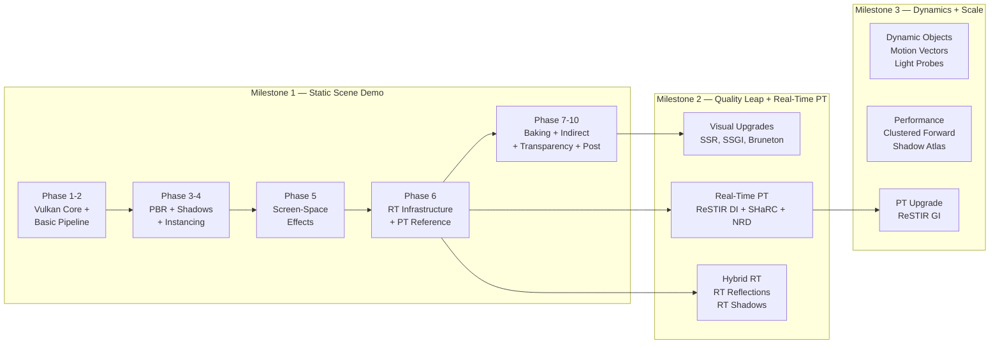
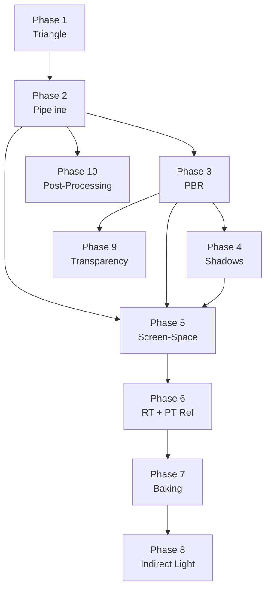
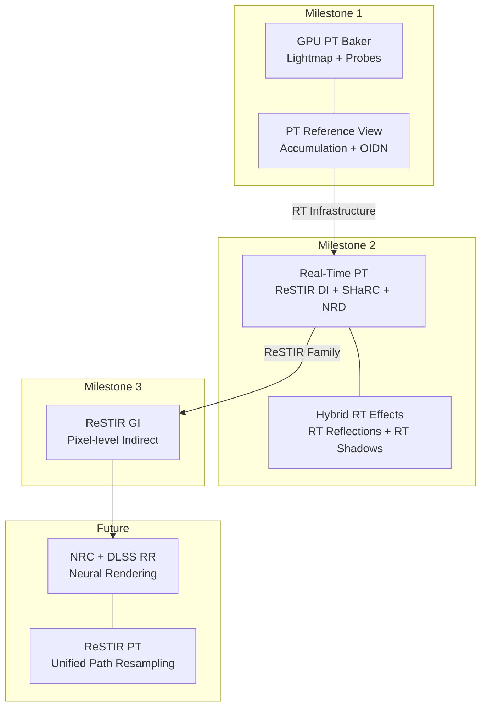

The Himalaya renderer follows a **three-milestone progressive enhancement strategy**, each delivering a self-contained visual quality plateau. This roadmap traces the full arc from a static scene demo with basic PBR lighting through to a real-time path-traced rendering mode comparable to commercial game engines. Every milestone has a clear "look and feel" target, a bounded feature set, and explicitly declared limitations that are resolved in subsequent milestones.

Sources: [milestone-1.md](https://github.com/1PercentSync/himalaya/blob/main/docs/milestone-1/milestone-1.md#L1-L105), [milestone-2.md](https://github.com/1PercentSync/himalaya/blob/main/docs/roadmap/milestone-2.md#L1-L76), [milestone-3.md](https://github.com/1PercentSync/himalaya/blob/main/docs/roadmap/milestone-3.md#L1-L58)

## The Big Picture

Himalaya's roadmap is organized around a single architectural conviction: **use offline quality to solve real-time problems**. Baked Lightmaps and Reflection Probes deliver photorealistic indirect lighting at nearly zero runtime cost. Screen-space effects (GTAO, Contact Shadows, future SSR/SSGI) provide the layer of dynamic detail that baking cannot capture. Path tracing serves as both an offline baking tool and a real-time rendering mode. This layered approach means each milestone builds upon — rather than replaces — the previous one.

Sources: [requirements-and-philosophy.md](https://github.com/1PercentSync/himalaya/blob/main/docs/project/requirements-and-philosophy.md#L99-L174), [technical-decisions.md](https://github.com/1PercentSync/himalaya/blob/main/docs/project/technical-decisions.md#L307-L380), [milestone-future.md](https://github.com/1PercentSync/himalaya/blob/main/docs/roadmap/milestone-future.md#L77-L88)

## Guiding Principles Behind the Roadmap

Each milestone's content is shaped by nine design principles documented in the project's requirements specification. The three most impactful on the roadmap are:

- **Progressive enhancement** — every technology follows a Pass 1 → Pass 2 → Pass 3 evolution. Forward rendering goes brute-force → Tiled → Clustered. Shadows go basic Shadow Map → CSM → CSM+PCSS. GI goes ambient → baked Lightmap → SSGI. This means each milestone "locks in" a quality plateau while keeping the upgrade path open.

- **Performance sweet spot** — technologies are chosen at the point where implementation cost is proportional to visual or performance gain. GPU-Driven Rendering, Virtual Shadow Maps, and Mesh Shaders are explicitly excluded because the project's scene scale does not justify their complexity.

- **Infrastructure reuse** — a single investment in temporal filtering (Milestone 1 Phase 5) serves GTAO, future SSR, and SSGI. The depth PrePass serves forward rendering, all screen-space effects, and hardware occlusion queries. The RT infrastructure (Phase 6) serves the baking tool, the reference viewer, and the full real-time PT mode.

Sources: [requirements-and-philosophy.md](https://github.com/1PercentSync/himalaya/blob/main/docs/project/requirements-and-philosophy.md#L41-L97), [technical-decisions.md](https://github.com/1PercentSync/himalaya/blob/main/docs/project/technical-decisions.md#L1-L380)

## Milestone 1 — Static Scene Demo

**Goal**: A static scene with free camera movement, physically-based shading, multi-cascade shadows, screen-space ambient occlusion, baked indirect lighting, and a path-traced reference viewer. Indoor and outdoor scenes both supported.

### Visual Target

Indoor scenes feature baked indirect lighting (Lightmap) with soft light bouncing through windows. Outdoor scenes have directional light shadows covering near-to-far distances (CSM), contact-hardening soft shadows (PCSS), and per-pixel contact shadows at object-ground contact points. All surfaces use Cook-Torrance PBR with split-sum IBL. A path-traced reference view with OIDN denoising provides ground-truth comparison.

Sources: [milestone-1.md](https://github.com/1PercentSync/himalaya/blob/main/docs/milestone-1/milestone-1.md#L9-L13)

### Development Phases

Milestone 1 is divided into **ten sequential phases**, each producing a visible, verifiable result. The dependency chain ensures that no phase works on infrastructure for too long without producing something observable.

| Phase | Theme | Key Output |
|-------|-------|------------|
| 1 | Minimum visible triangle | Vulkan context, swapchain, shader compilation — a triangle on screen |
| 2 | Basic rendering pipeline | glTF loading, bindless textures, render graph, camera, frustum culling |
| 3 | PBR lighting foundation | Cook-Torrance specular, IBL split-sum, depth PrePass, MSAA, tonemapping |
| 4 | Shadows | CSM (4 cascades, PSSM split, texel snapping), PCF, instancing, alpha-masked shadows |
| 5 | Screen-space effects | GTAO + spatial/temporal denoising, contact shadows, roughness buffer |
| 6 | RT infrastructure + PT reference | Vulkan RT extensions, BLAS/TLAS, RT pipeline, accumulation, OIDN denoising |
| 7 | PT baking tool | Lightmap baker + Reflection Probe baker (xatlas UV2, BC6H, KTX2) |
| 8 | Indirect lighting integration | Lightmap + Reflection Probe sampling in Forward pass |
| 9 | Transparency | Alpha blending, screen-space refraction |
| 10 | Post-processing chain | Auto-exposure, bloom, height fog, vignette, color grading |

Sources: [m1-development-order.md](https://github.com/1PercentSync/himalaya/blob/main/docs/milestone-1/m1-development-order.md#L1-L200)

### Phase Dependency Graph

Sources: [m1-development-order.md](https://github.com/1PercentSync/himalaya/blob/main/docs/milestone-1/m1-development-order.md#L179-L200)

### Current Status (Phase 6 In Progress)

Phase 6 is the current active phase, implementing the RT infrastructure and path-traced reference viewer. It consists of **13 steps**, with Steps 1–10 completed (115 tasks done, 42 remaining). The remaining work covers advanced PT sampling techniques:

| Step | Topic | Status |
|------|-------|--------|
| 1–5 | RT extensions, AS abstraction, RT pipeline, RHI/framework infrastructure, Scene AS Builder | ✅ Complete |
| 6a–6b | pt_common.glsl + RT shader files | ✅ Complete |
| 7 | Reference View Pass + accumulation | ✅ Complete |
| 8 | Independent render path + mode switching | ✅ Complete |
| 9 | OIDN integration (async denoising) | ✅ Complete |
| 10 | ImGui PT panel | ✅ Complete |
| 11 | Environment Map Importance Sampling | 🔲 Remaining |
| 12a | EmissiveLightBuilder + infrastructure | 🔲 Remaining |
| 12b | Shader NEE Emissive + MIS | 🔲 Remaining |
| 13 | Texture LOD (Ray Cones) | 🔲 Remaining |

Sources: [m1-phase6.md](https://github.com/1PercentSync/himalaya/blob/main/tasks/m1-phase6.md#L1-L208), [current-phase.md](https://github.com/1PercentSync/himalaya/blob/main/docs/current-phase.md#L1-L44)

### Known Limitations

Milestone 1 intentionally scopes out several visual features. Each limitation has a clear resolution milestone:

| Limitation | Root Cause | Resolution |
|------------|-----------|------------|
| No precise reflections | Reflection Probes are approximate | M2 (SSR) → M2 (RT Reflections) |
| Uniform shadow softness | PCF kernel width is fixed | M1 Phase 4 delivered PCSS — upgraded early |
| No dynamic indirect light | Only baked Lightmap color bleeding | M2 (SSGI) |
| Static sky | HDR Cubemap, no day/night cycle | M2 (Bruneton atmospheric scattering) |
| No volumetric lighting | No light shafts or fog scattering | M2 (God Rays) → M3 (Froxel Fog) |
| MSAA only | No temporal anti-aliasing | M2 (FSR/DLSS SDK) |
| Single directional light | Limited shadow map infrastructure | M2 (multi-light CSM) |
| No dynamic light shadows | Only sun has shadow casting | M3 (point/spot light shadows) |

Sources: [milestone-1.md](https://github.com/1PercentSync/himalaya/blob/main/docs/milestone-1/milestone-1.md#L18-L30)

## Milestone 2 — Quality Leap + Real-Time Path Tracing

**Goal**: On top of M1's foundation, capture all low-hanging visual fruit and introduce a real-time path-traced rendering mode. The rasterized mode should achieve a quality level noticeably superior to M1, while the PT mode targets visual fidelity comparable to *DOOM: The Dark Ages* path-traced mode.

### Visual Target

The rasterized mode gains: dynamic sky with day/night cycle (Bruneton atmospheric scattering replacing static Cubemap), physically correct aerial perspective (replacing height fog), screen-space reflections and indirect lighting, and FSR/DLSS upscaling with temporal stability. The PT mode provides real-time path tracing with reservoir-based spatiotemporal resampling.

Sources: [milestone-2.md](https://github.com/1PercentSync/himalaya/blob/main/docs/roadmap/milestone-2.md#L1-L14)

### Feature Breakdown by Effort

| Category | Feature | Purpose |
|----------|---------|---------|
| **Trivial** | Burley Diffuse | Replace Lambert; better grazing angle appearance |
| **Trivial** | Film Grain | Mask banding, add texture |
| **Trivial** | Chromatic Aberration | Lens character |
| **Low** | SSR | Screen-space reflection for smooth surfaces |
| **Low** | Tiled Forward | 2D tile-based light culling |
| **Low** | FSR SDK | Unified upscaling interface |
| **Medium** | SSGI | Screen-space indirect lighting, shares ray march with SSR |
| **Medium** | Bruneton Atmosphere | Dynamic sky + aerial perspective |
| **Medium** | POM | Parallax-occlusion mapping for surface depth |
| **Medium** | Gaussian DOF | Depth-based blur |
| **Medium** | DLSS SDK | NVIDIA-specific upscaling (second backend) |

Sources: [milestone-2.md](https://github.com/1PercentSync/himalaya/blob/main/docs/roadmap/milestone-2.md#L19-L53)

### Real-Time Path Tracing Mode

The PT mode builds directly on M1's RT infrastructure (acceleration structures, RT pipeline abstraction, scene AS builder). Three key algorithms bring real-time path tracing to fruition:

| Component | Algorithm | Role |
|-----------|-----------|------|
| Direct lighting | **ReSTIR DI** | Reservoir-based spatiotemporal resampling for efficient direct light sampling at million-light scales |
| Indirect lighting | **SHaRC** | Spatial Hash Radiance Cache — early path termination via radiance cache lookup |
| Denoising | **NRD** | Intel's Real-time Denoiser (ReBLUR for indirect, ReLAX for ReSTIR signals, SIGMA for shadows) |

Sources: [milestone-2.md](https://github.com/1PercentSync/himalaya/blob/main/docs/roadmap/milestone-2.md#L56-L65), [technical-decisions.md](https://github.com/1PercentSync/himalaya/blob/main/docs/project/technical-decisions.md#L345-L353)

### Hybrid RT Effects

In rasterized mode, RT selectively replaces only the techniques where rasterization has the most visible artifacts:

| Effect | Replaces | Why RT is worth it here |
|--------|----------|------------------------|
| **RT Reflections** | SSR + Reflection Probes | SSR loses screen-edge information; Probes are low-frequency approximations — this is rasterization's biggest visual gap |
| **RT Shadows** | CSM / PCSS | Shadow map resolution aliasing, cascade boundary transitions, missing shadows for distant objects |

Sources: [milestone-2.md](https://github.com/1PercentSync/himalaya/blob/main/docs/roadmap/milestone-2.md#L68-L76)

## Milestone 3 — Dynamic Objects + Scale + PT Upgrade

**Goal**: Support dynamic objects (non-character), fill remaining visual gaps, provide performance tooling for larger scenes, and upgrade PT indirect light quality.

Milestone 3's three directions can be prioritized flexibly based on demo needs: showing dynamic objects, larger scenes, or indoor lighting atmosphere. This adaptability is intentional — the milestone delivers a toolkit rather than a fixed sequence.

Sources: [milestone-3.md](https://github.com/1PercentSync/himalaya/blob/main/docs/roadmap/milestone-3.md#L1-L5)

### Feature Matrix

| Category | Feature | Impact |
|----------|---------|--------|
| **Visual Quality** | Point/spot light shadows + caching | Indoor lamps finally cast shadows |
| **Visual Quality** | Froxel Volumetric Fog | Replaces screen-space God Rays — true volumetric light shafts and morning fog |
| **Visual Quality** | Multiscatter GGX | Energy-conserving specular for high-roughness metals |
| **Visual Quality** | Khronos PBR Neutral tonemapping | What You See Is What You Get — minimal tonemapping distortion of material appearance |
| **Dynamic Objects** | Light Probes | Dynamic objects receive indirect light from baked Lightmap data |
| **Dynamic Objects** | Per-object motion vectors | All temporal effects (DLSS, FSR, motion blur) work correctly with moving objects |
| **Performance** | Clustered Forward | 3D depth-sliced light culling — performance guarantee at scale |
| **Performance** | Hardware Occlusion Query | Conservative two-pass strategy — zero false negatives |
| **Performance** | Discrete LOD + dithering | Far objects reduce polygon count; large scene performance guarantee |
| **PT Upgrade** | **ReSTIR GI** replaces SHaRC | Pixel-level path resampling for indirect light — near *Cyberpunk 2077 RT Overdrive* quality |

Sources: [milestone-3.md](https://github.com/1PercentSync/himalaya/blob/main/docs/roadmap/milestone-3.md#L7-L58)

## Path Tracing Evolution Across Milestones

The PT rendering capability follows its own progressive enhancement arc, spanning all three milestones and beyond:

| Evolution | Algorithm | Milestone | Quality Target |
|-----------|-----------|-----------|----------------|
| Pass 1 | GPU PT Baker + Reference View (NEE + MIS + Russian Roulette) | M1 | Offline quality, progressive convergence |
| Pass 2 | Real-Time PT (ReSTIR DI + SHaRC + NRD) + Hybrid RT | M2 | ≈ *DOOM: The Dark Ages* PT mode |
| Pass 3 | ReSTIR GI replaces SHaRC | M3 | ≈ *Cyberpunk 2077 RT Overdrive* |
| Pass 4 | Neural rendering (NRC + DLSS Ray Reconstruction + ReSTIR PT) | Future | State of the art |

Sources: [technical-decisions.md](https://github.com/1PercentSync/himalaya/blob/main/docs/project/technical-decisions.md#L307-L380), [milestone-future.md](https://github.com/1PercentSync/himalaya/blob/main/docs/roadmap/milestone-future.md#L53-L61)

## Technology Replacement Chains

Several technologies are explicitly designed to be replaced, not accumulated. This keeps the rendering stack lean and avoids maintaining redundant systems:

| From | To | Trigger Milestone |
|------|----|-------------------|
| Lambert diffuse | Burley Diffuse | M2 |
| Static HDR Cubemap sky | Bruneton atmospheric scattering | M2 |
| Height fog | Bruneton aerial perspective | M2 |
| SSR + Reflection Probes | RT Reflections (hybrid mode) | M2 |
| CSM / PCSS | RT Shadows (hybrid mode) | M2 |
| Screen-Space God Rays | Froxel Volumetric Fog | M3 |
| SHaRC indirect cache | ReSTIR GI | M3 |
| ACES tonemapping | Khronos PBR Neutral | M3 |
| Tiled Forward | Clustered Forward | M3 |
| Gaussian DOF | Bokeh DOF (optional) | Future |
| 2D cloud layer | Volumetric clouds | Future |

Sources: [requirements-and-philosophy.md](https://github.com/1PercentSync/himalaya/blob/main/docs/project/requirements-and-philosophy.md#L157-L174), [technical-decisions.md](https://github.com/1PercentSync/himalaya/blob/main/docs/project/technical-decisions.md#L1-L380)

## What Is Explicitly Excluded

Not every rendering technology fits the project's design constraints. The following are documented as **"will not implement"** with clear reasoning:

| Technology | Exclusion Reason |
|-----------|-----------------|
| GPU-Driven Rendering | Complexity diffuses across the entire architecture; Vulkan multi-threaded command buffers handle thousands of draw calls adequately |
| Mesh Shader | No mobile support; without GPU-Driven, limited benefit |
| HLOD | High offline toolchain cost; scene scale doesn't demand it |
| Nanite-style virtual geometry | Unrealistic for a solo project built from scratch |
| Virtual Shadow Maps | Extreme implementation complexity (virtual texture system + page management + GPU-driven culling); CSM is sufficient |
| Visibility Buffer | Limited public documentation; doesn't meet the "rich reference material" constraint for AI-assisted development |

Sources: [milestone-future.md](https://github.com/1PercentSync/himalaya/blob/main/docs/roadmap/milestone-future.md#L63-L74)

## Future Horizons

Beyond M3, the roadmap records technologies with explicit **trigger conditions** — they are not scheduled but are documented so architectural decisions today don't close doors:

- **Neural rendering** (NRC, DLSS Ray Reconstruction, Cooperative Vectors) — depends on Tensor Core availability and cross-vendor standardization
- **ReSTIR PT** — unifies ReSTIR DI + ReSTIR GI under the GRIS framework for full light transport path resampling
- **Irradiance Probes + SDF GI** — conditional on SDF infrastructure existing; marginal benefit over Lightmap + SSGI unless the scene has dynamic changes in off-screen areas
- **HDR output** — requires dual tonemapping parameters, UI brightness handling, and calibration interface
- **Water rendering** — most needs already covered by existing infrastructure (SSR, refraction, PBR Fresnel)

Sources: [milestone-future.md](https://github.com/1PercentSync/himalaya/blob/main/docs/roadmap/milestone-future.md#L1-L97)

## Key Infrastructure That Bridges Milestones

Several foundational systems are built once in M1 and serve multiple milestones:

| Infrastructure | Built In | Serves |
|---------------|----------|--------|
| Temporal filtering (RG temporal double buffer + per-frame Set 2 + compute push descriptors) | M1 Phase 5 | GTAO, SSR, SSGI, DLSS/FSR |
| Depth PrePass (depth + normal + roughness) | M1 Phase 3 | Forward Z-fill, all screen-space effects, hardware OQ |
| RT stack (BLAS/TLAS, RT Pipeline, pt_common.glsl) | M1 Phase 6 | PT reference view, baking tool, real-time PT, hybrid RT |
| BRDF Integration LUT generation | M1 Phase 3 | IBL split-sum, multiscatter GGX (M3) |
| Bindless texture architecture | M1 Phase 2 | All shader stages including RT closest-hit/anyhit |
| Render Graph barrier system | M1 Phase 2 | All passes, all modes (rasterization / PT / baking) |

Sources: [m1-development-order.md](https://github.com/1PercentSync/himalaya/blob/main/docs/milestone-1/m1-development-order.md#L95-L123), [m1-design-decisions-core.md](https://github.com/1PercentSync/himalaya/blob/main/docs/milestone-1/m1-design-decisions-core.md#L56-L88)

---

**Next reading**: For the design philosophy driving these milestone boundaries, see [Design Principles — Tradeoffs, Progressive Enhancement, and Sweet-Spot Engineering](https://github.com/1PercentSync/himalaya/blob/main/27-design-principles-tradeoffs-progressive-enhancement-and-sweet-spot-engineering). For the detailed technical decisions underlying each feature, see the corresponding layer deep-dive pages in the catalog.