This page documents the vertex and fragment shaders that form the rasterization backbone of Himalaya's rendering pipeline. These shaders handle geometry transformation, material sampling, lighting computation, and post-processing within the forward rendering path. While the renderer also supports compute shaders for screen-space effects and ray tracing shaders for reference views, this page focuses exclusively on the traditional graphics pipeline shaders.

Sources: [forward.vert](https://github.com/1PercentSync/himalaya/blob/main/shaders/forward.vert#L1-L56), [forward.frag](https://github.com/1PercentSync/himalaya/blob/main/shaders/forward.frag#L1-L308)

## Shader Architecture Overview

Himalaya's graphics shaders follow a consistent architectural pattern: vertex shaders transform geometry and feed interpolated data to fragment shaders, which perform material evaluation and lighting. The shader codebase emphasizes **invariant position matching** for depth test precision, **bindless texture access** for unlimited material variety, and **modular GLSL libraries** for code reuse across passes.

The following diagram illustrates how vertex and fragment shaders fit into the broader rendering pipeline:

```mermaid
flowchart TB
    subgraph Vertex["Vertex Processing"]
        V1[depth_prepass.vert<br/>PrePass transformation]
        V2[forward.vert<br/>Forward pass transformation]
        V3[shadow.vert<br/>Shadow map transformation]
        V4[skybox.vert<br/>Fullscreen triangle]
        V5[fullscreen.vert<br/>Post-processing triangle]
    end
    
    subgraph Fragment["Fragment Processing"]
        F1[depth_prepass.frag<br/>Normal + roughness output]
        F2[depth_prepass_masked.frag<br/>Alpha test + normal output]
        F3[forward.frag<br/>Full PBR lighting]
        F4[shadow_masked.frag<br/>Alpha test only]
        F5[skybox.frag<br/>Cubemap sampling]
        F6[tonemapping.frag<br/>HDR to LDR]
    end
    
    V1 --> F1
    V1 --> F2
    V2 --> F3
    V3 --> F4
    V4 --> F5
    V5 --> F6
    
    style V1 fill:#4a5568
    style V2 fill:#4a5568
    style F3 fill:#2d3748
```

Sources: [forward_pass.cpp](https://github.com/1PercentSync/himalaya/blob/main/passes/src/forward_pass.cpp#L1-L102), [depth_prepass.cpp](https://github.com/1PercentSync/himalaya/blob/main/passes/src/depth_prepass.cpp#L1-L128)

## Common Shader Library

All graphics shaders include headers from the `common/` directory, establishing a shared foundation for bindings, BRDF math, and utilities.

### Bindings and Data Structures

The [bindings.glsl](https://github.com/1PercentSync/himalaya/blob/main/shaders/common/bindings.glsl#L1-L205) header defines the descriptor set layout shared between C++ and GLSL. Set 0 contains per-frame global data including view matrices, lighting, and material/instance buffers. Set 1 provides bindless texture arrays. Set 2 holds intermediate render targets from previous passes.

| Struct | Purpose | Size |
|--------|---------|------|
| `GPUDirectionalLight` | Direction, intensity, color, shadow flag | 32 bytes |
| `GPUInstanceData` | Model matrix, normal matrix, material index | 128 bytes |
| `GPUMaterialData` | PBR factors and texture indices | 80 bytes |

The bindless design allows unlimited materials: texture indices stored in `GPUMaterialData` index into the unbounded `textures[]` and `cubemaps[]` arrays. This eliminates descriptor set updates per material, enabling efficient instanced rendering of heterogeneous geometry.

Sources: [bindings.glsl](https://github.com/1PercentSync/himalaya/blob/main/shaders/common/bindings.glsl#L21-L54), [bindings.glsl](https://github.com/1PercentSync/himalaya/blob/main/shaders/common/bindings.glsl#L187-L191)

### BRDF and Normal Utilities

The [brdf.glsl](https://github.com/1PercentSync/himalaya/blob/main/shaders/common/brdf.glsl#L1-L75) library provides the Cook-Torrance microfacet model with GGX normal distribution, height-correlated Smith visibility, and Schlick Fresnel. These are pure functions without scene dependencies—callers supply dot products and material parameters.

The [normal.glsl](https://github.com/1PercentSync/himalaya/blob/main/shaders/common/normal.glsl#L1-L77) library handles tangent-space normal map decoding and TBN matrix construction. It supports BC5 compressed normal maps (reconstructing Z from XY) and includes degenerate tangent guards for meshes without tangent data.

Sources: [brdf.glsl](https://github.com/1PercentSync/himalaya/blob/main/shaders/common/brdf.glsl#L28-L72), [normal.glsl](https://github.com/1PercentSync/himalaya/blob/main/shaders/common/normal.glsl#L26-L45)

## Forward Rendering Shaders

The forward pass shaders implement the core PBR lighting pipeline, combining direct lighting from directional lights with image-based environment lighting.

### forward.vert: Geometry Transformation

The forward vertex shader transforms vertices through model and view-projection matrices, outputting world-space position, normal, tangent, and UV coordinates. A critical feature is the `invariant gl_Position` qualifier, which guarantees bit-identical depth values with [depth_prepass.vert](https://github.com/1PercentSync/himalaya/blob/main/shaders/depth_prepass.vert#L1-L54). This enables the `EQUAL` depth test in the forward pass, rejecting fragments that fail to match the prepass depth exactly—achieving zero-overdraw for opaque geometry.

The shader uses precomputed normal matrices from the `GPUInstanceData` buffer, avoiding per-vertex matrix inversion. The normal matrix handles non-uniform scale correctly while preserving tangent handedness through the w component.

Sources: [forward.vert](https://github.com/1PercentSync/himalaya/blob/main/shaders/forward.vert#L33-L55)

### forward.frag: PBR Lighting

The forward fragment shader implements a complete metallic-roughness PBR pipeline. It samples five material textures (base color, normal, metallic-roughness, occlusion, emissive) and combines Cook-Torrance direct lighting with Split-Sum IBL for environment lighting.

The shader supports multiple debug visualization modes controlled by `debug_render_mode`, including normal vectors, metallic/roughness values, ambient occlusion, and shadow cascade visualization. These modes bypass lighting computation for material property inspection.

For direct lighting, the shader iterates over directional lights, computing diffuse and specular contributions separately. Shadow attenuation applies cascade shadow maps with percentage-closer filtering, while contact shadows from the compute pass modulate the primary light. The BRDF uses the GGX distribution with height-correlated Smith visibility and Schlick Fresnel.

Image-based lighting samples prefiltered environment maps and the BRDF LUT. The shader applies specular occlusion through either the Lagarde approximation or GTSO (Ground-Truth Specular Occlusion) using bent normals from the GTAO pass. Multi-bounce AO color compensation prevents over-darkening on high-albedo surfaces.

Sources: [forward.frag](https://github.com/1PercentSync/himalaya/blob/main/shaders/forward.frag#L101-L180), [forward.frag](https://github.com/1PercentSync/himalaya/blob/main/shaders/forward.frag#L200-L308)

## Depth PrePass Shaders

The depth prepass renders opaque geometry to initialize the depth buffer and capture normal/roughness data for subsequent passes. Two fragment shader variants share the same vertex shader.

### depth_prepass.vert: Shared Transformation

This vertex shader matches [forward.vert](https://github.com/1PercentSync/himalaya/blob/main/shaders/forward.vert#L1-L56) exactly in transformation logic, including the `invariant gl_Position` qualifier. It outputs world-space normal, tangent, UV, and material index—sufficient for normal map sampling in the fragment stage.

Sources: [depth_prepass.vert](https://github.com/1PercentSync/himalaya/blob/main/shaders/depth_prepass.vert#L33-L53)

### depth_prepass.frag: Opaque Geometry

The opaque variant samples the normal map, constructs the TBN matrix, and encodes the world-space shading normal into R10G10B10A2 UNORM format. It also outputs roughness from the metallic-roughness texture's green channel. Notably, this shader contains no `discard` statement, guaranteeing Early-Z optimization.

Sources: [depth_prepass.frag](https://github.com/1PercentSync/himalaya/blob/main/shaders/depth_prepass.frag#L26-L42)

### depth_prepass_masked.frag: Alpha Mask Geometry

The masked variant adds alpha testing: fragments below `alpha_cutoff` are discarded. This enables cutout transparency for materials like foliage. Because `discard` disables Early-Z, masked geometry uses a separate pipeline from opaque geometry, ensuring opaque draws retain full Early-Z benefits.

Sources: [depth_prepass_masked.frag](https://github.com/1PercentSync/himalaya/blob/main/shaders/depth_prepass_masked.frag#L29-L52)

## Shadow Mapping Shaders

The cascade shadow map pass uses minimal shaders optimized for depth-only rendering.

### shadow.vert: Light-Space Transformation

This vertex shader transforms vertices into light clip space using a per-cascade view-projection matrix selected via push constant. It outputs UV coordinates for the masked fragment shader's alpha test. The shader supports instanced rendering through `gl_InstanceIndex`.

Sources: [shadow.vert](https://github.com/1PercentSync/himalaya/blob/main/shaders/shadow.vert#L17-L40)

### shadow_masked.frag: Alpha Test

The masked fragment shader samples base color alpha and discards fragments below the cutoff. No color output exists—depth writes occur through fixed-function rasterization. Opaque shadow draws use a depth-only pipeline with no fragment shader for maximum performance.

Sources: [shadow_masked.frag](https://github.com/1PercentSync/himalaya/blob/main/shaders/shadow_masked.frag#L21-L28)

## Skybox and Post-Processing Shaders

### skybox.vert and skybox.frag: Environment Rendering

The skybox shaders render the environment cubemap as a background. The vertex shader generates a fullscreen triangle from `gl_VertexIndex` without vertex buffers, unprojecting NDC coordinates through the inverse view-projection matrix to obtain world-space view directions. Setting `gl_Position.z = 0.0` places the skybox at the reverse-Z far plane, so it only renders where no geometry wrote depth.

The fragment shader normalizes the interpolated direction, applies horizontal IBL rotation, and samples the skybox cubemap from the bindless array.

Sources: [skybox.vert](https://github.com/1PercentSync/himalaya/blob/main/shaders/skybox.vert#L20-L29), [skybox.frag](https://github.com/1PercentSync/himalaya/blob/main/shaders/skybox.frag#L19-L27)

### fullscreen.vert: Post-Processing Triangle

This utility vertex shader generates a fullscreen triangle for compute-like fragment shaders. It outputs UV coordinates in [0,1] range, with the triangle extending beyond the viewport to ensure complete coverage after rasterizer clipping.

Sources: [fullscreen.vert](https://github.com/1PercentSync/himalaya/blob/main/shaders/fullscreen.vert#L17-L23)

### tonemapping.frag: HDR to LDR Conversion

The final post-processing shader samples the HDR color buffer, applies exposure scaling, and maps through the ACES filmic tone mapping curve. Debug render modes bypass tone mapping for accurate material visualization. The swapchain uses an SRGB format, so the shader outputs linear values for hardware gamma conversion.

Sources: [tonemapping.frag](https://github.com/1PercentSync/himalaya/blob/main/shaders/tonemapping.frag#L25-L47)

## Pipeline Configuration

The C++ pass implementations configure graphics pipelines with appropriate state for each shader pair:

| Pass | Depth Test | Depth Write | Color Outputs | Special State |
|------|------------|-------------|---------------|---------------|
| Depth PrePass (Opaque) | GREATER | Enabled | Normal, Roughness | Early-Z guaranteed |
| Depth PrePass (Mask) | GREATER | Enabled | Normal, Roughness | Alpha test via discard |
| Forward | EQUAL | Disabled | HDR Color | Reads depth from PrePass |
| Shadow (Opaque) | GREATER | Enabled | None | No fragment shader |
| Shadow (Mask) | GREATER | Enabled | None | Alpha test via discard |
| Skybox | GREATER_OR_EQUAL | Disabled | HDR Color | Depth 0.0 = far plane |

Sources: [depth_prepass.cpp](https://github.com/1PercentSync/himalaya/blob/main/passes/src/depth_prepass.cpp#L226-L230), [forward_pass.cpp](https://github.com/1PercentSync/himalaya/blob/main/passes/src/forward_pass.cpp#L174-L177), [skybox_pass.cpp](https://github.com/1PercentSync/himalaya/blob/main/passes/src/skybox_pass.cpp#L167-L170)

## Shader Compilation and Hot-Reload

The pass implementations compile shaders through the RHI's `ShaderCompiler` interface. Compilation failures retain the previous working pipeline, ensuring the renderer remains functional during shader development. The `rebuild_pipelines()` method enables hot-reload workflows for rapid iteration.

Sources: [forward_pass.cpp](https://github.com/1PercentSync/himalaya/blob/main/passes/src/forward_pass.cpp#L59-L75), [depth_prepass.cpp](https://github.com/1PercentSync/himalaya/blob/main/passes/src/depth_prepass.cpp#L67-L89)

## Related Pages

- [Common Shader Library (BRDF, Bindings)](https://github.com/1PercentSync/himalaya/blob/main/27-common-shader-library-brdf-bindings) — Detailed coverage of shared GLSL headers
- [Compute Shaders](https://github.com/1PercentSync/himalaya/blob/main/29-compute-shaders) — Screen-space effects and GTAO implementation
- [Ray Tracing Shaders](https://github.com/1PercentSync/himalaya/blob/main/30-ray-tracing-shaders) — Reference path tracing shaders
- [Depth PrePass and Forward Rendering](https://github.com/1PercentSync/himalaya/blob/main/18-depth-prepass-and-forward-rendering) — Pass-level integration and render graph setup
- [Pipeline and Shader System](https://github.com/1PercentSync/himalaya/blob/main/9-pipeline-and-shader-system) — RHI pipeline creation and shader compilation infrastructure