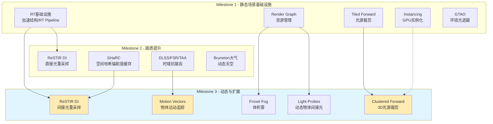

Milestone 3 聚焦于动态物体支持、大规模场景性能优化以及路径追踪质量的质变级提升。在 Milestone 2 完成画质全面提升的基础上，M3 解决了静态场景向动态场景演进的核心技术挑战，同时引入更先进的实时光线追踪算法，将间接光渲染质量推向接近离线渲染的水平。

本阶段的技术演进遵循从**静态基础设施**到**动态扩展**、从**小规模场景**到**大规模场景**的递进路径，在保持架构一致性的同时逐步增强系统的可扩展性。

Sources: [milestone-3.md](https://github.com/1PercentSync/himalaya/blob/main/docs/roadmap/milestone-3.md)

## M3 技术方向总览

M3 内部包含四个相互独立的技术方向，可根据实际 Demo 需求灵活安排优先级：

| 方向 | 核心目标 | 适用场景 |
|------|----------|----------|
| **效果优化** | 补全画面明显短板 | 室内灯光氛围展示 |
| **动态物体支持** | 实现非角色动态物体的完整渲染 | 角色/动态物体展示 |
| **性能优化** | 支撑更大规模场景 | 大场景漫游展示 |
| **PT 升级** | 间接光质量质变 | 高质量渲染展示 |

Sources: [milestone-3.md](https://github.com/1PercentSync/himalaya/blob/main/docs/roadmap/milestone-3.md#L1-L58)

## 动态物体支持架构

动态物体是 M3 最核心的架构扩展方向。在 Milestone 1-2 的静态场景中，所有物体位置固定，渲染系统可以假设几何数据帧间不变。引入动态物体后，必须解决**间接光照**、**运动模糊**、**时域抗锯齿**三个相互关联的问题。

### Light Probes：动态物体的间接光基础

静态场景使用预烘焙的 Lightmap 存储间接光照信息。动态物体无法使用 Lightmap，因为 Lightmap 依赖于 UV 展开且仅对静态几何有效。Light Probes 提供一种**采样位置驱动的间接光查询机制**：

```cpp
// MeshInstance 已预留 prev_transform 字段（M1 阶段四引入）
struct MeshInstance {
    uint32_t mesh_id;
    uint32_t material_id;
    glm::mat4 transform{1.0f};
    glm::mat4 prev_transform{1.0f};  // M2+ motion vectors
    AABB world_bounds;
};
```

M3 的 Light Probes 采用简化实现：**在场景关键位置放置 Probe 点，动态物体在最近 Probe 之间三线性插值采样**。与完整的四面体剖分相比，此方案实现成本低，且足以满足演示需求。Probe 数据从 Lightmap 插值获取，复用已有的烘焙基础设施。

### Motion Vectors：时域效果的基石

Per-object motion vectors 是所有时域效果（DLSS/FSR 上采样、Motion Blur、Temporal Filtering）正常工作的基础设施。Milestone 2 已接入 DLSS/FSR 和 TAA，但这些效果在静态场景下仅依赖**相机运动向量**。引入动态物体后，物体自身运动必须被正确追踪：

1. **Velocity Buffer 生成**：在 DepthPrePass 或 ForwardPass 中输出屏幕空间运动向量
2. **数据需求**：当前帧 VP 矩阵 + 上一帧物体变换矩阵 → 上一帧 VP 矩阵
3. **集成点**：利用 MeshInstance::prev_transform 计算物体运动贡献

运动向量的精度直接影响 TAA 的稳定性和 DLSS 的画面质量。M3 实现完整的 2D 运动向量（物体运动 + 相机运动），替代 M2 仅有相机运动的简化版本。

### Per-Object Motion Blur

Milestone 2 实现的 Camera Motion Blur 仅模糊相机运动造成的画面变化，物体运动不会产生模糊。M3 升级为 Per-Object Motion Blur，使移动物体具有独立的运动模糊轨迹：

- **实现方式**：基于运动向量的方向性模糊（Directional Blur）
- **输入**：Velocity Buffer + Depth Buffer
- **输出**：运动模糊后的颜色缓冲
- **与 TAA 的关系**：Motion Blur 在 TAA 之后应用，避免双重模糊

MSAA + TAA/Upscaler 组合模式开放给用户配置：纯 MSAA（高性能）、纯 Upscaler（高画质）、MSAA + Upscaler（平衡）。这一配置选项在 M3 阶段正式暴露到设置界面。

Sources: [milestone-3.md](https://github.com/1PercentSync/himalaya/blob/main/docs/roadmap/milestone-3.md#L21-L30), [scene_data.h](https://github.com/1PercentSync/himalaya/blob/main/framework/include/himalaya/framework/scene_data.h#L45-L60)

## 性能与规模优化

Milestone 1-2 的技术栈针对中等规模场景（Sponza 级别）设计。M3 引入一系列性能优化手段，支撑更大规模的场景渲染。

### Clustered Forward：光源规模扩展

Milestone 2 引入的 Tiled Forward 在屏幕空间将视口划分为 2D Tile，每个 Tile 维护影响它的光源列表。这一方案在光源数量较少时表现良好，但当光源数量显著增长（如室内多房间场景）时，深度方向的光源重叠会导致性能瓶颈。

Clustered Forward 从 2D Tile 升级为 **3D Cluster**，沿深度方向切分为三维网格：

```
Tiled Forward:    屏幕空间 2D 网格 (N×M tiles)
                  ↓
Clustered Forward: 视锥体 3D 网格 (N×M×K clusters)
                  ↓
                  深度方向的光源裁剪大幅减少 over-shading
```

Clustered 方案的光源列表构建在 Compute Shader 中完成，与 Tiled 相比额外引入了 cluster 分配和光源映射步骤，但换来的是**光源数量增长后的性能保障**。M3 将光照系统从 Tiled 升级为 Clustered，为后续的多光源场景（如夜景灯光）打下基础。

### Hardware Occlusion Query：零瑕疵遮挡剔除

Milestone 1 使用视锥体剔除（Frustum Culling）剔除视口外的物体，但无法处理视口内被其他物体完全遮挡的情况。Hardware Occlusion Query 提供 GPU 驱动的遮挡剔除：

- **保守两趟策略**：第一趟渲染已知可见物体 + 深度写入，第二趟对潜在被遮挡物体发起查询
- **深度 PrePass 复用**：利用已有的深度预渲染结果作为遮挡查询的参考深度
- **零瑕疵**：查询结果是确定性的，不存在基于历史缓冲的误判

此技术在室内多房间场景收益最大——走廊另一端的房间物体虽然位于视锥体内，但被墙壁完全遮挡，查询结果可剔除这些物体的渲染。

### 离散 LOD 与 Dithering Cross-Fade

Level of Detail（LOD）根据物体距离切换不同精度的网格，远处物体使用低面数模型以减少 GPU 负载：

- **离散 LOD**：预构建 3-4 级精度不同的网格，根据屏幕空间占比选择级别
- **Dithering Cross-Fade**：LOD 切换时使用抖动过渡，避免突然的网格跳变
- **与 Instancing 配合**：M1 阶段四引入的 Instancing 基础设施与 LOD 自然兼容

### Shadow Atlas：多光源阴影管理

Milestone 1-2 的阴影系统针对单方向光设计，使用固定的级联阴影贴图（CSM）。M3 引入的点光源/聚光灯阴影需要新的管理机制：

- **Shadow Atlas**：单张大纹理容纳多个光源的阴影贴图
- **按需分配**：根据光源重要性动态分配分辨率
- **按需更新**：静态光源缓存不重渲染，动态光源每帧更新

Shadow Atlas 统一管理和调度所有阴影资源，解决多光源场景下的阴影内存爆炸问题。

Sources: [milestone-3.md](https://github.com/1PercentSync/himalaya/blob/main/docs/roadmap/milestone-3.md#L32-L46)

## 效果优化与画面补全

M3 针对 M1-M2 遗留的画面短板进行补全，提升整体视觉完成度。

### 点光源/聚光灯阴影

Milestone 2 的阴影系统仅支持方向光（太阳/月亮）。室内场景的核心视觉元素——灯具——需要点光源和聚光灯的投影阴影：

- **点光源**：使用 Cubemap 或 Dual Paraboloid 阴影贴图，6 个方向覆盖全空间
- **聚光灯**：单张透视阴影贴图，与方向光 CSM 类似但使用透视投影
- **缓存策略**：静态光源的 shadow map 烘焙缓存，仅在光源移动时重渲染

### Froxel Volumetric Fog

Milestone 2 的 Screen-Space God Rays 作为体积光效果的占位方案，M3 升级为完整的 Froxel Volumetric Fog：

- **Froxel 网格**：视锥体切分的 3D 体素网格（与 Clustered Forward 复用同一网格）
- **Ray Marching**：沿视线方向在 Froxel 内积分散射和衰减
- **光源参与**：支持方向光、点光源、聚光灯的光柱效果
- **效果提升**：体积光柱、晨雾阳光等效果质变，与点光源阴影配合提升室内氛围

### Multiscatter GGX 与 PBR Neutral Tonemapping

两个材质和色调映射层面的优化：

**Multiscatter GGX**：高粗糙度金属表面的能量守恒修正。传统 GGX 在粗糙度接近 1 时会损失能量，导致高粗糙金属比应有的更暗。Multiscatter GGX 通过预计算的 LUT 修正这一问题，复用 M1 阶段三建立的 IBL LUT 基础设施。

**Khronos PBR Neutral**：替换 ACES Tonemapping，专为 PBR 工作流设计。ACES 会对高亮区域进行强烈的色相偏移，干扰材质外观判断。PBR Neutral 保持材质颜色的感知一致性，实现"所见即所得"。

Sources: [milestone-3.md](https://github.com/1PercentSync/himalaya/blob/main/docs/roadmap/milestone-3.md#L11-L20)

## 路径追踪间接光升级

Milestone 2 的实时路径追踪模式（PT Mode）使用 **SHaRC**（Spatial Hash Radiance Cache）作为间接光加速结构。SHaRC 将间接光信息存储在 3D 哈希网格中，提供高效的辐射度查询，但存在分辨率限制——缓存是空间低频的，高频的间接光细节（如小缝隙中的颜色渗透）会被平滑掉。

### ReSTIR GI：从缓存到重采样

M3 将 SHaRC 替换为 **ReSTIR GI**（Reservoir-based Spatiotemporal Importance Resampling Global Illumination）：

```
SHaRC:  间接光 → 哈希网格缓存 → 空间低频近似
        ↓
ReSTIR GI: 间接光 → 像素级路径重采样 → 高频细节保留
```

ReSTIR GI 与 M2 引入的 ReSTIR DI 同属 ReSTIR 算法家族，共享以下核心概念：

- **Reservoir 数据结构**：存储少量高质量样本及其权重
- **时空重采样**：在时间和空间维度传播优质样本
- **MIS 权重**：平衡 NEE（Next Event Estimation）与 BSDF 采样

升级到 ReSTIR GI 后，间接光质量接近 **Cyberpunk 2077 RT Overdrive** 水平：高频 color bleeding 精确可见，小缝隙中的间接光变化清晰可辨。

```cpp
// M2 的 SHaRC 路径（简化示意）
indirect_radiance = query_sharc_cache(world_pos, normal);

// M3 的 ReSTIR GI 路径（简化示意）
reservoir = spatial_temporal_resampling(pixel_reservoir, neighbor_reservoirs);
indirect_radiance = evaluate_reservoir(reservoir, bounce_ray);
```

Sources: [milestone-3.md](https://github.com/1PercentSync/himalaya/blob/main/docs/roadmap/milestone-3.md#L48-L54), [milestone-2.md](https://github.com/1PercentSync/himalaya/blob/main/docs/roadmap/milestone-2.md#L56-L76)

## M3 架构演进路线图

M3 的技术演进建立在前序里程碑的基础设施之上，形成清晰的依赖链条：



### 技术依赖关系详解

| M3 特性 | 前置依赖 | 集成点 |
|---------|----------|--------|
| ReSTIR GI | RT 基础设施 + ReSTIR DI 概念 | 替换 PT Mode 的间接光计算 |
| Clustered Forward | Tiled Forward + Instancing | 光源裁剪 Compute Pass 升级 |
| Motion Vectors | MeshInstance::prev_transform | Velocity Buffer 生成 |
| Light Probes | Lightmap 烘焙 + 场景数据结构 | 动态物体材质采样 |
| Froxel Fog | Clustered 3D 网格 | 体积分散射计算 |

Sources: [milestone-2.md](https://github.com/1PercentSync/himalaya/blob/main/docs/roadmap/milestone-2.md), [milestone-1/m1-rt-decisions.md](https://github.com/1PercentSync/himalaya/blob/main/docs/milestone-1/m1-rt-decisions.md)

## 与远期目标的衔接

Milestone 3 的技术选择为远期目标（M4+）预留了演进空间：

- **ReSTIR GI** 是 **ReSTIR PT**（完整路径重采样）的中间步骤，两者共享 reservoir 数据结构和重采样逻辑
- **Clustered Forward** 为 **GPU 粒子系统**提供 3D 空间划分基础设施，可用于粒子光源分配
- **Motion Vectors** 和 **Light Probes** 是角色渲染（Pre-Integrated SSS、卡通渲染面部阴影）的前置条件

M3 明确不实现的技术（但预留架构接口）包括：GPU-Driven Rendering、Mesh Shader、Nanite-style 虚拟几何、Virtual Shadow Maps 等。这些技术的实现成本与项目规模不匹配，但架构预留了替换可能。

Sources: [milestone-future.md](https://github.com/1PercentSync/himalaya/blob/main/docs/roadmap/milestone-future.md#L1-L97)

## 下一步阅读

完成 Milestone 3 后，建议按以下路径深入相关技术细节：

- 想了解 M3 的渲染基础设施架构 → [四层架构设计](https://github.com/1PercentSync/himalaya/blob/main/7-si-ceng-jia-gou-she-ji)
- 想了解光源裁剪技术演进 → [渲染Pass详解 - Pass系统概述](https://github.com/1PercentSync/himalaya/blob/main/16-passxi-tong-gai-shu)
- 想了解路径追踪基础设施 → [RT基础设施与加速结构](https://github.com/1PercentSync/himalaya/blob/main/25-rtji-chu-she-shi-yu-jia-su-jie-gou)
- 想了解材质系统架构 → [材质系统架构](https://github.com/1PercentSync/himalaya/blob/main/13-cai-zhi-xi-tong-jia-gou)

若需查阅前序里程碑的实现细节，可访问：
- [Milestone 1 - 静态场景演示](https://github.com/1PercentSync/himalaya/blob/main/27-milestone-1-jing-tai-chang-jing-yan-shi)
- [Milestone 2 - 画质全面提升](https://github.com/1PercentSync/himalaya/blob/main/28-milestone-2-hua-zhi-quan-mian-ti-sheng)