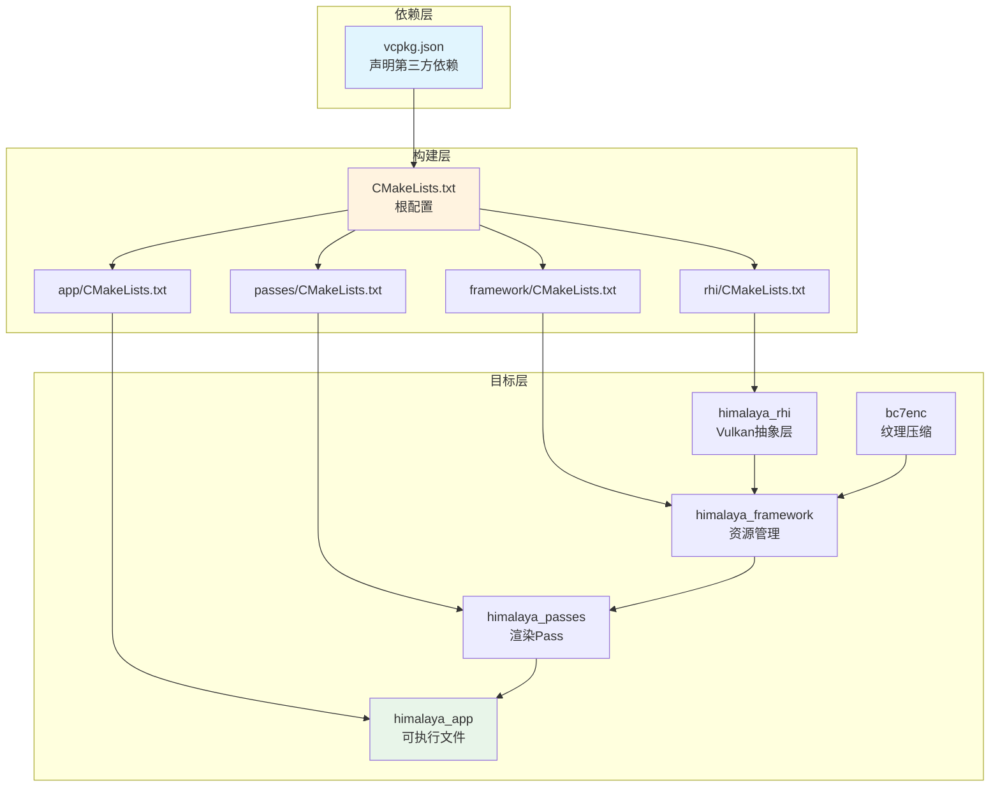
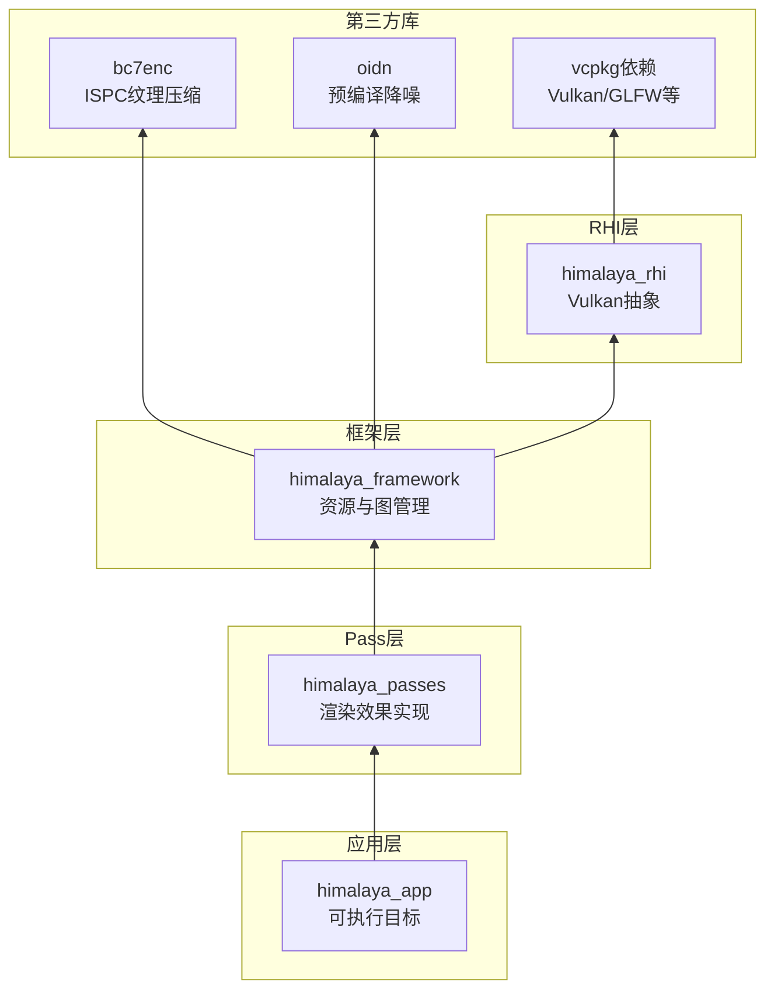
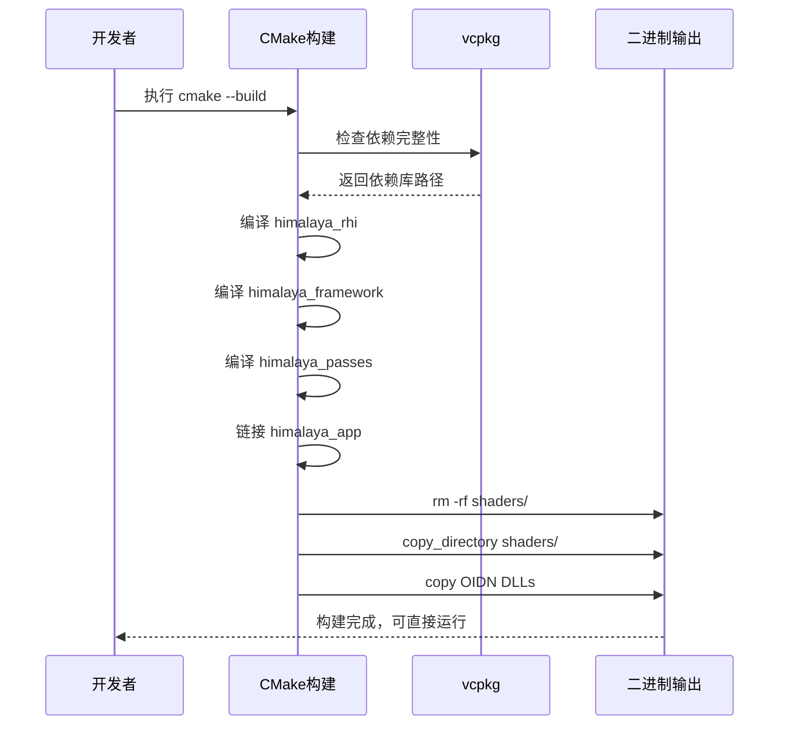

本文档面向初次接触 Himalaya 渲染引擎的开发者，详细介绍如何从零开始配置开发环境并成功构建项目。我们将按照**先决条件检查 → 依赖安装 → 项目构建 → 运行验证**的流程，帮助你快速建立可工作的开发环境。

---

## 构建系统概览

Himalaya 采用现代化的 CMake 构建系统，配合 vcpkg 进行依赖管理。这种组合提供了跨平台的构建一致性，同时简化了第三方库的获取和集成流程。整个项目被组织为**四层架构**，每一层都是独立的静态库，最终链接为可执行文件。



Sources: [CMakeLists.txt](https://github.com/1PercentSync/himalaya/blob/main/CMakeLists.txt#L1-L11), [vcpkg.json](https://github.com/1PercentSync/himalaya/blob/main/vcpkg.json#L1-L40)

---

## 先决条件检查

在开始构建之前，请确保你的开发环境满足以下最低要求：

| 组件 | 最低版本 | 说明 |
|------|----------|------|
| CMake | 4.1 | 项目根目录显式要求此版本 |
| C++ 编译器 | C++20 完整支持 | MSVC 2022 / Clang 16+ / GCC 13+ |
| Vulkan SDK | 1.3+ | 包含 Vulkan 头文件和加载器 |
| vcpkg | 最新版 | 建议使用集成到 IDE 的版本 |
| ISPC 编译器 | 1.20+ | 用于 BC7 纹理压缩的 SIMD 优化 |

**验证命令示例**：
```bash
cmake --version          # 应输出 4.1.0 或更高
vcpkg --version          # 确认 vcpkg 可用
ispc --version           # 验证 ISPC 编译器
```

Sources: [CMakeLists.txt](https://github.com/1PercentSync/himalaya/blob/main/CMakeLists.txt#L1-L5), [third_party/bc7enc/CMakeLists.txt](https://github.com/1PercentSync/himalaya/blob/main/third_party/bc7enc/CMakeLists.txt#L16-L19)

---

## 第三方依赖说明

项目的所有外部依赖都在 [vcpkg.json](https://github.com/1PercentSync/himalaya/blob/main/vcpkg.json) 中集中声明。构建时 CMake 会自动触发 vcpkg 安装这些库：

| 依赖名称 | 用途 | 版本约束 |
|----------|------|----------|
| glfw3 | 窗口管理与输入 | >= 3.4#1 |
| glm | 数学库（向量/矩阵） | >= 1.0.3 |
| spdlog | 高性能日志系统 | >= 1.17.0 |
| vulkan-memory-allocator | GPU 内存管理 | >= 3.3.0 |
| shaderc | 运行时着色器编译 | >= 2025.2 |
| imgui | 调试 UI 与工具面板 | >= 1.91.9 (含 Docking) |
| fastgltf | glTF 场景加载 | >= 0.9.0 |
| mikktspace | 切线空间计算 | >= 2020-10-06#3 |
| stb | 图像解码 | >= 2024-07-29#1 |
| xxhash | 哈希计算 | >= 0.8.3 |
| nlohmann-json | JSON 配置解析 | >= 3.12.0#2 |

**特殊依赖**：OpenImageDenoise (OIDN) 以预编译二进制形式存放在 [third_party/oidn](https://github.com/1PercentSync/himalaya/blob/main/third_party/oidn/) 目录，用于时域降噪功能。

Sources: [vcpkg.json](https://github.com/1PercentSync/himalaya/blob/main/vcpkg.json#L5-L39), [framework/CMakeLists.txt](https://github.com/1PercentSync/himalaya/blob/main/framework/CMakeLists.txt#L31-L38)

---

## 项目结构详解

理解模块间的依赖关系有助于排查构建问题。项目遵循**底层向高层依赖**的原则：



**各模块职责**：
- **bc7enc**: BC7 纹理压缩库，使用 ISPC 生成多 SIMD 架构代码
- **himalaya_rhi**: 渲染硬件接口层，封装 Vulkan API，提供设备、交换链、管线等抽象
- **himalaya_framework**: 渲染框架层，包含材质系统、Render Graph、纹理、IBL 处理
- **himalaya_passes**: 渲染 Pass 层，实现各种渲染效果（阴影、AO、色调映射等）
- **himalaya_app**: 应用层，整合各模块，处理场景加载和渲染循环

Sources: [CMakeLists.txt](https://github.com/1PercentSync/himalaya/blob/main/CMakeLists.txt#L7-L11), [rhi/CMakeLists.txt](https://github.com/1PercentSync/himalaya/blob/main/rhi/CMakeLists.txt#L1-L24), [framework/CMakeLists.txt](https://github.com/1PercentSync/himalaya/blob/main/framework/CMakeLists.txt#L1-L43), [passes/CMakeLists.txt](https://github.com/1PercentSync/himalaya/blob/main/passes/CMakeLists.txt#L1-L19), [app/CMakeLists.txt](https://github.com/1PercentSync/himalaya/blob/main/app/CMakeLists.txt#L1-L12)

---

## 分步构建指南

### 步骤 1：克隆与初始化

```bash
git clone <repository-url> himalaya
cd himalaya
```

### 步骤 2：配置 CMake 预设

Himalaya 提供 Debug 和 Release 两种预设配置。推荐使用 IDE (CLion/VS2022) 或命令行：

```bash
# 配置 Debug 构建
cmake --preset=debug -B cmake-build-debug

# 或配置 Release 构建
cmake --preset=release -B cmake-build-release
```

**首次配置时**，vcpkg 会自动下载并编译所有依赖项，这可能需要 10-30 分钟，请耐心等待。

### 步骤 3：执行构建

```bash
# Debug 构建
cmake --build cmake-build-debug --parallel

# Release 构建
cmake --build cmake-build-release --parallel
```

### 步骤 4：验证输出

构建完成后，检查输出目录是否包含以下关键文件：

```
cmake-build-debug/app/
├── himalaya_app.exe          # 可执行文件 (Windows)
├── himalaya_app              # 可执行文件 (Linux)
├── shaders/                   # 自动复制的着色器目录
│   ├── forward.vert
│   ├── forward.frag
│   └── ...
├── *.dll                      # 运行时依赖库 (Windows)
│   ├── vulkan-1.dll
│   ├── glfw3.dll
│   ├── fastgltf.dll
│   └── OpenImageDenoise*.dll
└── imgui.ini                  # ImGui 布局配置
```

Sources: [app/CMakeLists.txt](https://github.com/1PercentSync/himalaya/blob/main/app/CMakeLists.txt#L22-L38)

---

## 构建自动化流程

CMake 配置了多个**构建后自动执行**的任务，确保运行时环境完整：



**自动化任务说明**：
1. **着色器同步**：每次构建后，自动将 [shaders/](https://github.com/1PercentSync/himalaya/blob/main/shaders/) 目录复制到输出目录，确保着色器文件与可执行文件版本匹配
2. **DLL 部署**：将 OIDN 降噪库及其设备后端（CPU/CUDA/HIP/SYCL）复制到输出目录

Sources: [app/CMakeLists.txt](https://github.com/1PercentSync/himalaya/blob/main/app/CMakeLists.txt#L23-L38)

---

## 常见构建问题排查

| 问题现象 | 可能原因 | 解决方案 |
|----------|----------|----------|
| `cmake_minimum_required` 错误 | CMake 版本过低 | 升级至 CMake 4.1+ |
| vcpkg 包下载失败 | 网络连接问题 | 配置代理或使用镜像源 |
| ISPC 编译错误 | 未安装 ISPC 编译器 | 安装 ISPC 并添加到 PATH |
| Vulkan 找不到 | 未安装 Vulkan SDK | 安装 LunarG Vulkan SDK |
| 运行时缺少 DLL | 依赖库未正确复制 | 手动复制 vcpkg_installed 中的 DLL |
| 着色器加载失败 | shaders 目录未同步 | 检查构建后命令是否执行 |

---

## 进阶配置选项

对于需要自定义构建的高级用户，CMake 提供了以下可调参数：

| 选项 | 默认值 | 说明 |
|------|--------|------|
| `CMAKE_BUILD_TYPE` | Debug/Release | 控制优化级别和调试信息 |
| `CMAKE_CXX_STANDARD` | 20 | C++ 标准版本（固定为20） |
| `GLM_FORCE_DEPTH_ZERO_TO_ONE` | ON | GLM 深度范围 [0,1] 用于 Vulkan |
| `ISPC_INSTRUCTION_SETS` | 多架构 | bc7enc 的 SIMD 目标 |

**GLM 深度范围配置**是 Vulkan 渲染的关键设置，确保投影矩阵的深度范围与 Vulkan 的 [0,1] 深度缓冲区一致，而非 OpenGL 的 [-1,1]。

Sources: [rhi/CMakeLists.txt](https://github.com/1PercentSync/himalaya/blob/main/rhi/CMakeLists.txt#L10), [third_party/bc7enc/CMakeLists.txt](https://github.com/1PercentSync/himalaya/blob/main/third_party/bc7enc/CMakeLists.txt#L19)

---

## 下一步

完成构建后，建议按照以下路径继续学习：

1. **[快速开始](https://github.com/1PercentSync/himalaya/blob/main/2-kuai-su-kai-shi)** - 运行你的第一个场景
2. **[四层架构设计](https://github.com/1PercentSync/himalaya/blob/main/7-si-ceng-jia-gou-she-ji)** - 深入理解代码组织方式
3. **[RHI层 - Vulkan抽象层](https://github.com/1PercentSync/himalaya/blob/main/8-rhiceng-vulkanchou-xiang-ceng)** - 了解底层渲染接口
4. **[第三方库依赖说明](https://github.com/1PercentSync/himalaya/blob/main/4-di-san-fang-ku-yi-lai-shuo-ming)** - 详细了解各依赖的功能和用法

构建成功标志着开发环境的正式就绪，现在你可以开始探索 Himalaya 的渲染技术实现了！