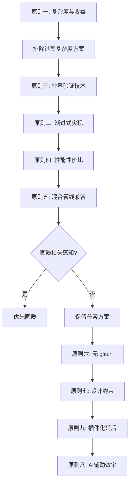
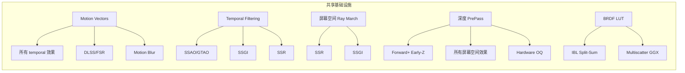

本文档阐述 Himalaya 渲染器技术选型的核心指导原则与决策理念。这些原则贯穿于从光栅化起步到混合管线光追演进的整个技术栈规划过程，是理解所有具体技术选择的底层逻辑。

本文档聚焦"为什么这样选"的方法论层面。具体决策结果见 [技术选型原则与理念](https://github.com/1PercentSync/himalaya/blob/main/31-ji-zhu-xuan-xing-yuan-ze-yu-li-nian)，详细决策推理过程见 [决策过程](https://github.com/1PercentSync/himalaya/blob/main/docs/project/decision-process.md)，项目需求与设计理念见 [需求与设计理念](https://github.com/1PercentSync/himalaya/blob/main/docs/project/requirements-and-philosophy.md)。

## 九大技术选型原则

Himalaya 项目的技术选型遵循以下九项核心原则，这些原则按优先级排序，在冲突时高层原则优先于低层原则。

### 原则一：复杂度与收益成正比

技术的实现复杂度必须与它带来的视觉或性能收益成正比。如果一个技术的实现成本远高于其收益，直接排除。

**典型应用**：排除 GPU-Driven Rendering（复杂度弥散到整个架构，场景规模不大时收益有限）、排除 Virtual Shadow Maps（实现极复杂，CSM 足以满足需求）。这两个方案虽然理论上性能上限更高，但个人项目从零实现的性价比过低。

Sources: [requirements-and-philosophy.md](https://github.com/1PercentSync/himalaya/blob/main/docs/project/requirements-and-philosophy.md#L24-L27), [decision-process.md](https://github.com/1PercentSync/himalaya/blob/main/docs/project/decision-process.md#L319-L324)

### 原则二：渐进式实现

先能用，再好用，再优秀。每个模块按 Pass 1/2/3 分阶段实现：

| 阶段 | 目标 | 示例 |
|------|------|------|
| Pass 1 | 最简可用版本 | 暴力 Forward、基础 Shadow Map |
| Pass 2 | 复杂度适中、收益大的升级 | Tiled Forward、CSM、PCSS |
| Pass 3 | 复杂度容忍范围内、收益依旧大的进一步提升 | Clustered Forward、SDF 阴影混合 |

演进应尽可能自然——在已有基础上加东西而非推翻重来。Pass 之间可跳过中间步骤，不是每个模块都必须有三步。

Sources: [requirements-and-philosophy.md](https://github.com/1PercentSync/himalaya/blob/main/docs/project/requirements-and-philosophy.md#L28-L38)

### 原则三：业界已验证的技术

采用业界已被采用过的、有成熟实现和资料的技术。不做实验性方案。资料丰富度直接影响 AI 辅助开发的可靠性。

**技术采纳标准**：
- 有公开论文、演讲或开源实现
- 至少一个主流游戏引擎或渲染器实际使用
- 实现细节有明确参考来源

Sources: [requirements-and-philosophy.md](https://github.com/1PercentSync/himalaya/blob/main/docs/project/requirements-and-philosophy.md#L39-L41)

### 原则四：性能性价比

技术选型始终考虑性能付出与画面质量的比值。同等画面质量下选性能更优的方案；同等性能下选画面更好的方案。

**实践体现**：GTAO 跳过 HBAO 直达 GTAO——两者架构相同（输入 depth+normal，输出 AO 标量），区别仅在 shader 采样逻辑约 40 行代码差异。与其 M2 替换丢弃品，不如直接实现 GTAO。

Sources: [requirements-and-philosophy.md](https://github.com/1PercentSync/himalaya/blob/main/docs/project/requirements-and-philosophy.md#L42-L45), [decision-process.md](https://github.com/1PercentSync/himalaya/blob/main/docs/project/decision-process.md#L235-L243)

### 原则五：混合管线兼容是加分项

在选择 A 和 B 之间，如果 A 能保留到混合管线而 B 不能，可接受 A 有略微更长的工期或略微更差的性能。但**不为兼容性牺牲感知强烈的当前画质**。

**典型应用**：选择 Forward+ 而非 Deferred——Forward+ 在光栅化阶段性能略低于 Deferred（需 Light Culling），但它天然支持 MSAA 且便于混合 RT 管线。Deferred 的 GBuffer 缺失可通过按需生成 thin GBuffer 解决（成本仅在 RT 启用时存在）。

Sources: [requirements-and-philosophy.md](https://github.com/1PercentSync/himalaya/blob/main/docs/project/requirements-and-philosophy.md#L46-L53), [decision-process.md](https://github.com/1PercentSync/himalaya/blob/main/docs/project/decision-process.md#L1-L47)

### 原则六：不可有明显 glitch

画面可以不精确但不能有明显的视觉瑕疵。在锐利+闪烁和模糊+不闪烁之间，选择后者。在多画和漏画之间，选择多画。

**实际措施**：
- CSM texel snapping（消除移动闪烁）
- PCSS 配合 temporal filtering（消除采样噪声）
- Hardware Occlusion Query 保守两趟策略（零漏画）

Sources: [requirements-and-philosophy.md](https://github.com/1PercentSync/himalaya/blob/main/docs/project/requirements-and-philosophy.md#L54-L59)

### 原则七：设计约束换技术简洁度

可接受场景动态灵活性的下降来换取视觉效果和性能的优先。

**关键应用**：限制同时仅一扇可见门可交互——避免 Lightmap 组合爆炸；多套 Lightmap blend 替代实时 GI，用离线烘焙质量解决通常需要复杂实时 GI 系统的问题。

Sources: [requirements-and-philosophy.md](https://github.com/1PercentSync/himalaya/blob/main/docs/project/requirements-and-philosophy.md#L60-L64)

### 原则八：AI 辅助开发下的效率考量

AI 有能力直接写出整个渲染器，瓶颈在于审查理解以及缺乏经验导致的返工。因此：
- 方案的资料丰富度和成熟度很重要
- 架构决策的正确性优于实现速度
- 模块化设计减少返工的影响范围

Sources: [requirements-and-philosophy.md](https://github.com/1PercentSync/himalaya/blob/main/docs/project/requirements-and-philosophy.md#L65-L70)

### 原则九：插件化与延后实现

不是所有东西都需要立刻做。后处理等效果天然是独立的全屏 pass，可插件化设计、独立启用/禁用，排在渲染系统主体完成之后实现。

**分层实现策略**：
- 核心渲染管线（主体）
- 独立可开关效果（Bloom、Color Grading、Vignette 等）
- 低优先级效果（DOF、Motion Blur、体积云等）

Sources: [requirements-and-philosophy.md](https://github.com/1PercentSync/himalaya/blob/main/docs/project/requirements-and-philosophy.md#L71-L73)

## 原则间的决策关系

九项原则在实际决策中并非孤立运作，而是形成相互支撑的决策网络：

Sources: [decision-process.md](https://github.com/1PercentSync/himalaya/blob/main/docs/project/decision-process.md#L399-L426)

## 渐进式演进路径设计

技术演进不是线性的，而是遵循特定模式：

### 演进模式类型

| 演进类型 | 说明 | 示例 |
|----------|------|------|
| **渐进增强** | 在已有基础上加功能 | 暴力 Forward → Tiled Forward → Clustered Forward |
| **替换关系** | 后阶段实现后前阶段退役 | 高度雾 → Bruneton aerial perspective |
| **条件性演进** | 依赖其他系统存在时才可行 | SDF 阴影混合（仅当 SDF GI 基础设施存在） |
| **并行独立** | 不同演进线互不影响 | 阴影系统 vs GI 系统 |

Sources: [requirements-and-philosophy.md](https://github.com/1PercentSync/himalaya/blob/main/docs/project/requirements-and-philosophy.md#L86-L95), [decision-process.md](https://github.com/1PercentSync/himalaya/blob/main/docs/project/decision-process.md#L399-L405)

### 条件性演进路径

部分技术的演进取决于其他系统的存在：

| 条件技术 | 依赖的基础设施 | 决策逻辑 |
|----------|---------------|----------|
| SDF 阴影混合 | SDF GI 基础设施 | 单独为阴影建 SDF 不划算，GI 引入时边际成本低 |
| Irradiance Probes | SDF 基础设施 | 同 SDF 阴影混合 |
| WBOIT | 简单排序出现问题时 | 按需启用，透明 pass 代码量少 |
| Shadow Atlas | 光源数量增长到需调度时 | 动态光源不多时独立 Cubemap SM 够用 |

Sources: [requirements-and-philosophy.md](https://github.com/1PercentSync/himalaya/blob/main/docs/project/requirements-and-philosophy.md#L92-L95)

## 基础设施复用策略

多个看似独立的系统共享底层基础设施，一次建设多处受益：

Sources: [requirements-and-philosophy.md](https://github.com/1PercentSync/himalaya/blob/main/docs/project/requirements-and-philosophy.md#L78-L85)

## 技术决策的核心权衡

### 渲染框架选择

**Forward+ vs Deferred vs Visibility Buffer**

| 维度 | Forward+ | Deferred | Visibility Buffer |
|------|----------|----------|-------------------|
| 多光源性能 | 需 Light Culling | 原生解耦好 | 需 GPU-driven |
| MSAA 支持 | ✅ 原生 | ❌ 不兼容 | ✅ 原生 |
| 移动端兼容 | ✅ TBDR 友好 | ❌ 根本上不兼容 | ⚠️ 需验证 |
| 材质灵活性 | ✅ 自由 | ⚠️ GBuffer 编码压力 | ✅ 自由 |
| 屏幕空间效果 | 需 PrePass | 天然支持 | 需 PrePass |
| 混合管线友好度 | ✅ 便于 RT | ⚠️ 需 thin GBuffer | ✅ 便于 RT |
| 实现复杂度 | 中等 | 中等 | 高（资料少） |

**决策**：选择 Forward+——平台兼容和 MSAA 是架构级不可逆收益，代价可通过额外工作弥补，无感知强烈的质量损失。

Sources: [decision-process.md](https://github.com/1PercentSync/himalaya/blob/main/docs/project/decision-process.md#L1-L51)

### 路径追踪演进路线

光栅化管线保留为完整独立渲染模式，RT 能力渐进引入：

| 阶段 | 引入内容 | 技术栈 |
|------|----------|--------|
| M1 | GPU PT 烘焙器 + 参考视图 | NEE、MIS、低差异序列、OIDN GPU |
| M2 | 实时 PT + 混合 RT 效果 | ReSTIR DI、SHaRC、NRD |
| M3 | 间接光升级 | ReSTIR GI 替换 SHaRC |
| Future | 神经网络渲染 | NRC、DLSS Ray Reconstruction、ReSTIR PT |

Sources: [technical-decisions.md](https://github.com/1PercentSync/himalaya/blob/main/docs/project/technical-decisions.md#L307-L354), [decision-process.md](https://github.com/1PercentSync/himalaya/blob/main/docs/project/decision-process.md#L341-L383)

## 技术选型检查清单

当面临技术选择时，使用以下检查清单：

1. **复杂度检查**：该方案的实现成本是否与其收益成正比？
2. **资料检查**：是否有成熟的公开实现和详细文档？
3. **渐进检查**：能否分阶段实现，从简单版本起步？
4. **平台检查**：是否"不关上移动端的门"？
5. **兼容检查**：是否便于未来混合管线演进？
6. **质量检查**：是否避免了明显的视觉瑕疵？
7. **约束检查**：是否可通过设计约束简化技术方案？
8. **AI检查**：资料丰富度是否适合 AI 辅助开发？

Sources: [requirements-and-philosophy.md](https://github.com/1PercentSync/himalaya/blob/main/docs/project/requirements-and-philosophy.md#L14-L73)

## 下一步阅读

理解技术选型原则后，建议按以下顺序深入具体领域：

1. **[架构约束与边界](https://github.com/1PercentSync/himalaya/blob/main/32-jia-gou-yue-shu-yu-bian-jie)** — 了解架构层面的硬性约束和组件边界
2. **[实时GI与烘焙方案演进](https://github.com/1PercentSync/himalaya/blob/main/33-shi-shi-giyu-hong-bei-fang-an-yan-jin)** — GI 技术选型的深入分析
3. **[四层架构设计](https://github.com/1PercentSync/himalaya/blob/main/7-si-ceng-jia-gou-she-ji)** — 技术原则在架构层次中的体现
4. **[Milestone 1 - 静态场景演示](https://github.com/1PercentSync/himalaya/blob/main/27-milestone-1-jing-tai-chang-jing-yan-shi)** — 当前阶段技术选型的具体落地