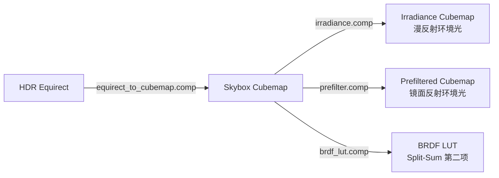
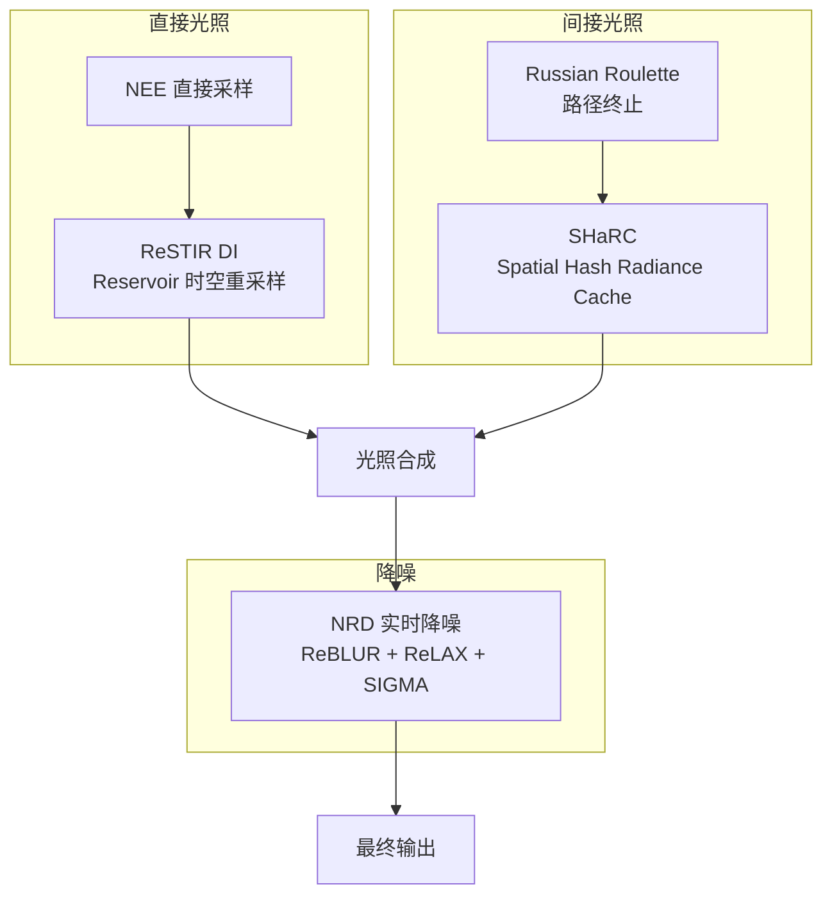
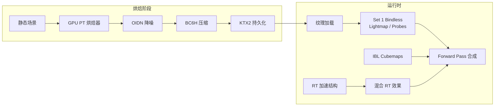

全局光照（Global Illumination, GI）是实时渲染领域最具挑战性的技术课题之一。本文档阐述 Himalaya 渲染器在 GI 领域的渐进式演进策略——从静态场景烘焙起步，逐步引入实时路径追踪，最终形成烘焙与实时混合的完整 GI 管线。

## 核心架构原则

GI 系统的演进遵循两条并行轨道：**预计算烘焙管线**与**实时计算管线**。两者并非替代关系，而是根据场景特性、性能预算和视觉效果需求协同工作。

```
┌─────────────────────────────────────────────────────────────────────┐
│                        GI 架构双轨演进                               │
├─────────────────────────────────────────────────────────────────────┤
│                                                                     │
│   预计算烘焙管线 (离线/准实时)        实时计算管线 (每帧执行)            │
│   ┌─────────────────────────┐         ┌─────────────────────────┐      │
│   │ • GPU PT 烘焙器          │         │ • PT 参考视图 (Debug)    │      │
│   │ • Lightmap 纹理          │         │ • 实时 PT (ReSTIR+SHaRC) │      │
│   │ • Reflection Probes    │         │ • 混合 RT 效果           │      │
│   │ • IBL Cubemap           │         │ • SSGI (屏幕空间)        │      │
│   └─────────────────────────┘         └─────────────────────────┘      │
│              │                                    │                  │
│              └────────────┬───────────────────────┘                  │
│                           ▼                                        │
│                    ┌─────────────┐                                  │
│                    │  前向渲染合成  │                                  │
│                    │  Forward Pass │                                  │
│                    └─────────────┘                                  │
│                                                                     │
└─────────────────────────────────────────────────────────────────────┘
```

Sources: [docs/project/technical-decisions.md#L307-L380](https://github.com/1PercentSync/himalaya/blob/main/docs/project/technical-decisions.md#L307-L380), [docs/roadmap/milestone-2.md#L56-L76](https://github.com/1PercentSync/himalaya/blob/main/docs/roadmap/milestone-2.md#L56-L76)

## M1 阶段：烘焙基础设施建立

Milestone 1 的核心目标是建立**静态场景的高质量离线渲染能力**，为后续实时 GI 奠定数据基础和验证手段。

### GPU 路径追踪烘焙器

Himalaya 直接实现 GPU 路径追踪烘焙器，跳过传统外部工具链（如 Blender 烘焙）的依赖。烘焙器与参考视图共享同一 PT 核心，确保光照结果的一致性。

烘焙产物采用以下格式管线：

| 资源 | 累积格式 | 最终格式 | 持久化格式 |
|------|---------|---------|-----------|
| Lightmap | RGBA32F | BC6H | KTX2 (BC6H) |
| Reflection Probe | RGBA32F | BC6H + Mip Chain | KTX2 (BC6H) |

烘焙流程采用渐进式累积：每帧 dispatch N 个采样 → 累积到 accumulation buffer → OIDN 降噪 → BC6H 压缩 → KTX2 持久化。复用已有的 [IBL BC6H 压缩管线](https://github.com/1PercentSync/himalaya/blob/main/13-cai-zhi-xi-tong-jia-gou) 和 KTX2 读写基础设施。

Sources: [docs/milestone-1/m1-rt-decisions.md#L116-L122](https://github.com/1PercentSync/himalaya/blob/main/docs/milestone-1/m1-rt-decisions.md#L116-L122), [docs/milestone-1/m1-rt-decisions.md#L180-L188](https://github.com/1PercentSync/himalaya/blob/main/docs/milestone-1/m1-rt-decisions.md#L180-L188)

### IBL 环境光照系统

基于物理的图像照明（Image-Based Lighting）是 GI 系统的环境光基底。系统从 HDR 环境贴图生成三项核心资源：



**漫反射环境光**通过余弦加权半球卷积计算，每个输出纹素积分以其法线方向为中心的半球，权重为 `cos(θ)`。采用均匀角度步进的球坐标积分，Firefly 拒绝阈值防止极端 HDR 值（如太阳 65504）主导积分结果。Sources: [shaders/ibl/irradiance.comp#L1-L72](https://github.com/1PercentSync/himalaya/blob/main/shaders/ibl/irradiance.comp#L1-L72)

**镜面反射环境光**使用 GGX 重要性采样对各个粗糙度级别进行预过滤。Split-Sum 近似假设 `V = R = N`，通过重要性采样 GGX 分布来预计算环境镜面反射。Sources: [shaders/ibl/prefilter.comp#L1-L80](https://github.com/1PercentSync/himalaya/blob/main/shaders/ibl/prefilter.comp#L1-L80)

IBL 产物支持 KTX2 缓存，基于源 HDR 文件的内容哈希自动复用，避免重复计算。Sources: [framework/src/ibl.cpp#L246-L382](https://github.com/1PercentSync/himalaya/blob/main/framework/src/ibl.cpp#L246-L382)

### 前向渲染中的 GI 合成

光栅化管线中，GI 由多个组件在 [Forward Pass](https://github.com/1PercentSync/himalaya/blob/main/18-qian-xiang-xuan-ran-pass) 内合成：

```glsl
// IBL 环境光照 (Split-Sum 近似)
vec3 irradiance  = texture(irradiance_cubemap, N).rgb;
vec3 prefiltered = textureLod(prefiltered_cubemap, R, roughness_mip).rgb;
vec2 brdf_lut    = texture(brdf_lut, vec2(NdotV, roughness)).rg;

vec3 ibl_diffuse  = irradiance * diffuse_color;
vec3 ibl_specular = prefiltered * (F0 * brdf_lut.x + brdf_lut.y);

// AO 调制
float combined_ao = ssao * material_ao;
vec3 diffuse_ao = multi_bounce_ao(combined_ao, diffuse_color);
float specular_ao = gtso_specular_occlusion(bent_normal, R, ssao, roughness);

// 最终合成
color = (direct_diffuse + direct_specular)
      + ibl_intensity * (ibl_diffuse * diffuse_ao + ibl_specular * specular_ao)
      + emissive;
```

Sources: [shaders/forward.frag#L239-L307](https://github.com/1PercentSync/himalaya/blob/main/shaders/forward.frag#L239-L307)

### GTAO 环境光遮蔽

M1 实现了 [GTAO (Ground Truth Ambient Occlusion)](https://github.com/1PercentSync/himalaya/blob/main/22-gtaosuan-fa-shi-xian) 作为屏幕空间遮挡方案，包括：
- 基础 horizon-based 遮挡计算
- 空间降噪 (Spatial Filtering)
- 时域降噪 (Temporal Filtering)
- Multi-bounce AO 颜色补偿
- GTSO 镜面反射遮蔽

GTAO 输出与 IBL 在 Forward Pass 中调制，提供高频接触阴影细节，弥补 Lightmap 低频特性。

Sources: [docs/project/technical-decisions.md#L114-L125](https://github.com/1PercentSync/himalaya/blob/main/docs/project/technical-decisions.md#L114-L125)

## M2 阶段：实时路径追踪与混合 RT

Milestone 2 引入**实时路径追踪模式**和**混合 RT 效果**，画面水平目标为 DOOM: The Dark Ages 的路径追踪模式。

### 实时 PT 技术栈



**ReSTIR DI** 通过 Reservoir-based 时空重采样，实现百万级光源的高效直接光照采样。**SHaRC (Spatial Hash Radiance Cache)** 允许间接光路径提前终止并查询缓存，大幅降低反弹计算开销。**NRD** 提供 GPU 实时降噪能力：ReBLUR 处理间接光、ReLAX 处理 ReSTIR 信号、SIGMA 处理阴影。

Sources: [docs/roadmap/milestone-2.md#L56-L65](https://github.com/1PercentSync/himalaya/blob/main/docs/roadmap/milestone-2.md#L56-L65), [docs/project/technical-decisions.md#L345-L354](https://github.com/1PercentSync/himalaya/blob/main/docs/project/technical-decisions.md#L345-L354)

### 混合 RT 效果

仅选择光栅化有明显视觉瑕疵的效果用 RT 替代：

| 效果 | 替换目标 | 选择理由 |
|------|---------|---------|
| RT Reflections | SSR + Reflection Probes | SSR 屏幕边缘反射消失、Probes 低频近似失真 |
| RT Shadows | CSM / PCSS | Shadow map 分辨率锯齿、cascade 边界过渡、远处阴影消失 |

RT Reflections 和 RT Shadows 通过 `VK_KHR_ray_query` 在 fragment/compute shader 中内联执行，而非完整 RT Pipeline。这种混合方案在保持光栅化管线主体架构的同时，用 RT 解决最关键的视觉效果短板。

未入选的 RT 效果：RTAO（GTAO 观感尚可）、RT GI（Lightmap 基底已缓解屏幕空间限制）。Sources: [docs/roadmap/milestone-2.md#L68-L76](https://github.com/1PercentSync/himalaya/blob/main/docs/roadmap/milestone-2.md#L68-L76), [docs/project/technical-decisions.md#L355-L364](https://github.com/1PercentSync/himalaya/blob/main/docs/project/technical-decisions.md#L355-L364)

### SSGI 屏幕空间间接光

在 Lightmap 基底之上叠加 SSGI，补充屏幕空间的高频间接光变化。与 SSR 共享大量基础代码（Ray March 核心），为动态物体和过渡态（如门开关）提供实时间接光响应。

Sources: [docs/roadmap/milestone-2.md#L44-L53](https://github.com/1PercentSync/himalaya/blob/main/docs/roadmap/milestone-2.md#L44-L53)

## M3 阶段：动态物体与间接光升级

Milestone 3 解决动态物体支持和间接光质量跳跃。

### 动态物体 GI

| 组件 | 方案 |
|------|------|
| 间接光接收 | Light Probes 采样 Lightmap 插值结果 |
| 运动向量 | Per-object motion vectors（支持所有 temporal 效果） |
| 运动模糊 | Per-Object Motion Blur 替换 Camera Motion Blur |

Light Probes 在场景 AABB 内按固定间距放置，通过 RT 射线检测剔除落在几何体内部的探针。动态物体运行时采样最近探针的 Lightmap 插值结果。

Sources: [docs/roadmap/milestone-3.md#L20-L28](https://github.com/1PercentSync/himalaya/blob/main/docs/roadmap/milestone-3.md#L20-L28)

### ReSTIR GI 升级

M3 核心升级是用 **ReSTIR GI** 替换 SHaRC，间接光从"柔和模糊"（哈希网格分辨率限制）提升到像素级路径重采样。高频 color bleeding 和小缝隙间接光变化精确可见，画面水平接近 Cyberpunk 2077 RT Overdrive。

ReSTIR GI 与 M2 的 ReSTIR DI 同属 ReSTIR 家族，共享概念和基础设施，实现成本低于独立引入全新技术栈。Sources: [docs/roadmap/milestone-3.md#L43-L48](https://github.com/1PercentSync/himalaya/blob/main/docs/roadmap/milestone-3.md#L43-L48), [docs/project/technical-decisions.md#L366-L369](https://github.com/1PercentSync/himalaya/blob/main/docs/project/technical-decisions.md#L366-L369)

## 远期演进：神经网络渲染

两条技术演进线将在未来阶段交汇：

### 神经网络替代传统组件

| 方向 | 技术 | 说明 |
|------|------|------|
| 间接光缓存 | NRC (Neural Radiance Cache) | 神经网络替代 SHaRC 哈希表，精度更高，依赖 Tensor Core |
| 降噪 | DLSS Ray Reconstruction | 神经网络替代 NRD 传统降噪，单 pass transformer 推理 |
| 标准化 | Cooperative Vectors | DXR 1.2 / SM 6.9 标准化 shader 内神经网络推理，使上述技术跨厂商可用 |

### 算法统一

**ReSTIR PT** 在 GRIS (Generalized Resampled Importance Sampling) 框架下对完整光传输路径做重采样，统一替代 ReSTIR DI + ReSTIR GI 的分离架构，简化管线并提升采样效率。

Sources: [docs/roadmap/milestone-future.md#L53-L61](https://github.com/1PercentSync/himalaya/blob/main/docs/roadmap/milestone-future.md#L53-L61)

## GI 数据流与资源管理



GI 资源的 Set 1 Bindless 架构在阶段二设计时已预留容量：`sampler2D[]` binding 0 用于 Lightmap，`samplerCube[]` binding 1 用于 Reflection Probes。这种前瞻性设计确保后续 GI 功能扩展无需改动核心描述符架构。

Sources: [docs/milestone-1/m1-phase-future-decisions.md#L8-L16](https://github.com/1PercentSync/himalaya/blob/main/docs/milestone-1/m1-phase-future-decisions.md#L8-L16)

## 相关页面

- [路径追踪参考视图](https://github.com/1PercentSync/himalaya/blob/main/26-lu-jing-zhui-zong-can-kao-shi-tu) - PT 调试渲染的详细实现
- [GTAO算法实现](https://github.com/1PercentSync/himalaya/blob/main/22-gtaosuan-fa-shi-xian) - 屏幕空间环境光遮蔽
- [Milestone 2 - 画质全面提升](https://github.com/1PercentSync/himalaya/blob/main/28-milestone-2-hua-zhi-quan-mian-ti-sheng) - 实时 PT 与混合 RT 效果规划
- [Milestone 3 - 动态物体与性能优化](https://github.com/1PercentSync/himalaya/blob/main/29-milestone-3-dong-tai-wu-ti-yu-xing-neng-you-hua) - ReSTIR GI 与动态物体支持
- [BRDF与光照计算](https://github.com/1PercentSync/himalaya/blob/main/35-brdfyu-guang-zhao-ji-suan) - PBR 核心数学与 Split-Sum 近似
- [IBL烘焙管线](https://github.com/1PercentSync/himalaya/blob/main/framework/src/ibl.cpp) - 环境光照的离线预处理实现