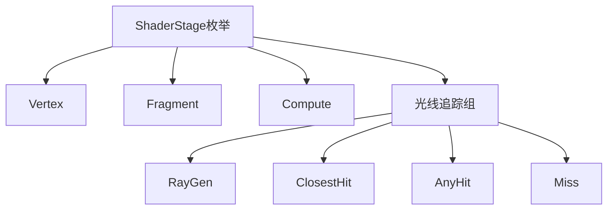
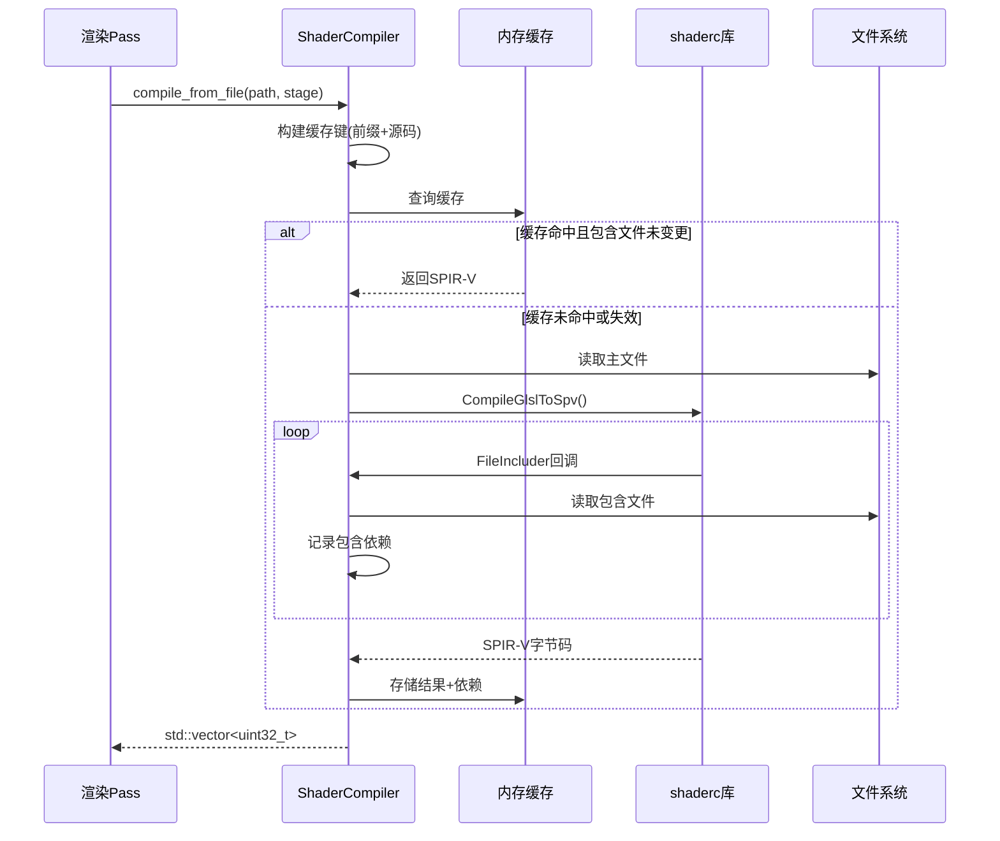

Himalaya引擎采用Vulkan SPIR-V管线架构，通过**运行时编译**策略将GLSL源码在应用启动时转换为SPIR-V字节码。这种设计平衡了开发便捷性（保持人类可读的GLSL）与运行时效率（GPU原生执行SPIR-V），同时通过智能缓存避免重复编译开销。

## 着色器架构概览

### 分层组织体系

项目的着色器文件按功能层级组织，形成清晰的架构边界：

| 目录 | 用途 | 文件类型 |
|------|------|----------|
| `shaders/common/` | 共享工具库与数据定义 | `.glsl` |
| `shaders/ibl/` | 图像光照预计算 | `.comp` |
| `shaders/rt/` | 光线追踪管线 | `.rgen`, `.rchit`, `.rahit`, `.rmiss` |
| `shaders/compress/` | 纹理压缩计算 | `.comp` |
| `shaders/` 根目录 | 光栅化渲染Pass | `.vert`, `.frag`, `.comp` |

### 着色器类型与阶段映射

引擎支持完整的Vulkan着色器阶段，通过`ShaderStage`枚举进行类型区分：



阶段前缀字符用于缓存键生成（如`V`表示Vertex，`R`表示RayGen），确保同源码不同阶段的编译结果隔离存储。

Sources: [types.h](https://github.com/1PercentSync/himalaya/blob/main/rhi/include/himalaya/rhi/types.h#L75-L84), [shader.cpp](https://github.com/1PercentSync/himalaya/blob/main/rhi/src/shader.cpp#L50-L63)

## 全局绑定布局系统

所有着色器共享统一的描述符集绑定规范，定义于`common/bindings.glsl`。这种集中式管理确保CPU端数据结构与GPU端严格一致。

### 描述符集分配策略

| 集合编号 | 用途 | 更新频率 | 绑定内容 |
|----------|------|----------|----------|
| Set 0 | 全局场景数据 | 每帧 | UBO(变换/灯光)、SSBO(材质/实例)、TLAS(RT) |
| Set 1 | Bindless纹理数组 | 初始化 | `sampler2D[]`, `samplerCube[]` |
| Set 2 | 中间渲染产物 | 动态 | HDR颜色、深度、AO、阴影图等 |
| Set 3 | Pass专用数据 | 每Dispatch | 计算图像输出、Push Descriptor |

### GPU数据结构定义

绑定文件包含与C++端精确匹配的std430布局结构体：

- **GPUDirectionalLight**: 32字节，方向光方向、强度、颜色与阴影开关
- **GPUInstanceData**: 128字节，模型矩阵、预计算法线矩阵、材质索引
- **GPUMaterialData**: 80字节，PBR参数、5个bindless纹理索引、Alpha模式

关键特性：`#ifdef HIMALAYA_RT`条件编译隔离光线追踪专属绑定（TLAS、GeometryInfoBuffer），确保非RT管线编译时不会引入RT扩展依赖。

Sources: [bindings.glsl](https://github.com/1PercentSync/himalaya/blob/main/shaders/common/bindings.glsl#L1-L190)

## 运行时编译流程

### 编译器架构

`ShaderCompiler`类封装了GLSL到SPIR-V的完整转换流程，核心依赖Google的shaderc库：



### 包含文件解析机制

`FileIncluder`实现`shaderc::CompileOptions::IncluderInterface`，支持两种包含模式：

| 模式 | 语法 | 解析规则 |
|------|------|----------|
| 相对包含 | `#include "..."` | 相对于请求文件的父目录 |
| 标准包含 | `#include <...>` | 直接从include root解析 |

所有解析文件的内容哈希被记录在缓存条目中，用于后续变更检测。

Sources: [shader.cpp](https://github.com/1PercentSync/himalaya/blob/main/rhi/src/shader.cpp#L18-L84), [shader.h](https://github.com/1PercentSync/himalaya/blob/main/rhi/include/himalaya/rhi/shader.h#L1-L111)

### 编译选项配置

```cpp
// 目标环境：Vulkan 1.4
options.SetTargetEnvironment(shaderc_target_env_vulkan, shaderc_env_version_vulkan_1_4);

#ifdef NDEBUG
    // Release模式：性能优化
    options.SetOptimizationLevel(shaderc_optimization_level_performance);
#else
    // Debug模式：零优化+调试信息，支持RenderDoc源码映射
    options.SetOptimizationLevel(shaderc_optimization_level_zero);
    options.SetGenerateDebugInfo();
#endif
```

## 着色器模块生命周期

### 创建与销毁模式

编译后的SPIR-V通过`create_shader_module()`转换为`VkShaderModule`。采用**临时模块**策略：模块在管线创建前生成，创建完成后立即销毁。

```cpp
// 典型使用模式（以ForwardPass为例）
const auto vert_spirv = sc_->compile_from_file("forward.vert", rhi::ShaderStage::Vertex);
const auto frag_spirv = sc_->compile_from_file("forward.frag", rhi::ShaderStage::Fragment);

VkShaderModule vert_module = rhi::create_shader_module(ctx_->device, vert_spirv);
VkShaderModule frag_module = rhi::create_shader_module(ctx_->device, frag_spirv);

// 创建图形管线...
pipeline_ = rhi::create_graphics_pipeline(ctx_->device, desc);

// 立即销毁模块（管线已内部拷贝必要状态）
vkDestroyShaderModule(ctx_->device, frag_module, nullptr);
vkDestroyShaderModule(ctx_->device, vert_module, nullptr);
```

### 错误处理与降级策略

Pass实现采用**失败保持**模式：当着色器编译失败时，保留旧管线继续运行，避免单文件语法错误导致整个渲染器崩溃：

```cpp
if (vert_spirv.empty() || frag_spirv.empty()) {
    spdlog::warn("ForwardPass: shader compilation failed, keeping previous pipeline");
    return;
}

// 新着色器编译成功后才销毁旧管线
if (pipeline_.pipeline != VK_NULL_HANDLE) {
    pipeline_.destroy(ctx_->device);
}
```

Sources: [forward_pass.cpp](https://github.com/1PercentSync/himalaya/blob/main/passes/src/forward_pass.cpp#L47-L82), [shader.cpp](https://github.com/1PercentSync/himalaya/blob/main/rhi/src/shader.cpp#L203-L211)

## 文件同步机制

开发过程中使用`sync-shaders.sh`脚本将源码目录同步到构建目录：

```bash
#!/usr/bin/env bash
rsync -a --delete "$SRC"/ "$DST"/
```

- `-a`: 归档模式，保留权限与时间戳
- `--delete`: 删除构建目录中已不存在的源文件

此脚本确保运行时编译器读取的是最新着色器版本，同时保持源码目录的整洁结构。

Sources: [sync-shaders.sh](https://github.com/1PercentSync/himalaya/blob/main/scripts/sync-shaders.sh#L1-L18)

## 开发规范与约定

### 头文件保护

所有`common/`下的工具库使用`#ifndef`防卫宏，防止多重包含：

```glsl
#ifndef BRDF_GLSL
#define BRDF_GLSL
// ... 内容
#endif // BRDF_GLSL
```

### 光线追踪条件编译

RT着色器必须在包含`bindings.glsl`**之前**定义`HIMALAYA_RT`宏，以启用RT专属绑定：

```glsl
#define HIMALAYA_RT
#include "common/bindings.glsl"
#include "rt/pt_common.glsl"
```

### 版本与扩展声明

- **光栅化着色器**: `#version 460` + `GL_EXT_nonuniform_qualifier`
- **RT着色器**: `#version 460` + `GL_EXT_ray_tracing` + `GL_EXT_shader_explicit_arithmetic_types_int64`

### Push Constants使用

各Pass的Push Constant布局在对应着色器中独立声明，不放入`bindings.glsl`。这种设计允许不同Pass拥有专用参数结构而不互相干扰。

Sources: [forward.frag](https://github.com/1PercentSync/himalaya/blob/main/shaders/forward.frag#L1-L2), [reference_view.rgen](https://github.com/1PercentSync/himalaya/blob/main/shaders/rt/reference_view.rgen#L1-L30), [gtao.comp](https://github.com/1PercentSync/himalaya/blob/main/shaders/gtao.comp#L35-L43)

## 下一步阅读

掌握着色器编译流程后，建议深入了解以下相关主题：

- [BRDF与光照计算](https://github.com/1PercentSync/himalaya/blob/main/35-brdfyu-guang-zhao-ji-suan) - 理解`common/brdf.glsl`的数学基础
- [RT管线着色器组](https://github.com/1PercentSync/himalaya/blob/main/37-rtguan-xian-zhao-se-qi-zu) - 光线追踪着色器的协同工作机制
- [Bindless描述符管理](https://github.com/1PercentSync/himalaya/blob/main/14-bindlessmiao-shu-fu-guan-li) - 理解Set 1纹理数组的实现机制
- [RHI层 - Vulkan抽象层](https://github.com/1PercentSync/himalaya/blob/main/8-rhiceng-vulkanchou-xiang-ceng) - 编译器的上层调用上下文