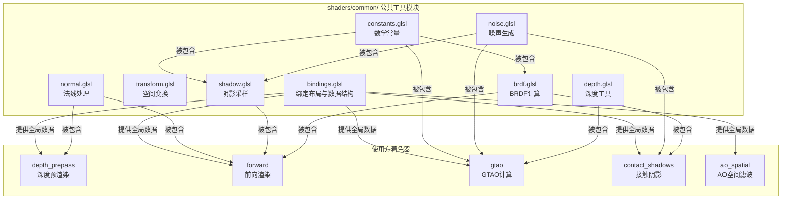

本页介绍 Himalaya 渲染引擎着色器代码库中的**公共工具函数**（位于 `shaders/common/` 目录）。这些 GLSL 模块为渲染 Pass 提供可复用的数学运算、空间变换、噪声生成、法线处理和阴影采样等基础功能。所有模块均采用头文件保护宏（`#ifndef/#define/#endif`）实现零重复包含，并遵循函数式编程范式——纯输入输出、无副作用、不依赖隐式状态。

## 常量定义

`constants.glsl` 定义了着色器代码中高频使用的数学常量，确保跨模块数值一致性并避免魔法数字。

| 常量名 | 值 | 用途 |
|--------|-----|------|
| `PI` | 3.14159265358979323846 | 角度转换、球面面积计算 |
| `TWO_PI` | 6.28318530717958647692 | 完整圆周、方位角采样 |
| `HALF_PI` | 1.57079632679489661923 | 90度角快捷引用 |
| `INV_PI` | 0.31830988618379067154 | Lambertian 漫反射归一化 |
| `EPSILON` | 0.0001 | 除零保护、浮点比较阈值 |

这些常量尤其适用于 BRDF 计算和采样分布。例如 Lambertian 漫反射 BRDF 直接使用 `INV_PI` 作为归一化因子，确保半球积分等于 1。

Sources: [constants.glsl](https://github.com/1PercentSync/himalaya/blob/main/shaders/common/constants.glsl#L7-L12)

## 绑定布局与 GPU 数据结构

`bindings.glsl` 是着色器系统的核心基础设施文件，定义了与 C++ 端严格对齐的 GPU 数据结构和描述符集布局。该文件必须在任何需要访问场景数据的着色器中最先包含。

### 描述符集架构

系统采用三层描述符集设计：

**Set 0: 全局每帧数据** —— 包含视图投影矩阵、相机参数、光源数组、材质数组、实例数据以及光线追踪所需的加速结构和几何信息。这些资源在帧开始时统一更新，所有着色器共享同一份数据。

**Set 1: Bindless 纹理数组** —— 通过 `sampler2D textures[]` 和 `samplerCube cubemaps[]` 提供无绑定纹理访问，材质系统通过索引间接引用纹理，消除传统描述符布局的绑定数量限制。

**Set 2: 渲染中间产物** —— 存放各 Pass 产生的中间纹理（HDR 颜色、解析后的深度/法线、AO 纹理、接触阴影遮罩、级联阴影图等），由 `PARTIALLY_BOUND` 布局支持按需绑定。

### GPU 数据结构

着色器端定义了与 C++ 端 `std430` 布局严格匹配的结构体：

- `GPUDirectionalLight`（32 字节）：方向光源，包含方向与强度打包、颜色与阴影开关打包的 `vec4` 字段。

- `GPUInstanceData`（128 字节）：每实例数据，包含模型矩阵、预计算的法线矩阵（`transpose(inverse(mat3(model)))`）、材质索引及填充字节以满足对齐要求。

- `GPUMaterialData`（80 字节）：PBR 材质参数，包括基础色/自发光因子、金属度/粗糙度/法线缩放/遮挡强度系数，以及各纹理的 bindless 索引。支持 Opaque/Mask/Blend 三种 Alpha 模式。

- `GeometryInfo`（24 字节，RT 专用）：光线追踪几何信息，包含顶点/索引缓冲区设备地址和材质缓冲区偏移。

### 功能标志与调试模式

文件定义了用于 `GlobalUBO.feature_flags` 的位掩码常量（`FEATURE_SHADOWS`、`FEATURE_AO`、`FEATURE_CONTACT_SHADOWS`），以及 11 种调试着色模式（从 `DEBUG_MODE_FULL_PBR` 到 `DEBUG_MODE_CONTACT_SHADOWS`），便于渲染管线可视化调试。

Sources: [bindings.glsl](https://github.com/1PercentSync/himalaya/blob/main/shaders/common/bindings.glsl#L1-L190)

## 空间变换工具

`transform.glsl` 提供基础的空间变换函数。

### Y轴旋转变换

```glsl
vec3 rotate_y(vec3 d, float s, float c)
```

将方向向量绕世界 Y 轴旋转指定角度。输入为角度的正弦/余弦值而非角度本身，允许调用者预计算三角函数并复用结果。该函数被 IBL 系统用于根据 `ibl_yaw` 旋转环境贴图采样方向。

Sources: [transform.glsl](https://github.com/1PercentSync/himalaya/blob/main/shaders/common/transform.glsl#L11-L17)

## 法线处理工具

`normal.glsl` 专注于法线贴图解码和高效存储格式编解码，被深度预渲染 Pass 和前向渲染 Pass 共享。

### 法线贴图解码

```glsl
vec3 get_shading_normal(vec3 N, vec4 tangent, vec2 normal_rg, float normal_scale)
```

从 BC5 双通道法线贴图（R 和 G 通道存储 XY，Z 通道运行时重建）重建世界空间着色法线。实现首先将 `[0,1]` 编码的 XY 解码到 `[-1,1]` 并应用缩放因子，然后通过 `sqrt(1.0 - dot(xy, xy))` 重建 Z 分量。函数内置退化切线保护：当切线向量长度小于 0.001 时直接返回几何法线，避免零长度切线导致的 TBN 矩阵奇异。

TBN 矩阵构造遵循右手系约定：`B = cross(N, T) * tangent.w`，其中 `tangent.w` 存储手性符号（+1 或 -1）。

### R10G10B10A2 法线编码

```glsl
vec4 encode_normal_r10g10b10a2(vec3 n)
vec3 decode_normal_r10g10b10a2(vec4 encoded)
```

实现法线向量的 R10G10B10A2 UNORM 格式编解码。编码将 `[-1,1]` 线性映射到 `[0,1]`（`n * 0.5 + 0.5`），这种线性映射兼容 MSAA AVERAGE 解析模式——在解析阶段对编码值取平均，解码后再归一化即可得到正确的平均法线。解码函数执行逆映射后调用 `normalize()` 恢复单位长度，补偿 MSAA 解析引入的长度损失。

A 通道固定填充 1.0，为未来的材质标志位预留空间。

Sources: [normal.glsl](https://github.com/1PercentSync/himalaya/blob/main/shaders/common/normal.glsl#L1-L77)

## 深度处理工具

`depth.glsl` 提供深度缓冲区的线性化转换。

### Reverse-Z 深度线性化

```glsl
float linearize_depth(float d)
```

将原始 Reverse-Z 深度值（近处=1.0，远处=0.0）转换为正的视图空间线性距离。推导基于透视投影矩阵 `P` 的结构：

```
depth = (P[2][2] * vz + P[3][2]) / (-vz)
=> linear_distance = -vz = P[3][2] / (depth + P[2][2])
```

该转换被 GTAO 等需要视图空间距离的后期处理效果广泛使用。函数依赖 `GlobalUBO` 中的投影矩阵字段，必须与 `bindings.glsl` 配合使用。

Sources: [depth.glsl](https://github.com/1PercentSync/himalaya/blob/main/shaders/common/depth.glsl#L11-L24)

## 噪声生成工具

`noise.glsl` 提供高质量的逐像素噪声生成，支持空间和时间维度变化。

### 交错梯度噪声

```glsl
float interleaved_gradient_noise(vec2 screen_pos)
float interleaved_gradient_noise(vec2 screen_pos, uint frame)
```

实现 Jorge Jimenez 在《使命召唤：高级战争》中提出的**交错梯度噪声（IGN）**。基础版本基于像素坐标生成 `[0,1)` 范围内的确定性伪随机值：

```glsl
fract(52.9829189 * fract(dot(screen_pos, vec2(0.06711056, 0.00583715))))
```

时域变体通过在每帧对 `screen_pos` 施加 `float(frame) * 5.588238` 的偏移，使 TAA 能够在多帧间累积不同噪声模式的采样，有效倍增样本数量。黄金比例小数（`0.6180339887`）的帧索引倍增确保时域采样模式的良好分布。

该噪声被用于 Poisson 圆盘旋转、搜索方向随机化和时域抖动等场景。

Sources: [noise.glsl](https://github.com/1PercentSync/himalaya/blob/main/shaders/common/noise.glsl#L11-L37)

## 阴影采样工具

`shadow.glsl` 是阴影系统的核心算法实现，提供级联阴影映射（CSM）的完整采样管线，包括级联选择、PCF 滤波、PCSS 接触硬化以及距离淡出。

### 数据结构：ShadowProjData

```glsl
struct ShadowProjData {
    vec2 shadow_uv;    // 阴影图 UV [0,1]
    float ref_depth;   // 光源空间 NDC 深度（Reverse-Z）
    float dz_du;       // 深度对 U 的偏导
    float dz_dv;       // 深度对 V 的偏导
};
```

该结构封装了阴影投影的预计算数据。`dz_du` 和 `dz_dv` 通过求解 2x2 线性方程组从屏幕空间导数计算得到，实现了**接收平面深度偏移（Receiver Plane Depth Bias）**，显著减少阴影走样。

### 级联选择

```glsl
int select_cascade(float view_depth, out float blend_factor)
```

基于视图空间深度选择级联索引。函数遍历 `cascade_splits` 定义的远平面边界，返回第一个覆盖该深度的级联。当片段位于级联远边界的混合区域内时，`blend_factor` 输出非零值（`0..1`），指示与下一级联的插值权重。

### PCF 采样

```glsl
float sample_shadow_pcf(vec3 world_pos, vec3 world_normal, int cascade)
```

执行基于硬件的百分比渐近滤波。首先沿世界法线施加法线偏移（`shadow_normal_offset * texel_ws`）减少表面粉刺，然后将位置投影到光源裁剪空间。当 `shadow_pcf_radius > 0` 时，执行 `(2R+1) x (2R+1)` 网格采样，每个 `texture()` 调用利用 `sampler2DArrayShadow` 的硬件 2x2 双线性比较，实现高效的大范围滤波。

### PCSS 接触硬化阴影

```glsl
float sample_shadow_pcss(ShadowProjData proj, int cascade)
```

实现 Percentage-Closer Soft Shadows 算法，产生接触硬化效果（接触处硬阴影、远离处软阴影）。算法分为三阶段：

1. **遮挡物搜索**：在椭圆搜索区域内采样原始深度，统计遮挡物数量和平均深度。搜索半径取光源尺寸和最大半影宽度的较大值，确保覆盖最大可能的半影范围。

2. **半影估计**：基于接收者与遮挡物的深度差计算半影宽度，使用 `cascade_pcss_scale` 将 NDC 深度差转换为 UV 空间半影尺寸，并钳制到 `[texel_size, kMaxPenumbraTexels * texel_size]` 防止核爆炸。

3. **可变宽度 PCF**：使用旋转后的 Poisson 圆盘样本执行滤波，每个样本应用接收平面深度偏移。

函数支持两种早期退出优化：无遮挡物时返回 1.0（完全光照）；全部样本都是遮挡物且启用 `PCSS_FLAG_BLOCKER_EARLY_OUT` 时返回 0.0（缓解多层遮挡漏光）。

### 完整阴影评估

```glsl
float blend_cascade_shadow(vec3 world_pos, vec3 world_normal, float view_depth)
```

阴影系统的统一入口点。执行级联选择后，根据 `shadow_mode` 调用 PCF 或 PCSS 路径。对于 PCSS 模式，**在统一控制流中预计算当前和下一级联的 `ShadowProjData`**，确保 `dFdx/dFdy` 导数计算正确。级联边界处执行线性混合，最后应用基于 `shadow_distance_fade_width` 的远距离淡出。

Sources: [shadow.glsl](https://github.com/1PercentSync/himalaya/blob/main/shaders/common/shadow.glsl#L1-L496)

## BRDF 计算工具

`brdf.glsl` 提供基于物理的渲染 BRDF 组件，采用 Cook-Torrance 微表面模型。

### 法线分布函数

```glsl
float D_GGX(float NdotH, float roughness)
```

GGX / Trowbridge-Reitz 法线分布函数。输入为已钳制的 `dot(N, H)` 和线性粗糙度（`[0,1]`）。实现首先将线性粗糙度平方得到 `α = roughness²`，再平方得到 `α²` 用于分布计算。

### 可见性函数

```glsl
float V_SmithGGX(float NdotV, float NdotL, float roughness)
```

Smith 高度相关可见性函数（Heitz 2014）。该实现将几何遮蔽-阴影项 `G` 与 Cook-Torrance 分母 `4 * NdotV * NdotL` 合并为单一可见性项 `V = G / (4 * NdotV * NdotL)`，使镜面 BRDF 简化为 `D * V * F`，无需额外除法。

### Fresnel 近似

```glsl
vec3 F_Schlick(float VdotH, vec3 F0)
```

Schlick 的 Fresnel 近似，支持 RGB 输入的 `F0`（适用于彩色金属）。经典的 `pow(1.0 - VdotH, 5.0)` 五次幂计算菲涅尔曲线。

### 使用模式

调用者负责提供已钳制的点积和材质参数。典型的镜面 BRDF 计算：

```glsl
vec3 F = F_Schlick(VdotH, F0);
float D = D_GGX(NdotH, roughness);
float V = V_SmithGGX(NdotV, NdotL, roughness);
vec3 specular = D * V * F;
vec3 diffuse = diffuse_color * INV_PI;  // Lambertian
```

所有函数均无副作用，仅依赖输入参数，便于单元测试和优化编译。

Sources: [brdf.glsl](https://github.com/1PercentSync/himalaya/blob/main/shaders/common/brdf.glsl#L1-L75)

## 模块依赖关系



公共工具模块遵循严格的层次设计：**constants.glsl** 和 **bindings.glsl** 位于最底层，分别提供数学常量和数据结构定义。其余模块按需依赖这两个基础模块，例如 `depth.glsl` 依赖 `bindings.glsl` 的 `GlobalUBO`，`brdf.glsl` 依赖 `constants.glsl` 的 `PI` 和 `EPSILON`。

## 与相关页面的关联

- 了解 BRDF 的物理原理和完整光照计算，参阅 [BRDF与光照计算](https://github.com/1PercentSync/himalaya/blob/main/35-brdfyu-guang-zhao-ji-suan)
- 查看这些工具在阴影系统中的具体应用，参阅 [级联阴影映射Pass](https://github.com/1PercentSync/himalaya/blob/main/20-ji-lian-yin-ying-ying-she-pass) 和 [接触阴影Pass](https://github.com/1PercentSync/himalaya/blob/main/21-jie-hong-yin-ying-pass)
- 学习法线编码在 GBuffer 中的使用，参阅 [深度预渲染Pass](https://github.com/1PercentSync/himalaya/blob/main/17-shen-du-yu-xuan-ran-pass)
- 探索噪声在环境光遮蔽中的应用，参阅 [GTAO算法实现](https://github.com/1PercentSync/himalaya/blob/main/22-gtaosuan-fa-shi-xian)