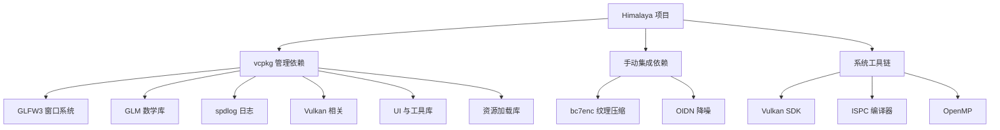
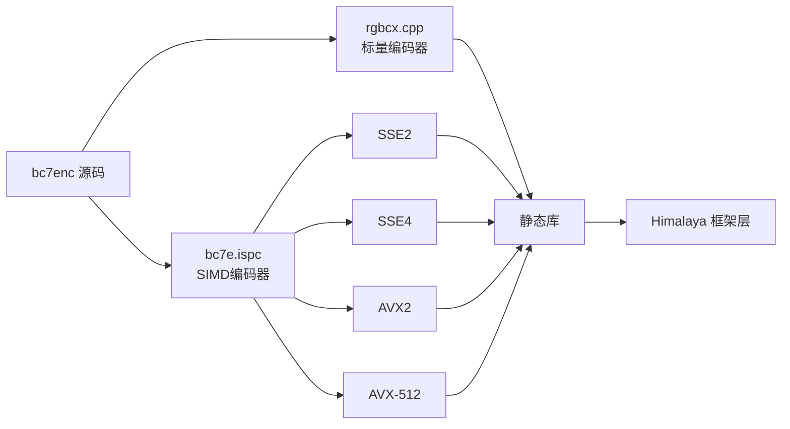

本文档详细说明 Himalaya 渲染引擎项目所依赖的所有第三方库，包括它们的用途、版本要求以及集成方式。了解这些依赖有助于初学者快速理解项目的技术栈，并在遇到构建问题时进行有效的排查。

## 依赖管理概述

Himalaya 项目采用混合依赖管理策略：**vcpkg 管理大部分开源库**，**CMake 手动集成专业库**。这种设计在保证依赖自动化的同时，为需要特殊编译配置或提供预编译版本的库保留了灵活性。

Sources: [vcpkg.json](https://github.com/1PercentSync/himalaya/blob/main/vcpkg.json#L1-L40), [CMakeLists.txt](https://github.com/1PercentSync/himalaya/blob/main/CMakeLists.txt#L1-L11)

## vcpkg 管理的依赖库

vcpkg 是一个跨平台的 C++ 包管理器，项目通过 `vcpkg.json` 清单文件声明依赖。这些库会在构建时自动下载、编译并链接。

### 核心基础设施

| 库名称 | 版本要求 | 用途说明 | 被哪些模块使用 |
|--------|----------|----------|----------------|
| **glfw3** | >= 3.4#1 | 跨平台窗口管理，处理窗口创建、输入事件、上下文管理 | [RHI层](https://github.com/1PercentSync/himalaya/blob/main/8-rhiceng-vulkanchou-xiang-ceng) |
| **glm** | >= 1.0.3 | OpenGL 数学库，提供向量、矩阵、四元数运算 | 所有模块 |
| **spdlog** | >= 1.17.0 | 高性能日志库，支持异步日志和多线程 | 所有模块 |
| **vulkan-memory-allocator** | >= 3.3.0 | GPU 内存分配管理，简化 Vulkan 内存操作 | [RHI层](https://github.com/1PercentSync/himalaya/blob/main/8-rhiceng-vulkanchou-xiang-ceng) |
| **shaderc** | >= 2025.2 | 运行时 GLSL 到 SPIR-V 编译，用于着色器热重载 | [RHI层](https://github.com/1PercentSync/himalaya/blob/main/8-rhiceng-vulkanchou-xiang-ceng) |

Sources: [vcpkg.json](https://github.com/1PercentSync/himalaya/blob/main/vcpkg.json#L6-L18), [rhi/CMakeLists.txt](https://github.com/1PercentSync/himalaya/blob/main/rhi/CMakeLists.txt#L12-L24)

### 用户界面与工具

| 库名称 | 版本要求 | 特性配置 | 用途说明 |
|--------|----------|----------|----------|
| **imgui** | >= 1.91.9 | vulkan-binding, glfw-binding, docking-experimental | Dear ImGui 即时模式 GUI，用于调试面板和参数调节。`docking-experimental` 特性支持窗口停靠功能 |

Sources: [vcpkg.json](https://github.com/1PercentSync/himalaya/blob/main/vcpkg.json#L19-L23), [framework/CMakeLists.txt](https://github.com/1PercentSync/himalaya/blob/main/framework/CMakeLists.txt#L17-L18)

### 资源加载与处理

| 库名称 | 版本要求 | 用途说明 | 相关文档 |
|--------|----------|----------|----------|
| **fastgltf** | >= 0.9.0 | 高性能 glTF 2.0 模型加载，支持二进制和 JSON 格式 | [应用层 - 场景与交互](https://github.com/1PercentSync/himalaya/blob/main/11-ying-yong-ceng-chang-jing-yu-jiao-hu) |
| **nlohmann-json** | >= 3.12.0#2 | JSON 解析库，用于配置文件和场景描述 | [应用层 - 场景与交互](https://github.com/1PercentSync/himalaya/blob/main/11-ying-yong-ceng-chang-jing-yu-jiao-hu) |
| **stb** | >= 2024-07-29#1 | 单头文件图像处理库，用于纹理加载 | [渲染框架层](https://github.com/1PercentSync/himalaya/blob/main/9-xuan-ran-kuang-jia-ceng-zi-yuan-yu-tu-guan-li) |
| **mikktspace** | >= 2020-10-06#3 | 切线空间计算库，生成正确的法线贴图切线基底 | [渲染框架层](https://github.com/1PercentSync/himalaya/blob/main/9-xuan-ran-kuang-jia-ceng-zi-yuan-yu-tu-guan-li) |
| **xxhash** | >= 0.8.3 | 极高速哈希算法，用于资源缓存键值计算 | [Render Graph资源管理](https://github.com/1PercentSync/himalaya/blob/main/12-render-graphzi-yuan-guan-li) |

Sources: [vcpkg.json](https://github.com/1PercentSync/himalaya/blob/main/vcpkg.json#L24-L38), [framework/CMakeLists.txt](https://github.com/1PercentSync/himalaya/blob/main/framework/CMakeLists.txt#L19-L20), [app/CMakeLists.txt](https://github.com/1PercentSync/himalaya/blob/main/app/CMakeLists.txt#L12-L14)

## 手动集成的依赖库

以下库由于特殊原因（需要 ISPC 编译、提供预编译二进制等），通过 CMake 手动集成而非 vcpkg 管理。

### bc7enc - BC7 纹理压缩

**bc7enc** 是 Richard Geldreich 开发的高性能 BC1-BC7 纹理压缩库，支持 RDO（率失真优化）后处理。该库使用 **ISPC（Intel Implicit SPMD Program Compiler）** 编译，生成多指令集优化的机器码。

**技术细节**：
- **编译目标**：SSE2-i32x4、SSE4-i32x4、AVX2-i32x8、AVX512skx-i32x16，运行时自动选择最优指令集
- **优化选项**：启用快速数学运算，禁用断言以提高性能
- **用途**：在 [IBL 压缩流程](https://github.com/1PercentSync/himalaya/blob/main/9-xuan-ran-kuang-jia-ceng-zi-yuan-yu-tu-guan-li) 中实时压缩 HDR 环境贴图

Sources: [third_party/bc7enc/CMakeLists.txt](https://github.com/1PercentSync/himalaya/blob/main/third_party/bc7enc/CMakeLists.txt#L1-L27)

### OpenImageDenoise (OIDN) - 图像降噪

**OIDN** 是 Intel 开发的高性能光线追踪降噪库，基于深度学习算法。由于 OIDN 提供预编译二进制分发且依赖复杂的设备后端，项目采用手动集成方式。

**文件组织**：

| 目录 | 内容说明 |
|------|----------|
| `bin/` | 运行时 DLL（核心库 + CPU/CUDA/HIP/SYCL 设备后端 + TBB/UR 依赖）|
| `lib/` | 导入库 (.lib) 用于链接 |
| `include/` | C/C++ 头文件 (oidn.h, oidn.hpp, config.h) |
| `doc/` | 许可证和文档 |

**构建后处理**：CMake 配置在编译完成后自动将所有 OIDN DLL 复制到输出目录，确保运行时可加载设备后端。

Sources: [framework/CMakeLists.txt](https://github.com/1PercentSync/himalaya/blob/main/framework/CMakeLists.txt#L25-L35), [app/CMakeLists.txt](https://github.com/1PercentSync/himalaya/blob/main/app/CMakeLists.txt#L25-L31)

## 系统级依赖与工具链

除上述库外，项目还依赖以下系统级组件：

| 组件 | 用途 | 安装建议 |
|------|------|----------|
| **Vulkan SDK** | 图形 API 和验证层 | 从 LunarG 官网下载最新 SDK |
| **ISPC** | 编译 bc7enc 的 ISPC 源文件 | 建议 1.25 或更高版本 |
| **OpenMP** | 多线程并行计算 | 通常随编译器提供（MSVC/GCC/Clang）|

Sources: [rhi/CMakeLists.txt](https://github.com/1PercentSync/himalaya/blob/main/rhi/CMakeLists.txt#L15-L16), [app/CMakeLists.txt](https://github.com/1PercentSync/himalaya/blob/main/app/CMakeLists.txt#L15)

## 依赖版本锁定

项目使用 **vcpkg baseline** 机制锁定依赖版本，确保团队成员使用完全一致的库版本。当前 baseline 为 `62159a45e18f3a9ac0548628dcaf74fcb60c6ff9`，对应 vcpkg 仓库的特定提交。

如需升级依赖版本，修改 `vcpkg.json` 中的 `builtin-baseline` 字段并重新运行 CMake 配置。

Sources: [vcpkg.json](https://github.com/1PercentSync/himalaya/blob/main/vcpkg.json#L4)

## 依赖关系总览

以下是各项目模块与第三方库的依赖关系汇总：

| 模块 | 依赖的第三方库 | 链接方式 |
|------|----------------|----------|
| **himalaya_rhi** | Vulkan、GLFW3、GLM、spdlog、VMA、shaderc | PUBLIC |
| **himalaya_framework** | himalaya_rhi、imgui、mikktspace、stb、xxhash、bc7enc、OIDN | PUBLIC/PRIVATE 混合 |
| **himalaya_passes** | himalaya_framework | 仅内部依赖 |
| **himalaya_app** | himalaya_rhi、himalaya_framework、himalaya_passes、fastgltf、nlohmann-json、OpenMP | PRIVATE |

Sources: [rhi/CMakeLists.txt](https://github.com/1PercentSync/himalaya/blob/main/rhi/CMakeLists.txt#L1-L24), [framework/CMakeLists.txt](https://github.com/1PercentSync/himalaya/blob/main/framework/CMakeLists.txt#L1-L44), [passes/CMakeLists.txt](https://github.com/1PercentSync/himalaya/blob/main/passes/CMakeLists.txt#L1-L19), [app/CMakeLists.txt](https://github.com/1PercentSync/himalaya/blob/main/app/CMakeLists.txt#L1-L39)

## 常见问题排查

**Q: 构建时提示找不到 vcpkg 包？**
- 确保已安装 vcpkg 并设置了 `VCPKG_ROOT` 环境变量
- 删除 `cmake-build-*/` 目录后重新运行 CMake 配置

**Q: ISPC 编译器未找到？**
- 将 ISPC 安装目录添加到系统 PATH
- 或在 CMake 配置时指定 `-DISPC_EXECUTABLE_PATH=/path/to/ispc`

**Q: OIDN DLL 加载失败？**
- 检查 `third_party/oidn/bin/` 目录是否存在且包含 DLL 文件
- 确认构建后复制命令成功执行（查看构建输出日志）

---

**下一步阅读建议**：

- 如果您刚配置好开发环境，请阅读 [编译与构建流程](https://github.com/1PercentSync/himalaya/blob/main/3-bian-yi-yu-gou-jian-liu-cheng) 了解完整的构建步骤
- 如需了解代码规范，请查看 [命名约定与代码风格](https://github.com/1PercentSync/himalaya/blob/main/5-ming-ming-yue-ding-yu-dai-ma-feng-ge)
- 如需深入理解架构设计，请阅读 [四层架构设计](https://github.com/1PercentSync/himalaya/blob/main/7-si-ceng-jia-gou-she-ji)