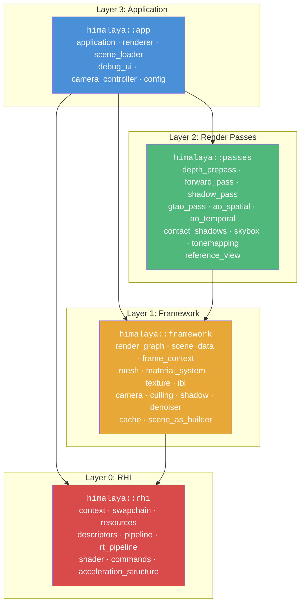
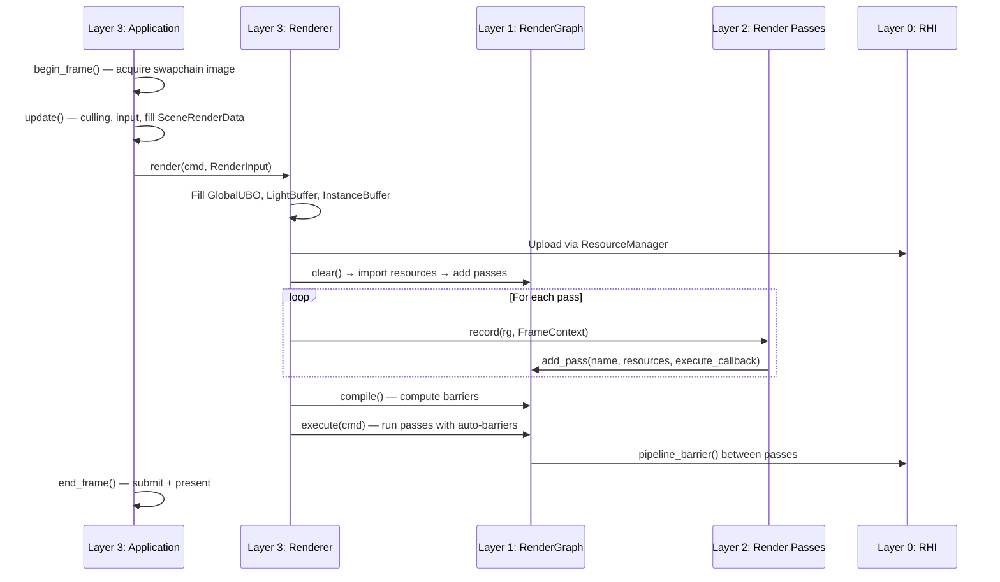
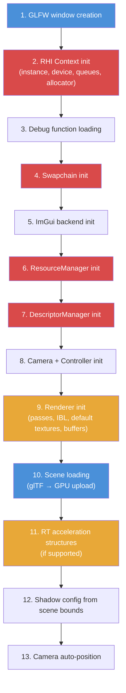

Himalaya is a Vulkan 1.4 real-time renderer organized as a strict four-layer architecture. Each layer is a separate CMake static library target, and the build system enforces a **unidirectional dependency chain**: `rhi ← framework ← passes ← app`. This page explains the directory layout, the role of each layer, the dependency rules that keep the system modular, and the data contracts that connect the layers together. If you understand the structure described here, you will know where to find any file and which layer owns which responsibility.

Sources: [CLAUDE.md](https://github.com/1PercentSync/himalaya/blob/main/CLAUDE.md#L113-L153), [CMakeLists.txt](https://github.com/1PercentSync/himalaya/blob/main/CMakeLists.txt#L1-L11)

## Directory Layout

The top-level source tree maps one-to-one to the architectural layers, with supporting directories for shaders, assets, documentation, and third-party libraries:

```
himalaya/
├── CMakeLists.txt          # Root: adds subdirectories in dependency order
├── vcpkg.json              # vcpkg manifest (11 dependencies)
├── CLAUDE.md               # Agent-facing project conventions
│
├── rhi/                    # Layer 0 — himalaya_rhi (static lib)
│   ├── CMakeLists.txt
│   ├── include/himalaya/rhi/
│   │   ├── types.h             # Handles, enums, format conversion
│   │   ├── context.h           # Vulkan device, queues, deletion queue
│   │   ├── swapchain.h         # Presentation surface and images
│   │   ├── resources.h         # Buffer/Image/Sampler pool
│   │   ├── descriptors.h       # Three-set bindless descriptor system
│   │   ├── pipeline.h          # Graphics and compute pipeline creation
│   │   ├── rt_pipeline.h       # Ray tracing pipeline creation
│   │   ├── shader.h            # Runtime GLSL→SPIR-V compiler
│   │   ├── commands.h          # Command buffer wrapper
│   │   └── acceleration_structure.h  # BLAS/TLAS building
│   └── src/                    # Implementation files
│
├── framework/              # Layer 1 — himalaya_framework (static lib)
│   ├── CMakeLists.txt
│   ├── include/himalaya/framework/
│   │   ├── scene_data.h        # CPU/GPU data structures, config structs
│   │   ├── frame_context.h     # Per-frame context passed to all passes
│   │   ├── render_graph.h      # Barrier insertion, pass orchestration
│   │   ├── mesh.h              # Unified vertex format, Mesh struct
│   │   ├── material_system.h   # Material SSBO management
│   │   ├── texture.h           # Texture upload and compression
│   │   ├── ibl.h               # Image-Based Lighting pipeline
│   │   ├── camera.h            # Camera matrices and parameters
│   │   ├── culling.h           # Frustum culling
│   │   ├── shadow.h            # CSM cascade computation
│   │   ├── cache.h             # Content-addressed resource cache
│   │   ├── denoiser.h          # OIDN denoiser integration
│   │   ├── scene_as_builder.h  # RT acceleration structure builder
│   │   ├── imgui_backend.h     # ImGui Vulkan backend
│   │   ├── render_constants.h  # Shared constants
│   │   ├── ktx2.h              # KTX2 texture handling
│   │   └── color_utils.h       # Color space utilities
│   └── src/
│
├── passes/                 # Layer 2 — himalaya_passes (static lib)
│   ├── CMakeLists.txt
│   ├── include/himalaya/passes/
│   │   ├── depth_prepass.h      # Z-fill + normal prepass
│   │   ├── forward_pass.h       # Main PBR lighting
│   │   ├── shadow_pass.h        # CSM shadow rendering
│   │   ├── gtao_pass.h          # Ground-Truth AO compute
│   │   ├── ao_spatial_pass.h    # Bilateral AO blur
│   │   ├── ao_temporal_pass.h   # Temporal AO accumulation
│   │   ├── contact_shadows_pass.h  # Screen-space ray marching
│   │   ├── skybox_pass.h        # Skybox rendering
│   │   ├── tonemapping_pass.h   # HDR→LDR tonemapping
│   │   └── reference_view_pass.h  # Path tracing reference
│   └── src/
│
├── app/                    # Layer 3 — himalaya_app (executable)
│   ├── CMakeLists.txt
│   ├── include/himalaya/app/
│   │   ├── application.h        # Window, subsystems, frame loop
│   │   ├── renderer.h           # Pass orchestration, GPU data fill
│   │   ├── scene_loader.h       # glTF loading, texture processing
│   │   ├── debug_ui.h           # ImGui runtime panels
│   │   ├── camera_controller.h  # Free-flight camera input
│   │   ├── config.h             # JSON config persistence
│   │   ├── blue_noise_data.h    # Embedded blue noise samples
│   │   └── sobol_direction_data.h  # Embedded Sobol sequences
│   └── src/
│
├── shaders/                # GLSL source (copied to build dir post-build)
│   ├── common/                 # Shared headers: bindings, BRDF, noise
│   ├── ibl/                    # IBL compute shaders
│   ├── rt/                     # Ray tracing shaders
│   └── compress/               # BC6H compression compute
│
├── assets/                 # glTF scenes and HDR environment maps
├── docs/                   # Design documents and task tracking
├── tasks/                  # Per-phase task checklists
├── third_party/            # bc7enc (ISPC), OIDN (prebuilt)
└── scripts/                # Python generators (Poisson disk, Sobol)
```

Sources: [CMakeLists.txt](https://github.com/1PercentSync/himalaya/blob/main/CMakeLists.txt#L1-L11), [CLAUDE.md](https://github.com/1PercentSync/himalaya/blob/main/CLAUDE.md#L124-L150)

## The Four-Layer Architecture

The rendering engine is decomposed into four layers with **strict downward-only dependencies**. The root `CMakeLists.txt` adds subdirectories in dependency order — `rhi` first, then `framework`, then `passes`, then `app` — ensuring each layer can reference only the layers below it.

The following diagram shows the dependency direction and the namespace assigned to each layer. An arrow from A → B means "A depends on B" (A calls B's APIs):



The CMake link relationships make this dependency chain concrete. The `app` target links against all three libraries; the `passes` target links against `framework`; the `framework` target links against `rhi`. The key rule is **no reverse dependency**: `rhi/` never includes `framework/` headers, `framework/` never includes `passes/` headers, and passes never include each other's headers.

Sources: [app/CMakeLists.txt](https://github.com/1PercentSync/himalaya/blob/main/app/CMakeLists.txt#L20), [passes/CMakeLists.txt](https://github.com/1PercentSync/himalaya/blob/main/passes/CMakeLists.txt#L18), [framework/CMakeLists.txt](https://github.com/1PercentSync/himalaya/blob/main/framework/CMakeLists.txt#L41-L44), [rhi/CMakeLists.txt](https://github.com/1PercentSync/himalaya/blob/main/rhi/CMakeLists.txt#L18-L24), [CLAUDE.md](https://github.com/1PercentSync/himalaya/blob/main/CLAUDE.md#L152)

### Layer 0 — RHI (Rendering Hardware Interface)

**Target**: `himalaya_rhi` (static library)
**Namespace**: `himalaya::rhi`
**Purpose**: Wraps all raw Vulkan API calls behind a clean C++ interface so that upper layers never see a `VkCommandBuffer` or `VkImage` directly.

The RHI layer owns the GPU's most fundamental resources — the Vulkan instance, physical and logical devices, memory allocator, command pools, and synchronization primitives. It provides:

- **Generation-based resource handles** (`ImageHandle`, `BufferHandle`, `SamplerHandle`) with slot indices and generation counters that detect use-after-free without runtime overhead.
- **A resource pool** (`ResourceManager`) that creates, stores, and looks up GPU buffers, images, and samplers by handle.
- **A three-set bindless descriptor architecture** (`DescriptorManager`): Set 0 for per-frame global data, Set 1 for bindless texture/cubemap arrays, Set 2 for render-target intermediates.
- **Runtime GLSL-to-SPIR-V compilation** (`ShaderCompiler`) with include-aware caching and hot-reload support.
- **Pipeline creation** for graphics, compute, and ray tracing workloads.
- **A command buffer wrapper** (`CommandBuffer`) that exposes only the recording operations the engine uses, plus RT dispatch and push-descriptor helpers.

The RHI depends on Vulkan, GLFW (window surface), VMA (memory allocation), shaderc (compilation), GLM (math), and spdlog (logging). It does **not** depend on any higher layer.

Sources: [rhi/include/himalaya/rhi/types.h](https://github.com/1PercentSync/himalaya/blob/main/rhi/include/himalaya/rhi/types.h#L13-L73), [rhi/include/himalaya/rhi/context.h](https://github.com/1PercentSync/himalaya/blob/main/rhi/include/himalaya/rhi/context.h#L39-L103), [rhi/include/himalaya/rhi/descriptors.h](https://github.com/1PercentSync/himalaya/blob/main/rhi/include/himalaya/rhi/descriptors.h#L30-L44), [rhi/include/himalaya/rhi/shader.h](https://github.com/1PercentSync/himalaya/blob/main/rhi/include/himalaya/rhi/shader.h#L25-L93), [rhi/include/himalaya/rhi/commands.h](https://github.com/1PercentSync/himalaya/blob/main/rhi/include/himalaya/rhi/commands.h#L27-L30), [rhi/CMakeLists.txt](https://github.com/1PercentSync/himalaya/blob/main/rhi/CMakeLists.txt#L1-L24)

### Layer 1 — Framework

**Target**: `himalaya_framework` (static library)
**Namespace**: `himalaya::framework`
**Purpose**: Implements rendering infrastructure — the render graph, data contracts between CPU and GPU, and scene management utilities.

The framework layer builds on the RHI to provide the abstractions that render passes need. Its key components are:

- **Render Graph** (`RenderGraph`): A per-frame pass orchestrator that accepts resource usage declarations from each pass and automatically computes image layout transitions and pipeline barriers. The graph is rebuilt every frame via a `clear() → import → add_pass → compile → execute` cycle.
- **Scene Data Contract** (`SceneRenderData`, `FrameContext`): Pure-data structures that define the interface between the application and the renderer. `SceneRenderData` holds non-owning spans of mesh instances, lights, and camera state. `FrameContext` carries per-frame render graph resource IDs plus references to culling results and configuration.
- **GPU Data Structures** (`GlobalUniformData`, `GPUInstanceData`, `GPUMaterialData`): C++ structs that must match shader layouts byte-for-byte. Compile-time `static_assert` guards catch layout mismatches between C++ and GLSL.
- **Mesh Management** (`Mesh`, `Vertex`): A unified vertex format (position, normal, UV0, tangent, UV1) used by all meshes regardless of source data.
- **Material System** (`MaterialSystem`): Manages a single GPU SSBO holding all material data, with bindless texture indices for PBR parameters.
- **IBL Pipeline** (`IBL`): Converts HDR equirectangular environment maps into irradiance, prefiltered, and BRDF LUT cubemaps at runtime.
- **Frustum Culling** (`cull_against_frustum`): CPU-side AABB testing that produces visible opaque and transparent index lists.
- **Shadow Cascade Computation** (`compute_cascades`): PSSM split strategies with texel snapping for CSM.
- **Denoiser** (`Denoiser`): OIDN integration for path-traced reference denoising.
- **RT AS Builder** (`SceneASBuilder`): Builds BLAS/TLAS acceleration structures for ray tracing.

The framework links publicly against `himalaya_rhi` and ImGui, and privately against mikktspace, xxHash, bc7enc, and OIDN.

Sources: [framework/include/himalaya/framework/render_graph.h](https://github.com/1PercentSync/himalaya/blob/main/framework/include/himalaya/framework/render_graph.h#L170-L180), [framework/include/himalaya/framework/frame_context.h](https://github.com/1PercentSync/himalaya/blob/main/framework/include/himalaya/framework/frame_context.h#L22-L149), [framework/include/himalaya/framework/scene_data.h](https://github.com/1PercentSync/himalaya/blob/main/framework/include/himalaya/framework/scene_data.h#L86-L131), [framework/include/himalaya/framework/material_system.h](https://github.com/1PercentSync/himalaya/blob/main/framework/include/himalaya/framework/material_system.h#L113-L158), [framework/include/himalaya/framework/mesh.h](https://github.com/1PercentSync/himalaya/blob/main/framework/include/himalaya/framework/mesh.h#L16-L91), [framework/CMakeLists.txt](https://github.com/1PercentSync/himalaya/blob/main/framework/CMakeLists.txt#L41-L44)

### Layer 2 — Render Passes

**Target**: `himalaya_passes` (static library)
**Namespace**: `himalaya::passes`
**Purpose**: Individual render passes, each implemented as a self-contained class with a consistent lifecycle.

Every pass follows the same interface pattern — **setup → record → rebuild_pipelines → destroy** — and owns its own Vulkan pipelines and descriptor layouts. Passes communicate with the rest of the system exclusively through the `FrameContext` struct and the `RenderGraph`, never by reaching into other passes or the application directly.

| Pass | Pipeline Type | Purpose |
|------|--------------|---------|
| `DepthPrePass` | Graphics (opaque + mask) | Fills depth + normal buffers for zero-overdraw forward |
| `ForwardPass` | Graphics | Cook-Torrance PBR lighting, IBL split-sum, multi-bounce AO |
| `ShadowPass` | Graphics (per-cascade) | CSM rendering with PCF/PCSS filtering |
| `GTAOPass` | Compute | Horizon-based ambient occlusion with analytic integration |
| `AOSpatialPass` | Compute | 5×5 bilateral blur for AO denoising |
| `AOTemporalPass` | Compute | Temporal accumulation for AO |
| `ContactShadowsPass` | Compute | Per-pixel screen-space ray marching |
| `SkyboxPass` | Graphics | Cubemap skybox rendering |
| `TonemappingPass` | Graphics (fullscreen) | HDR → LDR tonemapping + presentation |
| `ReferenceViewPass` | Ray Tracing | Path-traced reference with accumulation |

The passes library links only against `himalaya_framework` (which transitively provides `himalaya_rhi`). This is the narrowest dependency of any non-trivial layer.

Sources: [passes/include/himalaya/passes/forward_pass.h](https://github.com/1PercentSync/himalaya/blob/main/passes/include/himalaya/passes/forward_pass.h#L35-L77), [passes/include/himalaya/passes/depth_prepass.h](https://github.com/1PercentSync/himalaya/blob/main/passes/include/himalaya/passes/depth_prepass.h#L39-L85), [passes/include/himalaya/passes/gtao_pass.h](https://github.com/1PercentSync/himalaya/blob/main/passes/include/himalaya/passes/gtao_pass.h#L38-L71), [passes/CMakeLists.txt](https://github.com/1PercentSync/himalaya/blob/main/passes/CMakeLists.txt#L1-L19)

### Layer 3 — Application

**Target**: `himalaya_app` (executable)
**Namespace**: `himalaya::app`
**Purpose**: Owns the main loop, window, all subsystem instances, and the glue code that connects them.

The application layer is the top-level orchestrator. Its key classes are:

- **`Application`**: The main entry point. Owns the GLFW window, RHI context, swapchain, resource manager, descriptor manager, camera, scene loader, renderer, and debug UI. The frame loop decomposes into `begin_frame() → update() → render() → end_frame()`, where each phase has a clear responsibility (GPU sync + acquire, input + culling, command recording, presentation).
- **`Renderer`**: Owns all render pass instances, GPU buffers (global UBO, light SSBO, instance SSBO), IBL, denoiser, and acceleration structures. Translates the per-frame `RenderInput` struct (filled by `Application`) into GPU-side data and drives the render graph.
- **`SceneLoader`**: Loads glTF scenes via fastgltf, processes textures (STB decode → BC compression), generates tangents (MikkTSpace), uploads mesh data to the GPU, and manages material binding.
- **`DebugUI`**: ImGui panels for runtime parameter tuning — feature toggles, shadow/AO/contact-shadow configs, render mode selection, scene switching.
- **`CameraController`**: Free-flight camera with WASD + mouse look, controlled via GLFW input.
- **`AppConfig`**: JSON-persisted configuration for scene path, environment path, HDR sun coordinates, and log level.

The entry point is minimal — `main.cpp` creates an `Application`, calls `init()`, `run()`, then `destroy()`.

Sources: [app/include/himalaya/app/application.h](https://github.com/1PercentSync/himalaya/blob/main/app/include/himalaya/app/application.h#L30-L50), [app/include/himalaya/app/renderer.h](https://github.com/1PercentSync/himalaya/blob/main/app/include/himalaya/app/renderer.h#L59-L164), [app/include/himalaya/app/config.h](https://github.com/1PercentSync/himalaya/blob/main/app/include/himalaya/app/config.h#L22-L68), [app/src/main.cpp](https://github.com/1PercentSync/himalaya/blob/main/app/src/main.cpp#L14-L20), [app/CMakeLists.txt](https://github.com/1PercentSync/himalaya/blob/main/app/CMakeLists.txt#L1-L20)

## CMake Build Structure

The build system mirrors the layered architecture. Each layer is a CMake static library (`add_library(... STATIC)`) except the app layer, which is the final executable. The root `CMakeLists.txt` adds subdirectories in dependency order:

| Target | Type | Links Against | Key External Dependencies |
|--------|------|---------------|--------------------------|
| `himalaya_rhi` | Static lib | Vulkan, GLFW, GLM, VMA, shaderc, spdlog | GPU abstraction |
| `himalaya_framework` | Static lib | `himalaya_rhi`, ImGui, mikktspace, xxHash, bc7enc, OIDN | Rendering infrastructure |
| `himalaya_passes` | Static lib | `himalaya_framework` | Render passes |
| `himalaya_app` | Executable | All three + fastgltf, nlohmann_json, OpenMP | Application logic |

Post-build commands copy the `shaders/` directory into the build output folder and stage the OIDN runtime DLLs. External dependencies are managed via vcpkg manifest mode (11 packages in `vcpkg.json`), plus two manually-integrated libraries: bc7enc (ISPC-compiled BC7 compression) and OIDN (prebuilt Open Image Denoise binaries).

Sources: [CMakeLists.txt](https://github.com/1PercentSync/himalaya/blob/main/CMakeLists.txt#L1-L11), [app/CMakeLists.txt](https://github.com/1PercentSync/himalaya/blob/main/app/CMakeLists.txt#L16-L38), [rhi/CMakeLists.txt](https://github.com/1PercentSync/himalaya/blob/main/rhi/CMakeLists.txt#L1-L24), [framework/CMakeLists.txt](https://github.com/1PercentSync/himalaya/blob/main/framework/CMakeLists.txt#L41-L44), [vcpkg.json](https://github.com/1PercentSync/himalaya/blob/main/vcpkg.json#L1-L39)

## Data Flow Across Layers

Understanding how data flows between layers is the key to navigating the codebase. The following diagram shows the primary data contract: the application fills scene data, the renderer translates it to GPU buffers, and the render graph orchestrates pass execution.



The data contract between layers is explicit and typed:

- **`RenderInput`** (app → renderer): Carries swapchain image index, frame index, render mode, camera, lights, culling results, meshes, materials, mesh instances, IBL parameters, exposure, debug mode, and all configuration structs (shadows, AO, contact shadows). All fields are non-owning references.
- **`FrameContext`** (renderer → passes): Carries render graph resource IDs for every intermediate buffer (HDR color, depth, normals, shadow maps, AO textures, contact shadow mask, PT accumulation), plus spans to scene data, draw groups, and configuration. Constructed once per frame, consumed read-only by all passes.
- **`SceneRenderData`** (app → framework/culling): Holds mesh instances, directional lights, and camera state. The application fills it each frame; the frustum culling function consumes it.

Sources: [app/include/himalaya/app/renderer.h](https://github.com/1PercentSync/himalaya/blob/main/app/include/himalaya/app/renderer.h#L59-L116), [framework/include/himalaya/framework/frame_context.h](https://github.com/1PercentSync/himalaya/blob/main/framework/include/himalaya/framework/frame_context.h#L32-L149), [framework/include/himalaya/framework/scene_data.h](https://github.com/1PercentSync/himalaya/blob/main/framework/include/himalaya/framework/scene_data.h#L88-L116)

## GPU-Side Resource Binding

The shader-visible binding architecture spans the RHI and framework layers. Three descriptor sets are bound globally by every pipeline:

| Set | Bindings | Owner | Updated |
|-----|----------|-------|---------|
| **Set 0** — Per-frame global | Binding 0: `GlobalUBO` (uniform, 928 bytes)<br/>Binding 1: `LightBuffer` (SSBO)<br/>Binding 2: `MaterialBuffer` (SSBO)<br/>Binding 3: `InstanceBuffer` (SSBO)<br/>Binding 4: TLAS (RT only)<br/>Binding 5: `GeometryInfoBuffer` (RT only) | `DescriptorManager` | Every frame (bindings 0, 1, 3 per frame-index; binding 2 on scene load) |
| **Set 1** — Bindless textures | Binding 0: `sampler2D[]` (up to 4096)<br/>Binding 1: `samplerCube[]` (up to 256) | `DescriptorManager` | On texture load/unload |
| **Set 2** — Render targets | Bindings 0–6: Named intermediate textures (HDR, depth, normal, AO, shadow map, etc.) | `DescriptorManager` | On init, resize, or MSAA change |
| **Set 3** — Pass-local (push) | Per-pass storage images or output buffers | Individual passes | Per dispatch |

The C++ GPU structs (`GlobalUniformData`, `GPUInstanceData`, `GPUMaterialData`, `GPUDirectionalLight`, `GPUGeometryInfo`) are defined in `scene_data.h` and `material_system.h`. Their GLSL counterparts are defined in `shaders/common/bindings.glsl`. Compile-time `static_assert` size checks in C++ guard against layout drift.

Sources: [rhi/include/himalaya/rhi/descriptors.h](https://github.com/1PercentSync/himalaya/blob/main/rhi/include/himalaya/rhi/descriptors.h#L30-L44), [shaders/common/bindings.glsl](https://github.com/1PercentSync/himalaya/blob/main/shaders/common/bindings.glsl#L86-L188), [framework/include/himalaya/framework/scene_data.h](https://github.com/1PercentSync/himalaya/blob/main/framework/include/himalaya/framework/scene_data.h#L267-L399), [framework/include/himalaya/framework/material_system.h](https://github.com/1PercentSync/himalaya/blob/main/framework/include/himalaya/framework/material_system.h#L39-L59)

## Initialization Sequence

The application follows a strict initialization order that respects layer dependencies. Each step depends on all prior steps being complete:



Destruction follows the reverse order. Each object exposes an explicit `destroy()` method rather than relying on destructors, giving precise control over GPU resource lifetime in the presence of deferred deletion queues.

Sources: [app/src/application.cpp](https://github.com/1PercentSync/himalaya/blob/main/app/src/application.cpp#L39-L134)

## Dependency Rules Summary

The architecture enforces these rules at compile time through header inclusion and CMake link targets:

| Rule | Reason |
|------|--------|
| `rhi/` must not include `framework/`, `passes/`, or `app/` headers | The RHI is a standalone GPU abstraction with no rendering logic |
| `framework/` must not include `passes/` or `app/` headers | Framework provides infrastructure, not rendering algorithms |
| `passes/` must not include other pass headers | Each pass is self-contained; coordination happens via `FrameContext` |
| `passes/` must not include `app/` headers | Passes receive data through `FrameContext`, not application types |
| `app/` may include any layer | The application is the top-level orchestrator |

These rules mean that if you are working in, say, the GTAO pass, your only interfaces are the RHI types, the `FrameContext` struct, and the `RenderGraph` API. You cannot accidentally reach into the shadow pass or the scene loader.

Sources: [CLAUDE.md](https://github.com/1PercentSync/himalaya/blob/main/CLAUDE.md#L152), [passes/CMakeLists.txt](https://github.com/1PercentSync/himalaya/blob/main/passes/CMakeLists.txt#L18)

## Where to Go Next

Now that you understand the four-layer structure, the data contracts between layers, and the dependency rules, you can dive into any layer in depth:

- **Layer 0 deep dives**: Start with [GPU Context Lifecycle — Instance, Device, Queues, and Memory](https://github.com/1PercentSync/himalaya/blob/main/5-gpu-context-lifecycle-instance-device-queues-and-memory) to understand how the Vulkan context is created and managed.
- **Layer 1 deep dives**: Begin with [Render Graph — Automatic Barrier Insertion and Pass Orchestration](https://github.com/1PercentSync/himalaya/blob/main/9-render-graph-automatic-barrier-insertion-and-pass-orchestration) to see how passes are coordinated.
- **Layer 2 deep dives**: Read [Depth Prepass — Z-Fill for Zero-Overdraw Forward Rendering](https://github.com/1PercentSync/himalaya/blob/main/16-depth-prepass-z-fill-for-zero-overdraw-forward-rendering) first, as it sets up buffers that later passes consume.
- **Layer 3 deep dives**: Start with [Renderer Core — Frame Dispatch, GPU Data Fill, and Rasterization vs Path Tracing](https://github.com/1PercentSync/himalaya/blob/main/22-renderer-core-frame-dispatch-gpu-data-fill-and-rasterization-vs-path-tracing) to see how the frame loop drives everything.
- **Shader system**: See [GLSL Shader Architecture — Shared Bindings, BRDF Library, and Feature Flags](https://github.com/1PercentSync/himalaya/blob/main/25-glsl-shader-architecture-shared-bindings-brdf-library-and-feature-flags) for the GPU-side counterpart to the C++ data structures described here.