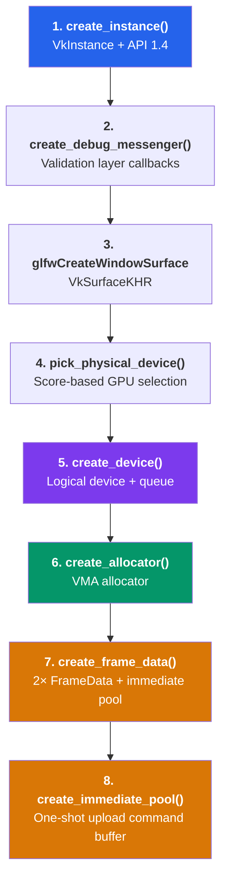
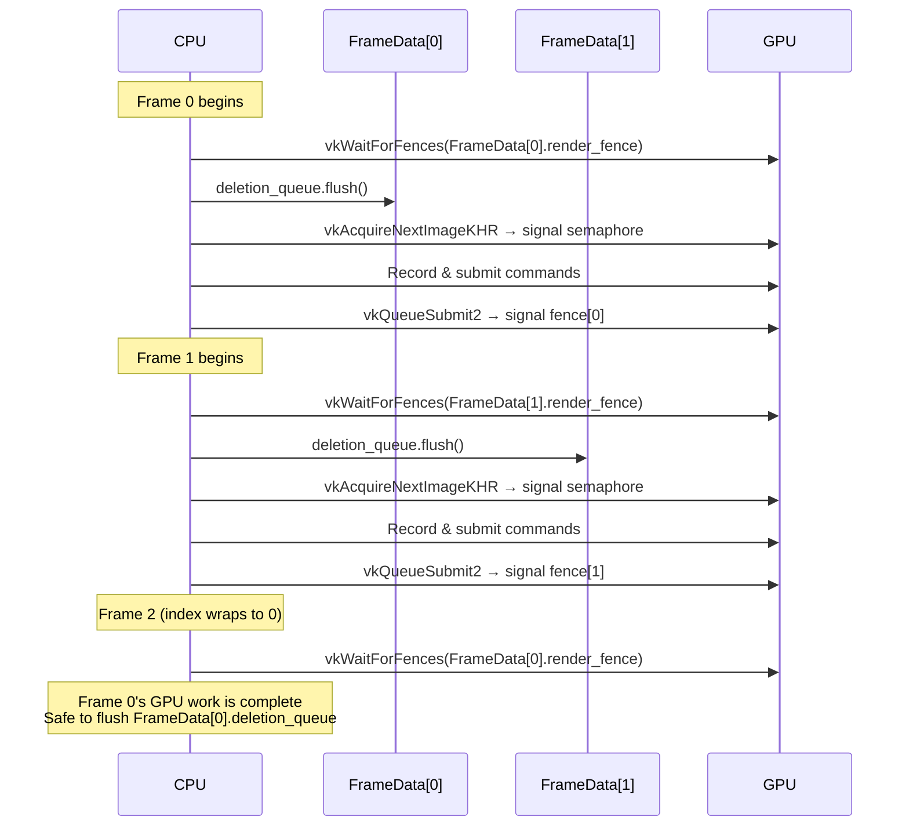
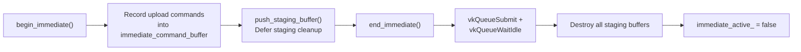

The `Context` class is the root of the entire Vulkan RHI layer — it owns the `VkInstance`, `VkDevice`, `VmaAllocator`, per-frame synchronization primitives, and the immediate command submission path. Every other RHI subsystem (ResourceManager, DescriptorManager, Swapchain, pipelines) receives a pointer or reference to this single context and never creates its own Vulkan objects independently. Understanding the init/destroy ordering, the frame pacing model, and the deferred deletion mechanism is the prerequisite for working with any part of the rendering stack.

Sources: [context.h](https://github.com/1PercentSync/himalaya/blob/main/rhi/include/himalaya/rhi/context.h#L106-L123), [context.cpp](https://github.com/1PercentSync/himalaya/blob/main/rhi/src/context.cpp#L49-L81)

## Initialization Sequence and the Seven-Stage Pipeline

The context follows a strict linear initialization protocol — seven private methods called in exact order from `Context::init(GLFWwindow*)`. Each stage depends on objects created by all preceding stages, so reordering is not possible.

The Application layer orchestrates the broader init sequence. The context is initialized first, followed by the swapchain, ImGui backend, resource manager, descriptor manager, and finally the renderer. Scene loading is deliberately wrapped in an `begin_immediate()`/`end_immediate()` scope to ensure all GPU uploads complete before the frame loop starts.

Sources: [context.cpp](https://github.com/1PercentSync/himalaya/blob/main/rhi/src/context.cpp#L49-L81), [application.cpp](https://github.com/1PercentSync/himalaya/blob/main/app/src/application.cpp#L55-L98)

## Instance Creation — API 1.4 with Conditional Validation

`create_instance()` targets **Vulkan API version 1.4** unconditionally. It collects the GLFW-required surface extensions, appends `VK_EXT_DEBUG_UTILS_EXTENSION_NAME` in debug builds, and enables the `VK_LAYER_KHRONOS_validation` layer. The instance creation is the only place where compile-time branching occurs for validation layers — the `kEnableValidationLayers` constant is set based on `NDEBUG`.

The choice of API 1.4 is significant: it guarantees the availability of dynamic rendering (promoted from 1.3), synchronization2 (promoted from 1.3), push descriptors (promoted from 1.4), and shader demote-to-helper-invocation (promoted from 1.3). These are used throughout the codebase without feature-bit checks.

Sources: [context.cpp](https://github.com/1PercentSync/himalaya/blob/main/rhi/src/context.cpp#L109-L142)

## Physical Device Selection — Multi-Criteria Scoring

`pick_physical_device()` enumerates all physical devices and scores each one through a multi-stage filter chain. A device must pass **all** hard requirements to receive any score at all; if it fails any, it is excluded entirely:

| Stage | Check | Hard Requirement |
|-------|-------|-----------------|
| 1 | Graphics + present queue family | ✅ Yes |
| 2 | Required extensions (swapchain, memory budget) | ✅ Yes |
| 3 | API version ≥ 1.4 | ✅ Yes |
| 4 | Required features (anisotropy, BC compression, descriptor indexing) | ✅ Yes |
| 5 | Required descriptor limits (bindless capacity) | ✅ Yes |
| 6 | RT extensions + features | ❌ Optional (adds score) |
| 7 | Discrete GPU type | ❌ Optional (adds score) |
| 8 | Device-local VRAM size | ❌ Optional (adds per-GB score) |

The scoring formula is `base(1) + RT(10000) + discrete(1000) + VRAM_GB`. This ensures an RT-capable integrated GPU always outranks a non-RT discrete GPU, while among RT-capable devices, discrete GPUs with more VRAM are preferred.

After selection, the method queries and caches GPU properties: the human-readable name (`gpu_name`), maximum sampler anisotropy, MSAA sample count bitmask (intersection of color and depth framebuffer capabilities), and ray tracing properties when supported (shader group handle size, alignment, max recursion depth, scratch offset alignment).

Sources: [context.cpp](https://github.com/1PercentSync/himalaya/blob/main/rhi/src/context.cpp#L196-L425)

## Logical Device — Feature Chain and Extension Activation

`create_device()` constructs a pNext chain spanning four Vulkan feature structures, enabling a carefully curated set of GPU capabilities:

| Structure | Key Features Enabled | Purpose |
|-----------|---------------------|---------|
| `VkPhysicalDeviceFeatures` (1.0) | `samplerAnisotropy`, `depthBiasClamp`, `textureCompressionBC`, `shaderStorageImageExtendedFormats` | PBR rendering, shadow bias, BC compressed textures |
| `VkPhysicalDeviceVulkan12Features` | `descriptorBindingPartiallyBound`, `descriptorBindingSampledImageUpdateAfterBind`, `runtimeDescriptorArray`, `shaderSampledImageArrayNonUniformIndexing`, `timelineSemaphore` | Bindless texture arrays, OIDN denoiser sync |
| `VkPhysicalDeviceVulkan13Features` | `dynamicRendering`, `synchronization2`, `shaderDemoteToHelperInvocation` | No render passes, modern barrier API, helper invocation |
| `VkPhysicalDeviceVulkan14Features` | `pushDescriptor` | IBL compute dispatches, per-pass Set 3 |
| RT features (conditional) | `bufferDeviceAddress`, `shaderInt64`, `accelerationStructure`, `rayTracingPipeline`, `rayQuery` | Hardware ray tracing |

The queue family selection repeats the graphics+present query to find the matching family index. A single queue at priority 1.0 is requested from that family. The pNext chain is built dynamically: the tail pointer technique (`chain_tail`) appends the three RT feature structures only when `rt_supported` is true, avoiding null-pNext issues on non-RT hardware.

Sources: [context.cpp](https://github.com/1PercentSync/himalaya/blob/main/rhi/src/context.cpp#L427-L548)

## VMA Allocator — Memory Budget and Device Address

`create_allocator()` initializes the Vulkan Memory Allocator (VMA) with two flags: `VMA_ALLOCATOR_CREATE_EXT_MEMORY_BUDGET_BIT` (required for the `query_vram_usage()` diagnostic method) and, conditionally, `VMA_ALLOCATOR_CREATE_BUFFER_DEVICE_ADDRESS_BIT` when ray tracing is enabled (required for acceleration structure scratch buffers and SBT buffers). The allocator is given the API version 1.4 to match the device.

The `query_vram_usage()` method iterates all device-local memory heaps, summing VMA's budget and usage counters into a `VramInfo` snapshot. This powers the debug UI's VRAM display.

Sources: [context.cpp](https://github.com/1PercentSync/himalaya/blob/main/rhi/src/context.cpp#L550-L564), [context.cpp](https://github.com/1PercentSync/himalaya/blob/main/rhi/src/context.cpp#L680-L695)

## Per-Frame Resources — Double Buffering and Deferred Deletion

The context maintains exactly **2 frames in flight** (`kMaxFramesInFlight`). Each `FrameData` owns:

- **Command pool** — with `RESET_COMMAND_BUFFER_BIT` so the primary command buffer can be reset each frame without reallocating
- **Command buffer** — a single primary-level buffer recorded every frame
- **Render fence** — created in signaled state so the very first `vkWaitForFences` succeeds immediately
- **Image-available semaphore** — signaled by `vkAcquireNextImageKHR`
- **Deletion queue** — the deferred destruction mechanism

The **DeletionQueue** is the cornerstone of safe resource lifetime management. GPU resources cannot be destroyed immediately because the GPU may still be executing commands that reference them. Instead, destruction lambdas are pushed into the current frame's queue and flushed only after the frame's fence is waited upon — which guarantees the GPU has completed all work for that frame.

The frame pacing protocol in the Application layer is: (1) `vkWaitForFences` on the current frame's fence, (2) `deletion_queue.flush()`, (3) `vkAcquireNextImageKHR`, (4) `vkResetFences`, (5) record commands, (6) `vkQueueSubmit2` with the fence, (7) `vkQueuePresentKHR`, (8) `advance_frame()`.

Sources: [context.h](https://github.com/1PercentSync/himalaya/blob/main/rhi/include/himalaya/rhi/context.h#L40-L103), [context.cpp](https://github.com/1PercentSync/himalaya/blob/main/rhi/src/context.cpp#L566-L598), [application.cpp](https://github.com/1PercentSync/himalaya/blob/main/app/src/application.cpp#L260-L642)

## Immediate Command Scope — Blocking GPU Operations

The context provides a second, dedicated command path for **synchronous, one-shot GPU operations** like buffer/image uploads and mipmap generation. This path is decoupled from the per-frame command buffers so uploads can happen at any time — during initialization, scene loading, or even mid-frame — without interfering with frame recording.

The `begin_immediate()`/`end_immediate()` scope is guarded by an assertion — nesting is illegal. The immediate command pool is created with `TRANSIENT_BIT` hinting to the driver that command buffers are short-lived. Staging buffers created during upload operations are collected in a `std::vector<StagingEntry>` and destroyed only after `vkQueueWaitIdle` confirms GPU completion.

Sources: [context.h](https://github.com/1PercentSync/himalaya/blob/main/rhi/include/himalaya/rhi/context.h#L218-L260), [context.cpp](https://github.com/1PercentSync/himalaya/blob/main/rhi/src/context.cpp#L601-L664)

## Error Handling Philosophy — Fail-Fast with VK_CHECK

The `VK_CHECK` macro reflects a deliberate design choice: Vulkan API errors in this engine are treated as **programming errors** rather than recoverable runtime conditions. On failure, it logs the expression, VkResult code, and source location via `spdlog::critical()`, then calls `std::abort()`. This eliminates the need for error-propagation plumbing throughout the RHI layer and ensures errors are caught immediately during development rather than silently degrading at runtime.

Sources: [context.h](https://github.com/1PercentSync/himalaya/blob/main/rhi/include/himalaya/rhi/context.h#L26-L37)

## Destruction Order — Reverse Dependency Unwinding

`Context::destroy()` tears down objects in strict reverse creation order, respecting Vulkan's dependency rules. The Application layer mirrors this at a higher level: `vkQueueWaitIdle` first, then ImGui → scene loader → renderer → descriptor manager → resource manager → swapchain → context → GLFW. Each subsystem's `destroy()` method is responsible for cleaning up only the Vulkan objects it owns; the context's own `destroy()` handles the frame data (flushing deletion queues, destroying pools/fences/semaphores), the VMA allocator, the logical device, the surface, the debug messenger, and finally the instance.

Sources: [context.cpp](https://github.com/1PercentSync/himalaya/blob/main/rhi/src/context.cpp#L83-L107), [application.cpp](https://github.com/1PercentSync/himalaya/blob/main/app/src/application.cpp#L225-L237)

## Key Configuration Constants

| Constant | Value | Location | Purpose |
|----------|-------|----------|---------|
| `kMaxFramesInFlight` | 2 | [context.h](https://github.com/1PercentSync/himalaya/blob/main/rhi/include/himalaya/rhi/context.h#L41) | Double buffering — CPU and GPU can work concurrently |
| `kMaxBindlessTextures` | 4096 | [descriptors.h](https://github.com/1PercentSync/himalaya/blob/main/rhi/include/himalaya/rhi/descriptors.h#L21) | Maximum 2D textures in the bindless array |
| `kMaxBindlessCubemaps` | 256 | [descriptors.h](https://github.com/1PercentSync/himalaya/blob/main/rhi/include/himalaya/rhi/descriptors.h#L24) | Maximum cubemaps in the bindless array |
| API version | 1.4 | [context.cpp](https://github.com/1PercentSync/himalaya/blob/main/rhi/src/context.cpp#L116) | Minimum required Vulkan version |
| Validation layers | Debug only | [context.cpp](https://github.com/1PercentSync/himalaya/blob/main/rhi/src/context.cpp#L20-L26) | `VK_LAYER_KHRONOS_validation` in non-release builds |

## What Comes Next

The GPU context is the foundation upon which all resource management is built. The next page, [Resource Management — Generation-Based Handles, Buffers, Images, and Samplers](https://github.com/1PercentSync/himalaya/blob/main/6-resource-management-generation-based-handles-buffers-images-and-samplers), explains how buffers and images are allocated through the VMA allocator, how generation-based handles provide use-after-free safety, and how upload operations flow through the immediate command scope documented here. For the descriptor side of the equation, see [Bindless Descriptor Architecture — Three-Set Layout and Texture Registration](https://github.com/1PercentSync/himalaya/blob/main/7-bindless-descriptor-architecture-three-set-layout-and-texture-registration).