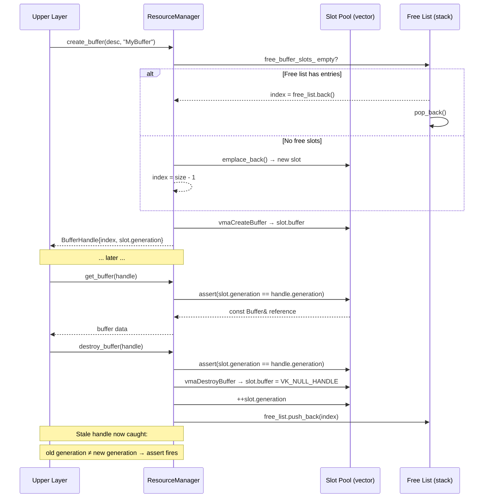

The RHI resource layer is the memory backbone of the renderer. Every GPU buffer, texture, and sampler flows through a single class — **`ResourceManager`** — which wraps raw Vulkan objects behind lightweight, validated handles. The design solves two problems at once: it hides VMA allocation boilerplate behind clean creation descriptors, and it prevents an entire class of use-after-free bugs through a **generation counter** baked into every handle. This page dissects the handle mechanism, the three resource pools (buffers, images, samplers), the upload pipeline, and the format abstraction layer that decouples upper code from Vulkan enum types.

Sources: [types.h](https://github.com/1PercentSync/himalaya/blob/main/rhi/include/himalaya/rhi/types.h#L1-L73), [resources.h](https://github.com/1PercentSync/himalaya/blob/main/rhi/include/himalaya/rhi/resources.h#L1-L530), [resources.cpp](https://github.com/1PercentSync/himalaya/blob/main/rhi/src/resources.cpp#L1-L848)

## Generation-Based Handle Architecture

### Why Generations?

In a renderer, GPU resources are created and destroyed frequently — textures load, render targets resize, buffers get replaced. A raw index into an array is dangerous: if slot 3 is freed and then reused for a different texture, any stale handle still pointing to slot 3 will silently reference the wrong resource. The classic fix is a **generation counter** per slot.

Each handle stores two 32-bit values: an **index** (which slot in the pool) and a **generation** (which "version" of that slot). When a slot is freed, its generation increments. When the slot is reused, the new handle captures the incremented generation. Any stale handle from before the free will carry the old generation, and a single `uint32_t` comparison catches the mismatch in debug builds via `assert`.

Sources: [types.h](https://github.com/1PercentSync/himalaya/blob/main/rhi/include/himalaya/rhi/types.h#L14-L60)

### The Three Handle Types

All three handle types — `ImageHandle`, `BufferHandle`, and `SamplerHandle` — share the same structure and semantics. They are value types (copyable, comparable), default-constructed to an invalid state (`index = UINT32_MAX`), and validated through a `valid()` method:

| Handle Type | Default Index | Invalid Condition | Equality Operator |
|---|---|---|---|
| `ImageHandle` | `UINT32_MAX` | `index == UINT32_MAX` | `default` (compares both fields) |
| `BufferHandle` | `UINT32_MAX` | `index == UINT32_MAX` | `default` |
| `SamplerHandle` | `UINT32_MAX` | `index == UINT32_MAX` | `default` |

A fourth related type, `BindlessIndex`, breaks the pattern — it is a single `uint32_t` with no generation counter, because bindless texture indices are never recycled within a session (they index into a grow-only descriptor array).

Sources: [types.h](https://github.com/1PercentSync/himalaya/blob/main/rhi/include/himalaya/rhi/types.h#L23-L73)

### Slot Lifecycle Diagram

The following diagram shows the complete lifecycle of any resource slot — creation, lookup, destruction, and the safety net that the generation provides:

Sources: [resources.cpp](https://github.com/1PercentSync/himalaya/blob/main/rhi/src/resources.cpp#L77-L105), [resources.cpp](https://github.com/1PercentSync/himalaya/blob/main/rhi/src/resources.cpp#L190-L233), [resources.cpp](https://github.com/1PercentSync/himalaya/blob/main/rhi/src/resources.cpp#L235-L241)

## The Slot Pool Pattern

All three resource pools (buffers, images, samplers) use an identical allocation strategy. Each pool is a `std::vector<T>` paired with a `std::vector<uint32_t>` free list. The free list behaves like a LIFO stack — the most recently freed slot is the first to be reused:

- **Allocation** (`allocate_*_slot()`): If the free list is non-empty, pop the back element. Otherwise, `emplace_back()` a default-constructed slot and return `size - 1`.
- **Release** (`destroy_*()`): Destroy the Vulkan/VMA object, null out the handle, increment the generation counter, and push the index onto the free list.
- **Lookup** (`get_*()`): Assert the handle's generation matches the slot's generation, then return a `const` reference to the internal storage.

This design avoids slot fragmentation (no hole-punching in a dense array), keeps iteration over all slots trivial for bulk cleanup, and makes the free-list push/pop operations O(1).

Sources: [resources.h](https://github.com/1PercentSync/himalaya/blob/main/rhi/include/himalaya/rhi/resources.h#L482-L529), [resources.cpp](https://github.com/1PercentSync/himalaya/blob/main/rhi/src/resources.cpp#L77-L105)

## Buffers — Creation, Memory Strategy, and Device Address

### BufferDesc and BufferUsage

A `BufferDesc` carries three fields: `size` (bytes), `usage` (bitmask of `BufferUsage` flags), and `memory` (one of three `MemoryUsage` strategies). The `BufferUsage` enum is designed for bitwise composition — the RHI provides `operator|`, `operator&=`, and a `has_flag()` free function for testing individual bits:

| BufferUsage Flag | Vulkan Equivalent | Typical Use |
|---|---|---|
| `VertexBuffer` | `VERTEX_BUFFER_BIT` | Mesh vertex data |
| `IndexBuffer` | `INDEX_BUFFER_BIT` | Mesh index data |
| `UniformBuffer` | `UNIFORM_BUFFER_BIT` | Per-frame/per-draw constants |
| `StorageBuffer` | `STORAGE_BUFFER_BIT` | GPU-read/write structured data |
| `TransferSrc` | `TRANSFER_SRC_BIT` | Staging buffer source |
| `TransferDst` | `TRANSFER_DST_BIT` | Upload destination |
| `ShaderDeviceAddress` | `SHADER_DEVICE_ADDRESS_BIT` | Ray tracing AS references |
| `AccelStructBuildInput` | `ACCELERATION_STRUCTURE_BUILD_INPUT_READ_ONLY_BIT_KHR` | RT geometry input |

Sources: [resources.h](https://github.com/1PercentSync/himalaya/blob/main/rhi/include/himalaya/rhi/resources.h#L22-L51), [resources.cpp](https://github.com/1PercentSync/himalaya/blob/main/rhi/src/resources.cpp#L110-L121)

### Memory Strategies via VMA

The `MemoryUsage` enum maps directly to VMA allocation flags. All strategies use `VMA_MEMORY_USAGE_AUTO` as the base, which lets VMA choose between pooled and dedicated allocations based on the driver's `VkMemoryDedicatedRequirements`:

| MemoryUsage | VMA Flags | CPU Access | Typical Use |
|---|---|---|---|
| `GpuOnly` | None (auto) | No | Vertex/index buffers, storage buffers, images |
| `CpuToGpu` | `HOST_ACCESS_SEQUENTIAL_WRITE \| MAPPED` | Write-only, persistent map | Dynamic uniform buffers, staging uploads |
| `GpuToCpu` | `HOST_ACCESS_RANDOM \| MAPPED` | Read-write, persistent map | Readback buffers (e.g. GPU query results) |

For `CpuToGpu` buffers, VMA provides a persistently mapped pointer through `VmaAllocationInfo::pMappedData`, so the upper layer can write directly without calling `vmaMapMemory` each frame.

Sources: [types.h](https://github.com/1PercentSync/himalaya/blob/main/rhi/include/himalaya/rhi/types.h#L138-L147), [resources.cpp](https://github.com/1PercentSync/himalaya/blob/main/rhi/src/resources.cpp#L125-L143)

### Internal Buffer Storage

Each buffer slot stores: the `VkBuffer` handle, the `VmaAllocation`, the `VmaAllocationInfo` (which contains the mapped pointer for CPU-visible buffers), the original `BufferDesc`, and the generation counter. The allocation info is preserved because dynamic uniform buffers need the mapped pointer every frame — it would be wasteful to re-query it.

Sources: [resources.h](https://github.com/1PercentSync/himalaya/blob/main/rhi/include/himalaya/rhi/resources.h#L196-L211)

### Device Address Retrieval

For ray tracing, buffers need a GPU-visible address (used in acceleration structure build inputs and shader device address references). `get_buffer_device_address()` wraps `vkGetBufferDeviceAddress` and asserts that the buffer was created with `ShaderDeviceAddress` usage. The address is a raw `VkDeviceAddress` (a 64-bit GPU virtual pointer) that shaders can use directly.

Sources: [resources.cpp](https://github.com/1PercentSync/himalaya/blob/main/rhi/src/resources.cpp#L243-L252)

## Images — Views, Cubemaps, External Registration, and Mip Generation

### ImageDesc and ImageUsage

An `ImageDesc` describes the full image dimensionality: width, height, depth, mip levels, array layers, sample count, format, and usage flags. The `ImageUsage` enum mirrors Vulkan's image usage bits:

| ImageUsage Flag | Vulkan Equivalent | Typical Use |
|---|---|---|
| `Sampled` | `SAMPLED_BIT` | Texture sampling in shaders |
| `Storage` | `STORAGE_BIT` | Compute write targets |
| `ColorAttachment` | `COLOR_ATTACHMENT_BIT` | Render targets |
| `DepthAttachment` | `DEPTH_STENCIL_ATTACHMENT_BIT` | Depth buffers |
| `TransferSrc` | `TRANSFER_SRC_BIT` | Blit source (mip generation) |
| `TransferDst` | `TRANSFER_DST_BIT` | Upload destination |

Sources: [resources.h](https://github.com/1PercentSync/himalaya/blob/main/rhi/include/himalaya/rhi/resources.h#L53-L81), [resources.cpp](https://github.com/1PercentSync/himalaya/blob/main/rhi/src/resources.cpp#L146-L155)

### Automatic View Creation

`create_image()` always creates a **default image view** alongside the image itself. The view type is inferred from the descriptor: a 6-layer array gets `VK_IMAGE_VIEW_TYPE_CUBE`, any other multi-layer array gets `VK_IMAGE_VIEW_TYPE_2D_ARRAY`, and a single-layer image gets `VK_IMAGE_VIEW_TYPE_2D`. Cubemap images also receive the `VK_IMAGE_CREATE_CUBE_COMPATIBLE_BIT` flag on the `VkImageCreateInfo`. This convention means callers rarely need to create views manually — they can use the default view directly for sampling or attachment binding.

Both the image and the view receive debug names (the view is named `"ImageName [View]"`) via `VK_EXT_debug_utils`, making them identifiable in RenderDoc and Nsight Graphics.

Sources: [resources.cpp](https://github.com/1PercentSync/himalaya/blob/main/rhi/src/resources.cpp#L256-L324)

### External Image Registration

Swapchain images are created by Vulkan's swapchain extension, not by the resource manager. To integrate them into the handle system, `register_external_image()` allocates a slot and records the `VkImage`, `VkImageView`, and `ImageDesc` — but sets `allocation = VK_NULL_HANDLE` to mark it as **externally owned**. When the slot is released via `unregister_external_image()`, the manager increments generation and frees the slot without destroying the Vulkan objects. The bulk `destroy()` method detects external images by their null allocation and emits a warning instead of destroying them.

Sources: [resources.cpp](https://github.com/1PercentSync/himalaya/blob/main/rhi/src/resources.cpp#L356-L382), [resources.cpp](https://github.com/1PercentSync/himalaya/blob/main/rhi/src/resources.cpp#L28-L46)

### Per-Layer Views for Shadow Cascades

For shadow mapping with CSM, each cascade needs its own `VkImageView` targeting a single layer of a layered depth image. `create_layer_view()` creates a `VK_IMAGE_VIEW_TYPE_2D` view with `baseArrayLayer = layer` and `layerCount = 1`. The returned `VkImageView` is caller-owned — it must be destroyed via `destroy_layer_view()` before the parent image is freed. This is one of the few places where the API returns a raw Vulkan handle instead of an RHI handle, because layer views are short-lived, per-pass resources.

Sources: [resources.cpp](https://github.com/1PercentSync/himalaya/blob/main/rhi/src/resources.cpp#L448-L479)

### Mip Generation

`generate_mips()` records a chain of `vkCmdBlitImage2` calls into the active immediate command buffer. It expects mip level 0 to already be populated (e.g. from `upload_image()`). The algorithm transitions mip 0 from `SHADER_READ_ONLY` to `TRANSFER_SRC`, then iterates from level 1 upward — each level is transitioned from `UNDEFINED` to `TRANSFER_DST`, blitted from the previous level with linear filtering, then transitioned to `TRANSFER_SRC` for the next iteration. Finally, all levels are transitioned to `SHADER_READ_ONLY`. The image must have both `TransferSrc` and `TransferDst` usage flags, and more than one mip level.

Sources: [resources.cpp](https://github.com/1PercentSync/himalaya/blob/main/rhi/src/resources.cpp#L749-L847)

## Samplers — Filtering, Wrapping, and Comparison

### SamplerDesc Fields

A `SamplerDesc` controls every parameter of a `VkSampler` through a Vulkan-agnostic interface:

| Field | Type | Purpose |
|---|---|---|
| `mag_filter` / `min_filter` | `Filter` (`Nearest`, `Linear`) | Magnification/minification filter |
| `mip_mode` | `SamplerMipMode` (`Nearest`, `Linear`) | Inter-mip interpolation |
| `wrap_u` / `wrap_v` | `SamplerWrapMode` (`Repeat`, `ClampToEdge`, `MirroredRepeat`) | UV address mode |
| `max_anisotropy` | `float` | Max anisotropic filtering level (0 = disabled) |
| `max_lod` | `float` | Maximum accessible mip level (0 = base only, `VK_LOD_CLAMP_NONE` = all) |
| `compare_enable` | `bool` | Enable depth comparison mode |
| `compare_op` | `CompareOp` | Comparison function for shadow sampling |

Anisotropy is conditionally enabled — only when `max_anisotropy > 0.0f`. The device's supported maximum is queried at startup and exposed via `max_sampler_anisotropy()`, so the application can pass it directly to the sampler description.

Sources: [resources.h](https://github.com/1PercentSync/himalaya/blob/main/rhi/include/himalaya/rhi/resources.h#L159-L186), [resources.cpp](https://github.com/1PercentSync/himalaya/blob/main/rhi/src/resources.cpp#L386-L418)

### Sampler Catalog in Practice

The renderer creates five application-wide samplers at initialization, each tuned for a specific purpose:

| Sampler | Filter | Wrap | Aniso | Compare | Use Case |
|---|---|---|---|---|---|
| Default | Linear/Linear/Linear | Repeat | Max device | No | Standard PBR textures |
| Shadow Comparison | Linear/Linear/Nearest | ClampToEdge | 0 | Yes (`GreaterOrEqual`) | PCF shadow sampling |
| Shadow Depth | Nearest/Nearest/Nearest | ClampToEdge | 0 | No | Shadow map depth attachment |
| Nearest Clamp | Nearest/Nearest/Nearest | ClampToEdge | 0 | No | AO/depth buffer reads |
| Linear Clamp | Linear/Linear/Nearest | ClampToEdge | 0 | No | Bilateral filter taps |

Additionally, the scene loader creates per-texture samplers from glTF sampler descriptors, mapping `fastgltf::Sampler` properties to `SamplerDesc` fields.

Sources: [renderer_init.cpp](https://github.com/1PercentSync/himalaya/blob/main/app/src/renderer_init.cpp#L316-L379)

## Data Upload Pipeline

### Immediate Command Scope

All upload operations must occur within a `Context::begin_immediate()` / `Context::end_immediate()` scope. This provides a command buffer from a dedicated pool (decoupled from per-frame pools) and guarantees GPU completion via `vkQueueWaitIdle` before `end_immediate()` returns. The resource manager asserts `context_->is_immediate_active()` at the top of every upload method.

Sources: [resources.cpp](https://github.com/1PercentSync/himalaya/blob/main/rhi/src/resources.cpp#L487-L488), [context.h](https://github.com/1PercentSync/himalaya/blob/main/rhi/include/himalaya/rhi/context.h#L236-L260)

### Staging Buffer Pattern

Both `upload_buffer()` and `upload_image()` follow the same staging pattern:

1. **Create** a CPU-visible staging buffer (`VMA_MEMORY_USAGE_AUTO` + `HOST_ACCESS_SEQUENTIAL_WRITE | MAPPED`).
2. **Memcpy** the source data into the mapped pointer.
3. **Record** a copy command (`vkCmdCopyBuffer` or `vkCmdCopyBufferToImage`) into the immediate command buffer.
4. **Register** the staging buffer for deferred cleanup via `context_->push_staging_buffer()`.
5. **Cleanup** happens when `end_immediate()` destroys all staging buffers after GPU completion.

This design avoids per-upload synchronization — the single `vkQueueWaitIdle` at the end of the scope covers all uploads within the scope.

Sources: [resources.cpp](https://github.com/1PercentSync/himalaya/blob/main/rhi/src/resources.cpp#L483-L536)

### Multi-Level Upload for Compressed Textures

`upload_image_all_levels()` handles the KTX2/mip-chain case where all levels are uploaded in a single batch. It creates one staging buffer for the entire mip chain, records one `VkBufferImageCopy2` per level, and issues a single `vkCmdCopyBufferToImage2` call. For cubemaps (`array_layers = 6`), each region covers all six faces — matching the KTX2 face-contiguous layout. The `MipUploadRegion` struct carries `buffer_offset`, `width`, and `height` per level, giving the caller precise control over where each level's data starts within the source buffer.

Sources: [resources.cpp](https://github.com/1PercentSync/himalaya/blob/main/rhi/src/resources.cpp#L629-L747), [resources.h](https://github.com/1PercentSync/himalaya/blob/main/rhi/include/himalaya/rhi/resources.h#L443-L468)

## Format Abstraction Layer

The `Format` enum decouples upper-layer code from `VkFormat` constants. It covers the formats needed by the renderer: 8-bit UNORM/SRGB, 16-bit float, 32-bit float, packed formats (A2B10G10R10, B10G11R11), block-compressed formats (BC5, BC6H, BC7), and depth formats (D32Sfloat, D24UnormS8Uint). Three utility functions bridge the abstraction:

| Function | Input → Output | Use Case |
|---|---|---|
| `to_vk_format(Format)` | Format → VkFormat | Resource creation |
| `from_vk_format(VkFormat)` | VkFormat → Format | KTX2 loading |
| `aspect_from_format(Format)` | Format → VkImageAspectFlags | Barrier construction |

Sources: [types.h](https://github.com/1PercentSync/himalaya/blob/main/rhi/include/himalaya/rhi/types.h#L94-L228)

### Block-Compressed Format Support

BC formats require special handling because they operate on 4×4 texel blocks rather than individual pixels. Three utilities provide the necessary metadata:

- **`format_bytes_per_block(Format)`**: Returns 16 bytes for BC formats (4×4 pixels compressed into one block), 1–16 bytes for uncompressed formats.
- **`format_block_extent(Format)`**: Returns `{4, 4}` for BC formats, `{1, 1}` for uncompressed.
- **`format_is_block_compressed(Format)`**: Simple boolean check for BC5/BC6H/BC7.

These are used by the texture pipeline when computing buffer sizes and copy regions for BC-compressed textures loaded from KTX2 files.

Sources: [types.h](https://github.com/1PercentSync/himalaya/blob/main/rhi/include/himalaya/rhi/types.h#L290-L342)

### Alignment Utility

The template function `align_up<T>(value, alignment)` rounds up to the next power-of-two boundary using the standard bitmask trick: `(value + alignment - 1) & ~(alignment - 1)`. This is used throughout the codebase for uniform buffer alignment, SBT entry sizing, and scratch buffer offset computation.

Sources: [types.h](https://github.com/1PercentSync/himalaya/blob/main/rhi/include/himalaya/rhi/types.h#L172-L175)

## Integration with the Render Graph

The [Render Graph](https://github.com/1PercentSync/himalaya/blob/main/9-render-graph-automatic-barrier-insertion-and-pass-orchestration) is the primary consumer of `ResourceManager` at the framework layer. It manages a collection of **managed images** — persistent GPU textures that survive across frames (color buffers, depth buffers, AO outputs, temporal history). Each managed image holds an `ImageHandle` to its backing resource. When the window resizes, the render graph calls `set_reference_resolution()`, which triggers a rebuild of all size-relative managed images: each is destroyed via `destroy_image()` and recreated with the new dimensions via `create_image()`. The generation mechanism ensures that any stale render graph references to the old image are caught.

Temporal managed images (used for temporal anti-aliasing and temporal AO) maintain a **double buffer** — a current `backing` and a `history_backing`. Both are destroyed and recreated together on resize, and the history is marked invalid until one full frame has been rendered.

Sources: [render_graph.cpp](https://github.com/1PercentSync/himalaya/blob/main/framework/src/render_graph.cpp#L220-L250), [render_graph.h](https://github.com/1PercentSync/himalaya/blob/main/framework/include/himalaya/framework/render_graph.h#L451-L462)

## Bulk Destruction and Leak Detection

`ResourceManager::destroy()` iterates all slots in all three pools and destroys any remaining resources. It counts "leaked" resources (slots where the Vulkan handle is not null) and logs a warning with the counts. For images, it distinguishes between owned images (VMA allocation present → destroy view + image + allocation) and external images (null allocation → emit warning about forgotten `unregister_external_image()` call). This catch-all destruction provides a safety net: even if upper layers forget to clean up, the resource manager won't leak GPU objects past shutdown.

Sources: [resources.cpp](https://github.com/1PercentSync/himalaya/blob/main/rhi/src/resources.cpp#L15-L72)

---

**Next steps**: With resource handles understood, the natural progression is to see how images and samplers are wired into the GPU via the [Bindless Descriptor Architecture — Three-Set Layout and Texture Registration](https://github.com/1PercentSync/himalaya/blob/main/7-bindless-descriptor-architecture-three-set-layout-and-texture-registration), and how the [Render Graph](https://github.com/1PercentSync/himalaya/blob/main/9-render-graph-automatic-barrier-insertion-and-pass-orchestration) orchestrates handle-to-image resolution and barrier insertion across render passes.