Himalaya is built on a foundation of deliberate architectural choices that prioritize long-term maintainability, cross-platform compatibility, and a pragmatic balance between visual quality and implementation complexity. This page documents the core technologies, third-party dependencies, and the reasoning behind key technical decisions that shape the renderer's design.

## Vulkan API Foundation

The renderer targets **Vulkan 1.4** as its graphics API baseline, leveraging modern core features that simplify rendering architecture while maintaining broad hardware compatibility. The selection prioritizes features that align with the Render Graph system's needs and reduce pipeline complexity.

| Core Feature | Purpose |
|-------------|---------|
| Dynamic Rendering | Replaces `VkRenderPass`/`VkFramebuffer` with dynamic begin/end rendering commands, naturally fitting the Render Graph's barrier insertion model |
| Synchronization2 | Provides clearer barrier semantics through `VkPipelineStageFlagBits2` and `VkAccessFlagBits2`, enabling more precise dependency tracking |
| Extended Dynamic State | Reduces pipeline permutation count by allowing dynamic viewport, scissor, cull mode, and depth state changes at command recording time |
| Descriptor Indexing | Enables bindless texture arrays for material systems, supporting thousands of textures with a single descriptor set |

The API choice reflects the principle of "not closing the door on mobile"—while the primary target is desktop gaming hardware, architectural decisions avoid patterns that fundamentally conflict with mobile TBDR (Tile-Based Deferred Rendering) architectures.

Sources: [CLAUDE.md](https://github.com/1PercentSync/himalaya/blob/main/CLAUDE.md#L1-L50), [technical-decisions.md](https://github.com/1PercentSync/himalaya/blob/main/docs/project/technical-decisions.md#L1-L20)

## Layered Architecture

The codebase is organized into four strictly separated layers, each compiled as an independent static library with unidirectional dependencies:

```mermaid
flowchart BT
    subgraph Layer3["Layer 3 — Application"]
        APP["himalaya_app (executable)"]
    end
    
    subgraph Layer2["Layer 2 — Render Passes"]
        PASSES["himalaya_passes"]
    end
    
    subgraph Layer1["Layer 1 — Render Framework"]
        FRAMEWORK["himalaya_framework"]
    end
    
    subgraph Layer0["Layer 0 — RHI"]
        RHI["himalaya_rhi"]
    end
    
    APP --> PASSES
    PASSES --> FRAMEWORK
    FRAMEWORK --> RHI
    
    style Layer0 fill:#2d3748,stroke:#4a5568
    style Layer1 fill:#2c5282,stroke:#4299e1
    style Layer2 fill:#276749,stroke:#48bb78
    style Layer3 fill:#744210,stroke:#ed8936
```



This layering enforces architectural boundaries: the RHI knows nothing about render passes, passes do not reference each other, and the application orchestrates without implementing rendering logic. The separation enables independent testing and reduces the scope of changes when modifying individual systems.

Sources: [CLAUDE.md](https://github.com/1PercentSync/himalaya/blob/main/CLAUDE.md#L120-L150)

## Third-Party Dependencies

Dependency management uses **vcpkg in manifest mode**, with all libraries declared in `vcpkg.json` and automatically fetched during CMake configuration. This eliminates manual library installation and ensures reproducible builds across development environments.

| Library | Version | Purpose |
|---------|---------|---------|
| **GLFW** | 3.4#1 | Window creation and input handling |
| **GLM** | 1.0.3 | Vector/matrix math (directly used in public headers) |
| **spdlog** | 1.17.0 | Structured logging with compile-time level filtering |
| **VMA** | 3.3.0 | Vulkan memory allocation with defragmentation |
| **shaderc** | 2025.2 | Runtime GLSL to SPIR-V compilation |
| **Dear ImGui** | 1.91.9 (docking) | Debug UI with Vulkan and GLFW bindings |
| **fastgltf** | 0.9.0 | glTF 2.0 scene loading |
| **mikktspace** | 2020-10-06 | Tangent space generation for normal mapping |
| **stb** | 2024-07-29 | Image decoding (JPEG/PNG) |
| **nlohmann-json** | 3.12.0 | Configuration persistence |
| **xxHash** | 0.8.3 | Content-addressable caching (XXH3_128) |

Additional libraries integrated manually include **bc7enc** (ISPC-based BC7 texture compression) and **OIDN** (Intel Open Image Denoise for viewport and baking denoising).

Sources: [vcpkg.json](https://github.com/1PercentSync/himalaya/blob/main/vcpkg.json#L1-L40), [CLAUDE.md](https://github.com/1PercentSync/himalaya/blob/main/CLAUDE.md#L155-L175)

## Rendering Framework: Forward+

The shading architecture follows **Forward+** (Clustered Forward) rather than Deferred Shading, a decision driven by three primary constraints:

1. **Mobile TBDR Compatibility**: Deferred's multi-render-target GBuffer write-read pattern fundamentally breaks mobile tile memory architectures
2. **MSAA Support**: VR applications benefit from MSAA's temporal stability; Forward+ supports it natively while Deferred requires per-sample shading or complex workarounds
3. **Material Flexibility**: Different shading models (PBR, toon) bind different shaders directly rather than encoding model IDs into GBuffer channels

The "cost" of Forward+—needing a depth-prepass for screen-space effects—is mitigated by the fact that Z-prepass is essentially mandatory for Early-Z optimization regardless. The evolution follows a natural progression: brute-force Forward (sufficient for single-digit light counts) → Tiled Forward (2D screen-space culling) → Clustered Forward (3D depth-extended culling).

Sources: [decision-process.md](https://github.com/1PercentSync/himalaya/blob/main/docs/project/decision-process.md#L1-L50)

## PBR and BRDF Model

The physically-based shading follows the **Metallic-Roughness workflow** (glTF 2.0 standard) with industry-standard component choices:

| Component | Selection | Evolution Path |
|-----------|-----------|----------------|
| **Diffuse** | Lambert → Burley | Burley adds retroreflection at grazing angles for rough surfaces |
| **Specular D (NDF)** | GGX | Multiscatter GGX energy compensation via precomputed LUT |
| **Specular G** | Smith Height-Correlated GGX | Mathematically paired with GGX NDF |
| **Specular F** | Schlick Approximation | Standard across all major engines |

The parameterization choice aligns with the glTF ecosystem, ensuring asset compatibility and consistent material interpretation across tools.

Sources: [technical-decisions.md](https://github.com/1PercentSync/himalaya/blob/main/docs/project/technical-decisions.md#L21-L40), [brdf.glsl](https://github.com/1PercentSync/himalaya/blob/main/shaders/common/brdf.glsl#L1-L75)

## Resource Management Architecture

The RHI layer implements **generation-based resource handles** for memory safety without smart pointer overhead. Each handle combines a slot index with a generation counter; when resources are destroyed, the generation increments, invalidating all existing handles to that slot.

```cpp
struct ImageHandle {
    uint32_t index = UINT32_MAX;      // Slot index in resource pool
    uint32_t generation = 0;          // Incremented on destroy
    [[nodiscard]] bool valid() const { return index != UINT32_MAX; }
};
```

Resource destruction uses a **deferred deletion queue** tied to frame fences—resources are enqueued for destruction when no longer needed, but only actually destroyed after the GPU has finished processing the frame that last referenced them. This pattern eliminates use-after-free hazards in multi-buffered rendering.

Sources: [types.h](https://github.com/1PercentSync/himalaya/blob/main/rhi/include/himalaya/rhi/types.h#L14-L60), [context.h](https://github.com/1PercentSync/himalaya/blob/main/rhi/include/himalaya/rhi/context.h#L57-L80)

## Descriptor Strategy

The shader binding model uses a three-set layout that balances flexibility with implementation complexity:

| Set | Purpose | Update Frequency |
|-----|---------|------------------|
| **Set 0** | Per-frame global data (matrices, lights, materials) | Once per frame |
| **Set 1** | Bindless texture arrays (2D textures and cubemaps) | Static after initialization |
| **Set 2** | Render target intermediate products (AO, depth, normals) | Varies by pass |

Set 0 uses traditional uniform buffers and storage buffers for scene data. Set 1 leverages descriptor indexing for bindless texture access, enabling thousands of unique textures without descriptor set fragmentation. Set 2 provides partially-bound access to intermediate render targets, allowing passes to consume outputs from previous passes through a consistent interface.

Sources: [bindings.glsl](https://github.com/1PercentSync/himalaya/blob/main/shaders/common/bindings.glsl#L1-L100)

## Path Tracing Infrastructure

The renderer is architected for **gradual RT introduction** rather than a full replacement of rasterization. Two Vulkan ray tracing APIs are employed:

| API | Use Case |
|-----|----------|
| `VK_KHR_ray_tracing_pipeline` | Baking, reference views, real-time PT (massive ray dispatch) |
| `VK_KHR_ray_query` | Hybrid RT effects (RT reflections, RT shadows in fragment shaders) |

Both APIs share the same `VK_KHR_acceleration_structure` BLAS/TLAS infrastructure. The M1 milestone implements a GPU path tracing baker and reference view using NEE (Next Event Estimation), MIS (Multiple Importance Sampling), and OIDN denoising. M2 introduces real-time PT with ReSTIR DI for direct lighting and SHaRC for indirect lighting, targeting DOOM: The Dark Ages quality levels.

Sources: [technical-decisions.md](https://github.com/1PercentSync/himalaya/blob/main/docs/project/technical-decisions.md#L280-L380)

## Development Toolchain

| Component | Selection | Rationale |
|-----------|-----------|-----------|
| **Build System** | CMake 4.1 | Modern transitive dependency handling, preset support |
| **Compiler** | MSVC + ISPC 1.30 | ISPC for SIMD texture compression kernels |
| **C++ Standard** | C++20 | Concepts, designated initializers, ranges |
| **Package Manager** | vcpkg (manifest) | Reproducible dependency resolution |
| **IDE** | CLion | Native CMake integration, remote development |

The build produces four artifacts: `himalaya_rhi.lib`, `himalaya_framework.lib`, `himalaya_passes.lib`, and `himalaya_app.exe`. A post-build step synchronizes shaders to the output directory and copies OIDN runtime DLLs.

Sources: [CMakeLists.txt](https://github.com/1PercentSync/himalaya/blob/main/CMakeLists.txt#L1-L11), [CLAUDE.md](https://github.com/1PercentSync/himalaya/blob/main/CLAUDE.md#L20-L30)

## Design Philosophy Summary

The technology stack reflects a consistent set of principles documented in [Requirements and Design Philosophy](https://github.com/1PercentSync/himalaya/blob/main/4-requirements-and-design-philosophy):

- **Progressive Implementation**: Pass 1/2/3 evolution paths allow working systems early, with complexity added incrementally
- **Industry Validation**: All major technologies have proven implementations and extensive documentation
- **Performance-Quality Balance**: Sweet-spot targeting for mid-range desktop hardware
- **Hybrid Pipeline Compatibility**: Decisions preserve optionality for RT integration without sacrificing current rasterization quality
- **Design Constraints for Simplicity**: Accepting scene limitations (e.g., single interactive door) to avoid exponential complexity

These principles manifest in concrete choices like skipping Hosek-Wilkie sky (directly implementing Bruneton), bypassing HBAO for GTAO, and using SDK-based upscaling (FSR/DLSS) rather than custom TAA implementations.

Sources: [requirements-and-philosophy.md](https://github.com/1PercentSync/himalaya/blob/main/docs/project/requirements-and-philosophy.md#L1-L50)

## Next Steps

With the foundational technology stack established, the logical progression leads to understanding how these components interact during frame execution. The [Frame Flow and Render Graph Design](https://github.com/1PercentSync/himalaya/blob/main/34-frame-flow-and-render-graph-design) page details the per-frame resource management and synchronization patterns that coordinate these systems.