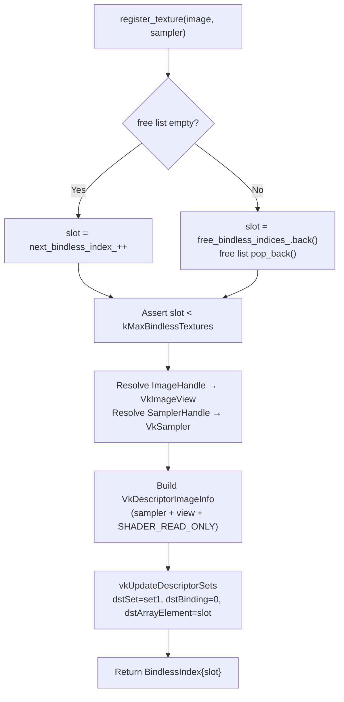
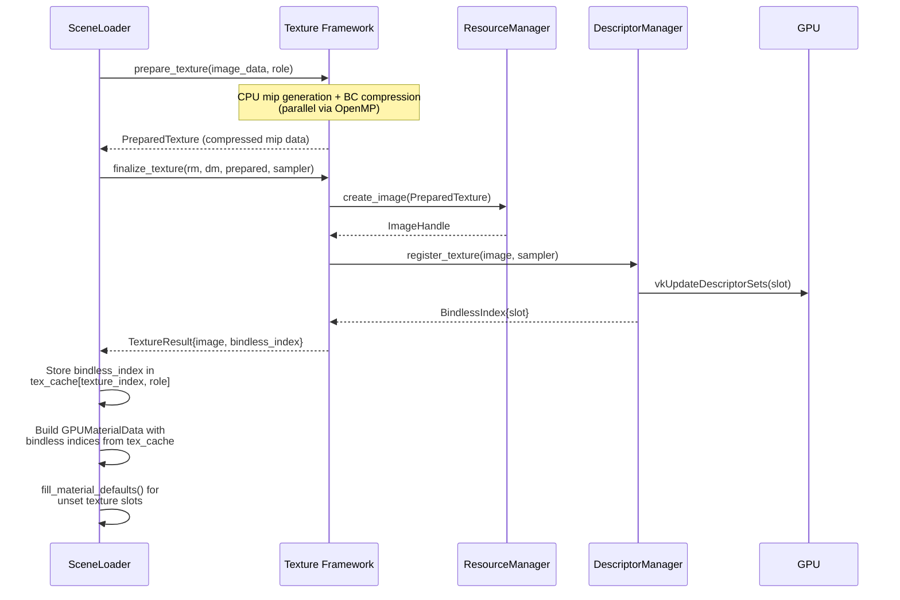

The Himalaya renderer eliminates traditional per-draw descriptor binding overhead through a **three-set bindless descriptor architecture** managed by `DescriptorManager`. All textures across the entire scene are registered into global arrays at load time and indexed by integer handles, allowing every shader pass to access any texture with zero pipeline-state changes during rendering. The system is structured around three distinct descriptor sets — per-frame global data (Set 0), bindless texture/cubemap arrays (Set 1), and named render target intermediates (Set 2) — each with its own layout flags, pool allocation strategy, and update cadence.

Sources: [descriptors.h](https://github.com/1PercentSync/himalaya/blob/main/rhi/include/himalaya/rhi/descriptors.h#L1-L50), [bindings.glsl](https://github.com/1PercentSync/himalaya/blob/main/shaders/common/bindings.glsl#L1-L189)

## Architectural Overview

The descriptor architecture partitions GPU resource access into three frequency bands: **once-per-frame** data in Set 0, **once-per-scene-load** texture arrays in Set 1, and **per-frame-varying** render target intermediates in Set 2. This partitioning ensures that the expensive bindless arrays (Set 1) are allocated from a single descriptor set with `UPDATE_AFTER_BIND` semantics, while per-frame resources use standard pools that can be more efficiently managed by the driver.

```mermaid
graph TD
    subgraph "DescriptorManager"
        direction TB
        DM[DescriptorManager]
        DM --> S0[Set 0: Global Data]
        DM --> S1[Set 1: Bindless Arrays]
        DM --> S2[Set 2: Render Targets]
    end

    subgraph "Set 0 — Per-Frame Global"
        S0_B0["Binding 0<br/>GlobalUBO"]
        S0_B1["Binding 1<br/>LightBuffer SSBO"]
        S0_B2["Binding 2<br/>MaterialBuffer SSBO"]
        S0_B3["Binding 3<br/>InstanceBuffer SSBO"]
        S0_B4["Binding 4 (RT)<br/>TLAS"]
        S0_B5["Binding 5 (RT)<br/>GeometryInfo SSBO"]
    end

    subgraph "Set 1 — Bindless"
        S1_B0["Binding 0<br/>sampler2D[4096]"]
        S1_B1["Binding 1<br/>samplerCube[256]"]
    end

    subgraph "Set 2 — Render Targets"
        S2_B0["Binding 0<br/>rt_hdr_color"]
        S2_B1["Binding 1<br/>rt_depth_resolved"]
        S2_B2["Binding 2<br/>rt_normal_resolved"]
        S2_B3["Binding 3<br/>rt_ao_texture"]
        S2_B4["Binding 4<br/>rt_contact_shadow_mask"]
        S2_B5["Binding 5<br/>rt_shadow_map"]
        S2_B6["Binding 6<br/>rt_shadow_map_depth"]
    end

    S0 --- S0_B0 & S0_B1 & S0_B2 & S0_B3 & S0_B4 & S0_B5
    S1 --- S1_B0 & S1_B1
    S2 --- S2_B0 & S2_B1 & S2_B2 & S2_B3 & S2_B4 & S2_B5 & S2_B6
```



Every graphics and compute pipeline in the renderer binds all three sets at dispatch time via `vkCmdBindDescriptorSets`. The pipeline layout is assembled from the same three `VkDescriptorSetLayout` objects returned by `get_graphics_set_layouts()`, ensuring layout compatibility across all passes. Compute and ray-tracing pipelines additionally receive a pass-specific push descriptor set (Set 3) through `get_dispatch_set_layouts()`.

Sources: [descriptors.h](https://github.com/1PercentSync/himalaya/blob/main/rhi/include/himalaya/rhi/descriptors.h#L62-L72), [descriptors.cpp](https://github.com/1PercentSync/himalaya/blob/main/rhi/src/descriptors.cpp#L219-L222), [forward_pass.cpp](https://github.com/1PercentSync/himalaya/blob/main/passes/src/forward_pass.cpp#L157-L162)

## Set 0 — Per-Frame Global Data

Set 0 aggregates all per-frame resources into a single descriptor set with **4 base bindings** (extendable to 6 when ray tracing is available). It is allocated twice — one per frame in flight — from a standard descriptor pool, because its contents change every frame as uniform buffers are rewritten and dynamic SSBOs grow or shrink with scene content.

| Binding | Type | GLSL Symbol | Contents | Update Frequency |
|---------|------|-------------|----------|-----------------|
| 0 | `UNIFORM_BUFFER` | `global` | `GlobalUBO` — view/projection matrices, camera, shadow cascades, feature flags | Per-frame |
| 1 | `STORAGE_BUFFER` | `directional_lights[]` | `GPUDirectionalLight` array | Per-frame |
| 2 | `STORAGE_BUFFER` | `materials[]` | `GPUMaterialData` array (80-byte elements) | Per-scene-load |
| 3 | `STORAGE_BUFFER` | `instances[]` | `GPUInstanceData` array (128-byte elements) | Per-frame |
| 4 (RT) | `ACCELERATION_STRUCTURE_KHR` | `tlas` | Top-level acceleration structure | Per-scene-load |
| 5 (RT) | `STORAGE_BUFFER` | `geometry_infos[]` | `GeometryInfo` array (24-byte elements) | Per-scene-load |

### Layout Construction with Conditional RT Bindings

The layout creation in `create_layouts()` builds the Set 0 layout conditionally based on `context_->rt_supported`. When ray tracing is available, bindings 4 and 5 are appended with `VK_DESCRIPTOR_BINDING_PARTIALLY_BOUND_BIT` — these bindings are written later during AS build, not at init time. The shader-side counterpart uses `#ifdef HIMALAYA_RT` guards in [bindings.glsl](https://github.com/1PercentSync/himalaya/blob/main/shaders/common/bindings.glsl#L149-L170) so non-RT builds see only the 4 base bindings.

The shader stage flags are carefully partitioned: `InstanceBuffer` (binding 3) is accessible to all graphics and compute stages but **not** ray tracing stages, because RT shaders access instance data through `gl_InstanceCustomIndexEXT` + `GeometryInfo` rather than through the instance SSBO directly. Conversely, `GeometryInfoBuffer` (binding 5) is restricted to `closesthit` and `anyhit` stages only.

Sources: [descriptors.cpp](https://github.com/1PercentSync/himalaya/blob/main/rhi/src/descriptors.cpp#L289-L389), [bindings.glsl](https://github.com/1PercentSync/himalaya/blob/main/shaders/common/bindings.glsl#L86-L170)

### Descriptor Pool for Set 0

The Set 0 pool pre-allocates based on the maximum possible binding count: 2 UBO slots (binding 0 × 2 frames), 6–8 SSBO slots (bindings 1–3 × 2 frames + optional binding 5 × 2 frames), and 2 acceleration structure slots (binding 4 × 2 frames). The `maxSets` is 2, matching the double-buffered frame-in-flight model.

Sources: [descriptors.cpp](https://github.com/1PercentSync/himalaya/blob/main/rhi/src/descriptors.cpp#L474-L493)

### Buffer Write API

Two overloads of `write_set0_buffer()` handle the different update cadences: the per-frame overload writes to a specific frame's descriptor set (used for `GlobalUBO`, `LightBuffer`, `InstanceBuffer`), while the all-frames overload writes to both frames in flight (used for `MaterialBuffer` and `GeometryInfoBuffer`, which are constant across frames within a scene). Binding 0 is automatically detected as `UNIFORM_BUFFER` type; all other bindings use `STORAGE_BUFFER`.

Sources: [descriptors.h](https://github.com/1PercentSync/himalaya/blob/main/rhi/include/himalaya/rhi/descriptors.h#L100-L124), [descriptors.cpp](https://github.com/1PercentSync/himalaya/blob/main/rhi/src/descriptors.cpp#L224-L263)

## Set 1 — Bindless Texture and Cubemap Arrays

Set 1 is the core of the bindless architecture: two unbounded arrays of `COMBINED_IMAGE_SAMPLER` descriptors — one for 2D textures and one for cubemaps — that are indexed at shader time by material data fields. This eliminates per-draw texture binds entirely: the fragment shader simply does `texture(textures[nonuniformEXT(mat.base_color_tex)], frag_uv0)` where `mat.base_color_tex` is an integer index resolved from the material SSBO.

### Capacity Constants

| Array | Max Count | Constant |
|-------|-----------|----------|
| `sampler2D[]` (binding 0) | 4096 | `kMaxBindlessTextures` |
| `samplerCube[]` (binding 1) | 256 | `kMaxBindlessCubemaps` |

The total of 4352 combined image samplers is verified against device limits at physical device selection time via `has_required_limits()`, which checks `maxPerStageDescriptorUpdateAfterBindSampledImages`, `maxPerStageDescriptorUpdateAfterBindSamplers`, `maxDescriptorSetUpdateAfterBindSampledImages`, and `maxDescriptorSetUpdateAfterBindSamplers` against the required count.

Sources: [descriptors.h](https://github.com/1PercentSync/himalaya/blob/main/rhi/include/himalaya/rhi/descriptors.h#L20-L24), [context.cpp](https://github.com/1PercentSync/himalaya/blob/main/rhi/src/context.cpp#L304-L322)

### Layout Flags: PARTIALLY_BOUND + UPDATE_AFTER_BIND

Both bindings in Set 1 carry `VK_DESCRIPTOR_BINDING_PARTIALLY_BOUND_BIT | VK_DESCRIPTOR_BINDING_UPDATE_AFTER_BIND_BIT`, and the layout itself is created with `VK_DESCRIPTOR_SET_LAYOUT_CREATE_UPDATE_AFTER_BIND_POOL_BIT`. This is critical: it allows the descriptor array to be sparse (most of the 4096 slots are unwritten at any given time) and allows new texture registrations to happen while the GPU is reading from other slots in the same set. Without `UPDATE_AFTER_BIND`, the entire descriptor set would need to be idle during any `vkUpdateDescriptorSets` call.

The pool for Set 1 is allocated from a single `UPDATE_AFTER_BIND` pool with `maxSets = 1`, and only one descriptor set (`set1_set_`) is ever allocated. This single set is shared across all frames in flight — because texture registrations happen at scene load time, not per-frame, there is no need for per-frame copies.

Sources: [descriptors.cpp](https://github.com/1PercentSync/himalaya/blob/main/rhi/src/descriptors.cpp#L391-L442), [descriptors.cpp](https://github.com/1PercentSync/himalaya/blob/main/rhi/src/descriptors.cpp#L495-L510)

### Shader Stage Visibility

The bindless arrays are visible to `FRAGMENT`, `COMPUTE`, and (when RT is supported) `RAYGEN`, `CLOSEST_HIT`, `ANY_HIT`, and `MISS` stages. This broad visibility is necessary because: fragment shaders sample material textures and render targets; compute passes (GTAO, spatial/temporal AO filter, contact shadows) read depth and normal textures; and RT shaders sample material textures in closest-hit and IBL cubemaps in miss shaders.

Sources: [descriptors.cpp](https://github.com/1PercentSync/himalaya/blob/main/rhi/src/descriptors.cpp#L394-L402)

## Texture Registration — Slot Allocation and Free-List Reuse

The `DescriptorManager` implements a **bump-allocator with free-list reuse** pattern for both texture and cubemap slot management. This design provides O(1) allocation and deallocation while maximizing slot reuse across scene load/unload cycles.

### Allocation Algorithm



When `register_texture()` is called, it first checks the free list for a recycled slot. If the free list is empty, it bumps the sequential counter `next_bindless_index_`. The slot index is then used as `dstArrayElement` in a `VkWriteDescriptorSet` targeting Set 1, binding 0. The returned `BindlessIndex` is a lightweight struct wrapping the `uint32_t` slot — materials store this index directly in their GPU data so shaders can index into the array.

Cubemap registration follows an identical pattern but targets binding 1 with an independent counter (`next_cubemap_index_`) and free list (`free_cubemap_indices_`). The two arrays share no slot space.

Sources: [descriptors.cpp](https://github.com/1PercentSync/himalaya/blob/main/rhi/src/descriptors.cpp#L88-L126), [descriptors.cpp](https://github.com/1PercentSync/himalaya/blob/main/rhi/src/descriptors.cpp#L128-L166)

### Deallocation and Lifetime

`unregister_texture()` pushes the slot index back onto the free list for reuse by subsequent registrations. The caller is responsible for ensuring the GPU is no longer reading the slot before calling unregister — typically achieved through the [DeletionQueue](https://github.com/1PercentSync/himalaya/blob/main/5-gpu-context-lifecycle-instance-device-queues-and-memory) deferred destruction mechanism. The `SceneLoader::destroy()` method demonstrates the correct ordering: unregister all bindless indices first, then destroy the underlying images.

```cpp
// Correct teardown ordering (from SceneLoader::destroy)
for (const auto idx : bindless_indices_) {
    descriptor_manager_->unregister_texture(idx);
}
bindless_indices_.clear();

// Only after unregistration — images can now be safely destroyed
for (const auto handle : images_) {
    resource_manager_->destroy_image(handle);
}
```

Sources: [descriptors.cpp](https://github.com/1PercentSync/himalaya/blob/main/rhi/src/descriptors.cpp#L168-L176), [scene_loader.cpp](https://github.com/1PercentSync/himalaya/blob/main/app/src/scene_loader.cpp#L684-L697)

### BindlessIndex Type

The `BindlessIndex` struct in [types.h](https://github.com/1PercentSync/himalaya/blob/main/rhi/include/himalaya/rhi/types.h#L67-L73) is a minimal value type: a single `uint32_t index` defaulting to `UINT32_MAX`, with a `valid()` check. Unlike the generation-based resource handles (`ImageHandle`, `BufferHandle`, `SamplerHandle`), `BindlessIndex` carries no generation counter — the slot identity is sufficient because descriptor validity is managed by the caller's deferred destruction discipline, not by the descriptor system itself.

Sources: [types.h](https://github.com/1PercentSync/himalaya/blob/main/rhi/include/himalaya/rhi/types.h#L63-L73)

## End-to-End Texture Registration Flow

The complete path from a glTF texture on disk to a shader-accessible bindless index spans three layers: the scene loader (application layer), the texture framework, and the RHI descriptor manager.



### Phase 1: CPU Preparation (Parallel)

The scene loader deduplicates textures by `(glTF texture index, TextureRole)` pairs, then decodes and BC-compresses them in parallel using OpenMP. This phase is purely CPU and touches no GPU state.

Sources: [scene_loader.cpp](https://github.com/1PercentSync/himalaya/blob/main/app/src/scene_loader.cpp#L510-L519)

### Phase 2: Serial GPU Upload and Registration

GPU upload must be serialized within an immediate command scope. For each unique texture, `finalize_texture()` creates a GPU image, uploads mip data via staging buffer, generates remaining mip levels, then calls `register_texture()` to write the combined image sampler descriptor into Set 1. The returned `BindlessIndex` is cached in a `std::map<TexKey, BindlessIndex>` for subsequent material resolution.

Sources: [scene_loader.cpp](https://github.com/1PercentSync/himalaya/blob/main/app/src/scene_loader.cpp#L521-L537), [texture.cpp](https://github.com/1PercentSync/himalaya/blob/main/framework/src/texture.cpp#L379-L416)

### Phase 3: Material Data Assembly

After all textures are registered, the scene loader iterates over glTF materials, resolving each texture slot to its bindless index from the cache. Unset texture slots (where the glTF material doesn't define a texture) are left as `UINT32_MAX` and then patched by `fill_material_defaults()`, which replaces them with pre-registered 1×1 default textures: white for base color/metallic-roughness/occlusion, flat normal (0.5, 0.5, 1.0) for normals, and black for emissive. This guarantees every material slot has a valid bindless index, so the shader never needs to conditionally skip texture sampling.

Sources: [scene_loader.cpp](https://github.com/1PercentSync/himalaya/blob/main/app/src/scene_loader.cpp#L540-L610), [material_system.h](https://github.com/1PercentSync/himalaya/blob/main/framework/include/himalaya/framework/material_system.h#L82-L98)

### Phase 4: Material SSBO Upload and Descriptor Binding

The assembled `GPUMaterialData` array is uploaded to a GPU SSBO via `MaterialSystem::upload_materials()`, which creates a staging buffer, copies the data, and writes the SSBO descriptor into Set 0 binding 2 across both per-frame descriptor sets. The material SSBO binding is frame-invariant (same buffer for both frames in flight), so `write_set0_buffer(binding, buffer, range)` writes to all frames simultaneously.

Sources: [material_system.h](https://github.com/1PercentSync/himalaya/blob/main/framework/include/himalaya/framework/material_system.h#L113-L158)

## Set 2 — Render Target Intermediates

Set 2 provides named sampler bindings for render targets produced by intermediate passes and consumed by downstream passes. Unlike Set 1's unbounded arrays, Set 2 uses 8 fixed bindings with `PARTIALLY_BOUND` semantics — bindings are written as their producing passes come online, and unwritten bindings are simply never sampled (guarded by `feature_flags` in the shader).

| Binding | GLSL Symbol | Content | Written At |
|---------|-------------|---------|------------|
| 0 | `rt_hdr_color` | HDR color buffer (R16G16B16A16_SFLOAT) | Init + resize + PT mode switch |
| 1 | `rt_depth_resolved` | Resolved depth buffer (R32_SFLOAT) | Init + resize + per-frame temporal |
| 2 | `rt_normal_resolved` | Resolved normal buffer (A2B10G10R10) | Init + resize |
| 3 | `rt_ao_texture` | Temporal-filtered AO (RG8) | Init + resize + per-frame temporal |
| 4 | `rt_contact_shadow_mask` | Contact shadow mask (R8) | Init + resize |
| 5 | `rt_shadow_map` | CSM shadow map with comparison sampler | Init + resize |
| 6 | `rt_shadow_map_depth` | CSM shadow map with depth sampler (PCSS) | Init + resize |
| 7 | *(reserved)* | Future pass output | — |

### Dual Update Modes

`update_render_target()` provides two overloads matching the two update cadences: the all-frames overload writes to both per-frame Set 2 copies (used at init, resize, and MSAA switch when the backing image changes for both frames), and the per-frame overload writes to a single frame's copy (used for temporal resources like the AO history buffer that swap each frame). Set 2 is allocated from a standard pool with `maxSets = 2`, one descriptor set per frame in flight.

Sources: [descriptors.h](https://github.com/1PercentSync/himalaya/blob/main/rhi/include/himalaya/rhi/descriptors.h#L169-L194), [descriptors.cpp](https://github.com/1PercentSync/himalaya/blob/main/rhi/src/descriptors.cpp#L444-L471), [bindings.glsl](https://github.com/1PercentSync/himalaya/blob/main/shaders/common/bindings.glsl#L177-L188)

## Vulkan Feature Requirements

The bindless architecture depends on several Vulkan 1.2 descriptor indexing features, all enabled during device creation and validated during physical device selection:

| Feature | Purpose |
|---------|---------|
| `descriptorBindingPartiallyBound` | Allows sparse bindless arrays where most slots are unwritten |
| `descriptorBindingSampledImageUpdateAfterBind` | Allows `vkUpdateDescriptorSets` on Set 1 while GPU reads other slots |
| `runtimeDescriptorArray` | Allows dynamically indexing `sampler2D[]` and `samplerCube[]` arrays |
| `shaderSampledImageArrayNonUniformIndexing` | Required for `nonuniformEXT()` in fragment shaders accessing material textures |

The `GL_EXT_nonuniform_qualifier` extension is explicitly required in the fragment shader (`#extension GL_EXT_nonuniform_qualifier : require`) to enable `nonuniformEXT()` wrapping around material texture indices. Without this qualifier, the compiler would assume all array accesses are uniform across the invocation group, which is incorrect for per-fragment material lookups.

Sources: [context.cpp](https://github.com/1PercentSync/himalaya/blob/main/rhi/src/context.cpp#L463-L470), [context.cpp](https://github.com/1PercentSync/himalaya/blob/main/rhi/src/context.cpp#L274-L297), [forward.frag](https://github.com/1PercentSync/himalaya/blob/main/shaders/forward.frag#L2-L2)

## Pipeline Binding Pattern

Every rendering pass binds all three sets at dispatch time. The forward pass demonstrates the canonical pattern:

```cpp
const VkDescriptorSet sets[] = {
    dm_->get_set0(ctx.frame_index),   // Per-frame globals
    dm_->get_set1(),                   // Bindless textures (frame-invariant)
    dm_->get_set2(ctx.frame_index),    // Render targets (per-frame)
};
cmd.bind_descriptor_sets(pipeline_.layout, 0, sets, 3);
```

Compute passes and ray-tracing dispatches extend this to include a pass-specific push descriptor set (Set 3) returned by `get_dispatch_set_layouts()`. The key insight is that Set 1 is always the same single descriptor set across all frames and all passes — there is only one `set1_set_`, shared globally.

Sources: [forward_pass.cpp](https://github.com/1PercentSync/himalaya/blob/main/passes/src/forward_pass.cpp#L157-L162), [descriptors.h](https://github.com/1PercentSync/himalaya/blob/main/rhi/include/himalaya/rhi/descriptors.h#L196-L207)

## IBL Cubemap Registration

The IBL module registers four precomputed products into Set 1: three cubemaps (skybox, irradiance, prefiltered) via `register_cubemap()` and one 2D texture (BRDF LUT) via `register_texture()`. The returned `BindlessIndex` values are stored in `GlobalUBO` fields (`irradiance_cubemap_index`, `prefiltered_cubemap_index`, `brdf_lut_index`, `skybox_cubemap_index`) so all shaders can access them. On environment reload, `IBL::destroy()` unregisters all four entries before destroying the images, then `init()` registers the new ones.

Sources: [ibl.h](https://github.com/1PercentSync/himalaya/blob/main/framework/include/himalaya/framework/ibl.h#L79-L88), [ibl.cpp](https://github.com/1PercentSync/himalaya/blob/main/framework/src/ibl.cpp#L546-L613)

## Design Rationale and Tradeoffs

The three-set partition is not arbitrary — each set maps to a distinct update frequency and Vulkan capability requirement:

| Aspect | Set 0 (Global) | Set 1 (Bindless) | Set 2 (Render Targets) |
|--------|----------------|-------------------|------------------------|
| Update frequency | Per-frame | Per-scene-load | Per-frame (some), init/resize (others) |
| Pool type | Standard | `UPDATE_AFTER_BIND` | Standard |
| Frames in flight | 2 copies | 1 shared | 2 copies |
| Binding flags | None (base) / `PARTIALLY_BOUND` (RT) | `PARTIALLY_BOUND + UPDATE_AFTER_BIND` | `PARTIALLY_BOUND` |
| Descriptor count | Fixed (4–6) | Bounded array (4096 + 256) | Fixed (8) |
| Indexing mode | Static binding | Runtime array indexing (`nonuniformEXT`) | Static binding |

The free-list approach for texture slots trades O(1) allocation simplicity for potential slot fragmentation — deallocated slots are not compacted, so the high-water mark of `next_bindless_index_` never decreases. For the current use case (scene loads are atomic: all old textures unregistered, then all new textures registered), this is acceptable because the free list fully recycles slots between scenes.

Sources: [descriptors.h](https://github.com/1PercentSync/himalaya/blob/main/rhi/include/himalaya/rhi/descriptors.h#L29-L44), [descriptors.cpp](https://github.com/1PercentSync/himalaya/blob/main/rhi/src/descriptors.cpp#L474-L527)

## Related Pages

- [Resource Management — Generation-Based Handles, Buffers, Images, and Samplers](https://github.com/1PercentSync/himalaya/blob/main/6-resource-management-generation-based-handles-buffers-images-and-samplers) — the `ImageHandle` and `SamplerHandle` types consumed by `register_texture()`
- [Material System — GPU Data Layout and Bindless Texture Indexing](https://github.com/1PercentSync/himalaya/blob/main/10-material-system-gpu-data-layout-and-bindless-texture-indexing) — how `GPUMaterialData` stores bindless indices for shader access
- [Scene Loader — glTF Loading, Texture Processing, and BC Compression](https://github.com/1PercentSync/himalaya/blob/main/23-scene-loader-gltf-loading-texture-processing-and-bc-compression) — the full texture pipeline from disk to bindless registration
- [GLSL Shader Architecture — Shared Bindings, BRDF Library, and Feature Flags](https://github.com/1PercentSync/himalaya/blob/main/25-glsl-shader-architecture-shared-bindings-brdf-library-and-feature-flags) — the shader-side `bindings.glsl` declarations that mirror the C++ layout
- [GPU Context Lifecycle — Instance, Device, Queues, and Memory](https://github.com/1PercentSync/himalaya/blob/main/5-gpu-context-lifecycle-instance-device-queues-and-memory) — device feature enablement and physical device selection criteria