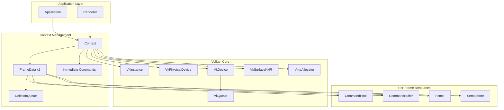

The Context and Device Management layer forms the foundation of Himalaya's Rendering Hardware Interface (RHI), responsible for initializing the Vulkan environment, managing the GPU device lifecycle, and providing the core infrastructure for all rendering operations. This layer abstracts the complexity of Vulkan instance creation, physical device selection, logical device initialization, and memory management through Vulkan Memory Allocator (VMA), enabling higher layers to focus on rendering logic rather than boilerplate Vulkan setup.

## Architecture Overview

The context management system follows a layered initialization pattern where each component builds upon the previously established foundation. The `Context` class serves as the central orchestrator, managing the entire Vulkan object hierarchy from instance through to per-frame synchronization primitives.

The initialization sequence follows a strict dependency order: instance creation establishes the Vulkan runtime; debug messenger registration enables validation layer output; surface creation connects to the windowing system; physical device selection identifies a suitable GPU; logical device creation establishes the command interface; VMA allocator initialization provides memory management; and finally, per-frame resources enable multi-buffered rendering.

Sources: [context.h](https://github.com/1PercentSync/himalaya/blob/main/rhi/include/himalaya/rhi/context.h#L112-L229), [context.cpp](https://github.com/1PercentSync/himalaya/blob/main/rhi/src/context.cpp#L49-L81)

## Instance and Validation Layer Setup

The Vulkan instance serves as the entry point to the graphics API, configured with application metadata and platform-specific surface extensions. The implementation targets Vulkan 1.4 API version and integrates with GLFW for cross-platform window surface creation.

Instance creation gathers required extensions through `glfwGetRequiredInstanceExtensions`, which provides platform-specific surface creation extensions (such as `VK_KHR_win32_surface` on Windows or `VK_KHR_xcb_surface` on Linux). In debug builds, the `VK_EXT_debug_utils` extension is appended to enable validation layer message callbacks. The Khronos validation layer provides comprehensive API usage checking, synchronization validation, and performance warnings.

The debug messenger routes validation messages through spdlog with severity-appropriate log levels. Error-level messages indicate API misuse that would likely cause undefined behavior; warnings highlight potentially incorrect usage patterns; info messages provide diagnostic information; and verbose messages trace internal loader and layer activity. The callback filters message types to validation and performance categories, excluding general lifecycle noise.

Sources: [context.cpp](https://github.com/1PercentSync/himalaya/blob/main/rhi/src/context.cpp#L109-L192)

## Physical Device Selection and Capability Detection

Physical device selection implements a scoring algorithm that balances feature support, performance characteristics, and hardware capabilities. The selection process filters devices through a series of mandatory requirements before applying preference scoring.

The mandatory requirements ensure functional compatibility: the device must expose a queue family supporting both graphics operations and presentation to the created surface; all required device extensions must be available; the Vulkan API version must be at least 1.4; required features including anisotropic filtering, depth bias clamping, BC texture compression, and descriptor indexing must be supported; and descriptor limits must accommodate the bindless texture system (4096 textures plus 16 cubemaps by default).

Devices satisfying all requirements receive a score calculated as: +10000 for ray tracing support (making RT-capable devices always preferred), +1000 for discrete GPU classification, plus one point per gigabyte of device-local VRAM. This scoring ensures that an RT-capable integrated GPU outranks a non-RT discrete GPU, reflecting the renderer's architectural emphasis on ray tracing features.

During selection, the system caches key device properties including the GPU name, maximum sampler anisotropy, supported MSAA sample counts (intersection of color and depth framebuffer capabilities), and ray tracing pipeline properties when available. The MSAA sample count bitmask enables runtime determination of the highest supported multisampling level.

Sources: [context.cpp](https://github.com/1PercentSync/himalaya/blob/main/rhi/src/context.cpp#L194-L425)

## Logical Device and Feature Configuration

Logical device creation translates the physical device capabilities into a functional command interface. The implementation requests a single graphics queue from the previously identified queue family, configured with maximum priority.

Feature configuration chains multiple `VkPhysicalDeviceFeatures` structures through pNext pointers to request capabilities across Vulkan versions. The feature set includes Vulkan 1.2 descriptor indexing features (`descriptorBindingPartiallyBound`, `descriptorBindingSampledImageUpdateAfterBind`, `runtimeDescriptorArray`, `shaderSampledImageArrayNonUniformIndexing`, `timelineSemaphore`); Vulkan 1.3 dynamic rendering and synchronization features (`dynamicRendering`, `synchronization2`, `shaderDemoteToHelperInvocation`); Vulkan 1.4 push descriptor support; and Vulkan 1.0 anisotropic filtering, depth bias clamping, BC compression, and extended storage image formats.

When ray tracing is supported, additional features are enabled: buffer device address and scalar block layout from Vulkan 1.2; 64-bit integer shader support from Vulkan 1.0; and acceleration structure, ray tracing pipeline, and ray query features from the KHR extensions. The extension list merges required extensions (`VK_KHR_swapchain`, `VK_EXT_memory_budget`) with optional RT extensions (`VK_KHR_acceleration_structure`, `VK_KHR_ray_tracing_pipeline`, `VK_KHR_ray_query`, `VK_KHR_deferred_host_operations`).

Sources: [context.cpp](https://github.com/1PercentSync/himalaya/blob/main/rhi/src/context.cpp#L427-L548)

## Memory Management with VMA

The Vulkan Memory Allocator (VMA) integration provides efficient GPU memory management with budget tracking and specialized allocation strategies. Allocator creation configures the `VMA_ALLOCATOR_CREATE_EXT_MEMORY_BUDGET_BIT` flag to enable runtime VRAM usage queries through `VK_EXT_memory_budget`. When ray tracing is active, the `VMA_ALLOCATOR_CREATE_BUFFER_DEVICE_ADDRESS_BIT` flag enables buffer device address functionality required for acceleration structure construction.

The memory budget extension allows the renderer to query current VRAM utilization and driver-reported budget across all device-local memory heaps. This information supports future memory pressure handling and resource streaming decisions. The `query_vram_usage` method aggregates usage and budget across device-local heaps, returning a snapshot suitable for display in debugging interfaces or automatic quality adjustment.

Sources: [context.cpp](https://github.com/1PercentSync/himalaya/blob/main/rhi/src/context.cpp#L550-L564), [context.cpp](https://github.com/1PercentSync/himalaya/blob/main/rhi/src/context.cpp#L678-L695)

## Per-Frame Resource Management

The renderer implements double-buffered frame resources through the `kMaxFramesInFlight` constant (set to 2), allowing the CPU to record commands for frame N+1 while the GPU executes frame N. Each in-flight frame owns an independent set of synchronization and command recording resources.

Each `FrameData` structure contains a command pool created with `VK_COMMAND_POOL_CREATE_RESET_COMMAND_BUFFER_BIT` for individual command buffer reset; a primary command buffer allocated from the pool; a fence created with `VK_FENCE_CREATE_SIGNALED_BIT` so the first frame's wait succeeds immediately; an image-available semaphore signaled when the swapchain image is ready; and a deletion queue for deferred resource destruction.

The deletion queue pattern addresses a fundamental Vulkan constraint: resources cannot be destroyed while potentially referenced by in-flight GPU commands. When resources are destroyed during frame recording, their actual Vulkan object destruction is deferred by pushing a lambda into the current frame's deletion queue. When the frame's fence signals completion, `flush()` executes all queued destructors, ensuring GPU safety.

Sources: [context.h](https://github.com/1PercentSync/himalaya/blob/main/rhi/include/himalaya/rhi/context.h#L64-L103), [context.cpp](https://github.com/1PercentSync/himalaya/blob/main/rhi/src/context.cpp#L566-L599)

## Immediate Command Execution

The immediate command system provides synchronous GPU operations for resource uploads and initialization tasks that must complete before subsequent rendering. Unlike per-frame command buffers that are submitted asynchronously, immediate commands block until GPU completion, ensuring data availability.

The immediate command pool is created with `VK_COMMAND_POOL_CREATE_TRANSIENT_BIT` and `VK_COMMAND_POOL_CREATE_RESET_COMMAND_BUFFER_BIT` flags, indicating short-lived command buffers that will be reset after each use. The `begin_immediate` method resets and begins the command buffer with `VK_COMMAND_BUFFER_USAGE_ONE_TIME_SUBMIT_BIT`; upload methods record copy commands into this buffer; and `end_immediate` submits to the graphics queue, waits with `vkQueueWaitIdle`, and destroys any staging buffers allocated during the scope.

Staging buffers created during immediate operations are tracked in a pending list and automatically cleaned up at scope end. This pattern ensures that temporary CPU-to-GPU transfer buffers do not leak while avoiding complex lifetime management for upload callers.

Sources: [context.h](https://github.com/1PercentSync/himalaya/blob/main/rhi/include/himalaya/rhi/context.h#L236-L260), [context.cpp](https://github.com/1PercentSync/himalaya/blob/main/rhi/src/context.cpp#L601-L664)

## Ray Tracing Extension Function Loading

Ray tracing functionality requires dynamic loading of extension function pointers through `vkGetDeviceProcAddr`, as these symbols are not exported by the standard Vulkan loader library. The context loads function pointers conditionally when `rt_supported` is true during initialization.

The loaded functions cover the complete acceleration structure lifecycle: `vkCreateAccelerationStructureKHR` and `vkDestroyAccelerationStructureKHR` for object management; `vkGetAccelerationStructureBuildSizesKHR` for scratch memory sizing; `vkCmdBuildAccelerationStructuresKHR` for GPU-side construction; and `vkGetAccelerationStructureDeviceAddressKHR` for shader access. For ray tracing pipelines, the system loads `vkCreateRayTracingPipelinesKHR` for pipeline creation and `vkGetRayTracingShaderGroupHandlesKHR` for shader binding table construction.

These function pointers are stored as member variables and passed to the `CommandBuffer` class through `init_rt_functions`, enabling RT command recording throughout the RHI layer.

Sources: [context.cpp](https://github.com/1PercentSync/himalaya/blob/main/rhi/src/context.cpp#L62-L80), [context.h](https://github.com/1PercentSync/himalaya/blob/main/rhi/include/himalaya/rhi/context.h#L166-L188)

## Swapchain Management

The `Swapchain` class manages the presentation surface and its associated images, handling creation, recreation on resize, and destruction. The swapchain abstracts platform-specific surface details while providing configurable presentation modes and surface formats.

Swapchain creation queries surface capabilities to determine supported formats, present modes, and extent constraints. The implementation prefers `B8G8R8A8_SRGB` format with `SRGB_NONLINEAR` color space for standard dynamic range output. For presentation mode, the vsync preference determines selection: when enabled, `FIFO` mode provides vertical blank synchronization; when disabled, `MAILBOX` mode offers triple-buffered low-latency presentation without tearing, falling back to `FIFO` if unavailable.

The swapchain requests one more image than the surface minimum to ensure triple-buffering headroom when supported, clamped to any maximum image count limit. Image views are created for each swapchain image with `VK_IMAGE_ASPECT_COLOR_BIT`. Per-image render-finished semaphores are allocated rather than per-frame semaphores, as the presentation engine may hold semaphores longer than the frame interval when using `MAILBOX` mode with three images but only two frames in flight.

Resize handling recreates the swapchain through a careful sequence: wait for queue idle to ensure no pending operations reference the old swapchain; destroy image views and semaphores; preserve the old swapchain handle for driver resource recycling; create new resources with the old handle passed to `VkSwapchainCreateInfoKHR`; and finally destroy the old swapchain. This recycling allows the driver to reuse internal allocations and minimize stutter during resize operations.

Sources: [swapchain.h](https://github.com/1PercentSync/himalaya/blob/main/rhi/include/himalaya/rhi/swapchain.h#L1-L125), [swapchain.cpp](https://github.com/1PercentSync/himalaya/blob/main/rhi/src/swapchain.cpp#L1-L211)

## Integration with Higher Layers

The context initialization is invoked from `Application::init` after GLFW window creation and before all other RHI subsystem initialization. The sequence establishes the rendering foundation: window creation with `GLFW_NO_API` hint for Vulkan compatibility; context initialization with the window handle; command buffer debug function initialization; swapchain creation; and subsequent initialization of resource managers, descriptor systems, and the renderer.

The context's lifetime spans the entire application execution, with `destroy()` called during application teardown. The destruction sequence reverses creation order: immediate command pool; per-frame resources (command pools, fences, semaphores); VMA allocator; logical device; surface; debug messenger (debug builds only); and finally the Vulkan instance.

Sources: [application.cpp](https://github.com/1PercentSync/himalaya/blob/main/app/src/application.cpp#L39-L70), [context.cpp](https://github.com/1PercentSync/himalaya/blob/main/rhi/src/context.cpp#L83-L107)

## Related Documentation

For understanding how the context integrates with resource management, see [Resource Management (Buffers, Images, Samplers)](https://github.com/1PercentSync/himalaya/blob/main/8-resource-management-buffers-images-samplers). The command buffer and synchronization mechanisms are detailed in [Command Buffer and Synchronization](https://github.com/1PercentSync/himalaya/blob/main/10-command-buffer-and-synchronization). For the ray tracing infrastructure built upon the context's RT function pointers, refer to [Ray Tracing Infrastructure (AS, RT Pipeline)](https://github.com/1PercentSync/himalaya/blob/main/11-ray-tracing-infrastructure-as-rt-pipeline).