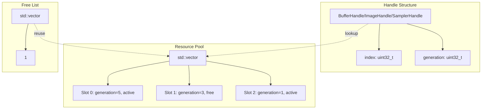

The Resource Management layer provides a unified abstraction over Vulkan's memory and resource allocation mechanisms, offering generation-based handle safety, automatic memory management through VMA (Vulkan Memory Allocator), and streamlined upload operations. This system sits at the foundation of the RHI (Rendering Hardware Interface) layer, enabling higher-level components to allocate and manipulate GPU resources without directly managing Vulkan object lifetimes or memory heaps.

The design philosophy centers on three core principles: **safety through generational handles** that detect use-after-free errors at runtime, **simplicity through descriptive structures** that abstract Vulkan's verbose create-info patterns, and **efficiency through VMA integration** that handles memory pool management and allocation strategies automatically. All resource operations require debug names for validation layer visibility and RenderDoc capture readability.

Sources: [resources.h](https://github.com/1PercentSync/himalaya/blob/main/rhi/include/himalaya/rhi/resources.h#L1-L31), [types.h](https://github.com/1PercentSync/himalaya/blob/main/rhi/include/himalaya/rhi/types.h#L14-L60)

## Resource Handle Architecture

The resource system uses lightweight handles rather than raw pointers or direct Vulkan handles to enable safe resource lifetime management. Each handle combines a slot index with a generation counter — when a resource is destroyed, its slot's generation increments, invalidating all existing handles to that slot. This pattern catches use-after-free bugs through assertion failures rather than silent corruption or GPU crashes.

The handle system provides three concrete types: `BufferHandle` for GPU buffers, `ImageHandle` for textures and render targets, and `SamplerHandle` for texture sampling state. All handles expose a `valid()` method that checks whether the index has been assigned (not `UINT32_MAX`). The `BindlessIndex` type represents an index into the global bindless texture array used by shaders, decoupling texture references from the resource handle system.

Sources: [types.h](https://github.com/1PercentSync/himalaya/blob/main/rhi/include/himalaya/rhi/types.h#L23-L73), [resources.h](https://github.com/1PercentSync/himalaya/blob/main/rhi/include/himalaya/rhi/resources.h#L196-L251)

## Memory Usage Strategies

The RHI abstracts Vulkan's complex memory heap architecture into three intuitive strategies through the `MemoryUsage` enum. Each strategy maps to specific VMA allocation flags that control CPU visibility, caching behavior, and allocation placement.

| MemoryUsage | VMA Flags | Use Case |
|-------------|-----------|----------|
| `GpuOnly` | None (VMA auto-selects) | Static geometry, textures, render targets — device-local VRAM with no CPU access |
| `CpuToGpu` | `HOST_ACCESS_SEQUENTIAL_WRITE`, `MAPPED` | Dynamic uniform buffers, staging uploads — write-combined CPU-visible memory |
| `GpuToCpu` | `HOST_ACCESS_RANDOM`, `MAPPED` | Screenshot readback, GPU query results — cached CPU-readable memory |

The `GpuOnly` strategy relies on VMA's `VMA_MEMORY_USAGE_AUTO` to select the optimal heap based on the resource's usage flags and the driver's dedicated allocation requirements. For images, the system always uses `VMA_ALLOCATION_CREATE_DEDICATED_MEMORY_BIT` to ensure optimal tiling and compression support, particularly important for render targets and compressed textures.

Sources: [types.h](https://github.com/1PercentSync/himalaya/blob/main/rhi/include/himalaya/rhi/types.h#L138-L147), [resources.cpp](https://github.com/1PercentSync/himalaya/blob/main/rhi/src/resources.cpp#L124-L143), [resources.cpp](https://github.com/1PercentSync/himalaya/blob/main/rhi/src/resources.cpp#L284-L288)

## Buffer Management

Buffers serve as the workhorse memory resources for geometry, uniforms, and shader storage. The `BufferUsage` flags define how the buffer will be accessed by the pipeline, enabling the driver to place the resource in the appropriate heap and cache hierarchy.

### Buffer Usage Flags

| Flag | Vulkan Equivalent | Typical Usage |
|------|-------------------|---------------|
| `VertexBuffer` | `VERTEX_BUFFER_BIT` | Mesh vertex attributes |
| `IndexBuffer` | `INDEX_BUFFER_BIT` | Mesh index data |
| `UniformBuffer` | `UNIFORM_BUFFER_BIT` | Per-frame constants, camera matrices |
| `StorageBuffer` | `STORAGE_BUFFER_BIT` | SSBOs, bindless resource lists |
| `TransferSrc` | `TRANSFER_SRC_BIT` | Source for copy operations |
| `TransferDst` | `TRANSFER_DST_BIT` | Destination for upload operations |
| `ShaderDeviceAddress` | `SHADER_DEVICE_ADDRESS_BIT` | GPU virtual addresses for ray tracing |
| `AccelStructBuildInput` | `ACCELERATION_STRUCTURE_BUILD_INPUT_BIT_KHR` | BLAS/TLAS geometry data |

Buffer creation requires a `BufferDesc` specifying size, usage flags, and memory strategy. The resulting handle can be resolved to a `Buffer` structure containing the Vulkan handle, VMA allocation, and allocation info (which includes the mapped pointer for CPU-visible buffers). The `get_buffer_device_address()` method returns a `VkDeviceAddress` for buffers created with `ShaderDeviceAddress` usage, essential for ray tracing shader binding tables and device-address-based descriptors.

Sources: [resources.h](https://github.com/1PercentSync/himalaya/blob/main/rhi/include/himalaya/rhi/resources.h#L22-L51), [resources.cpp](https://github.com/1PercentSync/himalaya/blob/main/rhi/src/resources.cpp#L188-L252)

## Image Management

Images represent textured data and render targets with complex layout and view requirements. The `ImageDesc` structure captures all parameters needed for creation: dimensions, mip levels, array layers, sample count, format, and usage flags. The system automatically creates a default image view covering all mip levels and array layers, with view type selection based on layer count (2D for single layer, 2D array for multiple layers, cube for 6 layers with `CUBE_COMPATIBLE` flag).

### Image Usage Flags

| Flag | Vulkan Equivalent | Typical Usage |
|------|-------------------|---------------|
| `Sampled` | `SAMPLED_BIT` | Texture sampling in shaders |
| `Storage` | `STORAGE_BIT` | Compute shader read/write |
| `ColorAttachment` | `COLOR_ATTACHMENT_BIT` | Render target for color output |
| `DepthAttachment` | `DEPTH_STENCIL_ATTACHMENT_BIT` | Depth/stencil buffer |
| `TransferSrc` | `TRANSFER_SRC_BIT` | Source for blit and copy |
| `TransferDst` | `TRANSFER_DST_BIT` | Destination for upload and blit |

The system supports 2D images, 2D arrays, and cubemaps through the `array_layers` parameter. Depth/stencil formats automatically receive the correct `VkImageAspectFlags` through the `aspect_from_format()` utility. All images use `VK_IMAGE_TILING_OPTIMAL` for GPU-efficient storage and `VK_SHARING_MODE_EXCLUSIVE` for single-queue-family access.

Sources: [resources.h](https://github.com/1PercentSync/himalaya/blob/main/rhi/include/himalaya/rhi/resources.h#L54-L81), [resources.cpp](https://github.com/1PercentSync/himalaya/blob/main/rhi/src/resources.cpp#L254-L324), [types.h](https://github.com/1PercentSync/himalaya/blob/main/rhi/include/himalaya/rhi/types.h#L220-L228)

### External Image Registration

For resources not owned by the RHI — primarily swapchain images — the system provides `register_external_image()` and `unregister_external_image()`. These methods allocate a slot in the image pool and populate it with externally-created Vulkan handles without taking ownership of the underlying memory. External slots are identified by a null VMA allocation pointer, and the destruction path skips VMA deallocation while still invalidating handles through generation increment.

Sources: [resources.h](https://github.com/1PercentSync/himalaya/blob/main/rhi/include/himalaya/rhi/resources.h#L337-L358), [resources.cpp](https://github.com/1PercentSync/himalaya/blob/main/rhi/src/resources.cpp#L356-L382)

## Sampler Management

Samplers encapsulate texture filtering and addressing state, decoupling sampling parameters from image data. The `SamplerDesc` structure provides comprehensive control over filtering modes, wrapping behavior, anisotropy, and depth comparison for shadow mapping.

| Parameter | Description |
|-----------|-------------|
| `mag_filter` / `min_filter` | `Nearest` or `Linear` magnification/minification |
| `mip_mode` | `Nearest` or `Linear` mipmap interpolation |
| `wrap_u` / `wrap_v` | `Repeat`, `ClampToEdge`, or `MirroredRepeat` addressing |
| `max_anisotropy` | Anisotropic filtering level (0 = disabled) |
| `max_lod` | Maximum accessible mip level (`VK_LOD_CLAMP_NONE` for unlimited) |
| `compare_enable` / `compare_op` | Depth comparison for PCF shadow sampling |

The `max_sampler_anisotropy()` query returns the device limit for anisotropic filtering, allowing upper layers to clamp user requests to hardware capabilities. Samplers are lightweight state objects that can be shared across multiple images with compatible sampling requirements.

Sources: [resources.h](https://github.com/1PercentSync/himalaya/blob/main/rhi/include/himalaya/rhi/resources.h#L83-L186), [resources.cpp](https://github.com/1PercentSync/himalaya/blob/main/rhi/src/resources.cpp#L384-L444)

## Data Upload System

The ResourceManager provides integrated upload operations that handle staging buffer creation, command recording, and cleanup automatically. All upload methods require an active immediate command scope (between `Context::begin_immediate()` and `Context::end_immediate()`), which provides the command buffer for recording and manages staging buffer lifetime through deferred deletion.

### Buffer Upload

`upload_buffer()` creates a CPU-visible staging buffer, copies data into it, and records a `vkCmdCopyBuffer` command. The staging buffer is registered with the context for destruction after the immediate command buffer completes execution. This method supports partial updates through the `offset` parameter, enabling dynamic uniform updates and sub-resource uploads.

Sources: [resources.h](https://github.com/1PercentSync/himalaya/blob/main/rhi/include/himalaya/rhi/resources.h#L410-L423), [resources.cpp](https://github.com/1PercentSync/himalaya/blob/main/rhi/src/resources.cpp#L481-L536)

### Image Upload

`upload_image()` handles the complete pipeline for texture initialization: staging buffer creation, layout transition from `UNDEFINED` to `TRANSFER_DST_OPTIMAL`, buffer-to-image copy for mip level 0, and final transition to `SHADER_READ_ONLY_OPTIMAL`. The `dst_stage` parameter specifies which pipeline stage will first consume the image, ensuring proper synchronization without global barriers.

`upload_image_all_levels()` extends this to pre-built mip chains, accepting a span of `MipUploadRegion` descriptors that define each level's offset and dimensions within the source data. This layout matches KTX2 file organization, enabling direct upload of compressed texture files.

Sources: [resources.h](https://github.com/1PercentSync/himalaya/blob/main/rhi/include/himalaya/rhi/resources.h#L425-L468), [resources.cpp](https://github.com/1PercentSync/himalaya/blob/main/rhi/src/resources.cpp#L538-L747)

### Mipmap Generation

`generate_mips()` creates the full mip chain from a populated level 0 using `vkCmdBlitImage` with linear filtering. The algorithm performs a series of layout transitions and blit commands: level 0 transitions from `SHADER_READ_ONLY` to `TRANSFER_SRC`, each subsequent level blits from the previous level while transitioning through `TRANSFER_DST`, and a final barrier transitions all levels to `SHADER_READ_ONLY`. This method requires the image to have `TransferSrc` and `TransferDst` usage flags and more than one mip level.

Sources: [resources.h](https://github.com/1PercentSync/himalaya/blob/main/rhi/include/himalaya/rhi/resources.h#L470-L480), [resources.cpp](https://github.com/1PercentSync/himalaya/blob/main/rhi/src/resources.cpp#L749-L847)

## Sub-Resource Views

Array images support per-layer view creation through `create_layer_view()`, which generates a 2D view targeting a specific array layer. This capability enables rendering to individual shadow map cascades or cubemap faces without creating separate image objects. Layer views are owned by the caller and must be destroyed via `destroy_layer_view()` before the parent image is destroyed.

Sources: [resources.h](https://github.com/1PercentSync/himalaya/blob/main/rhi/include/himalaya/rhi/resources.h#L386-L406), [resources.cpp](https://github.com/1PercentSync/himalaya/blob/main/rhi/src/resources.cpp#L446-L479)

## Format System

The RHI defines a curated `Format` enum covering the essential pixel formats for real-time rendering, with utilities for conversion and property queries.

### Format Categories

| Category | Formats |
|----------|---------|
| 8-bit UNORM | `R8Unorm`, `R8G8Unorm`, `R8G8B8A8Unorm`, `B8G8R8A8Unorm` |
| 8-bit sRGB | `R8G8B8A8Srgb`, `B8G8R8A8Srgb` |
| 16-bit HDR | `R16Sfloat`, `R16G16Sfloat`, `R16G16B16A16Sfloat` |
| 32-bit HDR | `R32Sfloat`, `R32G32Sfloat`, `R32G32B32A32Sfloat` |
| Packed | `A2B10G10R10UnormPack32`, `B10G11R11UfloatPack32` |
| Block Compressed | `Bc5UnormBlock`, `Bc6hUfloatBlock`, `Bc7UnormBlock`, `Bc7SrgbBlock` |
| Depth/Stencil | `D32Sfloat`, `D24UnormS8Uint` |

The `to_vk_format()` and `from_vk_format()` functions provide bidirectional mapping to Vulkan formats. `format_bytes_per_block()` and `format_block_extent()` enable size calculations for texture uploads and memory budgeting, with special handling for 4x4 block-compressed formats.

Sources: [types.h](https://github.com/1PercentSync/himalaya/blob/main/rhi/include/himalaya/rhi/types.h#L94-L131), [types.h](https://github.com/1PercentSync/himalaya/blob/main/rhi/include/himalaya/rhi/types.h#L186-L343)

## Resource Pool Mechanics

The `ResourceManager` maintains three separate pools for buffers, images, and samplers. Each pool is a `std::vector` of slot structures paired with a free list of indices available for reuse. Slot allocation prioritizes reuse: if the free list contains entries, the most recently freed slot is recycled; otherwise, a new slot is appended to the vector. This strategy maintains cache-friendly dense storage while minimizing allocations during steady-state operation.

Destruction increments the slot's generation counter and pushes the index to the free list. Subsequent handle lookups validate the generation matches, catching stale handle usage. The `destroy()` method iterates all pools, reporting any resources that were not explicitly freed before shutdown — a diagnostic aid for detecting resource leaks.

Sources: [resources.h](https://github.com/1PercentSync/himalaya/blob/main/rhi/include/himalaya/rhi/resources.h#L482-L529), [resources.cpp](https://github.com/1PercentSync/himalaya/blob/main/rhi/src/resources.cpp#L74-L105), [resources.cpp](https://github.com/1PercentSync/himalaya/blob/main/rhi/src/resources.cpp#L15-L72)

## Integration with Upper Layers

The ResourceManager is typically accessed through the `Context` or passed directly to subsystem initialization methods. Framework-level components like `IBL`, `Denoiser`, and `Texture` use the resource manager to allocate their GPU backing stores, while the Render Graph manages transient resource lifetime through the same handle system.

For usage patterns in higher-level systems, see [IBL and Texture Processing](https://github.com/1PercentSync/himalaya/blob/main/17-ibl-and-texture-processing) for image upload and mipmap generation, [Material System and PBR](https://github.com/1PercentSync/himalaya/blob/main/13-material-system-and-pbr) for texture and sampler creation, and [Render Graph System](https://github.com/1PercentSync/himalaya/blob/main/12-render-graph-system) for resource lifetime management in frame graphs.