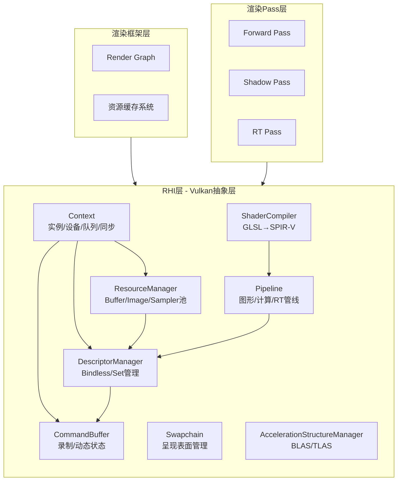

RHI（Rendering Hardware Interface）层是Himalaya渲染引擎与Vulkan GPU API之间的桥梁，它封装了所有直接的Vulkan调用，为上层框架提供一个类型安全、资源管理友好的接口。本层的设计理念是在**完全抽象Vulkan复杂性**与**保留必要底层控制能力**之间取得平衡，使上层渲染代码专注于算法实现而非API细节。

RHI层向上层暴露三类核心抽象：**资源句柄**（轻量化的引用标识符）、**描述符集合**（预定义绑定模型）以及**动态状态管线**（最小化管线状态对象重建）。这三类抽象共同支撑了整个渲染系统的无绑定（Bindless）设计哲学。深入理解RHI层的架构，对于编写高效的渲染Pass至关重要，推荐在继续学习[渲染Pass层](https://github.com/1PercentSync/himalaya/blob/main/10-xuan-ran-passceng-xiao-guo-shi-xian)之前仔细阅读本文档。

Sources: [types.h](https://github.com/1PercentSync/himalaya/blob/main/rhi/include/himalaya/rhi/types.h#L1-L20), [resources.h](https://github.com/1PercentSync/himalaya/blob/main/rhi/include/himalaya/rhi/resources.h#L1-L20), [descriptors.h](https://github.com/1PercentSync/himalaya/blob/main/rhi/include/himalaya/rhi/descriptors.h#L1-L25)

## 架构概览

RHI层采用模块化设计，由七个核心组件构成，每个组件负责特定领域的Vulkan抽象：



**Context** 是整个RHI层的根对象，持有Vulkan实例、逻辑设备、队列族索引、内存分配器以及每帧的同步对象（Fence/Semaphore）。它同时负责光线追踪扩展的函数指针加载，这是Vulkan RT扩展的特性要求——这些函数无法通过标准vulkan-1.lib静态链接获得，必须通过 `vkGetDeviceProcAddr` 在运行时动态加载。

**ResourceManager** 实现了基于生成计数器（Generation Counter）的资源句柄系统。每个Buffer、Image、Sampler都从固定大小的池中分配，句柄由池索引和生成计数器组成。当资源被销毁时，对应池槽的生成计数器递增，从而使所有现存句柄失效。这种设计以极低的运行时开销（一次整数比较）实现了Use-After-Free检测。

**DescriptorManager** 实现了三层描述符集架构：Set 0（每帧全局数据，如GlobalUBO、LightBuffer）、Set 1（Bindless纹理数组，4096个2D纹理槽位+256个Cubemap槽位）、Set 2（渲染目标中间结果，8个绑定位点）。这种分层设计最大化了描述符复用效率——Set 1在帧间共享，Set 0和Set 2则每帧独立。

Sources: [context.h](https://github.com/1PercentSync/himalaya/blob/main/rhi/include/himalaya/rhi/context.h#L1-L50), [resources.h](https://github.com/1PercentSync/himalaya/blob/main/rhi/include/himalaya/rhi/resources.h#L285-L320), [descriptors.h](https://github.com/1PercentSync/himalaya/blob/main/rhi/include/himalaya/rhi/descriptors.h#L25-L55)

## 类型系统与资源句柄

RHI层定义了一套完整的类型系统，将Vulkan底层枚举和结构体封装为引擎专用的C++类型。这种封装有两个核心目标：**编译期类型安全**（避免VkBuffer与VkImage的混淆）和**平台可移植性**（上层代码不直接依赖Vulkan头文件）。

### 资源句柄设计

所有GPU资源都通过句柄引用，而非直接使用Vulkan句柄：

| 句柄类型 | 组成 | 用途 |
|---------|------|------|
| `BufferHandle` | index + generation | 顶点/索引/Uniform/Storage缓冲 |
| `ImageHandle` | index + generation | 纹理、渲染目标、深度缓冲 |
| `SamplerHandle` | index + generation | 采样器状态对象 |
| `BindlessIndex` | index only | Bindless数组中的纹理索引 |

句柄的生成计数器机制实现了低开销的资源生命周期追踪。当调用 `destroy_buffer()` 时，对应池槽的生成计数器递增，所有持有旧生成值的句柄在后续访问时都会被检测为无效。这种设计无需复杂的引用计数或垃圾回收，仅需在句柄解析时比较一个 `uint32_t` 字段。

```cpp
// 生成计数器检测示例（伪代码）
const Buffer& get_buffer(BufferHandle handle) const {
    assert(handle.index < buffers_.size());
    const Buffer& buf = buffers_[handle.index];
    assert(buf.generation == handle.generation && "Use-after-free detected!");
    return buf;
}
```

Sources: [types.h](https://github.com/1PercentSync/himalaya/blob/main/rhi/include/himalaya/rhi/types.h#L20-L50), [resources.h](https://github.com/1PercentSync/himalaya/blob/main/rhi/include/himalaya/rhi/resources.h#L195-L215)

### 格式与枚举映射

RHI定义了独立的 `Format` 枚举，涵盖渲染器所需的全部像素格式，从基础的 `R8G8B8A8Unorm` 到块压缩格式 `Bc6hUfloatBlock`、`Bc7UnormBlock`，以及深度格式 `D32Sfloat`。这些枚举通过 `to_vk_format()` 和 `from_vk_format()` 函数与 `VkFormat` 双向映射。

同样，`CompareOp`、`MemoryUsage`、`ShaderStage` 等枚举都提供了到Vulkan类型的转换函数。这种设计允许未来扩展至其他图形API（如DirectX 12或Metal），上层代码只需使用RHI类型，底层的API特定转换在RHI层内部完成。

Sources: [types.h](https://github.com/1PercentSync/himalaya/blob/main/rhi/include/himalaya/rhi/types.h#L70-L120), [types.h](https://github.com/1PercentSync/himalaya/blob/main/rhi/include/himalaya/rhi/types.h#L200-L280)

## 资源管理

### 缓冲与图像创建

ResourceManager提供了统一的资源创建接口，通过描述符结构体传递创建参数：

```cpp
// 创建GPU-only顶点缓冲区
BufferDesc vb_desc{
    .size = vertex_data_size,
    .usage = BufferUsage::VertexBuffer,
    .memory = MemoryUsage::GpuOnly
};
BufferHandle vb = resource_manager.create_buffer(vb_desc, "mesh_vertex_buffer");

// 创建HDR颜色附件
ImageDesc hdr_desc{
    .width = 1920,
    .height = 1080,
    .depth = 1,
    .mip_levels = 1,
    .array_layers = 1,
    .sample_count = 1,
    .format = Format::R16G16B16A16Sfloat,
    .usage = ImageUsage::ColorAttachment | ImageUsage::Sampled
};
ImageHandle hdr_target = resource_manager.create_image(hdr_desc, "hdr_color_target");
```

`MemoryUsage` 枚举决定了内存分配策略：`GpuOnly` 使用设备本地VRAM（最快，CPU不可访问）；`CpuToGpu` 创建主机可见的连贯内存（适合每帧更新的Uniform Buffer）；`GpuToCpu` 用于回读操作（如截图）。

Sources: [resources.h](https://github.com/1PercentSync/himalaya/blob/main/rhi/include/himalaya/rhi/resources.h#L130-L160), [resources.h](https://github.com/1PercentSync/himalaya/blob/main/rhi/include/himalaya/rhi/resources.h#L215-L265)

### VMA集成与内存优化

RHI层集成 **Vulkan Memory Allocator (VMA)** 处理实际的内存分配。VMA实现了先进的内存子分配策略，能够合并相邻空闲块、按需分配大内存池、自动处理内存类型选择。RHI层将VMA的 `VmaAllocation` 与Vulkan对象（`VkBuffer`、`VkImage`）绑定存储，在资源销毁时自动释放内存。

对于加速结构这类特殊资源，RHI同样使用VMA分配 `ACCELERATION_STRUCTURE_STORAGE_BIT_KHR` 用途的缓冲区，确保满足Vulkan对加速结构的内存对齐要求。

Sources: [resources.h](https://github.com/1PercentSync/himalaya/blob/main/rhi/include/himalaya/rhi/resources.h#L175-L195), [acceleration_structure.h](https://github.com/1PercentSync/himalaya/blob/main/rhi/include/himalaya/rhi/acceleration_structure.h#L15-L40)

### 延迟销毁机制

GPU资源无法立即销毁——GPU可能仍在执行引用该资源的渲染命令。RHI通过 `DeletionQueue` 实现延迟销毁模式：销毁请求被封装为lambda推入队列，直到对应帧的Fence信号后才实际执行销毁。这确保了GPU不再访问资源时，CPU才释放内存。

```cpp
// 延迟销毁示例（内部实现）
void destroy_buffer(BufferHandle handle) {
    const Buffer& buf = get_buffer(handle);
    // 推入当前帧的删除队列，而非立即销毁
    frame_data.deletion_queue.push([this, buf]() {
        vmaDestroyBuffer(allocator, buf.buffer, buf.allocation);
    });
}
```

Sources: [context.h](https://github.com/1PercentSync/himalaya/blob/main/rhi/include/himalaya/rhi/context.h#L50-L75)

## 描述符管理

### 三层描述符集架构

Himalaya采用固定布局的描述符集系统，简化着色器编写并最大化运行时性能：

| 描述符集 | 用途 | 更新频率 | 特殊标志 |
|---------|------|---------|---------|
| Set 0 | 全局数据（GlobalUBO、LightBuffer、MaterialBuffer） | 每帧 | 可变描述符数（RT扩展） |
| Set 1 | Bindless纹理数组（2D + Cubemap） | 初始化/加载时 | UPDATE_AFTER_BIND |
| Set 2 | 渲染目标中间结果 | 每帧/调整大小时 | PARTIALLY_BOUND |

Set 0 在帧间独立分配（2个in-flight帧对应2个Set），存储需要每帧更新的Uniform Buffer。当光线追踪启用时，Set 0扩展两个额外绑定：TLAS（Binding 4）和GeometryInfoBuffer（Binding 5）。

Set 1 是引擎Bindless架构的核心。它在所有帧间共享单一描述符集，包含4096个2D纹理槽位和256个Cubemap槽位。通过 `UPDATE_AFTER_BIND` 标志，纹理可以在GPU使用描述符集的同时被更新——这意味着新加载的纹理无需等待GPU空闲即可注册到Bindless数组。着色器通过 `texture2D textures[]` 和 `samplerCube cubemaps[]` 数组访问这些资源，数组索引即为 `BindlessIndex`。

Sources: [descriptors.h](https://github.com/1PercentSync/himalaya/blob/main/rhi/include/himalaya/rhi/descriptors.h#L25-L55), [descriptors.h](https://github.com/1PercentSync/himalaya/blob/main/rhi/include/himalaya/rhi/descriptors.h#L60-L90)

### Push Descriptor与计算着色器

对于无法提前分配描述符集的计算Pass（如每帧变化的临时纹理），RHI支持Vulkan 1.4核心的 **Push Descriptor** 特性。`CommandBuffer::push_compute_descriptor_set()` 允许直接在命令录制时推送描述符更新，无需预先创建描述符集对象。这降低了描述符管理复杂度，特别适用于动态计算Pass。

```cpp
// Push Descriptor示例（计算Pass）
VkWriteDescriptorSet write{};
write.sType = VK_STRUCTURE_TYPE_WRITE_DESCRIPTOR_SET;
write.dstBinding = 0;
write.descriptorType = VK_DESCRIPTOR_TYPE_STORAGE_IMAGE;
write.pImageInfo = &image_info;

cmd.push_compute_descriptor_set(pipeline.layout, 3, {&write, 1});
cmd.dispatch(group_count_x, group_count_y, 1);
```

Sources: [commands.h](https://github.com/1PercentSync/himalaya/blob/main/rhi/include/himalaya/rhi/commands.h#L140-L160)

## 管线系统

### 动态渲染与扩展动态状态

RHI层采用Vulkan 1.3+的 **Dynamic Rendering** 特性，无需创建传统的 `VkRenderPass` 和 `VkFramebuffer` 对象。管线创建时仅需指定颜色附件格式和深度附件格式（通过 `GraphicsPipelineDesc`），实际的渲染目标和加载/存储操作在命令录制时通过 `VkRenderingInfo` 结构体指定。

配合 **Extended Dynamic State**，RHI实现了**完全动态的状态管理**。视口、裁剪矩形、剔除模式、深度测试/写入/比较操作、深度偏移等状态都不再烘焙进管线，而是可以在命令缓冲级别动态修改。这大幅减少了管线状态对象（PSO）的数量——传统架构中每种状态组合都需要独立的PSO，而Himalaya仅需为着色器组合创建管线。

```cpp
// 动态状态设置（无需重新创建管线）
cmd.set_viewport(viewport);
cmd.set_scissor(scissor);
cmd.set_cull_mode(VK_CULL_MODE_BACK_BIT);
cmd.set_depth_test_enable(true);
cmd.set_depth_compare_op(VK_COMPARE_OP_LESS);
cmd.set_depth_bias(constant_factor, 0.0f, slope_factor);
```

Sources: [pipeline.h](https://github.com/1PercentSync/himalaya/blob/main/rhi/include/himalaya/rhi/pipeline.h#L15-L55), [commands.h](https://github.com/1PercentSync/himalaya/blob/main/rhi/include/himalaya/rhi/commands.h#L280-L320)

### 计算与光线追踪管线

计算管线创建相对简单，仅需指定计算着色器模块和描述符集布局。光线追踪管线则复杂得多——它需要管理Shader Binding Table (SBT)，这是RT渲染特有的数据结构，存储着色器组句柄（Shader Group Handle）供GPU调度。

`RTPipeline` 结构体封装了完整的RT管线状态，包括四个SBT区域：RayGen（光线生成）、Miss（未命中）、Hit（命中，包含Closest-Hit和可选Any-Hit）、Callable（可调用，Himalaya未使用）。`create_rt_pipeline()` 函数自动计算SBT布局，考虑 `shaderGroupBaseAlignment` 和 `shaderGroupHandleAlignment` 等硬件特定对齐要求，将着色器句柄写入对齐的GPU缓冲区。

Sources: [rt_pipeline.h](https://github.com/1PercentSync/himalaya/blob/main/rhi/include/himalaya/rhi/rt_pipeline.h#L20-L60), [rt_pipeline.h](https://github.com/1PercentSync/himalaya/blob/main/rhi/include/himalaya/rhi/rt_pipeline.h#L65-L110)

## 交换链与呈现

`Swapchain` 类封装了Vulkan交换链的全部生命周期管理，包括创建、重建（窗口大小变化时）和销毁。它实现了智能的呈现模式选择：**VSync关闭**时优先选择 `MAILBOX`（三重缓冲、无撕裂、低延迟），**VSync开启**时选择 `FIFO`（标准垂直同步）。

交换链管理的复杂性在于 **多图像与多帧的解耦**。Vulkan交换链可能拥有2-4个图像，而Himalaya配置2帧in-flight。这意味着交换链图像数量可能超过帧索引数量，因此渲染完成信号量必须按**图像索引**而非**帧索引**分配——每个交换链图像拥有独立的 `render_finished_semaphore`，确保呈现引擎持有正确的同步对象直到图像实际显示。

Sources: [swapchain.h](https://github.com/1PercentSync/himalaya/blob/main/rhi/include/himalaya/rhi/swapchain.h#L25-L65), [swapchain.h](https://github.com/1PercentSync/himalaya/blob/main/rhi/include/himalaya/rhi/swapchain.h#L85-L95)

## 加速结构与光线追踪

### BLAS/TLAS管理

`AccelerationStructureManager` 实现了完整的Vulkan光线追踪加速结构生命周期管理。它支持两种构建模式：**批量BLAS构建**（多几何体并行构建）和**TLAS实例化**（场景级加速结构）。

BLAS构建采用**单一大Scratch缓冲策略**：计算所有BLAS的Scratch需求总和（每个对齐到 `minAccelerationStructureScratchOffsetAlignment`），分配一个足够大的缓冲供所有BLAS并行构建。这最大化了GPU利用率，避免了多次小缓冲分配的开销。

几何体格式固定为：顶点位置 `R32G32B32_SFLOAT`（stride = `sizeof(Vertex)`）、索引类型 `UINT32`。每个几何体可以标记为 `opaque`——不透明几何体设置 `VK_GEOMETRY_OPAQUE_BIT_KHR`，允许硬件跳过Any-Hit着色器调用；透明/镂空几何体设置 `VK_GEOMETRY_NO_DUPLICATE_ANY_HIT_INVOCATION_BIT_KHR`，确保Any-Hit每图元至多调用一次。

Sources: [acceleration_structure.h](https://github.com/1PercentSync/himalaya/blob/main/rhi/include/himalaya/rhi/acceleration_structure.h#L50-L90), [acceleration_structure.h](https://github.com/1PercentSync/himalaya/blob/main/rhi/include/himalaya/rhi/acceleration_structure.h#L100-L135)

## 着色器编译

`ShaderCompiler` 基于Google的 **shaderc** 库实现运行时GLSL到SPIR-V编译。它支持带依赖追踪的编译缓存——着色器源码和通过 `#include` 引入的所有头文件内容都被记录，后续请求时重新读取所有依赖文件并比对内容，若任何文件变更则触发重新编译。

编译缓存以源码文本和着色器阶段的组合为键，存储编译后的SPIR-V字节码。这在开发迭代中显著缩短了着色器加载时间，同时确保修改公共头文件（如 `common/bindings.glsl`）时所有依赖着色器自动重新编译。

Sources: [shader.h](https://github.com/1PercentSync/himalaya/blob/main/rhi/include/himalaya/rhi/shader.h#L15-L65)

## 调试支持

RHI层集成了完整的Vulkan调试支持：实例创建时启用 `VK_EXT_debug_utils` 扩展，配置Debug Messenger回调将所有Vulkan验证层消息转发至spdlog（区分Verbose/Info/Warning/Error级别）；对象创建时通过 `vkSetDebugUtilsObjectNameEXT` 设置人类可读名称，这些名称在RenderDoc、NVIDIA Nsight Graphics等GPU调试器中可见。

`CommandBuffer` 提供 `begin_debug_label()` / `end_debug_label()` 方法，允许在命令缓冲中插入命名标记区域，在GPU profiler时间线中形成层次化的Pass分组。所有调试功能仅在Debug构建中启用，Release构建中完全剔除以避免运行时开销。

Sources: [commands.h](https://github.com/1PercentSync/himalaya/blob/main/rhi/include/himalaya/rhi/commands.h#L230-L270), [context.h](https://github.com/1PercentSync/himalaya/blob/main/rhi/include/himalaya/rhi/context.h#L8-L25)

## 与上层架构的关系

RHI层是Himalaya四层架构的基石，向上提供以下服务：

- **对渲染框架层**：ResourceManager提供纹理/网格资源的对象化封装；DescriptorManager的Bindless系统支撑材质系统的纹理索引方案；Context的帧同步机制被Render Graph用于调度Pass执行顺序。

- **对渲染Pass层**：CommandBuffer的动态状态接口允许Pass实现灵活配置渲染状态；Pipeline的创建接口支持Pass定义专属的着色器组合；加速结构管理器为RT Pass提供场景遍历能力。

- **对应用层**：Swapchain的呈现抽象隔离了窗口系统细节；Context的初始化流程封装了设备选择和队列族查询逻辑。

理解RHI层的设计决策，特别是**资源句柄的生命周期管理**、**描述符集的分层策略**以及**动态状态管线的设计**，是阅读后续[渲染框架层](https://github.com/1PercentSync/himalaya/blob/main/9-xuan-ran-kuang-jia-ceng-zi-yuan-yu-tu-guan-li)文档的重要前提。