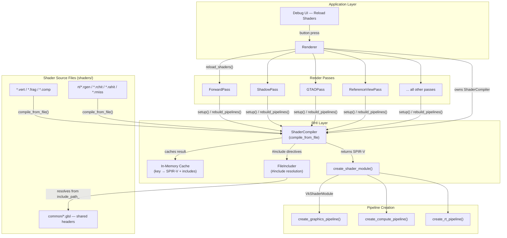
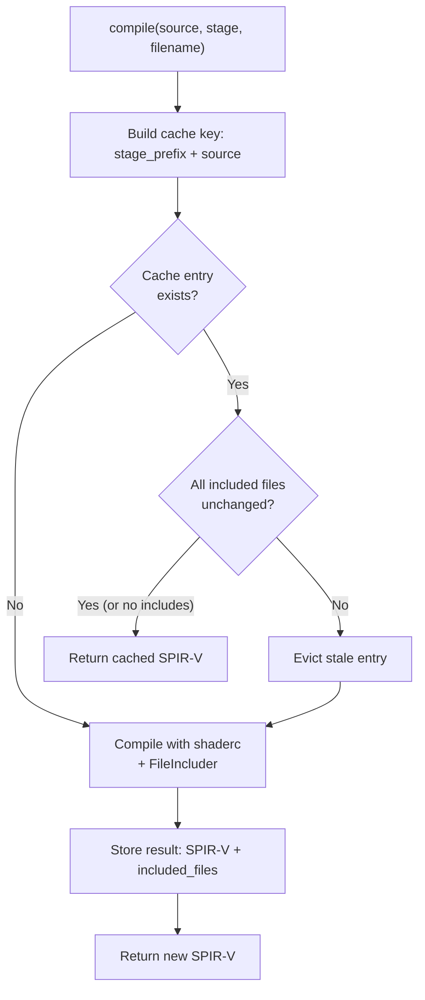
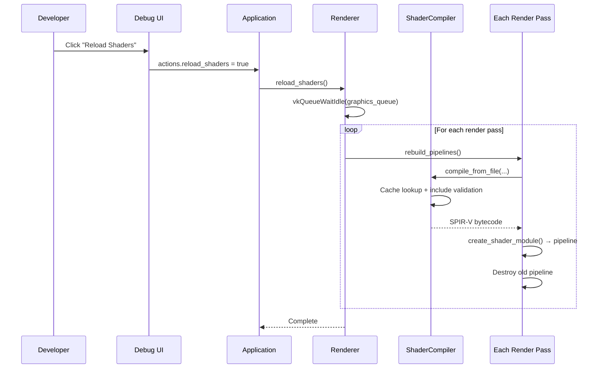

The Himalaya renderer does not ship pre-compiled SPIR-V binaries. Instead, every shader is compiled from GLSL source at application startup using **shaderc**, with the results cached in memory for fast repeat access. This design choice enables a single-button hot-reload workflow: press *Reload Shaders* in the debug UI, and the compiler re-reads every `.vert`, `.frag`, `.comp`, and `.rgen`/`.rchit`/`.rahit`/`.rmiss` file from disk, recompiles to SPIR-V, and reconstructs all Vulkan pipelines — without restarting the application.

Sources: [shader.h](https://github.com/1PercentSync/himalaya/blob/main/rhi/include/himalaya/rhi/shader.h#L1-L110), [shader.cpp](https://github.com/1PercentSync/himalaya/blob/main/rhi/src/shader.cpp#L1-L237)

## Architecture Overview

The compilation pipeline spans three layers of the codebase, each with a distinct responsibility:

| Layer | Component | Role |
|---|---|---|
| **RHI** | `ShaderCompiler` | GLSL → SPIR-V compilation, include resolution, in-memory caching |
| **RHI** | `create_shader_module()` | SPIR-V bytecode → `VkShaderModule` |
| **RHI** | `create_*_pipeline()` | Shader modules → Vulkan pipeline objects |
| **Passes** | Each render pass | Owns pipelines, calls compiler during `setup()` and `rebuild_pipelines()` |
| **Application** | `Renderer` | Owns the `ShaderCompiler` instance, dispatches hot-reload |



Sources: [renderer.h](https://github.com/1PercentSync/himalaya/blob/main/app/include/himalaya/app/renderer.h#L318-L319), [pipeline.h](https://github.com/1PercentSync/himalaya/blob/main/rhi/include/himalaya/rhi/pipeline.h#L1-L125), [rt_pipeline.h](https://github.com/1PercentSync/himalaya/blob/main/rhi/include/himalaya/rhi/rt_pipeline.h#L1-L109)

## The ShaderCompiler — GLSL to SPIR-V at Runtime

`ShaderCompiler` is a stateful class owned by the `Renderer`. Its single point of configuration is the **include root** — the directory from which all `#include` directives are resolved. During initialization, the renderer sets this to `"shaders"`:

```cpp
shader_compiler_.set_include_path("shaders");
```

Sources: [renderer.h](https://github.com/1PercentSync/himalaya/blob/main/app/include/himalaya/app/renderer.h#L318-L319), [renderer_init.cpp](https://github.com/1PercentSync/himalaya/blob/main/app/src/renderer_init.cpp#L270)

### Compilation Entry Point: `compile_from_file()`

The public API is a single method: `compile_from_file(path, stage)`. The `path` is relative to the include root (e.g., `"forward.frag"` or `"rt/reference_view.rgen"`). The `stage` parameter is one of seven `ShaderStage` enum values — `Vertex`, `Fragment`, `Compute`, `RayGen`, `ClosestHit`, `AnyHit`, or `Miss`.

Internally, `compile_from_file()` reads the file into a string and delegates to a private `compile()` method that handles caching and include tracking. On success it returns a `std::vector<uint32_t>` of SPIR-V words; on failure it returns an empty vector, which the calling pass detects and uses to **keep the previous pipeline intact** (a fault-tolerance pattern described later in [Hot Reload](#hot-reload-shader-recompilation-at-runtime)).

Sources: [shader.h](https://github.com/1PercentSync/himalaya/blob/main/rhi/include/himalaya/rhi/shader.h#L38-L51), [shader.cpp](https://github.com/1PercentSync/himalaya/blob/main/rhi/src/shader.cpp#L123-L142), [types.h](https://github.com/1PercentSync/himalaya/blob/main/rhi/include/himalaya/rhi/types.h#L78-L86)

### Stage Mapping and shaderc Configuration

The compiler maps `ShaderStage` to `shaderc_shader_kind` internally — there is no file-extension-based inference. The caller is responsible for specifying the correct stage:

| `ShaderStage` | `shaderc_shader_kind` | Typical file extension |
|---|---|---|
| `Vertex` | `shaderc_glsl_vertex_shader` | `.vert` |
| `Fragment` | `shaderc_glsl_fragment_shader` | `.frag` |
| `Compute` | `shaderc_glsl_compute_shader` | `.comp` |
| `RayGen` | `shaderc_glsl_raygen_shader` | `.rgen` |
| `ClosestHit` | `shaderc_glsl_closesthit_shader` | `.rchit` |
| `AnyHit` | `shaderc_glsl_anyhit_shader` | `.rahit` |
| `Miss` | `shaderc_glsl_miss_shader` | `.rmiss` |

The shaderc target environment is Vulkan 1.4. Optimization is **build-configuration dependent**: debug builds use `-O0` with debug info (enabling full source mapping in RenderDoc), while release builds apply performance optimization:

```cpp
options.SetTargetEnvironment(shaderc_target_env_vulkan, shaderc_env_version_vulkan_1_4);
#ifdef NDEBUG
    options.SetOptimizationLevel(shaderc_optimization_level_performance);
#else
    options.SetOptimizationLevel(shaderc_optimization_level_zero);
    options.SetGenerateDebugInfo();
#endif
```

Sources: [shader.cpp](https://github.com/1PercentSync/himalaya/blob/main/rhi/src/shader.cpp#L90-L101), [shader.cpp](https://github.com/1PercentSync/himalaya/blob/main/rhi/src/shader.cpp#L181-L190)

## Include Resolution — The FileIncluder

Himalaya's GLSL shaders make heavy use of `#include` to share binding declarations, BRDF functions, and utility code across stages. For example, `forward.frag` includes five shared headers:

```glsl
#include "common/bindings.glsl"
#include "common/normal.glsl"
#include "common/brdf.glsl"
#include "common/shadow.glsl"
#include "common/transform.glsl"
```

The `FileIncluder` class implements shaderc's `IncluderInterface` to resolve these directives at compile time. It supports two resolution modes based on include syntax:

| Syntax | `shaderc_include_type` | Resolution rule |
|---|---|---|
| `#include "path"` | `relative` | Relative to the *requesting file's directory* |
| `#include <path>` | `standard` | Directly from the include root |

Both modes resolve within the root directory set via `set_include_path()`. There is no fallback between modes — a relative include always resolves relative to the requesting file, a standard include always resolves from the root.

Sources: [shader.cpp](https://github.com/1PercentSync/himalaya/blob/main/rhi/src/shader.cpp#L11-L86), [forward.frag](https://github.com/1PercentSync/himalaya/blob/main/shaders/forward.frag#L17-L21)

## In-Memory Cache with Transitive Invalidation

The `ShaderCompiler` maintains an in-memory cache that avoids redundant recompilation when the same shader is requested multiple times (which happens when multiple passes share the same shader module, or during hot-reload when only some files changed).

### Cache Key Construction

The cache key is built by prepending a **single-character stage prefix** to the full source text:

```
"V" + source_text    // Vertex shader
"F" + source_text    // Fragment shader
"C" + source_text    // Compute shader
"R" + source_text    // RayGen
```

This ensures that identical GLSL source compiled for different stages produces separate cache entries. The prefix is collision-free because valid GLSL source always starts with `#version`, never with a stage prefix character.

Sources: [shader.cpp](https://github.com/1PercentSync/himalaya/blob/main/rhi/src/shader.cpp#L103-L116)

### Include-Aware Cache Validation

The critical challenge is detecting when a **transitively included header** changes. The cache stores not just the SPIR-V output, but also a list of all files that were resolved during compilation — each as a `(path, content)` pair. On cache lookup, the compiler performs a three-step validation:

1. **Primary key match** — does the stage prefix + source text match an existing entry?
2. **Include verification** — re-reads every previously included file from disk and compares content.
3. **Invalidate if stale** — if any included file changed (or cannot be read), the cache entry is evicted and recompilation occurs.



This design means that editing `common/brdf.glsl` and pressing *Reload Shaders* will correctly invalidate every shader that transitively includes it — without recompiling shaders that don't depend on the changed header.

Sources: [shader.h](https://github.com/1PercentSync/himalaya/blob/main/rhi/include/himalaya/rhi/shader.h#L70-L93), [shader.cpp](https://github.com/1PercentSync/himalaya/blob/main/rhi/src/shader.cpp#L144-L218)

## SPIR-V to VkShaderModule and Pipeline Creation

Once the compiler returns SPIR-V bytecode, the pipeline follows a two-step sequence:

### Step 1: Shader Module Creation

`create_shader_module()` wraps the SPIR-V words in a `VkShaderModuleCreateInfo` and calls `vkCreateShaderModule`. The returned `VkShaderModule` is a **short-lived object** — it is created immediately before pipeline creation and destroyed immediately after. The Vulkan pipeline absorbs the SPIR-V during creation, so the module handle is no longer needed.

### Step 2: Pipeline Assembly

Three pipeline creation functions consume shader modules, each producing a `Pipeline` (or `RTPipeline`) struct that bundles the Vulkan pipeline handle with its layout:

| Function | Shader stages | Pipeline type |
|---|---|---|
| `create_graphics_pipeline()` | VS, optional FS | Graphics (Dynamic Rendering) |
| `create_compute_pipeline()` | CS | Compute |
| `create_rt_pipeline()` | RayGen, Miss, ClosestHit, optional AnyHit | Ray Tracing + SBT |

For RT pipelines, `create_rt_pipeline()` also handles the complete **Shader Binding Table** construction — querying group handles from the created pipeline, writing them into an aligned host-visible buffer, and pre-computing the `VkStridedDeviceAddressRegionKHR` regions needed for `vkCmdTraceRaysKHR`.

Sources: [shader.cpp](https://github.com/1PercentSync/himalaya/blob/main/rhi/src/shader.cpp#L220-L237), [pipeline.cpp](https://github.com/1PercentSync/himalaya/blob/main/rhi/src/pipeline.cpp#L9-L189), [rt_pipeline.cpp](https://github.com/1PercentSync/himalaya/blob/main/rhi/src/rt_pipeline.cpp#L12-L197)

## Hot Reload: Shader Recompilation at Runtime

The hot-reload system allows developers to modify GLSL files while the application is running, then apply changes with a single button press in the debug UI.

### Trigger Flow



Sources: [debug_ui.cpp](https://github.com/1PercentSync/himalaya/blob/main/app/src/debug_ui.cpp#L666-L668), [application.cpp](https://github.com/1PercentSync/himalaya/blob/main/app/src/application.cpp#L478-L480), [renderer_init.cpp](https://github.com/1PercentSync/himalaya/blob/main/app/src/renderer_init.cpp#L659-L676)

### Safety Guarantees

The hot-reload system implements two critical safety patterns:

**GPU synchronization.** `reload_shaders()` calls `vkQueueWaitIdle()` before touching any pipeline. This ensures no GPU work is in-flight when pipelines are destroyed and recreated.

**Fail-safe compilation.** Each pass's `rebuild_pipelines()` method follows an identical pattern: compile all shaders first, check for empty SPIR-V results, and only destroy the old pipeline if compilation succeeded. This means a syntax error in a modified shader does not crash the renderer — it logs a warning and continues running with the previous working pipeline:

```cpp
void ForwardPass::create_pipelines(const uint32_t sample_count) {
    const auto vert_spirv = sc_->compile_from_file("forward.vert", rhi::ShaderStage::Vertex);
    const auto frag_spirv = sc_->compile_from_file("forward.frag", rhi::ShaderStage::Fragment);

    if (vert_spirv.empty() || frag_spirv.empty()) {
        spdlog::warn("ForwardPass: shader compilation failed, keeping previous pipeline");
        return;  // Old pipeline remains valid
    }

    // Safe to destroy and rebuild — both shaders compiled successfully
    if (pipeline_.pipeline != VK_NULL_HANDLE) {
        pipeline_.destroy(ctx_->device);
    }
    // ... create new pipeline ...
}
```

Sources: [renderer_init.cpp](https://github.com/1PercentSync/himalaya/blob/main/app/src/renderer_init.cpp#L659-L676), [forward_pass.cpp](https://github.com/1PercentSync/himalaya/blob/main/passes/src/forward_pass.cpp#L59-L101), [gtao_pass.cpp](https://github.com/1PercentSync/himalaya/blob/main/passes/src/gtao_pass.cpp#L83-L114)

### Passes Covered by Hot Reload

The `reload_shaders()` method rebuilds pipelines for every pass in the renderer. This includes all rasterization passes, compute post-processing passes, and (conditionally) the ray tracing pass:

| Pass | Pipeline type | Shader files |
|---|---|---|
| ShadowPass | Graphics (×2: opaque + masked) | `shadow.vert`, `shadow_masked.frag` |
| DepthPrePass | Graphics | `depth_prepass.vert`, `depth_prepass.frag`, `depth_prepass_masked.frag` |
| ForwardPass | Graphics | `forward.vert`, `forward.frag` |
| SkyboxPass | Graphics | `skybox.vert`, `skybox.frag` |
| TonemappingPass | Graphics | `fullscreen.vert`, `tonemapping.frag` |
| GTAOPass | Compute | `gtao.comp` |
| AOSpatialPass | Compute | `ao_spatial.comp` |
| AOTemporalPass | Compute | `ao_temporal.comp` |
| ContactShadowsPass | Compute | `contact_shadows.comp` |
| ReferenceViewPass | Ray Tracing | `rt/reference_view.rgen`, `rt/closesthit.rchit`, `rt/miss.rmiss`, `rt/shadow_miss.rmiss`, `rt/anyhit.rahit` |

The `ReferenceViewPass` is only rebuilt when `ctx_->rt_supported` is true, since it requires hardware ray tracing support.

Sources: [renderer_init.cpp](https://github.com/1PercentSync/himalaya/blob/main/app/src/renderer_init.cpp#L659-L675), [reference_view_pass.cpp](https://github.com/1PercentSync/himalaya/blob/main/passes/src/reference_view_pass.cpp#L122-L184)

## Build System Integration

### shaderc Dependency

The shaderc library is linked as a transitive dependency of the RHI layer through vcpkg:

```cmake
# rhi/CMakeLists.txt
find_package(unofficial-shaderc CONFIG REQUIRED)
target_link_libraries(himalaya_rhi PUBLIC unofficial::shaderc::shaderc)
```

Sources: [rhi/CMakeLists.txt](https://github.com/1PercentSync/himalaya/blob/main/rhi/CMakeLists.txt#L16-L23)

### Shader File Deployment

CMake copies the entire `shaders/` directory to the build output directory as a post-build step, ensuring the runtime `set_include_path("shaders")` resolves correctly relative to the executable:

```cmake
# app/CMakeLists.txt
add_custom_command(TARGET himalaya_app POST_BUILD
    COMMAND ${CMAKE_COMMAND} -E rm -rf $<TARGET_FILE_DIR:himalaya_app>/shaders
    COMMAND ${CMAKE_COMMAND} -E copy_directory
        ${CMAKE_SOURCE_DIR}/shaders $<TARGET_FILE_DIR:himalaya_app>/shaders
)
```

An additional shell script `scripts/sync-shaders.sh` is provided for manual synchronization during development, using `rsync` to mirror the source shader directory into the debug build output.

Sources: [app/CMakeLists.txt](https://github.com/1PercentSync/himalaya/blob/main/app/CMakeLists.txt#L22-L29), [sync-shaders.sh](https://github.com/1PercentSync/himalaya/blob/main/scripts/sync-shaders.sh#L1-L18)

## What Comes Next

The shader compilation pipeline produces `VkShaderModule` objects that feed directly into pipeline creation. The three pipeline types (graphics, compute, RT) each have distinct configuration paths detailed in their respective documentation. On the GLSL side, the shared headers — particularly `bindings.glsl` — define the descriptor layout contract that must be maintained across the C++/shader boundary.

**Suggested reading order:**
- [GLSL Shader Architecture — Shared Bindings, BRDF Library, and Feature Flags](https://github.com/1PercentSync/himalaya/blob/main/25-glsl-shader-architecture-shared-bindings-brdf-library-and-feature-flags) — understand what the compiled shaders contain
- [Bindless Descriptor Architecture — Three-Set Layout and Texture Registration](https://github.com/1PercentSync/himalaya/blob/main/7-bindless-descriptor-architecture-three-set-layout-and-texture-registration) — how shader bindings connect to the descriptor system
- [Render Graph — Automatic Barrier Insertion and Pass Orchestration](https://github.com/1PercentSync/himalaya/blob/main/9-render-graph-automatic-barrier-insertion-and-pass-orchestration) — how compiled pipelines are used at frame time